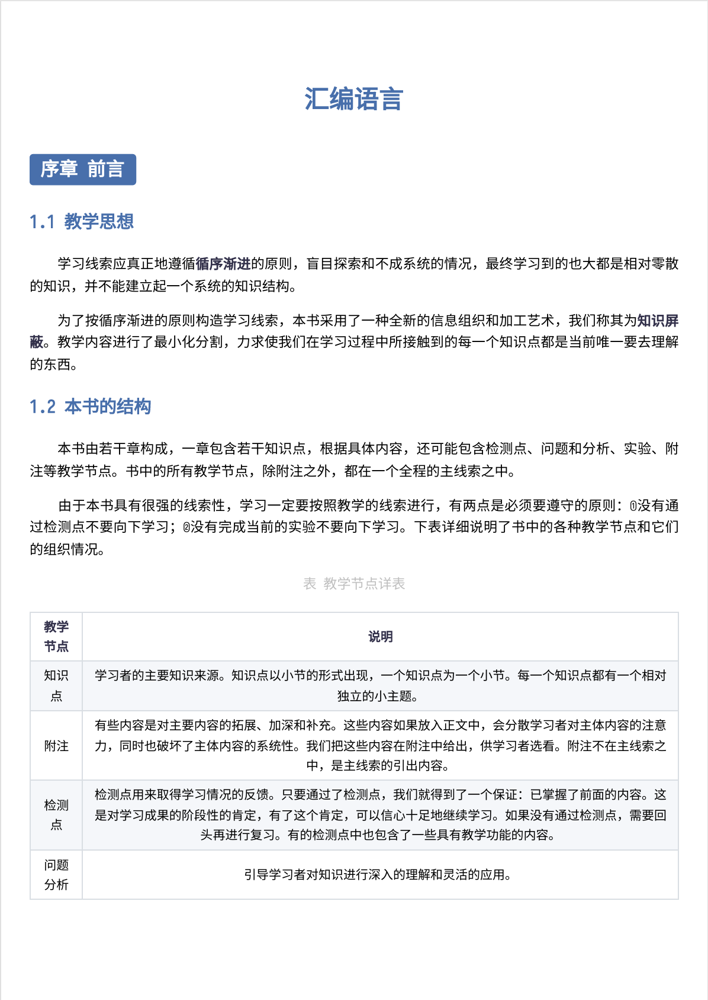

# 汇编语言

## 项目简介

* 本项目与《汇编语言-第四版》[王爽] 配套

## 项目内容

* 包含本书的全部内容，包括但不限于检测点、实验以及课程设计等
* 插图、源代码及实验有关文件在相应的文件夹内
* 附有 DOSBox 0.74 方便学习使用

## 注意事项

* 使用 Typora(1.10.8 Version) 编辑器编辑，部分 md 编辑器可能有些语法无法支持
* 除了某些特定行列外，表格内容默认左对齐，为了美观可以为正文表格内容设置 CSS 样式自动居中

* 欢迎⭐️star⭐️项目，有任何疑问或者问题欢迎提出 issue 或联系：[novpath@gmail.com](mailto:novpath@gmail.com)

## Commit-emoji 图例

| 序号 | emoji      | 在本项目中的含义                   | 简写标记     |
| ---- | ---------- | ---------------------------------- | ------------ |
| ①    | :tada:     | 初始化项目                         | `:tada:`     |
| ②    | :memo:     | 更新文档，包括但不限于 README      | `:memo:`     |
| ③    | :bulb:     | 发布新的源码或新的文件             | `:bulb:`     |
| ④    | :recycle:  | 重构，主要指修改已有的源码与注释   | `:recycle:`  |
| ⑤    | :pencil2:  | 校对，主要指更正错别字、更新注释等 | `:pencil2:`  |
| ⑥    | :bug:      | 修复代码中的 BUG                   | `:bug:`      |
| ⑦    | :sparkles: | 排版、样式、新功能更新             | `:sparkles:`​ |

## 预览图

