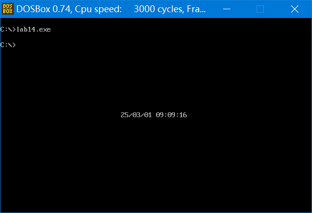

## 第 14 章 端口

​	我们前面讲过，各种存储器都和 CPU 的地址线、数据线、控制线相连。CPU 在操控它们的时候，把它们都当作内存来对待，把它们总地看做一个由若干存储单元组成的逻辑存储器，这个逻辑存储器我们称其为**内存地址空间**(可参见 1.15 节)。

​	在 PC 机系统中，和 CPU 通过总线相连接的芯片除各种存储器外，还有以下 3 种芯片。
1. 各种接口卡(比如，网卡、显卡)上的接口芯片，它们控制接口卡进行工作；
2. 主板上的接口芯片，CPU 通过它们对部分外设进行访问；
3. 其他芯片，用来存储相关的系统信息，或进行相关的输入输出处理。

​	在这些芯片中，都有一组可以由 CPU 读写的寄存器。这些寄存器，它们在物理上可能处于不同的芯片中，但是它们在以下两点上相同：
1. 都和 CPU 的总线相连，当然这种连接是通过它们所在的芯片进行的；
2. CPU 对它们进行读写的时候都通过控制线向它们所在的芯片发出端口读写命令。

​	可见，从 CPU 的角度，将这些寄存器都当作端口，对它们进行统一编址，从而建立了一个统一的端口地址空间。每一个端口在地址空间中都有一个地址。

​	CPU 可以直接读写以下 3 个地方的数据。

1. CPU内部的寄存器；
2. 内存单元；
3. 端口。

### 14.1 端口的读写

​	在访问端口的时候，CPU 通过端口地址来定位端口。因为端口所在的芯片和 CPU 通过总线相连，所以，端口地址和内存地址一样，通过地址总线来传送。在 PC 系统中，CPU 最多可以定位 64KB 个不同的端口。则端口地址的范围为 0~65535。

​	对端口的读写不能用 mov、push、pop 等内存读写指令。端口的读写指令只有两条：in 和 out，分别用于从端口读取数据和往端口写入数据。

​	我们看一下CPU执行内存访问指令和端口访问指令时，总线上的信息：

​	(1) 访问内存:

```assembly
mov ax,ds:[8] ;假设执行前(ds)=0  
```

​	执行时与总线相关的操作如下所示。  

* ① CPU 通过地址线将地址信息 8 发出
* ② CPU 通过控制线发出内存读命令，选中存储器芯片，并通过它，将要从中读取数据
* ③ 存储器将 8 号单元中的数据通过数据线送入 CPU。  

(2) 访问端口：  

```assembly
in al,60h 	;从 60h 号端口读入一个字节  
```

执行时与总线相关的操作如下。  

* ① CPU 通过地址线将地址信息 60h 发出
* ② CPU 通过控制线发出端口读命令，选中端口所在的芯片，并通过它，将要从中读取数据
* ③ 端口所在的芯片将 60h 端口中的数据通过数据线送入 CPU  

​	注意，在 in 和 out 指令中，只能使用 ax 或 al 来存放从端口中读入的数据或要发送到端口中的数据。访问 8 位端口时用 al，访问 16 位端口时用 ax。  

​	对 0~255 以内的端口进行读写时（可以直接使用立即数）： 

```assembly
in al,20h 	;从 20h 端口读入一个字节  
out 20h,al 	;往 20h 端口写入一个字节  
```

对 256~65535 的端口进行读写时，端口号放在 dx 中：  

```assembly
mov dx,3f8h 	;将端口号 3f8h 送入 dx  
in al,dx 		;从 3f8h 端口读入一个字节  
out dx,al 		;向 3f8h 端口写入一个字节  
```

### 14.2 CMOS RAM 芯片  

​	下面的内容中，我们通过对 **CMOS RAM 的读写**来体会一下对端口的访问。  

​	PC 机中，有一个 CMOS RAM 芯片，一般简称为 CMOS。此芯片的特征如下。 

* (1) 包含一个实时钟和一个有 128 个存储单元的 RAM 存储器(早期的计算机为 64 个字节)。 
* (2) 该芯片靠电池供电。所以，关机后其内部的实时钟仍可正常工作，RAM 中的信息不丢失。 
* (3) 128 个字节的 RAM 中，内部实时钟占用 0~0dh 单元来保存时间信息，其余大部分单元用于保存系统配置信息，供系统启动时 BIOS 程序读取。BIOS 也提供了相关的程序，使我们在开机的时候配置 CMOS RAM 中的系统信息。
* (4) 该芯片内部有两个端口，端口地址为 70h 和 71h。CPU 通过这两个端口来读写 CMOS RAM。
* (5) **70h 为地址端口**，存放要访问的 CMOS RAM 单元的地址；**71h 为数据端口**，存放从选定的 CMOS RAM 单元中读取的数据，或要写入到其中的数据。可见，CPU 对 CMOS RAM 的读写分两步进行，比如，读 CMOS RAM 的 2 号单元：
  * ① 将 2 送入端口 70h；
  * ② 从端口 71h 读出 2 号单元的内容。

### 14.a 检测点

(1) 编程，读取 CMOS RAM 的 2 号单元的内容。

解析：

* 注意读是 in，写是 out 即可
* 可能会对 mov 指令中，源操作数和目标操作数顺序与 in/out 指令中的顺序有疑惑，可以对比来看，`mov ax(目标),bx(源)`，`in ax(目标-微处理器),0x1f0(源-外部设备)`，`out 0x80(目标-外部设备),al(源-微处理器)`，可见两者“**目标在左，源在右**”的内在逻辑是一样的。

```assembly
mov al,2
out 70h,al
in al,71h
```

(2) 编程，向 CMOS RAM 的 2 号单元写 0。

```assembly
mov al,2
out 70h,al
mov al,0
out 71h,al
```

### 14.3 shl 和 shr 指令

​	**shl 和 shr (shift left / shift right)**是**逻辑移位指令**，后面的课程中我们要用到移位指令，这里进行一下讲解。

​	shl 是逻辑左移指令，它的功能为：

* (1) 将一个寄存器或内存单元中的数据向左移位；
* (2) 将最后移出的一位写入 CF 中；
* (3) 最低位用 0 补充。

指令：

```assembly
mov al,01001000b 	
shl al,1 			;将al中的数据左移一位
```

执行后(al)=10010000b，CF=0。

我们来看一下`shl al,1`的操作过程。

(1) 左移

* 原数据：&ensp;01001000
* 左移后：01001000

(2) 将最后移出的一位写入 CF 中

* 原数据：01001000
* 左移后：1001000    CF=0

(3) 最低位用 0 补充

* 原数据：01001000
* 左移后：10010000

​	如果接着上面，继续执行一条 shl al,1，则执行后：(al)=00100000b，CF=1。shl 指令的操作过程如下。

(1) 左移

* 原数据：&ensp;10010000
* 左移后：10010000

(2) 将最后移出的一位写入 CF 中

* 原数据：10010000
* 左移后：0010000     CF=1

(3) 最高位用 0 补充

* 原数据：10010000
* 左移后：00100000

如果移动位数大于 1 时，必须将移动位数放在 cl 中。

比如，指令：

```assembly
mov al,01010001b
mov cl,3
shl al,cl
```

执行后(al)=10001000b，因为最后移出的一位是 0，所以 CF=0。

可以看到，将 X 逻辑左移一位，相当于执行 X=X*2。

比如：
```assembly
mov al,00000001b 	;执行后(al)=00000001b=1
shl al,1        	;执行后(al)=00000010b=2
shl al,1        	;执行后(al)=00000100b=4
shl al,1        	;执行后(al)=00001000b=8
mov cl,3
shl al,cl      	 	;执行后(al)=01000000b=64
```

shr 是逻辑右移指令，它和 shr 所进行的操作刚好相反。

(1) 将一个寄存器或内存单元中的数据向右移位；

(2) 将最后移出的一位写入 CF 中；

(3) 最高位用 0 补充。

指令：
```assembly
mov al,10000001b ;将 al 中的数据右移一位
shr al,1         ;执行后(al)=01000000b，CF=1。
```

​	执行后(al)=01000000b，CF=1。

​	如果接着上面，继续执行一条 shr al,1，则执行后：(al)=00100000b，CF=0。

​	如果移动位数大于 1 时，必须将移动位数放在 cl 中。

​	比如，指令：

```assembly
mov al,01010001b
mov cl,3
shr al,cl
```

​	执行后(al)=00001010b，因为最后移出的一位是 0，所以 CF=0。

​	可以看出将 X 逻辑右移一位，相当于执行 X=X/2。

### 14.b 检测点

​	编程，用加法和移位指令计算(ax)=(ax)*10。

​	提示，(ax)\*10=(ax)\*2+(ax)\*8。

---

解析：

* 左右移动超过 1 位要用 cl。
* 执行 shl 或 shr 之后，ax 的值就变了，所以考虑可以用一个新寄存器 dx 存储初始的 ax 值，用来左移三位。

```assembly
mov dx,ax
shl ax,1
mov cl,3
shl dx,cl
add ax,dx
```

### 14.4 CMOS RAM 中存储的时间信息

​	在 CMOS RAM 中，存放着当前的时间：年、月、日、时、分、秒。这 6 个信息的长度都为 1 个字节，存放单元为：

​	秒：0 	分：2 	时：4 	日：7 	月：8 	年：9

​	这些数据以 **BCD 码(Binary-Coded Decimal‎)**的方式存放。

​	BCD 码是以 4 位二进制数表示十进制数码的编码方法，如下所示。

| 十进制数码    | 0    | 1    | 2    | 3    | 4    | 5    | 6    | 7    | 8    | 9    |
| ------------- | ---- | ---- | ---- | ---- | ---- | ---- | ---- | ---- | ---- | ---- |
| 对应的 BCD 码 | 0000 | 0001 | 0010 | 0011 | 0100 | 0101 | 0110 | 0111 | 1000 | 1001 |

​	比如，数值 26，用 BCD 码表示为：0010 0110。

​	可见，一个字节可表示两个 BCD 码。则 CMOS RAM 存储时间信息的单元中，存储了用两个 BCD 码表示的两位十进制数，高 4 位的 BCD 码表示十位，低 4 位的 BCD 码表示个位。比如，00010100b 表示 14。

【编程】在屏幕中间显示当前的月份。

​	分析，这个程序主要做以下两部分工作。
(1) 从 CMOS RAM 的 8 号单元读出当前月份的 BCD 码。

​	要读取 CMOS RAM 的信息，首先要向地址端口 70h 写入要访问的单元的地址：

```assembly
mov al,8
out 70h,al
```

然后从数据端口 71h 中取得指定单元中的数据：

```assembly
in al,71h
```

(2) 将用 BCD 码表示的月份以十进制的形式显示到屏幕上。

​	我们可以看出，BCD 码值=十进制数码值，则 BCD 码值+30h = 十进制数对应的 ASCII 码。

​	从 CMOS RAM 的 8 号单元读出的一个字节中，包含了用两个 BCD 码表示的两位十进制数，高 4 位的 BCD 码表示十位，低 4 位的 BCD 码表示个位。比如，00010100b 表示 14。

我们需要进行以下两步工作。

​	① 将从 CMOS RAM 的 8 号单元中读出的一个字节，分为两个表示 BCD 码值的数。

```assembly
mov ah,al 			;al 中为从 CMOS RAM 的 8 号单元中读出的数据
mov cl,4
shr ah,cl 			;ah 中为月份的十位数码值
and al,00001111b 	;al 中为月份的个位数码值
```

② 显示(ah)+30h和(al)+30h对应的 ASCII 码字符。

完整的程序如下。

```assembly
assume cs:code
code segment
start: 
	mov al,8
	out 70h,al
	in al,71h
	
	mov ah,al
	mov cl,4
	shr ah,cl
	and al,00001111b
	
	add ah,30h
	add al,30h
	
	mov bx,0b800h
	mov es,bx
	mov byte ptr es:[160*12+40*2],ah 	;显示月份的十位数
	mov byte ptr es:[160*12+40*2+2],al 	;接着显示月份的个位数
	
	mov ax,4c00h
	int 21h
	
code ends
end start
```

### 实验 14 访问 CMOS RAM

​	编程，以“年/月/日 时:分:秒”的格式，显示当前的日期、时间。

​	注意：CMOS RAM 中存储着系统的配置信息，除了保存时间信息的单元外，不要向其他的单元中写入内容，否则将引起一些系统错误。

---

解答：

* 程序思路：指定单元号和偏移量，利用 out/ in 指令从对应单元读出两个字节，右移四位获得十位数，and 运算获得个位数，+30h 得到对应字符的 ASCII码，将上述过程封装成子程序重复此过程即可。注意，数位之间要添加分隔符号“\”以及“:”，对应偏移量也需要变化。
* 注意的问题：
  * 很多重复操作可以封装子程序多次调用以简化流程
  * 子程序内涉及变量 si 的改动，可以不压栈，或者本程序是压栈之后利用 bp 修改。

```assembly
assume cs:code
code segment
start: 
	mov ax,0b800h				
	mov es,ax					;es定位显存区

	mov al,9					;指定第 9 单元
	mov di,160*12+31*2			;偏移量
	call printime				;打印日期/时间的十位和个位
	mov byte ptr es:[di],'/'	;打印分隔符
	add di,2					;指向下一个位置
	
	mov al,8
	call printime
	mov byte ptr es:[di],'/'
	add di,2
	
	mov al,7
	call printime
	add di,2
	
	mov al,4
	call printime
	mov byte ptr es:[di],':'
	add di,2
	
	mov al,2
	call printime
	mov byte ptr es:[di],':'
	add di,2
	
	mov al,0
	call printime
	
	mov ax,4c00h
	int 21h
;---
;名称：打印日期子程序printime
;参数：端口号、偏移量di
;返回：无
;---
printime:
	push ax
	push cx
	push bx
	push di
	push es
print:
	out 70h,al
	in al,71h
	
	mov ah,al
	mov cl,4
	shr ah,cl
	and al,00001111b
	
	add ah,30h
	add al,30h
	
	mov bx,0b800h
	mov es,bx
	
	mov byte ptr es:[di],ah 	;显示日期十位数
	mov byte ptr es:[di+2],al 	;接着显示日期的个位数
	mov bp,sp
	add word ptr [bp+2],4
	pop es
	pop di
	pop bx
	pop cx
	pop ax
	ret
	
	mov ax,4c00h
	int 21h
	
code ends
end start

```



<center style="color:#C0C0C0">图14.5 显示日期-时间程序</center>
