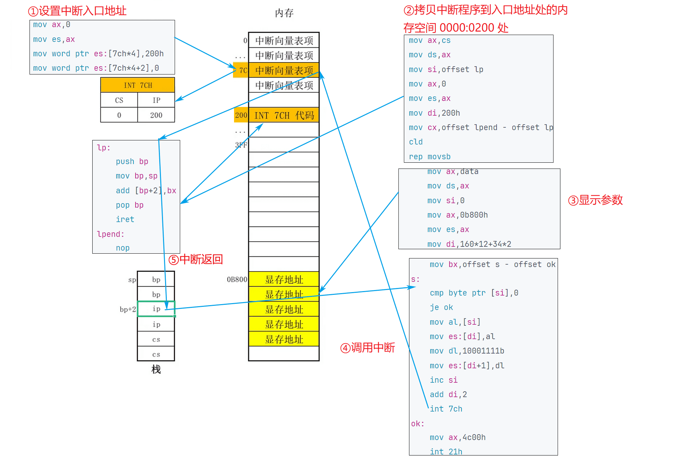

## 第 13 章 int 指令

​	中断信息可以来自 CPU 的内部和外部，当 CPU 的内部有需要处理的事情发生的时候，将产生需要马上处理的中间信息，引发中断过程。在第 12 章中，我们讲解了中断过程和两种内中断的处理。

​	这一章中，我们讲解另一种重要的内中断，由 int 指令引发的中断。

### 13.1 int 指令

​	int 指令的格式为：`int n`，n 为中断类型码，它的功能是引发中断过程。

​	CPU 执行 int n 指令，相当于引发一个 n 号中断的中断过程，执行过程如下：

* (1) 取中断类型码 n；
* (2) 标志寄存器入栈，IF=0，TF=0；
* (3) CS、IP 入栈；
* (4) (IP)=(n\*4)，(CS)=(n\*4+2)。

​	从此处转去执行 n 号中断的中断处理程序。

​	可以在程序中使用 int 指令调用任何一个中断的中断处理程序。例如，下面的程序：

```assembly
assume cs:code
code segment
start:
	mov ax,0b800h
	mov es,ax
	mov byte ptr es:[12*160+40*2], '!' 
	int 0
code ends
end start
```

​	这个程序在 Windows 2000 中的 DOS 方式下执行时，将在屏幕中间显示一个“!”，然后显示“Divide overflow”后返回到系统中。“!”是我们编程显示的，而“Divide overflow”是哪里来的呢？我们的程序中又没有做除法，不可能产生除法溢出。

​	程序是没有做除法，但是在结尾使用了 int 0 指令。CPU 执行 int 0 指令时，将引发中断过程，执行 0 号中断处理程序，而系统设置的 0 号中断处理程序的功能是显示“Divide overflow”，然后返回到系统。

​	可见，int指令的最终功能和call指令相似，都是调用一段程序。

​	一般情况下，系统将一些具有一定功能的子程序，以中断处理程序的方式提供给应用程序调用。我们在编程的时候，可以用 int 指令调用这些子程序。当然，也可以自己编写一些中断处理程序供别人使用。以后，我们可以将中断处理程序简称为**中断例程**。

### 13.2 编写供应用程序调用的中断例程

​	前面，我们已经编写过中断 0 的中断例程了，现在在我们讨论可以供应用程序调用的中断例程的编写方法。下面通过两个问题来讨论。

【问题一】编写、安装中断 7ch 的中断例程。

> 功能：求一个 word 型数据的平方。
> 参数：(ax)=要计算的数据。
> 返回值：dx、ax 中存放结果的高16位和低16位。

应用举例：求2*3456^2。

```assembly
assume cs:code
code segment
start: 
	mov ax,3456 	;(ax)=3456
	int 7ch			;调用中断7ch的中断例程，计算ax中的数据的平方
	add ax,ax
	adc dx,dx  		;dx:ax 存放结果，将结果乘以2
	mov ax,4c00h
	int 21h
code ends
end start
```

分析一下，我们要做以下三部分工作：

​	(1) 编写实现求平方功能的程序；

​	(2) 安装程序，将其安装在 0:200 处；

​	(3) 设置中断向量表，将程序的入口地址保存在 7ch 表项中，使其成为中断 7ch 的中断例程。

​	安装程序如下：

```assembly
assume cs:code
code segment
start: 
	mov ax,cs
	mov ds,ax
	mov si, offset sqr	; 设置 ds:si 指向源地址
	mov ax, 0
	mov es, ax
	mov di, 200h 		; 设置 es:di 指向目的地址
	mov cx, offset sarend - offset sqr ; 设置 cx 为传输长度
	cld ; 设置传输方向为正
	rep movsb

	mov ax, 0
	mov es, ax
	mov word ptr es:[7ch*4],200h
	mov word ptr es:[7ch*4+2],0

	mov ax, 400h
	int 21h
sqr:
	mul ax
	iret
sarend:
	nop

code ends
end start
```

​	注意，在中断例程 sqr 的最后，要使用 iret 指令。用汇编语法描述，iret 指令的功能为：

```assembly
pop IP
pop CS
popf
```

​	CPU 执行 int 7ch 指令进入中断例程之前，标志寄存器、当前的 CS 和 IP 被压入栈中，在执行完中断例程后，应该用 iret 指令恢复 int 7ch 执行前的标志寄存器和 CS、IP 的值，从而接着执行应用程序。

​	**int 指令和 iret 指令的配合使用**与 call 指令和 ret 指令的配合使用具有相似的思路。

【问题二】编写、安装中断 7ch 的中断例程。

> 功能：将一个全是字母，以 0 结尾的字符串，转化为大写。
>
> 参数：ds:si 指向字符串的首地址。

应用举例：将 data 段中的字符串转化为大写。

```assembly
assume cs:code

data segment
	db 'conversation', 0
data ends

code segment
start:
	mov ax,data
	mov ds,ax
	mov si,0
	int 7ch

	mov ax, 4c00h
	int 21h
code ends
end start
```

安装程序如下。

```assembly
assume cs: code
code segment
start:
	mov ax, cs
	mov ds, ax
	mov si, offset capital
	mov ax, 0
	mov es, ax
	mov di, 200h
	mov cx, offset capitalend - offset capital
	cld
	rep movsb
	
	mov ax, 0
	mov es, ax
	mov word ptr es:[7ch*4], 200h
	mov word ptr es:[7ch*4+2], 0
	mov ax, 4c00h
	int 21h
capital:
	push cx
	push si
change:
	mov cl, [si]
	mov ch, 0
	jcxz ok
	and byte ptr [si], 11011111b
	inc si
	jmp short change
ok:
	pop si
	pop cx
	iret
capitalend:
	nop
code ends
end start
```

在中断例程 capital 中用到了寄存器 si 和 cx，编写中断例程和编写子程序的时候具有同样的问题，就是要**避免寄存器的冲突**。应该注意例程中用到的寄存器的值的保存和恢复。

### 13.3 对 int、iret 和栈的深入理解

【问题】用 7ch 中断例程完成 loop 指令的功能。

​	loop s 的执行需要两个信息，循环次数和到 s 的位移，所以，7ch 中断例程要完成 loop 指令的功能，也需要这两个信息作为参数。我们用 cx 存放循环次数，用 bx 存放位移。

​	应用举例：在屏幕中间显示 80 个“!”。

```assembly
assume cs:code

code segment
start:
	mov ax,0b800h
	mov es,ax
	mov di,160*12
	
	mov bx,offset s-offset se 	;设置从标号se到标号s的转移位移(负数)
	mov cx,80
s: 
	mov byte ptr es:[di],'!'
	add di,2
	int 7ch 					;如果(cx)≠0，转移到标号s处
se:
	nop

	mov ax,4c00h
	int 21h
code ends
end start
```

在上面的程序中，用 int 7ch 调用 7ch 中断例程进行转移，用 bx 传递转移的位移。

分析：为了模拟 loop 指令，7ch 中断例程应具备下面的功能。

* dec cx
* 如果(cx)≠0，转到标号 s 处执行，否则向下执行

​	下面我们分析 7ch 中断例程如何实现到目的地址的转移。

1. 转到标号 s 显然应设(CS)=标号 s 的段地址，(IP)=标号 s 的偏移地址。

2. 那么，中断例程如何得到标号 s 的段地址和偏移地址呢？

​	int 7ch 引发中断过程后，进入 7ch 中断例程，在中断过程中，当前的标志寄存器、CS 和 IP 都要压栈，此时压入的 CS 和 IP 中的内容，分别是调用程序的段地址(可以认为是标号 s 的段地址)和 int 7ch 后一条指令的偏移地址(即标号 se 的偏移地址)。

​	可见，在中断例程中，可以**从栈里取得标号 s 的段地址和标号 se 的偏移地址**，而用标号 se 的偏移地址加上 bx 中存放的转移位移就可以得到标号 s 的偏移地址。

3. 现在知道，可以从栈中直接和间接地得到标号 s 的段地址和偏移地址，那么如何用它们设置 CS:IP 呢？

​	可以利用 iret 指令，我们将栈中的 se 的偏移地址加上 bx 中的转移位移，则栈中的 se 的偏移地址就变为了 s 的偏移地址。我们再使用 iret 指令，用栈中的内容设置 CS、IP，从而实现转移到标号 s 处。

​	7ch 中断例程如下：

```assembly
lp:
	push bp
	mov bp, sp
	dec cx
	jcxz lpret
	add [bp+2],bx
lpret:
	pop bp
	iret
```

​	因为要访问栈，使用了 bp，在程序开始处将 bp 入栈保存，结束时出栈恢复。当要修改栈中 se 的偏移地址的时候，栈中的情况为：栈顶处是 bp 原来的数值，下面是 se 的偏移地址，再下面是 s 的段地址，再下面是标志寄存器的值。而此时，bp 中为栈顶的偏移地址，所以((ss)*16+(bp)+2)处为 se 的偏移地址，将它加上 bx 中的转移位移就变为 s 的偏移地址。最后用 iret 出栈返回，CS:IP 即从标号 s 处开始执行指令。

​	如果(cx)=0，则不需要修改栈中 se 的偏移地址，直接返回即可。CPU 从标号 se 处向下执行指令。

### 13.a 检测点

​	(1) 在上面的内容中，我们用 7ch 中断例程实现 loop 的功能，则上面的 7ch 中断例程所能进行的最大转移位移是多少？

---

解析：

​	单纯的 loop 指令的转移位移是 -128\~127，而使用中断例程实现的 loop 功能，最大转移位移取决于 bx，以及最大段长，最大段长是 64 KB = 65536，而 bx 的取值范围是 -32768\~32767，所以最大转移位移应该是 -32768\~32767。

​	(2) 用 7ch 中断例程完成 jmp near ptr s 指令的功能，用 bx 向中断例程传送转移位移。

应用举例：在屏幕的第 12 行，显示 data 段中以 0 结尾的字符串。

```assembly
assume cs:code
data segment
	db 'conversation',0
data ends
code segment
start:
	mov ax,data
	mov ds,ax
	mov si,0
	mov ax,0b800h
	mov es,ax
	mov di,12*160
s: 
	cmp byte ptr [si],0
	je ok 						;如果是0跳出循环
	mov al,[si]
	mov es:[di],al
	inc si
	add di,2
	mov bx,offset s-offset ok 	;设置从标号ok到标号s的转移位移
	int 7ch 					;转移到标号s处
ok: 
	mov ax,4c00h
	int 21h
code ends
end start
```

---

解析：

​	和前面的 loop 中断例程类似，删除 dec cx 和 jcxz lpret 两条指令即可。

```assembly
lp:
	push bp
	mov bp, sp
	add [bp+2],bx
lpret:
	pop bp
	iret
```

​	完善应用举例——令屏幕正中间显示闪烁的白色字符串“conversation”。

```assembly
assume cs:code
data segment
	db "conversation",0
data ends

code segment
start:
	mov ax,0
	mov es,ax
	mov word ptr es:[7ch*4],200h
	mov word ptr es:[7ch*4+2],0
	
	mov ax,cs
	mov ds,ax
	mov si,offset lp
	mov ax,0
	mov es,ax
	mov di,200h
	mov cx,offset lpend - offset lp
	cld
	rep movsb
	
	mov ax,data
	mov ds,ax
	mov si,0
	mov ax,0b800h
	mov es,ax
	mov di,160*12+34*2
	
	mov bx,offset s - offset ok
s:
	cmp byte ptr [si],0
	je ok
	mov al,[si]
	mov es:[di],al
	mov dl,10001111b
	mov es:[di+1],dl
	inc si
	add di,2
	int 7ch
ok:
	mov ax,4c00h
	int 21h
lp:
	push bp
	mov bp,sp
	add [bp+2],bx
	pop bp
	iret
lpend:
	nop
code ends
end start
```



<center style="color:#C0C0C0">图13.3 显示字符串程序执行过程</center>

### 13.4 BIOS 和 DOS 所提供的中断例程

在系统板的 ROM 中存放着一套程序，称为 **BIOS(Basic Input/Output System 基本输入输出系统)**，BIOS 中主要包含以下几部分内容。

1. 硬件系统的检测和初始化程序;

2. 外部中断(第 15 章中进行讲解)和内部中断的中断例程;

3. 用于对硬件设备进行 I/O 操作的中断例程;

4. 其他和硬件系统相关的中断例程。

​	操作系统 DOS 也提供了中断例程，从操作系统的角度来看，DOS 的中断例程就是操作系统向程序员提供的编程资源。

​	BIOS 和 DOS 在所提供的中断例程中包含了诸多子程序，这些子程序实现了程序员在编程的时候经常需要用到的功能。程序员在编程的时候，可以用 int 指令直接调用 BIOS 和 DOS 提供的中断例程，来完成某些工作。

​	和硬件设备相关的 DOS 中断例程中，一般都调用了 BIOS 的中断例程。

### 13.5 BIOS 和 DOS 中断例程的安装过程

​	前面的课程中，我们都是自己编写中断例程，将它们放到安装程序中，然后运行安装程序，将它们安装到指定的内存区中。此后，别的应用程序才可以调用。

​	而 BIOS 和 DOS 提供的中断例程是如何安装到内存中的呢？我们下面讲解它们的安装过程。

1. 开机后，CPU 一加电，初始化(CS)=0FFFFH，(IP)=0，自动从 FFFF:0 单元开始执行程序。FFFF:0 处有一条转跳指令，CPU 执行该指令后，转去执行 BIOS 中的硬件系统检测和初始化程序。
2. 初始化程序将建立 BIOS 所支持的中断向量，即将 BIOS 提供的中断例程的入口地址登记在中断向量表中。注意，对于 BIOS 所提供的中断例程，只需将入口地址登记在中断向量表中即可，因为它们是固化到 ROM 中的程序，一直在内存中存在。
3. 硬件系统检测和初始化完成后，调用 int 19h 进行操作系统的引导。从此将计算机交由操作系统控制。
4. DOS 启动后，除完成其他工作外，还将它所提供的中断例程装入内存，并建立相应的中断向量。

### 13.b 检测点

判断下面说法的正误：

(1) 我们可以编程改变 FFFF:0 处的指令，使得 CPU 不去执行 BIOS 中的硬件系统检测和初始化程序。

解析：

​	不可以，BIOS 的代码是固化在内存中的，是只读的，不可以更改。

(2) int 19h 中断例程，可以由 DOS 提供。

解析：

​	不可以，因为 int 19h 进行操作系统的引导， DOS 是之后才启动的。

### 13.6 BIOS 中断例程应用

​	下面我们举几个例子，来看一下 BIOS 中断例程的应用。

​	int 10h 中断例程是 BIOS 提供的中断例程，其中包含了多个和屏幕输出相关的子程序。

​	一般来说，一个供程序员调用的中断例程中往往包括多个子程序，中断例程内部用传递进来的参数来决定执行哪一个子程序。BIOS 和 DOS 提供的中断例程，都用 ah 来传递内部子程序的编号。

​	下面看一下 int 10h 中断例程的设置光标位置功能。

```assembly
mov ah,2 	;置光标
mov bh,0 	;第0页
mov dh,5 	;dh中放行号
mov dl,12 	;dl中放列号
int 10h
```

​	(ah)=2 表示调用第 10h 号中断例程的 2 号子程序，功能为设置光标位置，可以提供光标所在的行号 (80\*25 字符模式下：0~24)，列号 (80\*25 字符模式下：0~79)，和页号作为参数。

​	(bh)=0，(dh)=5，(dl)=12，设置光标到第 0 页，第 5 行，第 12 列。

​	bh 中页号的含义：内存地址空间中，B8000H~BFFFFH 共 32KB 的空间，为 80*25 彩色字符模式的显示缓冲区。一屏的内容在显示缓冲区中共占 4000 个字节。

​	显示缓冲区分为 8 页，每页 4KB(≈4000B)，显示器可以显示任意一页的内容。一般情况下，显示第 0 页的内容。也就是说，通常情况下，B8000H~B8F9FH 中的 4000 个字节的内容将出现在显示器上。

​	再看一下 int 10h 中断例程的在光标位置显示字符功能。

```assembly
mov ah,9 	;在光标位置显示字符串
mov al,'a' 	;字符
mov bl,7 	;颜色属性
mov bh,0 	;第 0 页
mov cx,3 	;字符重复个数
int 10h
```

​	(ah)=9 表示调用第 10h 号中断例程的 9 号子程序，功能为在光标位置显示字符，可以提供要显示的字符、颜色属性、页号、字符重复个数作为参数。

​	bl 中的颜色属性的格式如下。
|      | 7        | 6    | 5    | 4    | 3        | 2           | 1           | 0           |
| ---- | -------- | ---- | ---- | ---- | -------- | ----------- | ----------- | ----------- |
| 含义 | BL       | R    | G    | B    | I        | R           | G           | B           |
|      | **闪烁** | 背景 | 背景 | 背景 | ==高亮== | <u>前景</u> | <u>前景</u> | <u>前景</u> |

​	可以看出，和显存中的属性字节的格式相同。

【编程】在屏幕的 5 行 12 列显示 3 个红底高亮闪烁绿色的“a”。

```assembly
assume cs:code
code segment

	mov ah,2 			;置光标
	mov bh,0 			;第 0 页
	mov dh,5 			;dh 中放行号
	mov dl,12 			;dl 中放列号
	int 10h
	
	mov ah,9 			;在光标位置显示字符串
	mov al,'a' 			;字符
	mov bl,11001010b	;颜色属性
	mov bh,0 			;第 0 页
	mov cx,3 			;字符重复个数
	int 10h
	
	mov ax, 4C00h
	int 21h

code ends
end
```

​	注意，闪烁的效果必须在全屏 DOS 方式下才能看到。

### 13.7 DOS 中断例程应用

​	int 21h 中断例程是 DOS 提供的中断例程，其中包含了 DOS提供给程序员在编程时调用的子程序。

​	我们前面一直使用的是 int 21h 中断例程的 4ch 号功能，即程序返回功能，如下：

```assembly
mov ah,4ch 	;程序返回  
mov al,0   	;返回值  
int 21h  
```

​	(ah)=4ch 表示调用第 21h 号中断例程的 4ch 号子程序，函数为**程序返回**，可以**提供返回值作为参数**。  

​	我们前面使用这个功能的时候经常写做：  

```assembly
mov ax, 4c00h
int 21h  
```

​	我们看一下 int 21h 中断例程在光标位置显示字符串的功能：  

```assembly
ds:dx 指向字符串	 ;要显示的字符串需用“$”作为结束符  
mov ah,9   		;功能号 9，表示在光标位置显示字符串  
int 21h  
```

​	(ah)=9 表示调用第 21h 号中断例程的 9 号子程序，功能为在光标位置显示字符串，可以提供要显示字符串的地址作为参数。  

【编程】在屏幕的 5 行 12 列显示字符串 “Welcome to masm!”。  

```assembly
assume cs:code

data segment  
	db 'Welcome to masm', '$'  
data ends

code segment  
start:
	mov ah,2   ;置光标  
	mov bh,0   ;第 0 页  
	mov dh,5   ;dh 中放行号  
	mov dl,12  ;dl 中放列号  
	int 10h  

	mov ax,data  
	mov ds,ax  
	mov dx,0   ;ds:dx 指向字符串的首地址 data:0  
	mov ah,9

	int 21h  
	mov ax,4c00h  
	int 21h  

code ends  
end start  
```

​	上述程序在屏幕的 5 行 12 列显示字符串“Welcome to masm!”，直到遇见“\$”（“\$”本身并不显示，只起到边界的作用）。  

​	如果字符串比较长，遇到行尾，程序会自动转到下一行开头处继续显示；如果到了最后一行，还能自动上卷一行。  

​	DOS 为程序员提供了许多可以调用的子程序，都包含在 int 21h 中断例程中。我们这里只对原理进行了讲解，对于 DOS 提供的所有可调用子程序的情况，读者可以参考相关的书籍。
