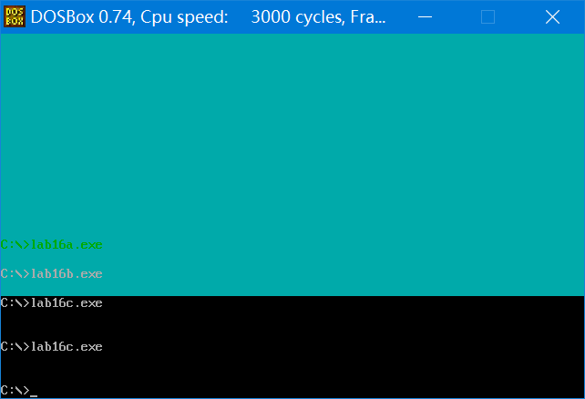
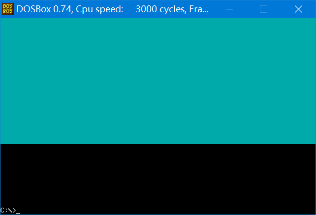

## 第 16 章 直接定址表

### 16.1 描述了单元长度的标号

​	这一章，我们讨论如何有效合理地组织数据，以及相关的编程技术。

​	前面的课程中，我们在代码段中使用**标号**来标记**指令、数据、段的起始地址**。比如，下面的程序将 code 段中的 a 标号处的 8 个数据累加，结果存储到 b 标号处的字中。

```assembly
assume cs:code
code segment
	a: db 1,2,3,4,5,6,7,8
	b: dw 0
start:
	mov si,offset a
	mov bx,offset b
	mov cx,8
s: 
	mov al,cs:[si]
	mov ah,0
	add cs:[bx],ax
	inc si
	loop s
	
	mov ax, 4c00h
	int 21h
	
code ends
end start
```

​	程序中，code、a、b、start、s 都是标号。这些标号仅仅表示了内存单元的地址。
​	但是，我们还可以使用一种标号，这种标号**不但表示内存单元的地址，还表示了内存单元的长度**，即表示在此标号处的单元是一个字节单元，还是字单元，还是双字单元。上面的程序还可以写成这样：

```assembly
assume cs:code
code segment
	a db 1,2,3,4,5,6,7,8
	b dw 0
start:
	mov si,0
	mov cx,8
s: 
	mov al,a[si]
	mov ah,0
	add b,ax
	inc si
	loop s
	mov ax, 4c00h
	int 21h
code ends
end start
````

​	**在 code 段中使用的标号 a、b 后面没有“:”**，它们是同时描述内存地址和单元长度的标号。标号 a 描述了地址 code:0，从这个地址开始，以后的内存单元都是字节单元；而标号 b 描述了地址 code:8，从这个地址开始，以后的内存单元都是字节单元。

​	因为这种标号包含了对方元长度的描述，所以在指令中，它可以代表一个段中的内存单元。比如，对于程序中的“b dw 0”：

* 指令：mov ax,b
* 相当于：mov ax,cs:[8]

* 指令：mov b,2
* 相当于：mov word ptr cs:[8],2

* 指令：inc b
* 相当于：inc word ptr cs:[8]

在这些指令中，标号 b 代表了一个内存单元，地址为 code:8，长度为两个字节。

下面的指令会引起编译错误：

```assembly
mov al,b
```

因为 b 代表的内存单元是字单元，而 al 是 8 位寄存器。

如果我们将程序中的指令 “add b,aх”, 写为 “add b,al”，将出现同样的编译错误。

对于程序中的“a db 1,2,3,4,5,6,7,8”：

* 指令：mov al,a[si]
* 相当于：mov al,cs:0[si]

* 指令：mov al,a[3]
* 相当于：mov al,cs:0[3]

* 指令：mov al,a[bx+si+3]
* 相当于：mov al,cs:0[bx+si+3]

​	可见，使用这种包含单元长度的标号，可以使我们以简洁的形式访问内存中的数据。以后，我们将这种标号称为**数据标号**，它标记了存储数据的**单元的地址**和**长度**。它不同于仅仅表示地址的地址标号。

### 16.a 检测点

下面的程序将 code 段中 a 处的 8 个数据累加，结果存储到 b 处的双字中，补全程序。

```assembly
assume cs:code
code segment
	a dw 1,2,3,4,5,6,7,8
	b dd 0
start:
	mov si,0
	mov cx,8
s:
	mov ax,____
	add ____,ax
	adc ____,0
	add si,____
	loop s

	mov ax,4c00h
	int 21h

code ends
end start
```

---

解析：

* a[si]等价于 cs:0[si]
* b[0]、b[2]等价于 cs:8[0]、cs:8[2]
* 注意运算指令需要指定内存单元大小
* si 一次自增一个字，也就是两个字节

```assembly
mov ax,a[si]
add b[0],ax
adc word ptr b[2],0
add si,2
```

* 为什么要`adc word ptr b[2],0`，因为要防止低 16 位产生进位，所以将 0 和上一指令中的 CF 值相加，再存储在 b[2]字单元中。

### 16.2 在其他段中使用数据标号

​	一般来说，我们不在代码段中定义数据，而是将数据定义到其他段中。在其他段中，我们也可以使用数据标号来描述存储数据的单元的地址和长度。

​	注意，在后面加有“：”的地址标号，**只能在代码段中使用，不能在其他段中使用**。

​	下面的程序将 data 段中 a 标号处的 8 个数据累加，结果存储到 b 标号处的字中。

```assembly
assume cs:code,ds:data		;ds:data 联系起来
data segment
	a db 1,2,3,4,5,6,7,8
	b dw 0
data ends

code segment
start:
	mov ax,data				
	mov ds,ax				;ds 和 data 联系起来，assume 之后还是要设置的。
	mov si,0
	mov cx,8
s:
	mov al,a[si]			;可以直接使用数据标号
	mov ah,0
	add b,ax				;可以直接使用数据标号
	inc si
	loop s
	
	mov ax,4c00h
	int 21h
code ends
end start
```

​	注意，如果想**在代码段中直接用数据标号访问数据，则需要用伪指令 assume 将标号所在的段和一个段寄存器联系起来**。否则编译器在编译的时候，无法确定标号的段地址在哪一个寄存器中。当然，这种联系是编译器需要的，但绝对不是说，我们因为编译器的工作需要，用 assume 指令将段寄存器和某个段相联系，段寄存器中就会真的存放该段的地址。我们**在程序中还要使用指令对段寄存器进行设置**。

​	比如，在上面的程序中，我们要在代码段 code 中用 data 段中的数据标号 a、b 访问数据，则**必须用 assume 将一个寄存器和 data 段相联。在程序中，我们用 ds 寄存器和 data 段相联**，则编译器对相关指令的编译如下。

* 指令：mov al,a[si]
* 编译为：mov al,[si+0]

* 指令：add b,ax
* 编译为：add [8],ax

​	因为这些实际编译出的指令，都默认所访问单元的段地址在 ds 中，而实际要访问的段为 data，所以若要访问正确，在这些指令执行前，ds 中必须为 data 段的段地址。则我们在程序中使用指令：

```assembly
mov ax,data
mov ds,ax
```

设置 ds 指向 data 段。

​	可以将标号当作数据来定义，此时，编译器将标号所表示的地址当作数据的值。
比如：

```assembly
data segment
	a db 1,2,3,4,5,6,7,8
	b dw 0
	c dw a,b
data ends
```

数据标号 c 处存储的两个字型数据为标号 a、b 的偏移地址。相当于:

```assembly
data segment
	a db 1,2,3,4,5,6,7,8
	b dw 0
	c dw offset a,offset b
data ends
```

再比如:

```assembly
data segment
	a db 1,2,3,4,5,6,7,8
	b dw 0
	c dd a,b
data ends
```

​	数据标号 c 处存储的两个双字型数据为标号 a 的**偏移地址和段地址**、标号 b 的偏移地址和段地址。相当于:

```assembly
data segment
a db 1,2,3,4,5,6,7,8
b dw 0
c dd offset a,seg a, offset b, seg b
data ends
```

​	seg 操作符，功能为取得某一标号的段地址。

### 16.b 检测点

​	下面的程序将 data 段中 a 处的 8 个数据累加，结果存储到 b 处的字中，补全程序。

```assembly
assume cs:code,es:data

data segment
	a db 1,2,3,4,5,6,7,8
	b dw 0
data ends

code segment
start:
	________
	________
	mov si,0
	mov cx,8
s:  
	mov al,a[si]		;a[si]代表的是一个字节。
	mov ah,0			;ah 置零，防止高位不为零
	add b,ax
	inc si
	loop s
	
	mov ax,4c00h
	int 21h
code ends
end start
```

---

解析：

* 根据伪指令 assume es:data 提示，知道在主程序中要把 es 和 data 段联系起来 

```assembly
mov ax,data
mov es,ax
```

### 16.3 直接定址表

​	现在，我们讨论用查表的方法编写相关程序的技术。

【编写子程序】以十六进制的形式在屏幕中间显示给定的字节型数据。

​	分析：一个字节需要用两个十六进制数码来表示，所以，子程序需要在屏幕上显示**两个** ASCII 字符。我们当然要用“0”、“1”、“2”、“3”、“4”、“5”、“6”、“7”、“8”、“9”、“A”、“B”、“C”、“D”、“E”、“F”这 16 个字母来显示十六进制数码。

​	我们可以将一个字节的高 4 位和低 4 位分开，分别用它们的值得对应的数码字符。比如 2Bh，可以得到高 4 位的值为 2，低 4 位的值为 11，那么如何用这两个数值得到对应的数码字符“2”和“B”呢？

​	最简单的办法就是一个一个地比较，如下：

​	如果数值为 0，则显示“0”；
​	如果数值为 1，则显示“1”；
​		... ...
​	如果数值为 11，则显示“B”；
​		... ...
​	我们可以看出，这样做，程序中要使用多条比较、转移指令。程序将比较长，混乱。

​	显然，我们希望能够能够在数值 0\~15 和字符“0”\~“F”之间找到一种映射关系。这样用 0\~15 间的任何数值，都可以通过这种映射关系直接得到“0”~“F”中对应的字符。

数值 0\~9 和字符“0”~“9”之间的映射关系是很明显的，即：

数值+30h=对应字符的 ASCII 值

​	0+30h=“0”的 ASCII 值

​	1+30h=“1”的 ASCII 值

​	2+30h=“2”的 ASCII 值
​	... ...
但是，10\~15 和“A”~“F”之间的映射关系是：

​	数值+37h=对应字符的 ASCII 值

​	10+37h=“A”的 ASCII 值

​	11+37h=“B”的 ASCII 值

​	12+37h=“C”的 ASCII 值

​	... ...

​	可见，我们可以利用数值和字符之间的这种原本存在的映射关系，通过高 4 位和低 4 位得到对应的字符编码。但是由于映射关系的不同，我们在程序中必须进行一些比较，对于大于 9 的数值，我们要用不同的计算方法。

​	这样做，虽然使程序得到了简化。但是，如果我们希望用更简捷的计算法，就要考虑**用同一种映射关系从数值得到字符码**。所以我们就不能利用 0\~9 和“0”\~“9”之间与 10\~15 和“A”~“F”之间原有的映射关系。

​	因为数值 0\~15 和字符“0”~“F”之间没有一致的映射关系存在，所以，我们应该在它们之间建立新的映射关系。

​	具体的做法是，建立一张表，表中依次存储字符“0”\~“F”，我们可以通过数值 0~15 直接查找到对应的字符。

子程序如下：

```assembly
;用 al 传送要显示的数据
showbyte: 
	jmp short show
	table db '0123456789ABCDEF' ;字符表
show:
	push bx
	push es
	
	mov ah,al
	shr ah,1
	shr ah,1
	shr ah,1
	shr ah,1					;右移 4 位，ah 中得到高 4 位的值
	and al,00001111b 			;al 中为低 4 位的值
	
	mov bl,ah
	mov bh,0
	mov ah,table[bx] 			;用高 4 位的值作为相对于 table 的偏移，取得对应的字符
	
	mov bx,0b800h
	mov es,bx
	mov es:[160*12+40*2],ah
	
	mov bl,al
	mov bh,0
	mov al,table[bx] 		;用低 4 位的值作为相对于 table 的偏移，取得对应的字符
	
	mov es:[160*12+40*2+2],al
	
	pop es
	pop bx
	
	ret
```

​	可以看出，在子程序中，我们在数值 0\~15 和字符“0”\~“F”之间建立的映射关系为：以数值 N 为 table 表中的偏移，可以找到对应的字符。

​	利用表，在两个数据集合之间建立一种映射关系，使我们可以用查表的方法根据给出的数据得到其在另一集合中的对应数据。这样做的目的一般来说有以下 3 个。

* (1) 为了算法的清晰和简洁；  
* (2) 为了加快运算速度；  
* (3) 为了使程序易于扩充。

​	在上面的子程序中，我们更多的是**为了算法的清晰和简洁**，而采用了**查表**的方法。下面我们来看一下，为了加快运算速度而采用查表的方法的情况。

【编写子程序】计算 sin(x)，x∈{0°，30°，60°，90°，120°，150°，180°}，并在屏幕中间显示计算结果。比如 sin(30)的结果显示为“0.5”。

​	我们可以利用麦克劳林公式来计算 sin(x)。x 为角度，麦克劳林公式中需要代入弧度，则：

​	$sin(x)=sin(y)=y-\frac1{3!}y^3+\frac1{5!}y^5$

​	$y=x/180*3.1415926$

​	可以看出，计算 sin(x) 需要进行多次乘法和除法。乘除是非常费时的运算，它们的执行时间大约是加、比较等指令的 5 倍。如何才能够不做乘除而计算 sin(x) 呢？我们看一下需要计算的 sin(x) 的结果：

​	sin(0)=0	sin(30)=0.5	sin(60)=0.866	sin(90)=1

​	sin(120)=0.866	sin(150)=0.5	sin(180)=0

​	我们可以看出，其实用不着计算，可以用一些内存空间来换取运算的速度。将所要计算的 sin(x) 的结果都存储到一张表中；然后用角度值来查表，找到对应的 sin(x) 的值。

​	用 ax 向子程序传递角度，程序如下：

```assembly
showsin: 
	jmp short show
	
	table dw ag0,ag30,ag60,ag90,ag120,ag150,ag180 	;字符串偏移地址表(内容相当于 Offset ag0、... ...)
	ag0 db '0',0 									;sin(0)对应的字符串“0”
	ag30 db '0.5',0 								;sin(30)对应的字符串“0.5”
	ag60 db '0.866',0 								;sin(60)对应的字符串“0.866”
	ag90 db '1',0 									;sin(90)对应的字符串“1”
	ag120 db '0.866',0 								;sin(120)对应的字符串“0.866”
	ag150 db '0.5',0 								;sin(150)对应的字符串“0.5”
	ag180 db '0',0 									;sin(180)对应的字符串“0”
show: 
	push bx
	push es
	push si
	mov bx,0b800h
	mov es,bx
	
;以下用角度值/30 作为相对于 table 的偏移，取得对应的字符串的偏移地址，放在 bx 中
	mov ah,0				;ax 是主程序传递的角度
	mov bl,30
	div bl					;角度值/30 作为 table 偏移量
	mov bl,al				;取偏移量
	mov bh,0
	add bx,bx				;table 是字单元，偏移 1 个字，2 个字节，偏移量要乘 2
	mov bx,table[bx]		;mov bx,cs:table[bx]等价于 mov bx,cs:[table+bx]
	
;以下显示 sin(x) 对应的字符串
	mov si,160*12+40*2		;设置字符显示位置
shows: 
	mov ah,cs:[bx]			;cs:[bx] 指向目标字符串当前字符
	cmp ah,0				
	je showret				;若为结束符 0 则跳出
	mov es:[si],ah			;显示字符
	inc bx					;指向下一个字符
	add si,2				;显示位置后移一位
	jmp short shows			;重复此过程
showret:
	pop si
	pop es
	pop bx
	ret
;----笔记----
;以 sin(30) 为例说明这个过程
;table 是一个由 dw (字，2 字节)元素组成的数组，存储各标签(ag0、ag30、...)的偏移地址，每元素占 2 字节
;table[bx]的地址为：table 的基地址 +BX(按字节偏移)，BX=2 时，访问 ag30 的地址(table 数组第 1 个元素(从 0 开始))
;执行 mov bx,[table+2] 会将 ag30 的偏移地址赋值给 BX
;cs:[bx] 指向目标字符串首地址
;... ...
```

​	在上面的子程序中，我们在角度值 X 和表示 sin(x) 的字符集 table 之间建立的映射关系为：以角度值/30 为 table 表中的偏移，可以找到对应的字符串的首地址。

​	编程的时候要注意程序的容错性，即对于错误的输入要有处理能力。在上面的子程序中，我们还**应该再加上对提供的角度值是否超范围的检测**。如果提供的角度值不在合法的集合中，程序将定位不到正确的字符串，出现错误。对于角度值的检测，请读者自行完成。

​	上面的两个子程序中，我们将通过给出的数据进行计算或比较而得到结果的问题，转化为用给出的数据作为查表的依据，通过查表得到结果的问题。具体的查表方法，是用查表的依据数据，直接计算出所要查找的元素在表中的位置。像这种可以**通过依据数据，直接计算出所要查找的元素的位置的表**，我们称其为**直接定址表**。

### 16.4 程序入口地址的直接定址表

​	我们可以在**直接定址表中存储子程序的地址**，从而方便地实现不同子程序的调用。我们看下面的问题。

​	实现一个子程序 setscreen，为显示输出提供如下功能。

* (1) 清屏；
* (2) 设置前景色；
* (3) 设置背景色；
* (4) 向上滚动一行。

> 入口参数说明如下。
>
> * (1) 用 ah 寄存器传递功能号：0 表示清屏，1 表示设置前景色，2 表示设置背景色，3 表示向上滚动一行；
>
> * (2) 对于 1、2 号功能，用 al 传送颜色值，(al)∈{0,1,2,3,4,5,6,7}。

下面我们讨论一下各种功能如何实现。	

* (1) 清屏：将显存中当前屏幕中的字符设为空格符；
* (2) 设置前景色：设置显存中当前屏幕中处于奇地址的属性字节的第 0、1、2 位；
* (3) 设置背景色：设置显存中当前屏幕中处于奇地址的属性字节的第 4、5、6 位；
* (4) 向上滚动一行：依次将 n+1 行的内容复制到第 n 行处；最后一行为空。

我们将这 4 个功能分别写为 4 个子程序，请读者根据编程思想，自行读懂下面的程序。

```assembly
sub1:
	push bx
	push cx
	push es			;保护现场
	mov bx,0b800h
	mov es,bx		;es 设置为显存地址
	mov bx,0
	mov cx,2000		;全屏幕 25 行 × 80 列
sub1s:
	mov byte ptr es:[bx],' '	;当前字符置为空格
	add bx,2					;下一个字符地址
	loop sub1s
	pop es			;恢复现场
	pop cx
	pop bx
	ret
sub2:
	push bx
	push cx
	push es

	mov bx,0b800h
	mov es,bx
	mov bx,1		;奇数位用来设置字符颜色
	mov cx,2000
sub2s:
	and byte ptr es:[bx],11111000b	;前景色清空
	or es:[bx],al					;设置前景色
	add bx,2						;移到下一个字符颜色属性设置位
	loop sub2s

	pop es
	pop cx
	pop bx
	ret
sub3: 
	push bx
	push cx
	push es
	mov cl,4
	shl al,cl				;将 al 移动到高四位
	mov bx,0b800h
	mov es,bx
	mov bx,1
	mov cx,2000
sub3s: 
	and byte ptr es:[bx],10001111b	;清空背景色
	or es:[bx],al					;设置背景色
	add bx,2
	loop sub3s
	pop es
	pop cx
	pop bx
	ret
sub4: 
	push cx
	push si
	push di
	push es
	push ds
	mov si,0b800h
	mov es,si
	mov ds,si
	mov si,160				;ds:si 指向第 n+1 行
	mov di,0				;es:di 指向第 n 行
	cld						;清空方向标志位，使其置为 0，正向传送
	mov cx,24				;共复制 24 行
sub4s:
	push cx					;保护循环变量 cx，因为下面传送要重新设置 cx
	mov cx,160				;一行 160 字节(80 字节字符 + 80 字节字符颜色属性)
	rep movsb				;从源地址 ds:si 复制到目标地址 es:di
	pop cx
	loop sub4s
	
	mov cx,80							;清空偶数位字符位即可
	mov si,0
sub4s1: 
	mov byte ptr [160*24+si],' '		;最后一行清空
	add si,2							;移动到下一个字符
	loop sub4s1
	
	pop ds
	pop es
	pop di
	pop si
	pop cx
	ret
```

​	我们可以将这些功能子程序的入口地址存储在一个表中，它们在表中的位置和功能号相对应。对应关系为：功能号*2=对应的功能子程序在地址表中的偏移。程序如下：

```assembly
setscreen: 
	jmp short set
	table dw sub1,sub2,sub3,sub4
set:
	push bx
	
	cmp ah,3 				;判断功能号是否大于 3
	ja sret
	mov bl,ah
	mov bh,0
	add bx,bx 				;根据 ah 中的功能号计算对应子程序在 table 表中的偏移，偏移量为 1 个字
	
	call word ptr table[bx] ;调用对应的功能子程序
sret:
	pop bx
	ret
```

当然，我们也可以将子程序 setscreen 如下实现。

```assembly
setscreen: 
	cmp ah,0
	je do1
	cmp ah,1
	je do2
	cmp ah,2
	je do3
	cmp ah,3
	je do4
	jmp short sret
do1:
	call sub1
	jmp short sret
do2: 
	call sub2
	jmp short sret
do3: 
	call sub3
	jmp short sret
do4: 
	call sub4
sret: 
	ret
```

​	显然，用通过**比较功能号**进行转移的方法，程序结构比较混乱，不利于功能的扩充。比如说，在 setscreen 中再加入一个功能，则需要修改程序的逻辑，加入新的比较、转移指令。

​	用根据功能号**查找地址表**的方法，程序的结构清晰，便于扩充。如果加入一个新的功能子程序，那么只需要在地址表中加入它的入口地址就可以了。

### 实验 16 编写包含多个功能子程序的中断例程

安装一个新的 int 7ch 中断例程，为显示输出提供如下功能子程序。

* (1) 清屏；
* (2) 设置前景色；
* (3) 设置背景色；
* (4) 向上滚动一行。

> 入口参数说明如下：
>
> (1) 用 ah 寄存器传递功能号：0 表示清屏，1 表示设置前景色，2 表示设置背景色，3 表示向上滚动一行；
>
> (2) 对于 1、2 号功能，用 al 传送颜色值，(al)∈ {0,1,2,3,4,5,6,7}。

---

解析：

* 实验 13 的安装 7ch 中断例程程序 + 16.4 节子程序 + 用直接定址表查找功能号
* 注意的问题：
  * table dw sub1,sub2,sub3,sub4 定义在 0:202 偏移地址上，不能定义在平常的代码区内，否则程序关闭就有可能被其他信息覆盖。
  * ★table 的本质是**偏移地址**，当 7ch 中断例程安装完成时，编译器 MASM 会自动将它**处于<u>安装程序</u>中的偏移地址**记录下来（这才是真实记录的 table 的偏移地址）。所以当我们调用`call word ptr table[bx]`时，这个 table 值就不是我们期望中的 0:[202 + bx]，会导致程序出错。
  * ★为了针对以上问题，我们需要使用 org 指令指定程序的起始地址，汇编器在编译时，会根据这些 org 指令将 org 后面的汇编指令分别定位到指定的内存地址，附加了这条指令之后，之前的子程序可以直接使用，而不用做太多修改。
  * 注意，子程序调用改成中断例程调用时，ret 要改成 iret。
  * 如果要保存原来的 7ch 中断例程，可以模仿实验 15 预留两个字保存旧中断程序入口地址，因为过程中不需要用到旧的 7ch 中断例程，所以可以不保留
  * 可以根据实验十五改成用键盘按键触发四种功能，这时候要注意保存旧的中断程序入口地址。
* 完整程序如下：

```assembly
assume cs:code

code segment
start:
	mov ax,0
	mov es,ax
	cli
	mov word ptr es:[7ch*4],200h
	mov word ptr es:[7ch*4+2],0
	sti
	
	mov ax,cs
	mov ds,ax
	mov si,offset lp
	mov ax,0
	mov es,ax
	mov di,200h
	mov cx,offset lpend - offset lp
	cld
	rep movsb
	
	mov ax,4c00h
	int 21h
	org 200h		;通知编译器从 200H 开始重新计算标号
lp:
setscreen: 
	jmp short set
	table dw sub1,sub2,sub3,sub4
set:
	push bx
	
	cmp ah,3 					;判断功能号是否大于 3
	ja sret
	mov bl,ah
	mov bh,0
	add bx,bx 					;根据 ah 中的功能号计算对应子程序在 table 表中的偏移，偏移量为 1 个字
	
	call word ptr table[bx] 	;调用对应的功能子程序
sret:
	pop bx
	iret
sub1:
	push bx
	push cx
	push es			;保护现场
	mov bx,0b800h
	mov es,bx		;es 设置为显存地址
	mov bx,0
	mov cx,2000		;全屏幕 25 行 × 80 列
sub1s:
	mov byte ptr es:[bx],' '	;当前字符置为空格
	add bx,2					;下一个字符地址
	loop sub1s
	pop es						;恢复现场
	pop cx
	pop bx
	ret
sub2:
	push bx
	push cx
	push es

	mov bx,0b800h
	mov es,bx
	mov bx,1		;奇数位用来设置字符颜色
	mov cx,2000
sub2s:
	and byte ptr es:[bx],11111000b	;前景色清空
	or es:[bx],al					;设置前景色
	add bx,2						;移到下一个字符颜色属性设置位
	loop sub2s

	pop es
	pop cx
	pop bx
	ret
sub3: 
	push bx
	push cx
	push es
	mov cl,4
	shl al,cl				;将 al 移动到高四位
	mov bx,0b800h
	mov es,bx
	mov bx,1
	mov cx,2000
sub3s: 
	and byte ptr es:[bx],10001111b	;清空背景色
	or es:[bx],al					;设置背景色
	add bx,2
	loop sub3s
	pop es
	pop cx
	pop bx
	ret
sub4: 
	push cx
	push si
	push di
	push es
	push ds
	mov si,0b800h
	mov es,si
	mov ds,si
	mov si,160				;ds:si 指向第 n+1 行
	mov di,0				;es:di 指向第 n 行
	cld						;清空方向标志位，使其置为 0，正向传送
	mov cx,24				;共复制 24 行
sub4s:
	push cx					;保护循环变量 cx，因为下面传送要重新设置 cx
	mov cx,160				;一行 160 字节(80 字节字符 + 80 字节字符颜色属性)
	rep movsb				;从源地址 ds:si 复制到目标地址 es:di
	pop cx
	loop sub4s
	
	mov cx,80							;清空偶数位字符位即可
	mov si,0
sub4s1: 
	mov byte ptr [160*24+si],' '		;最后一行清空
	add si,2							;移动到下一个字符
	loop sub4s1
	
	pop ds
	pop es
	pop di
	pop si
	pop cx
	ret
lpend:
	nop
	
code ends
end start
```

测试程序 a：

```assembly
assume cs:code

code segment
start:
	mov ah,1			;测试程序
	mov al,2
	int 7ch
	
	mov ax,4c00h
	int 21h
	
code ends
end start
```

测试程序 b：

```assembly
assume cs:code

code segment
start:
	mov ah,2			
	mov al,3
	int 7ch
	
	mov ax,4c00h
	int 21h
	
code ends
end start
```

测试程序 c：

```assembly
assume cs:code

code segment
start:
	mov ah,3
	int 7ch
	
	mov ax,4c00h
	int 21h
	
code ends
end start
```



<center style="color:#C0C0C0">图 16.4 测试新的 7ch 中断例程</center>

测试程序 d：

```assembly
assume cs:code

code segment
start:
	mov ah,0	
	int 7ch
	
	mov ax,4c00h
	int 21h
	
code ends
end start
```



<center style="color:#C0C0C0">图 16.4.1 测试新的 7ch 中断例程</center>

* 注意，自己写的这个清屏程序只清除字符，所以会像上图一样保留背景色。

* 注意，为了方便展示子程序效果，测试样例分成了四个程序，这样会导致后面几个样例运行时没法保持之前设置的字符颜色样式，这是正常现象。

