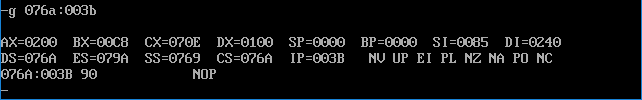

## 第 17 章 使用 BIOS 进行键盘输入和磁盘读写

​	大多数有用的程序都需要处理用户的输入，键盘输入是最基本的输入。程序和数据通常需要长期存储，**磁盘**是最常用的存储设备。BIOS 为这两种外设的 I/O 提供了最基本的中断例程，在本章中，我们对它们的应用和相关的问题进行讨论。

### 17.1 int 9 中断例程对键盘输入的处理
​	我们已经讲过，键盘输入将引发 9 号中断，BIOS 提供了 int 9 中断例程。CPU 在 9 号中断发生后，执行 int 9 中断例程，从 60h 端口读出扫描码，并将其转化为相应的 ASCII 码或状态信息，存储在内存的指定空间(键盘缓冲区或状态字节)中。

​	一般的键盘输入，在 CPU 执行 int 9 中断例程后，都放到了键盘缓冲区中。键盘缓冲区中有 16 个字单元，可以存储 15 个按键的扫描码和对应的 ASCII 码。

​	下面我们按照键盘缓冲区的逻辑结构，来看一下键盘输入的扫描码和对应的 ASCII 码是如何写入键盘缓冲区的。

​	注意：在我们的课程中，仅在逻辑结构的基础上，讨论 BIOS 键盘缓冲区的读写问题。其实键盘缓冲区是用**环形队列结点**管理的内存区，但我们不对队列和环形队列的实现进行讨论，因为那是另一门专业课《数据结构》的内容。

​	下面，我们通过下面几个键：

```assembly
A、B、C、D、E、Shift_A、A
```

的输入过程，简要地看一下 int 9 中断例程对键盘输入的处理方法。

* (1) 初始状态下，没有键盘输入，键盘缓冲区空，此时没有任何元素。

|      |      |      |      |      |      |      |      |      |      |      |      |      |      |      |      |
| ---- | ---- | ---- | ---- | ---- | ---- | ---- | ---- | ---- | ---- | ---- | ---- | ---- | ---- | ---- | ---- |

* (2) 按下 A 键，引发键盘中断；CPU 执行 int 9 中断例程，从 60h 端口读出 A 键的通码；然后检测状态字节，看看是否有 Shift、Ctrl 等切换键按下；发现没有切换键按下，则将 A 键的扫描码 1eh 和对应的 ASCII 码，即字母“a”的 ASCII 码 61h，写入键盘缓冲区。缓冲区的字单元中，**高位字节存储扫描码，低位字节存储 ASCII 码**。此时缓冲区中的内容如下。

| 1E61 |      |      |      |      |      |      |      |      |      |      |      |      |      |      |      |
| ---- | ---- | ---- | ---- | ---- | ---- | ---- | ---- | ---- | ---- | ---- | ---- | ---- | ---- | ---- | ---- |

* (3) 按下 B 键，引发键盘中断；CPU 执行 int 9 中断例程，从 60h 端口读出 B 键的通码；然后检测状态字节，看看是否有切换键按下；发现没有切换键按下，将 B 键的扫描码 30h 和对应的 ASCII 码，即字母“b”的 ASCII 码 62h，写入键盘缓冲区。此时缓冲区中的内容如下。

| 1E61 | 3062 |      |      |      |      |      |      |      |      |      |      |      |      |      |      |
| ---- | ---- | ---- | ---- | ---- | ---- | ---- | ---- | ---- | ---- | ---- | ---- | ---- | ---- | ---- | ---- |

* (4) 按下 C、D、E 键后，缓冲区中的内容如下。

| 1E61 | 3062 | 2E63 | 2064 | 1265 |      |      |      |      |      |      |      |      |      |      |      |
| ---- | ---- | ---- | ---- | ---- | ---- | ---- | ---- | ---- | ---- | ---- | ---- | ---- | ---- | ---- | ---- |

* (5) 按下左 Shift 键，引发键盘中断；int 9 中断例程接收左 Shift 键的通码，设置 0040:17 处的状态字节的第 1 位为 1，表示左 Shift 键按下。

* (6) 按下 A 键，引发键盘中断；CPU 执行 int 9 中断例程，从 60h 端口读出 A 键的通码；检测状态字节，看看是否有切换键按下；发现左 Shift 键被按下，则将 A 键的扫描码 1Eh 和 Shift_A 对应的 ASCII 码，即字母“A”的 ASCII 码 41h，写入键盘缓冲区。此时缓冲区中的内容如下。

| 1E61 | 3062 | 2E63 | 2064 | 1265 | 1E41 |      |      |      |      |      |      |      |      |      |      |
| ---- | ---- | ---- | ---- | ---- | ---- | ---- | ---- | ---- | ---- | ---- | ---- | ---- | ---- | ---- | ---- |

* (7) 松开左 Shift 键，引发键盘中断；int 9 中断例程接收左 Shift 键的断码，设置 0040:17 处的状态字节的第 1 位为 0，表示左 Shift 键松开。

* (8) 按下 A 键，引发键盘中断；CPU 执行 int 9 中断例程，从 60h 端口读出 A 键的通码；然后检测状态字节，看看是否有切换键按下；发现没有切换键按下，则将 A 键的扫描码 1Eh 和 A 对应的 ASCII 码，即字母“a”的 ASCII 码 61h，写入键盘缓冲区。此时缓冲区中的内容如下。

| 1E61 | 3062 | 2E63 | 2064 | 1265 | 1E41 | 1E61 |      |      |      |      |      |      |      |      |      |
| ---- | ---- | ---- | ---- | ---- | ---- | ---- | ---- | ---- | ---- | ---- | ---- | ---- | ---- | ---- | ---- |

### 17.2 使用 int 16h 中断例程读取键盘缓冲区

​	BIOS 提供了 int 16h 中断例程供程序员调用。int 16h 中断例程中包含的一个最重要的功能是从键盘缓冲区中读取一个键盘输入，该功能的编号为 0。下面的指令从键盘缓冲区中读取一个键盘输入，并且将其从缓冲区中删除：

```assembly
mov ah,0
int 16h
```

​	结果：(ah) =扫描码，(al)=ASCII 码。

​	下面我们接着上一节中的键盘输入过程，看一下 int 16h 如何读取键盘缓冲区。

**(1) 执行**

```assembly
mov ah, 0
int 16h
```

后，缓冲区中的内容如下：

| 3062 | 2E63 | 2064 | 1265 | 1E41 | 1E61 |      |      |      |      |      |      |      |      |      |      |
| ---- | ---- | ---- | ---- | ---- | :--: | ---- | ---- | ---- | ---- | ---- | ---- | ---- | ---- | ---- | ---- |

​	ah 中的内容为 1Eh，al 中的内容为 61h。

**(2) 执行**

```assembly
mov ah,0
int 16h
```

后，缓冲区中的内容如下：

| 2E63 | 2064 | 1265 | 1E41 | 1E61 |      |      |      |      |      |      |      |      |      |      |      |
| ---- | ---- | ---- | ---- | ---- | ---- | ---- | ---- | ---- | ---- | ---- | ---- | ---- | ---- | ---- | ---- |

​	ah 中的内容为 30h，al 中的内容为 62h。

**(3) 执行**

```assembly
mov ah, 0
int 16h
```

后，缓冲区中的内容如下：

| 2064 | 1265 | 1E41 | 1E61 |      |      |      |      |      |      |      |      |      |      |      |      |
| ---- | ---- | ---- | ---- | ---- | ---- | ---- | ---- | ---- | ---- | ---- | ---- | ---- | ---- | ---- | ---- |

​	ah 中的内容为 2Eh，al 中的内容为 63h。

**(4) 执行 4 次**

```assembly
mov ah, 0
int 16h
```

后，缓冲区空。

|      |      |      |      |      |      |      |      |      |      |      |      |      |      |      |      |
| ---- | ---- | ---- | ---- | ---- | ---- | ---- | ---- | ---- | ---- | ---- | ---- | ---- | ---- | ---- | ---- |

ah 中的内容为 1Eh，al 中的内容为 61h。

**(5) 执行**

```assembly
mov ah, 0
int 16h
```

​	int 16h 中断例程检测键盘缓冲区，发现缓冲区空，则循环等待，直到缓冲区中有数据。

**(6) 按下 A 键后，缓冲区中的内容如下。**

| 1E61 |      |      |      |      |      |      |      |      |      |      |      |      |      |      |      |
| ---- | ---- | ---- | ---- | ---- | ---- | ---- | ---- | ---- | ---- | ---- | ---- | ---- | ---- | ---- | ---- |

(7) 循环等待的 int 16h 中断例程检测到键盘缓冲区中有数据，将其读出，缓冲区又为空。

|      |      |      |      |      |      |      |      |      |      |      |      |      |      |      |      |
| ---- | ---- | ---- | ---- | ---- | ---- | ---- | ---- | ---- | ---- | ---- | ---- | ---- | ---- | ---- | ---- |

​	ah 中的内容为 1Eh，al 中的内容为 61h。

​	从上面我们可以看出，int 16h 中断例程的 0 号功能，进行如下的工作：

* (1) 检测键盘缓冲区中是否有数据；
* (2) 没有则继续做第 1 步；
* (3) 读取缓冲区第一个字单元中的键盘输入；
* (4) 将读取的扫描码送入 ah，ASCII 码送入 al；
* (5) 将已读取的键盘输入从缓冲区中删除。

​	可见，BIOS 的 **int 9 中断例程和 int 16h 中断例程是一对相互配合的程序**，int 9 中断例程向键盘缓冲区中写入，int 16h 中断例程从缓冲区中读出。它们写入和读出的时机不同，int 9 中断例程是在**有键按下**的时候向键盘缓冲区中写入数据；而 int 16h 中断例程是在**应用程序对其进行调用**的时候，将数据从键盘缓冲区中读出。

​	我们在编写一般的处理键盘输入的程序的时候，可以调用 int 16h 从键盘缓冲区中读取键盘的输入。

【编程】接收用户的键盘输入，输入“r”，将屏幕上的字符设置为红色；输入“g”，将屏幕上的字符设置为绿色；输入“b”，将屏幕上的字符设置为蓝色。

​	程序如下，注释三行利用标号和移位运算，巧妙实现了比较指令：

```assembly
assume cs:code

code segment
start: 
	mov ah,0
	int 16h
	
	mov ah,1		;line 8
	cmp al,'r'
	je red
	cmp al,'g'
	je green
	cmp al,'b'
	je blue
	jmp short sret
red: 
	shl ah,1		;line 17
green: 
	shl ah,1  		;line 19
blue:  
	mov bx,0b800h  
	mov es,bx  
	mov bx,1  
	mov cx,2000  
s: 
	and byte ptr es:[bx],11111000b  
	or es:[bx],ah  
	add bx,2  
	loop s
	
sret: 
	mov ax,4c00h  
	int 21h  
code ends  
end start  
```

### 17.a 检测点  

“在 int 16h 中断例程中，一定有设置 IF=1 的指令。”这种说法对吗？

解析：

​	说法对。上面提到：

> int 16h 中断例程检测键盘缓冲区，发现缓冲区空，则循环等待，直到缓冲区中有数据。

​	如果它无限循环等待输入，那必然需要有某种临时“退出”机制，CPU 才有空来响应键盘输入，不然程序无限等待（而且也不释放自己占用的资源），就死锁了。
​	而这种退出机制正是键盘中断—— int 9H 触发的，而进入中断前 IF 都会被置 0，也就是说 int 16h 中为了能响应 int 9h 中断一定要在合适的时候设置 IF=1 。

### 17.3 字符串的输入  

​	用户通过键盘输入的通常不仅仅是单个字符而是字符串。下面我们讨论字符串输入中的问题和简单的解决方法。

最基本的字符串输入程序，需要具备下面的功能。

* (1) 在输入的同时需要显示这个字符串；
* (2) 一般在输入回车符后，字符串输入结束；

* (3) 能够删除已经输入的字符。

​	对于这 3 个功能，我们可以想象在 DOS 中，输入命令行时的情况。

​	编写一个接收字符串输入的子程序，实现上面 3 个基本功能。因为在输入的过程中需要显示，子程序的参数如下：

> (dh)、(dl)=字符串在屏幕上显示的行、列位置；
>
> ds:si 指向字符串的存储空间，字符串以 0 为结尾符。

下面我们进行分析。

(1) 字符的输入和删除。

​	每个新输入的字符都存储在前一个输入的字符之后，而删除是从最后面的字符进行的，我们看下面的过程。

​	空字符串：
- 输入“a”：a
- 输入“b”：ab
- 输入“c”：abc
- 输入“d”：abcd
- 删除一个字符：abc
- 删除一个字符：ab
- 删除一个字符：a
- 删除一个字符：

​	可以看出在字符串输入的过程中，字符的输入和输出是按照**栈的访问规则**进行的，即**后进先出**。这样，我们就可以用栈的方式来管理字符串的存储空间，也就是说，字符串的存储空间实际上是一个字符栈。字符栈中的所有字符，从栈底到栈顶，组成一个字符串。

(2) 在输入回车符后，字符串输入结束。
- 输入回车符后，可以在字符串中加入 0，表示字符串结束。

(3) 在输入的同时需要显示这个字符串。
- 每次有新的字符输入和删除一个字符的时候，都应该重新显示字符串，即从字符栈的栈底到栈顶，显示所有的字符。

(4) 程序的处理过程。

现在我们可以简单地确定程序的处理过程如下。

* ① 调用 int 16h 获取键盘输入；
* ② 如果是字符，进入字符栈，显示字符栈中的所有字符；继续执行①；
* ③ 如果是退格键，从字符栈中弹出一个字符，显示字符栈中的所有字符；继续执行①；
* ④ 如果是 Enter 键，向字符栈中压入 0，返回。

​	从程序的处理过程中可以看出，字符栈的入栈、出栈和显示栈中的内容，是需要多次使用的功能，我们应该将它写为子程序。

> 子程序：字符栈的入栈、出栈和显示。
>
> 参数说明：(ah)=功能号，0 表示入栈，1 表示出栈，2 表示显示；
>
> ds:si 指向字符栈空间；
>
> 对于 0 号功能：(al)=入栈字符；
>
> 对于 1 号功能：(al)=返回的字节；
>
> 对于 2 号功能：(dh)、(dl)=字符串在屏幕上显示的行、列位置。

```assembly
charstack:
	jmp short charstart
	
	table dw charpush,charpop,charshow
	top dw 0							;栈顶
charstart: 
	push bx
	push dx
	push di
	push es

	cmp ah,2
	ja sret
	mov bl,ah
	mov bh,0
	add bx,bx
	jmp word ptr table[bx]
charpush:
	mov bx,top
	mov [si][bx],al
	inc top
	jmp sret
charpop:
	cmp top,0
	je sret
	dec top
	mov bx,top
	mov al,[si][bx]
	jmp sret
charshow:
	mov bx,0b800h
	mov es,bx
	mov al,160
	mov ah,0
	mul dh
	mov di,ax
	add dl,dl
	mov dh,0
	add di,dx

	mov bx,0
charshows: 
	cmp bx,top
	jne noempty
	mov byte ptr es:[di],' '
	jmp sret
noempty:
	mov al,[si][bx]
	mov es:[di],al
	mov byte ptr es:[di+2],' '
	inc bx
	add di, 2
	jmp charshows
sret:
	pop es
	pop di
	pop dx
	pop bx
	ret
```

上面的子程序中，字符栈的访问规则如下所示。  

(1) 栈空 

|      |      |      |      |      |      |      |      |
| ---- | ---- | ---- | ---- | ---- | ---- | ---- | ---- |
| ↑top |      |      |      |      |      |      |      |

(2) “a”入栈  

| a    |      |      |      |      |      |      |      |
| ---- | ---- | ---- | ---- | ---- | ---- | ---- | ---- |
|      | ↑top |      |      |      |      |      |      |

(3) “b”入栈  

| a    | b    |      |      |      |      |      |      |
| ---- | ---- | ---- | ---- | ---- | ---- | ---- | ---- |
|      |      | ↑top |      |      |      |      |      |

​	另外一个问题是要，显示栈中字符的时候，要注意清除屏幕上上一次显示的内容。 
​	我们现在写出完整的接收字符串输入的子程序，如下所示。

```assembly
getstr:
	push ax
getstrs:
	mov ah,0
	int 16h
	cmp al,20h
	jb nochar 		;ASCII 码小于 20h，说明不是字符
	mov ah,0
	call charstack 	;字符入栈
	mov ah,2
	call charstack 	;显示栈中的字符
	jmp getstrs
nochar:
	cmp ah,0eh		;退格键的扫描码
	je backspace 	
	cmp ah,1ch		;Enter 键的扫描码
	je enter 		
	jmp getstrs
backspace:
	mov ah,1
	call charstack ;字符出栈
	mov ah,2
	call charstack ;显示栈中的字符
	jmp getstrs
enter:
	mov al,0
	mov ah,0
	call charstack ;0 入栈
	mov ah,2
	call charstack ;显示栈中的字符
	pop ax
	ret
```

### 17.4 应用 int 13h 中断例程对磁盘进行读写

​	我们主要以 3.5 英寸软盘为例，进行讲解。

​	3.5 英寸软盘分为上下两面，每面有 80 个磁道，每个磁道又分为 18 个扇区，每个扇区的大小为 512 个字节。

​	则：2 面 \* 80 磁道 \* 18 扇区 \* 512 字节 = 1440KB ≈1.44MB

​	磁盘的实际访问由磁盘控制器进行，我们可以通过控制磁盘控制器来访问磁盘。只能以扇区为单位对磁盘进行读写。在读写扇区的时候，要给出面号、磁道号和扇区号。面号和磁道号从 0 开始，而扇区号从 1 开始。

​	如果我们通过直接控制磁盘控制器来访问磁盘，则需要涉及许多硬件细节。BIOS 提供了对扇区进行读写的中断例程，这些中断例程完成了很多复杂的和硬件相关的工作。我们可以通过调用 BIOS 中断例程来访问磁盘。

​	BIOS 提供的访问磁盘的中断例程为 int 13h。读取 0 面 0 道 1 扇区的内容到 0:200 的程序如下所示。
```assembly
mov ax,0
mov es,ax
mov bx,200h

mov al,1
mov ch,0
mov cl,1
mov dl,0
mov dh,0
mov ah,2
int 13h
```

> 入口参数:
>
> ​	(ah)=int 13h 的功能号(2 表示读扇区)
>
> ​	(al)=读取的扇区数
>
> ​	(ch)=磁道号
>
> ​	(cl)=扇区号
>
> ​	(dh)=磁头号(对于软盘即面号，因为一个面用一个磁头来读写)
>
> ​	(dl)=驱动器号 软驱从 0 开始，0：软驱 A，1：软驱 B；
>
> ​			  	硬盘从 80h 开始，80h：硬盘 C，81h：硬盘 D
>
> ​	es:bx 指向接收从扇区读入数据的内存区
>
> 返回参数:
>
> ​	操作成功：(ah)=0，(al)=读入的扇区数
>
> ​	操作失败：(ah)=出错代码

将 0:200 中的内容写入 0 面 0 道 1 扇区。

```assembly
mov ax,0
mov es,ax
mov bx,200h

mov al,1
mov ch,0
mov cl,1
mov dl,0
mov dh,0

mov ah,3
int 13h
```

> 入口参数:
>
> ​	(ah)=int 13h 的功能号(3 表示写扇区)
>
> ​	(al)=写入的扇区数
>
> ​	(ch)=磁道号
>
> ​	(cl)=扇区号
>
> ​	(dh)=磁头号(面)
>
> ​	(dl)=驱动器号 软驱从 0 开始，0：软驱 A，1：软驱 B；
>
> ​			 	 硬盘从 80h 开始，80h：硬盘 C，81h：硬盘 D 
>
> ​	es:bx 指向将写入磁盘的数据
>
> 返回参数:
>
> ​	操作成功：(ah)=0，(al)=写入的扇区数
>
> ​	操作失败：(ah)=出错代码

​	注意，下面我们要使用 int 13h 中断例程对软盘进行读写。直接向磁盘扇区写入数据是很危险的，很可能覆盖掉重要的数据。如果向软盘的 0 面 0 道 1 扇区中写入了数据，要使软盘在现有的操作系统下可以使用，必须要重新格式化。在编写相关的程序之前，必须要找一张空闲的软盘。在使用 int 13h 中断例程时一定要注意驱动器号是否正确，千万不要随便对硬盘中的扇区进行写入。

【编程】将当前屏幕的内容保存在磁盘上。

​	分析：1 屏的内容占 4000 个字节，需要 8 个扇区，用 0 面 0 道的 1~8 扇区存储显存中的内容。程序如下。

```assembly
assume cs:code
code segment
start: 
	mov ax,0b800h
	mov es,ax
	mov bx,0

	mov al,8
	mov ch,0
	mov cl,1
	mov dl,0
	mov dh,0
	mov ah,3
	int 13h

	mov ax,4c00h
	int 21h
code ends
end start
```

### 实验 17 编写包含多个功能子程序的中断例程  

​	我们可以看出，用面号、磁道号、扇区号来访问磁盘不太方便。可以考虑对位于不同的磁道、面上的所有扇区进行统一编号。编号从 0 开始，一直到 2879，我们称这个编号为逻辑扇区编号。

​	编号的方法如下所示：

| 物理扇区号         | 逻辑扇区号 |
| ------------------ | ---------- |
| 0 面 0 道 1 扇区   | 0          |
| 0 面 0 道 2 扇区   | 1          |
| 0 面 0 道 3 扇区   | 2          |
| 0 面 0 道 4 扇区   | 3          |
| ... ...            | ... ...    |
| 0 面 0 道 18 扇区  | 17         |
| 0 面 1 道 1 扇区   | 18         |
| 0 面 1 道 2 扇区   | 19         |
| 0 面  1 道 3 扇区  | 20         |
| 0 面 1 道 4 扇区   | 21         |
| ... ...            | ... ...    |
| 0 面 1 道 18 扇区  | 35         |
| 0 面 2 道 1 扇区   | 36         |
| 0 面 2 道 2 扇区   | 37         |
| 0 面 2 道 3 扇区   | 38         |
| 0 面 2 道 4 扇区   | 39         |
| ... ...            | ... ...    |
| 0 面 79 道 18 扇区 | 1439       |
| 1 面 0 道 1 扇区   | 1440       |
| 1 面 0 道 2 扇区   | 1441       |
| 1 面 0 道 3 扇区   | 1442       |
| 1 面 0 道 4 扇区   | 1443       |

可以看出，逻辑扇区号和物理扇区号的关系如下：

* **逻辑扇区号 = (面号 * 80 + 磁道号) * 18 + 扇区号 - 1**

那么如何根据逻辑扇区号算出物理编号呢？可以用下面的算法。

int(): 描述性运算符，取商  

rem(): 描述性运算符，取余数  

逻辑扇区号 = (面号 * 80 + 磁道号) * 18 + 扇区号 - 1  

面号 = int(逻辑扇区号 / 1440)  

磁道号 = int(rem(逻辑扇区号 / 1440) / 18)  

扇区号 = rem(rem(逻辑扇区号 / 1440) / 18) + 1

安装一个新的 int 7ch 中断例程，实现通过逻辑扇区号对软盘进行读写。

参数说明：

* (1) 用 ah 寄存器传递功能号：0 表示读，1 表示写；
* (2) 用 dx 寄存器传递要读写的扇区的逻辑扇区号；
* (3) 用 es:bx 指向存储读出数据或写入数据的内存区。

​	提示，用逻辑扇区号计算出面号、磁道号、扇区号后，调用 int 13h 中断例程进行实际的读写。

---

解析：

* 程序思路：利用新的 int 7ch 中断例程把输入数据处理成 int 13h 能使用的合法数据，然后调用 int 13h
* 注意的问题：
  * DOSBOX 好像不支持虚拟软盘，没法调用 int 13h，所以没法调试 (QWQ)

```assembly
assume cs:code

code segment
start:
	mov ax,0
	mov es,ax
	cli
	mov word ptr es:[7ch*4],200h
	mov word ptr es:[7ch*4+2],0
	sti
	
	mov ax,cs
	mov ds,ax
	mov si,offset lp
	mov ax,0
	mov es,ax
	mov di,200h
	mov cx,offset lpend - offset lp
	cld
	rep movsb
	
	mov ax,079ah
	mov es,ax
	mov al,0
	mov ah,0
	mov dx,1579
	mov bx,200
	int 7ch
	nop			;调试看寄存器参数
	mov dl,80h
	int 13h
	
	mov ax,4c00h
	int 21h
lp:
	push bp
	push dx
	push cx
	push bx
	push ax
	
	cmp ah,1
	ja ok					;功能号超出范围则退出
	mov bp,sp
	add ah,2
	mov word ptr [bp],ax	;int 13h 功能号 2 读，3 写，而 ah 为 0 读 1 写，二者差 2
	
	mov ax,dx
	mov bx,1440
	mov dx,0
	div bx
	mov ah,al
	mov al,0
	mov word ptr [bp+6],ax	;高 8 位存面号 dh
	
	mov ax,dx
	mov bx,18
	mov dx,0
	div bx					;商 ax 为磁道号
	mov ah,al
	mov al,0
	mov word ptr [bp+4],ax	;高 8 位存磁道号 ch
	
	add dx,1				;余数 dx 为扇区号
	add word ptr [bp+4],dx	;低 8 位存扇区号 cl
ok:
	pop ax
	pop bx
	pop cx
	pop dx
	pop bp
	iret
lpend:
	nop
	
code ends
end start
```



<center style="color:#C0C0C0">图 17.4 新的 7ch 中断例程</center>

* 结果为 ah = 2，dh = 01，cx=070EH，即 1 面 7 道 14 扇区、读，传递给中断例程 int 13 h 是正确的参数
