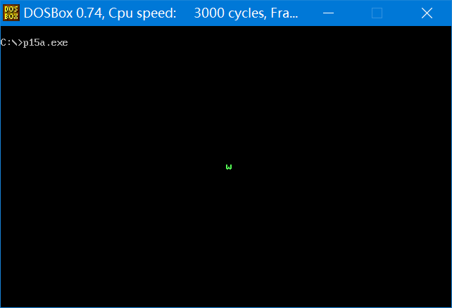
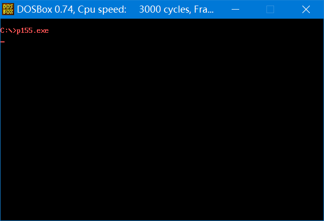

## 第 15 章 外中断

​	以前我们讨论的都是 CPU 对指令的执行。我们知道，CPU 在计算机系统中，除了能够执行指令，进行运算以外，还应该能够对外部设备进行控制，接收它们的输入，向它们进行输出。也就是说，CPU 除了有运算能力外，还要有 **I/O (Input/Output，输入/输出)** 能力。比如，我们按下键盘上的一个键，CPU 最终要能够处理这个键。在使用文本编辑器时，按下 a 键后，我们可以看到屏幕上出现“a”，是 CPU 将从键盘上输入的键所对应的字符送到显示器上的。

​	要及时处理外设的输入，显然需要解决两个问题：①外设的输入随时可能发生，CPU 如何得知？②CPU 从何处得到外设的输入？
​	这一章中，我们以键盘输入为例，讨论这两个问题。

### 15.1 接口芯片和端口

​	第 14 章我们讲过，PC 系统的接口卡和主板上，装有各种接口芯片。这些外设接口芯片的内部有若干寄存器，CPU 将这些寄存器当作端口来访问。

​	外设的输入不直接送入内存和 CPU，而是送入相关的接口芯片的端口中；CPU 向外设的输出也不是直接送入外设，而是先送入端口中，再由相关的芯片送至外设。CPU 还可以向外设输出控制命令，而这些控制命也是先送入到相关芯片的端口中，然后再由相关的芯片根据命令对外设实施控制。

​	可见，**CPU 通过端口和外部设备进行联系**。

### 15.2 外中断信息

​	现在，我们知道了外设的输入被存放在端口中，可是外设的输入随时都有可能到达，CPU 如何及时地知道，并进行处理呢？更一般地讲，就是外设随时都可能发生需要 CPU 及时处理的事件，CPU 如何及时得知并进行处理？

​	CPU 提供中断机制来满足这种需要。前面讲过，当 CPU 的内部有需要处理的事情发生的时候，将产生中断信息，引发中断过程。这种中断信息来自 CPU 的内部。

​	还有一种中断信息，来自于 CPU 外部，当 CPU 外部有需要处理的事情发生的时候，比如说，外设的输入到达，相关芯片将向 CPU 发出相应的中断信息。CPU 在执行完当前指令后，可以检测到发送过来的中断信息，引发中断过程，处理外设的输入。

在 PC 系统中，外中断源一共有以下两类。

**1.可屏蔽中断**

​	可屏蔽中断是 CPU 可以不响应的外中断。CPU 是否响应可屏蔽中断，要看标志寄存器的 IF 位的设置。当 CPU 检测到可屏蔽中断信息时，如果 IF=1，则 CPU 在执行完当前指令后响应中断，引发中断过程；如果 IF=0，则不响应可屏蔽中断。

我们回忆一下内中断所引发的中断过程：

* (1) 取中断类型码 n；
* (2) 标志寄存器入栈，IF=0，TF=0；
* (3) CS、IP 入栈；
* (4) (IP)=(n\*4)，(CS)=(n\*4+2)

​	由此转去执行中断处理程序。

​	可屏蔽中断所引发的中断过程，除在第 1 步的实现上有所不同外，基本上和内中断的中断过程相同。因为**可屏蔽中断信息来自于 CPU 外部**，**中断类型码是通过数据总线送入 CPU 的**；而**内中断的中断类型码是在 CPU 内部产生的**。

​	现在，我们可以解释中断过程中将 IF 置为 0 的原因了。将 IF 置 0 的原因就是，在进入中断处理程序后，禁止其他的可屏蔽中断。

​	当然，如果在中断处理程序中需要处理可屏蔽中断，可以用指令将 IF 置 1。8086CPU 提供的设置 IF 的指令如下：

* sti，设置 IF=1
* cli，设置 IF=0

**2.不可屏蔽中断**

​	不可屏蔽中断是 CPU 必须响应的外中断。当 CPU 检测到不可屏蔽中断信息时，则在执行完当前指令后，立即响应，引发中断过程。

​	对于 8086CPU，不可屏蔽中断的中断类型码固定为 2，所以中断过程中，不需要取中断类型码。则不可屏蔽中断的中断过程为：

* (1) 标志寄存器入栈，IF=0，TF=0；
* (2) CS、IP 入栈；
* (3) (IP)=(8)，(CS)=(0AH)。

​	**几乎所有由外设引发的外中断**，都是**可屏蔽中断**。当外没有需要处理的事件(比如说键盘输入)发生时，相关芯片向 CPU 发出可屏蔽中断信息。不可屏蔽中断是在系统中有必要处理的紧急情况发生时用来通知 CPU 的中断信息。在我们的课程中，主要讨论可屏蔽中断。

### 15.3 PC 机键盘的处理过程

​	下面我们看一下键盘输入的处理过程，并以此来体会一下 PC 机处理外设输入的基本方法。

**1.键盘输入**

​	键盘上的每一个键相当于一个开关，键盘中有一个芯片对键盘上的每一个键的开关状态进行扫描。

​	按下一个键时，开关接通，该芯片就产生一个扫描码，扫描码说明了按下的键在键盘上的位置。扫描码被送入主板上的相关接口芯片的寄存器中，该寄存器的端口地址为 60h。

​	松开按下的键时，也产生一个扫描码，扫描码说明了松开的键在键盘上的位置。松开按键时产生的扫描码也被送入 60h  端口中。

​	一般将按下一个键时产生的扫描码称为**通码**，松开一个键产生的扫描码称为**断码**。扫描码长度为一个字节，通码的第 7 位为 0，断码的第 7 位为 1，即：

​	断码=通码 + 80h

​	比如，g 键的通码为 22h，断码为 a2h。

​	表 15.1 是键盘上部分键的扫描码，只列出通码。断码=通码+80h。

<center style="color:#C0C0C0">表15.1 键盘上部分键的扫描码</center>

| 键        | 扫描码 | 键        | 扫描码 | 键        | 扫描码 | 键         | 扫描码 |
| --------- | ------ | --------- | ------ | --------- | ------ | ---------- | ------ |
| Esc       | 01     | [         | 1A     | \         | 2B     | NumLock    | 45     |
| 1~9       | 02~0A  | ]         | 1B     | Z         | 2C     | ScrollLock | 46     |
| 0         | 0B     | Enter     | 1C     | X         | 2D     | Home       | 47     |
| -         | 0C     | Ctrl      | 1D     | C         | 2E     | ↑          | 48     |
| =         | 0D     | A         | 1E     | V         | 2F     | PgUp       | 49     |
| Backspace | 0E     | S         | 1F     | B         | 30     | -          | 4A     |
| Tab       | 0F     | D         | 20     | N         | 31     | ←          | 4B     |
| Q         | 10     | F         | 21     | M         | 32     | →          | 4D     |
| W         | 11     | G         | 22     | ,<        | 33     | +          | 4E     |
| E         | 12     | H         | 23     | .         | 34     | End        | 4F     |
| R         | 13     | J         | 24     | /         | 35     | ↓          | 50     |
| T         | 14     | K         | 25     | Shift(右) | 36     | PgDn       | 51     |
| Y         | 15     | L         | 26     | PrtSc     | 37     | Ins        | 52     |
| U         | 16     | ;:        | 27     | Alt       | 38     | Del        | 53     |
| I         | 17     | ' "       | 28     | Space     | 39     |            |        |
| O         | 18     | 、        | 29     | CapsLock  | 3A     |            |        |
| P         | 19     | Shift(左) | 2A     | F1~F10    | 3B~44  |            |        |

**2.引发9号中断**  

​	键盘的输入到达 60h 端口时，相关的芯片就会向 CPU 发出中断类型码为 9 的可屏蔽中断信息。CPU 检测到该中断信息后，如果 IF=1，则响应中断，引发中断过程，转去执行 int 9 中断例程。

**3.执行int 9中断例程**  

BIOS 提供了int 9中断例程，用来进行基本的键盘输入处理，主要的工作如下：

* (1) 读出 60h 端口中的扫描码；
* (2) 如果是字符键的扫描码，将该扫描码和它所对应的字符码(即 ASCII 码)送入内存中的 BIOS 键盘缓冲区；如果是控制键(比如 Ctrl)和切换键(比如 CapsLock)的扫描码，则将其转变为状态字节(用二进制位记录控制键和切换键状态的字节)写入内存中存储状态字节的单元；
* (3) 对键盘系统进行相关的控制，比如说，向相关芯片发出应答信息。
  BIOS 键盘缓冲区是系统启动后，BIOS 用于存放 int 9 中断例程所接收的键盘输入的内存区。该内存区可以存储 15 个键盘输入，因为 int 9 中断例程除了接收扫描码外，还要产生和扫描码对应的字符码，所以在 BIOS 键盘缓冲区中，一个键盘输入用一个字单元存放，高位字节存放扫描码，低位字节存放字符码。

0040:17 单元存储键盘状态字节，该字节记录了控制键和切换键的状态。键盘状态字节各位记录的信息如下。

* 0：右 Shift 状态，置1表示按下右 Shift 键；
* 1：左 Shift 状态，置1表示按下左 Shift 键；
* 2：Ctrl 状态，置 1 表示按下 Ctrl 键；
* 3：Alt 状态，置 1 表示按下 Alt 键；
* 4：ScrollLock 状态，置 1 表示 Scroll 指示灯亮；
* 5：NumLock 状态，置 1 表示小键盘输入的是数字；
* 6：CapsLock 状态，置 1 表示输入大写字母；
* 7：Insert 状态，置 1 表示处于删除态。

### 15.4 编写 int 9 中断例程

​	从上面的内容中，可以看出键盘输入的处理过程：①键盘中产生扫描码；②扫描码送入 60h 端口；③引发 9 号中断；④CPU 执行 int 9 中断例程处理键盘输入。

​	上面的过程中，第 1、2、3 步都是由硬件系统完成的。我们能够改变只有 int 9 中断处理程序。我们可以重新编写 int 9 中断例程，按照自己的意愿来处理键盘的输入。但是，在课程中，我们不准备完整地编写一个键盘中断的处理程序，因为要涉及一些硬件细节，而这些内容脱离了我们的内容主线。

​	但是我们却还要编写新的键盘中断处理程序，来进行一些特殊的工作，那么这些硬件细节如何处理呢？这点比较简单，因为 BIOS 提供的 int 9 中断例程已经对这些硬件细节进行了处理。我们只要在自己编写的中断例程中调用 BIOS 的 int 9 中断例程就可以了。

【编程】在屏幕中间依次显示“a”~“z”，并且可以让人看清。在显示的过程中，按下 Esc 键后，改变显示的颜色。

​	我们先来看一下如何依次显示“a”~“z”。

```assembly
assume cs:code
code segment
start:
	mov ax,0b800h
	mov es,ax
	mov ah,'a'
s:
	mov es:[160*12+40*2],ah
	inc ah
	cmp ah,'z'
	jna s
	mov ax,4c00h
	int 21h
code ends
end start
```

​	在上面的程序的执行过程中，我们无法看清楚屏幕上的显示。因为一个字母刚显示到屏幕上，CPU 执行几条指令后，就又变成了另一个字母，字母之间切换得太快，无法看清。

​	应该在每显示一个字母后，延时一段时间，让人看清后，再显示下一个字母。那么如何延时呢？我们让 CPU 执行一段时间的空循环。因为现在 CPU 的速度都非常快，所以循环的次数一定要大，用两个 16 位寄存器来存放 32 位的循环次数。如下：

```assembly
	mov dx,10h
	mov ax,0
s:
	sub ax,1
	sbb dx,0
	cmp ax,0
	jne s
	cmp dx,0
	jne s
```

上面的程序，循环 100000h 次。我们可以将循环延时的程序段写为一个子程序。

现在，我们的程序如下：

```assembly
assume cs:code

stack segment
	db 128 dup (0)
stack ends

code segment
start:
	mov ax,stack
	mov ss,ax
	mov sp,128
	
	mov ax,0b800h
	mov es,ax
	mov ah,'a'
s:
	mov es:[160*12+40*2],ah
	call delay
	inc ah
	cmp ah,'z'
	jna s

	mov ax, 4c00h
	int 21h
delay:
	push ax
	push dx
	mov dx,10h ; 循环10000000h次，读者可以根据自己机器的速度调整循环次数
	mov ax,0
s1:
	sub ax,1
	sbb dx,0
	cmp ax,0
	jne s1
	cmp dx,0
	jne s1
	pop dx
	pop ax
	ret

code ends
end start
```

​	显示“a”~“z”，并可以让人看清，这个任务已经实现。那么如何实现，按下 Esc  键盘输入到达 60h 端口后，就会引发 9 号中断，CPU 则转去执行 int 9 中断例程。我们可以编写 int 9 中断例程，功能如下。

* (1) 从 60h 端口的读出键盘的输入；
* (2) 调用 BIOS 的 int 9 中断例程，处理其他硬件细节；
* (3) 判断是否为 Esc 的扫描码，如果是，改变显示的颜色后返回；如果不是则直接返回。

下面对这些功能的实现一一进行分析。

**1.从端口 60h 读出键盘的输入**

```assembly
in al,60h
```

**2.调用 BIOS 的 int 9 中断例程**

​	有一点要注意的是，我们写的中断处理程序要成为新的 int 9 中断例程，主程序必须将中断向量表中的 int 9 中断例程的入口地址改为我们写的中断处理程序的入口地址。则在新的中断处理程序中调用原来的 int 9 中断例程时，中断向量表中的 int 9 中断例程的入口地址却不是原来的 int 9 中断例程的地址。所以不能使用 int 指令直接调用。

​	要能在我们写的新中断例程中调用原来的中断例程，就必须**在将中断向量表中的中断例程的入口地址改为新地址之前，将原来的入口地址保存起来**。这样，在需要调用的时候，我们才能找到原来的中断例程的入口。

​	对于我们现在的问题，假设原来 int 9 中断例程的偏移地址和段地址保存在 ds:[0] 和 ds:[2] 单元中。那么我们在需要调用原来的 int 9 中断例程时，就可以在 ds:[0]、ds:[2] 单元中找到它的入口地址。

​	那么，有了入口地址后，如何进行调用呢？

​	当然不能使用指令 int 9 来调用。我们可以用别的指令来对 int 指令进行一些模拟，从而实现对中断例程的调用。

我们来看，int 指令在执行的时候，CPU 进行下面的工作：

* (1) 取中断类型码 n；
* (2) 标志寄存器入栈；
* (3) IF=0，TF=0；
* (4) CS、IP 入栈；
* (5)(IP)=(n\*4)，(CS)=(n\*4+2)。


​	取中断类型码是为了定位中断例程的入口地址，在我们的问题中，中断例程的入口地址已经知道。所以我们用别的指令模拟 int 指令时，不需要做第(1)步。在假设要调用的中断例程的入口地址在 ds:0 和 ds:2 单元中的前提下，我们将 int 过程用下面几步模拟。

* (1) 标志寄存器入栈；
* (2) IF=0，TF=0；
* (3) CS、IP入栈；
* (4) (IP)=((ds)\*16+0)，(CS)=((ds)\*16+2)。

可以注意到第(3)、(4)步和 call dword ptr ds:[0]的功能一样，call dword ptr ds:[0]的功能也是：

* (1) CS、IP入栈；
* (2) (IP)=((ds)\*16+0)，(CS)=((ds)*16+2)。

如果还有疑问，复习 10.6 节的内容。

所以 int 过程的模拟过程变为：

* (1) 标志寄存器入栈；
* (2) IF=0，TF=0；
* (3) call dword ptr ds:[0]；

对于(1)，可用 pushf 实现；

对于(2)，可用下面的指令实现：
```assembly
pushf
pop ax
and ah,1111100b ；IF 和 TF为标志寄存器的第9位和第8位
push ax
popf
```

则模拟 int 指令的调用功能，调用入口地址在 ds:0、ds:2 中的中断例程的程序为：
```assembly
pushf 					;标志寄存器入栈

pushf
pop ax
and ah,1111100b
push ax
popf 					;IF=0，TF=0

call dword ptr ds:[0] 	;CS、IP入栈；(IP)=((ds)*16+0)，(CS)=((ds)*16+2)
```
**3.如果是Esc的扫描码，改变显示的颜色后返回**

​	如何改变显示的颜色？

​	显示的位置是屏幕的中间，即第 12 行 40 列，显存中的偏移地址为：160\*12+40\*2。所以字符的 ASCII 码要送入段地址 b800h，偏移地址 160\*12+40\*2处。而段地址 b800h，偏移地址 160\*12+40\*2+1 处是字符的属性，只要改变此处的数据就可以改变在段地址 b800h，偏移地址 160\*12+40\*2 处显示的字符的颜色了。

​	该程序的最后一个问题是，要在程序返回前，将中断向量表中的 int 9 中断例程的入口地址恢复为原来的地址。否则程序返回后，**别的程序将无法使用键盘**。

经过分析，完整的程序如下。

```assembly
assume cs:code

stack segment
	db 128 dup(0)
stack ends

data segment
	dw 0,0
data ends

code segment
start:
	mov ax,stack
	mov ss,ax
	mov sp,128
	
	mov ax,data
	mov ds,ax
	
	mov ax,0
	mov es,ax

	push es:[9*4]
	pop ds:[0]
	push es:[9*4+2]
	pop ds:[2] 							;将原来的int 9中断例程的入口地址保存到ds:0 ds:2单元中

	mov word ptr es:[9*4],offset int9
	mov es:[9*4+2],cs 					;在中断向量表中设置新的int 9中断例程的入口地址

	mov ax,0b800h
	mov es,ax
	mov ah,'a'
s:
	mov es:[160*12+40*2],ah
	call delay
	inc ah
	cmp ah,'z'
	jna s

	mov ax,0
	mov es,ax
	
	push ds:[0]
	pop es:[9*4]
	push ds:[2]
	pop es:[9*4+2]		;将中断向量表中 int 9 中断例程的入口恢复为原来的地址

	mov ax,4C00h
	int 21h

delay:
	push ax
	push dx
	mov dx,10h
	mov ax,0
s1:
	sub ax,1
	sbb dx,0
	cmp ax,0
	jne s1
	cmp dx,0
	jne s1
	pop dx
	pop ax
	ret

;------以下为新的int 9中断例程--------------
int9:
	push ax
	push bx
	push es
	
	in al,60h

	pushf
	pushf
	pop bx
	and bh,1111100b
	push bx
	popf
	call dword ptr ds:[0] 	;对int指令进行模拟，调用原来的int 9中断例程
	
	cmp al,1
	jne int9ret
	
	mov ax,0B800h
	mov es,ax
	inc byte ptr es:[160*12+40*2+1] ;将属性值加1，改变颜色
int9ret:
	pop es
	pop bx
	pop ax
	iret

code ends
end start
```

​	注意，本章中所有关于键盘的程序，因要直接访问真实的硬件，则必须在 **DOS 实模式**下运行。在 Windows 2000 的 DOS 方式下运行，会出现一些和硬件工作原理不符合的现象。



<center style="color:#C0C0C0">图15.4 int 9中断例程</center>

### 15.a 检测点

(1)仔细分析一下上面的 int 9 中断例程，看看是否可以精简一下？

​	其实在我们的 int 9 中断例程中，模拟 int 指令调用原 int 9 中断例程的程序段是可以精简的，因为在进入中断例程后，IF 和 TF 都已经置 0，没有必要再进行设置了。对于程序段：

```assembly
pushf  
pushf  
pop ax  
and ah,11111100b  
push ax  
popf  
call dword ptr ds:[0]  
```

可以精简为：

​	\_\_\_\_\_\_\_\_\_\_\_\_\_\_\_\_

​	\_\_\_\_\_\_\_\_\_\_\_\_\_\_\_\_

两条指令。

---

解析：

* 不需要设置 IF 和 TF 了，所以上述代码的 2~6 行都可以不要。
* 不要被两个 pushf 迷惑了，其实第二个 pushf 开始的五行指令都是为了实现修改标志寄存器里的 IF、TF 位，而第一个 pushf 为什么仍要保留呢？因为第一个 pushf 是为了保护标志寄存器的值，与后面的 iret 相对应(iret 有 popf的步骤)。

```assembly
pushf
call dword ptr ds:[0] 
```

(2)仔细分析上面程序中的主程序，看看有什么潜在的问题?

​	在主程序中，如果在执行设置 int 9 中断例程的段地址和偏移地址的指令之间发生了键盘中断，则 CPU 将转去一个错误的地址执行，将发生错误。

​	找出这样的程序段，改写它们，排除潜在的问题。
​	提示，注意 sti 和 cli 指令的用法。

---

解析：

* 在下面“在中断向量表中设置新的中断入口地址”的两句有关指令前后设置**关中断、开中断**。

```assembly
cli
	mov word ptr es:[9*4],offset int9
	mov es:[9*4+2],cs 					;在中断向量表中设置新的int 9中断例程的入口地址
sti
```

* 在下面“将中断向量表中 int 9 中断例程的入口恢复为原来的地址”的两句有关指令前后设置**关中断、开中断**。

```assembly
cli
	push ds:[0]
	pop es:[9*4]
	push ds:[2]
	pop es:[9*4+2]		;将中断向量表中 int 9 中断例程的入口恢复为原来的地址
sti
```

### 15.5 安装新的 int 9 中断例程

​	下面，我们安装一个新的 int 9 中断例程，使得原 int 9 中断例程的功能得到扩展。

​	任务：安装一个新的 int 9 中断例程。

​	功能：在 DOS 下，按 F1 键后改变当前屏幕的显示颜色，其他的键照常处理。

我们进行如下分析：

(1) 改变屏幕的显示颜色

​	改变从 B8000H 开始的 4000 个字节中的所有奇地址单元的内容，当前屏幕的显示颜色即发生改变时，程序如下：

```assembly
	mov ax,0b800h
	mov es,ax
	mov bx,1
	mov cx,2000
s: 
	inc byte ptr es:[bx]
	add bx,2
	loop s
```

(2) 其他键照常处理
	可以调用原 int 9 中断处理程序，来处理其他的键盘输入。

(3) 原int 9中断例程入口地址的保存
	因为在编写的新 int 9 中断例程中要调用原 int 9 中断例程，所以，要保存原 int 9 中断例程的入口地址。保存在哪里？显然不能保存在安装程序中，因为安装程序返回后地址将丢失。我们将地址保存在 0:200 单元处。

(4) 新 int 9 中断例程的安装
	这个问题在前面已经详细讨论过。我们可将新的 int 9 中断例程安装在 0:204 处(0:200~0:203 存储原 int 9 的入口地址)。
完整的程序如下。

```assembly
assume cs:code

stack segment
	db 128 dup (0)
stack ends

code segment
start: 
	mov ax,stack
	mov ss,ax
	mov sp,128
	
	push cs
	pop ds

	mov ax,0
	mov es,ax

	mov si,offset int9 					;设置ds:si指向源地址
	mov di,204h      					;设置es:di指向目的地址
	mov cx,offset int9end-offset int9 	;设置cx为传输长度
	cld              					;设置传输方向为正
	rep movsb  

	push es:[9*4]  
	pop es:[200h]  
	push es:[9*4+2]  
	pop es:[202h]  

	cli  
	mov word ptr es:[9*4],204h  
	mov word ptr es:[9*4+2],0  
	sti  

	mov ax,4000h  
	int 21h  

int9:  
	push ax  
	push bx  
	push cx  
	push es  

	in al,60h
	
	pushf  
	call dword ptr cs:[200h] ;当此中断例程执行时(CS)=0  
	
	cmp al,3bh  
	jne int9ret 			;F1的扫描码为3bh  

	mov ax,0b800h  
	mov es,ax  
	mov bx,1  
	mov cx,2000  
s: 
	inc byte ptr es:[bx]  
	add bx,2  
	loop s  
int9ret: 
	pop es  
	pop cx  
	pop bx  
	pop ax  
	iret  
int9end:
	nop

code ends  
end start
```



<center style="color:#C0C0C0">图15.5 新的int 9中断例程</center>

这一章中，我们通过对键盘输入的处理，讲解了 CPU 对外设输入的通常处理方法。即：

* (1) 外设的输入送入端口；
* (2) 向 CPU 发出外中断(可屏蔽中断)信息；
* (3) CPU 检测到可屏蔽中断信息，如果 IF=1，CPU 在执行完当前指令后响应中断，执行相应的中断例程；
* (4) 可在中断例程中实现对外设输入的处理。

端口和中断机制，是 CPU 进行 I/O 的基础。
