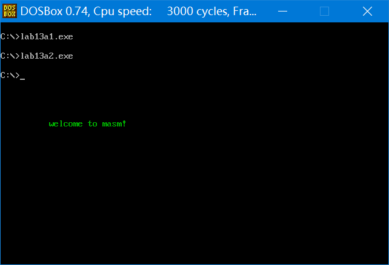
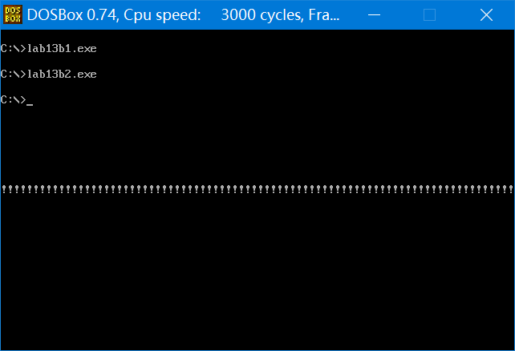
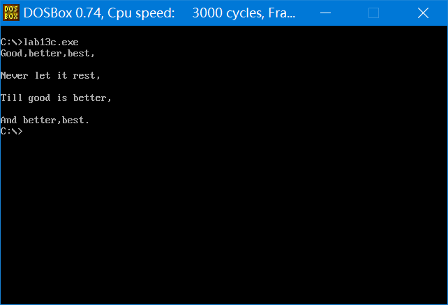

### 实验 13 编写、应用中断例程

​	(1) 编写并安装 int 7ch 中断例程，功能为显示一个用 0 结束的字符串，中断例程安装在 0:200 处。

> 参数：(dh)=行号，(dl)=列号，(cl)=颜色，ds:si 指向字符串首地址。
>

​	以上中断例程安装成功后，对下面的程序进行单步跟踪，尤其注意观察 int、iret 指令执行前后 CS、IP 和栈中的状态。

```assembly
assume cs:code
data segment
	db "welcome to masm!",0
data ends
code segment
start: 
	mov dh,10
	mov dl,10
	mov cl,2
	mov ax,data
	mov ds,ax
	mov si,0
	int 7ch
	mov ax,4c00h
	int 21h
code ends
end start
```

---

解析：

* 程序思想：本程序做的事情有三件，第一件是设置中断入口地址，第二件是将中断例程传送到入口地址所在内存单元，第三件是实现打印字符串功能的中断例程本身，类似于 show_str 子程序的编写
* 注意的问题：
  * int 和 iret 往往是一对同时使用，就像 call 和 ret 一样，不要遗漏
  * 偏移量先求，之后只需要递增，直到遇到结尾 0 即可
  * 本题和之前题目不一样的地方在于要把循环写入中断例程内，而非在主函数中循环，其实最后写出来的程序就和之前实验 10 的 show_str 子程序如出一辙
  * 寄存器 si 是否要压栈的问题，我这里没压栈保护，最后返回的是结尾 0 位置的 si，压栈也没问题，是个好习惯，题目没说要返回结尾的位置，也就不用修改寄存器，所以可以直接`push si`
* 安装程序与中断例程如下：

```assembly
assume cs:code
code segment
start:
	mov ax,0
	mov es,ax
	mov word ptr es:[7ch*4],200h
	mov word ptr es:[7ch*4+2],0
	
	mov ax,cs
	mov ds,ax
	mov si,offset lp
	mov ax,0
	mov es,ax
	mov di,200h
	mov cx,offset lpend - offset lp
	cld
	rep movsb
	
	mov ax,4c00h
	int 21h
lp:
	push ax
	push es
	push di
	mov ax,0b800h
	
	mov es,ax
	mov di,0
	mov ah,0
	
	mov al,160
	mul dh
	add di,ax
	mov al,2
	mul dl
	add di,ax
show_str:
	cmp byte ptr [si],0
	je ok
	
	mov al,[si]
	mov es:[di],al
	mov es:[di+1],cl
	
	inc si
	add di,2
	
	jmp short show_str
ok:
	pop di
	pop es
	pop ax
	iret
lpend:
	nop
	
code ends
end start
```

* 运行`lab13a1.exe`安装中断例程，运行`lab13a2.exe`执行主程序，屏幕正确输出字符串：



<center style="color:#C0C0C0">图13.7 显示字符串中断例程</center>

* 调试结果：
  * int 执行前，CS=076C，IP=000E，`-d ss:fff0`查看栈中最后三个字的信息为：0E 00 6C 07 A3 01，int 执行后 CS:IP 会变成 0000:0200，而`-d ss:fff0`中最后三个字的信息为：10 00 6C 07 02 72，正好对应着返回时的 IP:0010、CS:076C、72 02H=111001000000010B 正好对应标志寄存器，可以看到 IF=1，也可以知道压栈顺序是 pushf、push cs、push ip。
  * iret 执行前，CS=0000，IP=0230，栈中最后三个字的信息为：10 00 6C 07 02 72，iret 执行后，CS=076C，IP=0010，栈中最后三个字的信息为：10 00 6C 07 A3 01。

(2) 编写并安装 int 7ch 中断例程，功能为完成 loop 指令的功能。

> 参数：(cx)=循环次数，(bx)=位移。

​	以上中断例程安装成功后，对下面的程序进行单步跟踪，尤其注意观察 int 、 iret 指令执行前后 CS、IP 和栈中的状态。

​	在屏幕中间显示80个“!”。

```assembly
assume cs:code
code segment
start:
	mov ax,0b800h
	mov es,ax
	mov di,160*12
	mov bx,offset s-offset se 	;设置从标号se到标号s的转移位移
	mov cx,80
s:  
	mov byte ptr es:[di],'!'
	add di,2
	int 7ch						;如果(cx)≠0，转移到标号s处
se:
	nop
	mov ax,4c00h
	int 21h
code ends
end start
```

---

解析：

* 程序思想：本程序考察了利用中断例程读取并修改 CS:IP 以实现**段内近跳转**的功能(类似于 loop 指令)

* 注意的问题：

  * 应该先 dec c 再判断 jcxz，因为注意到主函数是先输出字符，然后才进入中断例程，也就是说至少会执行一次显示“!”，类似于 do while 的关系，所以边界条件弄错可能会导致多显示一个“!”。
  * 本例的`mov bx,offset s-offset se`用于记录程序的转移位移，和`mov cx,offset lpend - offset lp`形式上有些类似，但是后者是用来记录传送程序长度的。
  * 程序中没有申请栈空间，则默认会使用系统提供的栈空间，而且 MASM 编译器会一直提醒 "no stack segment"

* 调试结果：

  * 执行 int 7ch 前，CS=076A、IP=0015，栈内数据如下：

    ```assembly
    0769:fff0 00 00 00 00 00 00 00 B8-00 00 15 00 6A 07 A3 01
    ```

  * 执行 int 7ch 后，CS=0000、IP=0200，栈内数据如下：

    ```assembly
    0769:fff0 00 00 00 00 00 00 00 B8-00 00 17 00 6A 07 06 72
    ```

  * 第一次执行 push bp 后，CS=0000、IP=0201，栈内数据如下：

    ```assembly
    0769:fff0 00 00 01 02 00 00 A3 01-00 00 17 00 6A 07 06 72
    ```

    可以推测 |00 00 | 17 00 | 6A 07 | 06 72| 分别对应 bp、ip、cs、flag

    这个过程可以发现 bx=FFF7，也就是有符号的 -9，17H+FFF7H=23-9=14=0EH，这个 -9 正是标号 s 的地址减去标号 se 下一个字节地址的差值。

  * 第一次执行 iret 前，CS=0000、IP=020A，栈内数据如下：

    ```assembly
    0769:fff0 00 B8 00 00 0A 02 00 00-A3 01 0E 00 6A 07 06 72
    ```

  * 第一次执行 iret 后，CS=076A、IP=000E，栈内数据如下：

    ```assembly
    0769:fff0 00 B8 00 00 0A 02 00 B8-00 00 0E 00 6A 07 A3 01

* 安装程序与中断例程如下：

```assembly
assume cs:code
code segment
start:
	mov ax,0
	mov es,ax
	mov word ptr es:[7ch*4],200h
	mov word ptr es:[7ch*4+2],0
	
	mov ax,cs
	mov ds,ax
	mov si,offset lp
	mov ax,0
	mov es,ax
	mov di,200h
	mov cx,offset lpend - offset lp
	cld
	rep movsb
	
	mov ax,4c00h
	int 21h
lp:
	push bp
	mov bp,sp
	dec cx
	jcxz ok
	add [bp+2],bx
ok:
	pop bp
	iret
lpend:
	nop
	
code ends
end start
```

* 运行结果如下：



<center style="color:#C0C0C0">图13.7.1 显示一串感叹号中断例程</center>

(3) 下面的程序，分别在屏幕的第 2、4、6、8 行显示 4 句英文诗，补全程序。

```assembly
assume cs:code
code segment
	s1: db 'Good,better,best,','$'
	s2: db 'Never let it rest,','$'
	s3: db 'Till good is better,','$'
	s4: db 'And better,best.','$'
	s:  dw offset s1,offset s2,offset s3,offset s4
	row: db 2,4,6,8
	
start:
	mov ax,cs
	mov ds,ax
	mov bx,offset s
	mov si,offset row
	mov cx,4
ok:
	mov bh,0
	mov dh,_____
	mov dl,0
	mov ah,2
	int 10h
	
	mov dx,_____
	mov ah,9
	int 21h
	_________
	_________
	loop ok
	mov ax,4c00h
	int 21h
code ends
end start
```

​	完成后编译运行，体会其中的编程思想。

---

解析：

* 本题巧妙利用数据区存储了额外的两个数据段，一个数据段用标号 s 表示，存储各行诗集的首地址，另一个数据段用标号 row 表示，存储准备打印的行号数据，设 bx = offset s，si = offset row 这样对应字符串就可以表示为 ds:[bx]、ds:[bx+2]、ds:[bx+4]、ds:[bx+6]，对应行号就可以表示为 ds:[si]、ds:[si+2]、ds:[si+4]、ds:[si+6]
* 利用了标号及存储在数据区的标号和连续调用三次中断例程简化了整个程序的复杂程度

```assembly
assume cs:code
code segment
	s1: db 'Good,better,best,','$'
	s2: db 'Never let it rest,','$'
	s3: db 'Till good is better,','$'
	s4: db 'And better,best.','$'
	s:  dw offset s1,offset s2,offset s3,offset s4
	row: db 2,4,6,8
start:
	mov ax,cs
	mov ds,ax
	mov bx,offset s		;(bx)=s标号地址
	mov si,offset row	;(si)=row标号地址
	mov cx,4
ok:
	mov bh,0			;BIOS的10H中断例程入口参数设置，bh(页号)
	mov dh,[si]			;dh(行号)
	mov dl,0			;dl(列号)
	mov ah,2			;10H例程的2号子程序，功能：设置光标位置
	int 10h
	
	mov dx,[bx]			;指向字符串地址
	mov ah,9			;DOS中21H例程的9号子程序，功能：显示以'$'结尾的字符串
	int 21h
	add bx,2			;bx每次自增一个word
	inc si				;si每次自增一个byte
	loop ok
	mov ax,4c00h
	int 21h
code ends
end start
```



<center style="color:#C0C0C0">图13.7.2 显示四行诗中断例程</center>
