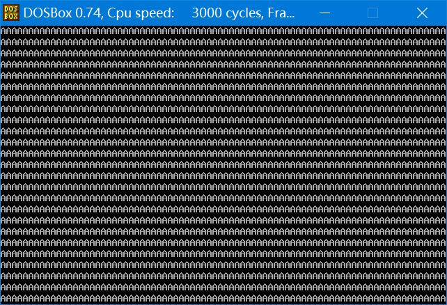

### 实验 15 安装新的 int 9 中断例程

​	安装一个新的 int 9 中断例程，功能：在 DOS 下，按下“A”键后，除非不再松开，如果松开，就显示满屏幕的“A”，其他的键照常处理。

​	提示，按下一个键时产生的扫描码称为**通码**，松开一个键产生的扫描码称为**断码**。断码=通码+80h。

---

解析：

* 程序思想：和前面那个全屏换色程序思路别无二致，先安装新 int 9 程序，然后保存旧地址，设置新的中断程序入口地址。新的程序程序做了什么事呢？端口 60H 读键盘输入的值(即键盘产生的扫描码)，然后执行旧的系统中断例程(此处不能直接用 int 调用，为什么的原因是这个是本节内容的核心，前面已经详细说明，15.a 检测点亦有考察)，然后判断，断码为 9EH，即松开 A 键时全屏输出 A 字符，后续就是恢复现场等套路内容。

```assembly
assume cs:code

stack segment
	db 128 dup (0)
stack ends

code segment
start: 
	mov ax,stack
	mov ss,ax
	mov sp,128
	
	push cs
	pop ds

	mov ax,0
	mov es,ax

	mov si,offset int9 					;设置ds:si指向源地址
	mov di,204h      					;设置es:di指向目的地址
	mov cx,offset int9end-offset int9 	;设置cx为传输长度
	cld              					;设置传输方向为正
	rep movsb  

	push es:[9*4]  
	pop es:[200h]  
	push es:[9*4+2]  
	pop es:[202h]  

	cli  
	mov word ptr es:[9*4],204h  
	mov word ptr es:[9*4+2],0  
	sti  

	mov ax,4000h  
	int 21h  

int9:  
	push ax  
	push bx  
	push cx  
	push es  

	in al,60h
	
	pushf  
	call dword ptr cs:[200h] 	;当此中断例程执行时(CS)=0  
	
	cmp al,9eh
	jne int9ret					;A的通码为1EH，断码为9EH

	mov ax,0b800h  
	mov es,ax  
	mov bx,0  
	mov cx,2000  
s: 
	mov byte ptr es:[bx],'A'
	add bx,2  
	loop s  
int9ret:
	pop es  
	pop cx  
	pop bx  
	pop ax  
	iret  
int9end:
	nop

code ends  
end start
```



<center style="color:#C0C0C0">图15.5.1 打印全屏A的int 9中断例程</center>

### 8086CPU 指令系统总结

> 若要详细了解 8086 指令系统中的各个指令的用法，可以查看有关的指令手册。
>
> 8086CPU 提供以下几大类指令。
>
> **1.数据传送指令**
>
> ​	比如，mov、push、pop、pushf、popf、xchg 等都是数据传送指令，这些指令实现寄存器和内存、寄存器和寄存器之间的单个数据传送。
>
> **2.算术运算指令**
>
> ​	比如，add、sub、adc、sbb、inc、dec、cmp、imul、idiv、aaa、aaa 等都算是算术运算指令，这些指令实现寄存器和内存中的数据的算数运算。它们的执行结果影响标志寄存器的 sf、zf、of、cf、pf、af 位。
>
> **3.逻辑指令**
>
> ​	比如，and、or、not、xor、test、shl、shr、sal、sar、rol、ror、rcl、rcr 等都算是逻辑指令。除了 not 指令外，它们的执行结果都影响标志寄存器的相关标志位。
>
> **4.转移指令**
>
> ​	可以修改 IP，或同时修改 CS 和 IP 的指令统称为转移指令。转移指令分为以下几类。
>
> * (1)无条件转移指令，比如，jmp;
> * (2)条件转移指令，比如，jcxz、je、jb、ja、jnb、jna 等;
> * (3)循环指令，比如，loop;
> * (4)过程，比如，call、ret、retf;
> * (5)中断，比如，int、iret。
>
> **5.处理器控制指令**
>
> ​	这些指令对标志寄存器或其它处理状态进行设置，比如，cld、std、cli、sti、nop、clc、cmc、stc、hlt、wait、esc、lock 等都是处理器控制指令。
>
> **6.串处理指令**
>
> ​	这些指令对内存中的批量数据进行处理，比如，movsb、movsw、cmps、scas、lods、 stos 等。若要使用这些指令方便地进行批量数据处理，则需要和 rep、repe、repne 等前缀指令配合使用。
