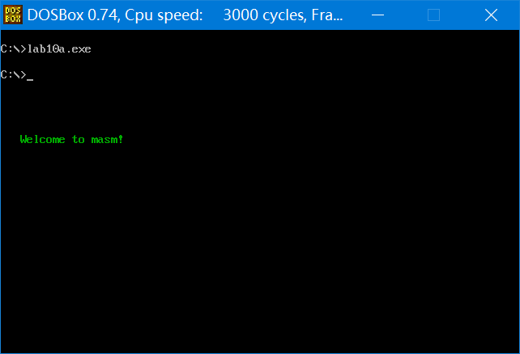

### 实验 10 编写子程序

​	在这次实验中，我们将要编写 3 个子程序，通过它们来认识几个常见的问题和掌握解决这些问题的方法。同前面的所有实验一样，这个实验是必须独立完成的，在后面的课程中，将要用到这个实验中编写的3个子程序。

**【编程问题一】显示字符串**

> 显示字符串是现实工作中经常要用到的功能，应该编写一个通用的子程序来实现这个功能。我们应该提供灵活的调用接口，使调用者可以决定显示的位置(行、列)、内容和颜色。
>

**子程序描述**

> 名称：show_str  
>
> 功能：在指定的位置，用指定的颜色，显示一个用 0 结束的字符串。  
>
> 参数：(dh)=行号(取值范围 0-24)，(dl)=列号(取值范围 0-79)，(cl)=颜色，ds:si 指向字符串的首地址  
>
> 返回：无  
>
> 应用举例：在屏幕的 8 行 3 列，用绿色显示 data 段中的字符串。  
>

```assembly
assume cs:code  
data segment  
	db 'Welcome to masm!',0  
data ends

code segment  
start: 
	mov dh,8  
	mov dl,3  
	mov cl,2  
	mov ax,data  
	mov ds,ax  
	mov si,0  
	call show_str  
	
	mov ax,4c00h  
	int 21h
show_str:  
	... ...
	... ...
code ends  
end start
```

**提示**

* 子程序的入口参数是屏幕上的行号和列号，注意在子程序内部要将它们转化为显存中的地址，首先要分析一下屏幕上的行列位置和显存地址的对应关系；
* 注意保存子程序中用到的相关寄存器；
* 这个子程序的内部处理和显存的结构密切相关，但是向外提供了与显存结构无关的接口。通过调用这个子程序，进行字符串的显示时可以不必了解显存的结构，为编程提供了方便。在实验中，注意体会这种设计思想。

解析：

* 显示缓冲区为：B8000H～BFFFFH，第 dh 行 dl 列偏移地址为：dh×00A0H+dl×0002H 

```assembly
;名称：show_str  
;功能：在指定的位置，用指定的颜色，显示一个用 0 结束的字符串。  
;参数：(dh)=行号(取值范围 0-24)，(dl)=列号(取值范围 0-79)，(cl)=颜色，ds:si 指向字符串的首地址  
;返回：无  
;应用举例：在屏幕的 8 行 3 列，用绿色显示 data 段中的字符串。

assume cs:code  
data segment  
	db 'Welcome to masm!',0  
data ends

stack segment stack
	db 16 dup (0)
stack ends

code segment  
start: 
	mov dh,8		;行号(从零开始)
	mov dl,3 		;列号
	mov cl,2  		;字符属性
	mov ax,data  
	mov ds,ax  
	mov si,0  
	call show_str  
	
	mov ax,4c00h  
	int 21h
show_str:
	push si
	push ax
	push cx			;子程序要用到cl，所以要存cx
	push bx
addr:
	mov ax,0B800H	
	mov es,ax		;es关联显存区
	mov bx,0		;偏移地址bx初始化为0
	
	mov cl,dh	
	mov ch,0
sdh:				;行偏移计算
	add bx,00A0H
	loop sdh
	
	mov cl,dl
	mov ch,0
sdl:				;列偏移计算
	add bx,0002H
	loop sdl
show:				;打印字符核心代码
	mov cl,[si]		;先判断是否以0结束
	mov ch,0
	jcxz ok

	mov al,[si]			;字符写入显存区偶数位
	mov es:[bx],al
	pop ax
	mov es:[bx+1],al	;字符属性写入显存区奇数位
	push ax
	
	inc si				;处理数据区下一个字符
	add bx,2			;一次循环写入显存区两个字节
	jmp short show
ok:
	pop bx
	pop cx
	pop ax
	pop si
	ret

code ends  
end start
```

* 输入`-cls`清屏，运行`lab10a.exe`观察结果，发现结果正确。（上述过程如有疑问，请用力翻看实验 9）
* 求行、列偏移也可以用`mul`命令



<center style="color:#C0C0C0">图10.12 程序运行结果</center>

**【编程问题二】解决除法溢出的问题**

> ​	div 指令可以做除法，当进行 8 位除法的时候，用 al 存储结果的商，ah 存储结果的余数；进行 16 位除法的时候，用 ax 存储结果的商，dx 存储结果的余数。可是，如果结果的商大于 al 或 ax 所能存储的最大值，那么将如何？
>

比如，下面的程序段：

```assembly
mov bh,1  
mov ax,1000  
div bh  
```

进行的是 8 位除法，结果的商为 1000，而 1000 在 al 中放不下。

又比如，下面的程序段：

```assembly
mov ax,1000H  
mov dx,1  
mov bx,1  
div bx  
```

进行的是 16 位除法，结果的商为 11000H，而 11000H 在 ax 中存放不下。

​	我们在用 div 指令做除法的时候，很可能发生上面的情况：结果的商过大，超出了寄存器所能存储的范围。当 CPU 执行 div 等除法指令的时候，如果发生这样的情况，将引发 CPU 的一个内部错误，这个错误被称为：**除法溢出**。我们可以通过特殊的程序来处理这个错误，但在这里我们不讨论这个错误的处理，这是后面的课程中要涉及的内容。下面我们仅仅来看一下除法溢出发生时的一些现象(DOSBox 的处理是强制中断返回，执行 IRET )，如图 10.12.1 所示。


<center style="color:#C0C0C0">图10.12.1 除法溢出时发生的现象</center>

​	图中展示了在 Windows 2000 中使用 Debug 执行相关程序段的结果，div 指令引发了 CPU 的除法溢出，系统对其进行了相关的处理。

​	好了，我们已经清楚了问题的所在：用 div 指令做除法的时候可能产生除法溢出。由于有这样的问题，在进行除法运算的时候要注意除数和被除数的值，比如 1000000/10 就不能用 div 指令来计算。那么怎么办呢？我们用下面的子程序 divdw 解决。

**子程序描述**

> 名称：divdw
>
> 功能：进行不会产生溢出的除法运算，被除数为 dword 型，除数为 word 型，结果为 dword 型。
>
> 参数：(ax)=dword 型数据的低 16 位
> 	    (dx)=dword 型数据的高 16 位
>  	    (cx)=除数
>
> 返回：(dx)=结果的高 16 位，(ax)=结果的低 16 位
>  	    (cx)=余数
>
> 应用举例：计算 1000000/10(F4240H/0AH)
>

```assembly
mov ax,4240H
mov dx,000FH
mov cx,0AH
call divdw
```

结果：(dx)=0001H，(ax)=86A0H，(cx)=0

**提示**

给出一个公式：

X：被除数，范围：[0,FFFFFFF]
N：除数，范围：[0,FFFF]
H：X 高 16 位，范围：[0,FFFF]
L：X 低 16 位，范围：[0,FFFF]

int()：描述性运算符，取商，比如，int(38/10)=3
rem()：描述性运算符，取余数，比如，rem(38/10)=8

公式：$\text{X/N = int(H/N)*65536 + [rem(H/N)*65536+L]/N}$

​	这个公式将可能产生溢出的除法运算：X/N，转变为多个不会产生溢出的除法运算。公式中，等号右边的所有除法运算都可以用 div 指令来做，肯定不会导致除法溢出。(关于这个公式的推导，请参看附注 5。) 

解析：

* 分析一下这个公式是什么意思：即 X/N 结果是个双字单元(32 位)，由高 16 位的 int(H/N) 和低 16 位的 [rem(H/N)*65536+L]/N 组成。其中×65536，即×10000H，相当于左移 16 位，也就是左移 4 个字节（正好可以从低 16 位移动到高 16 位），为何低 16 位不会出现除法溢出在附注 5 里也已证明。
* 那么很明显，在计算 int(H/N) 过程中，被除数只需要 1 个低 16 位寄存器 ax 存储 H 即可，高位 dx 寄存器需要置零，结果也只需要 1 个 16 位内存单元存储。
* 而计算 [rem(H/N)*65536+L]/N 过程中，被除数需要 2 个 16 位寄存器储存数据，高 16 位寄存器 dx 存储 rem(H/N) ，低 16 位寄存器 ax 存储 L，结果也只需要 1 个 16 位内存单元存储（注意一点，公式只证明 `[rem(H/N)*65536+L]/N` 整体不会除法溢出，结果只需要 1 个 16 位内存单元存储，但是`[rem(H/N)*65536+L]`是需要 2 个 16 位寄存器存储的。）。

```assembly
assume cs:code  
code segment  
start: 
	mov ax,4240H
	mov dx,000FH
	mov cx,0AH
	call divdw
	
	mov ax,4c00h
	int 21h
divdw:					;保存寄存器状态
	push ax
	push dx
	push cx
divdw_core:				;防溢出除法程序的核心代码
	mov bp,sp			;bp置于栈顶
	mov ax,[bp+2]		;读取高16位dx
	mov dx,0			;高16位要置零，因为在求的是H/N，而非X/N
	div word ptr [bp]	;H/N,ax存商，dx存余数
	mov [bp+2],ax		;商写回高16位dx
	
	mov ax,[bp+4]		;取低16位L，之前rem(H/N)恰好存储在dx里，作为高16位，不用额外处理了
	div word ptr [bp]	;ax存商，dx存余数
	mov [bp+4],ax		;商写回低16位ax
	mov [bp],dx			;余数写回cx
divdw_out:				;还原寄存器状态
	pop cx				
	pop dx
	pop ax
	ret

code ends  
end start
```


<center style="color:#C0C0C0">图10.12.2 divdw程序运行结果</center>

**【编程问题三】数值显示**

> 编程，将data段中的数据以十进制的形式显示出来。
>
> ```assembly
> data segment
> 	dw 123,12666,1,8,3,38
> data ends
> ```

​	这些数据在内存中都是二进制信息，标记了数值的大小。要把它们显示到屏幕上，成为我们能够能够读懂的信息，需要进行信息的转化。比如，数值 12666，在机器中存储为二进制信息：001100010111010B(317AH)，计算机可以理解它。而在显示器上读到可以理解的数值 12666，我们看到的应该是一串字符：“12666”。由于显卡遵循的是 ASCII 编码，为了让我们能在显示器上看到这串字符，它在机器中应以ASCII码的形式存储为：31H、32H、36H、36H(字符“0”～“9”对应的 ASCII 码为 30H～39H)。

​	通过上面的分析可以看到，在概念世界中，有一个抽象的数据 12666，它表示了一个数值的大小。在现实世界中它可以有多种表示形式，可以在电子机器中以高低电平(二进制)的形式存储，也可以在纸上、黑板上、屏幕上以人类的语言“12666”来书写。现在，我们所面临的问题就是，要将同一抽象的数据，从一种表示形式转化为另一种表示形式。

​	可见，要将数据用十进制形式显示到屏幕上，要进行两步工作：

1. 将用二进制信息存储的数据转变为十进制形式的字符串；
2. 显示十进制形式的字符串。

​	第二步我们在本次实验的第一个子程序中已经实现，在这里只要调用一下 show_str 即可。我们来讨论第一步，因为将二进制信息转变为十进制形式的字符串也是经常要用到的功能，我们应该为它编写一个通用的子程序。

**子程序描述**

> 名称：dtoc  
>
> 功能：将 word 型数据转换为表示十进制数的字符串，字符串以 0 为结尾符。  
>
> 参数：(ax)=word型数据  
>
> ds:si 指向字符串的首地址  
>
> 返回：无  

​	应用举例：编程，将数据 12666 以十进制的形式在屏幕的 8 行 3 列，用绿色显示出来。在显示时我们调用本次实验中的第一个子程序 show_str。

```assembly
assume cs:code

data segment
	db 10 dup (0)
data ends

code segment  
start:
    mov ax,12666
    mov bx,data
    mov ds,bx
    mov si,0   
    call dtoc
    
    mov dh,8   
    mov dl,3   
    mov cl,2   
    call show_str  
	... ...
	... ...
	... ...
code ends   
end start  
```

**提示**  

下面我们对这个问题进行一下简单的分析。  

​	(1) 要得到字符串“12666”，就是要得到一列表示该字符串的 ASCII 码：31H、32H、36H、36H、36H。  

​	十进制数码字符对应的 ASCII 码 = 十进制数码 + 30H。  

​	要得到表示十进制数的字符串，先求十进制数每位的值。  

​	例：对于 12666，先求得各位的值：1、2、6、6、6。再将这些数分别加上 30H，便得到了表示 12666 的 ASCII 码串：31H、32H、36H、36H、36H。  

​	(2) 那么，怎样得到每位的值呢？采用下面的**除基取余再逆序**的方法：  
$$
\begin{array}
&除数\quad 商或被除数			&余数	\\
10  |\underline{12666} &6\\
10  |\underline{1266} &6\\
10  |\underline{126} &6\\
10 |\underline{12}&2\\
10 |\underline{1}&1\\
 \quad 0
\end{array}
$$
​	可见，用 10 除 12666，共除 5 次，记下每次的余数，就得到了每位的值。
(3) 综合以上分析，可得出处理过程如下。

​	用 12666 除以 10，循环 5 次，记下每次的余数；将每次的余数分别加 30H,便得到了表示十进制数的 ASCII 码串。如下：
$$
\begin{array}
&除数\quad 商或被除数			&余数	&\text{+30H} &\text{ASCII}码串 &字符串\\
10  |\underline{12666} &6 & &36\text{H} &\text{'6'}\\
10  |\underline{1266} &6& &36\text{H} &\text{'6'}\\
10  |\underline{126} &6& &36\text{H} &\text{'6'}\\
10 |\underline{12}&2& &32\text{H} &\text{'2'}\\
10 |\underline{1}&1& &31\text{H} &\text{'1'}\\
 \quad 0
\end{array}
$$
(4) 对(3)的质疑。
	在已知数据是 12666 的情况下，知道进行 5 次循环。可在实际问题中，数据的值是多少程序员并不知道，也就是说，程序员不能事先确定循环次数。
	那么，如何确定数据各位的值已经全部求出了呢？我们可以看出，只要是**除到商为 0**，各位的值就已经全部求出。可以使用 jcxz 指令来实现相关的功能。

---

解析：

```assembly
assume cs:code

data segment
	db 10 dup (0)
data ends

code segment  
start:
    mov ax,12666
    mov bx,data		
    mov ds,bx		;bx定位data段
    mov si,0
    call dtoc
    
    mov dh,8   
    mov dl,3   
    mov cl,2   
    call show_str  
	mov ax,4c00h
	int 21h
;-------	
;名称：dtoc  
;功能：将 word 型数据转换为表示十进制数的字符串，字符串以 0 为结尾符。  
;参数：(ax)=word型数据  
;ds:si 指向字符串的首地址  
;返回：无  
;_______

dtoc:			;存储寄存器状态，相关寄存器初始化
	push ax
	push bx
	push si
	mov bx,10
	mov di,0
dtoc_core:			;显示数值核心代码
	mov cx,ax		;遇到字符串0证明结尾了
	jcxz dtoc_out
	mov dx,0		;余数求出来后要归零，否则影响下一次div的高位
	div bx			;除10，商保留在ax中，余数保留在dx中
	add dx,30H		;数字转字符串ASCII码
	push dx			;ASCII码压栈
	inc di			;统计字符个数
	jmp short dtoc_core
dtoc_out:
	mov cx,di		;循环字符个数次
	mov si,0		
	s:				;弹出字符到数据区
	pop [si]
	inc si
	loop s
	
	pop si
	pop bx
	pop ax
	ret
	
show_str:
	push si
	push ax
	push cx			;子程序要用到cl，所以要存cx
	push bx

show_addr:
	mov ax,0B800H	
	mov es,ax		;es关联显存区
	mov bx,0		;偏移地址bx初始化为0
	
	mov al,00A0H	;行偏移计算，只需要8位乘法
	mul dh
	add bx,ax		;不用特殊处理ah，因为8位乘法结果直接覆盖ax
	
	mov al,0002H	;列偏移计算，只需要8位乘法
	mul dl
	add bx,ax
	
	mov al,cl		;暂存颜色属性
show_core:			;打印字符核心代码
	mov cl,[si]		;先判断是否以0结束
	mov ch,0
	jcxz ok

	mov es:[bx],cl		;字符写入显存区偶数位
	mov es:[bx+1],al	;字符属性写入显存区奇数位
	
	inc si				;处理数据区下一个字符
	add bx,2			;一次循环写入显存区两个字节
	jmp short show_core
ok:
	pop bx
	pop cx
	pop ax
	pop si
	ret
	
code ends   
end start  
```

* 注`-g <cs:ip>`可以快速从某一段代码开始调试，可以跳过一些你确定正确的代码。
* 运行这个程序的时候出了一点小插曲，Debug 调试正常，而正常运行文件无响应，原因在于执行 div bx 之前没有把 dx 归零，当时写程序时有考虑 div 执行后再将 dx 归零，但是其实第一条 div 指令之前 dx 寄存器里面就有数了，导致了**除法溢出**，而 debug 加载的时候会对 dx 寄存器进行初始化，所以掩盖了这个问题。
* 防止除法溢出也可以直接套娃之前的 divdw 子程序，这里就没套娃了
* 实际上我们并没有把字符串的末尾 0 写入数据区，因为数据区已经初始化为全 0 了。


<center style="color:#C0C0C0">10.12.3 dtoc程序运行结果</center>

### 附注 5 公式证明

问题：计算 X/n (X<65536*65536, n≠0)

在计算过程中要保证不会出现除法溢出。

分析：
(1) 在计算过程中不会出现除法溢出，也就是说，在计算过程中**除法运算的商要小于 65536**。
设：

```assembly
X/n=(H*65536+L)/n=(H/n)*65536+(L/n)
H=int(X/65536)	;商
L=rem(X/65536)	;余数
因为 H<65536 ，L<65536 所以
将计算 X/n 转化为计算：(H/n)*65536+(L/n) 可以消除溢出的可能性。
```

(2) 将计算 X/n 分解为计算:

​	`(H/n)*65536+(L/n); H=int(X/65536); L=rem(X/65536)`

​	DIV 指令只能得出余数和商，而我们只保留商。余数必然小于除数，一次正确的除法运算只能丢掉一个余数。
​	我们虽然在具体处理时进行了两次除法运算 H/n 和 L/n；但这实质上是一次除法运算 X/n 问题的分解。也就是说，为保证最终结果的正确，两次除法运算只能丢掉一个余数。
​	在这个问题中，H/n 产生的余数是绝对不能丢的，因为丢掉了它(设为 r)就相当于丢掉了 `r*65536`(这是一个相当大的误差)。
​	那么如何处理 H/n 产生的余数呢?
​	我们知道：`H=int(H/n)*n+rem(H/n)`

所以有：

```assembly
(H/n)*65536+(L/n)
=[int(H/n)*n+rem(H/n)]/n*65536+(L/n)
=int(H/n)*65536+rem(H/n)*65536/n+L/n
=int(H/n)*65536+[rem(H/n)*65536+L]/n
```

现在将计算 X/n 转化为计算:

```assembly
int(H/n)*65536+[rem(H/n)*65536+L]/n
H=int(X/65536), L=rem(X/65536)
```

在这里要进行两次除法运算:
第一次: H/n
第二次: [rem(H/n)*65536+L]/n

我们知道第一次不会产生除法溢出。

现证明第二次:

```assembly
① L≤65535
② rem(H/n)≤n-1		;除以n的余数余数最大只能为n-1
由②有:
③ rem(H/n)*65536≤(n-1)*65536
由①，③有:
④ rem(H/n)*65536+L≤(n-1)*65536+65535
由④有:
⑤ [rem(H/n)*65536+L]/n≤[(n-1)*65536+65535]/n
由⑤有:
⑥ [rem(H/n)*65536+L]/n≤65536-(1/n)
所以 [rem(H/n)*65536+L]/n 不会产生除法溢出。
则: X/n=int(H/n)*65536+[rem(H/n)*65536+L]/n
	H=int(X/65536), L=rem(X/65536)
```

