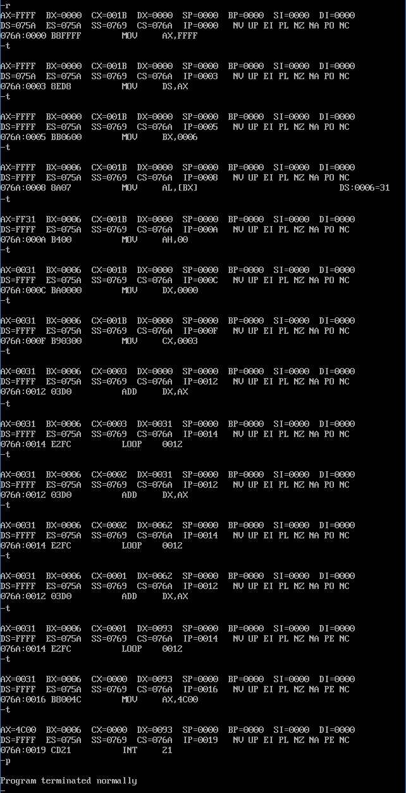
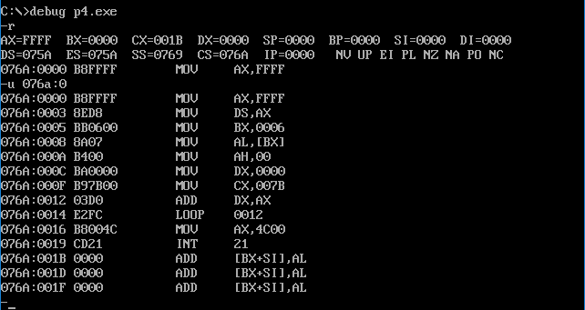

## 第 5 章 [BX] 和 loop 指令

1. **[bx]和内存单元的描述**

​	[bx]是什么呢？和[0]有些类似， [0]表示内存单元，它的偏移地址是0。比如在下面的]指令中（在 Debug 中使用）：

```assembly
mov ax, [0]
```

​	将一个内存单元的内容送入ax，这个内存单元的长度为2字节（字单元），存放一个字，偏移地址为 0，段地址在 ds 中。

```assembly
mov al, [0]
```

​	将一个内存单元的内容送入 al，这个内存单元的长度为 1 字节（字节单元），存放一个字节，偏移地址为 0，段地址在 ds中。

​	要完整地描述一个内存单元，需要两种信息：①内存单元的地址：②内存单元的长度（类型）。

​	用[0]表示一个内存单元时，0 表示单元的偏移地址，段地址默认在 ds 中，**单元的长度（类型）**可以由**具体指令中的其他操作对象（比如说寄存器）指出**。

​	[bx]同样也表示一个内存单元，它的偏移地址在bx中，比如下面的指令：mov ax, [bx]

将一个内存单元的内容送入 ax，这个内存单元的长度为 2 字节（字单元），存放一个字，偏移地址在 bx 中，段地址在 ds中。

```assembly
mov al, [bx]
```

​	将一个内存单元的内容送入al，这个内存单元的长度为1字节（字节单元），存放一个字节，偏移地址在 bx 中，段地址在ds中。

2. **loop**

英文单词“loop”有循环的含义，显然这个指令和循环有关。

我们在这一章，讲解[bx]和 loop 指令的应用、意义和相关的内容。

3. **我们定义的描述性的符号：“（）”**

​	为了描述上的简洁，在以后的课程中，我们将使用一个描述性的符号“（）”来**表示一个寄存器或一个内存单元中的内容**。比如：

​	(ax)表示 ax 中的内容、(al)表示 al 中的内容；

​	(20000H)表示内存20000H单元的内容(()中的内存单元的地址为**物理地址**）；

​	(ds)*16+(bx)表示：

​	ds中的内容为ADR1，bx中的内容为ADR2，内存ADR1×16+ADR2单元的内容。

​	也可以理解为：ds中的ADR1作为段地址，bx中的ADR2作为偏移地址，内存ADR1:ADR2单元的内容。

注意，“（）”中的元素可以有3种类型：①寄存器名；②段寄存器名；③内存单元的物理地址（一个20位数据）。比如：

​	(ax)、(ds)、(al)、(cx)、(20000H)、(ds)*16+(bx)等是正确的用法； (2000:0)、((ds):1000H)等是不正确的用法。

我们看一下(X)的应用，比如，

(1) ax中的内容为0010H，可以这样来描述：(ax)=0010H；

(2) 2000:1000处的内容为0010H，可以这样来描述：（21000H)= 0010H；

(3) 对于mov ax,[2]的功能，可以这样来描述：(ax)=((ds) * 16 + 2)；

(4) 对于mov[2],ax的功能，可以这样来描述：((ds)*16+2) = (ax)；

(5) 对于add ax,2的功能，可以这样来描述：(ax) = (ax)+2；

(6)对于add ax,bx的功能，可以这样来描述：(ax)=(ax)+(bx); 

(7)对于push ax的功能，可以这样来描述：

```assembly
(sp)=(sp)-2
((ss)*16+(sp))=(ax)
```

(8)对于pop ax的功能，可以这样来描述：

```assembly
(ax)=(ss)*16+(sp)
(sp)=(sp)+2
```

​	“（X)”所表示的数据有两种类型：①字节；②字。是哪种类型由寄存器名或具体的运算决定，比如：

​	(al)、(bl)、(cl)等得到的数据为**字节型**；(ds)、(ax)、(bx)等得到的数据为**字型**。

​	(al)=(20000H)，则(20000H)得到的数据为字节型；(ax)=(20000H)，则(20000H)得到的数据为字型。

4. **约定符号 idata 表示常量**

​	我们在Debug 中写过类似的指令：mov ax,[0]，表示将ds:0处的数据送入ax中。指令中，在“[...]”里用一个常量 0 表示内存单元的偏移地址。以后，我们用 idata 表示常量。比如：

```assembly
mov ax,[idata]		;就代表 mov ax,[1]、mov ax,[2]、mov ax,[3]等
mov bx,idata		;就代表 mov bx,1、mov bx,2、mov bx,3等
mov ds,idata		;就代表 mov ds,1、mov ds,2等，它们都是非法指令
```


### 5.1 [BX]

​	看一看下面指令的功能

```assembly
mov ax, [bx]
```

​	功能：bx中存放的数据作为一个偏移地址EA，段地址 SA 默认在 ds 中，将SA:EA处的数据送入ax中。即：(ax)=(ds)* 16 +(bx)。

```assembly
mov [bx],ax
```

​	功能：bx中存放的数据作为一个偏移地址EA，段地址 SA 默认在 ds 中，将 ax 中的数据送入内存SA:EA处。即：((ds)*16+(bx))=(ax)。

#### 问题 5.1

​	程序和内存中的情况如图 5.1 所示，写出程序执行后，21000H～21007H单元中的内容。


<center style="color:#C0C0C0">图5.1 程序和内存中的情况</center>

​	注意，inc bx的含义是 bx 中的内容加1，比如下面两条指令：

```assembly
mov bx, 1
inc bx 
```

执行后，bx=2。 

解析：

| 指令序列     | AX    | BX    | DS    | 内存单元变化               | 内容 | 内存地址 |
| ------------ | ----- | ----- | ----- | -------------------------- | ---- | -------- |
| mov ax,2000H | 2000H | -     | -     | -                          | BE   | 21000H   |
| mov ds,ax    | -     | -     | 2000H | -                          | 00   | 21001H   |
| mov bx,1000H |       | 1000H | -     | -                          | `BE` | 21002H   |
| mov ax,[bx]  | 00BEH | -     | -     | -                          | `00` | 21003H   |
| inc bx       | -     | 1001H | -     | -                          | `BE` | 21004H   |
| inc bx       | -     | 1002H | -     | -                          | `BE` | 21005H   |
| mov [bx],ax  | -     | -     | -     | 21002H变为BE，21003H变为00 | `BE` | 21006H   |
| inc bx       | -     | 1003H | -     | -                          | `BE` | 21007H   |
| inc bx       | -     | 1004H | -     | -                          |      |          |
| mov [bx],ax  | -     | -     | -     | 21004H变为BE，21005H变为00 |      |          |
| inc bx       | -     | 1005H | -     | -                          |      |          |
| mov [bx],al  | -     | -     | -     | 21005H变为BE               |      |          |
| inc bx       | -     | 1006H | -     | -                          |      |          |
| mov [bx],al  | -     | -     | -     | 21006H变为BE               |      |          |

### 5.2 Loop 指令

​	loop 指令的格式是：`loop 标号`，CPU 执行 loop 指令的时候，要进行两步操作：

​	①(cx)=(cx)-1;

​	②判断 cx 中的值

​	不为零则转至标号处执行程序，如果为零则向下执行。

​	从上面的描述中，可以看到，cx 中的值影响着 loop 指令的执行结果。通常(注意,我们说的是通常)我们用 loop 指令来实现循环功能，cx 中存放循环次数。

​	下面我们通过一个程序来看一下 loop 指令的具体应用。

​	任务 1：编程计算 2^2,结果存在 ax 中。

​	分析：设(ax)=2,可计算`(ax)=(ax)*2`,最后(ax)中为 2^2 的值。`N*2`可用 N+N 实现,程序如下。

```assembly
assume cs:code
code segment
    mov ax,2
    add ax,ax
    mov ax,4c00h
    int 21h
code ends
end
```

任务2：编程计算2^3。

分析：`2^3=2*2*2`，若设`(ax)=2`，可计算`(ax)=(ax)*2*2`，最后(ax)中为2^3的值。`N*2`可用N+N实现，程序如下。

```assembly
assume cs:code
code seqment 
    mov ax,2
    add ax,ax
    add ax,ax

    mov ax, 4c00h
    int 21h
code ends
end
```

任务3：编程计算2^12。

分析：`2^12=2*2*2*2*2*2*2*2*2*2*2*2`，若设`(ax)=2`，可计算`(ax)(ax)*2*2*2*2*2*2*2*2*2*2*2`，最后（ax）中为2^12的值。`N*2`可用N+N实现，程序如下。

```assembly
assume cs:code
code segment
    mov ax,2
    ;做11次add ax,ax
    mov ax,4c00h
    int 21h 
code ends 
end
```

​	可见，按照我们的算法，计算2^12需要11条重复的指令add ax,ax。这里，可用loop来简化我们的程序。

**程序 5.1**

```assembly
assume cs:code
code segment
    mov ax,2
    mov cx,11 
s:  add ax,ax 
    loop s 
    mov ax,4c00h
    int 21h
code ends
end 
```

下面分析一下程序5.1。

(1)**标号**

​	在汇编语言中，标号代表一个地址，程序 5.1 中有一个标号 s。它实际上标识了一个地址，这个地址处有一条指令：`add ax,ax`。

(2)**loop s**

​	CPU执行 loops 的时候，要进行两步操作：

​	①(cx)=(cx)-1;

​	②判断 cx 中的值，不为 0 则转至标号 s 所标识的地址处执行（这里的指令是`add ax,ax`），如果为 0 则执行下一条指令（下一条指令是mov ax,4c00h）。

(3)以下3条指令：

```assembly
	mov cx,11
s:  add ax, ax
	loop s
```

​	执行 loop s 时，首先要将(cx)减 1，然后若(cx)不为 0，则向前转至 s 处执行`add ax,ax`。所以，可以利用 cx 来控制 add ax,ax 的执行次数。

​	下面我们详细分析一下这段程序的执行过程，从中体会如何用cx和loops相配合实现循环功能。

(1)执行mov cx,11,设置(cx)=11; 

(2)执行add ax,ax(第1次)；

(3)执行loops将(cx)减1，(cx)=10,(cx)不为0，所以转至s处； 

(4)执行add ax,ax(第2次)；

(5)执行loops将(cx)减1，(cx)=9,(cx)不为0，所以转至s处； 

(6)执行add ax,ax(第3次)；

... ... ... ...

(21)执行loops将(cx)减1，(cx)=1,(cx)不为0，所以转至s处； 

(22)执行 add ax,ax(第11次)；

(23)执行loops将(cx)减1，(cx)= 0，(cx)为0，所以向下执行。（结束循环）

从上面的过程中，我们可以总结出用 cx 和 loop 指令相配合实现循环功能的 3 个要点：

* ①在cx中存放循环次数；

* ②loop指令中的标号所标识地址要在前面；

* ③要循环执行的程序段，要写在标号和loop指令的中间。

用cx和loop指令相配合实现循环功能的程序框架如下。

```assembly
	mov cx,循环次数 
S:  循环执行的程序段
	loop s
```

####  问题5.2

​	编程，用加法计算123*236，结果存在ax中。

分析：

可用循环完成，将123加236次。

程序5.2

```assembly
assume cs:code
code segment
    mov ax, 0
    mov cx, 256
    s: add ax, 123
	loop s
	mov ax,4c00h
	int 21h
	
code ends
end
```

#### 问题 5.3

​	改进5.2程序，提高`123*256`的计算速度。

分析：

​	可以将 236 加 123 次。

### 5.3 在Debug中跟踪用 loop 指令实现的循环程序

考虑这样一个问题，计算ffff:0006单元中的数乘以3，结果存储在 dx 中。

我们分析一下。

(1)运算后的结果是否会超出 dx 所能存储的范围？

​	ffff:0006单元中的数是一个字节型的数据，范围在0～255之间，则用它和3相乘结果不会大于65535，可以在 dx 中存放下。

(2)用循环累加来实现乘法，用哪个寄存器进行累加？

​	将ffff:0006单元中的数赋值给 ax，用 dx 进行累加。先设(dx) = 0，然后做3次(dx)=(dx)+(ax).

(3)ffff:6单元是一个字节单元，ax是一个16位寄存器，数据的长度不一样，如何赋值？

​	即令它们的值相等，要考虑8位数据01H和16位数据0001H的数据长度不一样

​	那么我们如何赋值？设ffff:0006单元中的数据是XXH，若要 ax 中的值和ffff:0006单元中的相等，ax中的数据应为00XXH。所以，若实现ffff:0006单元向ax赋值，应该令(ah)=0, (al)=(ffff6H).

​	想清楚以上的3个问题之后，编写程序如下。

**程序 5.3**

```assembly
assume cs:code
code segment
    mov ax,0ffffh
    mov ds,ax
    mov bx,6	;以上，设置ds:bx指向ffff:6
    
    mov al,[bx]
    mov ah,0	;以上，设置(al)=((ds*16)+(bx),(ah)=0
    
    mov dx,0	;累加寄存器清0
    
    mov cx,3	;循环3次 
 s: add dx,ax
    loop s		;以上累加计算（ax）*3
	
	mov ax,4c00h
	int 21h		;程序返回

code ends
end
```

​	注意程序中的第一条指令 mov ax,0ffffh。在汇编源程序中，数据可以以数字开头，但**数据不能以字母开头**，所以**要在前面加 0**。

​	下面我们对程序的执行过程进行跟踪。首先，将它编辑为源程序文件，文件名定为p3.asm；对其进行编译连接后生成p3.exe；然后再用 Debug 对 p3.exe 中的程序进行跟踪。

​	用 Debug 加载 p3.exe 后，用 r 命令查看寄存器中的内容，如图 5.3 所示。


<center style="color:#C0C0C0">图5.3 用r命令查看寄存器</center>

​	图5.3中(ds)=075AH，所以，程序在076A:0处。我们看一下，(cs)=076AH，(IP)=0，CS:IP正指向程序的第一条指令。再用 u 命令看一下被Debug加载入内存的程序，如图5.3.1所示。


<center style="color:#C0C0C0">图5.3.1 用 u 命令查看被 Debug 加载入内存的程序</center>

​	可以看到，从076A:0000～076A:001A是我们的程序，076A:0014处是源程序中的指令loop s，只是此处 loop s 中的标号 s 已经变为一个地址 0012h。如果在执行“`loop 0012`”时，cx减 1 后不为 0，“loop 0012”就把IP设置为 0012h，从而使 CS:IP 指向 076A:0012 处的 add dx,ax，实现转跳。

​	我们开始单步跟踪：



<center style="color:#C0C0C0">图5.3.2 程序5.3单步跟踪过程</center>

​	前三条指令执行后，ds:bx指向 ffff:6单元，Debug 将要访问的内存单元中的内容也显示出来，可以看到“ds:0006=31”，由此，我们知道(ffff6H)=31h

​	后两条指令执行后，(dx)=0，完成对累加寄存器的初始化；(cx)=3，完成对循环计数寄存器的初始化。

​	CPU 执行 076A:0012 处的指令后，(IP)=0014H，CPU执行“loop 0012”，第一步(cx)=(cx)-1，第二步判断(cx)≠0，将IP设为0012h，执行后(cx)=2，也就是说“loop 0012”还可以循环两次。继续重复直到(cx)=0为止。

​	最终结果储存在 dx 中，为093h。

​	我们现在将题目改一下，ffff:0006单元中的数乘以 123，结果存在dx 中，程序5.4如下：

**程序 5.4**

```assembly
assume cs:code
code segment
    mov ax,0ffffh
    mov ds,ax
    mov bx,6	;以上，设置ds:bx指向ffff:6
    
    mov al,[bx]
    mov ah,0	;以上，设置(al)=((ds*16)+(bx),(ah)=0
    
    mov dx,0	;累加寄存器清0
    
    mov cx,123	;循环 123 次 
 s: add dx,ax
    loop s		;以上累加计算（ax）*3
	
	mov ax,4c00h
	int 21h		;程序返回

code ends
end
```

​	我们用 Debug 对这个程序的循环程序段进行跟踪，现在有这样一个问题：标号 s 前的指令，已经确定在逻辑上完全正确，我们不想再一步步地跟踪了，只想跟踪循环的过程。所以**希望可以一次执行完标号 s 前的指令**。可以用一个我们以前没用过 Debug命令 g 来达到目的。

​	下面来实际操作一下，我们用程序5.4生成最终的可执行文件“c:\masm\p4.exe”，用Debug加载p4.exe，然后看一下程序在内存中的情况，如图 5.3.3 所示。



<center style="color:#C0C0C0">图5.3.3 程序在内存中的情况</center>

​	图 5.3.3 中，循环程序段从CS:0012开始，CS:0012前面的指令，我们不想再一步步地跟踪，希望能够一次执行完，然后从CS:0012处开始跟踪。可以这样来使用  g 命令，“g 0012”，它表示执行程序到当前代码段（段地址在CS中）的 0012h 处。也就是说“g 0012”将使Debug从当前的CS:IP指向的指令执行，一直到(IP)= 0012h为止。具体的情况如图5.3.4所示。


<center style="color:#C0C0C0">图5.3.4 CS:0012前的程序段被执行</center>

​	图5.3.4中，Debug执行“g0012”后，CS:0012前的程序段被执行，从各个相关的寄存器中的值，我们可以看出执行的结果。

​	可以跟踪几次循环的过程，如果可以确定循环程序段在逻辑上是正确的，不想再继续一步步地观察循环的过程了，继续像从前那样使用 t 命令显然是不可行的，因为还要进行121((cx)=79h)次循环，如果像前两次那样使用t命令，我们得使用121*2=242次 t 命令才能从循环中出来。

​	可以使用p命令将循环一次执行完。再次遇到loop 指令时，使用 p 命令来执行，Debug 就会自动重复执行循环中的指令，直到 (cx)=0为止。具体情况如图5.3.5所示。

图5.3.5中，在遇到“loop 0012”时，用p命令执行，Debug 自动重复执行“loop0012”和“add dx,ax”两条指令，直到(cx)=0。最后一次执行“loop 0012”后，(cx)=0, (IP)=0016h,当前指令为CS:0016处的“mov ax,4c00”。

​	当然，也可以用g命令来达到目的，可以用“g 0016”直接执行到CS:0016处。具体情况如图5.3.5所示。


<center style="color:#C0C0C0">图5.3.5 用p命令和g命令执行</center>

