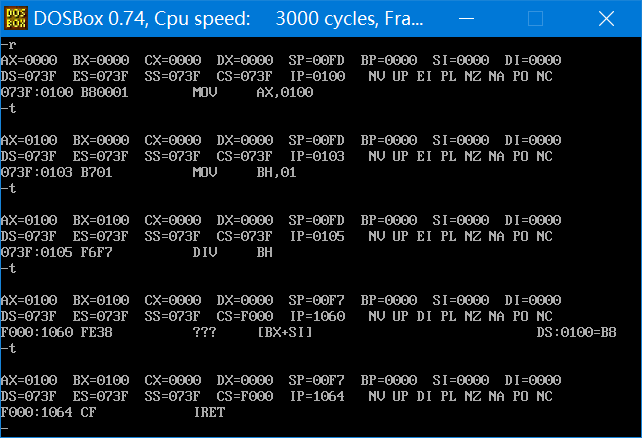

## 第 12 章 内 中 断

​	任何一个通用的 CPU，都具备一种能力，可以在执行完当前正在执行的指令之后，检测到从 CPU 外部发送过来的或内部产生的一种特殊信息——中断信息，并且可以立即对所接收到的信息进行处理。中断的意思是，CPU 不再接着(刚执行的指令)向下执行，而是转去处理这个特殊信息。

​	注意，我们这里所说的中断信息，是为了便于理解而采用的一种逻辑上的说法。它是对几个具有先后顺序的硬件操作所产生的事件的统一描述。“中断信息”是要求 CPU 马上进行某种处理，并向所要进行的该种处理提供了必需的参数的通知信息。因为本书的内容不是微机原理与接口或组成原理，我们只能用一些便于理解的说话来描述一些比较复杂的机器工作原理，从而使学习者忽略一些和我们的学习重点无关的内容。但笔者又需要对这些问题有一个严谨的交代，所以，有了这些补充说明的文字。如果你不理解这些文字所讲的东西，就不必去理解了。

​	中断信息可以来自 CPU 的内部和外部，这一章中，我们主要讨论来自于 CPU 内部的中断信息。

### 12.1 内中断的产生

对于 8086CPU，当 CPU 内部有下面的情况发生的时候，将产生相应的中断信息。

* 除法错误，比如，执行 div 指令产生的除法溢出；

* 单步执行；
* 执行 into 指令；
* 执行 int 指令。

​	我们现在不去管这 4 种情况的的具体含义，只要知道 CPU 内部有 4 种情况可以产生需要及时处理的中断信息即可。既然是不同的信息，就需要进行不同的处理。要进行不同的处理，CPU 先要知道，所接收到的中断信息的来源。所以中断信息中**必须包含识别来源的编码**。8086CPU 用称为**中断类型码**的数据来标识中断信息的来源。中断类型码为**一个字节型数据**，可以表示 256 种中断信息的来源。以后，我们将产生中断信息的事件，即**中断信息的来源，简称为中断源**，上述的 4 种中断源，在 8086CPU 中的中断类型码如下。

* 除法错误：0
* 单步执行：1
* 执行 into 指令：4  
* 执行 int 指令，该指令的格式为 int n，指令中的 n 为字节型立即数，是提供给 CPU 的中断类型码。  

### 12.2 中断处理程序  

​	CPU 收到中断信息后，需要对中断信息进行处理。而如何对中断信息进行处理，可以由我们编程决定。我们编写的，用来处理中断信息的程序被称为**中断处理程序**。一般来说，需要对不同的中断信息编写不同的处理程序。

​	CPU 在收到中断信息后，应该转去执行该中断信息的处理程序。我们知道，若要 8086CPU 执行某处的程序，就要将 CS:IP 指向它的入口（即程序第一条指令的地址）。可见首要的问题是，CPU 在收到中断信息后，如何根据中断信息确定其处理程序的入口。

​	CPU 的设计者必须在中断信息和其处理程序的入口地址之间建立某种联系，使得 CPU 根据中断信息可以找到要执行的处理程序。

​	我们知道，中断信息中包含有标识中断源的类型码。根据 CPU 的设计，中断类型码的作用就是用来定位中断处理程序。比如 CPU 根据中断类型码 4，就可以找到 4 号中断的处理程序。可随之而来的问题是，若要定位中断处理程序，需要知道它的段地址和偏移地址，而如何根据 8 位的中断类型码得到中断处理程序的段地址和偏移地址呢？

### 12.3 中断向量表

​	CPU 用 8 位的中断类型码通过**中断向量表**找到相应的**中断处理程序的入口地址**。那什么是中断向量表呢？中断向量表就是中断向量的列表。那么什么又是中断向量呢？所谓中断向量，就是中断处理程序的入口地址。展开来讲，中断向量表，就是**中断处理程序入口地址的列表**。

​	中断向量表在内存中保存，其中存放着 256 个中断源所对应的中断处理程序的入口，如下表所示。

<center style="color:#C0C0C0">表 中断向量表</center>

| 中断向量表                            |
| ------------------------------------- |
| 0号中断源对应的中断处理程序的入口地址 |
| 1号中断源对应的中断处理程序的入口地址 |
| 2号中断源对应的中断处理程序的入口地址 |
| 3号中断源对应的中断处理程序的入口地址 |
| ... ...                               |

​	可以看到，CPU只要知道了中断类型码，就可以将中断类型码作为中断向量表的表项号，定位相应的表项，从而得到中断处理程序的入口地址。

​	可见，CPU用中断类型码，通过查找中断向量表，就可以得到中断处理程序的入口地址。在这个方案中，一个首要的问题是，CPU如何找到中断向量表？现在，找到中断向量表成了通过中断类型码找到中断处理程序入口地址的先决条件。

​	中断向量表在内存中存放，对于8086PC机，中断向量表指定放在内存地址 0 处。从内存 0000:0000 到 0000:03FF 的1024个单元中存放着中断向量表。不能放在，这是规定，因为 8086CPU 就从这个地方读取中断向量表。

​	那么在中断向量表中，一个表项占多大的空间呢？一个表项存放一个中断向量，也就是一个中断处理程序的入口地址，对于 8086CPU，这个**入口地址**包括**段地址和偏移地址**，所以**一个表项占两个字**，**高地址字存放段地址，低地址字存放偏移地址**。

### 12.a 检测点

(1) 用 Debug 查看内存，情况如下：

```assembly
0000:0000 68 10 A7 00 8B 01 70 00-16 00 9D 03 8B 01 70 00
```

则 3 号中断源对应的中断处理程序的入口地址为：＿＿＿＿。

---

解析：

​	3 号中断源入口地址存储在第 6 个字开始的内存单元中，为 0070:018B（注意是高地址存储 CS）

(2) 存储 N 号中断源对应的中断处理程序入口的偏移地址的内存单元的地址为：＿＿＿＿。

​	存储 N 号中断源对应的中断处理程序入口的段地址的内存单元的地址为：＿＿＿＿。

---

解析：

​	中断处理程序入口的地址为：N×4+2:N×4，段地址为 N×4+2，偏移地址为 N×4。

### 12.4 中断过程

​	从上面我们知道，可以用中断类型码，在中断向量表中找到中断处理程序的入口。找到这个入口地址的最终目的是用它设置 CS 和 IP，使 CPU 执行中断处理程序。用中断类型码找到中断向量，并用它设置 CS 和 IP，这个工作是**由 CPU 的硬件自动完成**的。CPU 硬件完成这个工作的过程被称为**中断过程**。

​	CPU 收到中断信号后，要对中断信号进行处理，首先将引发中断过程。硬件在完成中断过程后，CS:IP 将指向中断处理程序的入口，CPU 开始执行中断处理程序。

​	有一个问题需要考虑，CPU 在执行完中断处理程序后，应该返回原来的执行点继续执行下面的指令。所以在中断过程中，在设置 CS:IP 之前，还要将原来的 CS 和 IP 的值保存起来。在使用 call 指令调用子程序时有同样的问题，子程序执行后还要返回到原来的执行点继续执行，所以，call 指令先保存当前 CS 和 IP 的值，然后再设置 CS 和 IP。

​	下面是 8086CPU 在收到中断信息后，所引发的中断过程。

1. （从中断信息中）取得中断类型码；  
2. 标志寄存器的值入栈（因为在中断过程中要改变标志寄存器的值，所以先将其保存在栈中）；  
3. 设置标志寄存器的第 8 位 TF 和第 9 位 IF 的值为 0(这一步的目的后面将介绍)；  
4. CS 的内容入栈；
5. IP的内容入栈；
6. 从内容地址为中断类型码×4 和中断类型码×4+2 的两个字单元中读取中断处理程序的入口地址设置 IP 和 CS。

​	CPU 在收到中断信息之后，如果处理该中断信息，就完成一个由硬件自动执行的中断过程(程序员无法改变这个过程中所要做的工作)。中断过程的主要任务就是用中断类型码在中断向量表中找到中断处理程序的入口地址，设置 CS 和 IP。因为中断处理程序执行完后，CPU 还要回头来继续执行被中断的程序，所以要在设置 CS、IP 之前，先将它们的值保存起来。可以看到 CPU 将它们保存在栈中。我们注意到，在中断过程中还要做的一个工作就是设置标志寄存器的 TF、IF 位，对于这样做的目的，我们将在后面的内容和下一章中进行讨论。因为在执行完中断处理程序后，需要恢复在进入中断处理程序之前的 **CPU 现场(某一时刻，CPU 中各个寄存器的值)**。所以应该在修改标记寄存器之前，将它的值入栈保存。

​	我们更简洁地描述中断过程，如下:

1. 取得中断类型码 N
2. pushf
3. TF=0，IF=0
4. push CS
5. push IP
6. (IP)=(N×4)，(CS)=(N×4+2)

​	在最后一步完成后，CPU 开始执行由程序员编写的中断处理程序。

### 12.5 中断处理程序和 iret 指令

​	由于 CPU 随时都可能检测到中断信息，也就是说，CPU 随时都可能执行中断处理程序，所以中断处理程序必须一直存储在内存某段空间之中。而中断处理程序的入口地址，即中断向量，必须存储在对应的中断向量表表项中。

​	中断处理程序的编写方法和子程序的比较相似，下面是常规的步骤：

1. 保存用到的寄存器；
2. 处理中断；
3. 恢复用到的寄存器；
4. 用 iret 指令返回。

iret 指令的功能用汇编语法描述为：

```assembly
pop IP
pop CS
popf
```

​	iret 通常和硬件自动完成的中断过程配合使用。可以看到，在中断过程中，寄存器入栈的顺序是标志寄存器、CS、IP，而 iret 的出栈顺序是 IP、CS、标志寄存器，刚好和其相对应，实现了用执行中断处理程序前的 CPU 现场**恢复标志寄存器和 CS、IP 的工作**。iret 指令执行后，**CPU 回到执行中断处理程序前的执行点继续执行程序**。

### 12.6 除法错误中断的处理

​	下面的内容中，我们通过对 0 号中断，即除法错误中断的处理，来体会一下前面所讲的内容。

​	当 CPU 执行 div 等除法指令的时候，如果发生了除法溢出错误，将产生中断类型码为 0 的中断信息，CPU 将检测到这个信息，然后引发中断过程，转去执行 0 号中断所对应的中断处理程序。我们看一下下面程序的执行结果，如图 12.6 所示(不同的操作系统下显示可能不同)。

```assembly
mov ax,100h  
mov bh,1  
div bh  
```



<center style="color:#C0C0C0">图12.6 系统对0号中断的处理</center>

​	可以看到，当 CPU 执行 div bh 时，发生了除法溢出错误，产生 0 号中断信息，从而引发中断过程，CPU 执行 0 号中断处理程序。我们从图中可以看出系统中的 0 号中断处理程序的功能：执行机器码为 FE 38 的指令，然后执行 IRET，最后返回到操作系统中。

### 12.7 编程处理 0 号中断

​	现在我们考虑改变一下 0 号中断处理程序的功能，即重新编写一个 0 号中断处理程序，它的功能是在屏幕中间显示“overflow!”，然后返回到操作系统中，如图 12.7 所示。


<center style="color:#C0C0C0">图12.7 预编写程序对0号中断的处理</center>

​	当 CPU 执行 div bh 后，发生了除法溢出错误，产生 0 号中断信息，引发中断过程，CPU 执行我们编写的 0 号中断处理程序。在屏幕中间显示提示信息“overflow!”后，返回到操作系统中。

【编程】当发生除法溢出时，在屏幕中间显示“overflow!”，返回 DOS。

我们首先进行分析：

(1) 当发生除法溢出的时侯，产生 0 号中断信息，从而引发中断过程。
此时，CPU 将进行以下工作。

* ① 取得中断类型码 0；
* ② 标志寄存器入栈，TF、IF 设置为 0；
* ③ CS、IP 入栈；
* ④ (IP)=(0×4)，(CS)=(0×4+2)。

(2) 可见，当中断 0 发生时，CPU 将转去执行中断处理程序。

只要按如下步骤编写中断处理程序，当中断0发生时，即可显示“overflow!”。

* ① 相关处理；
* ② 向显示缓冲区送字符串“overflow!”；
* ③ 返回DOS。

我们将这段程序称为：do0。

(3) 现在的问题：do0 应存放在内存中。因为除法溢出随时可能发生，CPU 随时都可能将 CS:IP 指向 do0 的入口，执行程序。
	那么 do0 应该放在哪里呢？
	由于我们是在操作系统之上使用计算机，所有的硬件资源都在操作系统的管理之下，所以我们要想得到一块内存存放do0，应该向操作系统申请。
	但在这里出于两个原因我们不想这样做：

* ①过多地讨论申请内容会将偏离问题的主线；
* ②我们学习汇编的一个重要的目的就是要获得对计算机底层的编程体验。所以，在可能的情况下，我们不去理会操作系统，而直接面向硬件资源。

​	问题变得简单而且直接，我们需要找到一块别的程序不会用到的内存区，将 do0 传送到其中即可。

​	前面讲到，内存 0000:0000～0000:03FF，大小为 1KB 的空间是系统存放中断处理程序入口地址的中断向量表。8086支持 256 个中断，但是，实际上，系统中要处理的中断事件远没有达到 256 个。所以在中断向量表中，有许多单元是空的。

​	中断向量表是 PC 系统中最重要的内存区，只用来放置中断处理程序的入口地址，DOS 系统和其他应用程序都不会随便使用这段空间。可以利用中断向量表中的空闲单元来放置我们的程序。一般情况下，从 0000:0200 至 0000:02FF 的 256 个字节的空间所对应的中断向量表项都是空的，操作系统和其他应用程序都不占用。我们在前面的课程中使用过这段空间(参见 5.7 节)。

​	根据以前的编程经验，我们可以估计出，do0 的长度不可能超过 256 个字节。

​	结论：我们可以将 do0 传送到底存 0000:0200 处。

(4)将中断处理程序 do0 放到 0000:0200 后，若要使得除法溢出发生的时候，CPU 转去执行 do0，则必须将 do0 的入口地址，即 0000:0200 登记在中断向量表的对应表项中。因为除法溢出对应的中断类型码为 0，它的中断处理程序的入口地址应该从 0×4 地址单元开始存放，段地址存放在 0×4+2 字单元中，偏移地址存放在 0×4 字单元中。也就是说要将 do0 的段地址 0 存放在 0000:0002 字单元中，将偏移地址 200H 存放在 0000:0000 字单元中。

​	总结上面的分析，我们要做以下几件事情。

* (1)编写可以显示“overflow!”的中断处理程序：do0
* (2)将 do0 送入内存 0000:0200 处
* (3)将 do0 的入口地址 0000:0200 存储在中断向量表 0 号表项中

程序的框架如下。

**程序12.1**

```assembly
assume cs:code
code segment
start:
	do0 安装程序
	设置中断向量表
	mov ax,4c00h
	int 21h
do0:
	显示字符串“overflow!”
	mov ax, 4c00h
	int 21h
code ends
end start
```

可以看到，上面的程序分为两部分：

* 安装 do0，设置中断向量的程序
* do0

​	程序 12.1 执行时，do0 的代码是不执行的，它只是作为 do0 安装程序所要传送的数据。程序 12.1 执行时，首先执行 do0 安装程序，将 do0 的代码复制到内存 0:200 处，然后设置中断向量表，将 do0 的入口地址，即偏移地址 200H 和段地址 0，保存在 0 号表中。这两部分工作完成后，程序就退回了。程序的目地就是在内存 0:200 处安装 do0 的代码，将 0 号中断处理程序的入口地址设置为 0:200。do0 的代码虽然在程序中，如不在程序执行的时候执行。它是在除法溢出发生的时候才得以执行的中断处理程序。
​	do0 部分代码的最后两条指令是依照我们的编程要求，用来返回 DOS 的。

​	现在，我们再从过来从CPU的角度看一下，什么是中断处理程序？我们来看一下 do0 是如何变成 0 号中断的中断处理程序的。

​	(1) 程序 12.1 在执行时，被加载到内存中，此时 do0 的代码在程序 12.1 所在的内存空间中，它只是存放在程序 12.1 的代码中的一段要被传送到其他单元中的数据，我们不能说它是 0 号中断的中断处理程序；
​	(2) 程序 12.1 中安装 do0 的代码执行完后，do0 的代码被从程序 12.1 的代码段中复制到 0:200 处。此时，我们也不能说它是 0 号中断的中断处理程序，它只不过是在 0:200 处的一些数据；
​	(3) 程序 12.1 中设置中断向量表的代码执行完后，在 0 号表中填入了 do0 的入口地址 0:200，此时 0:200 处的信息，即 do0 的代码，就变成了 0 号中断的中断处理程序。因为当除法溢出(即 0 号中断)发生时，CPU 将执行 0:200 处的代码。

​	回忆一下：

​	我们如何让一个内存单元成为栈顶? 将它的地址放入 SS、SP 中;

​	我们如何让一个内存单元中的信息被CPU当作指令来执行? 将它的地址放入 CS、IP 中;

​	那么，我们如何让一段程序成为 N 号中断的中断处理程序? 将**它的入口地址放入中断向量表的 N 号表中**。

下面的内容中，我们讨论每一部分程序的具体编写方法。

### 12.8 安装

可以使用 movsb 指令，将 do0 的代码送入 0:200 处。程序如下。

```assembly
assume cs:code
code segment
start:
	设置 es:di 指向目的地址
	设置 ds:si 指向源地址
	设置 cx 为传输长度
	设置传输方向为正
	rep movsb

	设置中断向量表

	mov ax,4c00h
	int 21h
do0: 
	显示字符串“overflow!”
	mov ax,4c00h
	int 21h
code ends
end start
```

我们来看一下，用 rep movsb 指令的时候要确定的信息。

* (1) 传送的原始位置，段地址：code，偏移地址：offset do0；
* (2) 传送的目的位置：0:200；
* (3) 传送的长度：do0 部分代码的长度；
* (4) 传送的方向：正向。

更明确的程序如下。

```assembly
assume cs:code
code segment
start:
    mov ax,cs
    mov ds,ax
    mov si,offset do0 ;设置 ds:si 指向源地址
    mov ax,0
    mov es,ax
    mov di,200h ;设置 es:di 指向目的地址
    mov cx,do0 部分代码的长度 ;设置 cx 为传输长度
    cld ;设置传输方向为正
```

(1) 传送的原始位置，段地址：code，偏移地址：offset do0；

(2) 传送的目的位置：0:200；

(3) 传送的长度：do0部分代码的长度；

(4) 传送的方向：正向。

更明确的程序如下。

```assembly
assume cs:code
code segment
start:
	mov ax,cs
	mov ds,ax
	mov si,offset do0 				;设置ds:si指向源地址
	
	mov ax,0
	mov es,ax
	mov di,200h 					;设置es:di指向目的地址
	
	mov cx,offset do0end-offset do0 ;设置cx为传输长度
	
	cld 							;设置传输方向为正
	rep movsb
	
	设置中断向量表
	
	mov ax,4c00h
	int 21h
do0:
	显示字符串“overflow!”
	mov ax,4c00h
	int 21h

do0end:
	nop

code ends
end start
```

​	计算 do0 代码的长度最简单的方法是，计算一下 do0 中所有指令码的字节数。但是这样做太麻烦了，因为只要 do0 的内容发生了改变，我们都要重新计算它的长度。可以利用编译器来计算 do0 的长度，具体做法如上。

​	“-”是编译器识别的运算符号，**编译器可以用它来进行两个<u>常数</u>的减法**。  

​	汇编编译器可以处理表达式，比如，指令：mov ax,(5+3)*5/10，被编译器处理为指令：mov ax,4。
​	好了，知道了“-”的含义，对于用于 offset do0end-offset do0，得到 do0 代码的长度的原理，这里就不再多说了，相信到了现在，读者已可以自己进行分析了。

​	下面我们编写 do0 程序。

### 12.9 do0

do0程序的主要任务是显示字符串，程序如下。

```assembly
do0: 
	设置 ds:si 指向字符串
	mov ax,0b800h
	mov es,ax
	mov di,12*160+36*2 	;设置es:di指向显存空间的中间位置
	mov cx,9 			;设置cx为字符串长度
s:
	mov al,[si]
	mov es:[di],al
	inc si
	add di,2
    loop s
    
	mov ax,4c00h
	int 21h
do0end:
	nop
```

程序写好了，可要显示的字符串放在哪里呢？

​	如果像之前的 show_str 程序一样放在 data 区，看似合理，可实际上却大错特错。注意，“overflow!”在程序的data 段中。程序执行完成后返回，它所占用的内存空间被系统释放，而在其中存放的“overflow!”也将很可能被别的信息覆盖。而 do0 程序被放到了 0:200 处，随时都会因发生了除法溢出而被 CPU 执行，很难保证 do0 程序从原来程序所处的空间中取得的是要显示的字符串“overflow!”。
​	因为 do0 程序随时可能被执行，而它要用到字符串“overflow!”,所以该字符串也应该存放在一段不会被覆盖的空间中。正确的程序如下。

**程序 12.3**

```assembly
assume cs:code
code segment
start:
	mov ax,cs
	mov ds,ax
	mov si,offset do0 				;设置ds:si指向源地址
	mov ax,0
	mov es,ax
	mov di,200h 					;设置es:di指向目的地址
	mov cx,offset do0end-offset do0 ;设置cx为传输长度
	cld 							;设置传输方向为正
	rep movsb 
	设置中断向量表

	mov ax,4c00h
	int 21h
do0: 
	jmp short do0start
	db "overflow!"
do0start:
	mov ax,cs
	mov ds,ax
	mov si,202h 		;设置ds:si指向字符串
	
	mov ax,0b800h
	mov es,ax
	mov di,12*160+36*2 	;设置es:di指向显存空间的中间位置
	
	mov cx,9 			;设置cx为字符串长度
s: 
	mov al,[si]
	mov es:[di],al
	inc si
	add di,2
	loop s

	mov ax,4c00h
	int 21h
do0end:
	nop
code ends
end start
```

​	在程序 12.3 中，将“overflow!”放到 do0 程序中，程序 12.3 执行时，将标号 do0 到标号 do0end 之间的内容送到 0000:0200 处。
​	注意，因为在 do0 程序开始处的“overflow!”不是可以执行的代码，所以在“overflow!”之前加上一条 jmp 指令，转移到正式的 do0 程序。当除法溢出发生时，CPU 执行 0:200 处的 jmp 指令，跳过后面的字符串，转到正式的 do0 程序执行。
​	do0 程序执行过程中必须要找到“overflow!”，那么它在哪里呢？首先来看段地址，“overflow!”和 do0 的代码处于同一个段中，而除法溢出发生时，CS 中必然存放 do0 的段地址，也就是“overflow!”的段地址；再来看偏移地址，0:200 处的指令为 jmp short do0star，这条指令占两个字节，所以“overflow!”的偏移地址为 202h。

### 12.10 设置中断向量

​	下面，将 do0 的入口地址 0:200，写入中断向量表的 0 号表项中，使 do0 成为 0 号中断的中断处理程序。

​	0号表项的地址为 0:0，其中 0:0 字单元存放偏移地址，0:2 字单元存放段地址。程序如下：

```assembly
mov ax,0
mov es,ax
mov word ptr es:[0*4],200h
mov word ptr es:[0*4+2],0
```

### 12.11 单步中断

基本上，CPU 在执行完一条指令之后，如果检测到标志寄存器的 TF 位为 1，则产生单步中断，引发中断过程。单步中断的中断类型码为 1，则它所引发的中断过程如下。

* (1) 取得中断类型码 1;
* (2) 标志寄存器入栈，TF、IF 设置为 0;
* (3) CS、IP 入栈;
* (4) IP=(1×4)，(CS)=(1×4+2)。

​	如上所述，如果 TF=1，则执行一条指令后，CPU 就要转去执行 1 号中断处理程序。CPU 为什么要提供这样的功能呢？

​	我们在使用 Debug 的 t 命令的时候，有没有想过这样的问题，Debug 如何能让 CPU 在执行一条指令后，就显示各个寄存器的状态？我们知道，CPU 在执行程序的时候是从 CS:IP 指向的某个地址开始，自动向下读取指令执行。也就是说，如果 CPU 不提供其他功能的话，就按这种方式工作，只要 CPU一加电，它就从预设的地址开始一直执行下去，不可能有任何程序能控制它在执行完一条指令后停止，去做别的事情。可是，我们在 Debug 中看到的情况却是，Debug 可以控制 CPU 执行被加载程序中的一条指令，然后让它停下来，显示寄存器的状态。

​	Debug 有特殊的能力吗？我们只能说 Debug 利用了 CPU 提供的一种功能。只有 CPU 提供了在执行一条指令后就做其他事情的功能，Debug 或是其他的程序才能利用 CPU 提供的这种功能做出我们使用 T 命令时的效果。

​	好了，我们来简要地考虑一下 Debug 是如何利用 CPU 所提供的单步中断的功能的。首先，Debug 提供了单步中断的中断处理程序，功能为显示所有寄存器的内容等待输入命令。然后，在使用 t 命令执行指令时，Debug 将 TF 设置为 1，使得 CPU 工作于单步中断方式下，则在 CPU 执行完这条指令后就引发单步中断，执行单步中断的中断处理程序，所有寄存器中的内容被显示在屏幕上，并且等待输入命令。

​	那么，接下来的问题是，当 TF=1 时，CPU 在执行完一条指令后将引发单步中断，转去执行中断处理程序。注意，中断处理程序也是由一条条指令组成的，如果在执行中断处理程序之前，TF=1，则 CPU 在执行完中断处理程序的第一条指令后，又要产生单步中断，则又要转去执行单步中断的中断处理程序，在执行完中断处理程序的第一条指令后，又要产生单步中断，则又要转去执行单步中断的中断处理程序……  

​	看来，上面的过程将陷入一个永远不能结束的循环，CPU 永远执行单步中断处理程序的第一条指令。

​	CPU 当然不能让这种情况发生，解决的办法就是，在进入中断处理程序之前，设置 TF=0。从而避免 CPU 在执行中断处理程序的时候发生单步中断。这就是为什么在中断过程中有 TF=0 这个步骤，我们再来看一下中断过程。

* (1) 取得中断类型码N;
* (2) 标志寄存器入栈，TF=0，IF=0;
* (3) CS、IP 入栈;
* (4) (IP)=(N×4)，(CS)=(N×4+2)。  

​	最后，CPU 提供单步中断功能的原因就是，为单步跟踪程序的执行过程，提供了实现机制。

### 12.12 响应中断的特殊情况  

​	一般情况下，CPU 在执行完当前指令后，如果检测到中断信息，就响应中断，引发中断过程。可是，在有些情况下，CPU 在执行完当前指令后，即便是发生中断，也不会响应。对于这些情况，我们不一列举，只是用一种情况进行说明。  

​	在执行完向 ss 寄存器传送数据的指令后，即便是发生中断，CPU 也不会响应。这样做的主要原因是因为 ss:sp 联合指向栈顶，而对它们的设置应该连续完成。如果在执行完设置 ss 的指令后，CPU 响应中断，引发中断过程，要在栈中压入标志寄存器、CS 和 IP 的值。而 ss 改变，sp 并未改变，ss:sp 指向的不是正确的栈顶，将引起错误。所以 CPU 在执行完设置 ss 的指令后，不响应中断。这给连续设置 ss 和 sp 指向正确的栈顶提供了一个时机。即，我们应该利用这个特性，将设置 ss 和 sp 的指令连续存放，使得设置 sp 的指令紧接着设置 ss 的指令执行，而在此之前，CPU 不会引发中断过程。比如，我们要将栈顶设置为1000:0，应该：

```assembly
mov ax,1000h  
mov ss,ax  
mov sp,0
```

而不应该：

```assembly
mov ax,1000h
mov ss,ax
mov ax,0
mov sp,0
```

​	好了，现在我们回过来看一下，实验 2 中的“(3)下一条指令执行了吗？”现在你知道原因了吗？

​	Debug 利用单步中断来实现 T 命令的功能，也就是说，用 T 命令执行一条指令后，CPU 响应单步中断，执行 Debug 设置好的处理程序，才能在屏幕上显示寄存器的状态，并等待命令的输入。而**在 mov ss,ax 指令执行后，CPU 根本就不响应任何中断，其中也包括单步中断，所以 Debug 设置好的用来显示寄存器状态和等待输入命令的中断处理程序根本没有得到执行**，所以我们看不到预期的结果。CPU 接着向下执行后面的指令 mov sp,10h，然后响应单步中断，我们才看到正常的结果。

### 实验 12 编写 0 号中断的处理程序

​	编写 0 号中断的处理程序，使得在除法溢出发生时，在屏幕中间显示字符串“divide error!”，然后返回到 DOS。

​	要求：仔细跟踪调试，在理解整个过程之前，不要进行后面课程的学习。
