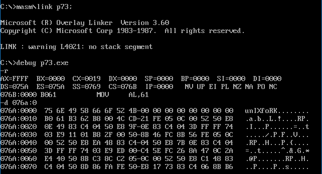
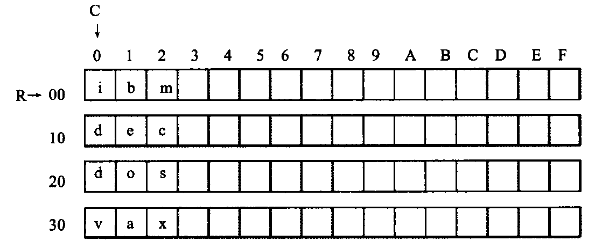
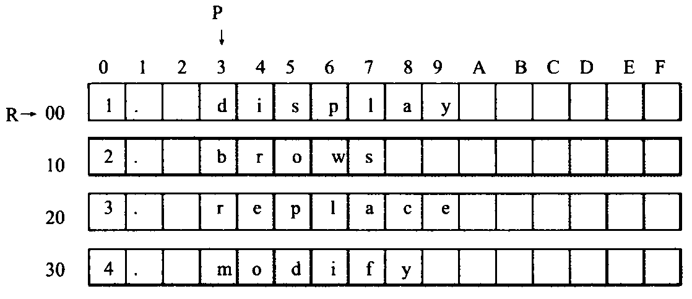
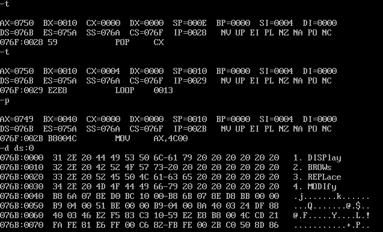

## 第 7 章 更灵活的定位内存地址的方法

​	前面，我们用[0]、[bx]的方法，在访问内存的指令中，定位内存单元的地址。本章我们主要通过具体的问题来讲解一些更灵活的定位内存地址的方法和相关的编程方法。

### 7.1 and 和 or 指令

首先，介绍两条指令and和or，因为我们下面的例程中要用到它们。

(1) and 指令：**逻辑与指令**，**按位进行与运算**。

例如指令：

```assembly
 mov al,01100011B
 and al,00111011B
```

执行后：al=00100011B

通过该指令可将操作对象的相应位设为 0，其他位不变。例如：

将 al 的第 6 位设为 0 的指令是：`and al,10111111B`

将 al 的第 7 位设为 0 的指令是：`and al,01111111B`

将 al 的第 0 位设为 0 的指令是：`and al,11111110B`

(2)or 指令：**逻辑或指令，按位进行或运算**。

例如指令： 

```assembly
mov al,01100011B
or al,00111011B
```

执行后：al=01111011B

通过该指令可将操作对象的相应位设为1，其他位不变。例如：

将 al 的第 6 位设为 1 的指令是：`or al,01000000B`

将 al 的第 7 位设为 1 的指令是：`or al,10000000B`

将 al 的第 0 位设为 1 的指令是：`or al,00000001B`

### 7.2 关于ASCII码

​	计算机中，所有的信息都是二进制，而人能理解的信息是已经具有约定意义的字符。而我们要把这些信息存储在计算机中，就要对其进行编码，将其转化为二进制信息进行存储。而计算机要将这些存储的信息再显示给我们看，就要再对其进行解码。只要编码和解码采用同样的规则，我们就可以将人能理解的信息存入到计算机，再从计算机中取出。

​	世界上有很多编码方案，有一种方案叫做 ASCII 编码，是在计算机系统中通常被采用的。简单地说，所谓编码方案，就是一套规则，它约定了用什么样的信息来表示现实对象。比如说，在 ASCII 编码方案中，用 61H 表示“a”，30H 表示数字“0”。

​	一个文本编辑过程中，就包含着按照 ASCII 编码规则进行的编码和解码。在文本编辑过程中，我们按一下键盘的 a 键，就会在屏幕上看到“a”。这是怎样一个过程呢？我们按下键盘的 a 键，这个按键的信息被送入计算机，计算机用 ASCII 码的规则对其进行编码，将其转化为 61H 存储在内存的指定空间中；文本编辑软件从内存中取出61H，将其送到显卡上的显存中；工作在文本模式下的显卡，用 ASCII 码的规则解释显存中的内容，61H 被当作字符“a”，显卡驱动显示器，将字符“a”的图像画在屏幕上。我们可以看到，显卡在处理文本信息的时候，是按照 ASCII 码的规则进行的。这也就是说，如果我们要想在显示器上看到“a”，就要给显卡提供“a”的 ASCII 码，61H。如何提供？当然是写入显存中。

### 7.3 以字符形式给出的数据

​	我们可以在汇编程序中，用'......'的方式指明数据是以字符的形式给出的，编译器将把它们转化为相对应的 ASCII 码。如下面的程序。

**程序 7.3**

```assembly
assume cs:code,ds:data
data segment 
    db 'unIX' 
    db 'foRK' 
data ends 
code segment 
start: 
    mov al,'a'
    mov bl,'b' 

    mov ax,4c00h 
    int 21h 
code ends
end start 
```

上面的源程序中：

​	“db 'unIX'” 相当于“db 75H,6EH,49H,58H”， “u”、“n”, “I”、“X” 的 ASCII 码分别为 75H、6EH、49H、58H;

​	“db 'foRK'”相当于“db 66H,6FH,52H,4BH”,“f”、“o”、“R”、 “K”的ASCII码分别为 66H、6FH、52H、4BH;

​	“mov al,'a'”相当于“mov al,61H”，“a”的 ASCII 码为 61H; 

​	“mov bl,'b'”相当于“mov al,62H”，“b”的 ASCII 码为 62H。

​	将程序 7.3 编译为可执行文件后，用 Debug 加载查看 data 段中的内容，如图 7.3 所示。



```html
<center style="color:#C0C0C0">图7.3 查看data段中的内容</center>
```

​	图 7.3 中，先用 r 命令分析一下 data 段的地址，因“ds=075A”，所以程序从 076AH 段开始，data 段又是程序中的第一个段，它就在程序的起始处，所以它的段地址为 076AH.

​	用 d 命令查看 data段，Debug 以十六进制数码和 ASCII 码字符的形式显示出其中的内容，从中，可以看出data 段中的每个数据所对应的 ASCII 字符。

### 7.4 大小写转换的问题

​	下面考虑这样一个问题，在codesg 中填写代码，将 datasg 中的第一个字符串转化为大写，第二个字符串转化为小写。

```assembly
assume cs: codesg, ds: datasg

datasg segment
db 'BasiC'
db 'iNfOrMaTiOn'
datasg ends 
codesg segment 
start: 
	;/*Code Answer*/
codesg ends
end start
```

​	首先分析一下，我们知道同一个字母的大写字符和小写字符对应的 ASCII 码是不同的，比如“A”的 ASCII 码是 41H，“a”的 ASCII 码是 61H。要改变一个字母的大小写，实际上就是要改变它所对应的 ASCII 码。我们可以将所有的字母的大写字符和小写字符所对应的ASCI码列出来，进行一下对比，从中找到规律。

| 大写 | 十六进制 | 二进制    | 小写 | 十六进制 | 二进制    |
| ---- | -------- | --------- | ---- | -------- | --------- |
| A    | 41       | 0100 0001 | a    | 61       | 0110 0001 |
| B    | 42       | 0100 0010 | b    | 62       | 0110 0010 |
| C    | 43       | 0100 0011 | c    | 63       | 0110 0011 |
| D    | 44       | 0100 0100 | d    | 64       | 0110 0100 |
| E    | 45       | 0100 0101 | e    | 65       | 0110 0101 |
| F    | 46       | 0100 0110 | f    | 66       | 0110 0110 |
| ...  |          |           | ...  |          |           |

​	通过对比，我们可以看出来，小写字母的 ASCII 码值比大写字母的 ASCII 码值大 20H。这样，我们可以想到，如果将“a”的 ASCII 码值减去 20H，就可以得到“A”；如果将“A”的 ASCII 码值加上 20H 就可以得到“a”。按照这样的方法，可以将 datasg 段中的第一个字符串“BaSiC”中的小写字母变成大写，第二个字符串“iNfOrMaTiOn”中的大写字母变成小写。

​	要注意的是，对于字符串“BaSiC”，应只对其中的小写字母所对应的ASCII码进行减20H的处理，将其转为大写，而对其中的大写字母不进行改变；对于字符串“iNfOrMaTiOn”，我们应只对其中的大写字母所对应的ASCII码进行加20H的处理，将其转为小写，而对于其中的小写字母不进行改变。这里面就存在着一个前提，程**序必须要能够判断一个字母是大写还是小写**。以“BaSiC”讨论，程序的流程将是这样的：

```assembly
assume cs:codesg, ds:datasg 
datasg segment
    db 'Basic' 
    db 'iNfOrMaTiOn'
datasg ends

codesg segment
start: 
    mov ax,datasg
    mov ds,ax
    mov bx,0 
    mov cx,5
s:
	mov al,[bx]
	;如果(al)>61H,则为小写字母的ASCII码，则：sub al,20H
	mov [bx], al
	inc bx
	loop s
	;... ...
codesg ends
end start
```

​	判断将用到一些我们目前还没有学习到的指令。现在面临的问题是，用已学的指令来解决这个问题，则**不能对字母的大小写进行任何判断**。

​	但是，现实的问题却要求程序必须要能区别对待大写字母和小写字母。那么怎么办呢？

​	如果一个问题的解决方案，使我们陷入一种矛盾之中。那么，很可能是我们考虑问题的出发点有了问题，或是说，我们起初运用的规律并不合适。

​	我们前面所运用的规律是，小写字母的 ASCII 码值，比大写字母的 ASCII 码值大 20H。考虑问题的出发点是：大写字母 +20H= 小写字母，小写字母 -20H= 大写字母。这使我们最终落入了这样一个矛盾之中：必须判断是大写字母还是小写字母，才能决定进行何种处理，而我们现在又没有可以使用的用于判断的指令。

​	我们应该重新观察，寻找新的规律。可以看出，就 ASCII 码的二进制形式来看，除第 5 位（**位数从0开始计算**）外，大写字母和小写字母的其他各位都一样。**大写字母 ASCII 码的第 5 位为 0，小写字母的第 5 位为 1**。这样，我们就有了新的方法，一个字母，不管它原来是大写还是小写，将它的第 5 位置 0，它就必将变为大写字母；将它的第 5 位置 1，它就必将变为小写字母。在这个方法中，我们不需要在处理前判断字母的大小写。比如：对于“BaSiC”中的“B”，按要求，它已经是大写字母了，不应进行改变，将它的第 5 位设为 0，它还是大写字母，因为它的第 5 位本来就是 0。

​	自然想到我们刚刚学过的 or 和 and 指令将一个数据中的某一位置 0 还是置 1，完整的程序如下：

```assembly
assume cs:codesg, ds:datasg

datasg segment
	db 'BasiC'
	db 'iNfOrMaTiOn'
datasg ends
codesg segment
start:
	mov ax, datasg		
	mov ds, ax			;设置 ds 指向 datasg段
	mov bx,0			;设置(bx)=0,ds:bx指向'BaSiC'的第一个字母 
	mov cx,5			;设置循环次数5，因为'BaSiC'有5个字母
s:
	mov al, [bx]		;将ASCII码从ds：bx所指向的单元中取出
	and al,11011111B	;将al中的ASCII码的第5位置为0，变为大写字母
	mov [bx], al		;将转变后的ASCII码写回原单元
	inc bx				;(bx)加1，ds：bx指向下一个字母
	loop s

	mov bx,5			;设置(bx)=5,ds:bx指向'iNfOrMaTiOn'的第一个字母 
	mov cx,11			;设置循环次数11，因为'iNfOrMaTiOn'有11个字母
s0:
	mov al,[bx]
	or al,00100000B	;将al中的ASCII码的第5位置为1，变为小写字母
	mov [bx],al
	inc bx
	loop s0
	
	mov ax,4c00h
	int 21h
codesg ends
end start 
```

### 7.5 [bx+idata]

​	在前面，我们用[bx]的方式来指明一个内存单元，还可以用一种更为灵活的方式来指明内存单元：`[bx+idata]`表示一个内存单元，它的偏移地址为(bx)+idata(bx中的数值加上idata).

​	我们看一下指令`mov ax,[bx+200]`的含义：

​	将一个内存单元的内容送入 ax，这个内存单元的长度为 2 个字节（字单元），存放一个字，偏移地址为 bx 中的数值加上 200，段地址在 ds 中。

​	数学化的描述为：(ax)=((ds)*16+(bx)+200)

​	该指令也可以写成如下格式（常用）：

```assembly
mov ax,[200+bx]
mov ax, 200[bx]
mov ax, [bx].200 
```

**问题 7.1**

​	用 Debug 查看内存，结果如下：

```assembly
2000:1000 BE 00 06 00 00 00 ......
```

​	写出下面的程序执行后，ax、bx、cx 中的内容。

```assembly
mov ax,2000H
mov ds,ax
mov bx,1000H
mov ax,[bx]
mov cx,[bx+1]
add cx,[bx+2] 
```

分析

```assembly
mov ax, [bx]
```

​	访问的字单元的段地址在ds中，(ds)=2000H；偏移地址在 bx 中，(bx)=1000H；指令执行后(ax)=00BEH。

```assembly
mov cx,[bx+1]
```

​	访问的字单元的段地址在 ds 中，(ds)=2000H；偏移地址=(bx)+1=1001H；指令执行后(сx)=0600H.

```assembly
add cx,[bx+2]
```

​	访问的字单元的段地址在 ds 中，(ds)=2000H；偏移地址=(bx)+2=1002H；指令执行后(cx)=0606H.

### 7.6 用[bx+idata]的方式进行数组的处理

​	有了[bx+idata]这种表示内存单元的方式，我们就可以用更高级的结构来看待所要处理的数据。

​	问题：在 codesg 中填写代码，将 datasg 中定义的第一个字符串转化为大写，第二个字符串转化为小写。

```assembly
assume cs: codesg, ds: datasg 
datasg segment
db 'Basic 
db 'MinIX'
datasg ends

codesg segment
start:
	;/*Code Answer*/
codesg ends

end start
```

​	按照我们原来的方法，用[bx]的方式定位字符串中的字符。代码段中的程序如下。

```assembly
    mov ax,datasg
    mov ds,ax 
    mov bx,0

    mov cx,5
S:
	mov al,[bx]
	and al,11011111b
	mov [bx],al
	inc bx
	loop s
	
	mov bx,5 
	mov cx,5
s0:
	mov al,[bx]
	or al,00100000b
	mov [bx],al
	inc bx
	loop s0
```

​	现在，我们有了[bx+idata]的方式，就可以用更简化的方法来完成上面的程序。观察 datasg 段中的两个字符串，一个的起始地址为 0，另一个的起始地址为 5。我们可以将这两个字符串看作两个数组，一个从 0 地址开始存放，另一个从 5 开始存放。那么我们可以用[0+bx]和[5+bx]的方式在同一个循环中定位这两个字符串中的字符。在这里，0 和 5 给定了两个字符串的起始偏移地址，bx 中给出了从起始偏移地址开始的相对地址。这两个字符串在内存中的起始地址是不一样的，但是，它们中的每一个字符，从起始地址开始的相对地址的变化是相同的。改进的程序如下：

```assembly
    mov ax,datasg
    mov ds,ax 
    mov bx,0

    mov cx, 5
s:
	mov al,[bx]			;定位第一个字符串中的字符
	and al,11011111b
	mov [bx],al
	mov al,[5+bx]		;定位第二个字符串中的字符
	or al,00100000b
	mov [5+bx],al 
	inc bx
	loop s
```

程序也可以写成下面的样子：

```assembly
    mov ax,datasg
    mov ds,ax
    mov bx,0

    mov cx,5
s:
	mov al,0[bx]
	and al,11011111b
	mov 0[bx],al
	mov al,5[bx]
	or al,00100000b
	mov 5[bx],al 
	inc bx
	loop s
```

如果用高级语言，比如C语言来描述上面的程序，大致是这样的：

```c
char a[5]="Basic";
char b[5]="MinIX"; 
main()
{
	int i;
    i = 0; 
    do
    {
        a[i] = a[i] & OxDE;
        b[i] = b[i] | 0x20; 
        i ++;
    }while(i<5); 
}
```

​	如果你熟悉C语言的话，可以比较一下这个C程序和上面的汇编程序的相似之处。尤其注意它们定位字符串中字符的方式。

​	C 语言：`a[i], b[i]`

​	汇编语言：`0[bx], 5[bx]`

​	通过比较，我们可以发现，[bx+idata]的方式为高级语言实现数组提供了便利机制。

### 7.7 SI 和 DI

​	si 和 di 是 8086CPU 中和 bx 功能相近的寄存器，si 和 di **不能够分成两个8位寄存器来使用**。下面的3组指令实现了相同的功能。

```assembly
;第一组
mov bx,0
mov ax,[bx]
;第二组
mov si,0
mov ax,[si]
;第三组
mov di,0
mov ax,[di]
```

下面的3组指令也实现了相同的功能。

```assembly
;第一组
mov bx,0
mov ax,[bx+123]
;第二组
mov si,0
mov ax,[si+123]
;第三组
mov di,0
mov ax,[di+123] 
```

**问题 7.2**

​	用 si 和 di 实现将字符串'welcome to masm！'复制到它后面的数据区中。

```assembly
assume cs:codesg,ds:datasg

datasg segment
    db 'welcome to masm!'
    db '................'
datasg ends
```

分析：

​	现在我们要对 datasg 段中的数据进行复制，先来看一下要复制的数据在什么地方，datasg:0，这是要进行复制的数据的地址。那么复制到哪里去呢？它后面的数据区。“welcome to masm！”从偏移地址0开始存放，长度为16个字节，所以，它后面的数据区的偏移地址为 16，就是字符串“................”存放的空间。清楚了地址之后，我们就可以进行处理了。我们用 ds:si 指向要复制的**源始字符串**，用 ds:di 指向**复制的目的空间**，然后用一个循环来完成复制。代码段如下：

```assembly
codesg segment 
start: 
	mov ax,datasg
	mov ds,ax
	mov si,0
	mov di,16
	
	mov cx,8
S:
	mov ax,[si]
	mov [di],ax
	add si,2
	add di,2
	loop s
	
	mov ax,4c00h
	int 21h

codesg ends
end start
```

​	注意，在程序中，用 16 位寄存器进行内存单元之间的数据传送，**一次复制 2 个字节**，一共循环 8 次。

**问题 7.3**

​	用更少的代码，实现问题7.2中的程序。

分析：

​	我们可以利用[bx(si或di)+idata]的方式，来使程序变得简洁。程序如下（只需要 si 寄存器，不需要 di 了）。

```assembly
codesg segment
start:
	mov ax,datasg
	mov ds,ax
	mov si,0
	mov cx,8
s:
	mov ax,0[si]
    mov 16[si],ax
    add si,2
    loop s
    
    mov ax,4c00h
	int 21h
	
codesg ends
end start
```

### 7.8 [bx+si]和[bx+di]

​	在前面，我们用[bx(si或di）]和[bx(si或di)+idata]的方式来指明一个内存单元，我们还可以用更为灵活的方式：[bx+si]和[bx+di]。

​	[bx+si]和[bx+di]的含义相似，我们以[bx+si]为例进行讲解。

​	[bx+si]表示一个内存单元，它的偏移地址为(bx)+(si)(即bx 中的数值加上 si 中的数值)。

​	指令`mov ax,[bx+si]`的含义如下：

​	将一个内存单元的内容送入 ax，这个内存单元的长度为 2 字节（字单元），存放一个字，偏移地址为 bx 中的数值加上 si 中的数值，段地址在 ds 中。

​	数学化的描述为：(ax)=((ds)*16+(bx)+(si))

​	该指令也可以写成如下格式（常用）：

​	`mov ax, [bx][si] `

**问题 7.4**

用 Debug 查看内存，结果如下：

```assembly
2000:1000 BE 00 06 00 00 00 ... ...
```

写出下面的程序执行后，ax、bx、cx中的内容。

```assembly
mov ax,2000H
mov ds,ax
mov bx,1000H
mov si,0
mov ax,[bx+si]
inc si
mov cx,[bx+si]
inc si
mov di,si
add cx,[bx+di] 
```

分析：

```assembly
mov ax,[bx+si]
```

​	访问的字单元的段地址在ds中，(ds)=2000H；偏移地址=(bx)+(si)=1000H；指令执行后(ax)=00BEH。

```assembly
mov cx, [bx+si]
```

​	访问的字单元的段地址在ds中，(ds)=2000H；偏移地址=(bx)+(si)=1001H；指令执行后(cx)=0600H。

```assembly
add cx, [bx+di]
```

​	访问的字单元的段地址在ds中，(ds)=2000H；偏移地址=(bx)+(si)=1002H；指令执行后(cx)=0606H。

​	只有第三行修改了 bx，指令执行后(bx) = 1000H。

### 7.9 [bx+si+idata]和[bx+di+idata]

​	[bx+si+idata]和[bx+di+idata]的含义相似，我们以[bx+si+idata]为例进行讲解。

​	[bx+si+idata]表示一个内存单元，它的偏移地址为(bx)+(si)+idata。

​	指令`mov ax,[bx+si+idata]`的含义如下：

​	将一个内存单元的内容送入 ax，这个内存单元的长度为 2 字节（字单元），存放一个字，偏移地址为 bx 中的数值加上 si 中的数值再加上 idata，段地址在 ds 中。

​	数学化的描述为：(ax)=((ds)*16+(bx)+(si)+idata)

​	该指令也可以写成如下格式（常用）：

```assembly
mov ax,[bx+200+si]
mov ax,[200+bx+si]
mov ax,200[bx][si]
mov ax,[bx].200[si]
mov ax, [bx][si].200
```

**问题 7.5**

​	用Debug查看内存，结果如下：

```assembly
2000:1000 BE 00 06 00 6A 22 ... ...
```

写出下面的程序执行后，ax、bx、cx 中的内容。

```assembly
mov ax,2000H
mov ds,ax
mov bx,1000H
mov si,0
mov ax,[bx+2+si]
inc si
mov cx,[bx+2+si]
inc si
mov di,si
mov bx,[bx+2+di] 
```

分析：

```assembly
mov ax, [bx+2+si]
```

访问的字单元的段地址在ds中，(ds)=2000H；偏移地址=(bx)+(si)+2=1002H；指令执行后(ax)=0006H。

```assembly
mov cx, [bx+2+si]
```

访问的字单元的段地址在ds中，(ds)=2000H；偏移地址=(bx)+(si)+2=1003H；指令执行后(cx)=6A00H。

```assembly
mov bx, [bx+2+di]
```

访问的字单元的段地址在ds中，(ds)=2000H；偏移地址=(bx)+(di)+2=1004H；指令执行后(bx)=226AH。

### 7.10 不同的寻址方式的灵活应用

​	如果我们比较一下前面用到的几种定位内存地址的方法（可称为寻址方式），就可以发现：

1. [idata]用一个常量来表示地址，可用于直接定位一个内存单元；
2. [bx]用一个变量来表示内存地址，可用于间接定位一个内存单元；
3. [bx+idata]用一个变量和常量表示地址，可在一个起始地址的基础上用变量间接定位一个内存单元；
4. [bx+si]用两个变量表示地址；
5. [bx+si+idata]用两个变量和一个常量表示地址。

​	可以看到，从[idata]一直到[bx+si+idata]，我们可以用**更加灵活的方式来定位一个内存单元的地址**。这使我们可以从更加结构化的角度来看待所要处理的数据。下面我们通过一个问题的系列来体会 CPU 提供多种寻址方式的用意，并学习一些相关的编程技巧。

**问题 7.6**

编程，将 datasg 段中每个单词的头一个字母改为大写字母。

```assembly
assume cs:codesg,ds:datasg

datasg segment
    db '1. file         '
    db '2. edit         '
    db '3. search       '
    db '4. view         '
    db '5. options      '
    db '6. help         '
datasg ends

codesg segment
start: 
	;/*Code Answer*/
codesg ends

end start 
end
```

分析：

​	datasg 中的数据的存储结构，如图 7.10 所示。

​	我们可以看到，在 datasg 中定义了 6 个字符串，每个长度为 16 个字节（注意，为了直观，每个字符串的后面都加上了空格符，以使它们的长度刚好为 16 个字节）。因为它们是连续存放的，可以将这 6 个字符串看成一个 6 行 16 列的二维数组。按照要求，需要修改每一个单词的第一个字母，即二维数组的每一行的第 4 列（相对于行首的偏移地址为3）。


```html
<center style="color:#C0C0C0">图7.10 datasg中数据的存储结构</center>
```

​	我们需要进行 6 次循环，用一个变量 R 定位行，用常量 3 定位列。处理的过程如下。

```assembly
    R=第一行的地址
    mov cx,6
S:
    改变R行，3列的字母为大写
    R=下一行的地址
    loop s
```

​	我们用 bx 作变量，定位每行的起始地址，用 3 定位要修改的列，用[bx+idata]的方式来对目标单元进行寻址，程序如下。

```assembly
assume cs:codesg,ds:datasg

datasg segment
    db '1. file         '
    db '2. edit         '
    db '3. search       '
    db '4. view         '
    db '5. options      '
    db '6. help         '
datasg ends

codesg segment
start: 
	mov ax,datasg
    mov ds,ax
    mov bx,0
    
    mov cx,6
s:
    mov al,[bx+3]		;定位R行，第3列字母传入al中
    and al,11011111b	;第R行，第3列字母改成大写
    mov [bx+3],al		;传回结果
    add bx,16			;下一行
    loop s
    
    mov ax,4c00h
    int 21h
    
codesg ends

end start 
```

**问题 7.7**

​	编程，将 datasg 段中每个单词改为大写字母。

```assembly
assume cs:codesg,ds:datasg

datasg segment
db 'ibm             '
db 'dec             '
db 'dos             '
db 'vax             '
datasg ends

codesg segment 
start:
	;/*Code Answer?*/
codesg ends

end start
```

分析：

​	datasg 中的数据的存储结构如图 7.10.1 所示。



<center style="color:#C0C0C0">图7.10.1 datasg中数据的存储结构</center>

​	在 datasg 中定义了 4 个字符串，每个长度为 16 个字节（注意，为了使我们在 Debug 中可以直观地查看，每个字符串的后面都加上了空格符，以使它们的长度刚好为 16 个字节）。因为它们是连续存放的，我们可以将这 4 个字符串看成一个 4 行 16 列的二维数组。按照要求，我们需要修改每一个单词，即二维数组的每一行的前3列。

​	我们需要进行 4×3 次的二重循环，用变量 R 定位行，变量 C 定位列。外层循环按行来进行，内层按列来进行。首先用 R 定位第 1 行，然后循环修改 R 行的前 3 列；然后再用 R 定位到下一行，再次循环修改 R 行的前 3 列··· ···，如此重复直到所有的数据修改完毕。处理的过程大致如下。

```assembly
    R=第一行的地址；
    mov cx,4 
s0:
	C=第一列的地址
	mov cx,3 
s:
	改变R行，C列的字母为大写
	C=下一列的地址；
	loop s 
	R=下一行的地址
	loop s0
```

​	我们用 bx 来作变量，定位每行的起始地址，用 si 定位要修改的列，用[bx+si]的方式来对目标单元进行寻址，程序如下。

```assembly
assume cs:codesg,ds:datasg

datasg segment
db 'ibm             '
db 'dec             '
db 'dos             '
db 'vax             '
datasg ends

codesg segment 
start:
    mov ax,datasg
    mov ds,ax
    mov bx,0

    mov cx,4
s0:
	mov si,0
	mov cx,3
S:
	mov al,[bx+si]
	and al,11011111b
	mov [bx+si],al
	inc si
	
	loop s
	
	add bx,16
	loop s0
	
	mov ax,4c00H
	int 21H
codesg ends

end start
end
```

**问题 7.8**

​	然而，上面的程序有个问题。

分析：

​	问题在于 cx 的使用，我们进行二重循环，却只用了一个循环计数器，造成在进行内层循环的时候，覆盖了外层循环的循环计数值。多用一个计数器又不可能，因为 loop 指令默认 cx 为循环计数器。怎么办呢？

​	我们应该在**每次开始内层循环的时候，将外层循环的 cx 中的数值保存起来**，在**执行外层循环的 loop 指令前，再恢复外层循环的 cx 数值**。可以用寄存器 dx 来临时保存 cx 中的数值，改进的程序如下。

```assembly
    mov ax,datasg
    mov ds,ax
    mov bx,0

    mov cx,4
s0: 
	mov dx,cx		;将外层循环的cx值保存在dx中
	mov si,0
	mov cx,3		;cx设置为内层循环的次数
s:
	mov al,[bx+si]
	and al,11011111b
	mov [bx+si],al
	inc si
	loop s
	
	add bx,16
	mov cx,dx			;用dx中存放的外层循环的计数值恢复cx
	loop s0				;外层循环的loop指令将cx中的计数值减1
	
	mov ax,4c00H
	int 21H
```

​	上面的程序用 dx 来暂时存放 cx 中的值，如果在内层循环中，dx 寄存器也被使用，该怎么办？我们似乎可以使用别的寄存器，但是 CPU 中的寄存器数量毕竟是有限的，如 8086CPU 只有 14 个寄存器。在上面的程序中， si、cx、ax、bx，显然不能用来暂存 cx 中的值，因为这些寄存器在循环中也要使用；cs、ip、ds也不能用，因为 cs:ip 时刻指向当前指令，ds 指向 datasg 段；可用的就只有：dx、di、es、ss、sp、bp等6个寄存器了。可是如果循环中的程序比较复杂，这些寄存器也都被使用的话，那么该如何？

​	我们在这里讨论的问题是，程序中经常需要进行数据的暂存，怎样做将更为合理。这些数据可能是寄存器中的，也可能是内存中的。我们可以用寄存器暂存它们，但是这不是一个一般化的解决方案，因为寄存器的数量有限，每个程序中可使用的寄存器都不一样。我们希望寻找一个通用的方案，来解决这种在编程中经常会出现的问题。

​	显然，我们不能选择寄存器，那么可以使用的就是内存了。可以考虑**将需要暂存的数据放到内存单元中，需要使用的时候，再从内存单元中恢复**。这样我们就需要开辟一段内存空间。再次改进的程序如下。

```assembly
assume cs:codesg, ds:datasg 
datasg segment
    db 'ibm             '
    db 'dec             '
    db 'dos             '
    db 'vax             '
    dw 0						;定义一个字，用来暂存cx
datasg ends

codesg segment
start:
	mov ax,datasg
	mov ds,ax
	mov bx,0
	mov cx,4
s0:
	mov ds:[40H],cx		;将外层循环的cx值保存在datasg:40H单元中
	mov si,0
	mov cx,3			;cx设置为内层循环的次数
s:
	mov al,[bx+si]
	and al,11011111b
	mov [bx+si],al
	inc si
	loop s
	
	add bx,16
	mov cx,ds:[40H]		;用datasg:40H单元中的值恢复cx 
	loop s0				;外层循环的loop指令将cx中的计数值减1

	mov ax,4c00H
	int 21H
codesg ends
end start
```

​	上面的程序中，用内存单元来保存数据，可是上面的做法却有些麻烦，因为如果需要保存多个数据的时候，你必须要记住数据放到了哪个单元中，这样程序容易混乱。

​	我们使用内存来暂存数据，这一点是确定了的，但是值得推敲的是，我们用怎样的结构来保存这些数据，而使得我们的程序更加清晰。**一般来说，在需要暂存数据的时候，我们都应该使用栈。**回忆一下，栈空间在内存中，采用相关的指令，如push、pop等，可对其进行特殊的操作。下面，再次改进我们的程序。

```assembly
assume cs:codesg,ds:datasg,ss:stacksg

datasg segment
    db 'ibm             '
    db 'dec             '
    db 'dos             '
    db 'vax             '
datasg ends

stacksg segment				;定义一个段，用来做栈段，容量为16个字节
	dw 0,0,0,0,0,0,0,0
stacksg ends

codesg segment
start:
	mov ax,stacksg
	mov ss,ax
	mov sp,16
	mov ax,datasg
	mov ds,ax
	mov bx,0
	
	mov cx,4
s0:
	push cx			;将外层循环的cx值压栈
	mov si,0
	mov cx,3		;cx设置为内层循环的次数
S:
	mov al,[bx+si]
	and al,11011111b
	mov [bx+si],al
	inc si
	loop s
	
	add bx,16
	pop cx			;从栈顶弹出原cx的值，恢复cx
	loop s0			;外层循环的loop指令将cx中的计数值减1

	mov ax, 4c00H
	int 21H
	
codesg ends
end start
```

 **问题 7.9**

​	编程，将 datasg 段中每个单词的前 4 个字母改为大写字母

```assembly
assume cs:codesg, ss:stacksg, ds:datasg

stacksg segment
	dw 0,0,0,0,0,0,0,0 
stacksg ends

datasg segment
    db '1. display      '
    db '2. brows        '
    db '3. replace      '
    db '4. modify       '
datasg ends

codesg segment
start:
	;/*Code Answer*/
codesg ends

end start 
```

分析：

​	datasg中的数据的存储结构，如图 7.10.2 所示。



<center style="color:#C0C0C0">图7.10.2 datasg中数据的存储结构</center>

​	在 datasg 中定义了 4 个字符串，每个长度为 16 字节（注意，为了使我们在 Debug 中可以直观地查看，每个字符串的后面都加上了空格符，以使它们的长度刚好为16个字节）。因为它们是连续存放的，我们可以将这4个字符串看成一个 4 行 16 列的二维数组，按照要求，我们需要修改每个单词的前 4 个字母，即二维数组的每一行的 3～6列。

​	我们需要进行 4×4 次的二重循环，用变量 R 定位行，常量 3 定位每行要修改的起始列，变量 C 定位相对于起始列的要修改的列。外层循环按行来进行，内层按列来进行。我们首先用 R 定位第 1 行，循环修改 R 行的 3+C（0<C<3）列；然后再用 R 定位到下一行，再次循环修改 R 行的 3+C（0≤C≤3）列… …，如此重复直到所有的数据修改完毕。处理的过程大致如下：

```assembly
    R=第一行的地址；
    mov cx,4
s0:
	C=第一个要修改的列相对于起始列的地址
	mov cx,4
s:
	改变 R 行，3+C 列的字母为大写
	C=下一个要修改的列相对于起始列的地址
	loop s
	R=下一行的地址
	loop s0
```

​	我们用 bx 来作变量，定位每行的起始地址，用 si 定位要修改的列，用[bx+3+si]的方式来对目标单元进行寻址。

​	请在实验中自己完成这个程序。

​	这一章中，我们主要讲解了更灵活的寻址方式的应用和一些编程方法，主要内容有：

* 寻址方式[bx(或 si、 di)+idata]、[bx+si(或 di)]、[bx+si(或 di)+idata]的意义和应用；

* 二重循环问题的处理；

* 栈的应用；

* 大小写转化的方法；

* and、or 指令。

​	下一章中，我们将对寻址方式的问题进行更深入的探讨。之所以如此重视这个问题，是因为寻址方式的适当应用，使我们可以以更合理的结构来看待所要处理的数据。而为所要处理的看似杂乱的数据设计一种清晰的数据结构是程序设计的一个关键的问题。

### 实验6 实践课程中的程序

​	(1)将课程中所有讲解过的程序上机调试，用 Debug 跟踪其执行过程，并在过程中进一步理解所讲内容。

注：见源代码文件夹对应章节以及实验部分。

​	(2)编程，完成问题 7.9 中的程序。

```assembly
assume cs:codesg, ss:stacksg, ds:datasg

stacksg segment
	dw 0,0,0,0,0,0,0,0 
stacksg ends

datasg segment
    db '1. display      '
    db '2. brows        '
    db '3. replace      '
    db '4. modify       '
datasg ends

codesg segment
start:
	mov ax,stacksg
	mov ss,ax
	mov sp,16
	mov ax,datasg
	mov ds,ax
	mov bx,0
	
	mov cx,4
s0:
	push cx			;外层循环的cx值压栈
	mov si,0
	mov cx,4		;cx设置为内层循环的次数
s:
	mov al,[bx+3+si]	;定位bx行3+si列
	and al,11011111b	;大小写转换
	mov [bx+3+si],al	;修改后的数据写回内存
	inc si
	loop s
	
	add bx,16
	pop cx			;从栈顶弹出原cx的值，恢复cx
	loop s0			;外层循环的loop指令将cx中的计数值减1
	
	mov ax,4c00h
	int 21h
codesg ends

end start 
```



```html
<center style="color:#C0C0C0">图7.10.3 程序运行结果</center>
```

