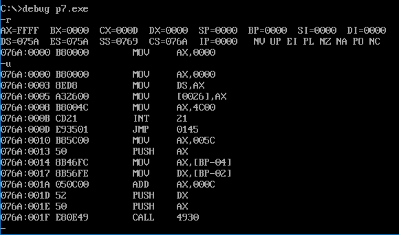

### 5.4 Debug 和汇编编译器 masm 对指令的不同处理

​	我们在 Debug 中写过类似的指令：`mov ax,[0]`，表示将 ds:0 处的数据送入 ax 中。

​	但是在汇编源程序中，指令“mov ax,[0]”被编译器当作指令“mov ax,0”处理。

​	下面通过具体的例子来看一下 Debug 和汇编编译器 masm 对形如“mov ax,[0]”这类指令的不同处理。

​	任务：将内存 2000:0～2000:3 单元中的数据送入 al、bl、cl、dl中

(1) 在 Debug 中编程实现：

```assembly
mov ax,2000
mov ds,ax
mov al,[0]
mov bl,[1]
mov cl,[2]
mov dl,[3]
```

(2) 汇编源程序实现：

```assembly
assume cs:code
code segment
    mov ax,2000h
    mov al,[0]
    mov bl,[1]
    mov cl,[2]
    mov dl,[3]

    mov ax,4c00h
    int 21h
code ends
end
```

(1) Debug的情况如下图：

![5.4 Debug对mov ax,[0]的解释](文档插图/5.4 Debug对mov ax,[0]的解释.png)

<center style="color:#C0C0C0">图5.4 Debug 对"mov ax,[0]的解释"</center>

(2) 将汇编源程序存储为 compare.asm，用 masm、link 生成 compare.exe，用 Debug 加载 compare.exe 如下图所示：

![5.4.1 masm对mov ax,[0]的解释](文档插图/5.4.1 masm对mov ax,[0]的解释.png)

<center style="color:#C0C0C0">图5.4.1 masm对"mov ax,[0]"的解释</center>

​	从图 5.4 和图 5.4.1 可以看出来，Debug 将 “[idata]”解释为一个**内存单元**，“idata”是**内存单元的偏移地址**；而编译器将“[idata]”解释为“**idata**”。

​	可以通过将偏移地址送入 bx 寄存器中，用[bx]的方式来访问内存单元。比如：

```assembly
mov ax,2000h
mov ds,ax		;段地址 2000h 送入 ds
mov bx,0		;偏移地址 0 送入 bx
mov al,[bx]		;ds:bx单元中的数据送入 al
```

​	但是这样用 bx 来间接地给出内存单元的偏移地址比较麻烦。我们还是希望能够像在 Debug 中那样，在“[ ]”中直接给出内存单元的偏移地址。在汇编源程序中“[ ]”的前面显式地给出段地址所在的段寄存器即可。比如也可以这样访问 2000:0 单元：

```assembly
mov ax, 2000h
mov ds,ax
mov alds:[0]
```

比较一下汇编源程序中以下指令的含义：

①“mov al,[0]”， 含义：(al)=0，将常量 0 送入 al 中（与 mov al,0 含义相同）；

②“mov al,ds:[0]”， 含义：(al)=((ds)*16+0），将内存单元中的数据送入 al 中；

③“mov al,[bx]”，含义：(al)=((ds)*16+(bx))，将内存单元中的数据送入 al 中；

④“mov al,ds:[bx]”，含义：与“mov al,[bx]”相同

​	从上面的比较中可以看出：

(1) 在汇编源程序中，如果用指令访问一个内存单元，则在指令中必须用“[...]”来表示内存单元，如果“[...]”里面用一个常量 idata 直接给出内存单元的偏移地址，就要在“[...]”前面显式地给出段地址所在的段寄存器。比如：

```assembly
mov al,ds:[0]
```

​	如果没有在“[...]”前面显式地给出段地址所在的段寄存器，比如

```assembly
mov al,[0]
```

​	那么，编译器 masm 将把指令中的“[idata]”解释为“idata”

(2) 如果在“[...]”里**用寄存器间接给出内存单元的偏移地址，则段地址默认在 ds 中**。当然，也可以显式地给出段地址所在的段寄存器。

### 5.5 loop 和[bx]的联合应用

​	考虑问题：计算 ffff:0～ffff:b 单元中的数据的和，结果存储在 dx 中。

​	几个应该首先分析的点：

​	(1) 运算后的**结果是否会超出 dx 所能存储的范围**？

​	ffff:0～ffff:b 内存单元中的数据是字节型数据，范围在 0～255之间，12个这样的数据相加，结果不会大于 65535，可以在 dx 中存放下。

​	(2) 我们**能否将这几个单元的数据直接累加到 dx 中**？

​	是不行的，因为其中的数据是8位，不能直接加到 16 位寄存器 dx 中。

​	(3) 我们能否将 ffff:0～ffff:b 中的数据累加到 dl 中，并设计(dh)=0，从而实现累加到 dx 中？

​	这也是不行的，因为 dl 是 8 位寄存器，向 dl 中累加 12 个 8 位数据，很有可能造成进位丢失。

​	(4) 综上所述两种将 ffff:0～ffff:b 中的数据，累加到 16 位寄存器 dx 中存在两个问题：

* (dx) = (dx) + 内存中的 8 位数据；→【面临运算对象类型不匹配的问题】
* (dl) = (dl) + 内存中的 8 位数据；→【面临运算结果可能超界的问题】

​	目前的方法（后续有别的方法）就是用一个 16 位寄存器来做中介。将内存单元中的 8 位数据赋值到一个 16 位寄存器 ax 中，再将 ax 中的数据加到 dx 上，从而使两个运算对象的类型匹配并且结果不会超界。

**程序5.5**

```assembly
assume cs:code
code segment

	mov ax,0ffffh
	mov ds,ax			;设置(ds)=ffffh
	
	mov dx,0			;初始化累加寄存器，(dx)=0
	
	mov al,ds:[0]
	mov ah,0			;(ax)=((ds)*16+0)=(ffff0h)
	add dx,ax			;向 dx 中加上 ffff:0 单元的数值
	
	mov al,ds:[1]
	mov ah,0			
	add dx,ax			
	... ...
	... ...
	mov al,ds:[0bh]		
	mov ah,0			;(ax)=((ds)*16+0bh)=(ffffbh)
	add dx,ax			;向 dx 中加上 ffff:b 单元的数值
	
	mov ax,4c00h		;程序返回
	int 21h
	
code ends

end
```

​	这个程序累加 ffff:0～ffff:b 中的 12 个数据，没必要写这么长，应该利用 loop 指令改进

#### 问题 5.4

​	改进程序5.5使之行数减少

分析：

```assembly
assume cs:code
code segment

	mov ax,0ffffh
	mov ds,ax			;设置(ds)=ffffh
	mov bx,0			;初始化 ds:bx 指向 ffff:0
	
	mov dx,0			;初始化累加寄存器dx，(dx)=0
	
	mov cx,12			;初始化循环计数器cx，(cx)=12
	
s:  mov al,ds:[bxx]
	mov ah,0			
	add dx,ax			;间接向 dx 中加上((ds)*16+(bx))单元的数值
	inc bx				;ds:bx 指向下一个单元
	loop s
	
	mov ax,4c00h		;程序返回
	int 21h
	
code ends

end
```

​	实际编程中时常会遇到，用同一种方法处理地址连续的内存单元中的数据的问题，应用变量“`mov al,[bx]`”中的 bx 就可以看作代表内存单元地址的变量，我们可以不写新的指令，仅通过循环以及 bx 中的数字，改变指令访问的内存单元。

### 5.6 段前缀

​	指令“mov ax,[bx]”中，内存单元的偏移地址由 bx 给出，而段地址默认在 ds 中。我们可以在访问内存单元的指令中**显式地给出内存单元的段地址所在的段寄存器**。比如：

(1) mov ax,ds:[bx]

​	将一个内存单元的内容送入 ax，这个内存单元的长度为 2 字节（子单元），存放一个字，偏移地址在 bx 中，段地址在 ds 中。

(2) mov ax,cs:[bx]

​	将一个内存单元的内容送入 ax，这个内存单元的长度为 2 字节（子单元），存放一个字，偏移地址在 bx 中，段地址在 cs 中。

(3) mov ax,ss:[bx]

​	将一个内存单元的内容送入 ax，这个内存单元的长度为 2 字节（子单元），存放一个字，偏移地址在 bx 中，段地址在 ss 中。

(4) mov ax,es:[bx]

​	将一个内存单元的内容送入 ax，这个内存单元的长度为 2 字节（子单元），存放一个字，偏移地址在 bx 中，段地址在 es 中。

(5) mov ax,ss:[0]

​	将一个内存单元的内容送入 ax，这个内存单元的长度为 2 字节（子单元），存放一个字，偏移地址为 0 中，段地址在 ss 中。

(5) mov ax,cs:[0]

​	将一个内存单元的内容送入 ax，这个内存单元的长度为 2 字节（子单元），存放一个字，偏移地址为 0 中，段地址在 scs 中。

​	这些出现在访问内存单元的指令中，用于显式地指明内存单元的段地址的“ds:”“cs:”“ss:”“es:”，再汇编语言中称为**段前缀**。

### 5.7 一段安全的空间

​	在 8086 模式中，随意向一段内存空间写入内容是很危险的，因为这段空间中可能存放着重要的系统数据或代码。比如下面的指令：

```assembly
mov ax,1000h
mov ds,ax
mov al,0
mov ds:[0],al
```

​	之前为了讲解代码，我们写过类似指令，但这种做法是不合理的，因为之前我们并没有论证过 1000:0 中是否存放着重要的系统数据或代码。如果 1000:0 中存放着重要的系统数据或代码，“`mov ds:[0],al`”将其改写，将引发错误。

​	比如下面的**程序 5.7**：

```assembly
assume cs:code
code segment

    mov ax,0
    mov ds,ax
    mov ds:[26h],ax

    mov ax,4c00h
    int 21h

code ends
end
```

​	将源程序编辑为 p7.asm，编译、连接后生成 p7.exe，用 Debug 加载，跟踪它的运行，如下图：



<center style="color:#C0C0C0">图5.7 用 Debug 加载程序5.7</center>

​	图 5.7 中我们可以看到“mov ds:[26h],ax”被 masm 翻译为机器码“a3 26 00”，而 Debug 将这个机器码解释为“mov [0026],ax”。可见，汇编源程序中的汇编指令“mov ds:[26h],ax”和 Debug 中的汇编指令“mov [0026],ax”同义。

![5.7.1 改写[0026]处存放的重要系统数据](文档插图/5.7.1 改写[0026]处存放的重要系统数据.png) 

<center style="color:#C0C0C0">图5.7.1 改写 0:0026 处存放的重要系统数据</center>

​	图 5.7.1 中，是在 windows 2000 的 DOS 方式中，在 Debug 里执行“mov [0026],ax”的结果。如果是在实模式（即纯 DOS 方式）下执行 p7.exe，将会引起死机。产生这种结果的原因是 0:0026 处存放着重要的系统数据，而“mov [0026],ax”将其改写。

​	可见，不确定一段内存空间中是否存放重要数据或代码的时候，不能随意向其中写入内容。

​	我们是在 OS 的环境中工作，OS 管理所有的资源，也包括内存。如果我们需要向内存空间写入数据的话，要使用 OS 给我们分配的空间而不应该直接用地址任意指定内存单元，向里面写入。只是我们正在学习汇编语言，所以尽量直接对硬件编程，而不去理会 OS。

​	注意，我们在纯 DOS 方式（实模式）下，可以不理会 DOS，直接用汇编语言去操作真实的硬件，因为运行在 CPU 实模式下的 DOS，没有能力对硬件系统进行全面、严格的管理。但是在 WIN 2000、Unix 等运行于 CPU 保护模式下的 OS 中，由于硬件已经被 OS 利用 CPU 保护模式所提供的功能全面严格的管理了，所以用汇编语言操作真实的硬件是根本不可能的。

​	为了向内存写入内容，又不希望系统崩溃，需要找一段安全空间供我们使用。在一般PC机中，DOS方式下，DOS和其他合法程序一般都不会使用 0:200～0:2ff(00200h～002fffh)的 256 个字节的空间。所以，我们使用这段空间是安全的。为了谨慎起见，进入 DOS 后，可以利用 Debug 查看一下这里，如果单元内容全为 0 ，则证明 DOS 和其他合法的程序没有使用这里。（为什么不用将在后面章节讨论）

#### 总结

1. 我们需要直接向一段内存中写入内容；
2. 这段内存空间不应存放系统或其他程序的数据或代码，否则写入可能引发错误；
3. DOS 方式下，一般 0:200～0:2ff 空间中是安全的；
4. 需要直接向一段内存写入内容时，可以使用 0:200～0:2ff 这段空间。

### 5.8 段前缀的使用

​	考虑问题：将内存 ffff:0～ffff:b 单元中的数据复制到 0:200～0:20b 单元中。

分析如下：

​	(1) 0:200～0:20b 单元等同于 0020:0～0020:b 单元，它们描述的是同一段内存空间。

​	(2) 复制过程用循环实现。

​	(3) 循环中，注意利用**变量**表示偏移地址。

​	(4) 将 0:200～0:20b  用 0020:0～0020:b 描述，就是为了使目标单元的偏移地址和源始单元的偏移地址从同一数值 0 开始。

**程序 5.8**

```assembly
assume cs:code

code segment

	mov bx,0		;(bx)=0，偏移地址从0开始
	mov cx,12		;(cx)=12，循环12次
	
s:  mov ax,0ffffh
	mov ds,ax		;(ds)=0ffffh
	mov dl,[bx]		;(dl)=((ds)*16+(bx))，将ffff:bx中的数据送入dl
	
	mov ax,0020h
	mov ds,ax		;(ds)=0020h
	mov [bx],dl		;((ds)*16+(bx))=(dl)，将中dl的数据送入0020:bx
	
	inc bx			;(bx)=(bx)+1
	loop s
	
	mov ax,4c00h
	int 21h
	
code ends

end
```

​	因源始单元 ffff:X 和目标单元 0020:X 相距大于 64KB，在不同的 64KB 段里，程序 5.8 中，每次循环要设置两次 ds。这样做正确但效率不高，我们可以**使用两个段寄存器 ds 和 es 分别存放源始单元 ffff:X 和目标单元 0020:X 的段地址**，这样就**可以省略循环中重复 12 次的设置 ds 的程序段**。改进程序如下：

**程序 5.9**

```assembly
assume cs:code

code segment
	
	mov ax,0ffffh
	mov es,ax		;(ds)=0ffffh
	
	mov bx,0		;(bx)=0，此时ds:bx指向ffff:0，es:bx指向0020:0
	
	mov cx,12		
	
s:  mov dl,[bx]		;(dl)=((ds)*16 + (bx))，将ffff:bx中的数据送入dl
	mov es:[bx],dl	;((es)*16+(bx))=(dl)，将dl中的数据送入0020:bx
	inc bx			;(bx)=(bx)+1
	
	mov ax,4c00h
	int 21h
	
code ends

end
```

### 实验4 [bx]和 loop 的使用 

​	(1) 编程，向内存 0:200～0:23F 依次传送数据 0～63(3FH)。

​	(2) 编程，向内存0:200～0:23F依次传送数据0～63(3FH)，程序中只能使用9条指令，9条指令中包括“mov ax,4c00h”和“int 21h”。

​	(3) 下面的程序的功能是将“mov ax，4c00h”之前的指令复制到内存 0:200 处，补全程序。上机调试，跟踪运行结果。

```assembly
assume cs:code
code segment
    mov ax,____
    mov ds,ax
    mov ax,0020h
    mov es, ax 
    mov bx,0
    mov cx,____
s:  mov al,[bx]
    mov es:[bx],al 
    inc bx 
    loop s 
    mov ax,4c00h 
    int 21h 
code ends 
end 
```

第(3)题提示：

​	①复制的是什么？从哪里到哪里？

​	②复制的是什么？有多少个字节？你如何知道要复制的字节的数量？

---

解析：

(1)(2)编译-连接以下代码，debug加载程序后，可以用 t 命令运行，g 命令跳过 loop，结果如图5.7.2，正好也满足指令在 为 9 条。

```assembly
assume cs:code
code segment
	mov ax,0020h
	mov ds,ax		;通过ax中介修改段地址寄存器ds
	mov bx,0		;偏移地址记录
	mov cx,64		;循环次数计数
	
s:  mov ds:[bx],bx	;传送数据
	inc bx
	loop s
	
	mov ax,4c00h
	int 21h
code ends
end
```


<center style="color:#C0C0C0">图5.7.2 Debug加载程序运行结果</center>

(3)复制的是“mov ax,4c00h”之前的指令，从 cs:ip 开始复制到 0020:0 开始的内存单元中，可以先把 cx 调大一点，然后调试观察“mov ax,4c00h”指令的位置，从而确定 cx 具体的值。

```assembly
assume cs:code
code segment
    mov ax,cs
    mov ds,ax
    mov ax,0020h
    mov es,ax 
    mov bx,0
    mov cx,23
s:  mov al,[bx]
    mov es:[bx],al 
    inc bx 
    loop s 
    mov ax,4c00h 
    int 21h 
code ends 
end 
```


<center style="color:#C0C0C0">图5.7.3 Debug加载程序运行结果</center>
