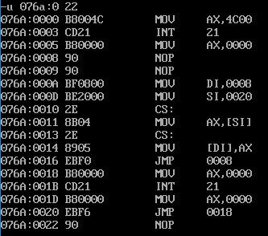

### 实验 8 分析一个奇怪的程序  

分析下面的程序，在运行前思考：这个程序可以正确返回吗？  

运行后再思考：为什么是这种结果？  

通过这个程序加深对相关内容的理解。  

```assembly
assume cs:codesg  
codesg segment  

	mov ax,4c00h  
	int 21h  
start: 
	mov ax,0  
s: 
	nop  
	nop  
    
	mov di,offset s  
	mov si,offset s2  
	mov ax,cs:[si]  
	mov cs:[di],ax  
s0:
	jmp short s  
s1:
	mov ax,0  
	int 21h  
	mov ax,0  
    
s2: 
	jmp short s1  
	nop  
    
codesg ends  
end start
```

解析：

* 运行前觉得不能正常返回，但是**运行后发现可以正常返回**。
* NOP 是英语“No Operation”的缩写。空操作指令 NOP 不执行任何操作，但占用一个字节存储单元，空耗一个指令执行周期，NOP 常用于程序调试
  - 在需要预留指令空间时用 NOP 填充
  - 代码空间多余时也可以用 NOP 填充
  - 还可以用 NOP 实现软件延时
* 输入`-u 076a:0 22`查看各指令在内存中的地址，以方便理解，内容如下：



<center style="color:#C0C0C0">图9.10 u命令查看汇编指令</center>

* cs:[si]处的指令是`jmp short s1`的，但最终写回到 cs:[di]处，**不是将指令写入，而是将机器码写入**，而这个指令的机器码也可以算出来，用“标号处地址 - jmp 指令后第一个字节的地址”，即 0018H-0022H=-10H，或者用“mov ax,0(3 字节) + int 21h(2 字节) + mov ax,0(3 字节) + jmp short s1(2 字节)= 10 字节”，因为 s1 是在低地址处，s2 在高地址处，所以应该是 -10字节，即 F6H，机器码可以算出来是 EBF6，写入 076A:0008 里，然后执行 jmp short s，跳转到 076a:0008。


<center style="color:#C0C0C0">图9.10.1 u命令查看汇编指令</center>

* 此时 076a:0008～076a:0009 里面存放的正是 EBF6，意为往前移动 10 字节，而 jmp 指令后第一个字节的地址到 076a:0 位移正好为 -10，即对应的 jmp 指令为`jmp 0000`执行完` jmp 0000`指令后，移动到 076a:0000，正是`mov ax,4c00h`位置，所以程序正常结束。
* 下面是指令的执行过程：

| 位置(076A:?) | 指令             | 作用                                  |
| ------------ | ---------------- | ------------------------------------- |
| 0005         | mov ax,0000      | ax 置零                               |
| 0008(s)      | nop              | nop                                   |
| 0009         | nop              | nop                                   |
| 000A         | mov di,offset s  | DI=0008H                              |
| 000D         | mov si,offset s2 | SI=0020H                              |
| 0010~0011    | mov ax,cs:[si]   | cs:[si]的内容(机器码)赋给ax，ax=EBF6  |
| 0013~0014    | mov cs:[di],ax   | cs:[0008]=EBF6                        |
| 0016(s0)     | jmp short s      | jmp 0008，移动到 s 位置，即 076a:0008 |
| 0008         | jmp 0000         | 移动到 076a:0000 位置                 |
| 0000         | mov ax,4c00h     | 终止程序并退出操作系统                |
| 0003         | int 21h          | 终止程序并退出操作系统                |

* 需要注意，在反汇编命令 -u 中显示的 jmp 0008 中的 0008 **是地址，而非位移**，编译器会根据机器码的位移算出最终移动到的位置，然后显示出来。实际上可以看到，jmp 0008 机器码为 EBF0，F0H 取反加 1 后为 16，即 F0H=-16，意思是往回移动 16 个字节，正好移动到 076a:0008 处。（注：已知位移和 jmp 指令后一个字节的地址，求标号位置：x - 0018H = -0010H → x = 0008H）
* 另外注意，标号 s 和指令写在同一行，或者标号另起一行都不会影响指令在内存中的具体地址，就像换行符一样。
