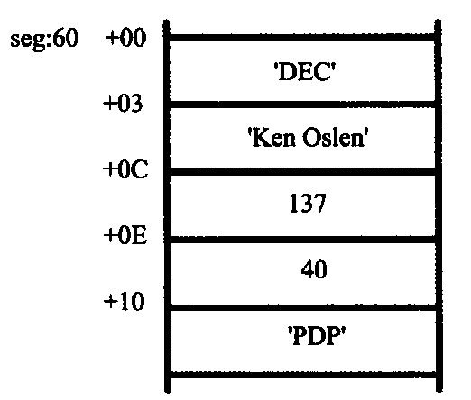

## 第 8 章 数据处理的两个基本问题

​	本章对前面的所有内容是具有总结性的。我们知道，计算机是进行数据处理、运算的机器，那么有两个基本的问题就包含在其中：

​	(1)处理的数据在什么地方？

​	(2)要处理的数据有多长？

​	这两个问题，在机器指令中必须给以明确或隐含的说明，否则计算机就无法工作。本章中，我们就要针对 8086CPU 对这两个基本问题进行讨论。虽然讨论是在 8086CPU 的基础上进行的，但是这两个基本问题却是普遍的，对任何一个处理机都存在。

​	我们定义的描述性符号：reg 和 sreg。

​	为了描述上的简洁，在以后的课程中，我们将使用描述性的符号 reg 来表示一个寄存器，用 sreg 表示一个段寄存器。

​	reg 的集合包括：ax、bx、cx、dx、ah、al、bh、bl、ch、cl、dh、dl、sp、bp、si、 di；

​	sreg 的集合包括：ds、ss、cs、es。

### 8.1 bx、si、di 和 bp

​	前 3 个寄存器我们已经用过了，现在我们进行一下总结。

​	(1)在 8086CPU 中，只有这 4 个寄存器可以用在“[...]”中来进行内存单元的寻址。比如下面的指令都是正确的：

```assembly
mov ax,[bx]
mov ax,[bx+si]
mov ax,[bx+di]
mov ax,[bp]
mov ax,[bp+si]
mov ax,[bp+di]
```

而下面的指令是错误的：

```assembly
mov ax,[cx]
mov ax,[ax]
mov ax,[dx]
mov ax,[ds]
```

​	(2)在[...]中，这 4 个寄存器可以单个出现，或只能以 4 种组合出现：bx 和 si、bx 和 di、bp和 si、bp和 di。比如下面的指令是正确的：

```assembly
mov ax,[bx]
mov ax,[si]
mov ax,[di]
mov ax,[bp]
mov ax,[bx+si]
mov ax,[bx+di]
mov ax,[bp+si]
mov ax,[bp+di]
mov ax,[bx+si+idata]
mov ax,[bx+di+idata]
mov ax,[bp+si+idata]
mov ax,[bp+di+idata]
```

下面的指令是错误的：

```assembly
mov ax,[bx+bp]
mov ax,[si+di]
```

（3）只要在[...]中**使用寄存器 bp，而指令中没有显性地给出段地址，段地址就默认在 ss 中** 。比如下面的指令。

```assembly
mov ax, [bp]			含义：(ax)=((ss)*16+(bp))
mov ax, [bp+idata]		含义：(ax)=((ss)*16+(bp)+idata)
mov ax, [bp+si]			含义：(ax)=((ss)*16+(bp)+(si))
mov ax, [bp+si+idata]	含义：(ax)=((ss)*16+(bp)+(si)+idata) 
```

### 8.2 机器指令处理的数据在什么地方

​	绝大部分机器指令都是进行数据处理的指令，处理大致可分为3类：**读取、写入、运算**。在机器指令这一层来讲，并不关心数据的值是多少，而关心**指令执行前一刻**，它将要处理的数据所在的位置。指令在执行前，所要处理的数据可以在 3 个地方：**CPU内部、内存、端口**（端口将在后面的课程中进行讨论），比如表 8.2 中所列的指令。

<center style="color:#C0C0C0">表8.2 指令举例</center>

| 机器码   | 汇编指令    | 指令执行前数据的位置 |
| -------- | ----------- | -------------------- |
| 8E1E0000 | mov bx, [0] | 内存，ds:0 单元      |
| 89C3     | mov bx,ax   | CPU 内部，ax 寄存器  |
| BB0100   | mov bx,1    | CPU 内部，指令缓冲器 |

### 8.3 汇编语言中数据位置的表达

​	在汇编语言中如何表达数据的位置？汇编语言中用 3 个概念来表达数据的位置。

**(1)立即数(idata)**

​	对于直接包含在机器指令中的数据（执行前在 CPU 的指令缓冲器中），在汇编语言中称为：立即数（idata），在汇编指令中直接给出。

例：

```assembly
mov ax,1
add bx,2000h
or bx,00010000b
mov al,'a' 
```

**(2)寄存器**

​	指令要处理的数据在寄存器中，在汇编指令中给出相应的寄存器名。

例：

```assembly
mov ax,bx
mov ds,ax
push bx
mov ds:[0],bx
push ds
mov ss,ax
mov sp,ax
```

**(3)段地址(SA)和偏移地址(EA)**

​	指令要处理的数据在内存中，在汇编指令中可用[X]的格式给出 EA，SA 在某个段寄存器中。

​	存放段地址的寄存器可以是默认的，比如：

```assembly
mov ax,[0]
mov ax,[di]
mov ax,[bx+8]
mov ax,[bx+si]
mov ax,[bx+si+8]
```

等指令，段地址默认在 ds 中；

```assembly
mov ax,[bp]
mov ax,[bp+8]
mov ax,[bp+si]
mov ax,[bp+si+8]
```

等指令，段地址默认在 ss 中。

​	存放段地址的寄存器也可以是显性给出的，比如以下的指令。

```assembly
mov ax,ds:[bp]			含义：(ax)=((ds)*16+(bp))
mov ax,es:[bx]			含义：(ax)=((es)*16+(bx)) 
mov ax,ss:[bx+si]		含义：(ax)=((ss)*16+(bx)+(si))
mov ax,cs:[bx+si+8]		含义：(ax)=((cs)*16+(bx)+(si)+8)
```

### 8.4 寻址方式

​	当数据存放在内存中的时候，我们可以用多种方式来给定这个内存单元的偏移地址，这种定位内存单元的方法一般被称为寻址方式。

​	8086CPU 有多种寻址方式，我们在前面的课程中都已经用到了，这里进行一下总结，如表 8.4 所列。

<center style="color:#C0C0C0">表8.4 寻址方式小结</center>

<table><thead>
  <tr>
    <th>寻址方式</th>
    <th>含义</th>
    <th>名称</th>
    <th>常用格式举例</th>
  </tr></thead>
<tbody>
  <tr>
    <td>[idata]</td>
    <td>EA=idata;SA=(ds)</td>
    <td>直接寻址</td>
    <td>[idata]</td>
  </tr>
  <tr>
    <td>[bx]</td>
    <td>EA=(bx);SA=(ds)</td>
    <td rowspan="4">寄存器间接寻址<br><br></td>
    <td rowspan="4">[bx]</td>
  </tr>
  <tr>
    <td>[si]</td>
    <td>EA=(si);SA=(ds)</td>
  </tr>
  <tr>
    <td>[di]</td>
    <td>EA=(di);SA=(ds)</td>
  </tr>
  <tr>
    <td>[bp]</td>
    <td>EA=(bp);SA=(ss)</td>
  </tr>
  <tr>
    <td>[bx+idata]</td>
    <td>EA=(bx)+idata;SA=(ds)</td>
    <td rowspan="4">寄存器相对寻址</td>
    <td rowspan="4">用于结构体：<br>[bx].idata<br>用于数组：<br>idata[si],idata[di]<br>用于二维数组：<br>[bx][idata]</td>
  </tr>
  <tr>
    <td>[si+idata]</td>
    <td>EA=(si)+idata;SA=(ds)</td>
  </tr>
  <tr>
    <td>[di+idata]</td>
    <td>EA=(di)+idata;SA=(ds)</td>
  </tr>
  <tr>
    <td>[bp+idata]</td>
    <td>EA=(bp)+idata;SA=(ss)</td>
  </tr>
  <tr>
    <td>[bx+si]</td>
    <td>EA=(bx)+(si);SA=(ds)</td>
    <td rowspan="4">基址变址寻址</td>
    <td rowspan="4">用于二维数组：<br>[bx][si]</td>
  </tr>
  <tr>
    <td>[bx+di]</td>
    <td>EA=(bx)+(di);SA=(ds)</td>
  </tr>
  <tr>
    <td>[bp+si]</td>
    <td>EA=(bp)+(si);SA=(ss)</td>
  </tr>
  <tr>
    <td>[bp+di]  </td>
    <td>EA=(bp)+(di);SA=(ss)</td>
  </tr>
  <tr>
    <td>[bx+si+idata]</td>
    <td>EA=(bx)+(si)+idata;SA=(ds)</td>
    <td rowspan="4">相对基址变址寻址</td>
    <td rowspan="4">用于表格(结构)中的数组项：<br>[bx].idata[si]<br>用于二维数组：<br>idata[bx][si]</td>
  </tr>
  <tr>
    <td>[bx+di+idata]</td>
    <td>EA=(bx)+(di)+idata;SA=(ds)</td>
  </tr>
  <tr>
    <td>[bp+si+idata]</td>
    <td>EA=(bp)+(si)+idata;SA=(ss)</td>
  </tr>
  <tr>
    <td>[bp+di+idata]</td>
    <td>EA=(bp)+(di)+idata;SA=(ss)</td>
  </tr>
</tbody></table>

### 8.5 指令要处理的数据有多长

​	8086CPU 的指令，可以处理两种尺寸的数据，byte 和 word。所以在**机器指令中要指明，指令进行的是字节操作还是字操作**。对于这个问题，汇编语言中用以下方法处理。

​	(1) 通过寄存器名指明要处理的数据的尺寸。
​	例如，下面的指令中，寄存器指明了指令进行的是字操作。

```assembly
mov ax,l
mov bx,ds:[0]
mov ds,ax
mov ds:[0],ax
inc ax
add ax,1000
```

下面的指令中，寄存器指明了指令进行的是字节操作。
```assembly
mov al,1
mov al,bl
mov al,ds:[0]
mov ds:[0],al
inc al
add al,100
```

​	(2) 在没有寄存器参与的情况下，用操作符 X ptr 指明内存单元的长度，X 在汇编指令中可以为 word 或 byte。
​	例如，下面的指令中，用 word ptr 指明了指令访问的内存单元是一个字单元。

```assembly
mov word ptr ds:[0],1
inc word ptr [bx]
inc word ptr ds:[0]
add word ptr [bx],2
```

下面的指令中，用 byte ptr 指明了指令访问的内存单元是一个字节单元。
```assembly
mov byte ptr ds:[0],1
inc byte ptr [bx]
inc byte ptr ds:[0]
add byte ptr [bx],2
```

​	在没有寄存器参与的字节单元访问指令中，用 word ptr 或 byte ptr 显性地指明所要访问的内存单元的长度是很必要的。否则，CPU 无法得知所要访问的单位是字单元，还是字节单元。假设我们用 Debug 查看内存的结果如下：
```assembly
2000:1000 FF FF FF FF FF FF FF FF ...
```

那么指令：

```assembly
mov ax,2000H  
mov ds,ax  
mov byte ptr [1000H],1  
```

将使内存中的内容变为：

```assembly
2000:1000 01 FF FF FF FF FF ......  
```

而指令：

```assembly
mov ax,2000H  
mov ds,ax  
mov word ptr [1000H],1  
```

将使内存中的内容变为：

```assembly
2000:1000 01 00 FF FF FF FF ......  
```

​	这是因为`mov byte ptr [1000H],1`访问的是地址为 ds:1000H 的**字节单元**，修改的是 ds:1000H **单元的内容**；而`mov word ptr [1000H],1`访问的是地址为 ds:1000H 的**字单元**，修改的是 ds:1000H 和 ds:1001H **两个单元的内容**。

​	(3) 其他方法

​	有些指令默认了访问的是字单元还是字节单元，比如，push[1000H] 就不用指明访问的是字单元还是字节单元，因为 **push 指令只进行字操作**。

### 8.6 寻址方式的综合应用

​	下面我们通过一个问题来进一步讨论一下各种寻址方式的作用。

关于DEC公司的一条记录(1982年)如下：

| 公司名称: DEC         |
| --------------------- |
| 总裁姓名: Ken Olsen   |
| 排名: 137             |
| 收入: 40(40亿美元)    |
| 著名产品: PDP(小型机) |

​	这些数据在内存中以图 8.6 所示的方式存放。

​	可以看到，这些数据被存放在 seg 段中从偏移地址 60H 起始的位置，从 seg:60 起始以 ASCII 字符的形式存储了 3 个字节的公司名称；从 seg:60+3 起始以 ASCII 字符的形式存储了 9 个字节的总裁姓名；从 seg:60+0C 起始存放了一个字型数据，总裁在富翁榜上的排名；从 seg:60+0E 起始存放了一个字型数据，公司的收入；从 seg:60+10 起始以 ASCII 字符的形式存储了 3 个字节的产品名称。



<center style="color:#C0C0C0">图8.6 数据存放示意图</center>

以上是该公司 1982 年的情况，到了 1988 年 DEC 公司的信息有了如下变化。

​	(1) Ken Olsen 在富翁榜上的排名已升至38位；
​	(2) DEC的收入增加了70亿美元；
​	(3) 该公司的著名产品已变为VAX系列计算机。

我们提出的任务是，编程修改内存中的过时数据。

首先，我们应该分析一下要修改的数据。

要修改内容是：

​	(1)(DEC 公司记录)的(排名字段)
​	(2)(DEC 公司记录)的(收入字段)
​	(3)(DEC 公司记录)的产品字段的(第一字符)、(第二字符)、第三字符)

从要修改的内容，我们就可以逐步地确定修改的方法。

​	(1) 要访问的数据是 DEC 公司的记录，所以，首先要确定 DEC 公司记录的位置：

R=seg:60

确定了公司记录的位置后，下面就进一步确定要访问的内容在记录中的位置。
	(2) 确定排名字段在记录中的位置：0CH。
	(3) 修改 R+0CH 处的数据。
	(4) 确定收入字段在记录中的位置：0EH。
	(5) 修改 R+0EH 处的数据。
	(6) 确定产品字段在记录中的位置：10H。
	要修改的产品字段是一个字符串(或一个数组)，需要访问字符串中的每一个字符。所以要进一步确定每一个字符在字符串中的位置。
	(7) 确定第一个字符在产品字段中的位置：P=0。
	(8) 修改 R+10H+P 处的数据；P=P+1。
	(9) 修改 R+10H+P 处的数据；P=P+1。

​	(10) 修改R+10H+P 处的数据。
根据上面的分析，程序如下。

```assembly
mov ax,seg
mov ds,ax
mov bx,60h 					;确定记录地址，ds:bx

mov word ptr [bx+0ch],38 	;排名字段改为38
add word ptr [bx+0eh],70 	;收入字段增加70

mov si,0 					;用si来定位产品字符串中的字符
mov byte ptr [bx+10h+si],'V'
inc si
mov byte ptr [bx+10h+si],'A'
inc si
mov byte ptr [bx+10h+si],'X'
```

如果你熟悉 C 语言的话，我们可以用 C 语言来描述这个程序，大致应该是这样的：

```c
struct company {	/* 定义一个公司记录的结构体 */
    char cn[3]; 	/* 公司名称 */
    char hn[9]; 	/* 总裁姓名 */
    int pm;     	/* 排   名 */
    int sr;     	/* 收   入 */
    char cp[3]; 	/* 著名产品 */
};
struct company dec={"DEC","Ken Olsen",137,40,"PDP"};
/* 定义一个公司记录的变量，内存中将存有一条公司的记录 */

main()
{
    int i;
    dec.pm=38;
    dec.sr=dec.sr+70;
    i=0;
    dec.cp[i]='V';
    i++;
    dec.cp[i]='A';
    i++;
    dec.cp[i]='X';

    return 0;
}
```

​	我们按照 C 语言的风格，用汇编语言写一下这个程序，注意和 C 语言相关语句的对比：

```assembly
mov ax, seg  
mov ds, ax  
mov bx, 60h  				;记录首址送BX  
mov word ptr [bx].0ch, 38 	;排名字段改为38  
							;C: dec.pm=38;  
add word ptr [bx].0eh, 70 	;收入字段增加70  
							;C: dec.sr=dec sr+70;  
							;产品字段改为字符串'VAX'  
mov si, 0  					;C: i=0;  
mov byte ptr [bx].10h[si], 'V' 	; dec.cp[i]='V';  
inc si  						; i++;
mov byte ptr [bx].10h[si], 'A' 	; dec.cp[i]='A';  
inc si  						; i++;
mov byte ptr [bx].10h[si], 'X' 	; dec.cp[i]='X';  
```

​	我们可以看到，8086CPU 提供的如**[bx+si+idata]的寻址方式为结构化数据的处理提供了方便**。使得我们可以在编程的时候，从结构化的角度去看待所要处理的数据。从上面可以看到，一个结构化的数据包含了多个数据项，而数据项的类型又不相同，有的是字型数据，有的是字节型数据，有的是数组(字符串)。一般来说，我们可以用[bx+idata+si]的方式来访问结构体中的数据。用 bx 定位整个结构体，用 idata 定位结构体中的某一个数据项，用 si 定位数组项中的每个元素。为此，汇编语言提供了更为贴切的书写方式，如：`[bx].idata、[bx].idata[si]`。  

​	在 C 语言程序中我们看到，如：dec.cp[i]，dec 是一个变量名，指明了结构体变量的地址，cp 是一个名称，指明了数据项 cp 的地址，而 i 用来定位 cp 中的每一个字符。汇编语言中的做法是：bx.10h[si]。看一下，是不是很相似？

### 8.7 div 指令

​	div 是除法指令，使用 div 做除法的时候应注意以下问题。

​	(1) 除数：有 8 位和 16 位两种，在一个 reg 或内存单元中。

​	(2) 被除数：**默认放在 AX 或 DX 和 AX 中**，如果除数为 8 位，被除数为 16 位，默认在 AX 中存放；如果除数为 16 位，被除数则为 32 位，在 DX 和 AX 中存放，DX 存放高 16 位，AX 存放低 16 位。

​	(3) 结果：如果除数为 8 位，则 AL 存储除法操作的商，AH 存储除法操作的余数；如果除数为 16 位，则 AX 存储除法操作的商，DX 存储除法操作的余数。

格式如下：

```assembly
div reg  
div 内存单元  ;因为被除数默认放在AX或DX和AX中，所以这里的格式只需要一个寄存器。
```

现在，我们可以用多种方法来表示一个内存单元了，比如下面的例子：

```assembly
div byte ptr ds:[0]  
含义：	  (al)=(ax)/((ds)*16+0)的商  
		(ah)=(ax)/((ds)*16+0)的余数
div word ptr es:[0]
含义：	  (ax)=[(dx)*10000H+(ax)]/((es)*16+0)的商		;除数为16位，被除数默认32位，高位存放在dx中
		(dx)=[(dx)*10000H+(ax)]/((es)*16+0)的余数

div byte ptr [bx+si+8]
含义：	  (al)=(ax)/((ds)*16+(bx)+(si)+8)的商
		(ah)=(ax)/((ds)*16+(bx)+(si)+8)的余数

div word ptr [bx+si+8]
含义：	  (ax)=[(dx)*10000H+(ax)]/((ds)*16+(bx)+(si)+8)的商
		(dx)=[(dx)*10000H+(ax)]/((ds)*16+(bx)+(si)+8)的余数
```

【典例一】编程，利用除法指令计算 100001/100。

​	首先分析一下，被除数 100001 大于 65535，不能用 ax 寄存器存放，所以只能用 dx 和 ax 两个寄存器联合存放 100001，也就是说要进行 16 位的除法。除数 100 小于 255，可以在一个 8 位寄存器中存放，但是，因为被除数是 32 位的，除数应为 16 位，所以要用一个 16 位寄存器来存放除数 100。

​	因为要分别为 dx 和 ax 赋 100001 的高 16 位值和低 16 位值，所以应先将 100001 表示为 16 进制形式：186A1H（除基取余，余数倒序排列可得）。
$$
\begin{array}
{ccc}
余数\quad 商或被除数				\\
1  |\underline{100001} \\
A  |\underline{6250} \\
6  |\underline{390} \\
8  |\underline{24}\\
 \quad 1
\end{array}
$$
程序如下：

```assembly
mov dx,1  
mov ax,86A1H 	;(dx)*10000H+(ax)=100001  
mov bx,100  
div bx  
```

​	程序执行后，(ax)=03E8H(即 1000)，(dx)=1(余数为 1)，下面是 Debug 的验证结果。


<center style="color:#C0C0C0">图8.7 除法程序运行结果</center>

（注：**debug 当中，立即数默认为十六进制**，而且不能加 H\h，否则会报错，所以 100 会被识别为100H，在 **MASM 编译器中，立即数不加后缀，默认是十进制数**，加了后缀则根据后缀表示的进制来参与指令，例如后缀 h 为十六进制，后缀 b 为二进制）

【典例二】编程，利用除法指令计算 1001/100。

​	首先分析一下，被除数 1001 可用 ax 寄存器存放，除数 100 可用 8 位寄存器存放，也就是说要进行 8 位的除法。程序如下。

```assembly
mov ax,1001  
mov bl,100  
div bl
```

​	程序执行后，(al)=0AH(即10)，(ah)=1(余数为1)，可自行在 Debug 中验证。

### 8.8 伪指令 dd

​	前面我们用 db 和 dw 定义字节型数据和字型数据。dd 是用来定义 dword(双字)型数据的。比如：

```assembly
data segment  
    db 1  
    dw 1  
    dd 1  
data ends  
```

在 data 段中定义了3个数据：  

​	第一个数据为 01H，在 data:0 处，占 1 个字节；  

​	第二个数据为 0001H，在 data:1 处，占 1 个字；  

​	第三个数据为 00000001H，在 data:3 处，占 2 个字。

**问题 8.1**  

​	用 div 计算 data 段中第一个数据除以第二个数据后的结果，商存在第三个数据的存储单元中。  

```assembly
data segment  
    dd 100001  
    dw 100  
    dw 0  
data ends  
```

分析： 

​	data 段中的第一个数据是被除数，为 dword(双字)型，32 位，所以在做除法之前，用 dx 和 ax 存储。应将 data:0 字单元中的低 16 位存储在 ax 中，data:2 字单元中的高 16 位存储在 dx 中。程序如下：
```assembly
mov ax,data  
mov ds,ax  
mov ax,ds:[0] 		;ds:0 单元中的低 16 位存储在 ax 中  
mov dx,ds:[2] 		;ds:2 单元中的高 16 位存储在 dx 中  
div word ptr ds:[4] ;用 dx:ax 中的 32 位数除以 ds:4 字单元中的数据(第二个数据位置)  
mov ds:[6],ax 		;将商存储在 ds:6 字单元中
```

### 8.9 伪指令 dup

​	dup 是一个操作符，在汇编语言中同 db、dw、dd 等一样，也是由编译器识别处理的符号。它是和 db、dw、dd 等数据定义伪指令配合使用的，用来进行数据的重复。比如：

```assembly
db 3 dup (0)
```

​	定义了 3 个字节，它们的值都是 0,相当于 db 0,0,0。

```assembly
db 3 dup (0,1,2)
```

​	定义了 9 个字节，它们是 0、1、2、0、1、2、0、1、2，相当于 db 0,1,2,0,1,2,0,1,2。

```assembly
db 3 dup ('abc','ABC')
```

​	定义了 18 个字节，它们是'abcABCabcABCabcABC',相当于 `db 'abcABCabcABCabcABC'`。
可见，dup 的使用格式如下。

```assembly
db 重复的次数 dup (重复的字节型数据)
dw 重复的次数 dup (重复的字型数据)
dd 重复的次数 dup (重复的双字型数据)
```

​	dup 是一个十分有用的操作符，比如要定义一个容量为 200 个字节的栈段，如果不用
dup,则必须：

```assembly
stack segment
	dw 0,0,0,0,0,0,0,0,0,0,0,0,0,0,0,0,0,0,0,0 
	dw 0,0,0,0,0,0,0,0,0,0,0,0,0,0,0,0,0,0,0,0 
	dw 0,0,0,0,0,0,0,0,0,0,0,0,0,0,0,0,0,0,0,0 
	dw 0,0,0,0,0,0,0,0,0,0,0,0,0,0,0,0,0,0,0,0 
	dw 0,0,0,0,0,0,0,0,0,0,0,0,0,0,0,0,0,0,0,0 
stack ends
```

​	当然，你可以用 dd，使程序变得简短一些，但是如果要求定义一个容量为 1000 字节或 10000 字节的呢？如果没有 dup，定义部分的程序就变得太长了，有了 dup 就可以轻松解决。如下：

```assembly
stack segment
	db 200 dup (0)
stack ends
```

### 实验7 寻址方式在结构化数据访问中的应用

​	Power idea 公司从 1975 年成立一直到 1995 年的基本情况如下。
<table>
		<tr>
			<td>年份</td>
			<td>收入(千美元)</td>
			<td>雇员(人)</td>
			<td>人均收入(千美元)</td>
		</tr>
		<tr>
			<td>1975</td>
			<td>16</td>
			<td>3</td>
			<td>?</td>
		</tr>
		<tr>
			<td>1976</td>
			<td>22</td>
			<td>7</td>
			<td>?</td>
		</tr>
		<tr>
			<td>1977</td>
			<td>382</td>
			<td>9</td>
			<td>?</td>
		</tr>
		<tr>
			<td>1978</td>
			<td>1356</td>
			<td>13</td>
			<td>?</td>
		</tr>
		<tr>
			<td>1979</td>
			<td>2390</td>
			<td>28</td>
			<td>?</td>
		</tr>
		<tr>
			<td>1980</td>
			<td>8000</td>
			<td>38</td>
			<td>?</td>
		</tr>
        <tr>
			<td>...</td>
			<td>...</td>
			<td>...</td>
			<td>...</td>
		</tr>
		<tr>
			<td>1995</td>
			<td>5937000</td>
			<td>17800</td>
			<td>?</td>
		</tr>
</table>

下面的程序中，已经定义好了这些数据：

```assembly
assume cs:codesg

data segment
    db '1975','1976','1977','1978','1980','1981','1982','1983'
    db '1984','1985','1986','1987','1988','1989','1990','1992'
    db '1993','1994','1995'
    ;以上是表示 21 年的 21 个字符串
    
    dd 16,22,382,1356,2390,8000,16000,24486,50065,97479,140417,197514
    dd 345980,590827,803530,1183000,1843000,2759000,3753000,4649000,5937000
    ;以上是表示 21 年公司总收入的 21 个 dword 型数据
    
    dw 3,7,9,13,28,38,130,220,476,778,1001,1442,2258,2793,4037,5635,8226
    dw 11542,14430,15257,17800
    ;以上是表示 21 年公司雇员人数的 21 个 word 型数据
data ends

table segment
	db 21 dup ('year Rev. EE av ')
table ends
```

​	编程，将 data 段中的数据按如下格式写入到 table 段中，并计算 21 年中的人均收入(取整)，结果也按照下面的格式保存在 table 段中。

<table><thead>
  <tr>
    <th>行内地址↘</th>
    <th colspan="4">年份(4 字节)</th>
    <th>空格1</th>
    <th colspan="4">收入(4 字节)</th>
    <th>空格2</th>
    <th colspan="2">雇员数(2 字节)</th>
    <th>空格3</th>
    <th colspan="2">人均收入(2 字节)</th>
    <th>空格4</th>
  </tr></thead>
<tbody>
  <tr>
    <td>1年占1行，每行的起始地址↓</td>
    <td>0</td>
    <td>1</td>
    <td>2</td>
    <td>3</td>
    <td>4</td>
    <td>5</td>
    <td>6</td>
    <td>7</td>
    <td>8</td>
    <td>9</td>
    <td>A</td>
    <td>B</td>
    <td>C</td>
    <td>D</td>
    <td>E</td>
    <td>F</td>
  </tr>
  <tr>
    <td>table:0H</td>
    <td colspan="4">'1975'</td>
    <td></td>
    <td colspan="4">16</td>
    <td></td>
    <td colspan="2">3</td>
    <td></td>
    <td colspan="2">?</td>
    <td></td>
  </tr>
  <tr>
    <td>table:10H</td>
    <td colspan="4">'1976'</td>
    <td></td>
    <td colspan="4">22</td>
    <td></td>
    <td colspan="2">7</td>
    <td></td>
    <td colspan="2">?</td>
    <td></td>
  </tr>
  <tr>
    <td>table:20H</td>
    <td colspan="4">'1977'</td>
    <td></td>
    <td colspan="4">382</td>
    <td></td>
    <td colspan="2">9</td>
    <td></td>
    <td colspan="2">?</td>
    <td></td>
  </tr>
  <tr>
    <td>table:30H</td>
    <td colspan="4">'1978'</td>
    <td></td>
    <td colspan="4">1356</td>
    <td></td>
    <td colspan="2">13</td>
    <td></td>
    <td colspan="2">?</td>
    <td></td>
  </tr>
  <tr>
    <td>table:40H</td>
    <td colspan="4">'1979'</td>
    <td></td>
    <td colspan="4">2390</td>
    <td></td>
    <td colspan="2">28</td>
    <td></td>
    <td colspan="2">?</td>
    <td></td>
  </tr>
  <tr>
    <td>table:50H</td>
    <td colspan="4">'1980'</td>
    <td></td>
    <td colspan="4">8000</td>
    <td></td>
    <td colspan="2">38</td>
    <td></td>
    <td colspan="2">?</td>
    <td></td>
  </tr>
  <tr>
    <td>... ...</td>
    <td colspan="4">... ...</td>
    <td></td>
    <td colspan="4">... ...</td>
    <td></td>
    <td colspan="2">... ...</td>
    <td></td>
    <td colspan="2">... ...</td>
    <td></td>
  </tr>
  <tr>
    <td>table:140H</td>
    <td colspan="4">'1995'</td>
    <td></td>
    <td colspan="4">5937000</td>
    <td></td>
    <td colspan="2">17800</td>
    <td></td>
    <td colspan="2">?</td>
    <td></td>
  </tr>
</tbody></table>

​	提示，可将 data 段中的数据看成是多个数组，而将 table 中的数据看成是一个结构型数据的数组，每个结构型数据中包含多个数据项。可用 bx 定位每个结构型数据，用 idata 定位数据项，用 si 定位数组项中的每个元素，对于 table 中的数据的访问可采用[bx].idata和[bx].idata[si]的寻址方式。
​	注意，这个程序是到目前为止最复杂的程序，它几乎用到了我们以前学过的所有知识和编程技巧。所以，这个程序是对我们从前学习的最好的实践总结。请认真完成。

解析：

```assembly
assume cs:codesg

data segment
    db '1975','1976','1977','1978','1979','1980','1981','1982','1983'
    db '1984','1985','1986','1987','1988','1989','1990','1991','1992'
    db '1993','1994','1995'
    ;以上是表示 21 年的 21 个字符串
    
    dd 16,22,382,1356,2390,8000,16000,24486,50065,97479,140417,197514
    dd 345980,590827,803530,1183000,1843000,2759000,3753000,4649000,5937000
    ;以上是表示 21 年公司总收入的 21 个 dword 型数据
    
    dw 3,7,9,13,28,38,130,220,476,778,1001,1442,2258,2793,4037,5635,8226
    dw 11542,14430,15257,17800
    ;以上是表示 21 年公司雇员人数的 21 个 word 型数据
data ends

table segment
	db 21 dup ('year Rev. nu av ')
table ends

stacksg segment stack
	dw 8 dup (0)
stacksg ends

codesg segment
start:
	mov ax,table
	mov es,ax		;es定位到table段
	mov ax,data
	mov ds,ax		;ds定位到data段
	mov ax,stacksg
	mov ss,ax		
	mov sp,16		;申请16个字节的栈空间暂存循环变量
	
	mov bp,sp				;设置栈帧，bp指向栈顶
	sub sp,4				;为变量A、B预留空间
	mov word ptr [bp-2],0 	;每行步进2字节变量A归零，注意bp寄存器按内存单元寻址时，如未声明则默认在ss段
	mov word ptr [bp-4],0 	;每行步进4字节变量B归零
	
	mov bx,0		;table行定位变量bx归零
	mov cx,21		;总共处理21个table行
s0:					;处理table行
	push cx			;暂存外层循环变量cx
	mov si,0		;定位每一项中具体元素的变量
	mov cx,4		;年份有4个字节字符
year:				;处理年份(4字节)
	mov di,[bp-4]		;读取步进变量B
	add di,si			;定位si+B，由于[di+si]是不合法的，所以这么写，如果合法的话直接合并成一句就好
	mov al,[di]			;外层循环每循环一次，就后移B个字节从data区取数，即读下一个年份
	mov es:[bx+si],al	;写回字符，写回时si从0开始，因为是新的table行了
	inc si				;后移一个字符
	loop year
	
blank1:					;处理空格(1字节)
	mov al,' '			;mov al,20h亦可，要al寄存器中转，否则会存在类型没声明的问题
	mov es:[bx+4],al	;写回table段要段前缀es强调，否则就写到data区去了
	
	mov si,0			;定位具体字
	mov cx,2			;收入为2个字4个字节，循环2次
rev:					;处理收入(2字)
	mov di,[bp-4]			;读取步进变量B
	add di,si				;定位si+B，由于[di+si]是不合法的，所以这么写。
	mov ax,[84+di]			;外层循环每循环一次，就后移B个字节从data:84区取数，即读下一个收入
	mov es:[bx+5+si],ax		;写回字，写回时si从0开始，因为是新的table行了
	add si,2				;后移一个字
	loop rev
	
blank2:
	mov al,' '
	mov es:[bx+9],al
	
ee:							;处理职工数(1字)
	mov di,[bp-2]			;读取步进变量A
	mov ax,[168+di]			;外层循环每循环一次，就后移A个字节从data:168取数，即读下一年雇员数
	mov es:[bx+10],ax		;写回雇员数（一个字）
	
blank3:
	mov al,' '
	mov es:[bx+12],al
	
av:							;处理人均收入(1字)
	mov di,[bp-4]			;读取步进变量B
	mov ax,[di+84]			;32位被除数，低位存在ax中，外层循环每循环一次，就后移B个字节从data:84取收入
	mov dx,[di+86]			;32位被除数，高位存在dx中，外层循环每循环一次，就后移B个字节从data:86取收入

	mov di,[bp-2]			;读取步进变量A
	div word ptr [168+di]	;除以员工数量
	mov es:[bx+13],ax

blank4:
	mov al,' '
	mov es:[bx+15],al
	
	add bx,16				;步进1行table，bx增加16字节
	add word ptr [bp-2],2	;A变量步进2个字节
	add word ptr [bp-4],4	;B变量步进4个字节
	pop cx					;恢复外层循环cx的值
	loop s0

	mov ax,4c00H
	int 21h
codesg ends

end start
```

解析：

* 首先要注意编程习惯，**通常将 ds 指向源数据 data 段，es 指向目标数据 table 段**，如果你反过来用就会发现要经常使用段前缀声明`es:`从 data 段中取数，不符合编程直觉。es（附加段寄存器）通常用于需要同时访问两个数据段的场景（如**数据复制**）。将 es 设为 table 段，可明确区分源和目标的段地址，提高代码的可读性。
* 解决了一个遗留问题，使用`stacksg segment stack`告诉编译器 stacksg 是栈段，这样就不会在连接时警告。
* **x86 汇编语言不支持多重间接寻址**，需要分成两步写，比如：`mov di,[bp-2]、mov ax,[168+di]	`
* 注意，只有 bx、si、di 和 bp 这 4 个寄存器可以用在“[...]”中来进行内存单元的寻址
* 注意上面四个寄存器出现的组合，有些情况是非法的，比如`[si+bi]`，解决方法是换组合，或者单独运算。
* x86 汇编语言中，**可以借助基址指针 bp 直接访问栈内任意位置的数据而无需移动栈顶指针**，这样做不会破坏栈顶以至于影响后续的 push/pop 操作。
* 如果把内层循环展开成多句变为单层循环，确实可以少写很多语句偷懒，但是就忽略了本章的精髓，**双重循环的变量处理，写成双重循环 + 栈来寄存步进变量，用到了本章的两个重点知识**，这样写程序的拓展性会高很多，比如内部 4 字节年份改成 8 位编码，用双重循环改写起来就很容易，而单层循环要**代码复制**再复制若干行（按字传送要复制 2 行，按字节传送要复制 4 行）。

* 运行结果如下：


<center style="color:#C0C0C0">图8.9 初始化后data区及程序运行后table区的情况</center>
