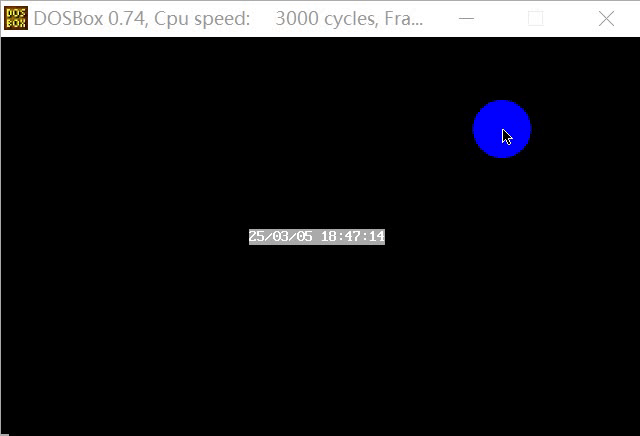

### 课程设计 2

#### 0.任务要求

​	阅读下面的材料：

​	开机后，CPU 自动进入到 FFFF:0 单元处执行，此处有一条跳转指令。CPU 执行该指令后，转去执行 BIOS 中的硬件系统检测和初始化程序。

​	初始化程序将建立 BIOS 所支持的中断向量，即将 BIOS 提供的中断例程的入口地址登记在中断向量表中。

​	硬件系统检测和初始化完成后，调用 int 19h 进行操作系统的引导。

​	如果设为从软盘启动操作系统，则 int 19h 将主要完成以下工作：

* (1) 控制号 0 号软驱，读取软盘 0 道 0 面 1 扇区的内容到 0:7c00；

* (2) 将 CS:IP 指向 0:7c00。

​	软盘的 0 道 0 面 1 扇区中装有操作系统引导程序。int 19h 将其装载到 0:7c00 处后，设置 CPU 从 0:7c00 开始执行此处的引导程序，操作系统被激活，控制计算机。

​	如果在 0 号软驱中没有软盘，或发生软盘 I/O 错误，则 int 19h 将主要完成以下工作：

* (1) 读取硬盘 C 的 0 道 0 面 1 扇区的内容到 0:7c00；
* (2) 将 CS:IP 指向 0:7c00。

​	这次课程设计的任务是编写一个可以自行启动计算机，不需要在现有操作系统环境中运行的程序。

该程序的功能如下。

​	(1) 列出功能选项，让用户通过键盘进行选择，界面如下。

```assembly
1)reset pc 			;重新启动计算机
2)start system 		;引导现有的操作系统
3)clock 			;进入时钟程序
4)set clock 		;设置时间
```

​	(2) 用户输入“1”后重新启动计算机(提示：考虑 ffff:0 单元)。

​	(3) 用户输入“2”后引导现有的操作系统(提示：考虑硬盘 C 的 0 道 0 面 1 扇区)。

​	(4) 用户输入“3”后，执行动态显示当前日期、时间的程序。

​	显示格式如下:`年/月/日 时:分:秒`

​	进入此项功能后，一直动态显示当前的时间，在屏幕上将出现时间按秒变化的效果(提示：循环读取 CMOS)。

当按下 F1 键后，改变显示颜色；按下 Esc 键后，返回到主选单(提示：利用键盘中断)。  

​	(5) 用户输入“4”后可更改当前的日期、时间，更改后返回到主选单(提示：输入字符串)。  

​	下面给出几点建议：  

* (1) 在 DOS 下编写安装程序，在安装程序中包含任务程序；  
* (2) 运行安装程序，将任务程序写到软盘上；  
* (3) 若要任务程序可以在开机后自行执行，要将它写到软盘的 0 道 0 面 1 扇区上。如果程序长度大于 512 个字节，则需要用多个扇区存放，这种情况下，处于软盘 0 道 0 面 1 扇区中的程序就必须负责将其他扇区中的内容读入内存。 

​	这个程序较为复杂，它用到了我们所学到的所有技术，需要进行仔细分析和耐心地调试。这个程序对于我们的整个学习过程是具有总结性的，希望读者能够尽力完成。

---

解析：

* 本课程设计内容特别庞大，涉及到了几乎全部课程内容，如果从整体入手会发现可能无从下手，但是这个程序的子程序很多都是之前或多或少见过、写过的程序，因此从实现功能的子程序入手**自底向上**实现整个程序，顺便复习一下之前学过的子程序。

#### 1.显示字符串

* 菜单键、显示日期/时间等界面都有字符串，所以需要一个字符串显示函数将这些字符串显示出来，并设置字符颜色。

```assembly
;------------------------------------------------------------------------
;名称：show_str  
;功能：在指定的位置，用指定的颜色，显示一个用 0 结束的字符串。  
;参数：(dh)=行号(取值范围 0~24)，(dl)=列号(取值范围 0~79)，(cl)=颜色，ds:si 指向字符串的首地址  
;返回：无  
;------------------------------------------------------------------------
show_str:
	push si
	push dx
	push cx			
	push bx
	push ax
	
	mov ax,0B800H	
	mov es,ax		;es 关联显存区
	mov bx,0		;偏移地址 bx 初始化为 0
	
	mov al,00A0H	;行偏移计算，只需要 8 位乘法
	mul dh
	add bx,ax		;不用特殊处理 ah，因为 8 位乘法结果直接覆盖 ax
	
	mov al,0002H	;列偏移计算，只需要 8 位乘法
	mul dl
	add bx,ax
	
	mov al,cl		;暂存颜色属性
show_core:			;打印字符核心代码
	mov cl,[si]		;先判断是否以 0 结束
	mov ch,0
	jcxz show_out

	mov es:[bx],cl		;字符写入显存区偶数位
	mov es:[bx+1],al	;字符属性写入显存区奇数位
	
	inc si				;处理数据区下一个字符
	add bx,2			;一次循环写入显存区两个字节
	jmp short show_core
show_out:
	pop ax
	pop bx
	pop cx
	pop dx
	pop si
	ret
```

#### 2.清屏程序

* 用户切换一个界面，最基本的流程就是要把屏幕上所有字符清空，然后再重新显示新的字符

```assembly
;------------------------------------------------------------------------
;名称：screen_clear
;功能：全屏幕字符用空格填充，而字符颜色属性保持不变。  
;参数：无
;返回：无  
;------------------------------------------------------------------------
screen_clear:
	push bx
	push cx
	push es			;保护现场
	mov bx,0b800h
	mov es,bx		;es 设置为显存地址
	mov bx,0
	mov cx,2000		;全屏幕 25 行 × 80 列
screen_clears:
	mov byte ptr es:[bx],' '	;当前字符置为空格
	add bx,2					;下一个字符地址
	loop screen_clears
	pop es						;恢复现场
	pop cx
	pop bx
	ret
```

#### 3.菜单界面

* 菜单界面有四个字符串，想到用**直接定址表**方法存储各字符串的首地址，然后用显示字符串函数打印再屏幕上。

```assembly
;------------------------------------------------------------------------
;名称：menu
;功能：显示菜单栏目  
;参数：(dh)=行号(取值范围 0~24)，(dl)=列号(取值范围 0~79)，(cl)=颜色
;返回：无  
;------------------------------------------------------------------------
menu:
	jmp short menu_show
	
	linelabel dw line1,line2,line3,line4
	line1 db '1)reset pc',0
	line2 db '2)start system',0
	line3 db '3)clock',0
	line4 db '4)set clock',0
menu_show: 
	push es
	push ds
	push si
	push dx
	push bx
	mov bx,cs
	mov ds,bx				;★用到了数据标号，数据段和代码段对齐，方便调用 show_str 子程序★
	mov bx,0				;偏移量初始化
	
	call screen_clear		;清屏
menus:
	;以下用 0,2,4,6 作为相对于 line 的偏移，取得对应的字符串的偏移地址，放在 bx 中
	mov si,linelabel[bx]	;等价于 mov si,cs:[linelabel+bx]
	call show_str
	add bx,2				;移动到下一 line
	add dh,2				;下移 2 行开始打印
	cmp bx,6
	jna menus				;重复此过程，直至打印完四行
menuout:
	pop bx
	pop dx
	pop si
	pop ds
	pop es
	ret
```

测试程序`t1.asm`：

```assembly
assume cs:code

code segment
start:
	mov dl,32
	mov dh,8				
	mov cl,7				;8 行 32 列开始，黑底白字
	call menu
	
	mov ax,4c00h
	int 21h
	;-----------------------
	;需要用到的子程序 menu、screen_clear、show_str 粘贴至此处
	;-----------------------
code ends
end start
```


<center style="color:#C0C0C0">图 17.4.2 菜单函数测试样例</center>

#### 4.菜单功能

* 上面我们只是在屏幕上打印了可视化的界面，并无实际作用，任务要求按键产生对应功能，所以需要读取键盘按键，然后调用对应功能的子函数。
* 我们可以将这些功能子程序的入口地址存储在一个**直接定址表**中，它们在表中的位置和功能号相对应。对应关系为：功能号*2=对应的功能子程序在地址表中的偏移

```assembly
;------------------------------------------------------------------------
;名称：setscreen
;功能：调用菜单栏目对应功能  
;参数：扫描码-功能号(ah)
;返回：无  
;------------------------------------------------------------------------
setscreen: 
	jmp short set
	table dw reset_pc,start_system,clock,set_clock
set:
	push bx
	
	cmp ah,3 				;判断功能号是否大于 3
	ja sret
	mov bl,ah
	mov bh,0
	add bx,bx 				;根据 ah 中的功能号计算对应子程序在 table 表中的偏移，偏移量为 1 个字
	
	call word ptr table[bx] ;调用对应的功能子程序
sret:
	pop bx
	ret
```

#### 4.1 重启 pc

* 注意任务所给材料：

> 开机后，CPU 自动进入到 FFFF:0 单元处执行，此处有一条跳转指令。CPU 执行该指令后，转去执行 BIOS 中的硬件系统检测和初始化程序。

* 所以这个 reset_pc 子程序只需要跳转到 ffff:0 单元即可，即设置 CS:IP 为 ffff:0 
* 搞不清楚 retf 是先 pop ip 还是先 pop cs 可以这么记，cs 存于高地址，ip 存于低地址，而栈是由高地址向低地址生长，所以入栈时(call far ptr 标号)是 push cs、push ip，出栈时(retf)是 pop ip、pop cs，这样就不会弄错。
* 立即数可以直接压栈，所以不需要寄存器中转（而且重启的话寄存器就不用再保存了）。

```assembly
;------------------------------------------------------------------------
;名称：reset_pc
;功能：重启 pc 机
;参数：扫描码-功能号(ah)
;返回：无  
;------------------------------------------------------------------------
reset_pc:
	push word ptr 0ffffH
	push word ptr 0H
	retf
```

#### 4.2 引导现有操作系统

* 引导**现有操作系统**，同样是材料题。即模拟 0 号软驱中没有软盘，或发生软盘 I/O 错误，int 19h 需要完成的工作，需要考虑下面两点：
  * (1) 读取硬盘 C 的 0 道 0 面 1 扇区的内容到 0:7c00；
  * (2) 将 CS:IP 指向 0:7c00。

* 因为“ CPU 执行 ffff:0 处指令后，转去执行 BIOS 中的硬件系统检测和初始化程序。初始化程序将建立 BIOS 所支持的中断向量，即将 BIOS 提供的中断例程的入口地址登记在中断向量表中”。所以此时 BIOS 已经启动，可以利用第 17 章提到的(BIOS 提供的)int 13h 中断例程来完成

```assembly
;------------------------------------------------------------------------
;名称：start_system
;功能：引导现有操作系统
;参数：扫描码-功能号(ah)
;返回：无  
;------------------------------------------------------------------------
start_system:
	mov ax,0
	mov es,ax
	mov bx,7c00h	;es:bx 指向将写入磁盘的数据

	mov al,1		;(al)写入扇区数
	mov ch,0		;(ch)磁道号
	mov cl,1		;(cl)扇区号
	mov dl,80h		;(dl)驱动器号，80h 为 C 盘
	mov dh,0		;(dh)面号

	mov ah,2		;int 13h 的功能号(2 表示读扇区)
	int 13h
	
	push word ptr 7C00H	
	push word ptr 0H
	retf				;将 CS:IP 指向 0:7c00
```

#### 4.3 显示当前日期、时间

* 同样可以借助**数据标号**实现**日期、时间格式控制**以及**单元号选择**。
* 注意，这里是先写入字符串，然后打印，所以和之前 14 章有点不一样，要稍作修改：十位在 al，个位在 ah，这样写显示出来才是正确的顺序。 因为写入内存后的顺序是：低位在前，高位在后，打印字符串也是从低位到高位。

```assembly
;------------------------------------------------------------------------
;名称：clock
;功能：显示当前日期、时间，显示格式:年/月/日 时:分:秒
;参数：扫描码-功能号(ah)
;返回：无  
;------------------------------------------------------------------------
clock:
	jmp short clock_in
	format db 'YY/MM/DD HH:MM:SS',0 ;日期、时间字符串模板
	unit_num db 9,8,7,4,2,0			;要读取的单元号
clock_in:
	push bp
	push si
	push ds
	push dx
	push cx
	push bx
	push ax

	mov ax,cs
	mov ds,ax				;★用到了数据标号，将数据段和代码段对齐★
	mov si,0				;单元号数据标号步进变量 si
	mov bx,0				;字符串数据标号步进变量 bx
clock_show:
	mov al,unit_num[si]		;从数据标号处取得单元号
	out 70h,al				;地址端口写入单元号
	in al,71h				;数据端口读取单元号
	
	mov ah,al				;ah 存放单元号中的内容
	mov cl,4
	shr al,cl				;al 取得十位
	and ah,00001111b		;ah 取得个位
	
	add ax,3030h				;(十位|个位h)转换为字符
	mov word ptr format[bx],ax	;写回字符串
	inc si						;指向下一个单元
	add bx,3					;指向字符串下一个写入位置
	
	cmp si,6
	jnb clock_ret
	jmp clock_show
clock_ret:
	mov si,offset format	;指向日期/时间字符串位置
	call screen_clear		;清屏
	mov dh,12	
	mov dl,31				;12 行 31 列居中显示
	mov bp,sp
	mov cx,[bp+4]			;取得字符颜色
	call show_str			;显示字符串
	pop ax
	pop bx
	pop cx
	pop dx
	pop ds
	pop si
	pop bp
	ret
```

* 测试程序`t2.asm`

```assembly
assume cs:code
code segment
start:
	call clock
	
	mov ax,4c00h
	int 21h
	;-----------------------
	;需要用到的子程序 clock、screen_clear、show_str 粘贴至此处
	;-----------------------
code ends
end start
```

* 运行结果如下，发现字体颜色是闪烁的灰底白字，这是因为初始 cx 寄存器的值的影响，使用 r 命令修改 cx = 7 后重新运行，即可看到字符颜色变为黑底白字。


<center style="color:#C0C0C0">图 17.4.3 显示日期时间程序测试样例</center>

##### 4.3.1 动态显示

* 上面只是实现了静态显示当前日期、时间，接下来要实现动态显示日期、时间以及热键控制，就需要循环读取 CMOS 以及键盘中断实现。
  * 循环读取的速度太快会导致看不清屏幕输出内容，所以要使用 delay 子程序。

```assembly
;------------------------------------------------------------------------
;名称：clock
;功能：显示当前日期、时间，显示格式:年/月/日 时:分:秒
;参数：扫描码-功能号(ah)
;返回：无  
;------------------------------------------------------------------------
clock:
	jmp short clock_in
	format db 'YY/MM/DD HH:MM:SS',0 ;日期、时间字符串模板
	unit_num db 9,8,7,4,2,0			;要读取的单元号
clock_in:
	push bp
	push si
	push ds
	push dx
	push cx
	push bx
	push ax
clock_ini:
	mov ax,cs
	mov ds,ax				;★用到了数据标号，将数据段和代码段对齐★
	mov si,0				;单元号数据标号步进变量 si
	mov bx,0				;字符串数据标号步进变量 bx
clock_show:
	mov al,unit_num[si]		;从数据标号处取得单元号
	out 70h,al				;地址端口写入单元号
	in al,71h				;数据端口读取单元号
	
	mov ah,al				;ah 存放单元号中的内容
	mov cl,4
	shr al,cl				;al 取得十位
	and ah,00001111b		;ah 取得个位
	
	add ax,3030h				;(十位|个位h)转换为字符
	mov word ptr format[bx],ax	;写回字符串
	inc si						;指向下一个单元
	add bx,3					;指向字符串下一个写入位置
	
	cmp si,6
	jnb clock_ret
	jmp clock_show
clock_ret:
	mov si,offset format	;指向日期/时间字符串位置
	call screen_clear		;清屏
	mov dh,12	
	mov dl,31				;12 行 31 列居中显示
	mov bp,sp
	mov cx,[bp+4]			;取得字符颜色
	call show_str			;显示字符串
	
	call delay				;延迟执行指令
	jmp short clock_ini		;循环读取
	
	pop ax
	pop bx
	pop cx
	pop dx
	pop ds
	pop si
	pop bp
	
	ret
;------------------------------------------------------------------------
;名称：delay
;功能：延迟执行指令
;参数：无
;返回：无  
;------------------------------------------------------------------------
delay:
	push ax
	push dx
	mov dx,1h 				;循环 10000h 次，可以根据自己机器的速度调整循环次数
	mov ax,0
s1:
	sub ax,1
	sbb dx,0
	cmp ax,0
	jne s1
	cmp dx,0
	jne s1
	pop dx
	pop ax
	ret
```

* 测试程序`t2a.asm`

```assembly
assume cs:code
code segment
start:
	call clock
	
	mov ax,4c00h
	int 21h
	;-----------------------
	;需要用到的子程序 clock、delay、screen_clear、show_str 粘贴至此处
	;-----------------------
code ends
end start
```



<center style="color:#C0C0C0">图 17.4.4 动态显示日期时间程序测试样例</center>

##### 4.3.2 热键控制

* 当我们需要用热键实现特别的功能时，有两种方法，一种是通过 int 9h 中断例程在处理键盘输入时来实现；另一种是通过调用 int 16h 从键盘缓冲区中读取键盘输入来实现。后者的优点在于不需要重写编写 int 9h 中断例程。所以本题利用 int 16h 中断例程实现热键控制功能。
  * 不过使用 int 16h 实现有一个其他问题，就是缓冲区无数据时会循环等待，这会影响我们动态刷新的时钟程序，会造成不按键时间就不会动态刷新的问题。

```assembly
;------------------------------------------------------------------------
;名称：clock
;功能：显示当前日期、时间，显示格式:年/月/日 时:分:秒
;参数：扫描码-功能号(ah)
;返回：无  
;------------------------------------------------------------------------
clock:
	jmp short clock_in
	format db 'YY/MM/DD HH:MM:SS',0 ;日期、时间字符串模板
	unit_num db 9,8,7,4,2,0			;要读取的单元号
clock_in:
	push bp
	push si
	push ds
	push dx
	push cx
	push bx
	push ax
clock_ini:
	mov ax,cs
	mov ds,ax				;★用到了数据标号，将数据段和代码段对齐★
	mov si,0				;单元号数据标号步进变量 si
	mov bx,0				;字符串数据标号步进变量 bx
clock_show:
	mov al,unit_num[si]		;从数据标号处取得单元号
	out 70h,al				;地址端口写入单元号
	in al,71h				;数据端口读取单元号
	
	mov ah,al				;ah 存放单元号中的内容
	mov cl,4
	shr al,cl				;al 取得十位
	and ah,00001111b		;ah 取得个位
	
	add ax,3030h				;(十位|个位h)转换为字符
	mov word ptr format[bx],ax	;写回字符串
	inc si						;指向下一个单元
	add bx,3					;指向字符串下一个写入位置
	
	cmp si,6
	jnb clock_ret
	jmp clock_show
clock_ret:
	mov si,offset format	;指向日期/时间字符串位置
	call screen_clear		;清屏
	mov dh,12	
	mov dl,31				;12 行 31 列居中显示
	mov bp,sp
	mov cx,[bp+4]			;取得字符颜色
	call show_str			;显示字符串
	
	call delay				;延迟执行指令，不能放在 je 指令前面，因为运算指令会影响 ZF 的值
	mov ah,1				;1 号功能：查询键盘缓冲区，对键盘进行扫描但不等待，并设置标志寄存器中的 ZF
	int 16h					;ZF=0，表示有键盘操作，AL中存放的是当前输入的ASCII码，AH存放的是输入字符的扩展码
	je short clock_ini		;若 ZF=1，表示无键盘输入，则循环读取
	
	mov ah,0				;0 号功能：从键盘读数据并存于 al 中
	int 16h	
	cmp ah,1				;按下 ESC 键退出
	je clock_out
	cmp ah,3bH				;按下 F1 键改变颜色
	inc word ptr [bp+4]
	jne short clock_ini		;其他按键也是继续循环
clock_out:
	pop ax
	pop bx
	pop cx
	pop dx
	pop ds
	pop si
	pop bp
	ret
;------------------------------------------------------------------------
;名称：delay
;功能：延迟执行指令
;参数：无
;返回：无  
;------------------------------------------------------------------------
delay:
	push ax
	push dx
	mov dx,1h 				;循环 10000h 次，可以根据自己机器的速度调整循环次数
	mov ax,0
s1:
	sub ax,1
	sbb dx,0
	cmp ax,0
	jne s1
	cmp dx,0
	jne s1
	pop dx
	pop ax
	ret
```

* 测试程序`t2b.asm`

```assembly
assume cs:code
code segment
start:
	call clock
	
	mov ax,4c00h
	int 21h
	;-----------------------
	;需要用到的子程序 clock、delay、screen_clear、show_str 粘贴至此处
	;-----------------------
code ends
end start
```


<center style="color:#C0C0C0">图 17.4.5 热键控制日期时间程序测试样例</center>
