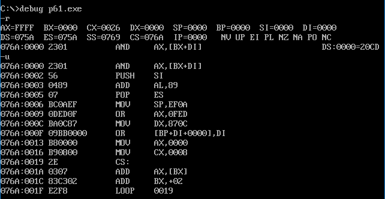
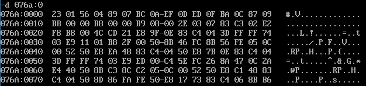
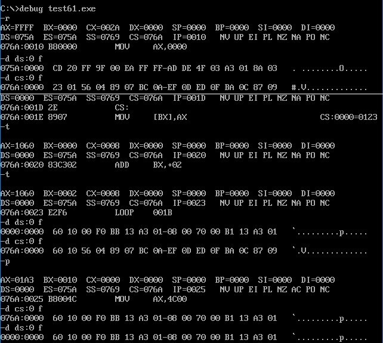
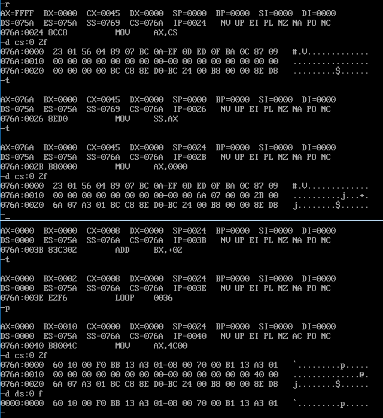

### 6.1 在代码段中使用数据

​	考虑问题，编程计算以下8个数据的和，结果存在 ax 寄存器中：

​	0123h、0456h、0789h、0abch、 0defh、 0fedh、0cbah、0987h

​	前面，我们累加的都是某些内存单元中的数据，并不关心数据本身，现在要累加的是已经给定了数值的数据。我们希望可以用循环的方法来进行累加，所以在累加前，要将这些数据存储在一组地址连续的内存单元中。

​	我们可以用指令一个一个地将它们送入地址连续的内存单元中，从规范角度来讲应该让 OS 来为我们分配。我们可以在程序中，定义我们希望处理的数据，这些数据就会被编译、连接程序作为程序的一部分写到可执行文件中。当可执行文件中的程序被加载入内存时，这些数据也同时被加载入内存中。与此同时，我们要处理的数据也就自然而然地获得了存储空间，具体做法如下：

**程序 6.1**

```assembly
assume cs: code

code segment

    dw 0123h,0456h,0789h,0abch,0defh,0fedh,0cbah,0987h
    mov bx,0
    mov ax,0 

    mov cx,8
    s: add ax, cs:[bx] 
    add bx,2

    loop s

    mov ax, 4c00h 
    int 21h 

code ends 

end
```

​	程序第一行中的“dw”的含义是**定义字型数据**。dw 即“define word”。在这里，使用 dw 定义了 8 个字型数据（数据之间以逗号分隔），它们所占的内存空间的大小为16个字节。

​	程序中的指令就要对这 8 个数据进行累加，由于它们在代码段中，程序在运行的时候 CS 中存放代码段的段地址，所以可以从 CS 中得到这 8 个数据的**段地址**。因为用 dw 定义的数据处于代码段的最开始，所以**偏移地址**为 0，这 8 个数据就在代码段的偏移 0、2、4、6、8、A、C、E 处。程序运行时，它们的地址就是 CS:0、CS:2、CS:4、CS:6、CS:8、CS:A、CS:C、CS:E。

​	程序中，用 bx 存放加  2 递增的偏移地址，用循环来进行累加。在循环开始前，设置(bx)=0，cs:bx 指向第一个数据所在的字单元。每次循环中(bx)=(bx)+2，cs:bx 指向下一个数据所在的字单元。

​	将程序 6.1 编译、连接为可执行文件 p61.exe，先不要运行，用 Debug 加载查看一下，情况如图 6.1 所示。



<center style="color:#C0C0C0">图6.1 用u命令从076A:0000查看程序</center>

​	图 6.1 中，通过“DS=075A”，可知程序从 076A:0000 开始存放，但 u 命令却看到了意料之外的指令。

​	虽然没看到程序中的指令，但实际上用 u 命令从 076A:0000 查看到的也是程序中的内容，只不过不是源程序中的汇编指令所对应的机器码，而是源程序中，在汇编指令前面，用 dw 定义的数据。实际上，在程序中，有一个代码段，在代码段中，前面的16个字节是用“dw”定义的数据，从**第 16 个字节开始才是汇编指令所对应的机器码**。

​	可以用 d 命令更清楚地查看程序中前 16 个字节的内容，如图 6.1.2 所示。



<center style="color:#C0C0C0">图6.1.2 查看程序中前16字节内容</center>

​	可以从 076A:0010 查看程序中要执行的机器指令，如图 6.1.3 所示。


<center style="color:#C0C0C0">图6.1.3 查看程序中的机器指令</center>

​	从图 6.1.2 和 6.1.3 中，我们可以看到程序加载到内存中后，所占内存空间的前16个单元存放在源程序中用“dw”定义的数据，后面的单元存放源程序中汇编指令所对应的机器指令。

​	用 Debug 加载后，可以将 IP 设置为 10h，从而使 CS:IP 指向程序中的第一条指令。然后再用 t 命令、p 命令，或者是 g 命令执行。

​	可是这样一来，我们就必须用Debug来执行程序。程序 6.1 编译、连接成可执行文件后，在系统中直接运行可能会出现问题，因为**程序的入口处不是我们所希望执行的指令**。为了让这个程序在编译、连接后可以在系统中直接运行呢，我们可以在源程序中指明程序的入口所在，具体做法如下。

**程序 6.2** 

```assembly
assume cs:code

code segment
dw 0123h, 0456h, 0789h, 0abch, 0defh, 0fedh, 0cbah, 0987h 
start:	mov bx,0 
        mov ax,0 

        mov cx,8 
S:		add ax, cs:[bx]
		add bx,2
		loop s 
		
		mov ax,4c00h
		int 21h 
code ends 

end start
```

​	注意在程序 6.2 中第一条指令的前面加上了一个**标号 start**，而这个标号在伪指令 end 的后面出现。这里，我们要再次探讨end的作用。end 除了通知编译器程序结束外，还可以**通知编译器程序的入口在什么地方**。在程序 6.2 中我们用 end 指令指明了程序的入口在标号 start 处，也就是说，“mov bx,0”是程序的第一条指令。

​	在前面的课程中（参见 4.8 节），我们已经知道在**单任务系统**中，可执行文件中的程序执行过程如下。

​	(1)由其他的程序（Debug、command 或其他程序）将可执行文件中的程序加载入内存；

​	(2)设置 CS:IP 指向程序的第一条要执行的指令（即程序的入口），从而使程序得以运行；

​	(3)程序运行结束后，返回到加载者。

​	由可执行文件中的描述信息指明、设置 CPU 的 CS:IP 指向程序的第一条要执行的指令。我们知道可执行文件由描述信息和程序组成，**程序**来自于**源程序中的汇编指令和定义的数据**；**描述信息**则主要是**编译、连接程序对源程序中相关伪指令进行处理所得到的信息**。我们在程序 6.2 中，用伪指令 end 描述了程序的结束和程序的入口。在编译、连接后，由“end start”指明的程序入口，被转化为一个**入口地址**，存储在可执行文件的描述信息中。在程序 6.2 生成的可执行文件中，这个入口地址的偏移地址部分为：10H。当程序被加载入内存之后，加载者从程序的可执行文件的描述信息中读到程序的入口地址，设置 CS:IP。这样 CPU 就从我们希望的地址处开始执行。

​	归根结底，我们若要 CPU 从何处开始执行程序，只要在源程序中用“end 标号”指明就可以了。

​	有了这种方法，就可以这样来安排程序的框架：

```assembly
assume cs: code

code segment 
...
数据 
...
start: 
...
代码
...
code ends

end start 
```

### 6.2 在代码段中使用栈

完成下面的程序，利用栈，将程序中定义的数据逆序存放。

```assembly
assume cs: codesg

codesg segment

    dw 0123h,0456h,0789h,0abch,0defh,0fedh,0cbah,0987h
    ;code answer?
codesg ends

end
```

程序的思路大致如下。

​	程序运行时，定义的数据存放在 cs:0～cs:F 单元中，共 8 个字单元。依次将这 8 个字单元中的数据入栈，然后再依次出栈到这 8 个字单元中，从而实现数据的逆序存放。

​	问题是，我们首先要有一段可当作栈的内存空间。如前所述，这段空间应该由系统来分配。可以在程序中通过定义数据来取得一段空间，然后将这段空间当作栈空间来用。程序如下：

**程序 6.3** 

```assembly
assume cs:codesg

codesg segment

	dw 0123h,0456h,0789h,0abch,0defh,0fedh,0cbah,0987h
	dw 0,0,0,0,0,0,0,0,0,0,0,0,0,0,0,0
						;用dw定义16个字型数据，在程序加载后，将取得16个字的内存空间存放这16个数据。
						;在后面的程序中将这段空间当作栈来使用
start: 	mov ax,cs
		mov ss,ax		;要将cs:10~cs:2f的内存空间当作栈来用，初始状态下栈为空，ss:sp要指向栈底
		mov sp,30h		;将设置栈顶 ss:sp 指向 cs:30
		
		mov bx,0
		mov cx,8
s: 		push cs:[bx]
		add bx,2
		loop s			;以上将代码段0~15单元中的8个字型数据依次入栈
		
		mov bx,0
		mov cx,8
s0: 	pop cs:[bx]
		add bx,2
		loop s0;		;以上依次出栈8个字型数据到代码段0~15单元中
		
		mov ax,4c00h
		int 21h
		
codesg ends

end start				;指明程序的入口在start处
```

​	其中定义 16 个字型数据的值是 0 或者其他对程序来说是无所谓的，dw 定义了 16 个数据，即在程序中写入 16 个字型数据，程序加载后用 32 个字节的内存空间来存放它们。可见我们描述 dw 作用时，可以说用它**定义数据**，也可以说用它们**开辟内存空间**。

### 检测点 6.1

​	(1)下面的程序实现依次用内存 0:0～0:15 单元中的内容改写程序中的数据，完成程序：

```assembly
assume cs:codesg

codesg segment
	dw 0123h,0456h,0789h,0abch,0defh,0fedh,0cbah,0987h
start: 	mov ax,0
		mov ds,ax
		mov bx,0

		mov cx,8
S:		mov ax,[bx]
		______
		add bx,2
		loop s

		mov ax,4c00h
		int 21h

codesg ends

end start
```

解析：

​	assume 是一个用于告诉汇编器如何将 CS 段寄存器与特定段名称 codesg 关联的指令。

​	标号 start 所在的 mov ax,0 是第一条指令，前面定义了 8 个字型数据，所以偏移量 IP 为 0010。

​	利用段前缀指明将 ds:[bx] 开始的内存单元的内容放入 cs:[bx] 中，所以应该填`mov cs:[bx],ax`

​	

<center style="color:#C0C0C0">图6.2 程序运行情况</center>

​	(ps：利用 r 命令调试可以发现一开始程序长度由寄存器 CX 记录)

​	(2)下面的程序实现依次用内存 0:0～0:15 单元中的内容改写程序中的数据，数据的传送用栈来进行。栈空间设置在程序内。完成程序：

```assembly
assume cs:codesg

codesg segment

	dw 0123h, 0456h,0789h,0abch,0defh,0fedh, 0cbah, 0987h
	dw 0,0,0,0,0,0,0,0,0,0		;10 个字单元用作栈空间

start:	mov ax,____
		mov ss,ax
		mov sp,____

		mov ax,0
		mov ds,ax
		mov bx,0
		mov cx,8

s: 		push [bx]
		____
		add bx,2
		loop s

		mov ax,4c00h
		int 21h

codesg ends

end start
```

解析：

​	根据 assume ，段空间设置在 cs 中，所以 ss 起始地址 ax 设置为 cs，即`mov ax,cs`

​	前面定义了 8 个字的数据，栈空间为 10 个字单元，即 20 个字节，所以初始化栈顶位置为 `36` 或者 `24H`。（注意，sp 的值不唯一，1c～24h都是可以令程序正常运行的值，如果超过这个范围，有可能在运行过程中改写第一行 dw 中的数据，导致错误，因为本质上**压栈后里立即出栈只需要用到一个字的空间**，但若只设置 12h 会导致错误。简而言之可以得到一个结论：**如果栈放在栈段，数据放在数据段，就不会相互影响，而直接操作内存是有风险的**）

​	最终出栈位置也是 cs 段，即`pop cs:[bx]`

​	调试过程中可以发现，即使还没有压栈，仅仅设置了 ss 的值，栈空间中有些 00 已经发生变化，这个问题要用后面章节内容来解答。



<center style="color:#C0C0C0">图6.2.1 程序运行情况</center>

更安全的写法——把程序定义在不同段上，避免相互影响：

```assembly
assume cs:codesg, ss:stack, ds:datasg
datasg segment
	dw 1122h,3344h,5566h,7788h,99aah,0bbcch,0ddeeh,0ff00h
datasg ends

stack segment
	dw 0,0,0,0,0,0
stack ends

codesg segment
	dw 0123h, 0456h,0789h,0abch,0defh,0fedh, 0cbah, 0987h

start:
	mov ax,stack
	mov ss,ax
	mov sp,02h
	
	mov ax,datasg
	mov ds,ax
	mov bx,0
	mov cx,8
s:
	push ds:[bx]
	pop cs:[bx]
	add bx,2
	loop s
	
	mov ax,4c00h
	int 21h
	
codesg ends

end start
```


<center style="color:#C0C0C0">图6.2.2 改进后程序运行情况</center>

### 6.3 将数据、代码、栈放入不同的段

​	在前面的内容中，我们在程序中用到了数据和栈，将**数据、栈和代码都放到了一个段里面**。我们在编程的时候要注意何处是数据，何处是栈，何处是代码。这样做显然有两个问题：

​	(1)把它们放到一个段中使程序显得混乱；

​	(2)前面程序中处理的数据很少，用到的栈空间也小，加上没有多长的代码，放到一个段里面没有问题。但如果数据、栈和代码需要的空间超过64KB，就不能放在一个段中（一个段的容量不能大于64KB，是我们在学习中所用的8086模式的限制，并不是所有的处理器都这样)。

​	所以，应该考虑**用多个段来存放数据、代码和栈**。

​	我们用和定义代码段一样的方法来定义多个段，然后在这些段里面定义需要的数据，或通过定义数据来取得栈空间。具体做法如下面的程序所示，这个程序实现了和程序 6.3 一样的功能，不同之处在于**它将数据、栈和代码放到了不同的段中**。

**程序 6.4**

```assembly
assume cs:code, ds:data, ss:stack

data segment
	dw 0123h, 0456h, 0789h, 0abch, 0defh, 0fedh, 0cbah, 0987h 
data ends
stack segment
	dw 0,0,0,0,0,0,0,0,0,0,0,0,0,0,0,0 
stack ends

code segment 
start: 
	mov ax,stack
	mov ss,ax 
	mov sp,20h	;设置栈顶 ss：sp 指向 stack：20

	mov ax,data
	mov ds,ax	;ds 指向data 段

	mov bx,0	;ds:bx指向data段中的第一个单元

	mov cx, 8

s:
	push [bx]
	add bx,2
	loop s		;以上将 data 段中的0～15单元中的 8个字型数据依次入栈

	mov bx,0

	mov cx, 8
s0:
	pop [bx]
	add bx,2
	loop s0		;以上依次出栈8个字型数据到data段的0—15单元中

	mov ax,4c00h
	int 21h

code ends

end start
```

下面对程序 6.4 做出说明。

(1) 定义多个段的方法

​	定义一个段的方法和前面所讲的定义代码段的方法没有区别，只是**对于不同的段，要有不同的段名**。

(2) 对段地址的引用

​	现在，程序中有多个段了，如何访问段中的数据呢？当然要通过地址，而地址是分为两部分的，即**段地址**和**偏移地址**。如何指明要访问的数据的段地址呢？在程序中，段名就相当于一个标号，它代表了段地址。所以指令“mov ax,data”的含义就是将名称为“data”的段的段地址送入 ax。一个段中的数据的段地址可由段名代表，偏移地址就要看它在段中的位置了。程序中“data”段中的数据“0abch”的地址就是： data:6。要将它送入 bx 中，就要用如下的代码：

```assembly
mov ax,data
mov ds,ax
mov bx,ds:[6]
```

我们不能用下面的指令：

```assembly
mov ds,data
mov bx,ds:[6]
```

其中指令`mov ds,data`是错误的，因为8086CPU不允许将一个数值直接送入段寄存器中。**程序中对段名的引用，将被编译器处理为一个表示段地址的数值**(如指令“mov ds,data”中的“data”)。

(3)“代码段”、“数据段”、“栈段”完全是我们的安排

​	现在，我们以一个具体的程序来再次讨论一下所谓的“代码段”、“数据段”、“栈段”。在汇编源程序中，可以定义许多的段，比如在程序 6.4 中，定义了 3 个段，“code”、“data”和“stack”。我们可以分别安排它们存放代码、数据和栈。那么我们如何让 CPU 按照我们的这种安排来执行这个程序呢？下面来看看源程序中对这 3 个段所做的处理。

​	①我们在源程序中为这 3 个段起了具有含义的名称，用来放数据的段我们将其命名为“data” ，用来放代码的段我们将其命名为“code”，用作栈空间的段命名为“stack”。

​	这样命名了之后，CPU 并非去执行“code”段中的内容，处理“data”段中的数据，将“stack”当做栈，我们这样命名，**仅仅是为了使程序便于阅读**。这些**名称同“start”、“s”、“s0”等标号一样**，仅在源程序中存在，CPU并不知道它们。

​	②我们在源程序中用伪指令“assume cs:code,ds:data,ss:stack”将 cs、 ds 和 ss 分别和code、data、stack 段相连。这样做了之后，CPU 是否就会将 cs 指向 code，ds 指向 data，ss 指向 stack，从而按照我们的意图来处理这些段呢？

​	当然也不是，要知道 assume 是伪指令，是由编译器执行的，也是仅在源程序中存在的信息， CPU 并不知道它们。我们不必深究 assume 的作用，只要知道**需要用它将你定义的具有一定用途的段和相关的寄存器联系起来**就可以了。

​	③ 若**要 CPU 按照我们的安排行事，就要用机器指令控制它**，源程序中的汇编指令是 CPU 要执行的内容。CPU 如何知道去执行它们？我们在源程序的最后用“end start”说明了程序的入口，这个入口将被写入可执行文件的描述信息，可执行文件中的程序被加载入内存后，CPU 的 CS:IP 被设置指向这个入口，从而开始执行程序中的第一条指令。标号“start”在“code”段中，这样 CPU 就将 code 段中的内容当作指令来执行了。我们在 code 段中，使用指令：

```assembly
mov ax,stack
mov ss,ax
mov sp,20h
```

​	设置 ss 指向 stack，设置 ss:sp 指向 stack:20，CPU 执行这些指令后，将把 stack 段当做栈空间来用。CPU若要访问 data 段中的数据，则可用 ds 指向 data 段，用其他的寄存器(如 bx)来存放 data 段中数据的偏移地址。

​	总之，CPU 到底如何处理我们定义的段中的内容，是当作指令执行，当作数据访问，还是当作栈空间，**完全是靠程序中具体的汇编指令，和汇编指令对 CS:IP、SS:SP、DS 等寄存器的设置来决定的**。完全可以将程序 6.4 写成下面的样子，实现同样的功能。

```assembly
assume cs:b, ds:a, ss:c

a segment
	dw 0123h, 0456h, 0789h, 0abch, 0defh, 0fedh, 0cbah, 0987h 
a ends

c segment
	dw 0,0,0,0,0,0,0,0,0,0,0,0,0,0,0,0 
c ends

b segment 
d:
	mov ax,c 
	mov ss,ax
	mov sp,20h		;希望用c段当作栈空间，设置ss:sp指向c：20
	
	mov ax,a
	mov ds,ax		;希望用ds：bx访问a段中的数据，ds指向a段
	
	mov bx, 0		;ds：bx指向a段中的第一个单元mov cx,8
s: 
	push [bx]
	add bx,2 
	loop s			;以上将a段中的0～15单元中的8个字型数据依次入栈
	
	mov bx,0
	mov cx,8
s0:
	pop [bx]
	add bx,2
	loop s0			;以上依次出栈8个字型数据到a段的0～15单元中
	
	mov ax,4c00h
	int 21h 
	
b ends 

end d			;d处是要执行的第一条指令，即程序的入口
```

