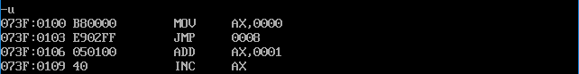
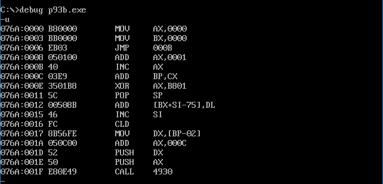

## 第 9 章 转移指令的原理

​	**可以修改 IP，或同时修改 CS 和 IP 的指令统称为转移指令**。概括地讲，转移指令就是可以控制 CPU 执行内存中某处代码的指令。

​	8086CPU 的转移行为有以下几类。
- 只修改 IP 时，称为**段内转移**，比如：jmp ax。
- 同时修改 CS 和 IP 时，称为**段间转移**，比如：jmp 1000:0。

由于转移指令对 IP 的修改范围不同，段内转移又分为：**短转移**和**近转移**。
- 短转移 IP 的修改范围为 -128~127。
- 近转移 IP 的修改范围为 -32768~32767。

8086CPU 的转移指令分为以下几类。

- 无条件转移指令(如：jmp)
- 条件转移指令
- 循环指令(如：loop)
- 过程
- 中断

​	这些转移指令转移的前提条件可能不同，但转移的基本原理是相同的。我们在这一章主要通过深入学习无条件转移指令 jmp 来理解 CPU 执行转移指令的基本原理。

### 9.1 操作符 offset

​	操作符 offset 在汇编语言中是由编译器处理的符号，它的功能是**取得标号的偏移地址**。比如下面的程序：

```assembly
assume cs:codesg
codesg segment
start: 
	mov ax, offset start 	;相当于mov ax,0
s: 
	mov ax, offset s 		;相当于mov ax,3
codesg ends
end start
```

​	在上面的程序中，offset 操作符取得了标号 start 和 s 的偏移地址 0 和 3，所以指令：
​	`mov ax, offset start`相当于指令`mov ax,0`，因为 start 是代码段中的标号，它所标记的指令是代码段中的第一条指令，偏移地址为 0；  

​	`mov ax,offset s`相当于指令`mov ax,3`，因为 s 是代码段中的标号，它所标记的指令是代码段中的第二条指令，第一条指令长度为 3 个字节，则 s 的偏移地址为3。  

**问题 9.1**

​	有如下程序段，添写两条指令，使该程序在运行中将 s 处的一条指令复制到 s0 处。

```assembly
assume cs:codesg
codesg segment
s:
    mov ax,bx 			;mov ax,bx 的机器码占两个字节
    mov si, offset s
    mov di, offset s0
	_________
	_________
s0:
	nop 				;nop 的机器码占一个字节
	nop
codesg ends
end s
```

思考后看分析。

**分析：**
	(1) s 和 s0 处的指令所在的内存单元的地址是多少？cs:offset s 和 cs:offset s0。
	(2) 将 s 处的指令复制到 s0 处，就是将 cs:offset s 处的数据复制到 cs:offset s0 处。
	(3) 段地址已知在 cs 中，偏移地址 offset s 和 offset s0 已经送入 si 和 di 中。
	(4) 要复制的数据有多长？mov ax,bx 指令的长度为两个字节，即 1 个字。

程序如下：

```assembly
assume cs:codesg
codesg segment
s:
    mov ax,bx 			;mov ax,bx 的机器码占两个字节
    mov si, offset s
    mov di, offset s0
    mov ax,cs:[si]
    mov cs:[di],ax
s0: 
	nop 				;nop 的机器码占一个字节
    nop
codesg ends

end s
````

### 9.2 jmp 指令

​	jmp 为**无条件转移指令**，可以只修改 IP，也可以同时修改 CS 和 IP。

​	jmp 指令要给出两种信息：
1. 转移的目的地址
2. 转移的距离(段间转移、段内短转移、段内近转移)

​	不同的给出目的地址的方法，和不同的转移位置，对应有不同格式的 jmp 指令。下面几节内容中，以给出目的地址的不同方法为主线，讲解 jmp 指令的主要应用格式和 CPU 执行转移指令的基本原理。

### 9.3 依据位移进行转移的 jmp 指令
​	**jmp short 标号(转到标号处执行指令)**

这种格式的 jmp 指令实现的是段内短转移，它对 IP 的修改范围为 -128~127，也就是说，它向前转移时可以最多越过 128 个字节，向后转移可以最多越过 127 个字节。jmp 指令中的“short”符号，说明指令进行的是**短转移**。jmp 指令中的“标号”是代码段中的标号，指明了指令要转移的目的地，转移指令结束后，CS:IP 应该指向标号处的指令。
	比如：

**程序 9.1**

```assembly
assume cs:codesg

codesg segment
start: 
	mov ax,0
	jmp short s
	add ax,1
s:
	inc ax
codesg ends

end start
```

​	上面的程序执行后，ax 中的值为 1，因为执行 jmp short s 后，越过了 add ax,1，IP 指向了标号 s 处的 inc ax。也就是说，程序只进行了一次 ax 加 1 操作。

​	汇编指令 jmp short s 对应的机器指令应该是什么样的呢？我们先看一下别的汇编指令和其对应的机器指令。

| 汇编指令          | 机器指令    |
| ----------------- | ----------- |
| mov ax,0123h      | B8 23 01    |
| mov ax,ds:[0123h] | A1 23 01    |
| push ds:[0123h]   | FF 36 23 01 |

​	可以看到，在一般的汇编指令中，汇编指令中的 idata(立即数)，不论它是表示一个数据还是内存单元的偏移地址，都会在对应的机器指令中出现，因为CPU执行的是机器指令，它必须要处理这些数据或地址。

​	现在我们在 Debug 中将程序 9.1 翻译成机器码，看到的结果如图 9.3 所示。



<center style="color:#C0C0C0">图9.3 程序9.1的机器码</center>

​	对照汇编源程序，我们可以看到，Debug将 jmp short s 中的 s 表示为 inc ax 指令的偏移地址 8，并将 jmp short s 表示为 jmp 0008，表示转移到 cs:0008 处。这一切似乎合理，可是当我们查看 jmp short s 或是 jmp 0008 所对应的机器码，却发现了一些问题。

​	jmp 0008(Debug 中的表示)或 jmp short s(汇编语言中表示)所对应的机器码为 EB03，注意，这个**机器码中竟不包含转移的目的地址**，这意味着，CPU 在执行 EB03 的时候并不知道转移的目的地。那么，CPU 根据什么进行转移呢？它知道转移到哪里呢？

​	令人奇怪的是，汇编指令 jmp short s 中，明明是带有转移的目的地址(由标号 s 表示)的，可翻译成机器指令后，怎么目的地址就没了呢？没有了目的地址，CPU如何知道转移到哪里呢？

我们把程序 9.1 改写一下，变成下面这样：

**程序 9.2**

```assembly
assume cs:codesg
codesg segment
start:
	mov ax,0
	mov bx,0
	jmp short s
	add ax,1
s:
	inc ax
codesg ends
end start
```

​	我们在 Debug 中将程序 9.2 翻译成机器码，看到的结果如图 9.2 所示。



<center style="color:#C0C0C0">图9.3.1 程序9.2的机器码</center>

​	比较一下程序 9.1 和 9.2 用 Debug 查看的结果，注意，两个程序中的 jmp 指令都要使 IP 指向 inc ax 指令，但是程序 9.1 的 inc ax 指令的偏移地址为 8，而程序 9.2 的 inc ax 指令的偏移地址为 000BH，而两个程序中的jmp指令所对应的机器码，**都是EB 03，这说明 CPU 在执行 jmp 指令的时候并不需要转移的目的地址**。两个程序中的 jmp 指令的转移目的地址并不一样，一个是cs:0008，另一个是cs:000B，如果机器指令中包含了转移的目的地址的话，那么它们对应的机器码应该是不同的。那么也就是说，CPU不需要这个目的地址就可以实现对IP的修改。

​	CPU 只能处理你供给它的东西，jmp 指令的机器码中不包含转移的目的地址，那 CPU 如何知道将 IP 改为多少呢？所以，在 jmp 指令的机器码中，一定包含了某种信息，使得 CPU 可以将它当做改 IP 的依据。

我们先简单回忆一下CPU执行指令的过程(如果你需要更多的回忆，可以复习一下 2.10 节的内容)。
	(1) 从 CS:IP 指向内存单元读取指令，读取的指令进入指令缓冲器;
	(2)(IP)=(IP)+所读取指令的长度，从而指向下一条指令;
	(3) 执行指令。转到 1，重复这个过程。
按照这个步骤，我们参照图 9.2 看一下，程序 9.2 中 jmp short s 指令的读取和执行过程:
	(1)(CS)=0BBDH，(IP)=0006H，CS:IP指向EB 03(jmp short s的机器码);
	(2)读取指令码EB 03送入指令缓冲器;
	(3)(IP)=(IP)+所读取指令的长度=(IP)+2=0008H，CS:IP指向add ax,1;
	(4) CPU执行指令缓冲器中的指令EB 03;
	(5) 指令EB 03执行后，(IP)=000BH,CS:IP指向inc ax。
	从上面的过程中我们看到，CPU 将指令EB 03读入后，IP指向了下一条指令，即 CS:0008 处的 add ax,i 接着执行EB 03。如果 EB 03 没有对 IP 进行修改的话，那么，接下来 CPU 将执行 add ax,1 可是，CPU 执行的 EB 03 却是一条修改 IP 的转移指令，执行后(IP)=000BH，CS:IP 指向 inc ax，CS:0008 处的 add ax,1 没有被执行。

​	CPU 在执行 EB 03 的时候是根据什么修改的 IP，使其指向目标指令呢?就是**根据指令码中的 03**。注意，要转移的目的地址是 CS:000B，而 CPU 执行 EB 03 时，当前的(IP)=0008H，如果将当前的 IP 值加 3，使(IP)=000BH，CS:IP 就可指向目标指令。在转移指令 EB 03 中并没有告诉 CPU 要转移的目的地址，却告诉了 CPU 要转移的位置，即将当前的 IP 向后移动 3 个字节。因为程序1、2中的 jmp 指令转移的位移相同，都是向后3个字节，所以它们的机器码都是EB 03。
​	原来如此，在“jmp short 标号”指令所对应的机器码中，**并不包含转移的目的地址，而包含的是转移的位移**。这个位移，是编译器根据汇编指令中的“标号”计算出来的，具体的计算方法如图 9.3.2 所示。


<center style="color:#C0C0C0">图9.3.2 转移位移的计算方法</center>

实际上，“jmp short 标号”的功能为：(IP)=(IP)+8 位位移。

​	(1) 8位位移=标号处的地址-jmp 指令后的第一个字节的地址；

​	(2) short 指明此处的位移为8 位位移；

​	(3) 8 位位移的范围为-128~127，用补码表示(如果你对补码还不了解，请阅读附注2)；

​	(4) 8 位位移由编译程序在编译时算出。

还有一种和“jmp short 标号”功能相近的指令格式，jmp near ptr 标号，它实现的是**段内近转移**。

​	“jmp near ptr 标号”的功能为：(IP)=(IP)+16 位位移。

​	(1) 16 位位移=标号处的地址-jmp 指令后的第一个字节的地址；

​	(2) near ptr 指明此处的位移为16 位位移，进行的是段内近转移；

​	(3) 16 位位移的范围为-32768~32767，用补码表示；

​	(4) 16 位位移由编译程序在编译时算出。

### 9.4 转移的目的地址在指令中的 jmp 指令

​	前面讲的 jmp 指令，其对应的**机器指令中并没有转移的目的地址**，而是相对于当前 IP 的**转移位移**。“jmp far ptr 标号”实现的是**段间转移**，又称为**远转移**。功能如下：
​	(CS)=标号所在段的段地址；(IP)=标号在段中的偏移地址。
​	far ptr 指明了指令用标号的段地址和偏移地址修改 CS 和 IP。

看下面的程序：

**程序 9.3**

```assembly
assume cs:codesg
codesg segment
start:
    mov ax,0
    mov bx,0
    jmp far ptr s
    db 256 dup (0)
s:
    add ax,1
    inc ax
codesg ends
end start
```

​	在 Debug 中将程序 9.3 翻译成为机器码，看到的结果如图 9.4 所示。


<center style="color:#C0C0C0">图9.4 程序9.3的机器码</center>

​	如图 9.4 中所示，源程序中的 db 256 dup (0)，被 Debug 解释为相应的若干条汇编指令。这不是关键，关键是，我们要注意一下 jmp far ptr s 所对应的机器码：EA 0B 01 BD 0B，其中包含转移的目的地址。“0B 01 BD 0B”是目的地址在指令中的存储顺序，高地址的“BD 0B”是转移的段地址：0BBDH，低地址的“0B 01”是偏移地址：010BH。

​	对于“jmp X 标号”格式的指令的深入分析请参看附注 3。

### 9.5 转移地址在寄存器中的 jmp 指令

指令格式：jmp 16位 reg 功能：(IP)=(16位 reg)

这种指令我们在前面的内容(参见 2.11 节)中已经讲过，这里就不再详述。

### 9.6 转移地址在内存中的 jmp 指令

转移地址在内存中的 jmp 指令有两种格式：

(1) jmp word ptr 内存单元地址(段内转移)

​	功能: 从内存单元地址开始存放着一个字, 是转移的目的偏移地址。

​	内存单元地址可用寻址方式的任一格方式给出。

比如, 下面的指令:

```assembly
mov ax,0123H  
mov ds:[0],ax  
jmp word ptr ds:[0]  
```

​	执行后, (IP)=0123H.

又比如, 下面的指令:

```assembly
mov ax, 0123H  
mov [bx], ax  
jmp word ptr [bx]  
```

​	执行后, (IP)=0123H

(2) jmp dword ptr 内存单元地址(段间转移)

​	功能: 从内存单元地址处开始存放着两个字, 高地址处的字是转移的目的段地址, 低地址处是转移的目的偏移地址。

```assembly
(CS)=(内存单元地址+2)
(IP)=(内存单元地址)
```

​	内存单元地址可用寻址方式的任一格方式给出。

比如, 下面的指令:

```assembly
mov ax,0123H  
mov ds:[0],ax  
mov word ptr ds:[2],0
jmp dword ptr ds:[0]
```

​	执行后, (CS)=0, (IP)=0123H, CS:IP 指向 0000:0123

又比如, 下面的指令:

```assembly
mov ax, 0123H  
mov [bx],ax 
mov word ptr [bx+2],0
jmp dword ptr [bx]
```

​	执行后，(CS)=0，(IP)=0123H，CS:IP 指向 0000:0123

### 9.a 检测点

(1) 程序如下。

```assembly
assume cs:code

data segment
    ;/*Code Answer*/ 
data ends

code segment
start:
    mov ax,data
    mov ds,ax
    mov bx,0
    jmp word ptr [bx+1]
    
code ends
end start
```

​	若要使程序中的 jmp 指令执行后，CS:IP 指向程序的第一条指令，在 data 段中应该定义哪些数据？

解析：

​	本题考察转移地址在内存单元中的 jmp 指令

​	指向第一条指令，即让偏移量为 0。

​	本题有个有意思的地方，data 段或者 stack 段可以不关联，但是 code 段必须用 assume 关联，否则会编译出错。

```assembly
db 0ffh,0,0 ;只需要2、3两个字节为零即可，这样[bx+1]=IP=0，即偏移地址为0，ffh首位为字母，前面补一个零
;用dw来定义亦可
dw 0,0
;用dd来定义亦可
dd 0
```

(2) 程序如下。

```assembly
assume cs:code

data segment
	dd 12345678H
data ends

code segment
start:
    mov ax,data
    mov ds,ax
    mov bx,0
    mov [bx],_________
    mov [bx+2],_______
    jmp dword ptr ds:[0]
    
code ends

end start
```

​	补全程序，使 jmp 指令执行后，CS:IP 指向程序的第一条指令。

解析：

​	本题考察转移地址在内存单元中的 jmp **段间转移**指令

​	段间转移要同时设置 cs 和 ip，高地址存放 cs，低地址存放 ip

​	对内存单元操作要借助寄存器，所以第一个空不能写 0，要写 bx

​	同理，第二个空直接写 cs

```assembly
    mov [bx],bx
    mov [bx+2],cs
```

​	本题数据段数据为干扰项没有用，但有些题不将数据段单独定义，而是定义在代码段内，这时候相应的地址计算会发生变化，需要留意。

(3) 用 Debug 查看内存，结果如下：

```assembly
2000:1000 BE 00 06 00 00 00 ......
```

则此时，CPU 执行指令：

```assembly
mov ax,2000H
mov es,ax
jmp dword ptr es:[1000H]
```

后，(CS)=?，(IP)=?

解析：

​	和上题一样考察 jmp **段间转移**指令

​	段间转移要同时设置 cs 和 ip，高地址存放 cs，低地址存放 ip

​	所以 BE 00 描述的是 ip，06 00描述的是 cs，按高位低位整理一下，cs = 0006H，ip=00bEH

```assembly
cs=0006H
ip=00BEH
```

### 9.7 jcxz 指令

​	jcxz 指令为**有条件转移指令**，所有的有条件转移指令都是短转移，在对应的机器码中包含转移的位移，而不是目的地址。对 IP 的修改范围都为：-128～127。

​	指令格式：jcxz 标号(如果(cx)=0，转移到标号处执行)。

​	操作：当(cx)=0时，(IP)=(IP)+8 位位移；  

​	8 位位移=标号处的地址 -jcxz 指令后的第一个字节的地址；  

​	8 位位移的范围为-128～127，用**补码**表示；  

​	8 位位移由编译程序在编译时算出。  

​	当(cx)!=0时，什么也不做(程序向下执行)。  

​	我们从 jcxz 的功能中可以看出，“jcxz 标号”的功能相当于：

```c
if((cx)==0) jmp short 标号;  /*用 C 语言和汇编语言进行综合描述，或许更能清楚理解有条件转移指令。*/
```

### 9.b 检测点

补全程序，利用 jcxz 指令，实现在内存 2000H 段中查找第一个值为 0 的字节，找到后，将它的偏移地址存储在 dx 中。

```assembly
assume cs:code
code segment
start:
    mov ax,2000H
    mov ds,ax
    mov bx,0
s:
	________
	________
	________
	________
	jmp short s
ok:
	mov dx,bx
	mov ax,4C00h
    int 21h
code ends
end start
```

解析：

​	思路很简单，一定有一条`jcxz ok`和一条`inc bx`这点很容易想到

​	检测字节，要注意 cx 为 16 位寄存器，所以只用一半 cl 或者 ch 读取 [bx]内容即可（另一半要置零，顺序无所谓），不可写成`mov cx,[bx]`，这样长度不匹配，检测的变成[bx]和[bx+1]两个字节是否为零了。

```assembly
assume cs:code
code segment
start:
    mov ax,2000H
    mov ds,ax
    mov bx,0
s:
	mov cl,[bx]
	mov ch,0
	jcxz ok
	inc bx
	jmp short s
ok:
	mov dx,bx
	mov ax,4C00h
    int 21h
code ends
end start
```

### 9.8 loop指令

​	loop 指令为循环指令，所有的循环指令都是**短转移**，在对应的机器码中包含转移的位置，而不是目的地址。对 IP 的修改范围都为：-128~127。

​	指令格式：loop 标号((cx)=(cx)-1)，如果(cx)≠0，转移到标号处执行。

操作：

​	(1) (cx)=(cx)-1;

​	(2) 如果(cx)≠0，(IP)=(IP)+8位位移。

​	8 位位移=标号处的地址-loop 指令后的第一个字节的地住；

​	8 位位移的范围为-128~127，用补码表示；

​	8 位位移由编译程序在编译时算出。

​	如果(cx)=0，什么也不做(程序向下执行)。

​	我们从loop的功能中可以看出，“loop 标号”的功能相当于：

```c
(cx)--;
if((cx)!=0) jmp short 标号;
```

### 9.c 检测点

补全程序，利用 loop 指令，实现在内存 2000H 段中查找第一个值为 0 的字节，找到后，将它的偏移地址存储在dx中。

```assembly
assume cs:code
code segment
start: 
    mov ax,2000H
    mov ds,ax
    mov bx,0
s: 
    mov cl,[bx]
    mov ch,0
    ________
    inc bx
	loop s
ok:
	dec bx 			; dec指令的功能和 inc 相反，dec bx进行的操作为：(bx)=(bx)-1
	mov dx,bx
	mov ax,4c00h
	int 21h
code ends
end start
```

解析：

​	和上一题是类似的，当 cl = 1、ch = 0 时，cx - 1 = 0，所以 cx = 0001H时，loop 之后正好为 0，跳出循环。

```assembly
add cl,1
;下面这三个答案也可以
inc cl
add cx,1
inc cx
```

### 9.9 根据位移进行转移的意义

前面我们讲到：

```assembly
jmp short 标号  
jmp near ptr 标号  
jcxz 标号  
loop 标号  
```

​	等几种汇编指令，它们对 IP 的修改是根据转移目的地址和转移起始地址之间的位移来进行的。在它们对应的机器码中**不包含转移的目的地址**，而**包含的是到目的地址的位移**。

​	这种设计，方便了程序段在内存中的浮动装配。

例如：

| 汇编指令     | 机器代码 |
| ------------ | -------- |
| mov cx,6     | B9 06 00 |
| mov ax,10h   | B8 10 00 |
| s: add ax,ax | 01 C0    |
| loop s       | E2 FC    |

​	**这段程序装在内存中的不同位置都可正确执行**，因为 loop s 在执行时只涉及 s 的位移（-4，前移4个字节，补码表示为FCH），而不是 s 的地址。如果 loop s 的机器码中包含的是 s 的地址，则就对程序段在内存中的偏移地址有了严格的限制，因为机器码中包含的是 s 的地址，如果 s 处的指令不在目的地址处，程序的执行就会出错。而 loop s 的机器码中包含的是转移的位移，就不存在这个问题了，因为，**无论 s 处的指令的实际地址是多少，loop 指令的转移位移是不变的**。

### 9.10 编译器对转移位移超界的检测

​	注意，根据位移进行转移的指令，它们的转移范围受到转移位移的限制，如果在源程序中出现了转移范围超标的问题，在编译的时候，编译器将报错。

比如，下面的程序将引起编译错误：

```assembly
assume cs:code

code segment
start: 
	jmp short s
	db 128 dup (0)
s:
	mov ax, 0ffffh
code ends
end start
```

​	jmp short s 的转移范围是 -128～127，IP最多向后移动 127 个字节。

​	注意，我们在第 2 章中讲到的形如“jmp 2000:0100”**直接地址跳转格式**的转移指令，是在 Debug 中使用的汇编指令，汇编编译器比如 MASM 并不认识。如果在源程序中使用，编译时也会报错。

## 附注

### 附注 1 Intel 系列微处理器

​	微机中常用的 Intel 微处理器有：8080, 8086/8088, 80186，80286, 80386/80486, Pentium, Pentium II, Pentium III, Pentium4.

​	8086/8088 是一个重要的阶段，8086 和 8088 是略有区别的两个功能相同的 CPU。8088 被 IBM 用在了它所生产的第一台微机上，该微机的结构事实上成为以后微机的基本结构。

​	80386 是第二个重要的型号，随着微机应用及性能的发展，在微机上构造可靠的多任务操作系统的问题日益突出。人们希望(或许是一种潜在的希望)，一旦被挖掘出来，便形成了一个最基本的需求)自己的 PC 机能够稳定地同时运行多个程序，同时处理多项工作；或将 PC 机用作主机服务器，运行 UNIX 那样的多用户系统。

​	8086/8088 不具备实现一个完善的多任务操作系统的功能。为此 Intel 开发了 80286，80286 具备了对多任务系统的支持。但对 8086/8088 的兼容却做得不好。这妨碍了用户对原 8086 机上的程序的使用。IBM 最早基于 80286 开发了多任务系统 OS/2，结果犯了一个战略错误。

​	随后 Intel 又开发了 80386 微处理器，这是一个划时代的产物。它可以在以下 3 个模式下工作。
​	(1) 实模式: 工作方式相当于一个 8086。
​	(2) 保护模式: 提供支持多任务环境的工作方式，建立保护机制(这与 VAX 等小型机类似)。
​	(3) 虚拟 8086 模式: 可从保护模式切换至其中的 8086 工作方式。这种方式提供使用户可以方便地在保护模式下运行一个或多个原 8086 程序。

​	以后的各代微处理器都提供了上述 3 种工作模式。

​	你也许会说:“喂，先生，你说的太抽象了，这 3 种模式我如何感知?”

​	其实 CPU 的这 3 种模式只要用过 PC 机的人都经历过。任何一台使用 Intel 系列 CPU 的 PC 机只要一开机，CPU 就工作在实模式下。如果你的机器装的是 DOS，那么在 DOS 加载后 CPU 仍以实模式工作。如果你的机器装的是 Windows，那么 Windows 加载后，将由 Windows 将 CPU 切换到保护模式下工作，因为 Windows 是多任务系统，它必须在保护模式下运行。如果在 Windows 中运行一个 DOS 下的程序，那么 Windows 将 CPU 切换到虚拟 8086 模式下运行该程序。或者是这样，你点击开始菜单在程序项中进入 MS-DOS方式，这时，Windows 也将 CPU 切换到虚拟 8086 模式下运行。
​	可以从保护模式直接进入能运行原 8086 程序的虚拟 8086 模式是很有意义的，这为用户提供了一种机制，可以在现有的多任务系统中方便地运行原 8086 系统中的程序。这一点，在 Windows 中我们都可以体会到，你在 Windows 中想运行一个原 DOS 中的程序， 只用鼠标点击一下它的图标即可。80286CPU 的缺陷在于，它只提供了实模式和保护模式，但没有提供虚拟 8086 模式。这使基于 80286 构造的多任务系统，不能方便地运行原8086 系统中的程序。如果运行原 8086 系统中的程序，需要重新启动计算机，使 CPU 工作在实模式下才行。这意味着将给用户造成很大的不方便。假设你使用的是基于 80286 构造的 Windows 系统，就会发生这样的情况：你正在用 Word 写一篇论文，其中用到了一些从前的数据，你必须运行原 DOS 下的 DBASE 系统来看一下这些数据。这时你只能停下现有的工作，重新启动计算机，进入实模式工作。你看完了数据，继续写论文，可过了一会儿，你发现又有些数据需要参考，于是你又得停下现有的工作，重新启动计算机$\cdots\cdots$
​	幸运的是，我们用的 Windows 是基于 80386 的，我们可以以这样轻松的方式工作， 开两个窗口，一个是工作于保护模式的 Word，一个是工作于虚拟 8086 模式的 DBASE, 我们可以方便地在两个窗口中切换，只要用鼠标点一下就行。
​	前面讲过，我们在 8086PC 机的基础上学习汇编语言。但现在知道，我们实际的编程环境是当前 CPU 的实模式。当然，有些程序也可以在虚拟 8086 模式下运行。
​	你会发现，从 80386 到当前的CPU，提供 8086 实模式的目的是为了兼容。现今 CPU 的真正有效力的工作模式是支持多任务操作系统的保护模式。这也许会引发你的一个疑问：“为什么我们不在保护模式下学习汇编语言？”
​	类似的问题很多，我们都希望学习更新的东西，但学习的过程是客观的。任何合理的学习过程(尽可能排除走弯路、盲目探索、不成系统)都是一个循序渐进的过程。我们必须先通过一个易于全面把握的事物，来学习和探索一般的规律和方法。信息技术是一个发展非常快、日新月异的技术，新的东西不断出现，使人在学习的时候往往无所适从。在你的身边不断有这样的故事出现：COOL 先生用了 3 天(或更短)的时间就学会了某某语言，并开始用它编写软件。在这个故事的感召下，一个初学者也去尝试，但完全是另外一种结果。COOL 先生的**快速学习只是露出水面的冰山一角，深藏水下的是他的较为系统的相关基础知识和相关的技术**。在开始的时候学习保护模式下的编程，是不现实的，保护模式下所涉及的东西对初学者来说太复杂。你必须知道很多知识后，才能开始编写第一个小程序。相比之下 8086 就合适得多。

### 附注 2 补码

​	以 8 位的数据为例，对于无符号数来说是从 0000 0000b～1111 1111b 到 0～255 一一对应的。

​	如何对有符号数进行编码呢？即如何用 8 位数据表示有符号数呢？
​	既然表示的数有符号，则必须要能够区分正、负。
​	首先，我们可以考虑用 8 位数据的最高位来表示符号，1 表示负，0 表示正，而用其他位表示数值。如下：

```assembly
00000000b: 0 
00000001b: 1
00000010b: 2
01111111b: 127
10000000b: ?
10000001b: -1
10000010b: -2
11111111b: -127
```

​	可见，用上面的表示方法，8 位数据可以表示-127~127 的 254 个有符号数。从这里我们看出一些问题，8 位数据可以表示 255 种不同的信息，也就是说应该可以表示 255 个有符号数，可用上面的方法，只能表示 254 个有符号数。注意，用上面的方法，0000 0000b 和 1000 0000b 都表示 0。可以看出，这种表示有符号数的方法是有问题的，它并不能正确地表示有符号数。
​	我们再考虑用反码来表示，这种思想是，我们先确定用 0000 0000b～0111 1111b 表示 0～127,然后再用它们按位取反后的数据表示负数。如下：

```assembly
00000000b: 0		11111111b: ?
00000001b: 1		11111110b: -1
00000010b: 2		11111101b: -2
01111111b: 127		10000000b: -127
```

​	可以看出，用反码表示有符号数存在同样的问题，0 出现重码。

​	为了解决这种问题，采用一种称为**补码**的编码方法。这种思想是：先确定用 0000 0000b~0111 1111b 表示 0~127,然后再用它们**按位取反加 1 后的数据表示负数**。如下：

```assembly
00000000b: 0		11111111b+1=00000000b: 0
00000001b: 1		11111110b+1=11111111b: -1
00000010b: 2		11111101b+1=11111110b: -2
01111111b: 127		10000000b+1=10000001b: -127
```

观察上面的数据，我们可以发现，在补码方案中：

​	(1) 最高位为 1,表示负数；

​	(2) 正数的补码取反加 1 后，为其对应的负数的补码；负数的补码取反加 1 后，为其绝对值。比如：
​	1 的补码为：0000 0001b，取反加 1后为：1111 1111b，表示-1;
​	-1 的补码为：1111 1111b，取反加 1 后为：0000 0001b，其绝对值为 1。
我们从一个负数的补码不太容易看出它所表示的数据，比如：1101010101b 表示的数据是多少？
​	但是我们利用补码的特性，将 11010101b 取反加 1 后为：00101011b。可知1101010101b 表示的负数的绝对值为：2BH，则 11010101b 表示的负数为-2BH。
​	那么-20 的补码是多少呢？
​	用补码的特性，-20 的绝对值是 20,00010100b,将其取反加 1 后为：11101100b。可知-20H 的补码为：11101100b。
​	那么 10000000b 表示多少呢？
​	10000000b 取反加 1 后为：10000000b,其大小为 128,所以 10000000b 表示 -128。
​	8 位补码所表示的数的范围：-128~127。
​	补码为有符号数的运算提供了方便，运算后的结果依旧满足补码规则。
比如：
$$
\begin{array}\\
计算&补码表示 \\
\phantom{`````}10 &00001010b\\
\underline{+(-20)}&11101100b\\
\phantom{`}-10&11110110b\\
\end{array}
$$

### 附注 3 汇编编译器(masm.exe)对 jmp 的相关处理

**1.向前转移**

```assembly
s:	:
	:
	:
	jmp s (jmp short s, jmp near ptr s, jmp far ptr s)
```

​	编译器中有一个**地址计数器(AC)**，编译器在编译程序过程中，**每读到一个字节 AC 就加 1**。当编译器遇到一些伪操作的时候，也会根据具体情况使 AC 增加，如 db、dw 等。

​	在向前转移时，编译器可以在读到标号 s 后记下 AC 的值 as，在读到 jmp ... s 后记下 AC 的值aj。编译器可以用 as-aj 算出位移量 disp。

​	此时，编译器作如下处理。
​	(1) 如果 disp∈[-128,127]，则不管汇编指令格式是：

```assembly
jmp s
jmp short s
jmp near ptr s
jmp far ptr s
```

​	中的哪一种，都将它转变为 jmp short s 所对应的机器码。
​	jmp short s 所对应的机器码格式为：EB disp(占两个字节)

​	编译，连接以下程序，用 Debug 进行反汇编查看。

```assembly
assume cs:code
code segment
s:  
    jmp s
    jmp short s
    jmp near ptr s
    jmp far ptr s
code ends
end s
```

​	(2) 如果 disp∈[-32768,32767]，则：

​	对于 jmp shorts 将产生编译错误；
​	对于 jmp s、jmp near ptr s 将产生 jmp near ptr s 所对应的机器码，jmp near ptr s 所对应的机器码格式为：E9 disp(占三个字节)；
​	对于 jmp far ptr s 将产生相应的编码，jmp far ptr s 所对应的机器码格式为：EA 偏移地址 段地址(占 5 个字节)。

编译，连接以下程序。

**程序 3.1.a**

```assembly
assume cs:code
code segment
s: 
    db 100 dup (0b8h,0,0)
    jmp short s
    jmp s
    jmp near ptr s
    jmp far ptr s
code ends
end s
```

​	编译中将会产生错误，错误是由 jmp short s 引起的，去掉 jmp short s 后再编译就可以通过。用 Debug 进行反汇编查看。


<center style="color:#C0C0C0">图a.3.1 程序3.1.a的机器码.png</center>

**2.向后转移**

```assembly
jmp s (jmp short s, jmp near ptr s, jmp far ptr s)
	:
	:
	:
s:	:
```

​	在这种情况下，编译器先读到 jmp ... s 指令。由于它还没有读到标号 s ，所以编译器此时还不能确定标号 s 处的 AC 值。也就是说，编译器不能确定位移量 disp 的大小。

​	此时，编译器将 jmp ... s 指令都当作 jmp short s 来读取，记下 jmp ... s 指令的位置和 AC 的值，并作如下处理。

​	对于 jmp short s ，编译器生成 EB 和 1 个 nop 指令(相当于预留 1 个字节的空间，存放 8 位 disp ):

​	对于 jmp s 和 jmp near ptr s ，编译器生成 EB 和两个 nop 指令(相当于预留两个字节的空间，存放 16 位 disp ):

​	对于 jmp far ptr s ，编译器生成 EB 和 4 个 nop 指令(相当于预留 4 个字节的空间，存放段地址和偏移地址)。

​	作完以上处理后，编译器继续工作，当向后读到标号 s 时，记下 AC 的值 as，并计算出转移的位移量：disp=as-aj。

此时，编译器作如下处理。

(1) 当 disp∈[-128,127]时，不管指令格式是：

```assembly
jmp short s
jmp s
jmp near ptr s
jmp far ptr s
```

​	中的哪一种，都在前面记下的 jmp ... s 指令位置处添上 jmp short s 对应的机器码(格式为：EB disp)。

​	注意，此时，对于 jmp s 和 jmp near ptr s 格式，在机器码 EB disp 后还有 1 条 nop 指令；对于 jmp far ptr s 格

式，在机器码 EB disp 后还有 3 条 nop 指令。

​	编译，连接以下程序，用 Debug 进行反汇编查看。

**程序 3.2.a**

```assembly
assume cs:code
code segment
begin:
    jmp short s
    jmp s
    jmp near ptr s
    jmp far ptr s
s:
    mov ax,0
code ends
end begin
```


<center style="color:#C0C0C0">图a.3.2 程序3.2.a的机器码.png</center>

(2) 当 disp ∈ [-32768,32767] 时，则：
	对于 jmp short s，将产生编译错误；
	对于 jmp s、jmp near ptr s，在前面记下的 jmp ... s 指令位置处添上 jmp near ptr s 所对应的机器码（格式为：E9 disp）；
	对于 jmp far ptr s，在前面记下的 jmp ... s 指令位置处添上相应的代码。

​	编译，连接以下**程序 3 .2.b**。

```assembly
assume cs:code
code segment
begin: 
    jmp short s
    jmp s
    jmp near ptr s
    jmp far ptr s
    db 100 dup (0b8h,0,0)
s:  
	mov ax,2
code ends
end begin
```

​	在编译中将产生错误，错误是由 jmp short s 引起的，去掉 jmp short s 后再编译就可通。用 Debug 进行反汇编查看。


<center style="color:#C0C0C0">图a.3.3 程序3.2.b的机器码.png</center>
