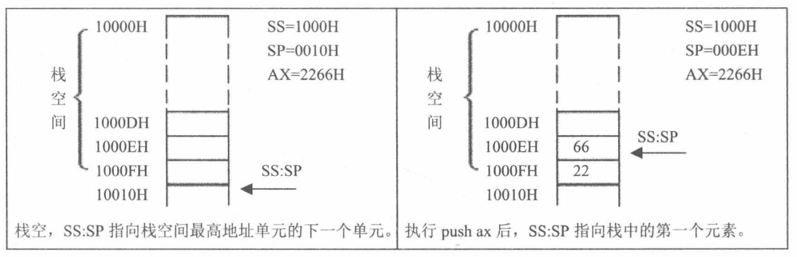

# 汇编语言

## 序章 前言

### 1.1 教学思想

​	学习线索应真正地遵循**循序渐进**的原则，盲目探索和不成系统的情况，最终学习到的也大都是相对零散的知识，并不能建立起一个系统的知识结构。

​	为了按循序渐进的原则构造学习线索，本书采用了一种全新的信息组织和加工艺术，我们称其为**知识屏蔽**。教学内容进行了最小化分割，力求使我们在学习过程中所接触到的每一个知识点都是当前唯一要去理解的东西。

### 1.2 本书的结构

​	本书由若干章构成，一章包含若干知识点，根据具体内容，还可能包含检测点、问题和分析、实验、附注等教学节点。书中的所有教学节点，除附注之外，都在一个全程的主线索之中。

​	由于本书具有很强的线索性，学习一定要按照教学的线索进行，有两点是必须要遵守的原则：①没有通过检测点不要向下学习；②没有完成当前的实验不要向下学习。下表详细说明了书中的各种教学节点和它们的组织情况。

<center style="color:#C0C0C0">表 教学节点详表</center>

| 教学节点 | 说明                                                         |
| -------- | ------------------------------------------------------------ |
| 知识点   | 学习者的主要知识来源。知识点以小节的形式出现，一个知识点为一个小节。每一个知识点都有一个相对独立的小主题。 |
| 附注     | 有些内容是对主要内容的拓展、加深和补充。这些内容如果放入正文中，会分散学习者对主体内容的注意力，同时也破坏了主体内容的系统性。我们把这些内容在附注中给出，供学习者选看。附注不在主线索之中，是主线索的引出内容。 |
| 检测点   | 检测点用来取得学习情况的反馈。只要通过了检测点，我们就得到了一个保证：已掌握了前面的内容。这是对学习成果的阶段性的肯定，有了这个肯定，可以信心十足地继续学习。如果没有通过检测点，需要回头再进行复习。有的检测点中也包含了一些具有教学功能的内容。 |
| 问题分析 | 引导学习者对知识进行深入的理解和灵活的应用。                 |
| 实验     | 在本书中，实验也是在学习线索中的。有的教学内容就包含在编程的依据材料中。每一实验个实验都是后续内容的基础，实验的任务必须**独立完成**。我们可以这样看待实验的重要性，如果你没有完成当前的实验，就应停止继续学习，直到你独立完成实验。 |

### 1.3 教学重心和内容特点

本书的教学重心是：通过**学习关键指令来深入理解机器工作的基本原理，培养底层编程意识和思想**。本着这个原则，本书的内容将和传统的教材有着很大的不同。

​	(1)不讲解每一条指令的功能

​	指令仅仅是学习机器基本原理和设计思想的一种实例。而逐条地讲解每一条指令的功能，不是本书的职责所在，它应该是一本指令手册的核心内容。

​	(2)编程的平台是硬件而不是操作系统

​	我们必须通过一定的编程实践，体验一个裸机的环境，在一个没有操作系统的环境中直接对硬件编程。这样的体会和经验非常重要，这样我们才能真正体会到汇编语言的作用，并且看到没有操作系统的计算机系统是怎样的。这为以后的操作系统的学习打下了一个重要的基础。

​	(3)着重讲解重要指令和关键概念

​	本书的所有内容都是围绕着“深入理解机器工作的基本原理”和“培养底层编程意识和思想”这两个核心目标来进行的。对所有和这两个目标关系并不密切的内容，都进行了舍弃。使学习者可以集中注意力真正理解和掌握那些具有普遍意义的指令和关键概念。

​	本书在深入到本质的层面上对重要指令和关键概念进行了讲解和讨论。这些指令和概念有：jmp、条件转移指令、call、ret、栈指令、int、iret、cmp、loop、分段、寻址方式等。 

### 1.4 读者定位

​	本书可用作大学计算机专业本科的汇编教材，和希望深入学习计算机科学的学习者的自学教材。本书的读者应具备以下基础：

​	①具有计算机的使用经验；

​	②具有二进制、十六进制等基础知识；

​	③具有一门高级语言（BASIC、Pascal、C...）的基本编程基础。

### 1.5 联系方法

​	《汇编语言-第四版》作者的 E-mail 地址为：fewstu@163.com。 

## 第 1 章 基础知识

​	汇编语言是直接在硬件之上工作的编程语言，我们首先要了解硬件系统的结构，才能有效地应用汇编语言对其编程。

​	在汇编课程中我们不对硬件系统进行全面和深入的研究，关于PC机及CPU物理结构和编程结构的全面研究，在《微机原理与接口》中进行；对于计算机一般的结构、功能、性能的研究在一门称为《组成原理》的理论层次更高的课程中进行。汇编课程的研究重点放在**如何利用硬件系统的编程结构和指令集有效灵活地控制系统进行工作**。

### 1.1 机器语言

​	机器语言是机器指令的集合。电子计算机的机器指令是一列**二进制数字**。计算机将之转变为一列高低电平，以使计算机的电子器件受到驱动，进行运算。

​	计算机的功能由一个芯片来完成，这个芯片就是我们常说的 **CPU(Central Processing Unit,中央处理单元)**，CPU 是一种微处理器。 以后我们提到的计算机是指由 CPU 和其他受 CPU 直接或间接控制的芯片、器件、设备组成的计算机系统，比如我们最常见的 PC 机。

​	每一种微处理器，由于硬件设计和内部结构的不同，就需要用不同的电平脉冲来控制，使它工作。所以每一种微处理器都有自己的**机器指令集**，也就是**机器语言**。

​	早期的机器语言是 0、1 编写成的代码在纸带上打孔，机器码具有**晦涩难懂和不易查错**的缺点。

### 1.2 汇编语言的产生

​	汇编语言的主体是**汇编指令**。汇编指令和机器指令的差别在于指令的表示方法上。汇编指令是机器指令便于记忆的书写格式。

​	例如：机器指令`1000100111011000`表示把寄存器`BX`的内容送到`AX`中。汇编指令则写成 `mov ax，bx`。这样的写法与人类语言接近，便于阅读和记忆。

（寄存器，简单地讲是 CPU 中可以存储数据的器件，一个 CPU 中有多个寄存器。AX 是其中一个寄存器的代号，BX 是另一个寄存器的代号。）

​	此后，程序员们就用汇编指令编写源程序。计算机能读懂的只有机器指令，就需要有一个能够将汇编指令转换成机器指令的翻译程序，这样的程序我们称其为**编译器**。程序员用汇编语言写出源程序，再用汇编编译器将其编译为机器码，由计算机最终执行，如下图。


### 1.3 汇编语言的组成

汇编语言发展至今，有以下 3 类指令组成。

​	①汇编指令：机器码的助记符，有对应的机器码。

​	②伪指令：没有对应的机器码，由编译器执行，计算机并不执行。

​	③其他符号：如`+、—、*、/`等，由编译器识别，没有对应的机器码。

汇编语言的核心是汇编指令，它决定了汇编语言的特性。

### 1.4 存储器

​	CPU 是计算机的核心部件，它控制整个计算机的运作并进行运算。要想让一个 CPU 工作，就必须向它提供指令和数据。指令和数据在**存储器**中存放，也就是我们平时所说的**内存**。在一台 PC 机中内存的作用仅次于 CPU，离开了内存，性能再好的 CPU 也无法工作。磁盘不同于内存，磁盘上的数据或程序如果不读到内存中，就无法被 CPU 使用。要灵活地利用汇编语言编程，我们首先要了解 CPU 是如何从内存中读取信息，以及向内存中写入信息的。

### 1.5 指令和数据

​	指令和数据是应用上的概念。**在内存或磁盘上，指令和数据没有任何区别，都是二进制信息**。CPU 在工作的时候把有的信息看作指令，有的信息看作数据，为同样的信息赋予了不同的意义。

​	例如，内存中的二进制信息`1000100111011000`，计算机可以把它看作大小为`89D8H`的数据来处理，也可以将其看作指令`mov ax，bx `来执行。

`1000100111011000—>89D8H（数据）`

`1000100111011000 -> mov ax,bx(程序) `

### 1.6 存储单元

​	存储器被划分成若干个存储单元，每个存储单元从 0 开始顺序编号，例如一个存储器有128个存储单元，编号从0～127，如图所示。这些编号可以看成存储单元在存储器中的地址

| 0    | 1    | 2    | 3    | 4    | ... ... | 124  | 125  | 126  | 127  |
| ---- | ---- | ---- | ---- | ---- | ------- | ---- | ---- | ---- | ---- |

​	那么一个存储单元能存储多少信息呢？电子计算机的最小信息单位是 bit（音译为比特），也就是一个二进制位。8 个 bit 组成一个 Byte，也就是通常讲的一个字节。微型机存储器的存储单元可以存储一个Byte，即 8 个二进制位。一个存储器有 128 个存储单元，它可以存储 128 个 Byte。

​	微机存储器的容量是以字节为最小单位来计算的。对于拥有 128 个存储单元的存储器，它的容量是128 个字节。

​	对于大容量的存储器一般还用以下单位来计量容量（以下用 B 来代表 Byte）：

​	1KB=1024B	1MB=1024KB	1GB=1024MB	1TB=1024GB

​	磁盘的容量单位同内存的一样，实际上以上单位是微机中常用的计量单位。

###  1.7 CPU对存储器的读写

​	CPU 要从内存中读数据，首先要指定存储单元的地址。也就是说它要先确定它要读取哪一个存储单元中的数据。

​	另外，在一台微机中，不只有存储器这一种器件。CPU 在读写数据时还要指明，它要对哪一个器件进行操作，进行哪种操作，是从中读出数据，还是向里面写入数据。

​	可见，CPU 要想进行数据的读写，必须和外部器件（标准的说法是芯片）进行下面 3 类信息的交互。

* 存储单元的地址（地址信息）；

* 器件的选择，读或写的命令（控制信息）；
* 读或写的数据（数据信息）。

​	在计算机中专门有连接 CPU 和其他芯片的导线，通常称为**总线**。总线从物理上来讲，就是一根根导线的集合。根据传送信息的不同，总线从逻辑上又分为 3 类，**地址总线**、**控制总线**和**数据总线**。


<center style="color:#C0C0C0">图1.3 CPU从内存中3号单元读取数据的过程</center>

​	①CPU通过地址线将地址信息 3 发出。

​	②CPU通过控制线发出内存读命令，选中存储器芯片，并通知它，将要从中读取数据。

​	③存储器将3号单元中的数据 8 通过数据线送入 CPU。

写操作与读操作的步骤相似。如向 3 号单元写入数据 26。

​	①CPU通过地址线将地址信息 3 发出。

​	②CPU通过控制线发出内存写命令，选中存储器芯片，并通知它，要向其中写入数据。

​	③CPU通过数据线将数据 26 送入内存的 3 号单元中。

从上面我们知道了 CPU 是如何进行数据读写的。可是，如何命令计算机进行数据的读写呢？

​	要让一个计算机或微处理器工作，应向它输入能够驱动它进行工作的电平信息（机器码）。对于8086CPU，下面的机器码，能够完成从3号单元读数据。

​	机器码：`101000010000001100000000 `

​	对应的汇编指令：`MOV AX,[3]`

​	含义：从 3 号单元读取数据送入寄存器AX

CPU 接收这条机器码后将完成我们上面所述的读写工作。

### 1.8 地址总线

​	CPU 是通过地址总线来指定存储器单元的。可见地址总线上能传送多少个不同的信息，CPU 就可以对多少个存储单元进行寻址。

​	现假设，一个 CPU 有 10 根地址总线，让我们来看一下它的寻址情况。我们知道，在电子计算机中，一根导线可以传送的稳定状态只有两种，高电平或是低电平。用二进制表示就是 1 或 0，10 根导线可以传送 10 位二进制数据。而 10 位二进制数可以表示多最小数为 0，最大数为$2^{10} $ = 1023。

​	下图展示了一个具有 10 根地址线的 CPU 向内存发出地址信息 11 时 10 根地址线上传送的二进制信息。考虑一下，访问地址为 12、13、14 等的内存单元时，地址总线上传送的内容是 **0011000000、1011000000、0111000000**。


<center style="color:#C0C0C0">图1.8 地址线上传送的二进制信息</center>

​	一个 CPU 有 N 根地址线，则可以说这个 CPU 的地址**总线的宽度为 N**。这样的 CPU 最多可以寻找 2 的 N 次方个内存单元。

### 1.9 数据总线

​	CPU 与内存或其他器件之间的数据传送是通过**数据总线**来进行的。数据总线的宽度决定了 CPU 和外界的数据传送速度。8 根数据总线一次可传送一个 8 位二进制数据（即一个字节）。16 根数据总线一次可传送两个字节。

​	8088CPU 的数据总线宽度为 8，8086CPU 的数据总线宽度为 16。我们来分别看一下它们向内存中写入数据 89D8H 时，是如何通过数据总线传送数据的。图 1.9.1 展示了 8088CPU 数据总线上的数据传送情况；图 1.9.2 展示了 8086CPU 数据总线上的数据传送情况。


<center style="color:#C0C0C0">图1.9.1 8088CPU 8位数据总线上的数据传送情况</center>


<center style="color:#C0C0C0">图1.9.2 8086CPU 16位数据总线上的数据传送情况</center>

​	8086 有 16 根数据线，可一次传送 16 位数据，所以可一次传送数据 89D8H；而 8088 只有 8 根数据线，一次只能传 8 位数据，所以向内存写入数据 89D8H 时需要进行两次数据传送。

### 1.10 控制总线

​	CPU 对外部器件的控制是通过**控制总线**来进行的。在这里控制总线是个总称，控制总线是一些不同控制线的集合。有多少根控制总线，就意味着 CPU 提供了对外部器件的多少种控制。所以，控制总线的宽度决定了 CPU 对外部器件的控制能力。

​	前面所讲的内存读或写命令是由几根控制线综合发出的，其中有一根称为“**读信号输出**”的控制线负责由 CPU 向外传送读信号，CPU 向该控制线上输出低电平表示将要读取数据；有一根称为“**写信号输出**”的控制线则负责传送写信号。

### 1.a 检测点与小结

#### 小结

> (1)汇编指令是机器指令的助记符，同机器指令一一对应。 
>
> (2)每一种 CPU 都有自己的汇编指令集。
>
> (3)CPU 可以直接使用的信息在存储器中存放。
>
> (4)在存储器中指令和数据没有任何区别，都是二进制信息。 
>
> (5)存储单元从零开始顺序编号。
>
> (6)一个存储单元可以存储 8 个 bit，即 8 位二进制数。
>
> (7)1Byte = 8bit	1KB = 1024B	1MB = 1024KB	1GB = 1024MB。
>
> (8)每一个 CPU 芯片都有许多**管脚**，这些管脚和总线相连。也可以说，这些管脚引出总线。一个 CPU 可以引出 3 种总线的宽度标志了这个 CPU 的不同方面的性能：
>
> ​	地址总线的宽度决定了 CPU 的寻址能力；
>
> ​	数据总线的宽度决定了 CPU 与其他器件进行数据传送时的一次数据传送量：
>
> ​	控制总线的宽度决定了 CPU 对系统中其他器件的控制能力。
>
> 在汇编课程中，我们从功能的角度介绍了 3 类总线，对实际的连接情况不做讨论。 

#### 检测点

(1) 1 个 CPU 的寻址能力为 8KB，那么它的地址总线的宽度为`13`。

(2) 1KB 的存储器有`1024`个存储单元。存储单元的编号从`0`到`1023`

(3) 1KB 的存储器可以存储`8192`个 bit,`1024`个 Byte。

(4) 1GB、1MB、1KB 分别是`2^30、2^20、2^10`Byte.

(5) 8080、8088、80286、80386 的地址总线宽度分别为 16 根、20 根、24 根、32 根，则它们的寻址能力分别为：

`64`(KB)、`1`(MB)、`16`(MB)、`4`(GB)。

(6) 8080、8088、8086、80286、80386 的数据总线宽度分别为 8 根、8 根、16 根、16 根、32 根。则它们一次可以传送的数据为：`1`（B）、`1`（B）、`2`（B）、`2`（B）、`4`（B）。

(7) 从内存中读取 1024 字节的数据，8086 至少要读`512`次，80386 至少要读`256`次。

(8) 在存储器中，数据和程序以`二进制`形式存放。 

### 1.11 内存地址空间（概述）

​	内存地址空间，举例来讲，一个 CPU 的地址总线宽度为 10，那么可以寻址 1024 个内存单元，这 **1024 个可寻到的内存单元**就构成这个 CPU 的**内存地址空间**。

### 1.12 主板

​	在每一台 PC 机中，都有一个主板，主板上有核心器件和一些主要器件，这些器件通过总线（地址总线、数据总线、控制总线）相连。这些器件有 CPU、存储器、外围芯片组、扩展插槽等。扩展插槽上一般插有 RAM 内存条和各类接口卡。

### 1.13 接口卡

​	计算机系统中，所有可用程序控制其工作的设备，必须受到 CPU 的控制。CPU 对外部设备都不能直接控制，如显示器、音箱、打印机等。直接控制这些设备进行工作的是插在扩展插槽上的接口卡。扩展插槽通过总线和 CPU 相连，所以接口卡也通过总线同 CPU 相连。CPU 可以**直接控制这些接口卡**，从而实现 CPU **对外设的间接控制**。简单地讲，就是CPU 通过总线向接口卡发送命令，接口卡根据 CPU 的命令控制外设进行工作。

### 1.14 各类存储器芯片

​	一台PC机中，装有多个存储器芯片，这些存储器芯片从物理连接上看是独立的、不同的器件。从读写属性上看分为两类：**随机存储器（RAM）**和**只读存储器（ROM）**。随机存储器**可读可写**，但必须**带电存储**，关机后存储的内容丢失；只读存储器**只能读取不能写入**，**关机后其中的内容不丢失**。这些存储器从功能和连接上又可分为以下几类。

* **随机存储器**

​	用于存放供CPU使用的绝大部分程序和数据，主随机存储器一般由两个位置上的RAM组成，装在主板上的RAM和插在扩展插槽上的RAM。

* **装有BIOS(Basic Input/Output System,基本输入/输出系统)的ROM**

​	BIOS是由主板和各类接口卡（如显卡、网卡等）厂商提供的软件系统，可以通过它利用该硬件设备进行最基本的输入输出。在主板和某些接口卡上插有存储相应 BIOS 的 ROM。例如，主板上的 ROM 中存储着主板的 BIOS（通常称为系统 BIOS）；显卡上的 ROM 中存储着显卡的 BIOS；如果网卡上装有 ROM，那其中就可以存储网卡的 BIOS。

* **接口卡上的RAM**

​	某些接口卡需要对大批量输入、输出数据进行暂时存储，在其上装有 RAM。最典型的是显示卡上的 RAM，一般称为显存。显示卡随时将显存中的数据向显示器上输出。换句话说，我们将需要显示的内容写入显存，就会出现在显示器上。


<center style="color:#C0C0C0">图1.14 PC系统中各类存储器的逻辑连接情况。</center>

### 1.15 内存地址空间

上述的那些存储器，在物理上是独立的器件，但是在以下两点上相同。

* 都和 CPU 的总线相连。

* CPU 对它们进行读或写的时候都通过控制线发出内存读写命令。

​	这也就是说，CPU 在操控它们的时候，把它们都当作内存来对待，把它们总的看作一个由若干存储单元组成的逻辑存储器，这个逻辑存储器就是我们所说的**内存地址空间**。在汇编这门课中，我们所面对的是内存地址空间。


<center style="color:#C0C0C0">图1.15 CPU将系统中各类存储器看作一个逻辑存储器</center>

​	在上图中，所有的物理存储器被看作一个由若干存储单元组成的逻辑存储器，每个物理存储器在这个逻辑存储器中占有一个地址段，即**一段地址空间**。CPU 在这段地址空间中读写数据，实际上就是在相对应的物理存储器中读写数据。

假设，图 1.8 中的内存地址空间的地址段分配如下。

​	地址 0～7FFFH 的 32KB 空间为主随机存储器的地址空间；

​	地址 8000H～9FFFH 的 8KB 空间为显存地址空间；

​	地址 A000H～FFFFH 的 24KB 空间为各个 ROM 的地址空间。

这样，CPU 向内存地址为 1000H 的内存单元中写入数据，这个数据就被写入主随机存储器中；CPU 向内存地址为 8000H 的内存单元中写入数据，这个数据就被写入显存中，然后会被显卡输出到显示器上；CPU 向内存地址为 C000H 的内存单元中写入数据的操作是没有结果的，C000H 单元中的内容不会被改变，C000H 单元实际上就是 ROM 存储器中的一个单元。

​	内存地址空间的大小受 CPU 地址总线宽度的限制。8086CPU 的地址总线宽度为 20，可以传送 $2^{20}$ 个不同的地址信息（大小从 0 至 $2^{20}-1$）。即可以定位 $2^{20}$ 个内存单元，则 8086PC 的内存地址空间大小为 1MB。同理，80386CPU 的地址总线宽度为 32，则内存地址空间最大为 4GB。

​	我们在基于一个计算机硬件系统编程的时候，必须知道这个系统中的**内存地址空间分配情况**。因为当我们想在某类存储器中读写数据的时候，必须知道它的第一个单元的地址和最后一个单元的地址，才能保证读写操作是在预期的存储器中进行。比如，我们希望向显示器输出一段信息，那么必须将这段信息写到显存中，显卡才能将它输出到显示器上。要向显存中写入数据，必须知道显存在内存地址空间中的地址。

​	不同的计算机系统的内存地址空间的分配情况是不同的，图 1.15.1 展示了 8086PC 机内存地址空间分配的基本情况。


<center style="color:#C0C0C0">图1.15.1 8086PC机内存地址空间分配</center>

​	上图告诉我们，从地址 0～9FFFF 的内存单元中读取数据，实际上就是在读取主随机存储器中的数据；向地址 A0000～BFFFF 的内存单元中写数据，就是向显存中写入数据，这些数据会被显示卡输出到显示器上；我们向地址 C0000～FFFFF 的内存单元中写入数据的操作是无效的，因为这等于改写只读存储器中的内容。

#### 内存地址空间

​	最终运行程序的是 CPU，我们用汇编语言编程的时候，必须要从 CPU 的角度考虑问题。对 CPU 来讲，系统中的所有存储器中的存储单元都处于一个统一的逻辑存储器中，它的容量受 CPU 寻址能力的限制。这个逻辑存储器即是我们所说的**内存地址空间**。

​	对于初学者，这个概念比较抽象，后续的课程中将通过一些编程实践，来增加感性认识。

## 第 2 章 寄存器

​	一个典型的 CPU 由运算器、控制器、寄存器等器件构成，这些器件靠内部总线相连。前一章所说的总线，相对于 CPU 内部来说是**外部总线**。**内部总线**实现 **CPU 内部各个器件之间的联系**，外部总线实现 CPU 和主板上其他器件的联系。简单地说，在 CPU 中：

* 运算器进行信息处理
* 寄存器进行信息存储

* 控制器控制各种器件进行工作

* 内部总线连接各种器件，在它们之间进行数据的传送

对于一个汇编程序员来说，CPU 中的主要部件是寄存器。寄存器是 CPU 中程序员可以用指令读写的部件。程序员通过改变各种寄存器中的内容来实现对 CPU 的控制。

​	不同的 CPU，寄存器的个数、结构是不相同的。8086CPU 有 14 个寄存器，每个寄存器有一个名称。这些寄存器是：AX、BX、CX、DX、SI、DI、SP、BP、IP、CS、SS、DS、ES、PSW。

### 2.1 通用寄存器

​	8086CPU 的所有寄存器都是 16 位的，可以存放两个字节。AX、BX、CX、DX 这 4 个寄存器通常用来存放一般性的数据，被称为**通用寄存器**。

​	以 AX 为例，寄存器的逻辑结构如下图所示：


<center style="color:#C0C0C0">图2.1 16位寄存器的逻辑结构</center>

​	一个 16 位寄存器可以存储一个 16 位的数据，数据在寄存器中的存放情况如图 2.1.1 所示。一个 16 位寄存器所能存储的数据的最大值为 $2^{16}-1$。


<center style="color:#C0C0C0">图2.1.1 16位数据在寄存器中的存放情况</center>

​	8086CPU 的上一代 CPU 中的寄存器都是 8 位的，为了保证兼容，使原来基于上代 CPU 编写的程序稍加修改就可以运行在 8086 之上，8086CPU 的 AX、BX、CX、DX 这 4 个寄存器都**可分为两个可独立使用的 8 位寄存器**来用，AX 的高 8 位字节部分记为 AH，低 8 位字节部分记为 AL，其他三个寄存器类似。

​	以 AX 为例，8086CPU 的 16 位寄存器分为两个 8 位寄存器的情况如图 2.1.2 所示。


<center style="color:#C0C0C0">图2.1.2 16位寄存器分为两个8位寄存器</center>

​	AX 的低 8 位（0位～7位）构成了 AL 寄存器，高（8位～15位）构成了 AH 寄存器。AH 和 AL 寄存器是可以独立使用的 8 位寄存器。下图 2.1.3 展示了 16 位寄存器及它所分成的两个 8 位寄存器的数据存储的情况，一个 8 位寄存器所能存储的数据的最大值为 $2^8-1$。


<center style="color:#C0C0C0">图2.1.3 16位寄存器及所分成的两个8位寄存器的数据存储情况</center>

### 2.2 字在寄存器中的存储

出于对兼容性的考虑，8086CPU 可以一次性处理以下两种尺寸的数据。

* 字节：记为 byte，一个字节由 8 个 bit 组成，可以存在 8 位寄存器中。

* 字：记为 word，**一个字由两个字节组成**，这两个字节分别称为这个字的**高位字节**和**低位字节**，如图所示。

$$
字:\underset{高位字节}{\underbrace{01001110}}\underset{低位字节}{\underbrace{00100000}}
$$

​	一个字可以存在一个 16 位寄存器中，这个字的高位字节和低位字节自然就存在这个寄存器的高 8 位寄存器和低 8 位寄存器中。如图 2.1.3 所示，一个字型数据 20000，存在 AX 寄存器中，在 AH 中存储了它的高 8 位，在 AL 中存储了它的低 8 位。AH 和 AL 中的数据，既可以看成是一个字型数据的高 8 位和低 8 位，这个字型数据的大小是 20000，又可以看成是两个独立的字节型数据，它们的大小分别是 78 和 32。

#### 关于数制的讨论

> ​	任何数据，到了计算机中都是以二进制的形式存放的。为了描述不同的问题，又经常将它们用其他的进制来表示。比如图 2.1.3 中寄存器 AX 中的数据是 0100111000100000，这就是 AX 中的信息本身，可以用不同的逻辑意义来看待它。可以将它看作一个数值，大小是 20000。
>
> ​	当然，二进制数0100111000100000本身也可表示一个数值的大小，但人类习惯的是十进制，用十进制20000表示可以使我们直观地感受到这个数值的大小。
>
> ​	十六进制数的一位相当于二进制数的四位，如0100111000100000可表示成：4（0100）、E（1110）、2（0010）、0（0000）四位十六进制数。
>
> ​	一个内存单元可存放 8 位数据，CPU 中的寄存器又可存放 n 个 8 位的数据。也就是说，计算机中的数据大多是由 1～N 个 8 位数据构成的。很多时候，需要直观地看出组成数据的各个字节数据的值，用十六进制来表示数据可以直观地看出这个数据是由哪些 8 位数据构成的。比如 20000 写成 4E20 就可以直观地看出，这个数据是由 4E 和 20 两个 8 位数据构成的，如果 AX 中存放 4E20，则 AH 里是 4E，AL 里是 20。这种表示方法便于许多问题的直观分析。在以后的课程中，我们多用十六进制来表示一个数据。
>
> ​	在以后的课程中，为了区分不同的进制，在十六进制表示的数据的后面加 H，在二进制表示的数据后面加 B，十进制表示的数据后面什么也不加。如：可用3种不同的进制表示图2.1.3中 AX 里的数据，十进制：20000，十六进制：4E20H，二进制：0100111000100000B。

### 2.3 几条汇编指令

通过汇编指令控制 CPU 进行工作，看一下表 2.1 中的几条指令。

<center style="color:#C0C0C0">表2.3.1 汇编指令举例</center>

| 汇编指令  | 控制CPU完成的操作                        | 用C语言的语法描述 |
| --------- | ---------------------------------------- | ----------------- |
| mov ax,18 | 将 18 送入寄存器 AX                      | AX = 18           |
| mov ah,78 | 将 78 送入寄存器 AH                      | AH = 78           |
| add ax,8  | 将寄存器 AX 中的数值加上 8               | AX = AX + 8       |
| mov ax,bx | 将寄存器 BX 中的数据送入寄存器 AX        | AX = BX           |
| add ax,bx | 将 AX 和 BX 中的数值相加，结果存在 AX 中 | AX = AX + BX      |

​	注意，为了使具有高级语言基础的读者更好地理解指令的含义，有时会用文字描述和高级语言描述这两种方式来描述一条汇编指令的含义。在**写一条汇编指令或一个寄存器的名称时不区分大小写**。

​	接下来看一下 CPU 执行表 2.3.2 中所列的程序段中的每条指令后，对寄存器中的数据进行的改变。

<center style="color:#C0C0C0">表2.3.2 程序段中指令的执行情况之一(原AX中的值：0000H，原BX中的值：0000H)</center>

| 程序段中的指令 | 指令执行后AX中的数据 | 指令执行后BX中的数据 |
| -------------- | -------------------- | -------------------- |
| mov ax,4E20H   | 4E20H                | 0000H                |
| add ax,1406H   | 6226H                | 0000H                |
| mov bx,2000H   | 6226H                | 2000H                |
| add ax,bx      | 8226H                | 2000H                |
| mov bx,ax      | 8226H                | 8226H                |
| add ax,bx      | `/*Answer*/`         | 8226H                |

#### 问题 2.1

上表`add ax,bx`指令执行后 AX 中的数据为多少？

分析：

​	程序段中的最后一条指令 add ax,bx，在执行前 ax 和 bx 中的数据都为 8226H，相加后所得的值为：1044CH，但是 ax 为 16 位寄存器，只能存放 4 位十六进制的数据，所以最高位的 1 不能在 ax 中保存，ax 中的数据为：044CH

#### 问题 2.2

指令执行后 AX 中的数据为多少？

| 程序段中的指令 | 指令执行后AX中的数据 | 指令执行后BX中的数据 |
| -------------- | -------------------- | -------------------- |
| mov ax,001AH   | 001AH                | 0000H                |
| mov bx,0026H   | 001AH                | 0026H                |
| add al,bl      | 0040H                | 0026H                |
| add ah,bl      | 2640H                | 0026H                |
| add bh,al      | 2640H                | 4026H                |
| mov ah,0       | 0040H                | 4026H                |
| add al,85H     | 00C5H                | 4026H                |
| add al,93H     | `/*Answer*/`         | 4026H                |

分析：

​	程序段中的最后一条指令 `add al，93H`，在执行前，al 中的数据为 C5H，相加后所得的值为：158H，但是 al 为 8 位寄存器，只能存放两位十六进制的数据，所以最高位的 1 丢失， ax中的数据为：0058H。 （这里的丢失，指的是进位值不能在 8 位寄存器中保存，但是CPU并不真的丢弃这个进位值，关于这个问题，我们将在后面的课程中讨论。）

​	注意，**此时 al 是作为一个独立的 8 位寄存器来使用的**，和 ah 没有关系，CPU 在执行这条指令时认为 ah 和 al 是两个不相关的寄存器。不要错误地认为，诸如 add al，93H 的指令产生的进位会存储在 ah 中，add al,93H 进行的是 8 位运算。

​	如果执行 add ax,93H，低 8 位的进位会存储在 ah 中，CPU 在执行这条指令时认为只有一个 16 位寄存器ax，进行的是16位运算。指令add ax,93H执行后，ax中的值为：0158H。此时，使用的寄存器是 16 位寄存器ax，add ax,93H相当于将ax中的 16 位数据 00C5H 和另一个 16 位数据 0093H 相加，结果是 16 位的 0158 H。

​	在进行数据传送或运算时，要注意指令的两个操作对象的**位数应当是一致**的，例如：

```assembly
mov ax, bx
mov bx, cx 
mov ax, 18H
mov al, 18H
add ax, bx
add ax, 20000
```

等都是正确的指令，而：

```assembly
mov ax, bl   	/*在8位寄存器和16位寄存器之间传送数据*/
mov bh, ax		/*在16位寄存器和8位寄存器之间传送数据*/
mov al, 20000	/*8位寄存器最大可存放值为255的数据*/
add al, 100H		/*将一个高于8位的数据加到一个8位寄存器中*/
```

等都是错误的指令，错误的原因都是指令的两个操作对象的位数不一致。

### 2.a 检测点 

(1)写出每条汇编指令执行后相关寄存器中的值。 

| 汇编指令       | 寄存器中的值  |
| -------------- | ------------- |
| mov  ax, 62627 | AX = `F4A3H`  |
| mov ah, 31H    | AX =`31A3H` ★ |
| mov  al, 23H   | AX =`3123H`   |
| add  ax, ax    | AX =`6246H`   |
| mov  bx, 826CH | BX =`826CH`   |
| mov  cx, ax    | CX =`6246H`   |
| mov  ax, bx    | AX =`826CH`   |
| add  ax, bx    | AX =`04D8H`   |
| mov al,bh      | AX =`0482H`★  |
| mov ah,bl      | AX =`6C82H`★  |
| add ah,ah      | AX =`D882H`★  |
| add  al, 6     | AX =`D888H`   |
| add  al,al     | AX =`D810H`   |
| mov  ax,cx     | AX =`6246H`   |

(2)只能使用目前学过的汇编指令，最多使用4条指令，编程计算2的4次方。

```assembly
mov ax, 2
add ax, ax
add ax, ax
add ax, ax
```

### 2.4 物理地址

​	我们知道，CPU 访问内存单元时，要给出内存单元的地址。所有的内存单元构成的存储空间是一个一维的线性空间，每一个内存单元在这个空间中都有唯一的地址，我们将这个唯一的地址称为**物理地址**。

​	CPU 通过地址总线送入存储器的，必须是一个内存单元的物理地址。在 CPU 向地址总线上发出物理地址之前，必须要在内部先形成这个物理地址。不同的 CPU 可以有不同的形成物理地址的方式。我们现在讨论 8086CPU 是如何在内部形成内存单元的物理地址的。

### 2.5 16位结构的CPU

​	我们说 8086CPU 的上一代 CPU(8080、8085)等是 8 位机，而 8086 是 16 位机，也可以说 8086 是 16 位结构的CPU。

​	16 位结构的 CPU 概括地讲，16 位结构（**16位机、字长为 16 位等常见说法，与 16 位结构的含义相同**）描述了一个CPU具有下面几方面的结构特性。

* 运算器一次最多可以处理 16 位的数据
* 寄存器的最大宽度为 16 位
* 寄存器和运算器之间的通路为 16 位

​	8086 是 16 位结构的 CPU，这也就是说，在 8086 内部，能够**一次性处理、传输、暂时存储的信息的最大长度是 16 位**的。内存单元的地址在送上地址总线之前，必须在 CPU 中处理、传输、暂时存放，对于 16 位 CPU，能一次性处理、传输、暂时存储 16 位的地址。

### 2.6 8086CPU给出物理地址的方法

​	8086CPU 有 20 位地址总线，可以传送 20 位地址，达到 1MB 寻址能力。8086CPU 又是 16 位结构，在内部一次性处理、传输、暂时存储的地址为 16 位。从 8086CPU 的内部结构来看，如果将地址从内部简单地发出，那么它只能送出 16 位的地址，表现出的寻址能力只有 64KB。

​	8086CPU 采用一种在内部用两个 16 位地址合成的方法来形成一个 20 位的物理地址。


 <center style="color:#C0C0C0">图2.6 8086CPU相关部件的逻辑结构</center>

​	8086CPU 相关部件的逻辑结构如图 2.6 所示，当 8086CPU 要读写内存时：

​	①CPU 中的相关部件提供两个 16 位的地址，一个称为**段地址**，另一个称为**偏移地址**

​	②段地址和偏移地址通过内部总线送入一个称为**地址加法器**的部件；

​	③地址加法器**将两个 16 位地址合成为一个 20 位的物理地址**；

​	④地址加法器通过内部总线将 20 位物理地址送入**输入输出控制电路**；

​	⑤输入输出控制电路将 20 位物理地址送上**地址总线**

​	⑥20 位物理地址被地址总线传送到**存储器**。

​	地址加法器采用**物理地址 = 段地址×16 + 偏移地址**的方法用段地址和偏移地址合成物理地址。例如，8086CPU 要访问地址为 123C8H 的内存单元，此时，地址加法器的工作过程如图 2.6.1 所示（图中数据皆为十六进制表示）。

 


 <center style="color:#C0C0C0">图2.6.1 地址加法器的工作过程</center>

#### 由“段地址×16”引发的讨论

​	“段地址×16”有一个更为常用的说法是**左移 4 位**。计算机中的所有信息都是以二进制的形式存的，段地址当然也不例外。机器只能处理二进制信息，“左移 4 位”中的位，指的是二进制位。

​	下面是个例子，一个数据为 2H，二进制形式为 10B，对其进行左移运算：

| 左移位数 | 二进制  | 十六进制 | 十进制 |
| -------- | ------- | -------- | ------ |
| 0        | 10B     | 2H       | 2      |
| 1        | 100B    | 4H       | 4      |
| 2        | 1000B   | 8H       | 8      |
| 3        | 10000B  | 10H      | 16     |
| 4        | 100000B | 20H      | 32     |

 观察上面移位次数和各种形式数据的关系，我们可以发现：

1. 一个数据的二进制形式左移 1 位，相当于该数据乘以 2；

2. 一个数据的二进制形式左移 N 位，相当于该数据乘以 2 的 N 次方：

3. 地址加法器如何完成段地址×16 的运算？就是将以二进制形式存放的段地址左移4位。

​	进一步思考，我们可看出：一个数据的十六进制形式左移 1 位，相当于乘以 16；一个数据的十进制形式左移 1 位，相当于乘以 10；一个 X 进制的数据左移 1 位，相当于乘以 X。

### 2.7 “段地址×16 + 偏移地址 = 物理地址”的本质含义

​	“段地址×16+偏移地址=物理地址”的本质含义是：**CPU 在访问内存时，用一个基础地址（段地址×16）和一个相对于基础地址的偏移地址相加，给出内存单元的物理地址。**

​	更一般地说，8086CPU 的这种寻址功能是“**基础地址 + 偏移地址 = 物理地址**”寻址模式的一种**具体实现方案**。8086CPU 中，段地址×16 可看作是基础地址。

​	实际上有两种方法可以把地址告诉你

1. 直接说明地址

2. 给出基础地址和偏移地址

​	8086CPU 是 16 位结构，没法一次性给出 20 位地址，所以给出**基础地址 + 偏移地址**，根据事先约定就可以获得最终地址了。

### 2.8 段的概念

​	我们注意到，“段地址”这个名称中包含着“段”的概念。这种说法可能对一些学习者产生了误导，使人误以为内存被划分成了一个一个的段，每一个段有一个段地址。如果我们在一开始形成了这种认识，将影响以后对汇编语言的深入理解和灵活应用。

​	其实，**内存并没有分段，段的划分来自于 CPU**，由于 8086CPU 用“**基础地址（段地址×16）+偏移地址=物理地址**”的方式给出内存单元的物理地址，使得我们可以**用分段的方式来管理内存**。如图 2.8 所示，我们可以认为：地址 10000H～100FFH 的内存单元组成一个段，该段的起始地址（基础地址）为 10000H，段地址为 1000H，大小为 100H；我们也可以认为地址 10000H～1007FH、10080H～100FFH 的内存单元组成两个段，它们的起始地址（基础地址）为：10000H和10080H，段地址为：1000H和1008H，大小都为 80H。


 <center style="color:#C0C0C0">图2.8 分段</center>

​	以后，在编程时可以根据需要，**将若干地址连续的内存单元看作一个段**，用段地址 ×16 定位段的起始地址（基础地址），用偏移地址定位段中的内存单元。有两点需要注意：段地址 ×16 必然是 16 的倍数，所以一个段的起始地址也一定是 16 的倍数；偏移地址为 16 位，16 位地址的寻址能力为 64 KB，所以**一个段的长度最大为 64 KB**。

#### 内存单元地址小结

> CPU 访问内存单元时，必须向内存提供内存单元的物理地址。8086CPU 在内部用段地址和偏移地址 移位相加的方法形成最终的物理地址。
>
> 思考下面的两个问题。
>
> (1)观察下面的地址，你有什么发现？ 
>
> | 物理地址 | 段地址 | 偏移地址 |
> | -------- | ------ | -------- |
> | 21F60H   | 2000H  | 1F60H    |
> |          | 2100H  | 0F60H    |
> |          | 21F0H  | 0060H    |
> |          | 21F6H  | 0000H    |
> |          | 1F00H  | 2F60H    |
>
> 结论★：**CPU 可用不同的段地址和偏移地址形成同一个物理地址**
>
> ​	比如 CPU 要访问 21F60H 单元，则它给出的段地址 SA 和偏移地址 EA 满足 SA×16+EA=21F60H 即可。
>
> (2)如果给定一个段地址，仅通过变化偏移地址来进行寻址，最多可定位多少个内存单元？
>
> 结论：偏移地址 16 位，变化范围为 0～FFFFH，仅用偏移地址来寻址最多可寻 64KB 个内存单元。
>
> 比如给定段地址 1000H，用偏移地址寻址，CPU 的寻址范围为：10000H～1FFFFH。
>
> 在 8086PC 机中，存储单元的地址用两个元素来描述，即**段地址和偏移地址。**
>
> “数据在21F60H内存单元中。”这句话对于 8086PC 机一般不这样讲，取而代之的是两种类似的说法：
>
> ​	①数据存在内存 2000:1F60 单元中
>
> ​	②数据存在内存的 2000H 段中的 1F60H 单元中。
>
> **可以根据需要，将地址连续、起始地址为 16 的倍数的一组内存单元定义为一个段。**

###  2.b 检测点

（1）给定段地址为 0001H，仅通过变化偏移地址寻址，CPU 的寻址范围为`00010H`到`1000FH`

解析：偏移地址变化范围为 0～FFFFH，寻址范围为段地址×16 + 偏移地址

（2）有一数据存放在内存 20000H 单元中，现给定段地址为 SA，若想用偏移地址寻到此单元。则 SA 应满足的条件是：最小为`1001H`，最大为`2000H`。

（提示，反过来思考一下，当段地址给定为多少，CPU 无论怎么变化偏移地址都无法寻到 20000H 单元？）

解析：段地址的最大值，可以用物理地址减去偏移地址的最小值；同理，段地址的最小值，可以用物理地址减去偏移地址的最大值。

20000H - 0H / 16 = 2000H

20000H - FFFFH = 10001H不能被 16 整除，取10010H / 16 = 1001H

当 SA<=1000H 或 SA>2000H 时，CPU 无论怎么变化偏移地址都无法寻到 20000H 单元。

### 2.9 段寄存器

​	我们前面讲到，8086CPU 在访问内存时要由相关部件提供内存单元的段地址和偏移地址，送入地址加法器合成物理地址。这里，需要看一下，是什么部件提供段地址。段地址在 8086CPU 的**段寄存器**中存放。8086CPU 有 4 个段寄存器：CS(Code Segment)、DS(Data Segment)、SS(Stack Segment)、ES(Extra Segment)。当 8086CPU 要访问内存时由这 4 个段寄存器提供内存单元的段地址。本章中只看一下 CS。

### 2.10 CS和IP

​	CS 和 IP 是 8086CPU 中两个最关键的寄存器，它们指示了 CPU 当前要读取指令的地址。**CS 为代码段寄存器(Code Segment Register)**，**IP 为指令指针寄存器(Instruction Pointer Register)**，从名称上我们可以看出它们和指令的关系。

在 8086PC 机中，任意时刻，设 CS 中的内容为 M，IP中的内容为 N，8086CPU 将从内存 M×16+N 单元开始，读取一条指令并执行。

​	也可以这样表述：8086 机中，任意时刻，**CPU 将 CS:IP 指向的内容当作指令执行**。

​	图 2.10 展示了 8086CPU 读取、执行指令的工作原理（图中只包括了和所要说明的问题密切相关的部件，图中数字都为十六进制）。


<center style="color:#C0C0C0">图2.10 8086PC读取和执行指令的相关部件</center>

图 2.10 说明如下。

​	①8086CPU当前状态：CS 中的内容为 2000H，IP 中的内容为 0000H

​	②内存 20000H～20009H 单元存放着可执行的机器码；

​	③内存 20000H～20009H 单元中存放的机器码对应的汇编指令如下。

​	地址：20000H—20002H， 内容：B8 23 01，长度：3Byte，对应汇编指令：mov ax,0123H

​	地址：20003H—20005H， 内容：BB 03 00， 长度：3Byte，对应汇编指令：mov bx,0003H

​	地址：20006H—20007H，内容：89 D8，长度：2Byte，对应汇编指令：mov ax,bx

​	地址：20008H—20009H，内容：01 D8，长度：2Byte，对应汇编指令：add ax,bx

下面的一组图（图1～图9），以图 2.10 描述的情况为初始状态，展示了 8086CPU 读取、执行一条指令的过程。注意每幅图中发生的变化（下面对 8086CPU 的描述，是在逻辑结构、宏观过程的层面上进行的，目的是使读者对 CPU 工作原理有一个清晰、直观的认识，为汇编语言的学习打下基础。其中隐蔽了 CPU 的物理结构以及具体的工作细节）。


（读取一条指令后，**IP中的值自动增加，以使 CPU 可以读取下一条指令**。因当前读入的指令 B82301 长度为3个字节，所以IP中的值加3。此时，CS:IP指向内存单元 2000:0003。）


下面的一组图（图10～图16），以图9的情况为初始状态，展示了 8086CPU 继续读取、执行3条指令的过程。注意 IP 的变化（下面的描述中，隐蔽了读取每条指令的细节）。


通过上面的过程展示，8086CPU 的工作过程可以简要描述如下：

1. 从CS:IP指向的内存单元读取指令，读取的指令进入指令缓冲器；

2. IP=IP+所读取指令的长度，从而指向下一条指令；

3. 执行指令。转到步骤（1），重复这个过程。

​	在 8086CPU 加电启动或复位后（即CPU刚开始工作时）CS和IP被设置为CS=FFFFH,IP=0000H,即在8086PC机刚启动时，CPU 从内存 FFFF0H 单元中读取指令 执行，FFFF0H 单元中的指令是 8086PC 机开机后执行的第一条指令。

​	现在，我们更清楚了CS和IP的重要性，它们的内容提供了CPU要执行指令的地址。

​	第1章中讲过，在内存中，指令和数据没有任何区别，都是二进制信息，CPU在工作的时候把有的信息看作指令，有的信息看作数据。现在，如果提出一个问题：<u>CPU根据什么将内存中的信息看作指令？如何回答？</u>我们可以说，**CPU将CS:IP指向的内存单元中的内容看作指令**，因为，在任何时候，**CPU将CS、IP中的内容当作指令的段地址和偏移地址，用它们合成指令的物理地址，到内存中读取指令码，执行**。如果说，内存中的一段信息曾被CPU执行过的话，那么，它所在的内存单元必然被CS:IP指向过。

### 2.11 修改CS、IP的指令

​	在 CPU 中，程序员能够用指令读写的部件只有寄存器，程序员可以通过改变寄存器中的内容实现对CPU的控制。CPU从何处执行指令是由 CS、IP 中的内容决定的，程序员可以通过改变 CS、IP 中的内容来控制 CPU 执行目标指令。

​	8086CPU大部分寄存器的值，都可以用mov指令来改变，**mov指令**被称为**传送指令**。可以用 mov 指令，如mov ax,123将ax中的值设为123，显然，我们也可以用同样的方法设置其他寄存器的值。

​	但是，**mov 指令不能用于设置CS、IP的值**，原因很简单，因为 8086CPU 没有提供这样的功能。8086CPU为CS、IP提供了另外的指令来改变它们的值。能够改变CS、IP的内容的指令被统称为**转移指令**。我们现在介绍一个最简单的可以修改CS、IP的指令：**jmp指令**。

* 若想同时修改CS、IP的内容，可用形如“jmp段地址:偏移地址”的指令完成，如

​	`jmp 2AE3:3`，执行后：CS=2AE3H，IP=0003H，CPU将从2AE33H处读取指令。 

​	`jmp 3:0B16`，执行后：CS=0003H，IP=0B16H，CPU将从00B46H处读取指令。

​	“jmp段地址：偏移地址”指令的功能为：**用指令中给出的段地址修改CS，偏移地址修改IP**。

* 若想仅修改IP的内容，可用形如“jmp某一合法寄存器”的指令完成，如

​	`jmp ax`，指令执行前：ax=1000H，CS=2000H，IP=0003H

​			    指令执行后：ax=1000H，CS=2000H.IP=1000H

​	`jmp bx`，指令执行前：bx=0B16H， CS=2000H， IP=0003H

​			     指令执行后：bx=0B16H， CS=2000H， IP=0B16H

“jmp 某一合法寄存器”指令的功能为：**用寄存器中的值修改IP**

`jmp ax`，在含义上好似：`mov IP,ax`（注意，此处只是用于解释，实际并没有这种汇编指令）

#### 问题 2.3

​	内存中存放的机器码和对应的汇编指令情况如图 2.11 所示，设 CPU 初始状态：CS=2000H，IP=0000H，请写出指令执行序列。思考后看分析。


<center style="color:#C0C0C0">图2.11 内存中存放的机器码和对应的汇编指令</center>

分析：

​	CPU对图2.11中的指令的执行过程如下：

​	①当前CS=2000H， IP=0000H，则CPU从内存 2000H×16+0=20000H 处读取指令，读入的指令是：B8 22 66(mov ax,6622H)，读入后 IP=IP+3=0003H：

​	②指令执行后，CS=2000H， IP=0003H，则 CPU 从内存 2000H×16+0003H=20003H

处读取指令，读入的指令是：EA03000010（jmp1000：0003），读入后IP=IP+5=0008H：

​	③指令执行后，CS=1000H,IP=0003H,则CPU从内存1000H×16+0003H=10003H 处读取指令，读入的指令是：B8 00 00(mov ax,0000)，读入后IP=IP+3=0006H：

​	④指令执行后，CS=1000H,IP=0006H,则CPU从内存1000H×16+0006H=10006H 处读取指令，读入的指令是：8BD8(mov bx,ax)，读入后IP=IP+2=0008H；

​	⑤指令执行后，CS=1000H,IP=0008H,则CPU从内存1000H×16+0008H=10008H 处读取指令，读入的指令是：FFE3（jmp bx），读入后IP=IP+2=000AH：

​	⑥指令执行后，CS=1000H，IP=0000H，CPU从内存10000H处读取指令...

经分析后，可知指令执行序列为：

```assembly
mov ax,6622H
jmp 1000:3 
mov ax,0000
mov bx,ax
jmp bx 
mov ax,0123H
转到第3步执行
```

### 2.12 代码段

​	对于 8086PC 机，在编程时，**可以根据需要，将一组内存单元定义为一个段**。我们可以将长度为N（N≤64KB）的一组代码，存在一组地址连续、起始地址为16的倍数的内存单元中，我们可以认为，这段内存是用来存放代码的，从而定义了一个代码段。比如，将：

```assembly
mov ax,0000 (B8 00 00) 
add ax,0123H (05 23 01)
mov bx,ax (8B D8)
jmp bx (FF E3)
```

​	这段长度为10个字节的指令，存放在123B0H～123B9H的一组内存单元中，我们就可以认为，123B0H～123B9H这段内存是用来存放代码的，是一个代码段，它的段地址为123BH，长度为10个字节。

​	如何使得代码段中的指令被执行呢？将一段内存当作代码段，仅仅是我们在编程时的一种安排，CPU 并不会由于这种安排，就自动地将我们定义的代码段中的指令当作指令来执行。CPU 只认被 CS:IP 指向的内存单元中的内容为指令。所以，要让 CPU 执行我们放在代码段中的指令，必须要将 CS:IP 指向所定义的代码段中的第一条指令的首地址。对于上面的例子，我们将一段代码存放在 123B0H～123B9H 内存单元中，将其定义为代码段，如果要让这段代码得到执行，可设CS=123BH、IP=0000H。

### 2.c 小结与检测点

#### 小结

1. 段地址在 8086CPU 的段寄存器中存放。当 8086CPU 要访问内存时，由段寄存器提供内存单元的段地址。8086CPU有 4 个段寄存器，其中 CS 用来存放指令的段地址。

2. CS 存放指令的段地址，IP 存放指令的偏移地址。8086 机中，任意时刻，CPU 将 CS:IP 指向的内容当作指令执行。
3. 8086CPU 的工作过程：

​	①从 CS:IP 指向的内存单元读取指令，读取的指令进入指令缓冲器；

​	②IP指向下一条指令；

​	③执行指令。（转到步骤①，重复这个过程。）

4. 8086CPU 提供转移指令修改CS、IP的内容。

#### 检测点

下面的 3 条指令执行后，CPU 几次修改 IP？都是在什么时候？最后 IP 中的值是多少？

```assembly
mov ax,bx
sub ax, ax
jmp ax
```

解析：

分析：一共修改了4次。

​	读取 mov ax,bx 指令后，第一次修改 IP
​	读取 sub ax,ax 指令后，第二次修改 IP
​	读取 jmp ax 指令后，第三次修改 IP
​	执行 jmp ax 指令时，第四次修改 IP，最后IP = ax = 0

### 实验 1 查看CPU和内存，用机器指令和汇编指令编程

#### 1. 预备知识：Debug 的使用

我们以后所有的实验中，都将用到 Debug 程序，首先学习一下它的主要用法。

**(1)什么是 Debug?**

​	Debug 是DOS、Windows 都提供的实模式（8086方式）程序的调试工具。使用它，可以查看CPU各种寄存器中的内容、内存的情况和在机器码级跟踪程序的运行。

**(2)我们用到的 Debug 功能**

* 用 Debug 的 R 命令查看、改变 CPU 寄存器的内容
* 用 Debug 的 D 命令查看内存中的内容
* 用 Debug 的 E 命令改写内存中的内容
* 用 Debug 的 U 命令将内存中的机器指令翻译成汇编指令
* 用 Debug 的 T 命令执行一条机器指令
* 用 Debug 的 A 命令以汇编指令的格式在内存中写入一条机器指令。

**(3)进入Debug**

​	Debug 是在 DOS 方式下使用的程序。我们在进入 Debug 前，应先进入到 DOS 方式。

用以下方式可以进入 DOS。

​	①重新启动计算机，进入 DOS 方式，此时进入的是实模式的 DOS.

​	②在 Windows 中进入 DOS 方式，此时进入的是虚拟 8086 模式的 DOS.

WIN10 可以通过【开始菜单】→【运行】→【文本框输入 cmd】→进入DOS→在指定目录下打开debug.exe

如果 WIN10 不自带Dubug.exe文件，也可以使用 DOSBox 进入 Debug 模式

​	①打开 DOSBox

​	②可以看到默认 DOSBox 里默认磁盘为z盘

​	③输入`mount c: e:\DOSBox-0.74\`，这是用于挂载本地目录到虚拟C盘的一个命令。具体来说，这个命令的作用是将本地的e:\DOSBox-0.74\目录挂载到DOSBox中的虚拟C盘，使得在DOSBox环境中可以访问该目录。

​	④输入`c:`切换到虚拟 C 盘

​	⑤输入`debug`命令，进入 debug 模式

流程优化：

* 找到并选中DOSBox快捷方式，右键【属性】→【快捷方式】→【目标】后面加上`-noconsole`可以在打开DOSBox时不必自动打开Status Windows窗口。

* 自动命令：打开配置文件dosbox-0.74.conf，找到[autoexec]，输入：（这样每次打开会自动执行下面三步命令）

```assembly
mount C: E:\DOS\
c:
debug
```

* 调整窗口分辨率：打开配置文件dosbox-0.74.conf，修改`windowresolution=1280x1024`、`output=opengl`

**(4)用 R 命令查看、改变 CPU 寄存器的内容**

​	我们已经知道了 AX、BX、CX、DX、CS、IP 这 6 个寄存器，现在看一下它们之中的内容


<center style="color:#C0C0C0">图2.13.1 使用R命令查看CPU中各寄存器中的内容</center>

​	注意CS和IP的值，CS=073F，IP=0100，也就是说，内存073F：0100处的指令为CPU当前要读取、执行的指令。在所有寄存器的下方，Debug 还列出了 CS:IP 所指向的内存单元处所存放的机器码，并将它翻译为汇编指令。可以看到， CS:IP 所指向的内存单元为 073F:0100，此处存放的机器码为 0000，对应的汇编指令为`ADD [BX +SI],AL`（这条指令的含义我们还不知道，先不必深究）。

​	Debug 输出的右下角还有一个信息：“DS:0000=CD”，我们以后会进行说明，这里同样不必深究。

* 用R命令来改变寄存器中的内容

​	若要修改一个寄存器中的值，比如AX中的值，可用R命令后加寄存器名来进行， 输入“`r ax`”后按Enter键，将出现“：”作为输入提示，在后面输入要写入的数据后按 Enter键，即完成了对AX中内容的修改。若想看一下修改的结果，可再用R命令查看， 如图2.13.2所示。


<center style="color:#C0C0C0">图2.13.2 用R命令修改寄存器AX中的内容</center>

​	除了可以修改通用寄存器 AX 中的内容外，同样的方法也可以修改 CS 和 IP 中的内容，这样可以查看不同位置的汇编代码。

**(5)用 Debug 的 D 命令查看内存中的内容**

​	用 Debug 的 D 命令，可以查看内存中的内容，D 命令的格式较多，这里只介绍在本次实验中用到的格式。

​	如果我们想知道内存10000H处的内容，可以用“**d段地址:偏移地址**”的格式来查看，


<center style="color:#C0C0C0">图2.13.3 用Debug的D命令查看内存中的内容</center>

​	使用“d 段地址:偏移地址”的格式，Debug 将列出从指定内存单元开始的 128 个内存单元的内容。图 2.13.3 中，在使用d 1000:0后，Debug 列出了 1000:0～1000:7F 中的内容。

使用D命令，Debug 将输出 3 部分内容（如图 2.13.3 所示）。

​	①中间是从指定地址开始的 128 个内存单元的内容，用十六进制的格式输出，每行的输出从16的整数倍的地址开始，最多输出16个单元的内容。从图中，我们可以知道，内存1000:0单元中的内容是00H，内存1000：0～1000:F中的内容都在第一行，内存1000：10～1000：1F中的内容都在第二行。

​	注意在每行的中间有一个“-”，它将每行的输出分为两部分，这样便于查看。比如，要想从图中找出1000：6B单元中内容，可以从1000：60找到行，“-”前面是1000:60～1000:67的8个单元，后面是1000：68～1000:6F的8个单元，这样我们就可以从1000：68单元向后数3个单元，找到1000：6B单元

​	②左边是每行的起始地址。

​	③右边是每个内存单元中的数据对应的**可显示的ASCH码字符**。它没有对应可示的ASCI字符，Debug就用“.”来代替。

​	注意，我们看到的内存中的内容，在不同的计算机中是不一样的，也可能每次用Debug 看到的内容都不相同，因为我们用Debug看到的都是原来就在内存中的内容，这些内容受随时都有可能变化的系统环境的影响。

​	我们使用`d 1000:9`查看1000:9处的内容，Debug输出如图2.13.4所示：


<center style="color:#C0C0C0">图2.13.4 查看1000:9处内容</center>

​	Debug 从 1000:9 开始显示，一直到1000:88，一共是 128 个字节。第一行中的1000:0～1000:8单元中的内容不显示。

* 在一进入 Debug 后，用 D 命令`-d`直接查看，将列出 **Debug 预设的地址处的内容**。
* 在使用“d段地址：偏移地址”之后，接着使用 D 命令`-d`，可**列出后续的内容**

* 也可以指定 D 命令的查看范围，此时采用“`d 段地址:起始偏移地址 结尾偏移地址`”的格式（注意，**是结尾地址而非偏移量**）。比如要看1000:0～1000:9中的内容，可以用“`d 1000:0 9`”实现

如果我们就想查看内存单元10000H中的内容，可以用下面的任何一种方法看到，因为三者都表示了10000H这一物理地址。

```assembly
-d 1000:0 0				/*法一*/
-d 0fff:10 10			/*法二*/
-d 0100:f000 f000		/*法三*/
```

**(6)用 Debug 的 E 命令改写内存中的内容**

​	可以使用 E 命令来改写内存中的内容，比如，要将内存1000：0～1000：9单元中的内容分别写为0、1、2、3、4、5、6、7、8、9，可以用“`e 起始地址 数据 数据 数据 ··· ···`”的格式来进行，如图2.13.5所示。

​	先用D命令查看1000:0～1000:f单元的内容，再用E命令修改从1000:0开始的10个单元的内容，最后用D命令查看1000:0～1000:f中内容的变化。


<center style="color:#C0C0C0">图2.13.5 用E命令修改从1000:0开始的10个单元的内容</center>

​	也可以采用提问的方式来一个一个地改写内存中的内容，如图2.13.6所示。


<center style="color:#C0C0C0">图2.13.6 用E命令以提问方式修改4个单元的内容</center>

​	①输入`e 1000:10`,按`Enter`键。

​	②Debug 显示起始地址1000:0010，和第一单元（即1000:0010单元）的原始内容：00，然后光标停在“.”的后面提示输入想要写入的数据，此时可以有两个选择：其一为输入数据（我们输入的是0），然后**按空格键**，即用输入的数据改写当前的内存单元；其二为不输入数据，直接**按空格键**，则不对当前内存单元进行改写。

​	③当前单元处理完成后（不论是改写或没有改写，只要**按了空格键，就表示处理完成**），Debug将接着显示下一个内存单元的原始内容，并提示进行修改，读者可以用同样的方法处理。

​	④所有希望改写的内存单元改写完毕后，按`Enter`键，E命令操作结束。

​	可以用 E 命令**向内存中写入字符**，比如，用 E 命令从内存 1000:0 开始写入数值 1、字符“a”、数值 2、字符“b”、数值 3、字符“c”，可采用图 2.13.7 中所示的方法进行。


<center style="color:#C0C0C0">图2.13.7 用E命令输入字符</center>

​	从图 2.13.7 中可以看出，Debug对E命令的执行结果是，向1000:0、1000:2、1000:4单元中写入数值1、2、3，向1000:1、10003、1000:5单元中写入字符“a”、“b”、“c”的ASCI码值：61H、62H、63H。

**(7)用 E 命令向内存中写入机器码，用 U 命令查看内存中机器码的含义**

​	类似用 E 命令向内存中写入字符，E命令也可以向内存中写入字符串，比如，用E命令从内存1000:0开始写入:数值1、字符串“a+b”、数值2、字符串“c++”、字符3、字符串“IBM”，如图2.13.8 所示。

​	如何向内存中写入机器码呢？我们知道，机器码也是数据，当然可以用E命令将机器码写入内存。比如我们要从内存1000:0单元开始写入这样一段机器码：

| 机器码 | 对应的汇编指令 |
| ------ | -------------- |
| b80100 | mov ax,0001    |
| b90200 | mov cx,0002    |
| 01c8   | add ax,cx      |


<center style="color:#C0C0C0">图2.13.8 用E命令输入字符串和机器码</center>

​	可以用 U 命令将从 1000：0 开始的内存单元中的内容翻译为汇编指令，并显示出来，如图 2.13.9 所示。


<center style="color:#C0C0C0">图2.13.9 用U命令将内存单元中的内容翻译为汇编指令显示</center>

​	图2.13.8首先用 E 命令向从 1000:0 开始的内存单元中写入了 8 个字节的机器码，（接着用D命令从数据角度查看输入内存中的机器码也可以）然后图2.13.9用 U 命令查看从 1000:0 开始的内存单元中的机器指令和它们所对应的汇编指令。

​	U命令的显示输出分为 3 部分，每一条机器指令的地址、机器指令、机器指令所对应的汇编指令。我们可以看到：

​	1000:0处存放的是写入的机器码b8 01 00所组成的机器指令，对应的汇编指令是`mov ax,1`

​	1000:3处存放的是写入的机器码b9 02 00所组成的机器指令；对应的汇编指令是`mov cx,2`

​	1000:6处存放的是写入的机器码01 c8所组成的机器指令；对应的汇编指令是`add ax,cx`

​	1000:8处存放的是内存中的机器码03 49 42所组成的机器指令；对应的汇编指令是`add cx,[bx+di+42]`

​	由此，我们可以再一次看到**内存中的数据和代码没有任何区别，关键在于如何解释**。

**(8)用 T 命令执行内存中的机器码**

​	使用Debug的T命令可以执行一条或多条指令，简单地使用T命令，可以执行CS:IP指向的指令，如图2.13.10所示。


<center style="color:#C0C0C0">图2.13.10 使用T命令执行CS:IP指向的指令</center>

​	①首先用 E 命令向1000:0开始的内存单元中写入8个字节的机器码

​	②用 R 命令查看CPU中寄存器的状态，可以看到CS和IP的值为两个随机的数字，指向内存中的CS:IP，若要用 T 命令控制 CPU 执行我们写到 1000:0 的指令，必须先让 CS:IP 指向 1000:0

​	③用 R 命令 `-rcs`和`-rip`修改 CS、IP 中的内容，使 CS:IP 指向 1000:0。

​	完成上面的步骤后，就可以使用 T 命令来执行我们写入的指令了（此时，CS:IP指向我们的指令所在的内存单元）。执行 T 命令后，CPU 执行 CS:IP 指向的指令，则 1000:0 处的指令 b8 01 00(mov ax,0001)得到执行，指令执行后，Debug显示输出 CPU 中寄存器的状态。

​	注意，指令执行后，AX 中的内容被改写为 1，IP 改变为 IP+3（因为 mov ax,0001 的指令长度为 3 个字节），CS:IP指向下一条指令。我们可以继续使用 T 命令执行后面的指令，注意每条指令执行后，CPU 相关寄存器内容的变化。

**(9)用 Debug 的 A 命令以汇编指令的形式在内存中写入机器指令**

​	前面我们使用 E 命令写入机器指令，这样做很不方便，最好能**直接以汇编指令的形式写入指令**。为此，Debug 提供了  A 命令。A 命令的使用方法如图 2.13.11 所示。


<center style="color:#C0C0C0">图2.13.11 用A命令向从目标地址或预设地址开始的内存单元中写入指令</center>

​	首先用A命令，以汇编语言向从1000:0开始的内存单元中写入了几条指令，然后用D命令查看A命令的执行结果。可以看到，在使用A命令写入指令时，我们输入的是汇编指令，Debug将这些汇编指令翻译为对应的机器指令，将它们的机器码写入内存。

​	使用A命令写入汇编指令时，在给出的起始地址后直接按Enter键表示操作结束。

​	接下来，可以继续简单地用A命令，从一个**预设的地址**开始输入指令。

> **本次实验中需要用到的命令**
>
> * 查看、修改 CPU 中寄存器的内容：R 命令
>
> * 查看内存中的内容：D 命令
> * 修改内存中的内容：E 命令（可以写入数据、指令，在内存中，它们实际上没有区别）
> * 将内存中的内容解释为机器指令和对应的汇编指令：U 命令
> * 执行 CS:IP 指向的内存单元处的指令：T 命令
> * 以汇编指令的形式向内存中写入指令：A 命令
>
> ​	在预备知识中，详细讲解了 Debug 的基本功能和用法。在汇编语言的学习中，Debug 是一个经常用到的工具，在学习预备知识中，应该一边看书一边在机器上操作。

#### 2.实验任务

​	(1)使用 Debug，将下面的程序段写入内存，逐条执行，观察每条指令执行后 CPU 中相关寄存器中内容的变化。

| 机器码   | 汇编指令      |
| -------- | ------------- |
| b8 20 4e | mov ax, 4E20H |
| 05 16 14 | add ax, 1416H |
| bb 00 20 | mov bx, 2000H |
| 01 d8    | add ax, bx    |
| 89 c3    | mov bx, ax    |
| 01 d8    | add ax, bx    |
| b8 1a 00 | mov ax, 001AH |
| bb 26 00 | mov bx, 0026H |
| 00 d8    | add al, bl    |
| 00 dc    | add ah, bl    |
| 00 c7    | add bh, al    |
| b4 00    | mov ah, 0     |
| 00 d8    | add al, bl    |
| 04 9c    | add al, 9CH   |

（提示，可用 E 命令和 A 命令以两种方式将指令写入内存。注意用 T 命令执行时， CS:IP的指向。）

执行流程.png)

<center style="color:#C0C0C0">图2.13.12 实验任务(1)执行流程</center>

(2)将下面 3 条指令写入从 2000:0 开始的内存单元中，利用这 3 条指令计算 2 的 8 次方。

```assembly
mov ax,1
add ax, ax
jmp 2000:0003
```

执行流程.png)

<center style="color:#C0C0C0">图2.13.13 实验任务(2)执行流程</center>

(3)查看内存中的内容

​	PC 机主板上的 ROM 中写有一个生产日期，在内存 FFF00H～FFFFFH 的某几个单元中，请找到这个生产日期并试图改变它。

解析：无法修改 PC 机主板上的 ROM 中的生产日期，因为是只读存储器的内容


<center style="color:#C0C0C0">图2.13.14 查看内存中的内容并修改</center>

(4)向内存从 B8100H 开始的单元中填写数据，如：

`-е B810:0000 01 01 02 02 03 03 04 04`

请先填写不同的数据，观察产生的现象；再改变填写的地址，观察产生的现象。

解析：

​	从 B8100H 开始的单元中填写上述数据，屏幕某个位置会产生一个图形，改变填写地址，图形位置会变化，这是因为B8100H开始的单元为显存位置（A0000H～BFFFFH为**显存地址空间**），在该段地址中输入数据后会在显示器上输出相应的内容。


<center style="color:#C0C0C0">图2.13.15 向内存从B8100H开始的单元中填写数据</center>

## 第 3 章 寄存器(内存访问)

​	第2章中，我们主要从CPU**如何执行指令的角度**讲解了8086CPU的逻辑结构、形成物理地址的方法、相关的寄存器以及一些指令。这一章中，我们从**访问内存的角度**继续学习几个寄存器。

### 3.1 内存中字的存储

​	CPU中，用 16 位寄存器来存储一个字。**高 8 位存放高位字节，低 8 位存放低位字节**。在内存中存储时，由于内存单元是字节单元（一个单元存放一个字节），则一个字要用两个地址连续的内存单元来存放，这个字的低位字节存放在低地址单元中，高位字节存放在高地址单元中。比如我们从0地址开始存放20000(4E20H)，这种情况如图3.1所示。

| 内存单元 | 内容 |
| -------- | ---- |
| 0        | 20H  |
| 1        | 4EH  |
| 2        | 12H  |
| 3        | 00H  |
| 4        |      |
| 5        |      |

<center style="color:#C0C0C0">图3.1 内存中字的存储</center>

​	在图3.1中，我们用0、1两个内存单元存放数据20000（4E20H）。0、1两个内存单元用来存储一个字，这两个单

元可以看作一个起始地址为0的**字单元**（存放一个字的内存单元，由0、1两个字节单元组成）。对于这个字单元来说，0号单元是低地址单元，1号单元是高地址单元，则字型数据4E20H的低位字节存放在0号单元中，高位字节存放在1号单元中。同理，将2、3号单元看作一个字单元，它的起始地址为 2。在这个字单元中存放数据18（0012H），则在2号单元中存放低位字节12H，在3号单元中存放高位字节00H。

​	我们提出字单元的概念：**字单元**，即**存放一个字型数据（16 位）的内存单元**，由两个地址连续的内存单元组成。高地址内存单元中存放字型数据的高位字节，低地址内存单元中存放字型数据的低位字节。

​	在以后的课程中，我们将起始地址为N的字单元简称为N地址字单元。比如一个字单元由2、3两个内存单元组成，则这个字单元的起始地址为2，我们可以说这是2地址字单元。

#### 问题3.1

对于图3.1：

(1) 0 地址单元中存放的字节型数据是什么。`20H`

(2) 0 地址字单元中存放的字型数据是什么。`4E20H`

(3)2地址单元中存放的字节型数据是多少？`12H`

(4)2地址字单元中存放的字型数据是多少？`0012H`

(5)1地址字单元中存放的字型数据是多少？`124EH`

思考后看分析。

分析：

​	对于(5)，1地址字单元，即起始地址为1的字单元，它由1号单元和2号单元组成，用这两个单元存储一个字型数据，高位放在2号单元中，即12H，低位放在1号单元中，即4EH，它们组成字型数据是124EH，大小为：4686。

​	从上面的问题中我们看到，**任何两个地址连续的内存单元，N号单元和N+1号单元，可以将它们看成两个内存单元，也可看成一个地址为N的字单元中的高位字节单元和低位字节单元**。

### 3.2 DS 和[address]

​	CPU 要读写一个内存单元的时候，必须先给出这个内存单元的地址，在 8086PC 中，内存地址由段地址和偏移地址组成。8086CPU中有一个 DS 寄存器，通常用来**存放要访问数据的段地址**。比如我们要读取 10000H 单元的内容，可以用如下的程序段进行：

```assembly
mov bx,1000H
mov ds,bx
mov al,[0]
```

​	上面的 3 条指令将10000H(1000:0)中的数据读到 al 中。

下面详细说明指令的含义。

```assembly
mov al, [0]
```

​	前面我们使用 mov 指令，可完成两种传送：①将数据直接送入寄存器；②将一个寄存器中的内容送入另一个寄存器。

​	也可以使用 mov 指令将一个内存单元中的内容送入一个寄存器中。从哪一个内存单元送到哪一个寄存器中在指令中必须指明。寄存器用寄存器名来指明，内存单元则需用内存单元的地址来指明。显然，此时 mov 指令的格式应该是：`mov 寄存器名，内存单元地址`。

“[...]”表示一个内存单元， “[...]”中的0表示**内存单元的偏移地址**。指令执行时，8086CPU自动取ds中的数据为内存单元的段地址，和偏移地址两者共同定位一个内存单元。

​	我们先将段地址1000H放入ds，然后用`mov al,[0]`完成传送。mov指令中的`[]`说明操作对象是一个内存单元，`[]`中的0说明这个内存单元的偏移地址是0，它的段地址默认放在ds中，指令执行时，8086CPU会自动从ds中取出。

```assembly
mov bx,1000H 
mov ds,bx
```

​	若要用`mov al,[0]`完成数据从1000:0单元到 al 的传送，这条指令执行时，ds中的内容应为段地址1000H，所以在这条指令之前应该将1000H送入ds。

​	如何把一个数据送入寄存器呢？我们以前用类似“`mov ax,1`”这样的指令来完成，从理论上讲，我们可以用相似的方式：`mov ds,1000H`，来将1000H送入ds。可现实并非如此，**8086CPU不支持将数据直接送入段寄存器的操作**，ds是一个段寄存器，所以`mov ds,1000H`这条指令是非法的。只好先将1000H送入一个一般的寄存器作为中转，如bx，再将bx中的内容送入ds。（由于8086CPU硬件设计的问题，8086CPU不支持将数据直接送入段寄存器）

#### 问题3.2

​	写几条指令，将 al 中的数据送入内存单元10000H中，思考后看分析。

分析：

​	怎样将数据从寄存器送入内存单元？从内存单元到寄存器的格式是：“`mov 寄存器名,内存单元地址`”，从寄存器到内存单元则是：“`mov 内存单元地址,寄存器名`”。10000H可表示为1000:0，用ds存放段地址1000H，偏移地址是0，则`mov [0],al`，可完成从al到10000H的数据传送。完整的几条指令如下：

```assembly
mov bx, 1000H
mov ds, bx;
mov [0], al;
```

### 3.3 字的传送

​	前面我们用mov指令在寄存器和内存之间进行字节型数据的传送。因为8086CPU是16位结构，有16根数据线，所以，可以一次性传送16位的数据，也就是说可以一次性传送一个字。只要在mov指令中给出16位的寄存器就可以进行16位数据的传送了。比如：

```assembly
mov bx,1000H
mov ds,bx 
mov ax,[0]	;1000:0处的字型数据送入ax
mov [0],cx	;cx中的16位数据送到1000：0处
```

#### 问题3.3

内存中的情况如图3.3.1所示，写出下面的 7 条指令执行后寄存器ax, bx, cx 中的值。思考后看分析。

```assembly
mov ax,1000H
mov ds,ax
mov ax,[0]
mov bx,[2]
mov cx,[1]
add bx,[1]
add cx,[2]
```

| 地址   | 值   |
| ------ | ---- |
| 10000H | 23   |
| 10001H | 11   |
| 10002H | 22   |
| 10003H | 66   |

<center style="color:#C0C0C0">图3.3.1 内存情况示意(1)</center>

分析：

<center style="color:#C0C0C0">表3.3.1 指令执行与寄存器中的内容(1)</center>

| 指令         | 执行后相关寄存器中的内容 | 说明                                                         |
| ------------ | ------------------------ | ------------------------------------------------------------ |
| mov ax,1000H | ax=1000H                 | -                                                            |
| mov ds,ax    | ds=1000H                 | 前两条指令的目的是将 ds 设为 1000H                           |
| mov ax,[0]   | ax=1123H                 | 1000:0 处存放的字型数据送入 ax 1000;<br />1000:1 单元存放字型数据的高 8 位：11H, <br />1000:0 单元存放字型数据的低 8 位：23H, <br />所以 1000:0 处存放的**字型数据**为 1123H。<br />指令执行时，字型数据的高 8 位送入 ah,字型数据的低 8 位送入 al,则 ax 中的数据为 1123H |
| mov bx,[2]   | bx=6622H                 | 原理同上                                                     |
| mov cx,[1]   | cx=2211H                 | 原理同上                                                     |
| add bx,[1]   | bx=8833H                 | 原理同上                                                     |
| add cx,[2]   | cx=8833H                 | 原理同上                                                     |

#### 问题3.4

​	内存中的情况如图3.3.2所示，写出下面的指令执行后内存中的值，思考后看分析。

```assembly
mov ax,1000H
mov ds,ax
mov ax,11316
mov [0],ax
mov bx,[0]
sub bx,[2]
mov [2],bx
```

| 地址   | 值   |
| ------ | ---- |
| 10000H | 23   |
| 10001H | 11   |
| 10002H | 22   |
| 10003H | 11   |

<center style="color:#C0C0C0">图3.3.2 内存情况示意(2)</center>

分析：

​	进行单步跟踪，看一下每条指令执行后相关寄存器或内存单元中的值，见表3.3.2。

<center style="color:#C0C0C0">表3.3.2 指令执行与寄存器中的内容(2)</center>

| 指令         | 执行后相关寄存器中的内容                                     | 说明                                                         |
| ------------ | ------------------------------------------------------------ | ------------------------------------------------------------ |
| mov ax,1000H | ax=1000H                                                     | -                                                            |
| mov ds,ax    | ds=1000H                                                     | 前两条指令的目的是将 ds 设为 1000H                           |
| mov ax,11316 | ax=2C34H                                                     | 十进制11316，二进制10 1100 0011 0100，十六进制2C34H          |
| mov [0],ax   | 10000H 34<br />10001H 2C<br />10002H 22<br />10003H 11<br /> | ax 中的字型数据送到 1000:0 处<br />ax 中的字型数据是 2C34H,<br />高 8 位：2CH,在ah中<br />低 8 位：34H,在al中<br />指令执行时，高 8 位送入高地址 1000:1 单元，低 8 位送入低地址 1000:0 单元 |
| mov bx,[0]   | bx=2C34H                                                     | 10000H开始的字单元中的数据送入bx                             |
| sub bx,[2]   | bx=1B12H                                                     | bx=“bx中的字型数据-1000:2 处的字型数据=2C34H-1122H=1B12H”    |
| mov [2],bx   | 10000H 34<br />10001H 2C<br />10002H 12<br />10003H 1B<br /> | bx中的字型数据送到 1000:2 处                                 |

### 3.4 mov、add、sub指令

前面我们用到了mov、add、sub指令，它们都带有两个操作对象。

到现在，我们知道，mov指令可以有以下几种形式。

| 指令 | 形式              | 例子         |
| ---- | ----------------- | ------------ |
| mov  | `寄存器,数据`     | `mov ax,8`   |
| mov  | `寄存器,寄存器`   | `mov ax,bx`  |
| mov  | `寄存器,内存单元` | `mov ax,[0]` |
| mov  | `内存单元,寄存器` | `mov [0],ax` |
| mov  | `段寄存器,寄存器` | `mov ds,ax`  |

​	我们可以根据这些已知指令进行下面的推测。

①既然有“`mov 段寄存器,寄存器`”，从寄存器向段寄存器传送数据，那么也应该有“mov寄存器，段寄存器”，从段寄存器向寄存器传送数据。一个合理的设想是：**8086CPU 内部有寄存器到段寄存器的通路，那么也应该有相反的通路**。

​	图 3.4.1 中，用 A 命令在一个预设的地址 073F:0100 处，用汇编的形式`mov ax,ds`写入指令，再用 T 命令执行，可以看到执行的结果，段寄存器 ds 中的值送到了寄存器 ax 中。通过验证我们知道，“`mov 寄存器,段寄存器`”是正确的指令。


<center style="color:#C0C0C0">图3.4.1 试验mov ax,ds</center>

②既然有“`mov 内存单元,寄存器`”，从寄存器向内存单元传送数据，那么也应该有“`mov 内存单元,段寄存器`”，从段寄存器向内存单元传送数据。比如我们可以将段寄存器 cs 中的内容送入内存 10000H 处，指令如下。

```assembly
mov ax,1000H
mov ds,ax
mov [0],cs
```

在Debug中进行试验，如图 3.4.2 所示。

![3.4.2 试验mov [0],cs](文档插图/3.4.2 试验mov [0],cs.png)

<center style="color:#C0C0C0">图3.4.2 试验mov [0],cs</center>

​	图3.4.2中，当CS:IP指向073F:0105的时候，Debug显示当前的指令`mov [0000],cs`，因为这是一条访问内存的指令，Debug还显示出指令要访问的内存单元中的内容。由于指令中的**CS是一个16位寄存器，所以要访问（写入)的内存单元是一个字单元**，它的偏移地址为0，段地址在ds中，Debug在屏幕右边显示出“DS:0000=0000”，我们可以知道这个字单元中的内容为0。

​	`mov [0000],cs` 执行后，CS 中的数据(073FH)被写入1000:0处，1000:1单元存放07H，1000:0单元存放3FH。

​	最后，用D命令从1000:0开始查看指令执行后内存中的情况，注意1000:0、1000:1两个单元的内容。

③“`mov 段寄存器,内存单元`”也应该可行，比如我们可以用10000H处存放的字型数据设置ds(即将10000H处存放的字型数据送入ds)，指令如下：

```assembly
mov ax,1000H
mov ds,ax
mov ds,[0]
```

![3.4.3 试验mov ds,[0]](文档插图/3.4.3 试验mov ds,[0].png)

<center style="color:#C0C0C0">图3.4.3 试验mov ds,[0]</center>

add和sub指令同mov一样，都有两个操作对象。它们也可以有以下几种形式：

| 指令 | 格式              | 例子         |
| ---- | ----------------- | ------------ |
| add  | `寄存器,数据`     | `add ax,8`   |
| add  | `寄存器,寄存器`   | `add ax,bx`  |
| add  | `寄存器,内存单元` | `add ax,[0]` |
| add  | `内存单元,寄存器` | `add [0],ax` |
| sub  | `寄存器,数据`     | `sub ax,9`   |
| sub  | `寄存器,寄存器`   | `sub ax,bx`  |
| sub  | `寄存器,内存单元` | `sub ax,[0]` |
| sub  | `内存单元,寄存器` | `sub [0],ax` |

* **add和sub指令不能对段寄存器进行操作**‌。这是由于硬件限制，段寄存器不能参与运算‌。

### 3.5 数据段

​	2.8节讲过，对于8086PC机，在编程时，可以根据需要，将一组内存单元定义为一个段。我们可以将一组长度为N(N≤64KB) 、地址连续、起始地址为16的倍数的内存单元当作专门存储数据的内存空间，从而定义了一个数据段。比如用123B0H～123B9H这段内存空间来存放数据，我们就可以认为，123B0H～123B9H这段内存是一个数据段，它的段地址为123BH，长度为10个字节。

如何访问数据段中的数据呢？将一段内存当作数据段，是我们在编程时的一种安排，可以在具体操作的时候，用ds存放数据段的段地址，再根据需要，用相关指令访问数据段中的具体单元。

​	比如，将123B0H～123B9H的内存单元定义为数据段。现在要累加这个数据段中的前3个单元中的数据，代码如下。

```assembly
mov ax,123BH
mov ds,ax		;将123BH送入ds中，作为数据段的段地址
mov al,0		;用al存放累加结果
add al,[0]		;将数据段第一个单元（偏移地址为0）中的数值加到al中
add al,[1]		;将数据段第二个单元（偏移地址为1）中的数值加到al中
add al,[2]		;将数据段第三个单元（偏移地址为2）中的数值加到a1中
```

#### 问题 3.5

​	写几条指令，累加数据段中的前3个**字型数据**，思考后看分析。

​	分析：

```assembly
mov ax,123BH
mov ds,ax		;将123BH送入ds中，作为数据段的段地址
mov ax,0		;用ax存放累加结果
add ax,[0]		;将数据段第一个字（偏移地址为0）加到ax 
add ax,[2]		;将数据段第二个字（偏移地址为2）加到ax中
add ax,[4]		;将数据段第三个字（偏移地址为4）加到ax中
```

​	注意，一个字型数据占两个单元，所以偏移地址是0、2、4。

#### 小结 3.1～3.5

> ①字在内存中存储时，要用两个地址连续的内存单元来存放，字的低位字节存放在低地址单元中高位字节存放在高地址单元中。
>
> ②用mov指令访问内存单元，可以在mov指令中**只给出单元的偏移地址**，此时，**段地址默认在DS寄存器中**。
>
> ③[address]表示一个偏移地址为address的内存单元。
>
> ④在内存和寄存器之间传送字型数据时，高地址单元和高 8 位寄存器、低地址单元和低 8 位寄存器相对应。
>
> ⑤mov、add、sub是具有两个操作对象的指令。jmp是具有一个操作对象的指令。
>
> ⑥可以根据自己的推测，在Debug中实验指令的新格式。

### 3.a 检测点

(1)在Debug中，用“d 0:0 lf”查看内存，结果如下。

```assembly
0000:0000 70 80 F0 30 EF 60 30 E2-00 80 80 12 66 20 22 60
0000:0010 62 26 E6 D6 CC 2E 3C 3B-AB BA 00 00 26 06 66 88
```

下面的程序执行前，AX=0，BX=0，写出每条汇编指令执行完后相关寄存器中的值。

| 指令          | 寄存器的值 | 解析                                                         |
| ------------- | ---------- | ------------------------------------------------------------ |
| mov ax,1      | AX=0001H   | 注意 ds 的设置。                                             |
| mov ds,ax     | DS=0001H   | 注意 ds 的设置。                                             |
| mov ax,[0000] | AX=`2662H` | 1H×16+0000H=00010H正好对应第二行第一个单元，把该地址起始的字型数据放入 AX |
| mov bx,[0001] | BX=`E626H` | 把 00011H 起始的字传入 BX                                    |
| mov ax,bx     | AX=`E626H` | 把 BX 中的字传入 AX                                          |
| mov ax,[0000] | AX=`2662H` | -                                                            |
| mov bx,[0002] | BX=`D6E6H` | 把 00012H 开始的字传入 BX                                    |
| add ax,bx     | AX=`FD48H` | AX=AX+BX                                                     |
| add ax,[0004] | AX=`2C14H` | AX=AX+2ECCH                                                  |
| mov ax,0      | AX=`0000H` | -                                                            |
| mov al,[0002] | AX=`00E6H` | 00012H 的低 8 位传入al                                       |
| mov bx,0      | BX=`0000H` | -                                                            |
| mov bl,[000C] | BX=`0026H` | 0001CH 的低八位传入 bl，即 0626H 的低位                      |
| add al,bl     | AX=`000CH` | 注意，低 8 位寄存器和高 8 位寄存器都是**独立**的，低位 8 进位舍去，不会传入高 8 位 |

(2) 内存中的情况如图 3.5 所示。
各寄存器的初始值：CS=2000H，IP=0，DS=1000H，AX=0，BX=0；
① 写出 CPU 执行的指令序列(用汇编指令写出)。 
② 写出 CPU 执行每条指令后，CS、IP和相关寄存器中的数值。 
③ 再次体会：数据和程序有区别吗？如何确定内存中的信息哪些是数据，哪些是程序？

<table><thead>
  <tr>
    <th>10000H</th>
    <th>10001H</th>
    <th>10002H</th>
    <th>10003H</th>
    <th>10004H</th>
    <th>10005H</th>
    <th>10006H</th>
    <th>10007H</th>
    <th>10008H</th>
    <th>10009H</th>
    <th>1000AH</th>
    <th>... ...</th>
  </tr></thead>
<tbody>
  <tr>
    <td>B8</td>
    <td>00</td>
    <td>20</td>
    <td>8E</td>
    <td>D8</td>
    <td>A1</td>
    <td>08</td>
    <td>00</td>
    <td>A1</td>
    <td>02</td>
    <td>00</td>
    <td>... ...</td>
  </tr>
  <tr>
    <td colspan="3">mov ax,2000H</td>
    <td colspan="2">mov ds,ax</td>
    <td colspan="3">mov ax,[0008]</td>
    <td colspan="3">mov ax,[0002]</td>
    <td>... ...</td>
  </tr>
  <tr>
    <td>20000H</td>
    <td>20001H</td>
    <td>20002H</td>
    <td>20003H</td>
    <td>20004H</td>
    <td>20005H</td>
    <td>20006H</td>
    <td>20007H</td>
    <td>20008H</td>
    <td>20009H</td>
    <td>... ...</td>
    <td>... ...</td>
  </tr>
  <tr>
    <td>B8</td>
    <td>22</td>
    <td>66</td>
    <td>EA</td>
    <td>00</td>
    <td>01</td>
    <td>F0</td>
    <td>0F</td>
    <td>89</td>
    <td>C3</td>
    <td>... ...</td>
    <td>... ...</td>
  </tr>
  <tr>
    <td colspan="3">mov ax,6622H</td>
    <td colspan="5">jmp 0ff0:0100</td>
    <td colspan="2">mov bx,ax</td>
    <td>... ...</td>
    <td>... ...</td>
  </tr>
</tbody></table>

<center style="color:#C0C0C0">图3.5 内存中的情况</center>

解析：

| 指令序列      | CS    | IP    | DS    | AX    | BX    | 说明                                      |
| ------------- | ----- | ----- | ----- | ----- | ----- | ----------------------------------------- |
| 初始状态      | 2000H | 0000H | 1000H | 0000H | 0000H | 初始值                                    |
| mov ax,6622H  | -     | 0003H | -     | 6622H | -     | DS:IP=2000:0000，从20000H读代码，AX=6622H |
| jmp 0ff0:0100 | -     | 0008H | -     | -     | -     | 无条件跳转指令                            |
|               | 0FF0H | 0100H | -     | -     | -     | jmp指令执行完毕后改变CS:IP                |
| mov ax,2000H  | -     | 0103H | -     | 2000H | -     | 0FF0H×16+0100H=10000H，AX=2000H           |
| mov ds,ax     | -     | 0105H | 2000H | -     | -     | DS=2000H                                  |
| mov ax,[0008] | -     | 0108H | -     | C389H | -     | 20008H处的字放入AX                        |
| mov ax,[0002] | -     | 010BH | -     | EA66H | -     | 20002H处的字放入AX                        |
| 结束状态      | 0FF0H | 010BH | 2000H | EA66H | 0000H |                                           |

* 数据和程序在计算机中都以二进制代码存放，没有区别，**CS:IP指向的就当成指令，DS:[addr]指向的就当成数据**。

### 3.6 栈

​	栈是一种具有特殊的访问方式(**LIFO(Last In, First Out)后进先出**)的存储空间。

​	从程序化的角度来讲，有一个标记一直指示着栈顶。

​	栈有两个基本的操作：**入栈和出栈**。入栈就是将一个新的元素放到栈顶，出栈就是从栈顶取出一个元素。栈顶的元素总是最后入栈，需要出栈时，又最先被从栈中取出。

### 3.7 CPU提供的栈机制

​	现今的CPU中都有栈的设计，8086CPU也不例外。8086CPU提供相关的指令来以栈的方式访问内存空间。这意味着，在基于8086CPU编程的时候，**可以将一段内存当作栈来使用**。

​	8086CPU 提供入栈和出栈指令，最基本的两个是 PUSH（入栈）和 POP（出栈）。比如，push ax 表示将寄存器 ax 中的数据送入栈中，pop ax 表示从栈顶取出数据送入 ax。8086CPU的**入栈和出栈操作**都是**以字为单位进行**的。

​	下面举例说明，我们可以将10000H～1000FH这段内存当作栈来使用。下图描述了下面一段指令的执行过程。


<center style="color:#C0C0C0">图3.7 8086CPU的栈操作</center>

```assembly
mov ax,0123H
push ax
mov bx,2266H
push bx
mov cx,1122H
push cx
pop ax
pop bx
pop cx
```

* 字型数据用两个单元存放，高地址单元存放高 8 位，低地址单元存放低 8 位。

然而，上述过程会存在两个问题：

1. CPU如何知道10000H～1000FH这段空间被当作栈来使用？
2. push、pop在执行的时候，必须知道哪个单元是栈顶单元，可是，如何知道呢？

​	类比CS、IP中存放着当前指令的段地址和偏移地址。显然，也应该有相应的寄存器来存放栈顶的地址，8086CPU中，有两个寄存器，**栈段寄存器 SS **和**堆栈指针寄存器 SP**，栈顶的段地址存放在SS中，偏移地址存放在SP中。任意时刻，SS:SP指向栈顶元素。push指令和 pop 指令执行时，CPU从SS和SP中得到栈顶的地址。

​	现在，我们可以完整地描述 push 和 pop 指令的功能了，例如push ax。push ax 的执行，由以下两步完成。

1. SP=SP-2，SS:SP指向当前栈顶前面的单元，以当前栈顶前面的单元为新的栈顶；
2. 将ax中的内容送入SS:SP指向的内存单元处，SS:SP此时指向新栈顶。

下图描述了8086CPU对push指令的执行过程：


<center style="color:#C0C0C0">图3.7.1 push指令的执行过程</center>

​	从图中我们可以看出，8086CPU中，入栈时，**栈顶从高地址向低地址方向增长**。

#### 问题 3.6

如果将10000H～1000FH这段空间当作栈，初始状态栈是空的，此时，SS=1000H，SP=？思考后看分析。

分析：

SP=0010H，如图3.7.2所示：



<center style="color:#C0C0C0">图3.7.2 栈空的状态</center>

​	将10000H～1000FH这段空间当作栈段， SS=1000H，栈空间大小为16字节，**栈最底部的字单元地址为1000：000E**。任意时刻， SS:SP指向栈顶，当栈中只有一个元素的时候， SS=1000H， SP=000EH。栈为空，就相当于栈中唯一的元素出栈， 出栈后，SP=SP+2， SP原来为000EH，加2后SP=10H，所以，当栈为空的时候， SS=1000H，SP=10H。

​	换一个角度看，任意时刻，SS:SP 指向栈顶元素，当栈为空的时候，栈中没有元素，也就**不存在栈顶元素，所以SS:SP只能指向栈的最底部单元下面的单元**，该单元的偏移地素址为栈最底部的字单元的偏移地址+2，栈最底部字单元的地址为1000：000E，所以栈空时，SP=0010H。

​	接下来，我们描述pop指令的功能，例如pop ax

​	pop ax 的执行过程和 push ax 刚好相反，由以下两步完成。

1. 将 SS:SP 指向的内存单元处的数据送入 ax 中；
2. SP=SP+2， SS:SP指向当前栈顶下面的单元，以当前栈顶下面的单元为新的栈顶。

​	下图描述了8086CPU对pop指令的执行过程。


<center style="color:#C0C0C0">图3.7.3 pop指令的执行过程</center>

​	注意，图 3.7.3 中，出栈后，SS:SP 指向新的栈顶 1000EH，pop 操作前的栈顶元素，**1000CH处的2266H依然存在，但是，它已不在栈中**。当再次执行push等入栈指令后，SS：SP 移至 1000CH，并在里面写入新的数据，它将被覆盖。

### 3.8 栈顶超界的问题

​	8086CPU用SS和SP指示栈顶的地址，并提供push和pop指令实现入栈和出栈。

​	但是，还有一个问题需要讨论，就是SS和SP只是记录了栈顶的地址，依靠SS和SP可以保证在入栈和出栈时找到栈顶。可是，如何能够保证在入栈、出栈时，栈顶不会超出栈空间？

​	图3.8描述了在执行push指令后，栈顶超出栈空间的情况。

​	图3.8中，将10010H～1001FH当作栈空间，该栈空间容量为16字节（8字），初始状态为空，SS=1000H、SP=0020H,SS:SP指向10020H;

​	在执行8次push ax后，向栈中压入8个字，栈满，SS:SP指向10010H；

​	再次执行 push ax: sp=sp-2，SS:SP 指向 1000EH，栈顶超出了栈空间，ax中的数据送入1000EH单元处，将栈空间外的数据覆盖。

​	图3.8描述了在执行pop指令后，栈顶超出栈空间的情况。

​	图3.8中，将10010H～1001FH当作栈空间，该栈空间容量为16字节（8字），当前状态为满，SS=1000H、SP=0010H,SS:SP指向10010H;


<center style="color:#C0C0C0">图3.8 执行push或pop后栈顶超出栈空间</center>

​	在执行8次pop ax后，从栈中弹出8个字，栈空，SS：SP指向10020H；

​	再次执行 pop ax: sp=sp+2，SS:SP指向10022H，栈顶超出了栈空间。此后，如果再执行push指令，10020H、10021H中的数据将被覆盖。

​	上面描述了执行 push、pop 指令时，发生的栈顶超界问题。可以看到，当**栈满的时候再使用push指令入栈，或栈空的时候再使用pop指令出栈，都将发生栈顶超界问题**。

​	栈顶超界是危险的，因为我们既然将一段空间安排为栈，那么在栈空间之外的空间里很可能存放了具有其他用途的数据、代码等，这些数据、代码可能是我们自己程序中的，也可能是别的程序中的（毕竟一个计算机系统中并不是只有我们自己的程序在运行）。但是由于我们在入栈出栈时的不小心，而将这些数据、代码意外地改写，将会引发一连串的错误。

​	我们当然希望CPU可以帮我们解决这个问题，比如说在CPU中有记录栈顶上限和栈底的寄存器，我们可以通过填写这些寄存器来指定栈空间的范围，然后，CPU在执行push指令的时候靠检测栈顶上限寄存器、在执行pop指令的时候靠检测栈底寄存器保证不会超界。

​	不过，对于8086CPU，这只是我们的一个设想（我们当然可以这样设想，如果CPU是我们设计的话，这也就不仅仅是一个设想）。实际的情况是，8086CPU中并没有这样的寄存器。

​	**8086CPU不保证我们对栈的操作不会超界**。这也就是说，8086CPU只知道栈顶在何处（由SS:SP指示），而不知道我们安排的栈空间有多大。这点就好像CPU只知道当前要执行的指令在何处（由CS:IP指示），而不知道要执行的指令有多少。从这两点上我们可以看出8086CPU的工作机理，它只考虑当前的情况：当前的栈顶在何处、当前要执行的指令是哪一条。

​	我们在编程的时候要自己操心栈顶超界的问题，要根据可能用到的最大栈空间，来安排栈的大小，防止入栈的数据太多而导致的超界；执行出栈操作的时候也要注意，以防栈空的时候继续出栈而导致的超界。

### 3.9 push、pop 指令

​	前面我们一直在使用 push ax 和 pop ax，显然push 和 pop 指令是可以在寄存器和内存（栈空间当然也是内存空间的一部分，它只是一段可以以一种特殊的方式进行访问的内存空间。）之间传送数据的。

​	push 和pop 指令的格式可以是如下形式：

```assembly
push register	;将一个寄存器中的数据入栈
pop register	;出栈，用一个寄存器接收出栈的数据
```

当然也可以是如下形式：

```assembly
push 段寄存器 	;将一个段寄存器中的数据入栈
pop 段寄存器 	;出栈，用一个段寄存器接收出栈的数据
```

push和pop也可以在内存单元和内存单元之间传送数据，我们可以：
```assembly
push 内存单元	;将一个内存字单元处的字入栈（注意：栈操作都是以字为单位）
pop 内存单元	;出栈，用一个内存字单元接收出栈的数据
```

比如：
```assembly
mov ax,1000H
mov ds,ax	;内存单元的段地址要放在ds中
push [0]	;将1000:0处的字压入栈中
pop [2]		;出栈，出栈的数据送入1000:2处
```

指令执行时，CPU要知道内存单元的地址，可以在push、pop指令中只给出内存单元的偏移地址，段地址在指令执行时，CPU从 ds 中取得。

#### 问题3.7

​	编程，将10000H～1000FH这段空间当作栈，初始状态栈是空的，将AX、BX、DS
中的数据入栈。
分析：
代码如下。

```assembly
mov ax,1000H
mov ss,ax		;设置栈的段地址，SS=1000H，不能直接向段寄存器SS中送入数据，所以用ax中转。
mov sp,0010H	;设置栈顶的偏移地址，因栈为空，所以sp=0010H。（详见问题 3.6）
				;注意，不能直接设置ss的偏移地址，但是可以直接设置sp的偏移地址
				;上面的3条指令设置栈顶地址。编程中要自己注意栈的大小。
push ax
push bx
push ds
```

#### 问题3.8

编程：
	①将10000H～1000FH这段空间当作栈，初始状态栈是空的；
	②设置AX=001AH，BX=001BH；
	③将AX、BX中的数据入栈；

​	④然后将AX、BX清零；

​	⑤从栈中恢复AX、BX原来的内容。

解析：

```assembly
mov ax, 1000H
mov ss, ax
mov sp, 0010H	;初始化栈顶，栈的情况如图3.9(a) 所示

mov ax, 001AH
mov bx, 001BH	;ax、bx入栈，栈的情况如图3.9(b) 所示

push ax
push bx

sub ax, ax		;将ax清零，也可以用mov ax,0，
				;sub ax,ax的机器码为2个字节，
				;mov ax,0的机器码为3个字节。
sub bx, bx

pop bx			;从栈中恢复ax、bx原来的数据，当前栈顶的内容是bx中原来的内容：001BH，
				;ax中原来的内容001AH在栈顶的下面，所以要先pop bx，然后再pop ax。
pop ax
```


<center style="color:#C0C0C0">图3.9 栈的情况示意</center>

​	从上面的程序我们看到，用栈来暂存以后需要恢复的寄存器中的内容时，出栈的顺序要和入栈的顺序相反，因为最后入栈的寄存器的内容在栈顶，所以在恢复时，要最先出栈。

#### 问题3.9

编程：

​	①将10000H～1000FH这段空间当作栈，初始状态栈是空的；

​	②设置AX=001AH，BX=001BH;

​	③利用栈，交换AX和BX中的数据。

分析：

```assembly
mov ax, 1000H
mov ss, ax
mov sp, 0010H	;初始化栈顶，栈的情况如图3.9.1(a)所示

mov ax, 001AH
mov bx, 001BH	

push ax
push bx			;ax、bx入栈，栈的情况如图3.9.1(b)所示

pop ax			;当前栈顶的数据是bx中原来的数据：001BH，所以先pop ax,ax=001BH
pop bx			;执行pop ax后，栈顶的数据为ax原来的数据，所以再pop bx,bx=001AH
```


<center style="color:#C0C0C0">图3.9.1 栈的情况示意</center>

#### 问题3.10

​	如果要在10000H处写入字型数据2266H，可以用以下的代码完成：

```assembly
mov ax,1000H
mov ds,ax 
mov ax, 2266H 
mov [0], ax
```

​	补全下面的代码，使它能够完成同样的功能：在10000H处写入字型数据2266H。

要求：不能使用“`mov 内存单元，寄存器`”这类指令，思考后看分析。

```assembly
______________
______________
______________
mov ax, 2266H 
push ax  
```

分析：

​	我们来看需补全代码的最后两条指令，将 ax 中的 2266H 压入栈中，也就是说，最终应由push ax 将2266H写入10000H处。问题的关键就在于：如何使push ax访问的内存单元是10000H。

​	push ax 是入栈指令，它将在栈顶之上压入新的数据。一定要注意：它的执行过程是，先将记录栈顶偏移地址的SP寄存器中的内容减2，使得SS：SP指向新的栈顶单元，然后再将寄存器中的数据送入SS：SP指向的新的栈顶单元。

​	所以，要在执行 push ax之前，将SS：SP指向 10002H（可以设SS=1000H，SP=0002H),这样，在执行 push ax 的时候，CPU 先将 SP=SP-2,使得 SS:SP 指向 10000H，再将ax中的数据送入SS：SP指向的内存单元处，即10000H处。

​	所以完成的程序如下：

```assembly
mov ax, 1000H
mov ss, ax
mov sp, 0002H
mov ax, 2266H 
push ax  
```

​	从问题3.10的分析中可以看出，push、pop实质上就是一种**内存传送指令**，**可以在寄存器和内存之间传送数据**，与mov指令不同的是，**push和pop 指令访问的内存单元的地址**不是在指令中给出的，而**是由SS:SP指出的**。同时，**push和pop指令还要改变SP中的内容**。

​	我们要十分清楚的是，push和pop指令同 mov 指令不同，CPU执行mov指令只需一步操作，就是传送，而执行 push、pop指令却需要两步操作。

* 执行 **push** 时，CPU的两步操作是：**先改变SP，后向SS:SP处传送**。
* 执行 **pop** 时，CPU的两步操作是：**先读取SS:SP处的数据，后改变SP**。

​	注意，push，pop 等栈操作指令，修改的只是SP。也就是说，栈顶的变化范围最大为：0～FFFFH。

​	提供：SS、SP指示栈顶；改变SP后写内存的入栈指令；读内存后改变SP的出栈指令。这就是8086CPU提供的栈操作机制。

#### 栈的综述 

栈是一种非常重要的机制，一定要深入理解，灵活掌握：

> (1)8086CPU提供了栈操作机制，方案如下。
>
> ​	在SS、SP中存放栈顶的段地址和偏移地址；
>
> ​	提供入栈和出栈指令，它们根据SS:SP指示的地址，按照栈的方式访问内存单元。
>
> (2)push指令的执行步骤：①SP=SP - 2；②向SS:SP指向的字单元中送入数据。
>
> (3)pop指令的执行步骤：①从SS:SP指向的字单元中读取数据；②SP=SP + 2。
>
> (4)任意时刻，SS:SP指向栈顶元素。
>
> (5)8086CPU只记录栈顶，栈空间的大小我们要自己管理。
>
> (6)用栈来暂存以后需要恢复的寄存器的内容时，寄存器出栈的顺序要和入栈的顺序相反。
>
> (7)push、pop实质上是一种内存传送指令，注意它们的灵活应用。

### 3.10 栈段

​	2.8节讲过，对于8086PC机，在编程时，可以根据需要，将一组内存单元定义为一个段。我们可以将长度为 N（N≤64KB）的一组地址连续、起始地址为 16 的倍数的内存单元，当作栈空间来用，从而定义了一个**栈段**。比如，我们将 10010H～1001FH 这段长度为 16 字节的内存空间当作栈来用，以栈的方式进行访问。这段空间就可以称为一个栈段，段地址为 1001H，大小为 16 字节。

​	将一段内存当作栈段，仅仅是我们在编程时的一种安排，CPU 并不会由于这种安排自动地将我们定义的栈段当作栈空间来访问，要在执行 push、pop 等栈操作指令时通过 SS:SP 指向我们定义的栈段。

#### 问题3.11

​	如果将 10000H～1FFFFH 这段空间当作栈段，初始状态栈是空的，此时，SS=1000H， SP=？

解析：

​	如果将 10000H～1FFFFH 这段空间当作栈段，SS=1000H，栈空间为 64KB，栈最底部的字单元地址为 1000:FFFE。任意时刻，SS:SP 指向栈顶单元，当栈中只有一个元素的时候， SS=1000H， SP=FFFEH。栈为空，就相当于栈中唯一的元素出栈，出栈后，SP=SP+2。

​	SP 原来为 FFFEH，加 2 后 SP=0，所以，当栈为空的时候，SS=1000H，SP=0。

​	换一个角度看，任意时刻，SS:SP 指向栈顶元素，当栈为空的时候，栈中没有元素，也就不存在栈顶元素，所以SS:SP只能指向栈的最底部单元下面的单元，该单元的地址为栈最底部的字单元的地址+2。栈最底部字单元的地址为1000:FFFE，所以栈空时，SP=0000H

#### 问题3.12

​	一个栈段最大可以设为多少？为什么？思考后看分析。

分析：

​	这个问题显而易见，提出来只是为了提示我们将相关的知识融会起来。首先从栈操作指令所完成的功能的角度上来看，push、pop 等指令在执行的时候只修改SP，所以栈顶的变化范围是0～FFFFH，从栈空时候的SP=0，一直压栈，直到栈满时SP=0；如果再次压栈，栈顶将环绕，覆盖了原来栈中的内容。所以一个栈段的容量最大为64KB。

#### 段的综述

> ​	我们可以将一段内存定义为一个段，用一个段地址指示段，用偏移地址访问段内的单元。这完全是我们自己的安排。
>
> ​	我们可以用一个段存放数据，将它定义为“数据段”
>
> ​	我们可以用一个段存放代码，将它定义为“代码段”
>
> ​	我们可以用一个段当作栈，将它定义为“栈段”
>
> 我们可以这样安排，但若要让 CPU 按照我们的安排来访问这些段，就要：
>
> ​	对于数据段，将它的段地址放在 DS 中，用 mov、add、sub 等访问内存单元的指令时，CPU 就将我们定义的数据段中的内容当作数据来访问
>
> ​	对于代码段，将它的段地址放在 CS 中，将段中第一条指令的偏移地址放在 IP 中，这样 CPU 就将执行我们定义的代码段中的指令；
>
> ​	对于栈段，将它的段地址放在 SS 中，将栈顶单元的偏移地址放在 SP 中，这样 CPU 在需要进行栈操作的时候，比如执行push、pop指令等，就将我们定义的栈段当作栈空间来用。
>
> ​	可见，不管我们如何安排，CPU 将内存中的某段内容当作代码，是因 CS:IP 指向了那里；CPU 将某段内存当作栈，是因为 SS:SP 指向了那里。我们一定要清楚，什么是我们的安排，以及如何让 CPU 按我们的安排行事。要非常清楚 CPU 的工作机理，才能在控制 CPU 按照我们的安排运行的时候做到游刃有余。
>
> ​	比如我们将 10000H～1001FH 安排为代码段，并在里面存储如下代码：
>
> ```assembly
> mov ax, 1000H
> mov ss, ax mov 
> sp, 0020H		;初始化栈顶 mov ax, cs
> mov ds, ax		;设置数据段段地址 
> mov ax, [0]
> add ax, [2]
> mov bx, [4]
> add bx, [6]
> push ax
> push bx
> pop ax
> pop bx
> 
> ```
>
> ​	设置 CS=1000H，IP=0，这段代码将得到执行。可以看到，在这段代码中，我们又将 10000H～1001FH 安排为栈段和数据段。10000H～1001FH 这段内存，既是代码段，又是栈段和数据段。
>
> ​	一段内存，可以既是代码的存储空间，又是数据的存储空间，还可以是栈空间，也可以什么也不是。关键在于CPU 中寄存器的设置，即 CS、IP，SS、SP，DS 的指向。

### 3.b 检测点 

(1)补全下面的程序，使其可以将 10000H～1000FH 中的 8 个字，逆序复制到 20000H～2000FH 中。逆序复制的含义如图3.10 所示（图中内存里的数据均为假设）。


<center style="color:#C0C0C0">图3.10 逆序复制示意图</center>

```assembly
mov ax, 1000H
mov ds, ax 
_____________
_____________
_____________
push [0]
push [2]
push [4]
push [6]
push [8]
push [A]
push [C]
push [E] 
```

解析：

```assembly
mov ax, 2000H
mov ss, ax;
mov sp, 0010H
```

​	10000H～1000FH内存空间当**数据**来访问，20000H～2000FH内存空间当**栈**来使用。栈空时，栈顶指针应该指向20010H，入栈时，先 SP=SP-2=000EH，再入栈，正好是逆序复制目标位置第一个字的地址。

​	（注：`push [0]`指的是把`ds:0`内存单元的数据压入栈）

(2)补全下面的程序，使其可以将 10000H～1000FH 中的 8 个字，逆序复制到 20000H～2000FH 中

```assembly
mov ax, 2000H
mov ds, ax 
_____________
_____________
_____________
pop [E] 
pop [C] 
pop [A] 
pop [8] 
pop [6] 
pop [4] 
pop [2] 
pop [0] 
```

解答：

```assembly
	mov ax, 1000H
	mov ss, ax
	mov sp, 0
```

​	第二小题和第一小题正好相反，将左侧 10000H～1000FH 当作栈区，右侧当作数据区。

​	栈满时，栈顶指针应指向 10000H，出栈时先出栈，再 SP=SP + 2 ，实现逆序复制。

​	（注：`pop [E]`指的是把`ds:E`内存单元的数据弹出栈）

### 实验 2 用机器指令和汇编指令编程

#### 1.预备知识：Debug的使用

前面实验中，讲了Debug一些主要命令的用法，这里，再补充一些关于Debug的知识。

**(1)关于D命令**

​	从上次实验中，我们知道，D 命令是查看内存单元的命令，可以用“`d 段地址:偏移地址`”的格式查看指定的内存单元的内容，上次实验中，D 命令后面的段地址和偏移地址都是直接给出的。

​	现在，我们知道段地址是放在段寄存器中的，在 D 命令后面直接给出段地址，是 Debug 提供的一种直观的操作方式。D命令是由 Debug 执行的，Debug 在执行“d 1000:0”这样的命令时，也会先将段地址1000H送入段寄存器中。

​	Debug 是利用 CPU 运行一段程序来执行 D 命令的，CPU 在访问内存单元的时候从**段寄存器**得到内存单元的段地址。

​	所以，Debug在其处理 D 命令的程序段中，必须有将段地址送入段寄存器的代码。段寄存器有4个：CS、DS、SS、ES，将段地址送入哪个段寄存器呢？

​	首先不能是 CS，因为 CS:IP 必须指向 Debug 处理 D 命令的代码，也不能是 SS，因为 SS:SP 要指向栈顶。这样只剩下了 DS 和 ES 可以选择，放在哪里呢？我们知道，访问内存的指令如“mov ax,[0]”等一般都默认段地址在 ds 中，所以 Debug 在执行如“`d 段地址:偏移地址`”这种 **D 命令时，将段地址送入 ds 中比较方便**。

​	D 命令也提供了一种符合 CPU 机理的格式：“`d 段寄存器:偏移地址`”，以段寄存器中的数据为段地址 SA，列出从SA:偏移地址开始的内存区间中的数据。以下是几个例子。

```assembly
①-r ds
  :1000 
  -d ds:0		 ;查看从1000:0开始的内存区间中的内容
②-r ds
  :1000 
  -d ds:10 18	 ;查看1000:10～1000:18中的内容
③-d cs:0		;查看当前代码段中的指令代码
④-d ss:0		;查看当前栈段中的内容
```

**(2)在E、A、U命令中使用段寄存器**

在 E、A、U 这些可以带有内存单元地址的命令中，也可以同 D 命令一样，用段寄存

器表示内存单元的段地址，以下是几个例子。

```assembly
① -r ds
  :1000
  -e ds:0 11 22 33 44 55 66 ;在从1000：0开始的内存区间中写入数据
② -u cs:0		;以汇编指令的形式，显示当前代码段中的代码，0代码的偏移地址
③ -r ds
   :1000
   -a ds:0		;以汇编指令的形式，向从1000：0开始的内存单元中写入指令
```

**(3)下一条指令执行了吗？**

在 Debug 中，用 A 命令写一段程序：

```assembly
mov ax, 2000
mov ss, ax
mov sp,10	;安排2000:0000～2000:000F为栈空间，初始化栈顶

mov ax, 3123
push ax
mov ax, 3366
push ax		;在栈中压入两个数据
```

​	注意图 3.10.1 中单步执行的结果：


<center style="color:#C0C0C0">图3.10.1 mov sp,10哪去了</center>

​	在用T命令单步执行`mov ax,2000`后，显示出当前 CPU 各个寄存器的状态和下一步要执行的指令：`mov ss,ax`

​	在用T命令单步执行`mov ss,ax`后，显示出当前 CPU 各个寄存器的状态和下一步要执行的指令···，在这里我们发现了一个问题：`mov ss,ax`的下一条指令应该是`mov sp,10`，怎么变成了 `mov ax,3123`？

​	`mov sp,10`到哪里去了？它被执行了吗？

​	我们再仔细观察，发现：

​	在程序执行前，ax=0000，ss=073f，sp=00fd

​	在用 T 命令单步执行`mov ax,2000`后，ax=2000；ss=073f；sp=00fd

​	在用 T 命令单步执行`mov ss,ax`后，ax=2000；ss=2000；sp=0010

​	注意，在用 T 命令单步执行`mov ss,ax`前，ss=073f，sp=00fd,而执行后 ss=2000, sp=0010。ss 变为 2000 是正常的，这正是 mov ss,ax 的执行结果。而在这期间，能够将 sp 设为 0010 的只有指令`mov sp,10`，看来，`mov sp,10`一定是得到了执行。显然，在用 T 命令执行`mov ss,ax`的时候，它的下一条指令`mov sp,10`也紧接着执行了。

​	整理一下我们分析的结果：在用 T 命令执行 `mov ss,ax`的时候，它的下一条指令`mov sp,10`也紧接着执行了。一般情况下，用 T 命令执行一条指令后，会停止继续执行，显示出当前 CPU 各个寄存器的状态和下一步要执行的指令，但 T 命令执行`mov ss,ax`的时候，没有做到这一点。

​	不单是`mov ss,ax`，对于如`mov ss,bx`，`mov ss,[0]`，` pop ss` 等指令都会发生上面的情况，它们的共性是：**都是修改栈段寄存器 SS 的指令**。

​	这涉及我们在以后的课程中要深入研究的内容：**中断机制**，它是我们后半部分课程中的一个主题。现在我们只要知道这一点就可以了：**Debug 的 T 命令在执行修改寄存器 SS 的指令时，下一条指令也紧接着被执行**。

#### 2.实验任务

(1)使用 Debug，将下面的程序段写入内存，逐条执行，根据指令执行后的实际运行情况填空。

```assembly
mov ax,ffff
mov ds,ax 

mov ax,2200
mov ss,ax

mov sp,0100 

mov ax,[0] 	;ax=__C0EAH__
add ax,[2] 	;ax=__C0FCH__
mov bx,[4] 	;bx=__30F0H__
add bx,[6] 	;bx=__6021H__

push ax		;sp=__00FEH__;修改的内存单元的地址是__220FEH__内容为__C0FCH__
push bx		;sp=__00FCH__;修改的内存单元的地址是__220FCH__内容为__6021H__
pop ax		;sp=__00FEH__;ax=__6021H__
pop bx		;sp=__0100H__;bx=__C0FCH__

push [4]	;sp=__00FEH__;修改的内存单元的地址是__220FEH__内容为__30F0H__
push [6]	;sp=__00FCH__;修改的内存单元的地址是__220FCH__内容为__2F31H__
```


<center style="color:#C0C0C0">图3.10.2 指令运行情况</center>

(2)仔细观察图 3.10.3 中的实验过程，然后分析：为什么 2000:0～2000:f 中的内容会发生改变？

​	可能要再做些实验才能发现其中的规律。如果你在这里就正确回答了这个问题，那么要恭喜你，因为你有很好的悟性。大多数的学习者对这个问题还是比较迷惑的，不过不要紧，因为随着课程的进行，这个问题的答案将逐渐变得显而易见。


<center style="color:#C0C0C0">图3.10.3 用Debug进行的实验</center>

分析：

​	观察 3.10.3 图，我们在 2000H 内存段创建了一个 16 Byte 的栈结构，栈空，ss:sp 指向了栈顶 2000:10H，给 ax 赋值后压栈。

​	 初始没有执行这段代码时，我们使用 d 命令观察 2000:00 内存，都是 00，怎么创建栈结构指向这段内存时，我们发现有些数据了。这些数据是什么？

​	我们发现这里面有 CS 值 -073F、IP 值 -0108、AX 值 -2000，还有 BP 值 -0000，还有标志寄存器 FLAG 值 -01A3H。

​	为什么，在讲内中断这章时，你就明白了。T 命令实际是引发了单步中断（“跳过”了 `mov sp,10`），执行中断例程时，CPU会将一些**中断例程使用的的寄存器变量自动压栈到栈中，此例中就包括了上述的寄存器变量的值**。（下面②④⑤步骤）

> **中断过程**
> 8086CPU 在收到中断信息后，所引发的中断过程。
> ①(从中断信息中)取得中断类型码；
> ②标志寄存器的值入栈(因为在中断过程中要改变标志寄存器的值，所以先将其保存在栈中)；
> ③设置标志寄存器的第 8 位 TF 和第 9 位 IF 的值为0(这一步的目的后面将介绍)；
> ④CS 的内容入栈；
> ⑤IP 的内容入栈；
> ⑥从内存地址为中断类型码 4 和中断类型码 4+2 的两个字单元中读取中断处理程序的入口地址设置 IP 和 CS。

## 第 4 章 第一个程序

​	我们以前都是在 Debug 中写一些指令，在 Debug 中执行。现在我们将开始编写完整的汇编语言程序，用编译和连接程序将它们编译连接成为可执行文件（如*.exe文件），在操作系统中运行。

​	为了能够透彻地理解一个完整的程序（尽管它看上去十分简单），我们将经历一个漫长的过程。

### 4.1 一个源程序从写出到执行的过程

​	图 4.1 描述了一个汇编语言程序从写出到最终执行的简要过程。具体说明如下。

第一步：**编写汇编源程序**

​	使用文本编辑器（如 Edit、记事本等），用汇编语言编写汇编源程序。

​	这一步工作的结果是产生了一个**存储源程序的文本文件**。

第二步：**对源程序进行编译连接**

​	使用汇编语言编译程序对源程序文件中的源程序进行编译，产生目标文件；再用连接程序对目标文件进行连接，生成可在操作系统中直接运行的可执行文件。

​	可执行文件包含两部分内容。

* 程序（从源程序中的汇编指令翻译过来的机器码）和数据（源程序中定义的数据)

* 相关的描述信息（比如，程序有多大、要占用多少内存空间等）

​	这一步工作的结果：产生了一个可在操作系统中运行的可执行文件。

第三步：**执行可执行文件中的程序**

​	在操作系统中，执行可执行文件中的程序。

​	操作系统依照可执行文件中的描述信息，将可执行文件中的机器码和数据加载入内存，并进行相关的初始化（比如设置CS:IP 指向第一条要执行的指令），然后由 CPU 执行程序。


<center style="color:#C0C0C0">图4.1 一个汇编语言程序从写出到执行的过程</center>

### 4.2 源程序

下面就是一段简单的汇编语言源程序：

```assembly
;程序 4.1
assume cs: codesg
codesa seament
        mov ax,0123H 
        mov bx,0456H
        add ax,bx
        add ax,ax

        mov ax, 4c00H
        int 21H 
codesg ends

end
```

下面对程序进行说明。

1. **伪指令**

​	在汇编语言源程序中，包含两种指令，一种是**汇编指令**，一种是**伪指令**。汇编指令是有对应的机器码的指令，可以被编译为机器指令，最终为 CPU 所执行。而伪指令没有对应的机器指令，最终不被 CPU 所执行。**伪指令是由编译器来执行**的指令，编译器根据伪指令来进行相关的编译工作。

程序 4.1 中出现了 3 种伪指令。

**(1) 一对 segment 和 ends 伪指令**

```assembly
XXX segment
...
...
...
XXX ends
```

​	segment 和 ends 是一对成对使用的伪指令，这是在写可被编译器编译的汇编程序时，必须要用到的一对伪指令。segment 和 ends 的功能是定义一个段，segment 说明一个段开始，ends 说明一个段结束。一个段必须有一个名称来标识，使用格式为：

```assembly
段名 segment
    .
    .
    .
段名 ends
```

比如，程序 4.1 中的：

```assembly
codesa seament		;定义一个段，段的名称为“codesg”，这个段从此开始
    .
    .
    .
codesg ends			;名称为“codesg”的段到此结束
```

​	一个汇编程序是由多个段组成的，这些段被用来存放代码、数据或当作栈空间来使用。我们在前面的课程中所讲解的段的概念，在汇编源程序中得到了应用与体现，一个源程序中所有将被计算机所处理的信息：指令、数据、栈，被划分到了不同的段中

​	一个有意义的汇编程序中至少要有一个段，这个段用来存放代码。

​	程序 4.1 中，在 codesg segment 和 codesg ends 之间写的汇编指令是这个段中存放的内容，这是一个代码段（其中还有我们不认识的指令，后面会进行讲解）。

**(2) end 伪指令**

​	end 是一个汇编程序的结束标记，编译器在编译汇编程序的过程中，如果碰到了伪指令 end，就结束对源程序的编译。所以，在我们写程序的时候，如果程序写完了，要在结尾处加上伪指令end。否则，编译器在编译程序时，无法知道程序在何处结束。

​	注意，**不要搞混了 end 和 ends**，ends 是和 segment 成对使用的，标记一个段的结束，ends 的含义可理解为“end segment”。我们这里讲的 **end 的作用是标记整个程序的结束**。

**(3) assume 伪指令**

​	这条伪指令的含义为“假设”。它假设某一段寄存器和程序中的某一个用 segment ... ends 定义的段相关联。通过assume说明这种关联，在需要的情况下，编译程序可以将段寄存器和某一个具体的段相联系。assume并不是一条非要深入理解不可的伪指令，以后我们编程时，记着用assume将有特定用途的段和相关的段寄存器关联起来即可。

​	比如，在程序4.1中，我们用`codesg segment ... codesg ends`定义了一个名为 codesg 的段，在这个段中存放代码，所以这个段是一个代码段。在程序的开头，用`assumecs:codesg`将用作代码段的段 codesg 和CPU中的段寄存器 cs 联系起来。

2. **源程序中的“程序”**

​	用汇编语言写的源程序，包括伪指令和汇编指令，我们编程的最终目的是让计算机完成一定的任务。源程序中的汇编指令组成了最终由计算机执行的程序，而源程序中的伪指令是由编译器来处理的，它们并不实现我们编程的最终目的。这里所说的程序就是指源程序中最终由计算机执行、处理的指令或数据。

​	注意，以后可以将源程序文件中的所有内容称为源程序，将源程序中最终由计算机执行、处理的指令或数据，称为程序。程序最先以汇编指令的形式存在源程序中，经编译、连接后转变为机器码，存储在可执行文件中。这个过程如图 4.1.1 所示。


<center style="color:#C0C0C0">图4.1.1 程序经编译连接后变为机器码</center>

3. **标号**

​	汇编源程序中，除了汇编指令和伪指令外，还有一些标号，比如“codesg”。一个标号指代了一个地址。比如codesg 在 segment 的前面，作为一个段的名称，这个段的名称最终将被编译、连接程序**处理为一个段的段地址**。

4. **程序的结构**

​	我们现在讨论一下汇编程序的结构。在前 3 章中，我们都是通过直接在 Debug 中写入汇编指令来写汇编程序，对于十分简短的程序这样做的确方便。可对于大一些的程序，就不能如此了。我们需要写出能让编译器进行编译的源程序，这样的源程序应该具备起码的结构。

​	源程序是由一些段构成的。我们可以在这些段中存放代码、数据，或将某个段当作栈空间。我们现在来一步步地完成一个小程序，从这个过程中体会一下汇编程序中的基本要素和汇编程序的简单框架。

#### 任务：编程运算2^3

(1)我们要定义一个段，名称为abc。

```assembly
abc segment
... ...
abc ends
```

(2)在这个段中写入汇编指令，来实现我们的任务。

```assembly
abc seament
	mov ax,2 
	add ax,ax 
	add ax,ax 
abc ends
```

(3)然后，要指出程序在何处结束

```assembly
abc seament

    mov ax,2
    add ax,ax
    add ax,ax
    
abc ends 

end
```

(4) abc 被当作代码段来用，所以，应该将 abc 和 cs 联系起来。（当然，对于这个程序，也不是非这样做不可。）

```assembly
assume cs:abc 

abc segment 

    mov ax,2
    add ax,ax
    add ax,ax
    
abc ends

end
```

最终写成的程序如程序 4.2 所示。

```assembly
;程序4.2

assume cs:abc 

abc seament
    mov ax,2
    add ax,ax
    add ax,ax

abc ends

end
```

5. **程序返回**

​	我们的程序最先以汇编指令的形式存在源程序中，经编译、连接后转变为机器，存储在可执行文件中，那么，它怎样得到运行呢？

​	下面，我们在 DOS（一个单任务操作系统）的基础上，简单地讨论一下这个问题

​	一个程序 P2 在可执行文件中，则必须有一个正在运行的程序 P1，将 P2 从可执行文件中加载入内存后，将 CPU 的控制权交给 P2，P2 才能得以运行。P2 开始运行后，P1 暂停运行。

​	而当 P2 运行完毕后，应该将 CPU 的控制权交还给使它得以运行的程序 P1，此后，P1 继续运行。

​	现在，我们知道，一个程序结束后，将 CPU 的控制权交还给使它得以运行的程序，我们称这个过程为：**程序返回**。那么，如何返回呢？应该在程序的末尾添加返回的程序段。

我们回过头来，看一下程序4.1中的两条指令：

```assembly
mov ax, 4c0OH
int 21H
```

​	这两条指令所实现的**功能就是程序返回**。

​	在目前阶段，我们不必去理解`int 21H`指令的含义，和为什么要在这条指令的前面加上指令mov ax,4c00H。我们只要知道，在程序的末尾使用这两条指令就可以实现程序返回。

​	到目前为止，我们好像已经遇到了几个和结束相关的内容：段结束、程序结束、程序返回。下表展示了它们的区别。

<center style="color:#C0C0C0">表4.2 与结束相关的概念目的 </center>

| 目的                 | 相关指令                | 指令性质 | 指令执行者           |
| -------------------- | ----------------------- | -------- | -------------------- |
| 通知编译器一个段结束 | 段名 ends               | 伪指令   | 编译时，由编译器执行 |
| 通知编译器程序结束   | end                     | 伪指令   | 编译时，由编译器执行 |
| 程序返回             | mov ax,4c00H    int 21H | 汇编指令 | 执行时，由CPU执行    |

6. **语法错误和逻辑错误**

​	可见，程序 4.2 在运行时会引发一些问题，因为程序没有返回。当然，这个错误在编译的时候是不能表现出来的，也就是说，程序 4.2 对于编译器来说是正确的程序。

​	一般说来，程序在编译时被编译器发现的错误是**语法错误**，比如将程序将 assume 误打成 aume，编译器不能识别aume，而且编译器在编译的过程中也无法知道 abc 段到何处结束。

​	在源程序编译后，在运行时发生的错误是**逻辑错误**。语法错误容易发现，也容易解决。而逻辑错误通常不容易被发现。 

### 4.3 编辑源程序

可以用任意的文本编辑器来编辑源程序，只要最终将其存储为纯文本文件即可。在我们的课程中，使用DOS下的Edit。以程序4.1为例，说明工作过程。

(1)进入 DOS 方式，运行 Edit，如图 4.3 所示。

(2)在Edit中编辑程序，如图 4.3 所示。


<center style="color:#C0C0C0">图4.3 运行Edit并在Edit中编写程序 </center>

(3)将程序保存为文件c：\1.asm后，退出Edit，结束对源程序的编辑。

### 4.4 编译

​	在 4.3 节中，完成对源程序的编辑后，得到一个源程序文件c:\1.asm。可以对其进行编译，生成**包含机器代码的目标文件**。

​	在编译一个源程序之前首先要找到一个相应的编译器。在我们的课程中，采用微软的masm5.0汇编编译器，文件名为masm.exe。假设汇编编译器在c:\masm目录下。可以按照下面的过程来进行源程序的编译，以c:\1.asm为例。

​	(1)进入DOS方式，进入c:\masm目录，运行masm.exe,如图4.4所示。

​	运行masm后，首先显示出一些版本信息，然后提示输入将要被编译的源程序文件的名称。注意，“[.ASM]”提示我们，默认的文件扩展名是 asm，比如，要编译的源程序文件名是“p1.asm”，只要在这里输入“p1”即可。可**如果源程序文件不是以asm为扩展名的话，就要输入它的全名**。比如源程序文件名为“p1.txt”，就要输入全名。

​	在输入源程序文件名的时候一定要指明它所在的路径。如果文件就在当前路径下，**只输入文件名就可以**，可如果文件在其他的目录中，则要输入路径，比如，要编译的文件p1.txt在“c:\windows\desktop”下，则要输入“c:\windows\desktop\p1.txt”。

​	这里，我们要编译的文件是 C 盘根目录下的1.asm，所以此处输入“1”。

(2)输入要编译的源程序文件名后，按Enter键，屏幕显示如图4.4所示。

​	图 4.4 中，在输入源程序文件名后，程序继续提示我们输入要编译出的目标文件的名称，目标文件是我们对一个源程序进行编译要得到的最终结果。注意屏幕上的显示：“[1.OBJ]”，因为我们已经输入了源程序文件名为 1.asm，则编译程序默认要输出的目标文件名为 1.obj，所以可以不必再另行指定文件名。直接按Enter键，编译程序将在当前的目录下，生成1.obj文件。

​	这里，也可以指定生成的目标文件所在的目录，比如，想让编译程序在“c:\windows\desktop”下生成目标文件 1.obj,则可输入“c:\windows desktop\1”。

​	我们直接按Enter键，使用编译程序设定的目标文件名。

(3)确定了目标文件的名称后，屏幕显示如图4.4所示。

​	编译程序提示输入列表文件的名称`[NUL.LST]`，这个文件是编译器将源程序编译为目标文件的过程中产生的中间结果。可以让编译器不生成这个文件，直接按Enter键即可。

(4)忽略了列表文件的生成后，屏幕显示如图4.4所示。

​	编译程序提示输入交叉引用文件的名称，这个文件同列表文件一样，是编译器将源程序编译为目标文件过程中产生的中间结果。可以让编译器不生成这个文件，直接按Enter 键即可。

(5)忽略了交叉引用文件的生成后，屏幕显示如图4.4所示。

​	图4.4中，对源程序的编译结束，编译器输出的最后两行告诉我们这个源程序没有警告错误和必须要改正的错误。

​	上面我们通过对C盘根目录下的1.asm进行编译的过程，展示了使用汇编编译器对源程序进行编译的方法。按照上面的过程进行了编译之后，在编译器masm.exe运行的目录c:\masm下（即当前路径下），将出现一个新的文件：1.obj，这是对源程序1.asm进行编译所得到的结果。当然，如果编译的过程中出现错误，那么将得不到目标文件。一般来说，有两类错误使我们得不到所期望的目标文件：

​	(1)程序中有“Severe Errors”

​	(2)找不到所给出的源程序文件

注意，在编译的过程中，我们提供了一个输入，即源程序文件。**最多可以得到3个输出**：目标文件（.obj）、列表文件（.lst）、交叉引用文件（.crf），这3个输出文件中，**目标文件是我们最终要得到的结果**，而另外两个只是**中间结果**，可以让编译器忽略对它们的生成。在汇编课程中，我们不讨论这两类文件。


<center style="color:#C0C0C0">图4.4 源程序编译全过程 </center>

### 4.5 连接

​	在对源程序进行编译得到目标文件后，我们需要对目标文件进行连接，从而得到可执行文件。接续上一节的过程，我们已经对c:\1.asm进行编译得到c:\masm\1.obj，现在再将c:\masm\1.obj连接为c:\masm1.exe。

​	我们使用微软的Overlay Linker3.60连接器，文件名为 link.exe，假设连接器在c：\masm目录下。可以按照下面的过程来进行程序的连接，以c:\masm\1.obj为例。

​	(1)进入 DOS 方式，进入c:\masm目录，运行link.exe,如图4.5所示。

​	运行link后，首先显示出一些版本信息，然后提示输入将要被连接的目标文件的名称。注意，“[.OBJ]”提示我们，默认的文件扩展名是obj，比如要连接的目标文件名是“p1.obj”，只要在这里输入“p1”即可。可如果文件不是以 obj为扩展名，就要输入它的全名。比如目标文件名为“p1.bin”，就要输入全名。

​	在输入目标文件名的时候，要注意指明它所在的路径。这里，要连接的文件是当前目

录下的 1.obj，所以此处输入“1”。

​	(2)输入要连接的目标文件名后，按 Enter 键，屏幕显示如图4.5所示。

​	在输入目标文件名后，程序继续提示我们输入要生成的可执行文件的名称，可执行文件是我们对一个程序进行连接要得到的最终结果。注意屏幕上的显示：“[1.EXE]”，因为已经确定了目标文件名为1.obj，则程序默认要输出的可执行文件名为1.EXE，所以可以不必再另行指定文件名。直接按 Enter键，编译程序将在当前的目录下，生成1.EXE文件。

​	这里，也可以指定生成的可执行文件所在的目录，比如，想让连接程序在“c:\windows\desktop”下生成可执行文件 1.EXE,则可输入“c:\windows\desktop\1”。

​	我们直接按Enter键，使用连接程序设定的可执行文件名。

​	(3)确定了可执行文件的名称后，屏幕显示如图 4.5 所示。

​	图4.5中，连接程序提示输入映像文件的名称，这个文件是连接程序将目标文件连接为可执行文件过程中产生的中间结果，可以让连接程序不生成这个文件，直接按Enter键即可。

​	(4)忽略了映像文件的生成后，屏幕显示如图 4.5 所示。

​	连接程序提示输入库文件的名称。库文件里面包含了一些可以调用的子程序，如果程序中调用了某一个库文件中的子程序，就需要在连接的时候，将这个库文件和目标文件连接到一起，生成可执行文件。但是，这个程序中没有调用任何子程序，所以，这里忽略库文件名的输入，直接按 Enter 键即可。

​	(5)忽略了库文件的连接后，屏幕显示如图 4.5 所示。

​	对目标文件的连接结束，连接程序输出的最后一行告诉我们，这个程序中有一个警告错误：“没有栈段”，这里我们不理会这个错误。


<center style="color:#C0C0C0">图4.5 目标文件连接全过程 </center>

​	上面我们通过对当前路径下的 1.obj 进行连接的过程，展示了使用连接器对目标文件进行连接的方法。按照上面的过程进行了连接之后，在连接器 link.exe 运行的目录 c:\masm下（即当前路径下），将出现一个新的文件：1.exe，这是对目标文件1.obj进行连接所得到的结果。当然，如果连接过程中出现错误，那么将得不到可执行文件。

​	连接的作用简单来讲有以下几个：

​	①当源程序很大时，可以将它分为多个源程序文件来编译，每个源程序编译成为目标文件后，再用连接程序将它们连接到一起，生成一个可执行文件；

​	②程序中调用了某个库文件中的子程序，需要将这个库文件和该程序生成的目标文件连接到一起，生成一个可执行文件；

​	③一个源程序编译后，得到了存有机器码的目标文件，目标文件中的有些内容还不能直接用来生成可执行文件，连接程序将这些内容处理为最终的可执行信息。所以，在只有一个源程序文件，而又不需要调用某个库中的子程序的情况下，也必须用连接程序对目标文件进行处理，生成可执行文件。

​	注意，对于连接的过程，**可执行文件**是我们要得到的最终结果。

### 4.6 以简化的方式进行编译和连接

​	在前面介绍了如何使用 masm 和 link 进行编译和连接。可以看出，我们**编译、连接的最终目的是用源程序文件生成可执行文件**。在这个过程中所产生的中间文件都可以忽略。我们可以用一种较为简捷的方式进行编译、连接。简捷的编译过程如图 4.6 所示。

​	注意图 4.6 中的命令行“`masm c:\1;`”，在 masm 后面加上被编译的源程序文件的路径、文件名，**在命令行的结尾再加上分号**，按Enter键后，编译器就对 c:\1.asm 进行编译，在当前路径下生成目标文件 1.obj，并在编译的过程中自动忽略中间文件的生成。

​	注意图 4.6 中的命令行“`link 1;`”，在link后面加上被连接的目标文件的路径、文件名，在命令行的结尾再加上分号，按 Enter 键后，连接程序就对当前路径下的 1.obj 进行处理，在当前路径下生成可执行文件 1.exe，并在过程中自动忽略中间文件的生成。


<center style="color:#C0C0C0">图4.6 以简化方式编译和连接 </center>

### 4.7 1.exe的执行

​	现在，终于将我们的第一个汇编程序加工成了一个可在操作系统下执行的程序文件，我们现在执行一下：

```assembly
c:\>masm>1
c:\>
```

​	程序运行后，竟然没有任何结果，就和没有运行一样。那么，程序到底运行了吗？

​	程序当然是运行了，只是从屏幕上不可能看到任何运行结果，因为，我们的程序根本没有向显示器输出任何信息。程序只是做了一些将数据送入寄存器和加法的操作，而这些事情，我们不可能从显示屏上看出来。程序执行完成后，返回，屏幕上再次出现操作系统的提示符（上面代码块的第 2 行）。

​	随着课程的进行，我们将会向显示器上输出信息。

### 4.8 谁将可执行文件中的程序装载进入内存并使它运行？

​	我们在前面讲过，在 DOS 中，可执行文件中的程序 P1 若要运行，必须有一个正在运行的程序 P2，将 P1 从可执行文件中加载入内存，将 CPU 的控制权交给它，P1 才能得以运行；当 P1 运行完毕后，应该将 CPU 的控制权交还给使它得以运行的程序 P2。

​	按照上面的原理，再来看一下4.7节中1.exe的执行过程（思考相关的问题）。

​	①在提示符“c:\masm”后面输入可执行文件的名字“1”，按 Enter 键。这时，请思考问题 4.1。

​	②1.exe 中的程序运行。

​	③运行结束，返回，再次显示提示符“c:\masm”。请思考问题 4.2。

#### 问题 4.1

​	此时，有一个正在运行的程序将 1.exe 中的程序加载入内存，这个正在运行的程序是什么？它将程序加载入内存后，如何使程序得以运行？

#### 问题 4.2

​	程序运行结束后，返回到哪里？

#### 操作系统的Shell

> ​	操作系统是由多个功能模块组成的庞大、复杂的软件系统。任何通用的操作系统，都要提供一个称为 **shell（外壳）**的程序，用户（操作人员）使用这个程序来操作计算机系统进行工作。
>
> ​	DOS 中有一个程序 command.com，这个程序在 DOS 中称为**命令解释器**，也就是 **DOS 系统的 shell**。
>
> ​	DOS 启动时，先完成其他重要的初始化工作，然后运行 command.com，command.com运行后，执行完其他的相关任务后，在屏幕上显示出由当前盘符和当前路径组成的提示符，比如：“c:\”或“c:\windows”等，然后等待用户的输入。
>
> ​	用户可以输入所要执行的命令，比如，cd、dir、type等，这些命令由command执行，command执行完这些命令后，再次显示由当前盘符和当前路径组成的提示符，等待用户的输入。
>
> ​	如果用户要执行一个程序，则输入该程序的可执行文件的名称，command 首先根据文件名找到可执行文件，然后将这个可执行文件中的程序加载入内存，设置 CS:IP 指向程序的入口。此后，command 暂停运行，CPU 运行程序。程序运行结束后，返回到 command 中，command 再次显示由当前盘符和当前路径组成的提示符，等待用户的输入。
>
> ​	在 DOS 中，command 处理各种输入：命令或要执行的程序的文件名。我们就是通过 command 来进行工作的。

现在回答问题 4.1 和 4.2 中所提出的问题：

​	①在 DOS 中直接执行 1.exe 时，是正在运行的 command，将 1.exe 中的程序加载入内存；

​	② command 设置 CPU 的 CS:IP 指向程序的第一条指令（即程序的入口），从而使程序得以运行：

​	③程序运行结束后，返回到 command 中，CPU 继续运行 command。

**汇编程序从写出到执行的过程**：


### 4.9 程序执行过程的跟踪

​	可以用 Debug 来跟踪一个程序的运行过程，这通常是必须要做的工作。我们写的程序在逻辑上不一定总是正确，对于简单的错误，仔细检查一下源程序就可以发现；而对于隐藏较深的错误，就必须对程序的执行过程进行跟踪分析才容易发现。

​	下面以在前面的内容中生成的可执行文件 1.exe 为例，讲解如何用 Debug 对程序的执行过程进行跟踪。

​	现在我们知道，在 DOS 中运行一个程序的时候，是由 command 将程序从可执行文件中加载入内存，并使其得以执行。但是，这样我们不能逐条指令地看到程序的执行过程，因为 command 的程序加载，设置 CS:IP 指向程序的入口的操作是连续完成的，而当 CS:IP 一指向程序的入口，command 就放弃了 CPU 的控制权，CPU 立即开始运行程序，直至程序结束。

​	为了观察程序的运行过程，可以使用 Debug。Debug 可以将程序加载入内存，设置CS:IP 指向程序的入口，但 Debug 并不放弃对 CPU 的控制，这样，我们就可以使用Debug的相关命令来单步执行程序，查看每一条指令的执行结果，具体方法如下：

```assembly
c:\>debug 1.exe
```

在提示符后输入“debug 1.exe”,按 Enter 键，Debug 将程序从 1.exe 中加载入内存， 进行相关的初始化后设置 CS:IP 指向程序的入口。

接下来可以用R命令看一下各个寄存器的设置情况，如图 4.9 所示：


<center style="color:#C0C0C0">图4.9 查看寄存器及程序的内容 </center>

​	可以看到，Debug 将程序从可执行文件加载入内存后，cx 中存放的是程序的长度。1.exe中程序的机器码共有15个字节。则 1.exe 加载后，cx 中的内容为 000FH。

​	现在程序已从 1.exe 中装入内存，接下来查看一下它的内容，可是我们查看哪里的内容呢？程序被装入内存的什么地方？我们如何得知？

​	这里，需要讲解一下在 DOS 系统中 .EXE 文件中的程序的加载过程。图 4.9.1 针对我们的问题，简要地展示了这个过程：


<center style="color:#C0C0C0">图4.9.1 EXE文件中程序的加载过程 </center>

​	注意，有一步称为**重定位**的工作在图 4.9.1 中没有讲解，因为这个问题和操作系统的关系较大，我们不作讨论。

​	那么，我们的程序被装入内存的什么地方？我们如何得知？从图 4.9.1 中我们知道以下的信息。

​	①程序加载后，ds 中存放着程序所在内存区的段地址，这个内存区的偏移地址为 0，则程序所在的内存区的地址为 ds:0；

​	②这个内存区的前 256 个字节中存放的是 PSP，DOS 用来和程序进行通信。从 256 字节处向后的空间存放的是程序。

​	所以，从 ds 中可以得到PSP的段地址 SA，PSP 的偏移地址为 0，则物理地址为 SA×16 + 0.

​	因为 PSP 占 256(100H)字节，所以程序的物理地址是：SA×16+0+256= SA×16+16×16+0=(SA+16)×16+0

​	可用段地址和偏移地址表示为：SA+10H:0。

​	现在，我们看一下图 4.9 中 DS 的值，DS=075A，则PSP的地址为075A:0，程序的地址为076A:0（即075A+10：0）。

​	图4.9中，CS=076A，IP=0000，CS:IP 指向程序的第一条指令。注意，源程序中的指令是 mov ax,0123H,在Debug中记为 mov ax,0123，这是因为 Debug 默认所有数据都用十六进制表示。可以用 U 命令看一下其他指令，如图 4.9 所示。


​	可以看到，从 076A:0000～076A:000E 都是程序的机器码。

​	现在，我们可以开始跟踪了，用 T 命令单步执行程序中的每一条指令，并观察每条指令的执行结果，到了`int 21`，我们要用 P 命令执行，如图 4.9.2 所示。


<center style="color:#C0C0C0">图4.9.2 程序返回</center>

​	图 4.9.2 中，int 21 执行后，显示出“Program terminated normally”,返回到 Debug 中。表示程序正常结束。注意，要使用 P 命令执行 int21。这里不必考虑是为什么，只要记住这一点就可以了。

​	需要注意的是，在 DOS 中运行程序时，是 command 将程序加载入内存，所以程序运行结束后返回到command 中，而在这里是 Debug 将程序加载入内存，所以程序运行结束后要返回到 Debug 中。

​	使用 Q 命令退出 Debug,将返回到 command 中，因为 Debug 是由 command 加载运行的。在DOS中用“debug 1.exe”运行Debug对 1.exe 进行跟踪时，程序加载的顺序是：**command 加载 Debug，Debug 加载 1.exe**。返回的顺序是：**从 1.exe 中的程序返回到 Debug，从 Debug 返回到 command**。

### 实验 3 编程、编译、连接、跟踪

(1)将下面的程序保存为t1.asm文件，将其生成可执行文件tl.exe.

```assembly
assume cs:codesg

codesg segment

	mov ax,2000H
	mov ss,ax
	mov sp,0
	add sp,10
	pop ax
	pop bx
	push ax
	push bx
	pop ax
	pop bx

	mov ax,4c00H
	int 21H

codesg ends

end
```

(2)用 Debug 跟踪 t1.exe 的执行过程，写出每一步执行后，相关寄存器中的内容和栈顶的内容。


<center style="color:#C0C0C0">图4.9.3 t1.exe每一步执行后相关寄存器中的内容和栈顶的内容</center>

| 指令序列    | AX   | BX   | IP   | SS   | SP   |
| ----------- | ---- | ---- | ---- | ---- | ---- |
| 初始状态    | FFFF | 0000 | 0000 | 0769 | 0000 |
| mov ax,2000 | 2000 | -    | 0003 | -    | -    |
| mov ss, ax  | -    | -    | 0008 | 2000 | -    |
| add sp, 10  | -    | -    | 000B | -    | 000A |
| pop ax      | 0    | -    | 000C | -    | 000C |
| pop bx      | -    | -    | 000D | -    | 000E |
| push ax     | -    | -    | 000E | -    | 000C |
| push bx     | -    | -    | 000F | -    | 000A |
| pop ax      | -    | -    | 0010 | -    | 000C |
| pop bx      | -    | -    | 0011 | -    | 000E |
| mov ax,4c00 | 4C00 | -    | 0014 | -    | 000E |

注意：CS = DS+10H仍然是满足的

(3)PSP的头两个字节是 CD 20，用 Debug 加载 tl.exe，查看 PSP 的内容。


<center style="color:#C0C0C0">图4.9.4 查看PSP内容</center>

## 第 5 章 [BX] 和 loop 指令

1. **[bx]和内存单元的描述**

​	[bx]是什么呢？和[0]有些类似， [0]表示内存单元，它的偏移地址是0。比如在下面的]指令中（在 Debug 中使用）：

```assembly
mov ax, [0]
```

​	将一个内存单元的内容送入 ax,这个内存单元的长度为 2 字节（字单元），存放一个字，偏移地址为 0，段地址在 ds 中。

```assembly
mov al, [0]
```

​	将一个内存单元的内容送入 al，这个内存单元的长度为 1 字节（字节单元），存放一个字节，偏移地址为 0，段地址在 ds 中。

​	要完整地描述一个内存单元，需要两种信息：①内存单元的地址：②内存单元的长度（类型）。

​	用[0]表示一个内存单元时，0 表示单元的偏移地址，段地址默认在 ds 中，**单元的长度（类型）**可以由**具体指令中的其他操作对象（比如说寄存器）指出**。

​	[bx]同样也表示一个内存单元，它的偏移地址在 bx 中，比如下面的指令：mov ax, [bx]

将一个内存单元的内容送入 ax，这个内存单元的长度为 2 字节（字单元），存放一个字，偏移地址在 bx 中，段地址在 ds中。

```assembly
mov al, [bx]
```

​	将一个内存单元的内容送入 al，这个内存单元的长度为 1 字节（字节单元），存放一个字节，偏移地址在 bx 中，段地址在ds中。

2. **loop**

英文单词“loop”有循环的含义，显然这个指令和循环有关。

我们在这一章，讲解[bx]和 loop 指令的应用、意义和相关的内容。

3. **我们定义的描述性的符号：“（）”**

​	为了描述上的简洁，在以后的课程中，我们将使用一个描述性的符号“（）”来**表示一个寄存器或一个内存单元中的内容**。比如：

​	(ax)表示 ax 中的内容、(al) 表示 al 中的内容；

​	(20000H)表示内存 20000H 单元的内容(()中的内存单元的地址为**物理地址**）；

​	(ds)*16+(bx)表示：

​	ds 中的内容为 ADR1，bx 中的内容为 ADR2，内存 ADR1×16+ADR2 单元的内容。

​	也可以理解为：ds 中的 ADR1 作为段地址，bx 中的 ADR2 作为偏移地址，内存 ADR1:ADR2 单元的内容。

注意，“（）”中的元素可以有 3 种类型：①寄存器名；②段寄存器名；③内存单元的物理地址（一个 20 位数据）。比如：

​	(ax)、(ds)、(al)、(cx)、(20000H)、(ds)*16+(bx)等是正确的用法；(2000:0)、((ds):1000H)等是不正确的用法。

我们看一下(X)的应用，比如，

(1) ax 中的内容为 0010H，可以这样来描述：(ax)=0010H；

(2) 2000:1000 处的内容为 0010H，可以这样来描述：（21000H)= 0010H；

(3) 对于 mov ax,[2] 的功能，可以这样来描述：(ax)=((ds) * 16 + 2)；

(4) 对于 mov[2],ax 的功能，可以这样来描述：((ds)*16+2) = (ax)；

(5) 对于 add ax,2 的功能，可以这样来描述：(ax) = (ax)+2；

(6)对于 add ax,bx 的功能，可以这样来描述：(ax)=(ax)+(bx); 

(7)对于 push ax 的功能，可以这样来描述：

```assembly
(sp)=(sp)-2
((ss)*16+(sp))=(ax)
```

(8)对于 pop ax 的功能，可以这样来描述：

```assembly
(ax)=(ss)*16+(sp)
(sp)=(sp)+2
```

​	“（X)”所表示的数据有两种类型：①字节；②字。是哪种类型由寄存器名或具体的运算决定，比如：

​	(al)、(bl)、(cl)等得到的数据为**字节型**；(ds)、(ax)、(bx)等得到的数据为**字型**。

​	(al)=(20000H)，则(20000H)得到的数据为字节型；(ax)=(20000H)，则(20000H)得到的数据为字型。

4. **约定符号 idata 表示常量**

​	我们在 Debug 中写过类似的指令：mov ax,[0]，表示将ds:0处的数据送入ax中。指令中，在“[...]”里用一个常量 0 表示内存单元的偏移地址。以后，我们用 idata 表示常量。比如：

```assembly
mov ax,[idata]		;就代表 mov ax,[1]、mov ax,[2]、mov ax,[3]等
mov bx,idata		;就代表 mov bx,1、mov bx,2、mov bx,3等
mov ds,idata		;就代表 mov ds,1、mov ds,2等，它们都是非法指令
```


### 5.1 [BX]

​	看一看下面指令的功能

```assembly
mov ax, [bx]
```

​	功能：bx 中存放的数据作为一个偏移地址 EA，段地址 SA 默认在 ds 中，将 SA:EA 处的数据送入 ax 中。即：(ax)=(ds)* 16 +(bx)。

```assembly
mov [bx],ax
```

​	功能：bx 中存放的数据作为一个偏移地址 EA，段地址 SA 默认在 ds 中，将 ax 中的数据送入内存 SA:EA 处。即：((ds)*16+(bx))=(ax)。

#### 问题 5.1

​	程序和内存中的情况如图 5.1 所示，写出程序执行后，21000H～21007H 单元中的内容。


<center style="color:#C0C0C0">图5.1 程序和内存中的情况</center>

​	注意，inc bx 的含义是 bx 中的内容加 1，比如下面两条指令：

```assembly
mov bx, 1
inc bx 
```

执行后，bx=2。 

解析：

| 指令序列     | AX    | BX    | DS    | 内存单元变化                   | 内容 | 内存地址 |
| ------------ | ----- | ----- | ----- | ------------------------------ | ---- | -------- |
| mov ax,2000H | 2000H | -     | -     | -                              | BE   | 21000H   |
| mov ds,ax    | -     | -     | 2000H | -                              | 00   | 21001H   |
| mov bx,1000H |       | 1000H | -     | -                              | `BE` | 21002H   |
| mov ax,[bx]  | 00BEH | -     | -     | -                              | `00` | 21003H   |
| inc bx       | -     | 1001H | -     | -                              | `BE` | 21004H   |
| inc bx       | -     | 1002H | -     | -                              | `BE` | 21005H   |
| mov [bx],ax  | -     | -     | -     | 21002H 变为 BE，21003H 变为 00 | `BE` | 21006H   |
| inc bx       | -     | 1003H | -     | -                              | `BE` | 21007H   |
| inc bx       | -     | 1004H | -     | -                              |      |          |
| mov [bx],ax  | -     | -     | -     | 21004H 变为 BE，21005H 变为 00 |      |          |
| inc bx       | -     | 1005H | -     | -                              |      |          |
| mov [bx],al  | -     | -     | -     | 21005H 变为 BE                 |      |          |
| inc bx       | -     | 1006H | -     | -                              |      |          |
| mov [bx],al  | -     | -     | -     | 21006H 变为 BE                 |      |          |

### 5.2 Loop 指令

​	loop 指令的格式是：`loop 标号`，CPU 执行 loop 指令的时候，要进行两步操作：

​	①(cx)=(cx)-1;

​	②判断 cx 中的值

​	不为零则转至标号处执行程序，如果为零则向下执行。

​	从上面的描述中，可以看到，cx 中的值影响着 loop 指令的执行结果。通常(注意,我们说的是通常)我们用 loop 指令来实现循环功能，cx 中存放循环次数。

​	下面我们通过一个程序来看一下 loop 指令的具体应用。

​	任务 1：编程计算 2^2,结果存在 ax 中。

​	分析：设(ax)=2，可计算`(ax)=(ax)*2`，最后(ax)中为 2^2 的值。`N*2`可用 N+N 实现，程序如下。

```assembly
assume cs:code
code segment
	mov ax,2
	add ax,ax
	mov ax,4c00h
	int 21h
code ends
end
```

任务2：编程计算2^3。

分析：`2^3=2*2*2`，若设`(ax)=2`，可计算`(ax)=(ax)*2*2`，最后(ax)中为2^3的值。`N*2`可用N+N实现，程序如下。

```assembly
assume cs:code
code seqment 
	mov ax,2
	add ax,ax
	add ax,ax

	mov ax, 4c00h
	int 21h
code ends
end
```

任务3：编程计算2^12。

分析：`2^12=2*2*2*2*2*2*2*2*2*2*2*2`，若设`(ax)=2`，可计算`(ax)(ax)*2*2*2*2*2*2*2*2*2*2*2`，最后（ax）中为2^12的值。`N*2`可用 N+N 实现，程序如下。

```assembly
assume cs:code
code segment
	mov ax,2
	;做11次add ax,ax
	mov ax,4c00h
	int 21h 
code ends 
end
```

​	可见，按照我们的算法，计算 2^12 需要 11 条重复的指令 add ax,ax。这里，可用 loop 来简化我们的程序。

**程序 5.1**

```assembly
assume cs:code
code segment
	mov ax,2
	mov cx,11 
s:  add ax,ax 
	loop s 
	mov ax,4c00h
	int 21h
code ends
end 
```

下面分析一下程序 5.1。

(1)**标号**

​	在汇编语言中，标号代表一个地址，程序 5.1 中有一个标号 s。它实际上标识了一个地址，这个地址处有一条指令：`add ax,ax`。

(2)**loop s**

​	CPU 执行 loops 的时候，要进行两步操作：

​	①(cx)=(cx)-1;

​	②判断 cx 中的值，不为 0 则转至标号 s 所标识的地址处执行（这里的指令是`add ax,ax`），如果为 0 则执行下一条指令（下一条指令是mov ax,4c00h）。

(3)以下3条指令：

```assembly
	mov cx,11
s:  add ax, ax
	loop s
```

​	执行 loop s 时，首先要将(cx)减 1，然后若(cx)不为 0，则向前转至 s 处执行`add ax,ax`。所以，可以利用 cx 来控制 add ax,ax 的执行次数。

​	下面我们详细分析一下这段程序的执行过程，从中体会如何用cx和loops相配合实现循环功能。

(1)执行mov cx,11,设置(cx)=11; 

(2)执行add ax,ax(第1次)；

(3)执行loops将(cx)减1，(cx)=10,(cx)不为0，所以转至s处； 

(4)执行add ax,ax(第2次)；

(5)执行loops将(cx)减1，(cx)=9,(cx)不为0，所以转至s处； 

(6)执行add ax,ax(第3次)；

... ... ... ...

(21)执行loops将(cx)减1，(cx)=1,(cx)不为0，所以转至s处； 

(22)执行 add ax,ax(第11次)；

(23)执行loops将(cx)减1，(cx)= 0，(cx)为0，所以向下执行。（结束循环）

从上面的过程中，我们可以总结出用 cx 和 loop 指令相配合实现循环功能的 3 个要点：

* ①在 cx 中存放循环次数；

* ②loop 指令中的标号所标识地址要在前面；

* ③要循环执行的程序段，要写在标号和 loop 指令的中间。

用 cx 和 loop 指令相配合实现循环功能的程序框架如下。

```assembly
	mov cx,循环次数 
S:  循环执行的程序段
	loop s
```

####  问题5.2

​	编程，用加法计算 123*236，结果存在 ax 中。

分析：

可用循环完成，将 123 加 236 次。

程序 5.2

```assembly
assume cs:code
code segment
	mov ax, 0
	mov cx, 256
	s: add ax, 123
	loop s
	mov ax,4c00h
	int 21h
	
code ends
end
```

#### 问题 5.3

​	改进 5.2 程序，提高`123*256`的计算速度。

分析：

​	可以将 236 加 123 次。

### 5.3 在Debug中跟踪用 loop 指令实现的循环程序

考虑这样一个问题，计算 ffff:0006 单元中的数乘以 3，结果存储在 dx 中。

我们分析一下。

(1)运算后的结果是否会超出 dx 所能存储的范围？

​	ffff:0006 单元中的数是一个字节型的数据，范围在0～255之间，则用它和3相乘结果不会大于65535，可以在 dx 中存放下。

(2)用循环累加来实现乘法，用哪个寄存器进行累加？

​	将 ffff:0006 单元中的数赋值给 ax，用 dx 进行累加。先设(dx) = 0，然后做 3 次(dx)=(dx)+(ax).

(3)ffff:6 单元是一个字节单元，ax 是一个 16 位寄存器，数据的长度不一样，如何赋值？

​	即令它们的值相等，要考虑 8 位数据 01H 和 16 位数据 0001H 的数据长度不一样

​	那么我们如何赋值？设 ffff:0006 单元中的数据是 XXH，若要 ax 中的值和 ffff:0006 单元中的相等，ax 中的数据应为00XXH。所以，若实现 ffff:0006 单元向 ax 赋值，应该令(ah)=0, (al)=(ffff6H).

​	想清楚以上的 3 个问题之后，编写程序如下。

**程序 5.3**

```assembly
assume cs:code
code segment
	mov ax,0ffffh
	mov ds,ax
	mov bx,6	;以上，设置ds:bx指向ffff:6
	
	mov al,[bx]
	mov ah,0	;以上，设置(al)=((ds*16)+(bx),(ah)=0
	
	mov dx,0	;累加寄存器清0
	
	mov cx,3	;循环3次 
 s: add dx,ax
	loop s		;以上累加计算（ax）*3
	
	mov ax,4c00h
	int 21h		;程序返回

code ends
end
```

​	注意程序中的第一条指令 mov ax,0ffffh。在汇编源程序中，数据可以数字开头，但**数据不能以字母开头**，所以**要在前面加 0**。

​	下面我们对程序的执行过程进行跟踪。首先，将它编辑为源程序文件，文件名定为p3.asm；对其进行编译连接后生成p3.exe；然后再用 Debug 对 p3.exe 中的程序进行跟踪。

​	用 Debug 加载 p3.exe 后，用 r 命令查看寄存器中的内容，如图 5.3 所示。


<center style="color:#C0C0C0">图5.3 用r命令查看寄存器</center>

​	图 5.3 中(ds)=075AH，所以，程序在 076A:0 处。我们看一下，(cs)=076AH，(IP)=0，CS:IP 正指向程序的第一条指令。再用 u 命令看一下被 Debug 加载入内存的程序，如图 5.3.1 所示。


<center style="color:#C0C0C0">图5.3.1 用 u 命令查看被 Debug 加载入内存的程序</center>

​	可以看到，从 076A:0000～076A:001A 是我们的程序，076A:0014 处是源程序中的指令 loop s，只是此处 loop s 中的标号 s 已经变为一个地址 0012h。如果在执行“`loop 0012`”时，cx减 1 后不为 0，“loop 0012”就把 IP 设置为 0012h，从而使 CS:IP 指向 076A:0012 处的 add dx,ax，实现转跳。

​	我们开始单步跟踪：


<center style="color:#C0C0C0">图5.3.2 程序5.3单步跟踪过程</center>

​	前三条指令执行后，ds:bx指向 ffff:6单元，Debug 将要访问的内存单元中的内容也显示出来，可以看到“ds:0006=31”，由此，我们知道(ffff6H)=31h

​	后两条指令执行后，(dx)=0，完成对累加寄存器的初始化；(cx)=3，完成对循环计数寄存器的初始化。

​	CPU 执行 076A:0012 处的指令后，(IP)=0014H，CPU执行“loop 0012”，第一步(cx)=(cx)-1，第二步判断(cx)≠0，将 IP 设为 0012h，执行后(cx)=2，也就是说“loop 0012”还可以循环两次。继续重复直到(cx)=0为止。

​	最终结果储存在 dx 中，为 093h。

​	我们现在将题目改一下，ffff:0006 单元中的数乘以 123，结果存在 dx 中，程序 5.4 如下：

**程序 5.4**

```assembly
assume cs:code
code segment
	mov ax,0ffffh
	mov ds,ax
	mov bx,6	;以上，设置ds:bx指向ffff:6
	
	mov al,[bx]
	mov ah,0	;以上，设置(al)=((ds*16)+(bx),(ah)=0
	
	mov dx,0	;累加寄存器清0
	
	mov cx,123	;循环 123 次 
 s: add dx,ax
	loop s		;以上累加计算（ax）*3
	
	mov ax,4c00h
	int 21h		;程序返回

code ends
end
```

​	我们用 Debug 对这个程序的循环程序段进行跟踪，现在有这样一个问题：标号 s 前的指令，已经确定在逻辑上完全正确，我们不想再一步步地跟踪了，只想跟踪循环的过程。所以**希望可以一次执行完标号 s 前的指令**。可以用一个我们以前没用过 Debug命令 g 来达到目的。

​	下面来实际操作一下，我们用程序 5.4 生成最终的可执行文件“c:\masm\p4.exe”，用 Debug 加载 p4.exe，然后看一下程序在内存中的情况，如图 5.3.3 所示。


<center style="color:#C0C0C0">图5.3.3 程序在内存中的情况</center>

​	图 5.3.3 中，循环程序段从 CS:0012 开始，CS:0012 前面的指令，我们不想再一步步地跟踪，希望能够一次执行完，然后从 CS:0012 处开始跟踪。可以这样来使用 g 命令，“g 0012”，它表示执行程序到当前代码段（段地址在 CS 中）的 0012h 处。也就是说“g 0012”将使Debug从当前的 CS:IP 指向的指令执行，一直到 (IP)= 0012h 为止。具体的情况如图5.3.4 所示。


<center style="color:#C0C0C0">图5.3.4 CS:0012前的程序段被执行</center>

​	图5.3.4中，Debug 执行“g 0012”后，CS:0012 前的程序段被执行，从各个相关的寄存器中的值，我们可以看出执行的结果。

​	可以跟踪几次循环的过程，如果可以确定循环程序段在逻辑上是正确的，不想再继续一步步地观察循环的过程了，继续像从前那样使用 t 命令显然是不可行的，因为还要进行 121((cx)=79h)次循环，如果像前两次那样使用 t 命令，我们得使用121*2=242 次 t 命令才能从循环中出来。

​	可以使用 p 命令将循环一次执行完。再次遇到 loop 指令时，使用 p 命令来执行，Debug 就会自动重复执行循环中的指令，直到 (cx)=0 为止。具体情况如图 5.3.5 所示。

​	图 5.3.5 中，在遇到“loop 0012”时，用 p 命令执行，Debug 自动重复执行“loop 0012”和“add dx,ax”两条指令，直到(cx)=0。最后一次执行“loop 0012”后，(cx)=0, (IP)=0016h,当前指令为 CS:0016 处的“mov ax,4c00”。

​	当然，也可以用 g 命令来达到目的，可以用“g 0016”直接执行到 CS:0016 处。具体情况如图 5.3.5 所示。


<center style="color:#C0C0C0">图5.3.5 用p命令和g命令执行</center>

### 5.4 Debug 和汇编编译器 masm 对指令的不同处理

​	我们在 Debug 中写过类似的指令：`mov ax,[0]`，表示将 ds:0 处的数据送入 ax 中。

​	但是在汇编源程序中，指令“mov ax,[0]”被编译器当作指令“mov ax,0”处理。

​	下面通过具体的例子来看一下 Debug 和汇编编译器 masm 对形如“mov ax,[0]”这类指令的不同处理。

​	任务：将内存 2000:0～2000:3 单元中的数据送入 al、bl、cl、dl中

(1) 在 Debug 中编程实现：

```assembly
mov ax,2000
mov ds,ax
mov al,[0]
mov bl,[1]
mov cl,[2]
mov dl,[3]
```

(2) 汇编源程序实现：

```assembly
assume cs:code
code segment
	mov ax,2000h
	mov al,[0]
	mov bl,[1]
	mov cl,[2]
	mov dl,[3]

	mov ax,4c00h
	int 21h
code ends
end
```

(1) Debug 的情况如下图：

![5.4 Debug对mov ax,[0]的解释](文档插图/5.4 Debug对mov ax,[0]的解释.png)

<center style="color:#C0C0C0">图5.4 Debug 对"mov ax,[0]的解释"</center>

(2) 将汇编源程序存储为 compare.asm，用 masm、link 生成 compare.exe，用 Debug 加载 compare.exe 如下图所示：

![5.4.1 masm对mov ax,[0]的解释](文档插图/5.4.1 masm对mov ax,[0]的解释.png)

<center style="color:#C0C0C0">图5.4.1 masm对"mov ax,[0]"的解释</center>

​	从图 5.4 和图 5.4.1 可以看出来，Debug 将 “[idata]”解释为一个**内存单元**，“idata”是**内存单元的偏移地址**；而编译器将“[idata]”解释为“**idata**”。

​	可以通过将偏移地址送入 bx 寄存器中，用[bx]的方式来访问内存单元。比如：

```assembly
mov ax,2000h
mov ds,ax		;段地址 2000h 送入 ds
mov bx,0		;偏移地址 0 送入 bx
mov al,[bx]		;ds:bx单元中的数据送入 al
```

​	但是这样用 bx 来间接地给出内存单元的偏移地址比较麻烦。我们还是希望能够像在 Debug 中那样，在“[ ]”中直接给出内存单元的偏移地址。在汇编源程序中“[ ]”的前面显式地给出段地址所在的段寄存器即可。比如也可以这样访问 2000:0 单元：

```assembly
mov ax, 2000h
mov ds,ax
mov alds:[0]
```

比较一下汇编源程序中以下指令的含义：

①“mov al,[0]”， 含义：(al)=0，将常量 0 送入 al 中（与 mov al,0 含义相同）；

②“mov al,ds:[0]”， 含义：(al)=((ds)*16+0），将内存单元中的数据送入 al 中；

③“mov al,[bx]”，含义：(al)=((ds)*16+(bx))，将内存单元中的数据送入 al 中；

④“mov al,ds:[bx]”，含义：与“mov al,[bx]”相同

​	从上面的比较中可以看出：

(1) 在汇编源程序中，如果用指令访问一个内存单元，则在指令中必须用“[...]”来表示内存单元，如果“[...]”里面用一个常量 idata 直接给出内存单元的偏移地址，就要在“[...]”前面显式地给出段地址所在的段寄存器。比如：

```assembly
mov al,ds:[0]
```

​	如果没有在“[...]”前面显式地给出段地址所在的段寄存器，比如

```assembly
mov al,[0]
```

​	那么，编译器 masm 将把指令中的“[idata]”解释为“idata”

(2) 如果在“[...]”里**用寄存器间接给出内存单元的偏移地址，则段地址默认在 ds 中**。当然，也可以显式地给出段地址所在的段寄存器。

### 5.5 loop 和[bx]的联合应用

​	考虑问题：计算 ffff:0～ffff:b 单元中的数据的和，结果存储在 dx 中。

​	几个应该首先分析的点：

​	(1) 运算后的**结果是否会超出 dx 所能存储的范围**？

​	ffff:0～ffff:b 内存单元中的数据是字节型数据，范围在 0～255 之间，12 个这样的数据相加，结果不会大于 65535，可以在 dx 中存放下。

​	(2) 我们**能否将这几个单元的数据直接累加到 dx 中**？

​	是不行的，因为其中的数据是 8 位，不能直接加到 16 位寄存器 dx 中。

​	(3) 我们能否将 ffff:0～ffff:b 中的数据累加到 dl 中，并设计(dh)=0，从而实现累加到 dx 中？

​	这也是不行的，因为 dl 是 8 位寄存器，向 dl 中累加 12 个 8 位数据，很有可能造成进位丢失。

​	(4) 综上所述两种将 ffff:0～ffff:b 中的数据，累加到 16 位寄存器 dx 中存在两个问题：

* (dx) = (dx) + 内存中的 8 位数据；→【面临运算对象类型不匹配的问题】
* (dl) = (dl) + 内存中的 8 位数据；→【面临运算结果可能超界的问题】

​	目前的方法（后续有别的方法）就是用一个 16 位寄存器来做中介。将内存单元中的 8 位数据赋值到一个 16 位寄存器 ax 中，再将 ax 中的数据加到 dx 上，从而使两个运算对象的类型匹配并且结果不会超界。

**程序5.5**

```assembly
assume cs:code
code segment

	mov ax,0ffffh
	mov ds,ax			;设置(ds)=ffffh
	
	mov dx,0			;初始化累加寄存器，(dx)=0
	
	mov al,ds:[0]
	mov ah,0			;(ax)=((ds)*16+0)=(ffff0h)
	add dx,ax			;向 dx 中加上 ffff:0 单元的数值
	
	mov al,ds:[1]
	mov ah,0			
	add dx,ax			
	... ...
	... ...
	mov al,ds:[0bh]		
	mov ah,0			;(ax)=((ds)*16+0bh)=(ffffbh)
	add dx,ax			;向 dx 中加上 ffff:b 单元的数值
	
	mov ax,4c00h		;程序返回
	int 21h
	
code ends

end
```

​	这个程序累加 ffff:0～ffff:b 中的 12 个数据，没必要写这么长，应该利用 loop 指令改进

#### 问题 5.4

​	改进程序 5.5 使之行数减少

分析：

```assembly
assume cs:code
code segment

	mov ax,0ffffh
	mov ds,ax			;设置(ds)=ffffh
	mov bx,0			;初始化 ds:bx 指向 ffff:0
	
	mov dx,0			;初始化累加寄存器dx，(dx)=0
	
	mov cx,12			;初始化循环计数器cx，(cx)=12
	
s:  mov al,ds:[bxx]
	mov ah,0			
	add dx,ax			;间接向 dx 中加上((ds)*16+(bx))单元的数值
	inc bx				;ds:bx 指向下一个单元
	loop s
	
	mov ax,4c00h		;程序返回
	int 21h
	
code ends

end
```

​	实际编程中时常会遇到，用同一种方法处理地址连续的内存单元中的数据的问题，应用变量“`mov al,[bx]`”中的 bx 就可以看作代表内存单元地址的变量，我们可以不写新的指令，仅通过循环以及 bx 中的数字，改变指令访问的内存单元。

### 5.6 段前缀

​	指令“mov ax,[bx]”中，内存单元的偏移地址由 bx 给出，而段地址默认在 ds 中。我们可以在访问内存单元的指令中**显式地给出内存单元的段地址所在的段寄存器**。比如：

(1) mov ax,ds:[bx]

​	将一个内存单元的内容送入 ax，这个内存单元的长度为 2 字节（子单元），存放一个字，偏移地址在 bx 中，段地址在 ds 中。

(2) mov ax,cs:[bx]

​	将一个内存单元的内容送入 ax，这个内存单元的长度为 2 字节（子单元），存放一个字，偏移地址在 bx 中，段地址在 cs 中。

(3) mov ax,ss:[bx]

​	将一个内存单元的内容送入 ax，这个内存单元的长度为 2 字节（子单元），存放一个字，偏移地址在 bx 中，段地址在 ss 中。

(4) mov ax,es:[bx]

​	将一个内存单元的内容送入 ax，这个内存单元的长度为 2 字节（子单元），存放一个字，偏移地址在 bx 中，段地址在 es 中。

(5) mov ax,ss:[0]

​	将一个内存单元的内容送入 ax，这个内存单元的长度为 2 字节（子单元），存放一个字，偏移地址为 0 中，段地址在 ss 中。

(5) mov ax,cs:[0]

​	将一个内存单元的内容送入 ax，这个内存单元的长度为 2 字节（子单元），存放一个字，偏移地址为 0 中，段地址在 scs 中。

​	这些出现在访问内存单元的指令中，用于显式地指明内存单元的段地址的“ds:”“cs:”“ss:”“es:”，再汇编语言中称为**段前缀**。

### 5.7 一段安全的空间

​	在 8086 模式中，随意向一段内存空间写入内容是很危险的，因为这段空间中可能存放着重要的系统数据或代码。比如下面的指令：

```assembly
mov ax,1000h
mov ds,ax
mov al,0
mov ds:[0],al
```

​	之前为了讲解代码，我们写过类似指令，但这种做法是不合理的，因为之前我们并没有论证过 1000:0 中是否存放着重要的系统数据或代码。如果 1000:0 中存放着重要的系统数据或代码，“`mov ds:[0],al`”将其改写，将引发错误。

​	比如下面的**程序 5.7**：

```assembly
assume cs:code
code segment

	mov ax,0
	mov ds,ax
	mov ds:[26h],ax

	mov ax,4c00h
	int 21h

code ends
end
```

​	将源程序编辑为 p7.asm，编译、连接后生成 p7.exe，用 Debug 加载，跟踪它的运行，如下图：


<center style="color:#C0C0C0">图5.7 用 Debug 加载程序5.7</center>

​	图 5.7 中我们可以看到“mov ds:[26h],ax”被 masm 翻译为机器码“a3 26 00”，而 Debug 将这个机器码解释为“mov [0026],ax”。可见，汇编源程序中的汇编指令“mov ds:[26h],ax”和 Debug 中的汇编指令“mov [0026],ax”同义。

![5.7.1 改写[0026]处存放的重要系统数据](文档插图/5.7.1 改写[0026]处存放的重要系统数据.png) 

<center style="color:#C0C0C0">图5.7.1 改写 0:0026 处存放的重要系统数据</center>

​	图 5.7.1 中，是在 windows 2000 的 DOS 方式中，在 Debug 里执行“mov [0026],ax”的结果。如果是在实模式（即纯 DOS 方式）下执行 p7.exe，将会引起死机。产生这种结果的原因是 0:0026 处存放着重要的系统数据，而“mov [0026],ax”将其改写。

​	可见，不确定一段内存空间中是否存放重要数据或代码的时候，不能随意向其中写入内容。

​	我们是在 OS 的环境中工作，OS 管理所有的资源，也包括内存。如果我们需要向内存空间写入数据的话，要使用 OS 给我们分配的空间而不应该直接用地址任意指定内存单元，向里面写入。只是我们正在学习汇编语言，所以尽量直接对硬件编程，而不去理会 OS。

​	注意，我们在纯 DOS 方式（实模式）下，可以不理会 DOS，直接用汇编语言去操作真实的硬件，因为运行在 CPU 实模式下的 DOS，没有能力对硬件系统进行全面、严格的管理。但是在 WIN 2000、Unix 等运行于 CPU 保护模式下的 OS 中，由于硬件已经被 OS 利用 CPU 保护模式所提供的功能全面严格的管理了，所以用汇编语言操作真实的硬件是根本不可能的。

​	为了向内存写入内容，又不希望系统崩溃，需要找一段安全空间供我们使用。在一般PC机中，DOS方式下，DOS和其他合法程序一般都不会使用 0:200～0:2ff(00200h～002fffh)的 256 个字节的空间。所以，我们使用这段空间是安全的。为了谨慎起见，进入 DOS 后，可以利用 Debug 查看一下这里，如果单元内容全为 0 ，则证明 DOS 和其他合法的程序没有使用这里。（为什么不用将在后面章节讨论）

#### 总结

1. 我们需要直接向一段内存中写入内容；
2. 这段内存空间不应存放系统或其他程序的数据或代码，否则写入可能引发错误；
3. DOS 方式下，一般 0:200～0:2ff 空间中是安全的；
4. 需要直接向一段内存写入内容时，可以使用 0:200～0:2ff 这段空间。

### 5.8 段前缀的使用

​	考虑问题：将内存 ffff:0～ffff:b 单元中的数据复制到 0:200～0:20b 单元中。

分析如下：

​	(1) 0:200～0:20b 单元等同于 0020:0～0020:b 单元，它们描述的是同一段内存空间。

​	(2) 复制过程用循环实现。

​	(3) 循环中，注意利用**变量**表示偏移地址。

​	(4) 将 0:200～0:20b  用 0020:0～0020:b 描述，就是为了使目标单元的偏移地址和源始单元的偏移地址从同一数值 0 开始。

**程序 5.8**

```assembly
assume cs:code

code segment

	mov bx,0		;(bx)=0，偏移地址从0开始
	mov cx,12		;(cx)=12，循环12次
	
s:  mov ax,0ffffh
	mov ds,ax		;(ds)=0ffffh
	mov dl,[bx]		;(dl)=((ds)*16+(bx))，将ffff:bx中的数据送入dl
	
	mov ax,0020h
	mov ds,ax		;(ds)=0020h
	mov [bx],dl		;((ds)*16+(bx))=(dl)，将中dl的数据送入0020:bx
	
	inc bx			;(bx)=(bx)+1
	loop s
	
	mov ax,4c00h
	int 21h
	
code ends

end
```

​	因源始单元 ffff:X 和目标单元 0020:X 相距大于 64KB，在不同的 64KB 段里，程序 5.8 中，每次循环要设置两次 ds。这样做正确但效率不高，我们可以**使用两个段寄存器 ds 和 es 分别存放源始单元 ffff:X 和目标单元 0020:X 的段地址**，这样就**可以省略循环中重复 12 次的设置 ds 的程序段**。改进程序如下：

**程序 5.9**

```assembly
assume cs:code

code segment
	
	mov ax,0ffffh
	mov es,ax		;(ds)=0ffffh
	
	mov bx,0		;(bx)=0，此时ds:bx指向ffff:0，es:bx指向0020:0
	
	mov cx,12		
	
s:  mov dl,[bx]		;(dl)=((ds)*16 + (bx))，将ffff:bx中的数据送入dl
	mov es:[bx],dl	;((es)*16+(bx))=(dl)，将dl中的数据送入0020:bx
	inc bx			;(bx)=(bx)+1
	
	mov ax,4c00h
	int 21h
	
code ends

end
```

### 实验4 [bx]和 loop 的使用 

​	(1) 编程，向内存 0:200～0:23F 依次传送数据 0～63(3FH)。

​	(2) 编程，向内存0:200～0:23F依次传送数据0～63(3FH)，程序中只能使用 9 条指令，9 条指令中包括“mov ax,4c00h”和“int 21h”。

​	(3) 下面的程序的功能是将“mov ax，4c00h”之前的指令复制到内存 0:200 处，补全程序。上机调试，跟踪运行结果。

```assembly
assume cs:code
code segment
	mov ax,____
	mov ds,ax
	mov ax,0020h
	mov es, ax 
	mov bx,0
	mov cx,____
s:  mov al,[bx]
	mov es:[bx],al 
	inc bx 
	loop s 
	mov ax,4c00h 
	int 21h 
code ends 
end 
```

第(3)题提示：

​	①复制的是什么？从哪里到哪里？

​	②复制的是什么？有多少个字节？你如何知道要复制的字节的数量？

---

解析：

(1)(2)编译-连接以下代码，debug 加载程序后，可以用 t 命令运行，g 命令跳过 loop，结果如图 5.7.2，正好也满足指令在 为 9 条。

```assembly
assume cs:code
code segment
	mov ax,0020h
	mov ds,ax		;通过ax中介修改段地址寄存器ds
	mov bx,0		;偏移地址记录
	mov cx,64		;循环次数计数
	
s:  mov ds:[bx],bx	;传送数据
	inc bx
	loop s
	
	mov ax,4c00h
	int 21h
code ends
end
```


<center style="color:#C0C0C0">图5.7.2 Debug加载程序运行结果</center>

(3)复制的是“mov ax,4c00h”之前的指令，从 CS:IP 开始复制到 0020:0 开始的内存单元中，可以先把 cx 调大一点，然后调试观察“mov ax,4c00h”指令的位置，从而确定 cx 具体的值。

```assembly
assume cs:code
code segment
	mov ax,cs
	mov ds,ax
	mov ax,0020h
	mov es,ax 
	mov bx,0
	mov cx,23
s:  mov al,[bx]
	mov es:[bx],al 
	inc bx 
	loop s 
	mov ax,4c00h 
	int 21h 
code ends 
end 
```


<center style="color:#C0C0C0">图5.7.3 Debug加载程序运行结果</center>


## 第 6 章 包含多个段的程序

​	安全空间只有 256 字节，如果有多个段，或者段比较长则有超过安全空间的风险。

​	程序取得所需空间的方法有两种：

1. 加载程序时为程序分配(重点讨论的方法)
2. 程序在执行过程中向系统申请(由 OS 保证申请空间的安全性)

​	我们通过在源程序中定义段来进行内存空间的获取，为了程序设计上的清晰和方便，我们一段也都定义不同的段来存放它们。下面我们从两个角度深入探讨多个段的问题：

​	(1) 在一个段中存放数据、代码、栈。

​	(2) 将数据、代码、栈放入不同的段中。

### 6.1 在代码段中使用数据

考虑问题，编程计算以下8个数据的和，结果存在 ax 寄存器中：

​	0123h、0456h、0789h、0abch、 0defh、 0fedh、0cbah、0987h

​	前面，我们累加的都是某些内存单元中的数据，并不关心数据本身，现在要累加的是已经给定了数值的数据。我们希望可以用循环的方法来进行累加，所以在累加前，要将这些数据存储在一组地址连续的内存单元中。

​	我们可以用指令一个一个地将它们送入地址连续的内存单元中，从规范角度来讲应该让 OS 来为我们分配。我们可以在程序中，定义我们希望处理的数据，这些数据就会被编译、连接程序作为程序的一部分写到可执行文件中。当可执行文件中的程序被加载入内存时，这些数据也同时被加载入内存中。与此同时，我们要处理的数据也就自然而然地获得了存储空间，具体做法如下：

**程序 6.1**

```assembly
assume cs: code

code segment

	dw 0123h,0456h,0789h,0abch,0defh,0fedh,0cbah,0987h
	mov bx,0
	mov ax,0 

	mov cx,8
	s: add ax, cs:[bx] 
	add bx,2

	loop s

	mov ax, 4c00h 
	int 21h 

code ends 

end
```

​	程序第一行中的“dw”的含义是**定义字型数据**。dw 即“define word”。在这里，使用 dw 定义了 8 个字型数据（数据之间以逗号分隔），它们所占的内存空间的大小为16个字节。

​	程序中的指令就要对这 8 个数据进行累加，由于它们在代码段中，程序在运行的时候 CS 中存放代码段的段地址，所以可以从 CS 中得到这 8 个数据的**段地址**。因为用 dw 定义的数据处于代码段的最开始，所以**偏移地址**为 0，这 8 个数据就在代码段的偏移 0、2、4、6、8、A、C、E 处。程序运行时，它们的地址就是 CS:0、CS:2、CS:4、CS:6、CS:8、CS:A、CS:C、CS:E。

​	程序中，用 bx 存放加  2 递增的偏移地址，用循环来进行累加。在循环开始前，设置(bx)=0，cs:bx 指向第一个数据所在的字单元。每次循环中(bx)=(bx)+2，cs:bx 指向下一个数据所在的字单元。

​	将程序 6.1 编译、连接为可执行文件 p61.exe，先不要运行，用 Debug 加载查看一下，情况如图 6.1 所示。


<center style="color:#C0C0C0">图6.1 用u命令从076A:0000查看程序</center>

​	图 6.1 中，通过“DS=075A”，可知程序从 076A:0000 开始存放，但 u 命令却看到了意料之外的指令。

​	虽然没看到程序中的指令，但实际上用 u 命令从 076A:0000 查看到的也是程序中的内容，只不过不是源程序中的汇编指令所对应的机器码，而是源程序中，在汇编指令前面，用 dw 定义的数据。实际上，在程序中，有一个代码段，在代码段中，前面的16个字节是用“dw”定义的数据，从**第 16 个字节开始才是汇编指令所对应的机器码**。

​	可以用 d 命令更清楚地查看程序中前 16 个字节的内容，如图 6.1.2 所示。


<center style="color:#C0C0C0">图6.1.2 查看程序中前16字节内容</center>

​	可以从 076A:0010 查看程序中要执行的机器指令，如图 6.1.3 所示。


<center style="color:#C0C0C0">图6.1.3 查看程序中的机器指令</center>

​	从图 6.1.2 和 6.1.3 中，我们可以看到程序加载到内存中后，所占内存空间的前16个单元存放在源程序中用“dw”定义的数据，后面的单元存放源程序中汇编指令所对应的机器指令。

​	用 Debug 加载后，可以将 IP 设置为 10h，从而使 CS:IP 指向程序中的第一条指令。然后再用 t 命令、p 命令，或者是 g 命令执行。

​	可是这样一来，我们就必须用Debug来执行程序。程序 6.1 编译、连接成可执行文件后，在系统中直接运行可能会出现问题，因为**程序的入口处不是我们所希望执行的指令**。为了让这个程序在编译、连接后可以在系统中直接运行呢，我们可以在源程序中指明程序的入口所在，具体做法如下。

**程序 6.2** 

```assembly
assume cs:code

code segment
dw 0123h, 0456h, 0789h, 0abch, 0defh, 0fedh, 0cbah, 0987h 
start:	
	mov bx,0 
	mov ax,0 

	mov cx,8 
S:		
	add ax, cs:[bx]
	add bx,2
	loop s 

	mov ax,4c00h
	int 21h 
code ends 

end start
```

​	注意在程序 6.2 中第一条指令的前面加上了一个**标号 start**，而这个标号在伪指令 end 的后面出现。这里，我们要再次探讨end的作用。end 除了通知编译器程序结束外，还可以**通知编译器程序的入口在什么地方**。在程序 6.2 中我们用 end 指令指明了程序的入口在标号 start 处，也就是说，“mov bx,0”是程序的第一条指令。

​	在前面的课程中（参见 4.8 节），我们已经知道在**单任务系统**中，可执行文件中的程序执行过程如下。

​	(1)由其他的程序（Debug、command 或其他程序）将可执行文件中的程序加载入内存；

​	(2)设置 CS:IP 指向程序的第一条要执行的指令（即程序的入口），从而使程序得以运行；

​	(3)程序运行结束后，返回到加载者。

​	由可执行文件中的描述信息指明、设置 CPU 的 CS:IP 指向程序的第一条要执行的指令。我们知道可执行文件由描述信息和程序组成，**程序**来自于**源程序中的汇编指令和定义的数据**；**描述信息**则主要是**编译、连接程序对源程序中相关伪指令进行处理所得到的信息**。我们在程序 6.2 中，用伪指令 end 描述了程序的结束和程序的入口。在编译、连接后，由“end start”指明的程序入口，被转化为一个**入口地址**，存储在可执行文件的描述信息中。在程序 6.2 生成的可执行文件中，这个入口地址的偏移地址部分为：10H。当程序被加载入内存之后，加载者从程序的可执行文件的描述信息中读到程序的入口地址，设置 CS:IP。这样 CPU 就从我们希望的地址处开始执行。

​	归根结底，我们若要 CPU 从何处开始执行程序，只要在源程序中用“end 标号”指明就可以了。

​	有了这种方法，就可以这样来安排程序的框架：

```assembly
assume cs: code

code segment 
...
数据 
...
start: 
...
代码
...
code ends

end start 
```

### 6.2 在代码段中使用栈

完成下面的程序，利用栈，将程序中定义的数据逆序存放。

```assembly
assume cs: codesg

codesg segment

	dw 0123h,0456h,0789h,0abch,0defh,0fedh,0cbah,0987h
	;code answer?
codesg ends

end
```

程序的思路大致如下。

​	程序运行时，定义的数据存放在 cs:0～cs:F 单元中，共 8 个字单元。依次将这 8 个字单元中的数据入栈，然后再依次出栈到这 8 个字单元中，从而实现数据的逆序存放。

​	问题是，我们首先要有一段可当作栈的内存空间。如前所述，这段空间应该由系统来分配。可以在程序中通过定义数据来取得一段空间，然后将这段空间当作栈空间来用。程序如下：

**程序 6.3** 

```assembly
assume cs:codesg

codesg segment

	dw 0123h,0456h,0789h,0abch,0defh,0fedh,0cbah,0987h
	dw 0,0,0,0,0,0,0,0,0,0,0,0,0,0,0,0
						;用dw定义16个字型数据，在程序加载后，将取得16个字的内存空间存放这16个数据。
						;在后面的程序中将这段空间当作栈来使用
start: 	mov ax,cs
		mov ss,ax		;要将cs:10~cs:2f的内存空间当作栈来用，初始状态下栈为空，ss:sp要指向栈底
		mov sp,30h		;将设置栈顶 ss:sp 指向 cs:30
		
		mov bx,0
		mov cx,8
s: 		push cs:[bx]
		add bx,2
		loop s			;以上将代码段0~15单元中的8个字型数据依次入栈
		
		mov bx,0
		mov cx,8
s0: 	pop cs:[bx]
		add bx,2
		loop s0;		;以上依次出栈8个字型数据到代码段0~15单元中
		
		mov ax,4c00h
		int 21h
		
codesg ends

end start				;指明程序的入口在start处
```

​	其中定义 16 个字型数据的值是 0 或者其他对程序来说是无所谓的，dw 定义了 16 个数据，即在程序中写入 16 个字型数据，程序加载后用 32 个字节的内存空间来存放它们。可见我们描述 dw 作用时，可以说用它**定义数据**，也可以说用它们**开辟内存空间**。

### 6.a 检测点

​	(1)下面的程序实现依次用内存 0:0～0:15 单元中的内容改写程序中的数据，完成程序：

```assembly
assume cs:codesg

codesg segment
	dw 0123h,0456h,0789h,0abch,0defh,0fedh,0cbah,0987h
start: 	mov ax,0
		mov ds,ax
		mov bx,0

		mov cx,8
S:		mov ax,[bx]
		______
		add bx,2
		loop s

		mov ax,4c00h
		int 21h

codesg ends

end start
```

解析：

​	assume 是一个用于告诉汇编器如何将 CS 段寄存器与特定段名称 codesg 关联的指令。

​	标号 start 所在的 mov ax,0 是第一条指令，前面定义了 8 个字型数据，所以偏移量 IP 为 0010。

​	利用段前缀指明将 ds:[bx] 开始的内存单元的内容放入 cs:[bx] 中，所以应该填`mov cs:[bx],ax`

​	

<center style="color:#C0C0C0">图6.2 程序运行情况</center>

​	(ps：利用 r 命令调试可以发现一开始程序长度由寄存器 CX 记录)

​	(2)下面的程序实现依次用内存 0:0～0:15 单元中的内容改写程序中的数据，数据的传送用栈来进行。栈空间设置在程序内。完成程序：

```assembly
assume cs:codesg

codesg segment

	dw 0123h, 0456h,0789h,0abch,0defh,0fedh, 0cbah, 0987h
	dw 0,0,0,0,0,0,0,0,0,0		;10 个字单元用作栈空间

start:	mov ax,____
		mov ss,ax
		mov sp,____

		mov ax,0
		mov ds,ax
		mov bx,0
		mov cx,8

s: 		push [bx]
		____
		add bx,2
		loop s

		mov ax,4c00h
		int 21h

codesg ends

end start
```

解析：

​	根据 assume ，段空间设置在 cs 中，所以 ss 起始地址 ax 设置为 cs，即`mov ax,cs`

​	前面定义了 8 个字的数据，栈空间为 10 个字单元，即 20 个字节，所以初始化栈顶位置为 `36` 或者 `24H`。（注意，sp 的值不唯一，1c～24h都是可以令程序正常运行的值，如果超过这个范围，有可能在运行过程中改写第一行 dw 中的数据，导致错误，因为本质上**压栈后里立即出栈只需要用到一个字的空间**，但若只设置 12h 会导致错误。简而言之可以得到一个结论：**如果栈放在栈段，数据放在数据段，就不会相互影响，而直接操作内存是有风险的**）

​	最终出栈位置也是 cs 段，即`pop cs:[bx]`

​	调试过程中可以发现，即使还没有压栈，仅仅设置了 ss 的值，栈空间中有些 00 已经发生变化，这个问题要用后面章节内容来解答。


<center style="color:#C0C0C0">图6.2.1 程序运行情况</center>

更安全的写法——把程序定义在不同段上，避免相互影响：

```assembly
assume cs:codesg, ss:stack, ds:datasg
datasg segment
	dw 1122h,3344h,5566h,7788h,99aah,0bbcch,0ddeeh,0ff00h
datasg ends

stack segment
	dw 0,0,0,0,0,0
stack ends

codesg segment
	dw 0123h, 0456h,0789h,0abch,0defh,0fedh, 0cbah, 0987h

start:
	mov ax,stack
	mov ss,ax
	mov sp,02h
	
	mov ax,datasg
	mov ds,ax
	mov bx,0
	mov cx,8
s:
	push ds:[bx]
	pop cs:[bx]
	add bx,2
	loop s
	
	mov ax,4c00h
	int 21h
	
codesg ends

end start
```


<center style="color:#C0C0C0">图6.2.2 改进后程序运行情况</center>

### 6.3 将数据、代码、栈放入不同的段

​	在前面的内容中，我们在程序中用到了数据和栈，将**数据、栈和代码都放到了一个段里面**。我们在编程的时候要注意何处是数据，何处是栈，何处是代码。这样做显然有两个问题：

​	(1)把它们放到一个段中使程序显得混乱；

​	(2)前面程序中处理的数据很少，用到的栈空间也小，加上没有多长的代码，放到一个段里面没有问题。但如果数据、栈和代码需要的空间超过64KB，就不能放在一个段中（一个段的容量不能大于64KB，是我们在学习中所用的8086模式的限制，并不是所有的处理器都这样)。

​	所以，应该考虑**用多个段来存放数据、代码和栈**。

​	我们用和定义代码段一样的方法来定义多个段，然后在这些段里面定义需要的数据，或通过定义数据来取得栈空间。具体做法如下面的程序所示，这个程序实现了和程序 6.3 一样的功能，不同之处在于**它将数据、栈和代码放到了不同的段中**。

**程序 6.4**

```assembly
assume cs:code, ds:data, ss:stack

data segment
	dw 0123h, 0456h, 0789h, 0abch, 0defh, 0fedh, 0cbah, 0987h 
data ends
stack segment
	dw 0,0,0,0,0,0,0,0,0,0,0,0,0,0,0,0 
stack ends

code segment 
start: 
	mov ax,stack
	mov ss,ax 
	mov sp,20h	;设置栈顶 ss：sp 指向 stack：20

	mov ax,data
	mov ds,ax	;ds 指向data 段

	mov bx,0	;ds:bx指向data段中的第一个单元

	mov cx, 8

s:
	push [bx]
	add bx,2
	loop s		;以上将 data 段中的0～15单元中的 8个字型数据依次入栈

	mov bx,0

	mov cx, 8
s0:
	pop [bx]
	add bx,2
	loop s0		;以上依次出栈8个字型数据到data段的0—15单元中

	mov ax,4c00h
	int 21h

code ends

end start
```

下面对程序 6.4 做出说明。

(1) 定义多个段的方法

​	定义一个段的方法和前面所讲的定义代码段的方法没有区别，只是**对于不同的段，要有不同的段名**。

(2) 对段地址的引用

​	现在，程序中有多个段了，如何访问段中的数据呢？当然要通过地址，而地址是分为两部分的，即**段地址**和**偏移地址**。如何指明要访问的数据的段地址呢？在程序中，段名就相当于一个标号，它代表了段地址。所以指令“mov ax,data”的含义就是将名称为“data”的段的段地址送入 ax。一个段中的数据的段地址可由段名代表，偏移地址就要看它在段中的位置了。程序中“data”段中的数据“0abch”的地址就是： data:6。要将它送入 bx 中，就要用如下的代码：

```assembly
mov ax,data
mov ds,ax
mov bx,ds:[6]
```

我们不能用下面的指令：

```assembly
mov ds,data
mov bx,ds:[6]
```

其中指令`mov ds,data`是错误的，因为8086CPU不允许将一个数值直接送入段寄存器中。**程序中对段名的引用，将被编译器处理为一个表示段地址的数值**(如指令“mov ds,data”中的“data”)。

(3)“代码段”、“数据段”、“栈段”完全是我们的安排

​	现在，我们以一个具体的程序来再次讨论一下所谓的“代码段”、“数据段”、“栈段”。在汇编源程序中，可以定义许多的段，比如在程序 6.4 中，定义了 3 个段，“code”、“data”和“stack”。我们可以分别安排它们存放代码、数据和栈。那么我们如何让 CPU 按照我们的这种安排来执行这个程序呢？下面来看看源程序中对这 3 个段所做的处理。

​	①我们在源程序中为这 3 个段起了具有含义的名称，用来放数据的段我们将其命名为“data” ，用来放代码的段我们将其命名为“code”，用作栈空间的段命名为“stack”。

​	这样命名了之后，CPU 并非去执行“code”段中的内容，处理“data”段中的数据，将“stack”当做栈，我们这样命名，**仅仅是为了使程序便于阅读**。这些**名称同“start”、“s”、“s0”等标号一样**，仅在源程序中存在，CPU并不知道它们。

​	②我们在源程序中用伪指令“assume cs:code,ds:data,ss:stack”将 cs、 ds 和 ss 分别和code、data、stack 段相连。这样做了之后，CPU 是否就会将 cs 指向 code，ds 指向 data，ss 指向 stack，从而按照我们的意图来处理这些段呢？

​	当然也不是，要知道 assume 是伪指令，是由编译器执行的，也是仅在源程序中存在的信息， CPU 并不知道它们。我们不必深究 assume 的作用，只要知道**需要用它将你定义的具有一定用途的段和相关的寄存器联系起来**就可以了。

​	③ 若**要 CPU 按照我们的安排行事，就要用机器指令控制它**，源程序中的汇编指令是 CPU 要执行的内容。CPU 如何知道去执行它们？我们在源程序的最后用“end start”说明了程序的入口，这个入口将被写入可执行文件的描述信息，可执行文件中的程序被加载入内存后，CPU 的 CS:IP 被设置指向这个入口，从而开始执行程序中的第一条指令。标号“start”在“code”段中，这样 CPU 就将 code 段中的内容当作指令来执行了。我们在 code 段中，使用指令：

```assembly
mov ax,stack
mov ss,ax
mov sp,20h
```

​	设置 ss 指向 stack，设置 ss:sp 指向 stack:20，CPU 执行这些指令后，将把 stack 段当做栈空间来用。CPU若要访问 data 段中的数据，则可用 ds 指向 data 段，用其他的寄存器(如 bx)来存放 data 段中数据的偏移地址。

​	总之，CPU 到底如何处理我们定义的段中的内容，是当作指令执行，当作数据访问，还是当作栈空间，**完全是靠程序中具体的汇编指令，和汇编指令对 CS:IP、SS:SP、DS 等寄存器的设置来决定的**。完全可以将程序 6.4 写成下面的样子，实现同样的功能。

```assembly
assume cs:b, ds:a, ss:c

a segment
	dw 0123h, 0456h, 0789h, 0abch, 0defh, 0fedh, 0cbah, 0987h 
a ends

c segment
	dw 0,0,0,0,0,0,0,0,0,0,0,0,0,0,0,0 
c ends

b segment 
d:
	mov ax,c 
	mov ss,ax
	mov sp,20h		;希望用c段当作栈空间，设置ss:sp指向c：20
	
	mov ax,a
	mov ds,ax		;希望用ds：bx访问a段中的数据，ds指向a段
	
	mov bx, 0		;ds：bx指向a段中的第一个单元mov cx,8
s: 
	push [bx]
	add bx,2 
	loop s			;以上将a段中的0～15单元中的8个字型数据依次入栈
	
	mov bx,0
	mov cx,8
s0:
	pop [bx]
	add bx,2
	loop s0			;以上依次出栈8个字型数据到a段的0～15单元中
	
	mov ax,4c00h
	int 21h 
	
b ends 

end d			;d处是要执行的第一条指令，即程序的入口
```

### 实验5 编写、调试具有多个段的程序

这一章的内容较少，有些知识需要在实践中掌握。这个实验，既是实验，也是学习内容。

​	(1)将下面的程序编译、连接，用 Debug 加载、跟踪，然后回答问题。

```assembly
assume cs:code, ds:data, ss:stack

data segment
	dw 0123h, 0456h, 0789h, 0abch, 0defh, 0fedh, 0cbah, 0987h
data ends

stack segment
	dw 0,0,0,0,0,0,0,0
stack ends

code segment

start:
	mov ax,stack
	mov ss,ax
	mov sp,16                            
	
	mov ax,data
	mov ds,ax
	
	push ds:[0]
	push ds:[2]
	pop ds:[2]
	pop ds:[0]
	
	mov ax,4c00h
	int 21h
	
code ends 

end start
```

​	①CPU 执行程序，程序返回前，data 段中的数据为多少？

​	②CPU 执行程序，程序返回前，cs=`____`、ss=`____`、ds=`____`。

​	③设程序加载后，code 段的段地址为 X，则 data 段的段地址为`____`，stack 段的段地址为`____`。

解析：

​	①程序执行结束返回前，data 段中的数据为：23 01 56 04 89 07 BC 0A-EF 0D ED 0F BA 0C 87 09

（执行程序前，可以利用 CS = DS + 0010H，输入`-d 076a:0`可以发现 data 段数据程序执行前后不变。）

​	②cs = 076c、ss = 076b、ds = 076a

​	③code 段的段地址为 X，则 data 段的段地址为 X - 2，stack 段的段地址为 X - 1。


<center style="color:#C0C0C0">图6.3 程序运行结果</center>

​	(2)将下面的程序编译、连接，用 Debug 加载、跟踪，然后回答问题。

```assembly
assume cs:code, ds:data, ss:stack
data segment
	dw 0123H,0456H
data ends

stack segment
	dw 0,0
stack ends

code segment
start:
	mov ax,stack
	mov ss,ax
	mov sp,16
	
	mov ax,data
	mov ds,ax
	
	push ds:[0]
	push ds:[2]
	pop ds:[2]
	pop ds:[0]
	
	mov ax, 4c00h
	int 21h
	
code ends

end start
```

​	① CPU 执行程序，程序返回前，data 段中的数据为多少？

​	② CPU 执行程序，程序返回前，cs=`____`、ss=`____`、ds=`____`

​	③设程序加载后，code 段的段地址为 X，则 data 段的段地址为`____`，stack 段的段地址为`____`。

​	④对于如下定义的段：

```assembly
name segment
...
...
name ends
```

​	如果段中的数据占 N 个字节，则程序加载后，该段实际占有的空间为`____`。

解析：

​	①data 段数据为：23 01 56 04 00 00 00 00-00 00 00 00 00 00 00 00（运行前后都没变）

​	②CPU 执行程序，程序返回前，cs=`076C`、ss=`076B`、ds=`076A`

​	③code 段的段地址为 X，则 data 段的段地址为`X-2`，stack 段的段地址为`X-1`。

​	④对比(1)(2)可以发现，(1)中 data 段数据有 16 个字节，占用了 16 个字节空间，而(2)中 data 段数据只有 4 个字节，但实际上(2)也占用了 16 字节的空间，所以可以得出一个结论——**数据段和栈段在程序加载后实际占用空间以 16 个字节为单位，其余用 0 补充。**因此，该段实际占有的空间为 $(\lfloor N/16\rfloor+1)×16$ 个字节。“$\lfloor\quad\rfloor$”为向下取整符号。


<center style="color:#C0C0C0">图6.3.1 程序运行结果</center>

​	(3)将下面的程序编译、连接，用 Debug 加载、跟踪，然后回答问题。

```assembly
assume cs:code, ds:data, ss:stack

code segment

start: 
	mov ax,stack
	mov ss,ax
	mov sp,16
	
	mov ax,data
	mov ds,ax
	
	push ds:[0]
	push ds:[2]
	pop ds:[2]
	pop ds:[0]
	
	mov ax,4c00h
	int 21h
	
code ends
data segment
	dw 0123H,0456H
data ends

stack segment
	dw 0,0 
stack ends

end start
```

​	① CPU 执行程序，程序返回前，data 段中的数据为多少？

​	② CPU 执行程序，程序返回前，cs=`____`、ss=`____`、ds=`____`。

​	③设程序加载后，code 段的段地址为 X，则 data 段的段地址为`____`，stack 段的段地址为`____`。

解析：

​	①注意此时 data 段和 stack 段放在 code 段后面了，所以段地址会有所变化。利用 u 命令查看 data 段地址变为 076D了，利用 d 命令查看，程序返回前，data段中的数据为：23 01 56 04 00 00 00 00-00 00 00 00 00 00 00 00。（执行前后无变化，可以自行调试）

​	② CPU 执行程序，程序返回前，cs=`076A`、ss=`076E`、ds=`076D`。

​	③设程序加载后，code 段的段地址为 X，则 data 段的段地址为`X+3`，stack 段的段地址为`X+4`。


<center style="color:#C0C0C0">图6.3.2 程序运行结果</center>

​	(4)如果将(1)、(2)、(3)题中的最后一条伪指令“end start”改为“end”（也就是说，不指明程序的入口），则哪个程序仍然可以正确执行？请说明原因。

解析：

​	如果将最后一条伪指令“end start”改为“end”，相当于**没有指明程序入口**，此时程序就会从加载进内存的第一个单元起开始执行。**第(1)题和第(2)题的第一个段都是数据段而非代码段，所以不能正确执行；而第(3)题的第一个段是代码段，所以其可以正确执行。**

​	(5)程序如下，编写 code 段中的代码，将 a 段和 b 段中的数据依次相加，将结果存到 c 段中。

```assembly
assume cs:code

a segment
	db 1,2,3,4,5,6,7,8		;定义了8个字节的变量
a ends

b segment
	db 1,2,3,4,5,6,7,8
b ends

c segment
	db 0,0,0,0,0,0,0,0
c ends

code segment 
start:
	;/*Code Answer?*/
code ends
end start
```

解析：

​	`db`是汇编语言中的一种**伪操作命令**，用于定义操作数占用的**字节数**。

​	注意：**dw** 的含义是**定义字型数据**，dw 即 define word，字型数据可以直接放入寄存器中去，因为数据寄存器的大小也是一个字的大小，而 **db** 的含义是**定义字节型数据**，db 即 define byte，字节型数据应该**使用数据寄存器的高 8 位或是低 8 位进行存放**。

​	这里不借助 cs（代码段）和 ss（栈段），我们就用段 ds 和 es。

​	代码思路：ds 指向 c 段，es 指向 a 段，es + 16 指向 b 段，a、b 段对应内容分别加到 c 段上，循环此过程。

```assembly
assume cs:code

a segment
	db 1,2,3,4,5,6,7,8		;定义了8个字节的变量
a ends

b segment
	db 1,2,3,4,5,6,7,8
b ends

c segment
	db 0,0,0,0,0,0,0,0
c ends

code segment 
start:
	mov ax,c
	mov ds,ax		;ds指向c段
	mov ax,a
	mov es,ax		;es指向a段

	mov bx,0
	mov cx,8		;循环8次

s:
	mov dl,es:[bx]
	add [bx],dl
	mov dl,es:[bx+16]	;bx+16指向b段
	add [bx],dl
	inc bx
	loop s
	
	mov ax,4c00h
	int 21h
code ends
end start
```

​	执行后，利用`-d ds:0 f`查看结果为`076C:0000 02 04 06 08 0A 0C 0E 10-00 00 00 00 00 00 00 00`，可知程序正确运行了。

​	(6)程序如下，编写 code 段中的代码，用 push 指令将 a 段中的前 8 个字型数据，逆序存储到 b 段中。

```assembly
assume cs:code

a segment
	dw 1,2,3,4,5,6,7,8,9,0ah,0bh,0ch,0dh,0eh,0fh, 0ffh
a ends

b segment
	dw 0,0,0,0,0,0,0,0 
b ends

code segment
start: 
	;/*Code Answer?*/

code ends 

end start 
```

解析：

```assembly
assume cs:code

a segment
	dw 1,2,3,4,5,6,7,8,9,0ah,0bh,0ch,0dh,0eh,0fh,0ffh
a ends

b segment
	dw 0,0,0,0,0,0,0,0 
b ends

code segment
start: 
	mov ax,a
	mov ds,ax		;ds指向a段
	mov ax,b
	mov ss,ax		;ss指向b段
	mov sp,16		;栈中有8个字，栈空间16字节
	
	mov bx,0
	mov cx,8
s:
	push [bx]
	add bx,2		;偏移地址移动一个字
	loop s
	
	mov ax,4c00h
	int 21h

code ends 

end start 
```

​	程序执行完毕后，利用`-d ss:0 f`查看结果：`076C:0000 08 00 07 00 06 00 05 00-04 00 03 00 02 00 01 00`，可知程序正确运行了。


## 第 7 章 更灵活的定位内存地址的方法

​	前面，我们用[0]、[bx]的方法，在访问内存的指令中，定位内存单元的地址。本章我们主要通过具体的问题来讲解一些更灵活的定位内存地址的方法和相关的编程方法。

### 7.1 and 和 or 指令

首先，介绍两条指令and和or，因为我们下面的例程中要用到它们。

(1) and 指令：**逻辑与指令**，**按位进行与运算**。

例如指令：

```assembly
 mov al,01100011B
 and al,00111011B
```

执行后：al=00100011B

通过该指令可将操作对象的相应位设为 0，其他位不变。例如：

将 al 的第 6 位设为 0 的指令是：`and al,10111111B`

将 al 的第 7 位设为 0 的指令是：`and al,01111111B`

将 al 的第 0 位设为 0 的指令是：`and al,11111110B`

(2)or 指令：**逻辑或指令，按位进行或运算**。

例如指令： 

```assembly
mov al,01100011B
or al,00111011B
```

执行后：al=01111011B

通过该指令可将操作对象的相应位设为1，其他位不变。例如：

将 al 的第 6 位设为 1 的指令是：`or al,01000000B`

将 al 的第 7 位设为 1 的指令是：`or al,10000000B`

将 al 的第 0 位设为 1 的指令是：`or al,00000001B`

### 7.2 关于ASCII码

​	计算机中，所有的信息都是二进制，而人能理解的信息是已经具有约定意义的字符。而我们要把这些信息存储在计算机中，就要对其进行编码，将其转化为二进制信息进行存储。而计算机要将这些存储的信息再显示给我们看，就要再对其进行解码。只要编码和解码采用同样的规则，我们就可以将人能理解的信息存入到计算机，再从计算机中取出。

​	世界上有很多编码方案，有一种方案叫做 ASCII 编码，是在计算机系统中通常被采用的。简单地说，所谓编码方案，就是一套规则，它约定了用什么样的信息来表示现实对象。比如说，在 ASCII 编码方案中，用 61H 表示“a”，30H 表示数字“0”。

​	一个文本编辑过程中，就包含着按照 ASCII 编码规则进行的编码和解码。在文本编辑过程中，我们按一下键盘的 a 键，就会在屏幕上看到“a”。这是怎样一个过程呢？我们按下键盘的 a 键，这个按键的信息被送入计算机，计算机用 ASCII 码的规则对其进行编码，将其转化为 61H 存储在内存的指定空间中；文本编辑软件从内存中取出61H，将其送到显卡上的显存中；工作在文本模式下的显卡，用 ASCII 码的规则解释显存中的内容，61H 被当作字符“a”，显卡驱动显示器，将字符“a”的图像画在屏幕上。我们可以看到，显卡在处理文本信息的时候，是按照 ASCII 码的规则进行的。这也就是说，如果我们要想在显示器上看到“a”，就要给显卡提供“a”的 ASCII 码，61H。如何提供？当然是写入显存中。

### 7.3 以字符形式给出的数据

​	我们可以在汇编程序中，用'......'的方式指明数据是以字符的形式给出的，编译器将把它们转化为相对应的 ASCII 码。如下面的程序。

**程序 7.3**

```assembly
assume cs:code,ds:data
data segment 
	db 'unIX' 
	db 'foRK' 
data ends 
code segment 
start: 
	mov al,'a'
	mov bl,'b' 

	mov ax,4c00h 
	int 21h 
code ends
end start 
```

上面的源程序中：

​	“db 'unIX'” 相当于“db 75H,6EH,49H,58H”， “u”、“n”, “I”、“X” 的 ASCII 码分别为 75H、6EH、49H、58H;

​	“db 'foRK'”相当于“db 66H,6FH,52H,4BH”,“f”、“o”、“R”、 “K”的ASCII码分别为 66H、6FH、52H、4BH;

​	“mov al,'a'”相当于“mov al,61H”，“a”的 ASCII 码为 61H; 

​	“mov bl,'b'”相当于“mov al,62H”，“b”的 ASCII 码为 62H。

​	将程序 7.3 编译为可执行文件后，用 Debug 加载查看 data 段中的内容，如图 7.3 所示。


```html
<center style="color:#C0C0C0">图7.3 查看data段中的内容</center>
```

​	图 7.3 中，先用 r 命令分析一下 data 段的地址，因“ds=075A”，所以程序从 076AH 段开始，data 段又是程序中的第一个段，它就在程序的起始处，所以它的段地址为 076AH.

​	用 d 命令查看 data段，Debug 以十六进制数码和 ASCII 码字符的形式显示出其中的内容，从中，可以看出data 段中的每个数据所对应的 ASCII 字符。

### 7.4 大小写转换的问题

​	下面考虑这样一个问题，在codesg 中填写代码，将 datasg 中的第一个字符串转化为大写，第二个字符串转化为小写。

```assembly
assume cs: codesg, ds: datasg

datasg segment
db 'BasiC'
db 'iNfOrMaTiOn'
datasg ends 
codesg segment 
start: 
	;/*Code Answer*/
codesg ends
end start
```

​	首先分析一下，我们知道同一个字母的大写字符和小写字符对应的 ASCII 码是不同的，比如“A”的 ASCII 码是 41H，“a”的 ASCII 码是 61H。要改变一个字母的大小写，实际上就是要改变它所对应的 ASCII 码。我们可以将所有的字母的大写字符和小写字符所对应的ASCI码列出来，进行一下对比，从中找到规律。

| 大写 | 十六进制 | 二进制    | 小写 | 十六进制 | 二进制    |
| ---- | -------- | --------- | ---- | -------- | --------- |
| A    | 41       | 0100 0001 | a    | 61       | 0110 0001 |
| B    | 42       | 0100 0010 | b    | 62       | 0110 0010 |
| C    | 43       | 0100 0011 | c    | 63       | 0110 0011 |
| D    | 44       | 0100 0100 | d    | 64       | 0110 0100 |
| E    | 45       | 0100 0101 | e    | 65       | 0110 0101 |
| F    | 46       | 0100 0110 | f    | 66       | 0110 0110 |
| ...  |          |           | ...  |          |           |

​	通过对比，我们可以看出来，小写字母的 ASCII 码值比大写字母的 ASCII 码值大 20H。这样，我们可以想到，如果将“a”的 ASCII 码值减去 20H，就可以得到“A”；如果将“A”的 ASCII 码值加上 20H 就可以得到“a”。按照这样的方法，可以将 datasg 段中的第一个字符串“BaSiC”中的小写字母变成大写，第二个字符串“iNfOrMaTiOn”中的大写字母变成小写。

​	要注意的是，对于字符串“BaSiC”，应只对其中的小写字母所对应的ASCII码进行减20H的处理，将其转为大写，而对其中的大写字母不进行改变；对于字符串“iNfOrMaTiOn”，我们应只对其中的大写字母所对应的ASCII码进行加20H的处理，将其转为小写，而对于其中的小写字母不进行改变。这里面就存在着一个前提，程**序必须要能够判断一个字母是大写还是小写**。以“BaSiC”讨论，程序的流程将是这样的：

```assembly
assume cs:codesg, ds:datasg 
datasg segment
	db 'Basic' 
	db 'iNfOrMaTiOn'
datasg ends

codesg segment
start: 
	mov ax,datasg
	mov ds,ax
	mov bx,0 
	mov cx,5
s:
	mov al,[bx]
	;如果(al)>61H,则为小写字母的ASCII码，则：sub al,20H
	mov [bx], al
	inc bx
	loop s
	;... ...
codesg ends
end start
```

​	判断将用到一些我们目前还没有学习到的指令。现在面临的问题是，用已学的指令来解决这个问题，则**不能对字母的大小写进行任何判断**。

​	但是，现实的问题却要求程序必须要能区别对待大写字母和小写字母。那么怎么办呢？

​	如果一个问题的解决方案，使我们陷入一种矛盾之中。那么，很可能是我们考虑问题的出发点有了问题，或是说，我们起初运用的规律并不合适。

​	我们前面所运用的规律是，小写字母的 ASCII 码值，比大写字母的 ASCII 码值大 20H。考虑问题的出发点是：大写字母 +20H= 小写字母，小写字母 -20H= 大写字母。这使我们最终落入了这样一个矛盾之中：必须判断是大写字母还是小写字母，才能决定进行何种处理，而我们现在又没有可以使用的用于判断的指令。

​	我们应该重新观察，寻找新的规律。可以看出，就 ASCII 码的二进制形式来看，除第 5 位（**位数从0开始计算**）外，大写字母和小写字母的其他各位都一样。**大写字母 ASCII 码的第 5 位为 0，小写字母的第 5 位为 1**。这样，我们就有了新的方法，一个字母，不管它原来是大写还是小写，将它的第 5 位置 0，它就必将变为大写字母；将它的第 5 位置 1，它就必将变为小写字母。在这个方法中，我们不需要在处理前判断字母的大小写。比如：对于“BaSiC”中的“B”，按要求，它已经是大写字母了，不应进行改变，将它的第 5 位设为 0，它还是大写字母，因为它的第 5 位本来就是 0。

​	自然想到我们刚刚学过的 or 和 and 指令将一个数据中的某一位置 0 还是置 1，完整的程序如下：

```assembly
assume cs:codesg, ds:datasg

datasg segment
	db 'BasiC'
	db 'iNfOrMaTiOn'
datasg ends
codesg segment
start:
	mov ax, datasg		
	mov ds, ax			;设置 ds 指向 datasg段
	mov bx,0			;设置(bx)=0,ds:bx指向'BaSiC'的第一个字母 
	mov cx,5			;设置循环次数5，因为'BaSiC'有5个字母
s:
	mov al, [bx]		;将ASCII码从ds：bx所指向的单元中取出
	and al,11011111B	;将al中的ASCII码的第5位置为0，变为大写字母
	mov [bx], al		;将转变后的ASCII码写回原单元
	inc bx				;(bx)加1，ds：bx指向下一个字母
	loop s

	mov bx,5			;设置(bx)=5,ds:bx指向'iNfOrMaTiOn'的第一个字母 
	mov cx,11			;设置循环次数11，因为'iNfOrMaTiOn'有11个字母
s0:
	mov al,[bx]
	or al,00100000B	;将al中的ASCII码的第5位置为1，变为小写字母
	mov [bx],al
	inc bx
	loop s0
	
	mov ax,4c00h
	int 21h
codesg ends
end start 
```

### 7.5 [bx+idata]

​	在前面，我们用[bx]的方式来指明一个内存单元，还可以用一种更为灵活的方式来指明内存单元：`[bx+idata]`表示一个内存单元，它的偏移地址为(bx)+idata(bx中的数值加上idata).

​	我们看一下指令`mov ax,[bx+200]`的含义：

​	将一个内存单元的内容送入 ax，这个内存单元的长度为 2 个字节（字单元），存放一个字，偏移地址为 bx 中的数值加上 200，段地址在 ds 中。

​	数学化的描述为：(ax)=((ds)*16+(bx)+200)

​	该指令也可以写成如下格式（常用）：

```assembly
mov ax,[200+bx]
mov ax,200[bx]
mov ax,[bx].200 
```

**问题 7.1**

​	用 Debug 查看内存，结果如下：

```assembly
2000:1000 BE 00 06 00 00 00 ......
```

​	写出下面的程序执行后，ax、bx、cx 中的内容。

```assembly
mov ax,2000H
mov ds,ax
mov bx,1000H
mov ax,[bx]
mov cx,[bx+1]
add cx,[bx+2] 
```

分析

```assembly
mov ax, [bx]
```

​	访问的字单元的段地址在ds中，(ds)=2000H；偏移地址在 bx 中，(bx)=1000H；指令执行后(ax)=00BEH。

```assembly
mov cx,[bx+1]
```

​	访问的字单元的段地址在 ds 中，(ds)=2000H；偏移地址=(bx)+1=1001H；指令执行后(сx)=0600H.

```assembly
add cx,[bx+2]
```

​	访问的字单元的段地址在 ds 中，(ds)=2000H；偏移地址=(bx)+2=1002H；指令执行后(cx)=0606H.

### 7.6 用[bx+idata]的方式进行数组的处理

​	有了[bx+idata]这种表示内存单元的方式，我们就可以用更高级的结构来看待所要处理的数据。

​	问题：在 codesg 中填写代码，将 datasg 中定义的第一个字符串转化为大写，第二个字符串转化为小写。

```assembly
assume cs: codesg, ds: datasg 
datasg segment
db 'Basic 
db 'MinIX'
datasg ends

codesg segment
start:
	;/*Code Answer*/
codesg ends

end start
```

​	按照我们原来的方法，用[bx]的方式定位字符串中的字符。代码段中的程序如下。

```assembly
	mov ax,datasg
	mov ds,ax 
	mov bx,0

	mov cx,5
S:
	mov al,[bx]
	and al,11011111b
	mov [bx],al
	inc bx
	loop s
	
	mov bx,5 
	mov cx,5
s0:
	mov al,[bx]
	or al,00100000b
	mov [bx],al
	inc bx
	loop s0
```

​	现在，我们有了[bx+idata]的方式，就可以用更简化的方法来完成上面的程序。观察 datasg 段中的两个字符串，一个的起始地址为 0，另一个的起始地址为 5。我们可以将这两个字符串看作两个数组，一个从 0 地址开始存放，另一个从 5 开始存放。那么我们可以用[0+bx]和[5+bx]的方式在同一个循环中定位这两个字符串中的字符。在这里，0 和 5 给定了两个字符串的起始偏移地址，bx 中给出了从起始偏移地址开始的相对地址。这两个字符串在内存中的起始地址是不一样的，但是，它们中的每一个字符，从起始地址开始的相对地址的变化是相同的。改进的程序如下：

```assembly
	mov ax,datasg
	mov ds,ax 
	mov bx,0

	mov cx, 5
s:
	mov al,[bx]			;定位第一个字符串中的字符
	and al,11011111b
	mov [bx],al
	mov al,[5+bx]		;定位第二个字符串中的字符
	or al,00100000b
	mov [5+bx],al 
	inc bx
	loop s
```

程序也可以写成下面的样子：

```assembly
	mov ax,datasg
	mov ds,ax
	mov bx,0

	mov cx,5
s:
	mov al,0[bx]
	and al,11011111b
	mov 0[bx],al
	mov al,5[bx]
	or al,00100000b
	mov 5[bx],al 
	inc bx
	loop s
```

如果用高级语言，比如 C 语言来描述上面的程序，大致是这样的：

```c
char a[5]="Basic";
char b[5]="MinIX"; 
main()
{
	int i;
	i = 0; 
	do
	{
		a[i] = a[i] & OxDE;
		b[i] = b[i] | 0x20; 
		i ++;
	}while(i<5); 
}
```

​	如果你熟悉 C 语言的话，可以比较一下这个 C 程序和上面的汇编程序的相似之处。尤其注意它们定位字符串中字符的方式。

​	C 语言：`a[i], b[i]`

​	汇编语言：`0[bx], 5[bx]`

​	通过比较，我们可以发现，[bx+idata]的方式为高级语言实现数组提供了便利机制。

### 7.7 SI 和 DI

​	si 和 di 是 8086CPU 中和 bx 功能相近的寄存器，si 和 di **不能够分成两个8位寄存器来使用**。下面的3组指令实现了相同的功能。

```assembly
;第一组
mov bx,0
mov ax,[bx]
;第二组
mov si,0
mov ax,[si]
;第三组
mov di,0
mov ax,[di]
```

下面的3组指令也实现了相同的功能。

```assembly
;第一组
mov bx,0
mov ax,[bx+123]
;第二组
mov si,0
mov ax,[si+123]
;第三组
mov di,0
mov ax,[di+123] 
```

**问题 7.2**

​	用 si 和 di 实现将字符串'welcome to masm！'复制到它后面的数据区中。

```assembly
assume cs:codesg,ds:datasg

datasg segment
	db 'welcome to masm!'
	db '................'
datasg ends
```

分析：

​	现在我们要对 datasg 段中的数据进行复制，先来看一下要复制的数据在什么地方，datasg:0，这是要进行复制的数据的地址。那么复制到哪里去呢？它后面的数据区。“welcome to masm！”从偏移地址0开始存放，长度为16个字节，所以，它后面的数据区的偏移地址为 16，就是字符串“................”存放的空间。清楚了地址之后，我们就可以进行处理了。我们用 ds:si 指向要复制的**源始字符串**，用 ds:di 指向**复制的目的空间**，然后用一个循环来完成复制。代码段如下：

```assembly
codesg segment 
start: 
	mov ax,datasg
	mov ds,ax
	mov si,0
	mov di,16
	
	mov cx,8
S:
	mov ax,[si]
	mov [di],ax
	add si,2
	add di,2
	loop s
	
	mov ax,4c00h
	int 21h

codesg ends
end start
```

​	注意，在程序中，用 16 位寄存器进行内存单元之间的数据传送，**一次复制 2 个字节**，一共循环 8 次。

**问题 7.3**

​	用更少的代码，实现问题7.2中的程序。

分析：

​	我们可以利用[bx(si或di)+idata]的方式，来使程序变得简洁。程序如下（只需要 si 寄存器，不需要 di 了）。

```assembly
codesg segment
start:
	mov ax,datasg
	mov ds,ax
	mov si,0
	mov cx,8
s:
	mov ax,0[si]
	mov 16[si],ax
	add si,2
	loop s
	
	mov ax,4c00h
	int 21h
	
codesg ends
end start
```

### 7.8 [bx+si]和[bx+di]

​	在前面，我们用[bx(si或di）]和[bx(si或di)+idata]的方式来指明一个内存单元，我们还可以用更为灵活的方式：[bx+si]和[bx+di]。

​	[bx+si]和[bx+di]的含义相似，我们以[bx+si]为例进行讲解。

​	[bx+si]表示一个内存单元，它的偏移地址为(bx)+(si)(即bx 中的数值加上 si 中的数值)。

​	指令`mov ax,[bx+si]`的含义如下：

​	将一个内存单元的内容送入 ax，这个内存单元的长度为 2 字节（字单元），存放一个字，偏移地址为 bx 中的数值加上 si 中的数值，段地址在 ds 中。

​	数学化的描述为：(ax)=((ds)*16+(bx)+(si))

​	该指令也可以写成如下格式（常用）：

​	`mov ax, [bx][si] `

**问题 7.4**

用 Debug 查看内存，结果如下：

```assembly
2000:1000 BE 00 06 00 00 00 ... ...
```

写出下面的程序执行后，ax、bx、cx中的内容。

```assembly
mov ax,2000H
mov ds,ax
mov bx,1000H
mov si,0
mov ax,[bx+si]
inc si
mov cx,[bx+si]
inc si
mov di,si
add cx,[bx+di] 
```

分析：

```assembly
mov ax,[bx+si]
```

​	访问的字单元的段地址在ds中，(ds)=2000H；偏移地址=(bx)+(si)=1000H；指令执行后(ax)=00BEH。

```assembly
mov cx, [bx+si]
```

​	访问的字单元的段地址在ds中，(ds)=2000H；偏移地址=(bx)+(si)=1001H；指令执行后(cx)=0600H。

```assembly
add cx, [bx+di]
```

​	访问的字单元的段地址在ds中，(ds)=2000H；偏移地址=(bx)+(si)=1002H；指令执行后(cx)=0606H。

​	只有第三行修改了 bx，指令执行后(bx) = 1000H。

### 7.9 [bx+si+idata]和[bx+di+idata]

​	[bx+si+idata]和[bx+di+idata]的含义相似，我们以[bx+si+idata]为例进行讲解。

​	[bx+si+idata]表示一个内存单元，它的偏移地址为(bx)+(si)+idata。

​	指令`mov ax,[bx+si+idata]`的含义如下：

​	将一个内存单元的内容送入 ax，这个内存单元的长度为 2 字节（字单元），存放一个字，偏移地址为 bx 中的数值加上 si 中的数值再加上 idata，段地址在 ds 中。

​	数学化的描述为：(ax)=((ds)*16+(bx)+(si)+idata)

​	该指令也可以写成如下格式（常用）：

```assembly
mov ax,[bx+200+si]
mov ax,[200+bx+si]
mov ax,200[bx][si]
mov ax,[bx].200[si]
mov ax, [bx][si].200
```

**问题 7.5**

​	用Debug查看内存，结果如下：

```assembly
2000:1000 BE 00 06 00 6A 22 ... ...
```

写出下面的程序执行后，ax、bx、cx 中的内容。

```assembly
mov ax,2000H
mov ds,ax
mov bx,1000H
mov si,0
mov ax,[bx+2+si]
inc si
mov cx,[bx+2+si]
inc si
mov di,si
mov bx,[bx+2+di] 
```

分析：

```assembly
mov ax, [bx+2+si]
```

访问的字单元的段地址在ds中，(ds)=2000H；偏移地址=(bx)+(si)+2=1002H；指令执行后(ax)=0006H。

```assembly
mov cx, [bx+2+si]
```

访问的字单元的段地址在ds中，(ds)=2000H；偏移地址=(bx)+(si)+2=1003H；指令执行后(cx)=6A00H。

```assembly
mov bx, [bx+2+di]
```

访问的字单元的段地址在ds中，(ds)=2000H；偏移地址=(bx)+(di)+2=1004H；指令执行后(bx)=226AH。

### 7.10 不同的寻址方式的灵活应用

​	如果我们比较一下前面用到的几种定位内存地址的方法（可称为寻址方式），就可以发现：

1. [idata]用一个常量来表示地址，可用于直接定位一个内存单元；
2. [bx]用一个变量来表示内存地址，可用于间接定位一个内存单元；
3. [bx+idata]用一个变量和常量表示地址，可在一个起始地址的基础上用变量间接定位一个内存单元；
4. [bx+si]用两个变量表示地址；
5. [bx+si+idata]用两个变量和一个常量表示地址。

​	可以看到，从[idata]一直到[bx+si+idata]，我们可以用**更加灵活的方式来定位一个内存单元的地址**。这使我们可以从更加结构化的角度来看待所要处理的数据。下面我们通过一个问题的系列来体会 CPU 提供多种寻址方式的用意，并学习一些相关的编程技巧。

**问题 7.6**

编程，将 datasg 段中每个单词的头一个字母改为大写字母。

```assembly
assume cs:codesg,ds:datasg

datasg segment
	db '1. file         '
	db '2. edit         '
	db '3. search       '
	db '4. view         '
	db '5. options      '
	db '6. help         '
datasg ends

codesg segment
start: 
	;/*Code Answer*/
codesg ends

end start 
end
```

分析：

​	datasg 中的数据的存储结构，如图 7.10 所示。

​	我们可以看到，在 datasg 中定义了 6 个字符串，每个长度为 16 个字节（注意，为了直观，每个字符串的后面都加上了空格符，以使它们的长度刚好为 16 个字节）。因为它们是连续存放的，可以将这 6 个字符串看成一个 6 行 16 列的二维数组。按照要求，需要修改每一个单词的第一个字母，即二维数组的每一行的第 4 列（相对于行首的偏移地址为3）。


```html
<center style="color:#C0C0C0">图7.10 datasg中数据的存储结构</center>
```

​	我们需要进行 6 次循环，用一个变量 R 定位行，用常量 3 定位列。处理的过程如下。

```assembly
	R=第一行的地址
	mov cx,6
S:
	改变R行，3列的字母为大写
	R=下一行的地址
	loop s
```

​	我们用 bx 作变量，定位每行的起始地址，用 3 定位要修改的列，用[bx+idata]的方式来对目标单元进行寻址，程序如下。

```assembly
assume cs:codesg,ds:datasg

datasg segment
	db '1. file         '
	db '2. edit         '
	db '3. search       '
	db '4. view         '
	db '5. options      '
	db '6. help         '
datasg ends

codesg segment
start: 
	mov ax,datasg
	mov ds,ax
	mov bx,0
	
	mov cx,6
s:
	mov al,[bx+3]		;定位R行，第3列字母传入al中
	and al,11011111b	;第R行，第3列字母改成大写
	mov [bx+3],al		;传回结果
	add bx,16			;下一行
	loop s
	
	mov ax,4c00h
	int 21h
	
codesg ends

end start 
```

**问题 7.7**

​	编程，将 datasg 段中每个单词改为大写字母。

```assembly
assume cs:codesg,ds:datasg

datasg segment
db 'ibm             '
db 'dec             '
db 'dos             '
db 'vax             '
datasg ends

codesg segment 
start:
	;/*Code Answer?*/
codesg ends

end start
```

分析：

​	datasg 中的数据的存储结构如图 7.10.1 所示。


<center style="color:#C0C0C0">图7.10.1 datasg中数据的存储结构</center>

​	在 datasg 中定义了 4 个字符串，每个长度为 16 个字节（注意，为了使我们在 Debug 中可以直观地查看，每个字符串的后面都加上了空格符，以使它们的长度刚好为 16 个字节）。因为它们是连续存放的，我们可以将这 4 个字符串看成一个 4 行 16 列的二维数组。按照要求，我们需要修改每一个单词，即二维数组的每一行的前3列。

​	我们需要进行 4×3 次的二重循环，用变量 R 定位行，变量 C 定位列。外层循环按行来进行，内层按列来进行。首先用 R 定位第 1 行，然后循环修改 R 行的前 3 列；然后再用 R 定位到下一行，再次循环修改 R 行的前 3 列··· ···，如此重复直到所有的数据修改完毕。处理的过程大致如下。

```assembly
	R=第一行的地址；
	mov cx,4 
s0:
	C=第一列的地址
	mov cx,3 
s:
	改变R行，C列的字母为大写
	C=下一列的地址；
	loop s 
	R=下一行的地址
	loop s0
```

​	我们用 bx 来作变量，定位每行的起始地址，用 si 定位要修改的列，用[bx+si]的方式来对目标单元进行寻址，程序如下。

```assembly
assume cs:codesg,ds:datasg

datasg segment
db 'ibm             '
db 'dec             '
db 'dos             '
db 'vax             '
datasg ends

codesg segment 
start:
	mov ax,datasg
	mov ds,ax
	mov bx,0

	mov cx,4
s0:
	mov si,0
	mov cx,3
S:
	mov al,[bx+si]
	and al,11011111b
	mov [bx+si],al
	inc si
	
	loop s
	
	add bx,16
	loop s0
	
	mov ax,4c00H
	int 21H
codesg ends

end start
end
```

**问题 7.8**

​	然而，上面的程序有个问题。

分析：

​	问题在于 cx 的使用，我们进行二重循环，却只用了一个循环计数器，造成在进行内层循环的时候，覆盖了外层循环的循环计数值。多用一个计数器又不可能，因为 loop 指令默认 cx 为循环计数器。怎么办呢？

​	我们应该在**每次开始内层循环的时候，将外层循环的 cx 中的数值保存起来**，在**执行外层循环的 loop 指令前，再恢复外层循环的 cx 数值**。可以用寄存器 dx 来临时保存 cx 中的数值，改进的程序如下。

```assembly
	mov ax,datasg
	mov ds,ax
	mov bx,0

	mov cx,4
s0: 
	mov dx,cx		;将外层循环的cx值保存在dx中
	mov si,0
	mov cx,3		;cx设置为内层循环的次数
s:
	mov al,[bx+si]
	and al,11011111b
	mov [bx+si],al
	inc si
	loop s
	
	add bx,16
	mov cx,dx			;用dx中存放的外层循环的计数值恢复cx
	loop s0				;外层循环的loop指令将cx中的计数值减1
	
	mov ax,4c00H
	int 21H
```

​	上面的程序用 dx 来暂时存放 cx 中的值，如果在内层循环中，dx 寄存器也被使用，该怎么办？我们似乎可以使用别的寄存器，但是 CPU 中的寄存器数量毕竟是有限的，如 8086CPU 只有 14 个寄存器。在上面的程序中， si、cx、ax、bx，显然不能用来暂存 cx 中的值，因为这些寄存器在循环中也要使用；cs、ip、ds也不能用，因为 cs:ip 时刻指向当前指令，ds 指向 datasg 段；可用的就只有：dx、di、es、ss、sp、bp等6个寄存器了。可是如果循环中的程序比较复杂，这些寄存器也都被使用的话，那么该如何？

​	我们在这里讨论的问题是，程序中经常需要进行数据的暂存，怎样做将更为合理。这些数据可能是寄存器中的，也可能是内存中的。我们可以用寄存器暂存它们，但是这不是一个一般化的解决方案，因为寄存器的数量有限，每个程序中可使用的寄存器都不一样。我们希望寻找一个通用的方案，来解决这种在编程中经常会出现的问题。

​	显然，我们不能选择寄存器，那么可以使用的就是内存了。可以考虑**将需要暂存的数据放到内存单元中，需要使用的时候，再从内存单元中恢复**。这样我们就需要开辟一段内存空间。再次改进的程序如下。

```assembly
assume cs:codesg, ds:datasg 
datasg segment
	db 'ibm             '
	db 'dec             '
	db 'dos             '
	db 'vax             '
	dw 0						;定义一个字，用来暂存cx
datasg ends

codesg segment
start:
	mov ax,datasg
	mov ds,ax
	mov bx,0
	mov cx,4
s0:
	mov ds:[40H],cx		;将外层循环的cx值保存在datasg:40H单元中
	mov si,0
	mov cx,3			;cx设置为内层循环的次数
s:
	mov al,[bx+si]
	and al,11011111b
	mov [bx+si],al
	inc si
	loop s
	
	add bx,16
	mov cx,ds:[40H]		;用datasg:40H单元中的值恢复cx 
	loop s0				;外层循环的loop指令将cx中的计数值减1

	mov ax,4c00H
	int 21H
codesg ends
end start
```

​	上面的程序中，用内存单元来保存数据，可是上面的做法却有些麻烦，因为如果需要保存多个数据的时候，你必须要记住数据放到了哪个单元中，这样程序容易混乱。

​	我们使用内存来暂存数据，这一点是确定了的，但是值得推敲的是，我们用怎样的结构来保存这些数据，而使得我们的程序更加清晰。**一般来说，在需要暂存数据的时候，我们都应该使用栈。**回忆一下，栈空间在内存中，采用相关的指令，如push、pop等，可对其进行特殊的操作。下面，再次改进我们的程序。

```assembly
assume cs:codesg,ds:datasg,ss:stacksg

datasg segment
	db 'ibm             '
	db 'dec             '
	db 'dos             '
	db 'vax             '
datasg ends

stacksg segment				;定义一个段，用来做栈段，容量为16个字节
	dw 0,0,0,0,0,0,0,0
stacksg ends

codesg segment
start:
	mov ax,stacksg
	mov ss,ax
	mov sp,16
	mov ax,datasg
	mov ds,ax
	mov bx,0
	
	mov cx,4
s0:
	push cx			;将外层循环的cx值压栈
	mov si,0
	mov cx,3		;cx设置为内层循环的次数
S:
	mov al,[bx+si]
	and al,11011111b
	mov [bx+si],al
	inc si
	loop s
	
	add bx,16
	pop cx			;从栈顶弹出原cx的值，恢复cx
	loop s0			;外层循环的loop指令将cx中的计数值减1

	mov ax, 4c00H
	int 21H
	
codesg ends
end start
```

 **问题 7.9**

​	编程，将 datasg 段中每个单词的前 4 个字母改为大写字母

```assembly
assume cs:codesg, ss:stacksg, ds:datasg

stacksg segment
	dw 0,0,0,0,0,0,0,0 
stacksg ends

datasg segment
	db '1. display      '
	db '2. brows        '
	db '3. replace      '
	db '4. modify       '
datasg ends

codesg segment
start:
	;/*Code Answer*/
codesg ends

end start 
```

分析：

​	datasg中的数据的存储结构，如图 7.10.2 所示。


<center style="color:#C0C0C0">图7.10.2 datasg中数据的存储结构</center>

​	在 datasg 中定义了 4 个字符串，每个长度为 16 字节（注意，为了使我们在 Debug 中可以直观地查看，每个字符串的后面都加上了空格符，以使它们的长度刚好为16个字节）。因为它们是连续存放的，我们可以将这4个字符串看成一个 4 行 16 列的二维数组，按照要求，我们需要修改每个单词的前 4 个字母，即二维数组的每一行的 3～6列。

​	我们需要进行 4×4 次的二重循环，用变量 R 定位行，常量 3 定位每行要修改的起始列，变量 C 定位相对于起始列的要修改的列。外层循环按行来进行，内层按列来进行。我们首先用 R 定位第 1 行，循环修改 R 行的 3+C（0<C<3）列；然后再用 R 定位到下一行，再次循环修改 R 行的 3+C（0≤C≤3）列… …，如此重复直到所有的数据修改完毕。处理的过程大致如下：

```assembly
	R=第一行的地址；
	mov cx,4
s0:
	C=第一个要修改的列相对于起始列的地址
	mov cx,4
s:
	改变 R 行，3+C 列的字母为大写
	C=下一个要修改的列相对于起始列的地址
	loop s
	R=下一行的地址
	loop s0
```

​	我们用 bx 来作变量，定位每行的起始地址，用 si 定位要修改的列，用[bx+3+si]的方式来对目标单元进行寻址。

​	请在实验中自己完成这个程序。

​	这一章中，我们主要讲解了更灵活的寻址方式的应用和一些编程方法，主要内容有：

* 寻址方式[bx(或 si、 di)+idata]、[bx+si(或 di)]、[bx+si(或 di)+idata]的意义和应用；

* 二重循环问题的处理；

* 栈的应用；

* 大小写转化的方法；

* and、or 指令。

​	下一章中，我们将对寻址方式的问题进行更深入的探讨。之所以如此重视这个问题，是因为寻址方式的适当应用，使我们可以以更合理的结构来看待所要处理的数据。而为所要处理的看似杂乱的数据设计一种清晰的数据结构是程序设计的一个关键的问题。

### 实验6 实践课程中的程序

​	(1)将课程中所有讲解过的程序上机调试，用 Debug 跟踪其执行过程，并在过程中进一步理解所讲内容。

注：见源代码文件夹对应章节以及实验部分。

​	(2)编程，完成问题 7.9 中的程序。

```assembly
assume cs:codesg, ss:stacksg, ds:datasg

stacksg segment
	dw 0,0,0,0,0,0,0,0 
stacksg ends

datasg segment
	db '1. display      '
	db '2. brows        '
	db '3. replace      '
	db '4. modify       '
datasg ends

codesg segment
start:
	mov ax,stacksg
	mov ss,ax
	mov sp,16
	mov ax,datasg
	mov ds,ax
	mov bx,0
	
	mov cx,4
s0:
	push cx			;外层循环的cx值压栈
	mov si,0
	mov cx,4		;cx设置为内层循环的次数
s:
	mov al,[bx+3+si]	;定位bx行3+si列
	and al,11011111b	;大小写转换
	mov [bx+3+si],al	;修改后的数据写回内存
	inc si
	loop s
	
	add bx,16
	pop cx			;从栈顶弹出原cx的值，恢复cx
	loop s0			;外层循环的loop指令将cx中的计数值减1
	
	mov ax,4c00h
	int 21h
codesg ends

end start 
```


```html
<center style="color:#C0C0C0">图7.10.3 程序运行结果</center>
```

## 第 8 章 数据处理的两个基本问题

​	本章对前面的所有内容是具有总结性的。我们知道，计算机是进行数据处理、运算的机器，那么有两个基本的问题就包含在其中：

​	(1)处理的数据在什么地方？

​	(2)要处理的数据有多长？

​	这两个问题，在机器指令中必须给以明确或隐含的说明，否则计算机就无法工作。本章中，我们就要针对 8086CPU 对这两个基本问题进行讨论。虽然讨论是在 8086CPU 的基础上进行的，但是这两个基本问题却是普遍的，对任何一个处理机都存在。

​	我们定义的描述性符号：reg 和 sreg。

​	为了描述上的简洁，在以后的课程中，我们将使用描述性的符号 reg 来表示一个寄存器，用 sreg 表示一个段寄存器。

​	reg 的集合包括：ax、bx、cx、dx、ah、al、bh、bl、ch、cl、dh、dl、sp、bp、si、 di；

​	sreg 的集合包括：ds、ss、cs、es。

### 8.1 bx、si、di 和 bp

​	前 3 个寄存器我们已经用过了，现在我们进行一下总结。

​	(1)在 8086CPU 中，**只有这 4 个寄存器可以用在“[...]”中来进行内存单元的寻址**。比如下面的指令都是正确的：

```assembly
mov ax,[bx]
mov ax,[bx+si]
mov ax,[bx+di]
mov ax,[bp]
mov ax,[bp+si]
mov ax,[bp+di]
```

而下面的指令是错误的：

```assembly
mov ax,[cx]
mov ax,[ax]
mov ax,[dx]
mov ax,[ds]
```

​	(2)在[...]中，这 4 个寄存器可以单个出现，或只能以 4 种组合出现：bx 和 si、bx 和 di、bp和 si、bp和 di。比如下面的指令是正确的：

```assembly
mov ax,[bx]
mov ax,[si]
mov ax,[di]
mov ax,[bp]
mov ax,[bx+si]
mov ax,[bx+di]
mov ax,[bp+si]
mov ax,[bp+di]
mov ax,[bx+si+idata]
mov ax,[bx+di+idata]
mov ax,[bp+si+idata]
mov ax,[bp+di+idata]
```

下面的指令是错误的：

```assembly
mov ax,[bx+bp]
mov ax,[si+di]
```

（3）只要在[...]中**使用寄存器 bp，而指令中没有显性地给出段地址，段地址就默认在 ss 中** 。比如下面的指令。

```assembly
mov ax, [bp]			含义：(ax)=((ss)*16+(bp))
mov ax, [bp+idata]		含义：(ax)=((ss)*16+(bp)+idata)
mov ax, [bp+si]			含义：(ax)=((ss)*16+(bp)+(si))
mov ax, [bp+si+idata]	含义：(ax)=((ss)*16+(bp)+(si)+idata) 
```

### 8.2 机器指令处理的数据在什么地方

​	绝大部分机器指令都是进行数据处理的指令，处理大致可分为3类：**读取、写入、运算**。在机器指令这一层来讲，并不关心数据的值是多少，而关心**指令执行前一刻**，它将要处理的数据所在的位置。指令在执行前，所要处理的数据可以在 3 个地方：**CPU内部、内存、端口**（端口将在后面的课程中进行讨论），比如表 8.2 中所列的指令。

<center style="color:#C0C0C0">表8.2 指令举例</center>

| 机器码   | 汇编指令    | 指令执行前数据的位置 |
| -------- | ----------- | -------------------- |
| 8E1E0000 | mov bx, [0] | 内存，ds:0 单元      |
| 89C3     | mov bx,ax   | CPU 内部，ax 寄存器  |
| BB0100   | mov bx,1    | CPU 内部，指令缓冲器 |

### 8.3 汇编语言中数据位置的表达

​	在汇编语言中如何表达数据的位置？汇编语言中用 3 个概念来表达数据的位置。

**(1)立即数(idata)**

​	对于直接包含在机器指令中的数据（执行前在 CPU 的指令缓冲器中），在汇编语言中称为：立即数（idata），在汇编指令中直接给出。

例：

```assembly
mov ax,1
add bx,2000h
or bx,00010000b
mov al,'a' 
```

**(2)寄存器**

​	指令要处理的数据在寄存器中，在汇编指令中给出相应的寄存器名。

例：

```assembly
mov ax,bx
mov ds,ax
push bx
mov ds:[0],bx
push ds
mov ss,ax
mov sp,ax
```

**(3)段地址(SA)和偏移地址(EA)**

​	指令要处理的数据在内存中，在汇编指令中可用[X]的格式给出 EA，SA 在某个段寄存器中。

​	存放段地址的寄存器可以是默认的，比如：

```assembly
mov ax,[0]
mov ax,[di]
mov ax,[bx+8]
mov ax,[bx+si]
mov ax,[bx+si+8]
```

等指令，段地址默认在 ds 中；

```assembly
mov ax,[bp]
mov ax,[bp+8]
mov ax,[bp+si]
mov ax,[bp+si+8]
```

等指令，段地址默认在 ss 中。

​	存放段地址的寄存器也可以是显性给出的，比如以下的指令。

```assembly
mov ax,ds:[bp]			含义：(ax)=((ds)*16+(bp))
mov ax,es:[bx]			含义：(ax)=((es)*16+(bx)) 
mov ax,ss:[bx+si]		含义：(ax)=((ss)*16+(bx)+(si))
mov ax,cs:[bx+si+8]		含义：(ax)=((cs)*16+(bx)+(si)+8)
```

### 8.4 寻址方式

​	当数据存放在内存中的时候，我们可以用多种方式来给定这个内存单元的偏移地址，这种定位内存单元的方法一般被称为寻址方式。

​	8086CPU 有多种寻址方式，我们在前面的课程中都已经用到了，这里进行一下总结，如表 8.4 所列。

<center style="color:#C0C0C0">表8.4 寻址方式小结</center>

<table><thead>
  <tr>
    <th>寻址方式</th>
    <th>含义</th>
    <th>名称</th>
    <th>常用格式举例</th>
  </tr></thead>
<tbody>
  <tr>
    <td>[idata]</td>
    <td>EA=idata;SA=(ds)</td>
    <td>直接寻址</td>
    <td>[idata]</td>
  </tr>
  <tr>
    <td>[bx]</td>
    <td>EA=(bx);SA=(ds)</td>
    <td rowspan="4">寄存器间接寻址<br><br></td>
    <td rowspan="4">[bx]</td>
  </tr>
  <tr>
    <td>[si]</td>
    <td>EA=(si);SA=(ds)</td>
  </tr>
  <tr>
    <td>[di]</td>
    <td>EA=(di);SA=(ds)</td>
  </tr>
  <tr>
    <td>[bp]</td>
    <td>EA=(bp);SA=(ss)</td>
  </tr>
  <tr>
    <td>[bx+idata]</td>
    <td>EA=(bx)+idata;SA=(ds)</td>
    <td rowspan="4">寄存器相对寻址</td>
    <td rowspan="4">用于结构体：<br>[bx].idata<br>用于数组：<br>idata[si],idata[di]<br>用于二维数组：<br>[bx][idata]</td>
  </tr>
  <tr>
    <td>[si+idata]</td>
    <td>EA=(si)+idata;SA=(ds)</td>
  </tr>
  <tr>
    <td>[di+idata]</td>
    <td>EA=(di)+idata;SA=(ds)</td>
  </tr>
  <tr>
    <td>[bp+idata]</td>
    <td>EA=(bp)+idata;SA=(ss)</td>
  </tr>
  <tr>
    <td>[bx+si]</td>
    <td>EA=(bx)+(si);SA=(ds)</td>
    <td rowspan="4">基址变址寻址</td>
    <td rowspan="4">用于二维数组：<br>[bx][si]</td>
  </tr>
  <tr>
    <td>[bx+di]</td>
    <td>EA=(bx)+(di);SA=(ds)</td>
  </tr>
  <tr>
    <td>[bp+si]</td>
    <td>EA=(bp)+(si);SA=(ss)</td>
  </tr>
  <tr>
    <td>[bp+di]  </td>
    <td>EA=(bp)+(di);SA=(ss)</td>
  </tr>
  <tr>
    <td>[bx+si+idata]</td>
    <td>EA=(bx)+(si)+idata;SA=(ds)</td>
    <td rowspan="4">相对基址变址寻址</td>
    <td rowspan="4">用于表格(结构)中的数组项：<br>[bx].idata[si]<br>用于二维数组：<br>idata[bx][si]</td>
  </tr>
  <tr>
    <td>[bx+di+idata]</td>
    <td>EA=(bx)+(di)+idata;SA=(ds)</td>
  </tr>
  <tr>
    <td>[bp+si+idata]</td>
    <td>EA=(bp)+(si)+idata;SA=(ss)</td>
  </tr>
  <tr>
    <td>[bp+di+idata]</td>
    <td>EA=(bp)+(di)+idata;SA=(ss)</td>
  </tr>
</tbody></table>


### 8.5 指令要处理的数据有多长

​	8086CPU 的指令，可以处理两种尺寸的数据，byte 和 word。所以在**机器指令中要指明，指令进行的是字节操作还是字操作**。对于这个问题，汇编语言中用以下方法处理。

​	(1) 通过寄存器名指明要处理的数据的尺寸。
​	例如，下面的指令中，寄存器指明了指令进行的是字操作。

```assembly
mov ax,l
mov bx,ds:[0]
mov ds,ax
mov ds:[0],ax
inc ax
add ax,1000
```

下面的指令中，寄存器指明了指令进行的是字节操作。

```assembly
mov al,1
mov al,bl
mov al,ds:[0]
mov ds:[0],al
inc al
add al,100
```

​	(2) 在没有寄存器参与的情况下，用操作符 X ptr 指明内存单元的长度，X 在汇编指令中可以为 word 或 byte。
​	例如，下面的指令中，用 word ptr 指明了指令访问的内存单元是一个字单元。

```assembly
mov word ptr ds:[0],1
inc word ptr [bx]
inc word ptr ds:[0]
add word ptr [bx],2
```

下面的指令中，用 byte ptr 指明了指令访问的内存单元是一个字节单元。

```assembly
mov byte ptr ds:[0],1
inc byte ptr [bx]
inc byte ptr ds:[0]
add byte ptr [bx],2
```

​	在没有寄存器参与的字节单元访问指令中，用 word ptr 或 byte ptr 显性地指明所要访问的内存单元的长度是很必要的。否则，CPU 无法得知所要访问的单位是字单元，还是字节单元。假设我们用 Debug 查看内存的结果如下：

```assembly
2000:1000 FF FF FF FF FF FF FF FF ...
```

那么指令：

```assembly
mov ax,2000H  
mov ds,ax  
mov byte ptr [1000H],1  
```

将使内存中的内容变为：

```assembly
2000:1000 01 FF FF FF FF FF ......  
```

而指令：

```assembly
mov ax,2000H  
mov ds,ax  
mov word ptr [1000H],1  
```

将使内存中的内容变为：

```assembly
2000:1000 01 00 FF FF FF FF ......  
```

​	这是因为`mov byte ptr [1000H],1`访问的是地址为 ds:1000H 的**字节单元**，修改的是 ds:1000H **单元的内容**；而`mov word ptr [1000H],1`访问的是地址为 ds:1000H 的**字单元**，修改的是 ds:1000H 和 ds:1001H **两个单元的内容**。

​	(3) 其他方法

​	有些指令默认了访问的是字单元还是字节单元，比如，push[1000H] 就不用指明访问的是字单元还是字节单元，因为 **push 指令只进行字操作**。

### 8.6 寻址方式的综合应用

​	下面我们通过一个问题来进一步讨论一下各种寻址方式的作用。

关于DEC公司的一条记录(1982年)如下：

| 公司名称: DEC         |
| --------------------- |
| 总裁姓名: Ken Olsen   |
| 排名: 137             |
| 收入: 40(40亿美元)    |
| 著名产品: PDP(小型机) |

​	这些数据在内存中以图 8.6 所示的方式存放。

​	可以看到，这些数据被存放在 seg 段中从偏移地址 60H 起始的位置，从 seg:60 起始以 ASCII 字符的形式存储了 3 个字节的公司名称；从 seg:60+3 起始以 ASCII 字符的形式存储了 9 个字节的总裁姓名；从 seg:60+0C 起始存放了一个字型数据，总裁在富翁榜上的排名；从 seg:60+0E 起始存放了一个字型数据，公司的收入；从 seg:60+10 起始以 ASCII 字符的形式存储了 3 个字节的产品名称。


<center style="color:#C0C0C0">图8.6 数据存放示意图</center>

以上是该公司 1982 年的情况，到了 1988 年 DEC 公司的信息有了如下变化。

​	(1) Ken Olsen 在富翁榜上的排名已升至38位；
​	(2) DEC的收入增加了70亿美元；
​	(3) 该公司的著名产品已变为VAX系列计算机。

我们提出的任务是，编程修改内存中的过时数据。

首先，我们应该分析一下要修改的数据。

要修改内容是：

​	(1)(DEC 公司记录)的(排名字段)
​	(2)(DEC 公司记录)的(收入字段)
​	(3)(DEC 公司记录)的产品字段的(第一字符)、(第二字符)、第三字符)

从要修改的内容，我们就可以逐步地确定修改的方法。

​	(1) 要访问的数据是 DEC 公司的记录，所以，首先要确定 DEC 公司记录的位置：

R=seg:60

确定了公司记录的位置后，下面就进一步确定要访问的内容在记录中的位置。
	(2) 确定排名字段在记录中的位置：0CH。
	(3) 修改 R+0CH 处的数据。
	(4) 确定收入字段在记录中的位置：0EH。
	(5) 修改 R+0EH 处的数据。
	(6) 确定产品字段在记录中的位置：10H。
	要修改的产品字段是一个字符串(或一个数组)，需要访问字符串中的每一个字符。所以要进一步确定每一个字符在字符串中的位置。
	(7) 确定第一个字符在产品字段中的位置：P=0。
	(8) 修改 R+10H+P 处的数据；P=P+1。
	(9) 修改 R+10H+P 处的数据；P=P+1。

​	(10) 修改R+10H+P 处的数据。
根据上面的分析，程序如下。

```assembly
mov ax,seg
mov ds,ax
mov bx,60h 					;确定记录地址，ds:bx

mov word ptr [bx+0ch],38 	;排名字段改为38
add word ptr [bx+0eh],70 	;收入字段增加70

mov si,0 					;用si来定位产品字符串中的字符
mov byte ptr [bx+10h+si],'V'
inc si
mov byte ptr [bx+10h+si],'A'
inc si
mov byte ptr [bx+10h+si],'X'
```

如果你熟悉 C 语言的话，我们可以用 C 语言来描述这个程序，大致应该是这样的：

```c
struct company {	/* 定义一个公司记录的结构体 */
	char cn[3]; 	/* 公司名称 */
	char hn[9]; 	/* 总裁姓名 */
	int pm;     	/* 排   名 */
	int sr;     	/* 收   入 */
	char cp[3]; 	/* 著名产品 */
};
struct company dec={"DEC","Ken Olsen",137,40,"PDP"};
/* 定义一个公司记录的变量，内存中将存有一条公司的记录 */

main()
{
	int i;
	dec.pm=38;
	dec.sr=dec.sr+70;
	i=0;
	dec.cp[i]='V';
	i++;
	dec.cp[i]='A';
	i++;
	dec.cp[i]='X';

	return 0;
}
```

​	我们按照 C 语言的风格，用汇编语言写一下这个程序，注意和 C 语言相关语句的对比：

```assembly
mov ax, seg  
mov ds, ax  
mov bx, 60h  				;记录首址送BX  
mov word ptr [bx].0ch, 38 	;排名字段改为38  
							;C: dec.pm=38;  
add word ptr [bx].0eh, 70 	;收入字段增加70  
							;C: dec.sr=dec sr+70;  
							;产品字段改为字符串'VAX'  
mov si, 0  					;C: i=0;  
mov byte ptr [bx].10h[si], 'V' 	; dec.cp[i]='V';  
inc si  						; i++;
mov byte ptr [bx].10h[si], 'A' 	; dec.cp[i]='A';  
inc si  						; i++;
mov byte ptr [bx].10h[si], 'X' 	; dec.cp[i]='X';  
```

​	我们可以看到，8086CPU 提供的如**[bx+si+idata]的寻址方式为结构化数据的处理提供了方便**。使得我们可以在编程的时候，从结构化的角度去看待所要处理的数据。从上面可以看到，一个结构化的数据包含了多个数据项，而数据项的类型又不相同，有的是字型数据，有的是字节型数据，有的是数组(字符串)。一般来说，我们可以用[bx+idata+si]的方式来访问结构体中的数据。用 bx 定位整个结构体，用 idata 定位结构体中的某一个数据项，用 si 定位数组项中的每个元素。为此，汇编语言提供了更为贴切的书写方式，如：`[bx].idata、[bx].idata[si]`。  

​	在 C 语言程序中我们看到，如：dec.cp[i]，dec 是一个变量名，指明了结构体变量的地址，cp 是一个名称，指明了数据项 cp 的地址，而 i 用来定位 cp 中的每一个字符。汇编语言中的做法是：bx.10h[si]。看一下，是不是很相似？

### 8.7 div 指令

​	div 是除法指令，使用 div 做除法的时候应注意以下问题。

​	(1) 除数：有 8 位和 16 位两种，在一个 reg 或内存单元中。

​	(2) 被除数：**默认放在 AX 或 DX 和 AX 中**，如果除数为 8 位，被除数为 16 位，默认在 AX 中存放；如果除数为 16 位，被除数则为 32 位，在 DX 和 AX 中存放，DX 存放高 16 位，AX 存放低 16 位。

​	(3) 结果：如果除数为 8 位，则 AL 存储除法操作的商，AH 存储除法操作的余数；如果除数为 16 位，则 AX 存储除法操作的商，DX 存储除法操作的余数。

格式如下：

```assembly
div reg  
div 内存单元  ;因为被除数默认放在AX或DX和AX中，所以这里的格式只需要一个寄存器。
```

现在，我们可以用多种方法来表示一个内存单元了，比如下面的例子：

```assembly
div byte ptr ds:[0]  
含义：	  (al)=(ax)/((ds)*16+0)的商  
		(ah)=(ax)/((ds)*16+0)的余数
div word ptr es:[0]
含义：	  (ax)=[(dx)*10000H+(ax)]/((es)*16+0)的商		;除数为16位，被除数默认32位，高位存放在dx中
		(dx)=[(dx)*10000H+(ax)]/((es)*16+0)的余数

div byte ptr [bx+si+8]
含义：	  (al)=(ax)/((ds)*16+(bx)+(si)+8)的商
		(ah)=(ax)/((ds)*16+(bx)+(si)+8)的余数

div word ptr [bx+si+8]
含义：	  (ax)=[(dx)*10000H+(ax)]/((ds)*16+(bx)+(si)+8)的商
		(dx)=[(dx)*10000H+(ax)]/((ds)*16+(bx)+(si)+8)的余数
```

【典例一】编程，利用除法指令计算 100001/100。

​	首先分析一下，被除数 100001 大于 65535，不能用 ax 寄存器存放，所以只能用 dx 和 ax 两个寄存器联合存放 100001，也就是说要进行 16 位的除法。除数 100 小于 255，可以在一个 8 位寄存器中存放，但是，因为被除数是 32 位的，除数应为 16 位，所以要用一个 16 位寄存器来存放除数 100。

​	因为要分别为 dx 和 ax 赋 100001 的高 16 位值和低 16 位值，所以应先将 100001 表示为 16 进制形式：186A1H（除基取余，余数倒序排列可得）。
$$
\begin{array}
\quad除数\quad 商或被除数	&余数			\\
16  |\underline{100001} &1\\
16  |\underline{6250} &A\\
16  |\underline{390} &6\\
16  |\underline{24}&8\\
16  |\underline{1}&1\\
 \quad 0
\end{array}
$$
程序如下：

```assembly
mov dx,1  
mov ax,86A1H 	;(dx)*10000H+(ax)=100001  
mov bx,100  
div bx  
```

​	程序执行后，(ax)=03E8H(即 1000)，(dx)=1(余数为 1)，下面是 Debug 的验证结果。


<center style="color:#C0C0C0">图8.7 除法程序运行结果</center>

（注：**debug 当中，立即数默认为十六进制**，而且不能加 H\h，否则会报错，所以 100 会被识别为100H，在 **MASM 编译器中，立即数不加后缀，默认是十进制数**，加了后缀则根据后缀表示的进制来参与指令，例如后缀 h 为十六进制，后缀 b 为二进制）

【典例二】编程，利用除法指令计算 1001/100。

​	首先分析一下，被除数 1001 可用 ax 寄存器存放，除数 100 可用 8 位寄存器存放，也就是说要进行 8 位的除法。程序如下。

```assembly
mov ax,1001  
mov bl,100  
div bl
```

​	程序执行后，(al)=0AH(即10)，(ah)=1(余数为1)，可自行在 Debug 中验证。

### 8.8 伪指令 dd

​	前面我们用 db 和 dw 定义字节型数据和字型数据。dd 是用来定义 dword(双字)型数据的。比如：

```assembly
data segment  
	db 1  
	dw 1  
	dd 1  
data ends  
```

在 data 段中定义了3个数据：  

​	第一个数据为 01H，在 data:0 处，占 1 个字节；  

​	第二个数据为 0001H，在 data:1 处，占 1 个字；  

​	第三个数据为 00000001H，在 data:3 处，占 2 个字。

**问题 8.1**  

​	用 div 计算 data 段中第一个数据除以第二个数据后的结果，商存在第三个数据的存储单元中。  

```assembly
data segment  
	dd 100001  
	dw 100  
	dw 0  
data ends  
```

分析： 

​	data 段中的第一个数据是被除数，为 dword(双字)型，32 位，所以在做除法之前，用 dx 和 ax 存储。应将 data:0 字单元中的低 16 位存储在 ax 中，data:2 字单元中的高 16 位存储在 dx 中。程序如下：

```assembly
mov ax,data  
mov ds,ax  
mov ax,ds:[0] 		;ds:0 单元中的低 16 位存储在 ax 中  
mov dx,ds:[2] 		;ds:2 单元中的高 16 位存储在 dx 中  
div word ptr ds:[4] ;用 dx:ax 中的 32 位数除以 ds:4 字单元中的数据(第二个数据位置)  
mov ds:[6],ax 		;将商存储在 ds:6 字单元中
```

### 8.9 伪指令 dup

​	dup 是一个操作符，在汇编语言中同 db、dw、dd 等一样，也是由编译器识别处理的符号。它是和 db、dw、dd 等数据定义伪指令配合使用的，用来进行数据的重复。比如：

```assembly
db 3 dup (0)
```

​	定义了 3 个字节，它们的值都是 0,相当于 db 0,0,0。

```assembly
db 3 dup (0,1,2)
```

​	定义了 9 个字节，它们是 0、1、2、0、1、2、0、1、2，相当于 db 0,1,2,0,1,2,0,1,2。

```assembly
db 3 dup ('abc','ABC')
```

​	定义了 18 个字节，它们是'abcABCabcABCabcABC',相当于 `db 'abcABCabcABCabcABC'`。
可见，dup 的使用格式如下。

```assembly
db 重复的次数 dup (重复的字节型数据)
dw 重复的次数 dup (重复的字型数据)
dd 重复的次数 dup (重复的双字型数据)
```

​	dup 是一个十分有用的操作符，比如要定义一个容量为 200 个字节的栈段，如果不用
dup,则必须：

```assembly
stack segment
	dw 0,0,0,0,0,0,0,0,0,0,0,0,0,0,0,0,0,0,0,0 
	dw 0,0,0,0,0,0,0,0,0,0,0,0,0,0,0,0,0,0,0,0 
	dw 0,0,0,0,0,0,0,0,0,0,0,0,0,0,0,0,0,0,0,0 
	dw 0,0,0,0,0,0,0,0,0,0,0,0,0,0,0,0,0,0,0,0 
	dw 0,0,0,0,0,0,0,0,0,0,0,0,0,0,0,0,0,0,0,0 
stack ends
```

​	当然，你可以用 dd，使程序变得简短一些，但是如果要求定义一个容量为 1000 字节或 10000 字节的呢？如果没有 dup，定义部分的程序就变得太长了，有了 dup 就可以轻松解决。如下：

```assembly
stack segment
	db 200 dup (0)
stack ends
```

### 实验7 寻址方式在结构化数据访问中的应用

​	Power idea 公司从 1975 年成立一直到 1995 年的基本情况如下。

<table>
		<tr>
			<td>年份</td>
			<td>收入(千美元)</td>
			<td>雇员(人)</td>
			<td>人均收入(千美元)</td>
		</tr>
		<tr>
			<td>1975</td>
			<td>16</td>
			<td>3</td>
			<td>?</td>
		</tr>
		<tr>
			<td>1976</td>
			<td>22</td>
			<td>7</td>
			<td>?</td>
		</tr>
		<tr>
			<td>1977</td>
			<td>382</td>
			<td>9</td>
			<td>?</td>
		</tr>
		<tr>
			<td>1978</td>
			<td>1356</td>
			<td>13</td>
			<td>?</td>
		</tr>
		<tr>
			<td>1979</td>
			<td>2390</td>
			<td>28</td>
			<td>?</td>
		</tr>
		<tr>
			<td>1980</td>
			<td>8000</td>
			<td>38</td>
			<td>?</td>
		</tr>
        <tr>
			<td>...</td>
			<td>...</td>
			<td>...</td>
			<td>...</td>
		</tr>
		<tr>
			<td>1995</td>
			<td>5937000</td>
			<td>17800</td>
			<td>?</td>
		</tr>
</table>


下面的程序中，已经定义好了这些数据：

```assembly
assume cs:codesg

data segment
	db '1975','1976','1977','1978','1980','1981','1982','1983'
	db '1984','1985','1986','1987','1988','1989','1990','1992'
	db '1993','1994','1995'
	;以上是表示 21 年的 21 个字符串
	
	dd 16,22,382,1356,2390,8000,16000,24486,50065,97479,140417,197514
	dd 345980,590827,803530,1183000,1843000,2759000,3753000,4649000,5937000
	;以上是表示 21 年公司总收入的 21 个 dword 型数据
	
	dw 3,7,9,13,28,38,130,220,476,778,1001,1442,2258,2793,4037,5635,8226
	dw 11542,14430,15257,17800
	;以上是表示 21 年公司雇员人数的 21 个 word 型数据
data ends

table segment
	db 21 dup ('year Rev. EE av ')
table ends
```

​	编程，将 data 段中的数据按如下格式写入到 table 段中，并计算 21 年中的人均收入(取整)，结果也按照下面的格式保存在 table 段中。

<table><thead>
  <tr>
    <th>行内地址↘</th>
    <th colspan="4">年份(4 字节)</th>
    <th>空格1</th>
    <th colspan="4">收入(4 字节)</th>
    <th>空格2</th>
    <th colspan="2">雇员数(2 字节)</th>
    <th>空格3</th>
    <th colspan="2">人均收入(2 字节)</th>
    <th>空格4</th>
  </tr></thead>
<tbody>
  <tr>
    <td>1年占1行，每行的起始地址↓</td>
    <td>0</td>
    <td>1</td>
    <td>2</td>
    <td>3</td>
    <td>4</td>
    <td>5</td>
    <td>6</td>
    <td>7</td>
    <td>8</td>
    <td>9</td>
    <td>A</td>
    <td>B</td>
    <td>C</td>
    <td>D</td>
    <td>E</td>
    <td>F</td>
  </tr>
  <tr>
    <td>table:0H</td>
    <td colspan="4">'1975'</td>
    <td></td>
    <td colspan="4">16</td>
    <td></td>
    <td colspan="2">3</td>
    <td></td>
    <td colspan="2">?</td>
    <td></td>
  </tr>
  <tr>
    <td>table:10H</td>
    <td colspan="4">'1976'</td>
    <td></td>
    <td colspan="4">22</td>
    <td></td>
    <td colspan="2">7</td>
    <td></td>
    <td colspan="2">?</td>
    <td></td>
  </tr>
  <tr>
    <td>table:20H</td>
    <td colspan="4">'1977'</td>
    <td></td>
    <td colspan="4">382</td>
    <td></td>
    <td colspan="2">9</td>
    <td></td>
    <td colspan="2">?</td>
    <td></td>
  </tr>
  <tr>
    <td>table:30H</td>
    <td colspan="4">'1978'</td>
    <td></td>
    <td colspan="4">1356</td>
    <td></td>
    <td colspan="2">13</td>
    <td></td>
    <td colspan="2">?</td>
    <td></td>
  </tr>
  <tr>
    <td>table:40H</td>
    <td colspan="4">'1979'</td>
    <td></td>
    <td colspan="4">2390</td>
    <td></td>
    <td colspan="2">28</td>
    <td></td>
    <td colspan="2">?</td>
    <td></td>
  </tr>
  <tr>
    <td>table:50H</td>
    <td colspan="4">'1980'</td>
    <td></td>
    <td colspan="4">8000</td>
    <td></td>
    <td colspan="2">38</td>
    <td></td>
    <td colspan="2">?</td>
    <td></td>
  </tr>
  <tr>
    <td>... ...</td>
    <td colspan="4">... ...</td>
    <td></td>
    <td colspan="4">... ...</td>
    <td></td>
    <td colspan="2">... ...</td>
    <td></td>
    <td colspan="2">... ...</td>
    <td></td>
  </tr>
  <tr>
    <td>table:140H</td>
    <td colspan="4">'1995'</td>
    <td></td>
    <td colspan="4">5937000</td>
    <td></td>
    <td colspan="2">17800</td>
    <td></td>
    <td colspan="2">?</td>
    <td></td>
  </tr>
</tbody></table>


​	提示，可将 data 段中的数据看成是多个数组，而将 table 中的数据看成是一个结构型数据的数组，每个结构型数据中包含多个数据项。可用 bx 定位每个结构型数据，用 idata 定位数据项，用 si 定位数组项中的每个元素，对于 table 中的数据的访问可采用[bx].idata和[bx].idata[si]的寻址方式。
​	注意，这个程序是到目前为止最复杂的程序，它几乎用到了我们以前学过的所有知识和编程技巧。所以，这个程序是对我们从前学习的最好的实践总结。请认真完成。

解析：

```assembly
assume cs:codesg

data segment
	db '1975','1976','1977','1978','1979','1980','1981','1982','1983'
	db '1984','1985','1986','1987','1988','1989','1990','1991','1992'
	db '1993','1994','1995'
	;以上是表示 21 年的 21 个字符串
	
	dd 16,22,382,1356,2390,8000,16000,24486,50065,97479,140417,197514
	dd 345980,590827,803530,1183000,1843000,2759000,3753000,4649000,5937000
	;以上是表示 21 年公司总收入的 21 个 dword 型数据
	
	dw 3,7,9,13,28,38,130,220,476,778,1001,1442,2258,2793,4037,5635,8226
	dw 11542,14430,15257,17800
	;以上是表示 21 年公司雇员人数的 21 个 word 型数据
data ends

table segment
	db 21 dup ('year Rev. nu av ')
table ends

stacksg segment stack
	dw 8 dup (0)
stacksg ends

codesg segment
start:
	mov ax,table
	mov es,ax		;es定位到table段
	mov ax,data
	mov ds,ax		;ds定位到data段
	mov ax,stacksg
	mov ss,ax		
	mov sp,16		;申请16个字节的栈空间暂存循环变量
	
	mov bp,sp				;设置栈帧，bp指向栈顶
	sub sp,4				;为变量A、B预留空间
	mov word ptr [bp-2],0 	;每行步进2字节变量A归零，注意bp寄存器按内存单元寻址时，如未声明则默认在ss段
	mov word ptr [bp-4],0 	;每行步进4字节变量B归零
	
	mov bx,0		;table行定位变量bx归零
	mov cx,21		;总共处理21个table行
s0:					;处理table行
	push cx			;暂存外层循环变量cx
	mov si,0		;定位每一项中具体元素的变量
	mov cx,4		;年份有4个字节字符
year:				;处理年份(4字节)
	mov di,[bp-4]		;读取步进变量B
	add di,si			;定位si+B，由于[di+si]是不合法的，所以这么写，如果合法的话直接合并成一句就好
	mov al,[di]			;外层循环每循环一次，就后移B个字节从data区取数，即读下一个年份
	mov es:[bx+si],al	;写回字符，写回时si从0开始，因为是新的table行了
	inc si				;后移一个字符
	loop year
	
blank1:					;处理空格(1字节)
	mov al,' '			;mov al,20h亦可，要al寄存器中转，否则会存在类型没声明的问题
	mov es:[bx+4],al	;写回table段要段前缀es强调，否则就写到data区去了
	
	mov si,0			;定位具体字
	mov cx,2			;收入为2个字4个字节，循环2次
rev:					;处理收入(2字)
	mov di,[bp-4]			;读取步进变量B
	add di,si				;定位si+B，由于[di+si]是不合法的，所以这么写。
	mov ax,[84+di]			;外层循环每循环一次，就后移B个字节从data:84区取数，即读下一个收入
	mov es:[bx+5+si],ax		;写回字，写回时si从0开始，因为是新的table行了
	add si,2				;后移一个字
	loop rev
	
blank2:
	mov al,' '
	mov es:[bx+9],al
	
ee:							;处理职工数(1字)
	mov di,[bp-2]			;读取步进变量A
	mov ax,[168+di]			;外层循环每循环一次，就后移A个字节从data:168取数，即读下一年雇员数
	mov es:[bx+10],ax		;写回雇员数（一个字）
	
blank3:
	mov al,' '
	mov es:[bx+12],al
	
av:							;处理人均收入(1字)
	mov di,[bp-4]			;读取步进变量B
	mov ax,[di+84]			;32位被除数，低位存在ax中，外层循环每循环一次，就后移B个字节从data:84取收入
	mov dx,[di+86]			;32位被除数，高位存在dx中，外层循环每循环一次，就后移B个字节从data:86取收入

	mov di,[bp-2]			;读取步进变量A
	div word ptr [168+di]	;除以员工数量
	mov es:[bx+13],ax

blank4:
	mov al,' '
	mov es:[bx+15],al
	
	add bx,16				;步进1行table，bx增加16字节
	add word ptr [bp-2],2	;A变量步进2个字节
	add word ptr [bp-4],4	;B变量步进4个字节
	pop cx					;恢复外层循环cx的值
	loop s0

	mov ax,4c00H
	int 21h
codesg ends

end start
```

解析：

* 首先要注意编程习惯，**通常将 ds 指向源数据 data 段，es 指向目标数据 table 段**，如果你反过来用就会发现要经常使用段前缀声明`es:`从 data 段中取数，不符合编程直觉。es（附加段寄存器）通常用于需要同时访问两个数据段的场景（如**数据复制**）。将 es 设为 table 段，可明确区分源和目标的段地址，提高代码的可读性。
* 解决了一个遗留问题，使用`stacksg segment stack`告诉编译器 stacksg 是栈段，这样就不会在连接时警告。
* **x86 汇编语言不支持多重间接寻址**，需要分成两步写，比如：`mov di,[bp-2]、mov ax,[168+di]	`
* 注意，只有 bx、si、di 和 bp 这 4 个寄存器可以用在“[...]”中来进行内存单元的寻址
* 注意上面四个寄存器出现的组合，有些情况是非法的，比如`[si+bi]`，解决方法是换组合，或者单独运算。
* x86 汇编语言中，**可以借助基址指针 bp 直接访问栈内任意位置的数据而无需移动栈顶指针**，这样做不会破坏栈顶以至于影响后续的 push/pop 操作。
* 如果把内层循环展开成多句变为单层循环，确实可以少写很多语句偷懒，但是就忽略了复习本章的精髓，**双重循环的变量处理，写成双重循环 + 栈来寄存步进变量，用到了本章的两个重点知识**，这样写程序的拓展性会高很多，比如内部 4 字节年份改成 8 位编码，用双重循环改写起来就很容易，而单层循环要**代码复制**再复制若干行（按字传送要复制 2 行，按字节传送要复制 4 行）。（本实验故意将问题复杂化，采用的复杂的写法，而第十章篇后的课程设计 1 我会使用单层循环的写法再写一遍以供参考）

* 运行结果如下：


<center style="color:#C0C0C0">图8.9 初始化后data区及程序运行后table区的情况</center>


## 第 9 章 转移指令的原理

​	**可以修改 IP，或同时修改 CS 和 IP 的指令统称为转移指令**。概括地讲，转移指令就是可以控制 CPU 执行内存中某处代码的指令。

​	8086CPU 的转移行为有以下几类。

- 只修改 IP 时，称为**段内转移**，比如：jmp ax。
- 同时修改 CS 和 IP 时，称为**段间转移**，比如：jmp 1000:0。

由于转移指令对 IP 的修改范围不同，段内转移又分为：**短转移**和**近转移**。

- 短转移 IP 的修改范围为 -128~127。
- 近转移 IP 的修改范围为 -32768~32767。

8086CPU 的转移指令分为以下几类。

- 无条件转移指令(如：jmp)
- 条件转移指令
- 循环指令(如：loop)
- 过程
- 中断

​	这些转移指令转移的前提条件可能不同，但转移的基本原理是相同的。我们在这一章主要通过深入学习无条件转移指令 jmp 来理解 CPU 执行转移指令的基本原理。

### 9.1 操作符 offset

​	操作符 offset 在汇编语言中是由编译器处理的符号，它的功能是**取得标号的偏移地址**。比如下面的程序：

```assembly
assume cs:codesg
codesg segment
start: 
	mov ax, offset start 	;相当于mov ax,0
s: 
	mov ax, offset s 		;相当于mov ax,3
codesg ends
end start
```

​	在上面的程序中，offset 操作符取得了标号 start 和 s 的偏移地址 0 和 3，所以指令：
​	`mov ax, offset start`相当于指令`mov ax,0`，因为 start 是代码段中的标号，它所标记的指令是代码段中的第一条指令，偏移地址为 0；  

​	`mov ax,offset s`相当于指令`mov ax,3`，因为 s 是代码段中的标号，它所标记的指令是代码段中的第二条指令，第一条指令长度为 3 个字节，则 s 的偏移地址为3。  

**问题 9.1**

​	有如下程序段，添写两条指令，使该程序在运行中将 s 处的一条指令复制到 s0 处。

```assembly
assume cs:codesg
codesg segment
s:
	mov ax,bx 			;mov ax,bx 的机器码占两个字节
	mov si, offset s
	mov di, offset s0
	_________
	_________
s0:
	nop 				;nop 的机器码占一个字节
	nop
codesg ends
end s
```

思考后看分析。

**分析：**
	(1) s 和 s0 处的指令所在的内存单元的地址是多少？cs:offset s 和 cs:offset s0。
	(2) 将 s 处的指令复制到 s0 处，就是将 cs:offset s 处的数据复制到 cs:offset s0 处。
	(3) 段地址已知在 cs 中，偏移地址 offset s 和 offset s0 已经送入 si 和 di 中。
	(4) 要复制的数据有多长？mov ax,bx 指令的长度为两个字节，即 1 个字。

程序如下：

```assembly
assume cs:codesg
codesg segment
s:
	mov ax,bx 			;mov ax,bx 的机器码占两个字节
	mov si, offset s
	mov di, offset s0
	mov ax,cs:[si]
	mov cs:[di],ax
s0: 
	nop 				;nop 的机器码占一个字节
	nop
codesg ends

end s
````

### 9.2 jmp 指令

​	jmp 为**无条件转移指令**，可以只修改 IP，也可以同时修改 CS 和 IP。

​	jmp 指令要给出两种信息：

1. 转移的目的地址
2. 转移的距离(段间转移、段内短转移、段内近转移)

​	不同的给出目的地址的方法，和不同的转移位置，对应有不同格式的 jmp 指令。下面几节内容中，以给出目的地址的不同方法为主线，讲解 jmp 指令的主要应用格式和 CPU 执行转移指令的基本原理。

### 9.3 依据位移进行转移的 jmp 指令

​	**jmp short 标号(转到标号处执行指令)**

这种格式的 jmp 指令实现的是段内短转移，它对 IP 的修改范围为 -128~127，也就是说，它向前转移时可以最多越过 128 个字节，向后转移可以最多越过 127 个字节。jmp 指令中的“short”符号，说明指令进行的是**短转移**。jmp 指令中的“标号”是代码段中的标号，指明了指令要转移的目的地，转移指令结束后，CS:IP 应该指向标号处的指令。
	比如：

**程序 9.1**

```assembly
assume cs:codesg

codesg segment
start: 
	mov ax,0
	jmp short s
	add ax,1
s:
	inc ax
codesg ends

end start
```

​	上面的程序执行后，ax 中的值为 1，因为执行 jmp short s 后，越过了 add ax,1，IP 指向了标号 s 处的 inc ax。也就是说，程序只进行了一次 ax 加 1 操作。

​	汇编指令 jmp short s 对应的机器指令应该是什么样的呢？我们先看一下别的汇编指令和其对应的机器指令。

| 汇编指令          | 机器指令    |
| ----------------- | ----------- |
| mov ax,0123h      | B8 23 01    |
| mov ax,ds:[0123h] | A1 23 01    |
| push ds:[0123h]   | FF 36 23 01 |

​	可以看到，在一般的汇编指令中，汇编指令中的 idata(立即数)，不论它是表示一个数据还是内存单元的偏移地址，都会在对应的机器指令中出现，因为CPU执行的是机器指令，它必须要处理这些数据或地址。

​	现在我们在 Debug 中将程序 9.1 翻译成机器码，看到的结果如图 9.3 所示。


<center style="color:#C0C0C0">图9.3 程序9.1的机器码</center>

​	对照汇编源程序，我们可以看到，Debug将 jmp short s 中的 s 表示为 inc ax 指令的偏移地址 8，并将 jmp short s 表示为 jmp 0008，表示转移到 cs:0008 处。这一切似乎合理，可是当我们查看 jmp short s 或是 jmp 0008 所对应的机器码，却发现了一些问题。

​	jmp 0008(Debug 中的表示)或 jmp short s(汇编语言中表示)所对应的机器码为 EB03，注意，这个**机器码中竟不包含转移的目的地址**，这意味着，CPU 在执行 EB03 的时候并不知道转移的目的地。那么，CPU 根据什么进行转移呢？它知道转移到哪里呢？

​	令人奇怪的是，汇编指令 jmp short s 中，明明是带有转移的目的地址(由标号 s 表示)的，可翻译成机器指令后，怎么目的地址就没了呢？没有了目的地址，CPU如何知道转移到哪里呢？

我们把程序 9.1 改写一下，变成下面这样：

**程序 9.2**

```assembly
assume cs:codesg
codesg segment
start:
	mov ax,0
	mov bx,0
	jmp short s
	add ax,1
s:
	inc ax
codesg ends
end start
```

​	我们在 Debug 中将程序 9.2 翻译成机器码，看到的结果如图 9.2 所示。


<center style="color:#C0C0C0">图9.3.1 程序9.2的机器码</center>

​	比较一下程序 9.1 和 9.2 用 Debug 查看的结果，注意，两个程序中的 jmp 指令都要使 IP 指向 inc ax 指令，但是程序 9.1 的 inc ax 指令的偏移地址为 8，而程序 9.2 的 inc ax 指令的偏移地址为 000BH，而两个程序中的jmp指令所对应的机器码，**都是EB 03，这说明 CPU 在执行 jmp 指令的时候并不需要转移的目的地址**。两个程序中的 jmp 指令的转移目的地址并不一样，一个是cs:0008，另一个是cs:000B，如果机器指令中包含了转移的目的地址的话，那么它们对应的机器码应该是不同的。那么也就是说，CPU不需要这个目的地址就可以实现对IP的修改。

​	CPU 只能处理你供给它的东西，jmp 指令的机器码中不包含转移的目的地址，那 CPU 如何知道将 IP 改为多少呢？所以，在 jmp 指令的机器码中，一定包含了某种信息，使得 CPU 可以将它当做改 IP 的依据。

我们先简单回忆一下CPU执行指令的过程(如果你需要更多的回忆，可以复习一下 2.10 节的内容)。
	(1) 从 CS:IP 指向内存单元读取指令，读取的指令进入指令缓冲器;
	(2)(IP)=(IP)+所读取指令的长度，从而指向下一条指令;
	(3) 执行指令。转到 1，重复这个过程。
按照这个步骤，我们参照图 9.2 看一下，程序 9.2 中 jmp short s 指令的读取和执行过程:
	(1)(CS)=0BBDH，(IP)=0006H，CS:IP指向EB 03(jmp short s的机器码);
	(2)读取指令码EB 03送入指令缓冲器;
	(3)(IP)=(IP)+所读取指令的长度=(IP)+2=0008H，CS:IP指向add ax,1;
	(4) CPU执行指令缓冲器中的指令EB 03;
	(5) 指令EB 03执行后，(IP)=000BH,CS:IP指向inc ax。
	从上面的过程中我们看到，CPU 将指令EB 03读入后，IP指向了下一条指令，即 CS:0008 处的 add ax,i 接着执行EB 03。如果 EB 03 没有对 IP 进行修改的话，那么，接下来 CPU 将执行 add ax,1 可是，CPU 执行的 EB 03 却是一条修改 IP 的转移指令，执行后(IP)=000BH，CS:IP 指向 inc ax，CS:0008 处的 add ax,1 没有被执行。

​	CPU 在执行 EB 03 的时候是根据什么修改的 IP，使其指向目标指令呢?就是**根据指令码中的 03**。注意，要转移的目的地址是 CS:000B，而 CPU 执行 EB 03 时，当前的(IP)=0008H，如果将当前的 IP 值加 3，使(IP)=000BH，CS:IP 就可指向目标指令。在转移指令 EB 03 中并没有告诉 CPU 要转移的目的地址，却告诉了 CPU 要转移的位置，即将当前的 IP 向后移动 3 个字节。因为程序1、2中的 jmp 指令转移的位移相同，都是向后3个字节，所以它们的机器码都是EB 03。
​	原来如此，在“jmp short 标号”指令所对应的机器码中，**并不包含转移的目的地址，而包含的是转移的位移**。这个位移，是编译器根据汇编指令中的“标号”计算出来的，具体的计算方法如图 9.3.2 所示。


<center style="color:#C0C0C0">图9.3.2 转移位移的计算方法</center>

实际上，“jmp short 标号”的功能为：**(IP)=(IP)+8 位位移**。

​	(1) **8位位移=标号处的地址-jmp 指令后的第一个字节的地址**；

​	(2) short 指明此处的位移为8 位位移；

​	(3) 8 位位移的范围为-128~127，用补码表示(如果你对补码还不了解，请阅读附注2)；

​	(4) 8 位位移由编译程序在编译时算出。

还有一种和“jmp short 标号”功能相近的指令格式，jmp near ptr 标号，它实现的是**段内近转移**。

​	“jmp near ptr 标号”的功能为：(IP)=(IP)+16 位位移。

​	(1) 16 位位移=标号处的地址-jmp 指令后的第一个字节的地址；

​	(2) near ptr 指明此处的位移为16 位位移，进行的是段内近转移；

​	(3) 16 位位移的范围为-32768~32767，用补码表示；

​	(4) 16 位位移由编译程序在编译时算出。

### 9.4 转移的目的地址在指令中的 jmp 指令

​	前面讲的 jmp 指令，其对应的**机器指令中并没有转移的目的地址**，而是相对于当前 IP 的**转移位移**。“jmp far ptr 标号”实现的是**段间转移**，又称为**远转移**。功能如下：
​	(CS)=标号所在段的段地址；(IP)=标号在段中的偏移地址。
​	far ptr 指明了指令用标号的段地址和偏移地址修改 CS 和 IP。

看下面的程序：

**程序 9.3**

```assembly
assume cs:codesg
codesg segment
start:
	mov ax,0
	mov bx,0
	jmp far ptr s
	db 256 dup (0)
s:
	add ax,1
	inc ax
codesg ends
end start
```

​	在 Debug 中将程序 9.3 翻译成为机器码，看到的结果如图 9.4 所示。


<center style="color:#C0C0C0">图9.4 程序9.3的机器码</center>

​	如图 9.4 中所示，源程序中的 db 256 dup (0)，被 Debug 解释为相应的若干条汇编指令。这不是关键，关键是，我们要注意一下 jmp far ptr s 所对应的机器码：EA 0B 01 BD 0B，其中包含转移的目的地址。“0B 01 BD 0B”是目的地址在指令中的存储顺序，高地址的“BD 0B”是转移的段地址：0BBDH，低地址的“0B 01”是偏移地址：010BH。

​	对于“jmp X 标号”格式的指令的深入分析请参看附注 3。

### 9.5 转移地址在寄存器中的 jmp 指令

指令格式：jmp 16位 reg 功能：(IP)=(16位 reg)

这种指令我们在前面的内容(参见 2.11 节)中已经讲过，这里就不再详述。

### 9.6 转移地址在内存中的 jmp 指令

转移地址在内存中的 jmp 指令有两种格式：

(1) jmp word ptr 内存单元地址(段内转移)

​	功能: 从内存单元地址开始存放着一个字, 是转移的目的偏移地址。

​	内存单元地址可用寻址方式的任一格方式给出。

比如, 下面的指令:

```assembly
mov ax,0123H  
mov ds:[0],ax  
jmp word ptr ds:[0]  
```

​	执行后, (IP)=0123H.

又比如, 下面的指令:

```assembly
mov ax, 0123H  
mov [bx], ax  
jmp word ptr [bx]  
```

​	执行后, (IP)=0123H

(2) jmp dword ptr 内存单元地址(段间转移)

​	功能: 从内存单元地址处开始存放着两个字, 高地址处的字是转移的目的段地址, 低地址处是转移的目的偏移地址。

```assembly
(CS)=(内存单元地址+2)
(IP)=(内存单元地址)
```

​	内存单元地址可用寻址方式的任一格方式给出。

比如, 下面的指令:

```assembly
mov ax,0123H  
mov ds:[0],ax  
mov word ptr ds:[2],0
jmp dword ptr ds:[0]
```

​	执行后, (CS)=0, (IP)=0123H, CS:IP 指向 0000:0123

又比如, 下面的指令:

```assembly
mov ax, 0123H  
mov [bx],ax 
mov word ptr [bx+2],0
jmp dword ptr [bx]
```

​	执行后，(CS)=0，(IP)=0123H，CS:IP 指向 0000:0123

### 9.a 检测点

(1) 程序如下。

```assembly
assume cs:code

data segment
	;/*Code Answer*/ 
data ends

code segment
start:
	mov ax,data
	mov ds,ax
	mov bx,0
	jmp word ptr [bx+1]
	
code ends
end start
```

​	若要使程序中的 jmp 指令执行后，CS:IP 指向程序的第一条指令，在 data 段中应该定义哪些数据？

解析：

​	本题考察转移地址在内存单元中的 jmp 指令

​	指向第一条指令，即让偏移量为 0。

​	本题有个有意思的地方，data 段或者 stack 段可以不关联，但是 code 段必须用 assume 关联，否则会编译出错。

```assembly
db 0ffh,0,0 ;只需要2、3两个字节为零即可，这样[bx+1]=IP=0，即偏移地址为0，ffh首位为字母，前面补一个零
;用dw来定义亦可
dw 0,0
;用dd来定义亦可
dd 0
```

(2) 程序如下。

```assembly
assume cs:code

data segment
	dd 12345678H
data ends

code segment
start:
	mov ax,data
	mov ds,ax
	mov bx,0
	mov [bx],_________
	mov [bx+2],_______
	jmp dword ptr ds:[0]
	
code ends

end start
```

​	补全程序，使 jmp 指令执行后，CS:IP 指向程序的第一条指令。

解析：

​	本题考察转移地址在内存单元中的 jmp **段间转移**指令

​	段间转移要同时设置 cs 和 ip，高地址存放 cs，低地址存放 ip

​	对内存单元操作要借助寄存器，所以第一个空不能写 0，要写 bx

​	同理，第二个空直接写 cs

```assembly
	mov [bx],bx
	mov [bx+2],cs
```

​	本题数据段数据为干扰项没有用，但有些题不将数据段单独定义，而是定义在代码段内，这时候相应的地址计算会发生变化，需要留意。

(3) 用 Debug 查看内存，结果如下：

```assembly
2000:1000 BE 00 06 00 00 00 ......
```

则此时，CPU 执行指令：

```assembly
mov ax,2000H
mov es,ax
jmp dword ptr es:[1000H]
```

后，(CS)=?，(IP)=?

解析：

​	和上题一样考察 jmp **段间转移**指令

​	段间转移要同时设置 cs 和 ip，高地址存放 cs，低地址存放 ip

​	所以 BE 00 描述的是 ip，06 00描述的是 cs，按高位低位整理一下，cs = 0006H，ip=00bEH

```assembly
cs=0006H
ip=00BEH
```

### 9.7 jcxz 指令

​	**jcxz(Jump if CX Zero**) 指令为**有条件转移指令**，所有的有条件转移指令都是短转移，在对应的机器码中包含转移的位移，而不是目的地址。对 IP 的修改范围都为：-128～127。

​	指令格式：jcxz 标号(如果(cx)=0，转移到标号处执行)。

​	操作：当(cx)=0时，(IP)=(IP)+8 位位移；  

​	8 位位移=标号处的地址 -jcxz 指令后的第一个字节的地址；  

​	8 位位移的范围为-128～127，用**补码**表示；  

​	8 位位移由编译程序在编译时算出。  

​	当(cx)!=0时，什么也不做(程序向下执行)。  

​	我们从 jcxz 的功能中可以看出，“jcxz 标号”的功能相当于：

```c
if((cx)==0) jmp short 标号;  /*用 C 语言和汇编语言进行综合描述，或许更能清楚理解有条件转移指令。*/
```

### 9.b 检测点

补全程序，利用 jcxz 指令，实现在内存 2000H 段中查找第一个值为 0 的字节，找到后，将它的偏移地址存储在 dx 中。

```assembly
assume cs:code
code segment
start:
	mov ax,2000H
	mov ds,ax
	mov bx,0
s:
	________
	________
	________
	________
	jmp short s
ok:
	mov dx,bx
	mov ax,4C00h
	int 21h
code ends
end start
```

解析：

​	思路很简单，一定有一条`jcxz ok`和一条`inc bx`这点很容易想到

​	检测字节，要注意 cx 为 16 位寄存器，所以只用一半 cl 或者 ch 读取 [bx]内容即可（另一半要置零，顺序无所谓），不可写成`mov cx,[bx]`，这样长度不匹配，检测的变成[bx]和[bx+1]两个字节是否为零了。

```assembly
assume cs:code
code segment
start:
	mov ax,2000H
	mov ds,ax
	mov bx,0
s:
	mov cl,[bx]
	mov ch,0
	jcxz ok
	inc bx
	jmp short s
ok:
	mov dx,bx
	mov ax,4C00h
	int 21h
code ends
end start
```

### 9.8 loop指令

​	loop 指令为循环指令，所有的循环指令都是**短转移**，在对应的机器码中包含转移的位置，而不是目的地址。对 IP 的修改范围都为：-128~127。

​	指令格式：loop 标号((cx)=(cx)-1)，如果(cx)≠0，转移到标号处执行。

操作：

​	(1) (cx)=(cx)-1;

​	(2) 如果(cx)≠0，(IP)=(IP)+8位位移。

​	8 位位移=标号处的地址-loop 指令后的第一个字节的地住；

​	8 位位移的范围为-128~127，用补码表示；

​	8 位位移由编译程序在编译时算出。

​	如果(cx)=0，什么也不做(程序向下执行)。

​	我们从loop的功能中可以看出，“loop 标号”的功能相当于：

```c
(cx)--;
if((cx)!=0) jmp short 标号;
```

### 9.c 检测点

补全程序，利用 loop 指令，实现在内存 2000H 段中查找第一个值为 0 的字节，找到后，将它的偏移地址存储在dx中。

```assembly
assume cs:code
code segment
start: 
	mov ax,2000H
	mov ds,ax
	mov bx,0
s: 
	mov cl,[bx]
	mov ch,0
	________
	inc bx
	loop s
ok:
	dec bx 			; dec指令的功能和 inc 相反，dec bx进行的操作为：(bx)=(bx)-1
	mov dx,bx
	mov ax,4c00h
	int 21h
code ends
end start
```

解析：

​	和上一题是类似的，当 cl = 1、ch = 0 时，cx - 1 = 0，所以 cx = 0001H时，loop 之后正好为 0，跳出循环。

```assembly
add cl,1
;下面这三个答案也可以
inc cl
add cx,1
inc cx
```

### 9.9 根据位移进行转移的意义

前面我们讲到：

```assembly
jmp short 标号  
jmp near ptr 标号  
jcxz 标号  
loop 标号  
```

​	等几种汇编指令，它们对 IP 的修改是根据转移目的地址和转移起始地址之间的位移来进行的。在它们对应的机器码中**不包含转移的目的地址**，而**包含的是到目的地址的位移**。

​	这种设计，方便了程序段在内存中的浮动装配。

例如：

| 汇编指令     | 机器代码 |
| ------------ | -------- |
| mov cx,6     | B9 06 00 |
| mov ax,10h   | B8 10 00 |
| s: add ax,ax | 01 C0    |
| loop s       | E2 FC    |

​	**这段程序装在内存中的不同位置都可正确执行**，因为 loop s 在执行时只涉及 s 的位移（-4，前移4个字节，补码表示为FCH），而不是 s 的地址。如果 loop s 的机器码中包含的是 s 的地址，则就对程序段在内存中的偏移地址有了严格的限制，因为机器码中包含的是 s 的地址，如果 s 处的指令不在目的地址处，程序的执行就会出错。而 loop s 的机器码中包含的是转移的位移，就不存在这个问题了，因为，**无论 s 处的指令的实际地址是多少，loop 指令的转移位移是不变的**。

### 9.10 编译器对转移位移超界的检测

​	注意，根据位移进行转移的指令，它们的转移范围受到转移位移的限制，如果在源程序中出现了转移范围超标的问题，在编译的时候，编译器将报错。

比如，下面的程序将引起编译错误：

```assembly
assume cs:code

code segment
start: 
	jmp short s
	db 128 dup (0)
s:
	mov ax, 0ffffh
code ends
end start
```

​	jmp short s 的转移范围是 -128～127，IP最多向后移动 127 个字节。

​	注意，我们在第 2 章中讲到的形如“jmp 2000:0100”**直接地址跳转格式**的转移指令，是在 Debug 中使用的汇编指令，汇编编译器比如 MASM 并不认识。如果在源程序中使用，编译时也会报错。

### 实验 8 分析一个奇怪的程序  

分析下面的程序，在运行前思考：这个程序可以正确返回吗？  

运行后再思考：为什么是这种结果？  

通过这个程序加深对相关内容的理解。  

```assembly
assume cs:codesg  
codesg segment  

	mov ax,4c00h  
	int 21h  
start: 
	mov ax,0  
s: 
	nop  
	nop  
	
	mov di,offset s  
	mov si,offset s2  
	mov ax,cs:[si]  
	mov cs:[di],ax  
s0:
	jmp short s  
s1:
	mov ax,0  
	int 21h  
	mov ax,0  
	
s2: 
	jmp short s1  
	nop  
    
codesg ends  
end start
```

解析：

* 运行前觉得不能正常返回，但是**运行后发现可以正常返回**。
* NOP 是英语“No Operation”的缩写。空操作指令 NOP 不执行任何操作，但占用一个字节存储单元，空耗一个指令执行周期，NOP 常用于程序调试
  - 在需要预留指令空间时用 NOP 填充
  - 代码空间多余时也可以用 NOP 填充
  - 还可以用 NOP 实现软件延时
* 输入`-u 076a:0 22`查看各指令在内存中的地址，以方便理解，内容如下：


<center style="color:#C0C0C0">图9.10 u命令查看汇编指令</center>

* cs:[si]处的指令是`jmp short s1`，但最终写回到 cs:[di]处，**不是将指令写入，而是将机器码写入**，而这个指令的机器码也可以算出来，用“标号处地址 - jmp 指令后第一个字节的地址”，即 0018H-0022H=-10H，或者用“mov ax,0(3 字节) + int 21h(2 字节) + mov ax,0(3 字节) + jmp short s1(2 字节)= 10 字节”，因为 s1 是在低地址处，s2 在高地址处，所以应该是 -10字节，即 F6H，机器码可以算出来是 EBF6，写入 076A:0008 里，然后执行 jmp short s，跳转到 076a:0008。


<center style="color:#C0C0C0">图9.10.1 u命令查看汇编指令</center>

* 此时 076a:0008～076a:0009 里面存放的正是 EBF6，意为往前移动 10 字节，而 jmp 指令后第一个字节的地址到 076a:0 位移正好为 -10，即对应的 jmp 指令为`jmp 0000`执行完` jmp 0000`指令后，移动到 076a:0000，正是`mov ax,4c00h`位置，所以程序正常结束。
* 下面是指令的执行过程：

| 位置(076A:?) | 指令             | 作用                                  |
| ------------ | ---------------- | ------------------------------------- |
| 0005         | mov ax,0000      | ax 置零                               |
| 0008(s)      | nop              | nop                                   |
| 0009         | nop              | nop                                   |
| 000A         | mov di,offset s  | DI=0008H                              |
| 000D         | mov si,offset s2 | SI=0020H                              |
| 0010~0011    | mov ax,cs:[si]   | cs:[si]的内容(机器码)赋给ax，ax=EBF6  |
| 0013~0014    | mov cs:[di],ax   | cs:[0008]=EBF6                        |
| 0016(s0)     | jmp short s      | jmp 0008，移动到 s 位置，即 076a:0008 |
| 0008         | jmp 0000         | 移动到 076a:0000 位置                 |
| 0000         | mov ax,4c00h     | 终止程序并退出操作系统                |
| 0003         | int 21h          | 终止程序并退出操作系统                |

* 需要注意，在反汇编命令 -u 中显示的 jmp 0008 中的 0008 **是地址，而非位移**，编译器会根据机器码的位移算出最终移动到的位置，然后显示出来。实际上可以看到，jmp 0008 机器码为 EBF0，F0H 取反加 1 后为 16，即 F0H=-16，意思是往回移动 16 个字节，正好移动到 076a:0008 处。（注：已知位移和 jmp 指令后一个字节的地址，求标号位置：x - 0018H = -0010H → x = 0008H）
* 另外注意，标号 s 和指令写在同一行，或者标号另起一行都不会影响指令在内存中的具体地址，就像换行符一样。

​	总结：深刻理解 jmp short s 指令没有带目标地址，而是带位移，所以当你将这条指令拷贝到内存单元其他位置时，指令的含义可能会发生变化。

### 实验 9 根据材料编程

​	后面的课程中，需要通过这个实验而获得的编程经验。

【编程例题】在屏幕中间分别显示绿色、绿底红色、白底蓝色的字符串“welcome to masm!”

​	编程所需的知识通过阅读、分析下面的材料获得。

​	80×25 彩色字符模式显示缓冲区(以下简称显示缓冲区)的结构：

​	内存地址空间中，B8000H～BFFFFH 共 32KB 的空间，为 80×25 彩色字符模式的显示缓冲区。向这个地址空间写入数据，写入的内容将立即出现在显示器上。

​	在 80×25 彩色字符模式下，显示器可以显示 25 行，每行 80 个字符，每个字符可以有 256 种属性(背景色、前景色、闪烁、高亮等组合信息)。

​	这样，一个字符在显示缓冲区中就要占两个字节，分别存放字符的 ASCII 码和属性。80×25 模式下，一屏的内容在显示缓冲区中共 4000 个字节。

​	显示缓冲区分 8 页，每页 4KB(≈4000B)，显示器可以显示任意一页的内容。一般情况，显示第 0 页的内容。也就是说通常情况下，B8000H～B8F9FH 中的 4000 个字节的内容将出现在显示器上。

​	在一页显示缓冲区中:

```c++
偏移 000-09F 对应显示器上的第 1 行(80个字符占 160 个字节);
偏移 0A0-13F 对应显示器上的第 2 行;
偏移 140-1DF 对应显示器上的第 3 行;
```

​	依此类推，可知，偏移 F00-F9F 对应显示器上的第 25 行。

​	在一行中，一个字符占两个字节的存储空间(一个字)，低位字节存储字符的 ASCII 码，高位字节存储字符的属性。一行共有 80 个字符，占 160 个字节。

​	即在一行中:

```c++
00 ~ 01 单元对应显示器上的第 1 列;
02 ~ 03 单元对应显示器上的第 2 列;
04 ~ 05 单元对应显示器上的第 3 列;
```

​	依此类推，可知，9E~9F 单元对应显示器上的第 80 列。

​	例：在显示器的 0 行 0 列显示黑底绿色的字符串'ABCDEF'(A的 ASCII 码值为 41H，02H 表示黑底绿色)

显示缓冲区里的内容为:

```assembly
			00 01 02 03 04 05 06 07 08 09 0A 0B ... 9E 9F
B800:0000 	41 02 42 02 43 02 44 02 45 02 46 02 ··· ·· ··
.... ....
.... ....
B800:00A0 	·· ·· ·· ·· ·· ·· ·· ·· ·· ·· ·· ·· ·· ·· ··
```

​	可以看出，在显示缓冲区中，**偶地址存放字符，奇地址存放字符的颜色属性**。

​	一个在屏幕上显示的字符，具有前景(字符色)和背景(底色)两种颜色，字符还可以高亮度和闪烁的方式显示。**前景色、背景色、闪烁、高亮**等信息被记录在属性字节中。

​	属性字节的格式：

|      | 7        | 6    | 5    | 4    | 3        | 2           | 1           | 0           |
| ---- | -------- | ---- | ---- | ---- | -------- | ----------- | ----------- | ----------- |
| 含义 | BL       | R    | G    | B    | I        | R           | G           | B           |
|      | **闪烁** | 背景 | 背景 | 背景 | ==高亮== | <u>前景</u> | <u>前景</u> | <u>前景</u> |

R：红色  G：绿色  B：蓝色  

​	可以按位设置属性字节，从而配出各种不同的前景色和背景色。  

比如：

* 红底绿字，属性字节为：01000010B；  
* 红底闪烁绿字，属性字节为：11000010B；  
* 红底高亮绿字，属性字节为：01001010B；  
* 黑底白字，属性字节为：00000111B；  
* 白底蓝字，属性字节为：01110001B。  

​	例：在显示器的 0 行 0 列显示红底高亮闪烁绿色的字符串'ABCDEF'

（红底高亮闪烁绿色，属性字节为：11001010B，CAH）

显示缓冲区里的内容为：

```assembly
			00 01 02 03 04 05 06 07 08 09 0A 0B ... 9E 9F  
B800:0000 	41 CA 42 CA 43 CA 44 CA 45 CA 46 CA ... .. .. 
.... ....
.... ....
B800:00A0 	.. .. .. .. .. .. .. .. .. .. .. .. ... .. ..
```

注意，闪烁的效果必须在全屏 DOS 方式下才能看到。

解析：

​	①先写出字符属性：绿色 00000010B=02H、绿底红色 00100100B=24H、白底蓝色 01110001B=71H；

​	②然后写出字符 ASCII 码，“welcome to masm!”查看附注 0 的 ASCII 码对照表，可得该字符串的 ASCII 值：

​	77 65 6C 63 6F 6D 65 20 74 6F 20 6D 61 73 6D 21，但更简单的方法是直接在数据区 db 字符串“welcome to masm!”即可，编译器会自动将字符串转换成 ASCII 码。

​	③现在考虑打印位置，显示器可以一页可以打印 25 行 80 列，我们要打印 3 行字符串，所以居中位置 (25 - 3) / 2 = 11 行，从 11 行开始打印，而一页有 80 列，“welcome to masm!”为 16 列，居中位置为(80 - 16) / 2 = 32 列，这样就找到了写入显存的位置。

​	但是要转换成具体的位置，需要做一些计算：

​	第 11 行地址 = (11 - 1)×00A0H = 1600 = 0640H

​	第 32 列偏移 = (32 - 1)×0002H= 62 = 003EH

​	④写入数据如下

```assembly
			.. 62 63 64 65 66 67 68 69 6A 6B 6C 6D 6E 6F 70 71 72 73 74 75 76 77 78 79 7A 7B 7C 
B800:0640 	.. 77 02 65 02 6C 02 63 02 6F 02 6D 02 65 02 20 02 74 02 6F 02 20 02 6D 02 61 02 ...
B800:06E0	.. 77,24,65,24,6C,24,63,24,6F,24,6D,24,65,24,20,24,74,24,6F,24,20,24,6D,24,61,24 ...
B800:0780	.. 77,71,65,71,6C,71,63,71,6F,71,6D,71,65,71,20,71,74,71,6F,71,20,71,6D,71,61,71 ...
```

```assembly
;显存区应该写入的数据(16进制)
77,02,65,02,6C,02,63,02,6F,02,6D,02,65,02,20,02,74,02,6F,02,20,02,6D,02,61,02,73,02,6D,02,21,02
77,24,65,24,6C,24,63,24,6F,24,6D,24,65,24,20,24,74,24,6F,24,20,24,6D,24,61,24,73,24,6D,24,21,24
77,71,65,71,6C,71,63,71,6F,71,6D,71,65,71,20,71,74,71,6F,71,20,71,6D,71,61,71,73,71,6D,71,21,71
```

```assembly
assume cs:codesg
data segment
	db "welcome to masm!"
	db 3 dup (02H,24H,71H)
data ends

codesg segment
start:
	mov ax,data
	mov ds,ax				;ds定位数据区
	mov bx,0B800H			
	mov es,bx				;es定位显存区
	
	mov bx,067EH			;0640H+003EH=067EH
	mov si,0
	mov cx,16				;"welcome to masm!"共16个字符
s:
	mov al,[si]				;偶数位存数，一次读取一个字节的字符
	mov es:[bx],al			;由于每一行同一个相对位置的字母都是一样的，所以一次处理三个字母
	mov es:[bx+00A0H],al
	mov es:[bx+0140H],al
	
	mov ah,02h				;奇数位存字符属性，一次读取一个字节的字符属性
	mov es:[bx+1],ah		;由于每一行同一个相对位置的字符属性都是不一样的，所以要分开处理
	mov ah,24h
	mov es:[bx+00A1H],ah
	mov ah,71h
	mov es:[bx+0141H],ah
	
	inc si					;从数据区"welcome to masm!"一次取1字节
	add bx,2				;写回显存区一次循环处理2字节
	loop s
	
	mov ax,4c00h
	int 21h
codesg ends
end start
```

​	编译、连接上述程序，在 DOSBox 中输入`cls`清屏，然后运行`lab9.exe`查看结果如下：


<center style="color:#C0C0C0">图9.10.2 程序运行结果</center>


## 第 10 章 CALL 和 RET 指令

​	call 和 ret 指令都是转移指令，它们都修改 IP，或同时修改 CS 和 IP。它们经常被共同用来实现子程序的设计。这一章，我们讲解 call 和 ret 指令的原理。

### 10.1 ret 和 retf

​	ret 指令**用栈中的数据，修改 IP 的内容**，从而实现**近转移**；

​	retf 指令**用栈中的数据，修改 CS 和 IP 的内容**，从而实现**远转移**。

CPU 执行 ret 指令时，进行下面两步操作：

​	(1) (IP)=((ss)*16+(sp))
​	(2) (sp)=(sp)+2

CPU 执行 retf 指令时，进行下面 4 步操作：
	(1) (IP)=((ss)*16+(sp))

​	(2) (sp)=(sp)+2

​	(3) (CS)=((ss)*16+(sp))

​	(4) (sp)=(sp)+2

可以看出，如果我们用汇编语法来解释 ret 和 retf 指令，则:

CPU 执行 ret 指令时，相当于进行:

```assembly
pop IP
```

CPU 执行 retf 指令时，相当于进行:

```assembly
pop IP
pop CS
```

例:
	下面的程序中，ret 指令执行后，(IP)=0，CS:IP 指向代码段的第一条指令。

```assembly
assume cs:code

stack segment
	db 16 dup (0)
stack ends

code segment
	mov ax,4c00h
	int 21h  
	
start:
	mov ax,stack  
	mov ss,ax  
	mov sp,16  
	mov ax,0  
	push ax  
	mov bx,0  
	ret  
code ends  

end start  
```

下面的程序中，retf 指令执行后，CS:IP 指向代码段的第一条指令。  

```assembly
assume cs:code 

stack segment  
	db 16 dup (0)  
stack ends  

code segment  
	mov ax,4c00h  
	int 21h  
start:
	mov ax,stack  
	mov ss,ax  
	mov sp,16  
	mov ax,0  
	push cs  
	push ax  
	mov bx,0  
	retf  
code ends  

end start
```

### 10.a 检测点 

​	补全程序，实现从内存 1000:0000 处开始执行指令。

```assembly
assume cs:code

stack segment
	db 16 dup (0)
stack ends

code segment
start:
	mov ax, stack
	mov ss, ax
	mov sp, 16
	mov ax, ___________
	push ax
	mov ax, ___________
	push ax
	retf
code ends

end start
```

解析：

​	栈是 FILO 结构，因为 retf 是先 pop ip，后 pop cs，所以入栈时要先压入 cs 后压入 ip

​	那答案就很明显了：

```assembly
 mov ax,1000H
 ...
 mov ax,0H
```

### 10.2 call 指令  

CPU 执行 call 指令时，进行两步操作：

1. 将当前的 IP 或 CS 和 IP 压入栈中；
2. 转移。  

​	call指令不能实现短转移，除此之外，call指令实现转移的方法和jmp指令的原理相同，下面的几个小节中，我们以给出转移目的地址的不同方法为主线，讲解call指令的主要应用格式。

### 10.3 依据位移进行转移的 call 指令  

call 标号(将当前的 IP 压栈后，转到标号处执行指令)

CPU 执行此种格式的 call 指令时，进行如下的操作:
	(1)(sp)=(sp)-2

 		((ss)*16+(sp))=(IP)

​	(2)(IP)=(IP)+16位位移。

* 16 位位移=标号处的地址-call 指令后的第一个字节的地址；
* 16 位位移的范围为-32768~32767，用补码表示；
* 16 位位移由编译程序在编译时算出。

从上面的描述中，可以看出，如果我们用汇编语法来解释此种格式的 call 指令，则：

CPU 执行“call 标号”时，相当于进行：

```assembly
push IP
jmp near ptr 标号
```

### 10.b 检测点

下面的程序执行后，ax 中的数值为多少？

| 内存地址 | 机器码   | 汇编指令 |
| -------- | -------- | -------- |
| 1000:0   | b8 00 00 | mov ax,0 |
| 1000:3   | e8 01 00 | call s   |
| 1000:6   | 40       | inc ax   |
| 1000:7   | 58       | s:pop ax |

解析：

| 内存地址 | 机器码   | 汇编指令 | 作用                    |
| -------- | -------- | -------- | ----------------------- |
| 1000:0   | b8 00 00 | mov ax,0 | ax=0                    |
| 1000:3   | e8 01 00 | call s   | ip=6,push ip,jmp near s |
| 1000:6   | 40       | inc ax   | 不执行                  |
| 1000:7   | 58       | s:pop ax | ax = 6                  |

### 10.4 转移的目的地址在指令中的call指令

​	前面讲的 call 指令，其对应的机器指令中并没有转移的目的地址，而是相对于当前 IP 的转移位移。

​	“call far ptr 标号”实现的是**段间转移**。  

CPU 执行此种格式的 call 指令时，进行如下的操作。

​	(1)(sp)=(sp)-2  

​	     ((ss)*16+(sp))=(CS)

​	     (sp)=(sp)-2  

​	     ((ss)*16+(sp))=(IP)  

​	(2)(CS)=标号所在段的段地址
​	     (IP)=标号在段中的偏移地址

从上面的描述中可以看出，如果我们用汇编语法来解释此格式的 call 指令，则：

CPU 执行 “call far ptr 标号” 时，相当于进行：

```assembly
push CS  
push IP  
jmp far ptr 标号
```

### 10.c 检测点

下面的程序执行后，ax中的数值为多少？

| 内存地址 | 机器码         | 汇编指令       |
| -------- | -------------- | -------------- |
| 1000:0   | b8 00 00       | mov ax, 0      |
| 1000:3   | 9A 09 00 00 10 | call far ptr s |
| 1000:8   | 40             | inc ax         |
| 1000:9   | 58             | s:pop ax       |
|          |                | add ax, ax     |
|          |                | pop bx         |
|          |                | add ax, bx     |

解析：

| 内存地址 | 机器码         | 汇编指令       | 作用                            |
| -------- | -------------- | -------------- | ------------------------------- |
| 1000:0   | b8 00 00       | mov ax, 0      | ax = 0                          |
| 1000:3   | 9A 09 00 00 10 | call far ptr s | push cs(1000)、push ip(8),jmp s |
| 1000:8   | 40             | inc ax         | 不执行                          |
| 1000:9   | 58             | s:pop ax       | ax = ip = 8 = 0008H             |
|          |                | add ax, ax     | ax = 16 =  0010H                |
|          |                | pop bx         | bx =1000H                       |
|          |                | add ax, bx     | ax = 1010H                      |

### 10.5 转移地址在寄存器中的 call 指令

**指令格式:** `call 16位reg` 
**功能:**  

​	(sp)=(sp)-2

​	((ss)*16+(sp))=(IP)

​	(IP)=(16 位 reg)

用汇编语法来解释此种格式的 call 指令，CPU 执行“call 16 位 reg”时，相当于进行：

```assembly
push IP
jmp 16位reg
```

### 10.d 检测点 

下面的程序执行后，ax 中的数值为多少？

| 内存地址 | 机器码   | 汇编指令    |
| -------- | -------- | ----------- |
| 1000:0   | b8 06 00 | mov ax,6    |
| 1000:3   | ff d0    | call ax     |
| 1000:5   | 40       | inc ax      |
| 1000:6   |          | mov bp,sp   |
|          |          | add ax,[bp] |

解析：

| 内存地址 | 机器码   | 汇编指令    | 作用                                 |
| -------- | -------- | ----------- | ------------------------------------ |
| 1000:0   | b8 06 00 | mov ax,6    | ax = 6                               |
| 1000:3   | ff d0    | call ax     | ip = 5, push ip, jmp 6               |
| 1000:5   | 40       | inc ax      | 不执行                               |
| 1000:6   |          | mov bp,sp   | bp = sp                              |
|          |          | add ax,[bp] | ax = ax + ss:[bp] = 6 + 5 = 11 = 0BH |

### 10.6 转移地址在内存中的 call 指令

转移地址在内存中的 call 指令有两种格式。

(1) call word ptr 内存单元地址

用汇编语法来解释此种格式的 call 指令，则：

CPU 执行 “call word ptr 内存单元地址” 时，相当于进行：

```assembly
push IP
jmp word ptr 内存单元地址
```

比如，下面的指令：

```assembly
mov sp,10h
mov ax,0123h
mov ds:[0],ax
call word ptr ds:[0]
```

执行后，(IP)=0123H，(sp)=0EH。

(2) call dword ptr 内存单元地址

用汇编语法来解释此种格式的 call 指令，则：

CPU 执行“call dword ptr 内存单元地址”时，相当于进行：

```assembly
push CS
push IP
jmp dword ptr 内存单元地址
```

比如，下面的指令：

```assembly
mov sp,10h
mov ax,0123h
mov ds:[0],ax
mov word ptr ds:[2],0
call dword ptr ds:[0]
```

执行后，（CS)=0，（IP)=0123H，（sp)=0CH。

### 10.e 检测点

(1) 下面的程序执行后，ax 中的数值为多少？(注意：用 call 指令的原理来分析，不要在 Debug 中单步跟踪来验证你的结论。对于此程序，在 Debug 中单步跟踪的结果，不能代表 CPU 的实际执行结果。)

```assembly
assume cs:code
stack segment
	dw 8 dup (0)
stack ends
code segment
start:
	mov ax, stack
	mov ss, ax
	mov sp, 16
	mov ds, ax
	mov ax, 0
	call word ptr ds:[0EH]
	inc ax
	inc ax
	inc ax
	mov ax, 4C00H
	int 21h
code ends
end start
```

解析：

* 栈段和数据段都设置成同一段
* 执行`call word ptr ds:[0EH]`后 IP 入栈，入栈存在ds:[0E]和ds:[0F]中
* ax 的最终值为 3，分析如下：

| 指令                   | 作用                                     |
| ---------------------- | ---------------------------------------- |
| mov ax, stack          | ax = stack                               |
| mov ss, ax             | ss = stack                               |
| mov sp, 16             | sp = 16 = 10H                            |
| mov ds, ax             | ds = ax = stack                          |
| mov ax, 0              | ax = 0                                   |
| call word ptr ds:[0EH] | Push IP，SP = 0EH，jmp ds:[0EH] = jmp IP |
| inc ax                 | ax = 1                                   |
| inc ax                 | ax = 2                                   |
| inc ax                 | ax = 3                                   |
| mov ax, 4C00H          | 程序终止                                 |

(2) 下面的程序执行后，ax 和 bx 中的数值为多少？

```assembly
assume cs:code
data segment
	dw 8 dup (0)
data ends
code segment
start:
	mov ax, data
	mov ss, ax
	mov sp, 16
	mov word ptr ss:[0], offset s
	mov ss:[2], cs
	call dword ptr ss:[0]
	nop
s: 
	mov ax,offset s
	sub ax,ss:[0CH]
	mov bx,cs
	sub bx,ss:[0EH]
	mov ax,4C00h
	int 21h
code ends
end start
```

分析：

* 同样数据段和栈段设置在同一段

| 指令                          | 作用                                            |
| ----------------------------- | ----------------------------------------------- |
| mov ax, data                  | ax = data                                       |
| mov ss, ax                    | ss = data                                       |
| mov sp, 16                    | sp = 10H                                        |
| mov word ptr ss:[0], offset s | ss:[0] = s(s 偏移地址存放在ss:[0]和ss:[1]中)    |
| mov ss:[2], cs                | ss:[2] = cs(cs 存放在ss:[2]和ss:[3]中)          |
| call dword ptr ss:[0]         | push CS, push IP(IP 指向 nop), sp=0CH,jmp cs:s  |
| nop                           | 不执行                                          |
| s:mov ax,offset s             | ax = s                                          |
| sub ax,ss:[0CH]               | ax = s - ss:[0CH] = s - IP = 1(nop 占 1 个字节) |
| mov bx,cs                     | bx = cs                                         |
| sub bx,ss:[0EH]               | bx = cs - ss:[0EH] = cs - cs = 0                |
| mov ax,4C00h                  | 程序终止                                        |
| int 21h                       | 程序终止                                        |

### 10.7 call 和 ret 的配合使用

​	前面分别学习了 ret 和 call 指令的原理。现在来看一下，如何将它们配合使用来实现子程序的机制。

**问题 10.1**

下面程序返回前，bx 中的值是多少？

```assembly
assume cs:code
code segment
start: 
	mov ax,1
	mov cx,3
	call s
	mov bx,ax 		;(bx)=?
	mov ax,4c00h
	int 21h
s:	 
	add ax,ax
	loop s
	ret
code ends
end start
```

**分析**：

我们来看一下CPU执行这个程序的主要过程。

​	(1) CPU 将 call s 指令的机器码读入，IP 指向了 call s 后的指令 mov bx,ax，然后 CPU 执行 call s 指令，将当前的 IP 值(指令 mov bx,ax 的偏移地址)压栈，并将 IP 的值改变为标号 s 处的偏移地址;

​	(2) CPU 从标号 s 处开始执行指令，loop 循环完毕后，(ax)=8;

​	(3) CPU 将 ret 指令的机器码读入，IP 指向了 ret 指令的内存单元，然后 CPU 执行 ret 指令，从栈中弹出一个值(即 call s 先前压入的 mov bx,ax 指令的偏移地址)送入 IP 中。则 CS:IP 指向指令 mov bx,ax;

​	(4) CPU 从 mov bx,ax 开始执行指令，直至完成。

​	程序返回前，(bx)=8。可以看出，从标号 s 到 ret 的程序段的作用是计算 2 的 N 次方，计算前，N 的值由 cx 提供。

​	我们再来看看下面的程序：

源程序

```assembly
;源程序						;内存中的情况(假设程序从内存1000:0处装入)
assume cs:code
stack segment
	db 8 dup (0)			  ;1000:0000 00 00 00 00 00 00 00
	db 8 dup (0)			  ;1000:0008 00 00 00 00 00 00 00
stack ends

code segment
start: 
	mov ax, stack			  ;1001:0000 B8 00 10
	mov ss, ax				  ;1001:0003 8E D0
	mov sp,16				  ;1001:0005 BC 10 00
	mov ax,1000				  ;1001:0008 B8 E8 03
	call s					  ;1001:000B E8 05 00
	mov ax,4c00h			  ;1001:000E B8 00 4C
	int 21h					  ;1001:0011 CD 21
s:
	add ax,ax				  ;1001:0013 03 C0
	ret						  ;1001:0015 C3
code ends
end start
```

看一下程序的主要执行过程。
(1) 前3条指令执行后，栈的情况如下:

1000:0000 00 00 00 00 00 00 00 00 00 00 00 00 00 00 00 00
													    ↑ss:sp
(2) call 指令读入后，(IP)=000EH，CPU 指令缓冲器中的代码为:E8 05 00;

CPU 执行 E8 05 00，首先，栈中的情况变为：
1000:0000 00 00 00 00 00 00 00 00 00 00 00 00 00 00 00 0E 00
													↑ ss:sp

然后，（IP)=(IP)+0005=0013H。

(3) CPU 从 cs:0013H 处（即标号 s 处）开始执行。

(4) ret 指令读入后：

(IP)=0016H，CPU指令缓冲器中的代码为：C3

CPU 执行 C3，相当于进行 pop IP，执行后，栈中的情况为：

1000:0000 00 00 00 00 00 00 00 00 00 00 00 00 00 00 00 0E 00
														   ↑ ss:sp

(IP)=000EH

(5) CPU 回到 cs:000EH 处（即 call 指令后面的指令处）继续执行。

​	从上面的讨论中我们发现，可以写一个具有一定功能的程序段，我们称其为**子程序**，在需要的时候，用 call 指令转去执行。可是执行完子程序后，如何让 CPU 接着 call 指令向下执行？call 指令转去执行子程序之前，call 指令后面的指令地址将存储在栈中，所以可在子程序的后面使用 ret 指令，用栈中的数据设置 IP 的值，从而转到 call 指令后面的代码处继续执行。
​	这样，我们可以利用 call 和 ret 来实现子程序的机制。子程序的框架如下。

```assembly
标号:
	指令
	ret
```

具有子程序的源程序的框架如下。

```assembly
assume cs:code
code segment
main:
	... ...
	call sub1 		;调用子程序sub1
	... ...
	... ...
	mov ax,4c00h
	int 21h
sub1:				;子程序sub1开始
	... ...
	call sub2 		;调用子程序sub2
	... ...
	... ...
	ret 			;子程序返回  
sub2:				;子程序 sub2 开始  
	...  
	ret 			;子程序返回  
code ends  
end main  
```

现在，可以从子程序的角度，回过头来再看一下本节中的两个程序。

### 10.8 mul 指令

​	因下面要用到，这里介绍一下 mul 指令，mul 是乘法指令，使用 mul 做乘法的时候，注意以下两点。

​	(1) 两个相乘的数：两个相乘的数，要么都是 8 位，要么都是 16 位。如果是 8 位，一个默认放在 AL 中，另一个放在 8 位 reg 或内存字节单元中；如果是 16 位，一个默认在 AX 中，另一个放在 16 位 reg 或内存字单元中。

​	(2) 结果：如果是 8 位乘法，结果默认放在 AX 中；如果是 16 位乘法，结果高位默认在 DX 中存放，低位在 AX 中放。

格式如下：

```assembly
mul reg  
mul 内存单元
```

内存单元可以用不同的寻址方式给出，比如：

```assembly
mul byte ptr ds:[0]  
```

含义：`(ax)=(al)*((ds)*16+0))`  

```assembly
mul word ptr [bx+si+8]  
```

含义：`(ax)=(ax)*((ds)*16+(bx)+(si)+8)`结果的低 16 位

​	    `(dx)=(ax)*((ds)*16+(bx)+(si)+8)`结果的高 16 位。

例：  

(1) 计算 100*10。
100 和 10 小于 255，可以做 8 位乘法，程序如下。  

```assembly
mov al,100  
mov bl,10  
mul bl  
```

结果：(ax)=1000(03E8H)

(2) 计算 100 * 10000

100 小于255，可10000大于255，所以必须做 16 位乘法，程序如下。

```assembly
mov ax,100
mov bx,10000
mul bx
```

结果：(ax)=4240H，(dx)=000FH		(F4240H=1000000)

### 10.9 模块化程序设计

​	从上面我们看到，call 与 ret 指令共同支持了汇编语言编程中的模块化设计。在实际编程中，**程序的模块化**是必不可少的。因为现实的问题比较复杂，对现实问题进行分析时，把它**转化成为相互联系、不同层次的子问题**，是必须的解决方法。而 call 与 ret 指令对这种分析方法提供了程序实现上的支持。利用 call 和 ret 指令，我们可以用简捷的方法，实现多个相互联系、功能独立的子程序来解决一个复杂的问题。
​	下面的内容中，我们来看一下子程序设计中的相关问题和解决方法。

### 10.10 参数和结果传递的问题

​	子程序一般都要根据提供的参数处理一定的事务，处理后，将结果(返回值)提供给调用者。其实，我们讨论参数和返回值传递的问题，实际上就是在探讨，应该**如何存储子程序需要的参数和产生的返回值**。

​	比如，设计一个子程序，可以根据提供的 N，来计算 N 的 3 次方。

这里面就有两个问题：

1. 将参数N存储在什么地方？

2. 计算得到的数值，存储在什么地方？

​	很显然，可以用寄存器来存储，可以将参数放到 bx 中；因为子程序中要计算`N*N*N`，可以使用多个 mul 指令，为了方便，可将结果放到 dx 和 ax 中。子程序如下。

```assembly
; 说明: 计算 N 的 3 次方
; 参数: (bx) = N
; 结果: (dx:ax) = N^3

cube:
	mov ax,bx
	mul bx
	mul bx
	ret
```

​	注意，我们在编程的时候要注意形成良好的风格，对于**程序应有详细的注释**。**子程序注释信息**应该包含对**子程序的功能、参数和结果**的说明。因为今天写的子程序，以后可能还会用到；自己写的子程序，也很可能要给别人使用，所以一定要有全面的说明。

​	用寄存器来存储参数和结果是常用方法。对于存放参数的寄存器和存放结果的寄存器，调用者和子程序的读写操作恰恰相反：调用者将参数送入参数寄存器，从结果寄存器中取到返回值；子程序从参数寄存器中取到参数，将返回值送入结果寄存器。

【编程】计算 data 段中第一组数据的 3 次方，结果保存在后面一组 dword 单元中。

```assembly
assume cs:code
data segment
	dw 1,2,3,4,5,6,7,8
	dd 0,0,0,0,0,0,0,0
data ends

;我们可以用到已经写好的子程序，程序如下：

code segment
start:
	mov ax,data
	mov ds,ax
	mov si,0		;ds:si指向第一组word单元
	mov di,16		;ds:di指向第二组dword单元
	mov cx,8
s:
	mov bx,[si]
	call cube
	mov [di],ax
	mov [di+2],dx
	add si,2		;ds:si指向下一个word单元
	add di,4		;ds:di指向下一个dword单元
	loop s

	mov ax,4c00h
	int 21h

cube:
	mov ax,bx
	mul bx
	mul bx
	ret
	
code ends
end start
```

### 10.11 批量数据的传递

​	前面的例程中，子程序 cube 只有一个参数，放在 bx 中。可是如果需要传递的数据有3个、4个或更多直至N个，该怎样存放呢？寄存器的数量终究有限，我们不可能简单地用寄存器来存放多个需要传递的数据。对于返回值，也有同样的问题。

​	在这种情况下，我们将批量数据放到内存中，然后将它们所在内存空间的首地址放在寄存器中，传递给需要的子程序。对于具有批量数据的返回结果，也可用同样的方法。

【典例】设计一个子程序，功能：将一个全是字母的字符串转化为大写。

​	这个子程序需要知道两件事，字符串的内容和字符串的长度。因为字符串中的字母可能很多，所以不便将整个字符串中的所有字母都直接传递给子程序。但是，可以将**字符串在内存中的首地址**放在寄存器中传递给子程序。因为子程序要用到循环，我们可以用 loop 指令，而循环的次数恰恰就是字符串的长度。出于方便的考虑，可以将字符串的长度放到 cx 中。

子程序：

```assembly
capital: 
	and byte ptr [si],11011111b 	;将ds:si所指单元中的字母转化为大写 
	inc si							;ds:si指向下一个单元
	loop capital
	ret
```

将 data 段中的字符串转化为大写：

```assembly
assume cs:code

data segment
	db 'conversation'
data ends

code segment
start:
	mov ax,data
	mov ds,ax
	mov si,0 		;ds:si指向字符串(批量数据)所在空间的首地址
	mov cx,12 		;cx存放字符串的长度
	call capital
	mov ax,4c00h
	int 21h
capital:
	and byte ptr [si],11011111b
	inc si
	loop capital
	ret
code ends
end start
```

​	注意，除了用了寄存器传递参数外，还有一种通用的方法是**用栈来传递参数**。关于这种技术请参看附注 4。

### 10.12 寄存器冲突的问题

【编程】设计一个子程序，功能：将一个全是字母，以 0 结尾的字符串，转化为大写。

​	程序要处理的字符串以 0 作为结尾符，这个字符串可以如下定义：

```assembly
db 'conversation',0
```

​	应用这个子程序，字符串的内容后面一定要有一个 0，标记字符串的结束。子程序可以依次读取每个字符进行检测，如果不是 0，就进行大写的转化；如果是 0，就结束处理。由于可通过检测 0 知道是否已经处理完整个字符串，所以子程序可以不需要字符串的长度作为参数。可以用 jcxz 来检测 0。

```assembly
;说明：将一个全是字母，以 0 结尾的字符串，转化为大写
;参数：ds:si 指向字符串的首地址
;结果：没有返回值

capital:
	mov cl,[si]
	jcxz ok
	and byte ptr [si],11011111b ;将 ds:si 所指单元中的字母转化为大写
	inc si
	jmp short capital
ok: 
	ret
```

来看一下这个子程序的应用。

(1) 将 data 段中字符串转化为大写。

```assembly
assume cs:code
data segment
	db 'conversation', 0
data ends
```

代码段中的相关程序段如下。

```assembly
mov ax,data
mov ds,ax
mov si,0
call capital
```

(2) 将 data 段中的字符串全部转化为大写。

```assembly
assume cs:code
data segment
	db 'word', 0
	db 'unix', 0
	db 'wind', 0
	db 'good', 0
data ends
```

​	可以看到，所有字符串的长度都是 5(算上结尾符 0)，使用循环，重复调用子程序 capital，完成对 4 个字符串的处理。完整的程序如下。

```assembly
code segment
start: 
	mov ax,data
	mov ds,ax
	mov bx,0

	mov cx,4
s: 
	mov si,bx
	call capital
	add bx,5
	loop s

	mov ax,4c00h
	int 21h

capital: 
	mov cl,[si]
	mov ch,0
	jcxz ok
	and byte ptr [si],11011111b
	inc si
	jmp short capital
ok: 
	ret

code ends

end start
```

**问题 10.2** 

这个程序在思想上完全正确，但在细节上却有些错误。

**分析：**

​	问题在于 cx 的使用，主程序要使用 cx 记录循环次数，可是子程序中也使用了 cx，在执行子程序的时候，cx 中保存的循环计数值被改变，使得主程序的循环出错。

​	从上面的问题中，实际上引出了一个一般化的问题：**子程序中使用的寄存器，很可能在主程序中也要使用，造成了寄存器使用上的冲突**。

粗略地看，可以有以下两个方案来避免这种冲突。

1. 在编写调用子程序的程序时，注意看看子程序中有没有用到会产生冲突的寄存器，如果有，调用者使用别的寄存器；
2.  在编写子程序的时候，不要使用会产生冲突的寄存器。

上面两种方案可行性：

1. 会给调用子程序的程序编写造成很大麻烦，要小心检查可能产生冲突的寄存器，比如主程序的 bx 和 cx 里，cx 寄存器在子程序中用到，主程序循环就不能用。
2.  第二种方案则完全无法实现，因为编写子程序时不知道未来那个(使用子程序的)主程序的调用情况。

可见，我们上面所设想的两个方案都不可行。我们希望：

1. 编写调用子程序的程序的时候不必关心子程序到底使用了哪些寄存器；
2. 编写子程序的时候不必关心调用者使用了哪些寄存器；
3. 不会发生寄存器冲突。

​	解决这个问题的简捷方法是，在**子程序的开始将子程序中所有用到的寄存器中的内容都保存起来，在子程序返回前再恢复**。可以用栈来保存寄存器中的内容。

以后，我们编写子程序的标准框架如下：

```assembly
子程序开始：
	子程序中使用的寄存器入栈
	子程序内容
	子程序中使用的寄存器出栈
	返回(ret, retf)
```

我们改进一下子程序 capital 的设计：

```assembly
capital:
	push cx
	push si
change:
	mov cl,[si]
	mov ch,0
	jcxz ok
	and byte ptr [si],11011111b
	inc si
	jmp short change

ok:
	pop si
	pop cx
	ret
```

要注意寄存器入栈和出栈的顺序(LIFO)。

### 实验 10 编写子程序

​	在这次实验中，我们将要编写 3 个子程序，通过它们来认识几个常见的问题和掌握解决这些问题的方法。同前面的所有实验一样，这个实验是必须独立完成的，在后面的课程中，将要用到这个实验中编写的3个子程序。

**【编程问题一】显示字符串**

> 显示字符串是现实工作中经常要用到的功能，应该编写一个通用的子程序来实现这个功能。我们应该提供灵活的调用接口，使调用者可以决定显示的位置(行、列)、内容和颜色。

**子程序描述**

> 名称：show_str  
>
> 功能：在指定的位置，用指定的颜色，显示一个用 0 结束的字符串。  
>
> 参数：(dh)=行号(取值范围 0-24)，(dl)=列号(取值范围 0-79)，(cl)=颜色，ds:si 指向字符串的首地址  
>
> 返回：无  
>

应用举例：在屏幕的 8 行 3 列，用绿色显示 data 段中的字符串。  

```assembly
assume cs:code  
data segment  
	db 'Welcome to masm!',0  
data ends

code segment  
start: 
	mov dh,8  
	mov dl,3  
	mov cl,2  
	mov ax,data  
	mov ds,ax  
	mov si,0  
	call show_str  
	
	mov ax,4c00h  
	int 21h
show_str:  
	... ...
	... ...
code ends  
end start
```

**提示**

* 子程序的入口参数是屏幕上的行号和列号，注意在子程序内部要将它们转化为显存中的地址，首先要分析一下屏幕上的行列位置和显存地址的对应关系；
* 注意保存子程序中用到的相关寄存器；
* 这个子程序的内部处理和显存的结构密切相关，但是向外提供了与显存结构无关的接口。通过调用这个子程序，进行字符串的显示时可以不必了解显存的结构，为编程提供了方便。在实验中，注意体会这种设计思想。

解析：

* 显示缓冲区为：B8000H～BFFFFH，第 dh 行 dl 列偏移地址为：dh×00A0H+dl×0002H 

```assembly
;名称：show_str  
;功能：在指定的位置，用指定的颜色，显示一个用 0 结束的字符串。  
;参数：(dh)=行号(取值范围 0-24)，(dl)=列号(取值范围 0-79)，(cl)=颜色，ds:si 指向字符串的首地址  
;返回：无  
;应用举例：在屏幕的 8 行 3 列，用绿色显示 data 段中的字符串。

assume cs:code  
data segment  
	db 'Welcome to masm!',0  
data ends

stack segment stack
	db 16 dup (0)
stack ends

code segment  
start: 
	mov dh,8		;行号(从零开始)
	mov dl,3 		;列号
	mov cl,2  		;字符属性
	mov ax,data  
	mov ds,ax  
	mov si,0  
	call show_str  
	
	mov ax,4c00h  
	int 21h
show_str:
	push si
	push ax
	push cx			;子程序要用到cl，所以要存cx
	push bx
addr:
	mov ax,0B800H	
	mov es,ax		;es关联显存区
	mov bx,0		;偏移地址bx初始化为0
	
	mov cl,dh	
	mov ch,0
sdh:				;行偏移计算
	add bx,00A0H
	loop sdh
	
	mov cl,dl
	mov ch,0
sdl:				;列偏移计算
	add bx,0002H
	loop sdl
show:				;打印字符核心代码
	mov cl,[si]		;先判断是否以0结束
	mov ch,0
	jcxz ok

	mov al,[si]			;字符写入显存区偶数位
	mov es:[bx],al
	pop ax
	mov es:[bx+1],al	;字符属性写入显存区奇数位
	push ax
	
	inc si				;处理数据区下一个字符
	add bx,2			;一次循环写入显存区两个字节
	jmp short show
ok:
	pop bx
	pop cx
	pop ax
	pop si
	ret

code ends  
end start
```

* 输入`-cls`清屏，运行`lab10a.exe`观察结果，发现结果正确。（上述过程如有疑问，请用力翻看实验 9）
* 求行、列偏移也可以用`mul`命令，具体可以看【编程问题三】。


<center style="color:#C0C0C0">图10.12 程序运行结果</center>

**【编程问题二】解决除法溢出的问题**

> ​	div 指令可以做除法，当进行 8 位除法的时候，用 al 存储结果的商，ah 存储结果的余数；进行 16 位除法的时候，用 ax 存储结果的商，dx 存储结果的余数。可是，如果结果的商大于 al 或 ax 所能存储的最大值，那么将如何？

比如，下面的程序段：

```assembly
mov bh,1  
mov ax,1000  
div bh  
```

进行的是 8 位除法，结果的商为 1000，而 1000 在 al 中放不下。

又比如，下面的程序段：

```assembly
mov ax,1000H  
mov dx,1  
mov bx,1  
div bx  
```

进行的是 16 位除法，结果的商为 11000H，而 11000H 在 ax 中存放不下。

​	我们在用 div 指令做除法的时候，很可能发生上面的情况：结果的商过大，超出了寄存器所能存储的范围。当 CPU 执行 div 等除法指令的时候，如果发生这样的情况，将引发 CPU 的一个内部错误，这个错误被称为：**除法溢出**。我们可以通过特殊的程序来处理这个错误，但在这里我们不讨论这个错误的处理，这是后面的课程中要涉及的内容。下面我们仅仅来看一下除法溢出发生时的一些现象(DOSBox 的处理方法是强制中断返回，执行 IRET )，如图 10.12.1 所示。


<center style="color:#C0C0C0">图10.12.1 除法溢出时发生的现象</center>

​	图中展示了在 Windows 2000 中使用 Debug 执行相关程序段的结果，div 指令引发了 CPU 的除法溢出，系统对其进行了相关的处理。

​	好了，我们已经清楚了问题的所在：用 div 指令做除法的时候可能产生除法溢出。由于有这样的问题，在进行除法运算的时候要注意除数和被除数的值，比如 1000000/10 就不能用 div 指令来计算。那么怎么办呢？我们用下面的子程序 divdw 解决。

**子程序描述**

> 名称：divdw
>
> 功能：进行不会产生溢出的除法运算，被除数为 dword 型，除数为 word 型，结果为 dword 型。
>
> 参数：(ax)=dword 型数据的低 16 位
> 	    (dx)=dword 型数据的高 16 位
> 	    (cx)=除数
>
> 返回：(dx)=结果的高 16 位，(ax)=结果的低 16 位
> 	    (cx)=余数

应用举例：计算 1000000/10(F4240H/0AH)

```assembly
mov ax,4240H
mov dx,000FH
mov cx,0AH
call divdw
```

结果：(dx)=0001H，(ax)=86A0H，(cx)=0

**提示**

给出一个公式：

X：被除数，范围：[0,FFFFFFF]
N：除数，范围：[0,FFFF]
H：X 高 16 位，范围：[0,FFFF]
L：X 低 16 位，范围：[0,FFFF]

int()：描述性运算符，取商，比如，int(38/10)=3
rem()：描述性运算符，取余数，比如，rem(38/10)=8

公式：$\text{X/N = int(H/N)*65536 + [rem(H/N)*65536+L]/N}$

​	这个公式将可能产生溢出的除法运算：X/N，转变为多个不会产生溢出的除法运算。公式中，等号右边的所有除法运算都可以用 div 指令来做，肯定不会导致除法溢出。(关于这个公式的推导，请参看附注 5。) 

---

解析：

* 分析一下这个公式是什么意思：即 X/N 结果是个双字单元(32 位)，由高 16 位的 int(H/N) 和低 16 位的 [rem(H/N)*65536+L]/N 组成。其中×65536，即×10000H，相当于左移 16 位，也就是左移 4 个字节（正好可以从低 16 位移动到高 16 位），为何低 16 位不会出现除法溢出在附注 5 里也已证明。
* 那么很明显，在计算 int(H/N) 过程中，被除数只需要 1 个低 16 位寄存器 ax 存储 H 即可，高位 dx 寄存器需要置零，结果也只需要 1 个 16 位内存单元存储。
* 而计算 [rem(H/N)*65536+L]/N 过程中，被除数需要 2 个 16 位寄存器储存数据，高 16 位寄存器 dx 存储 rem(H/N) ，低 16 位寄存器 ax 存储 L，结果也只需要 1 个 16 位内存单元存储（注意一点，公式只证明 `[rem(H/N)*65536+L]/N` 整体不会除法溢出，结果只需要 1 个 16 位内存单元存储，但是`[rem(H/N)*65536+L]`是需要 2 个 16 位寄存器存储的。）。

```assembly
assume cs:code  
code segment  
start: 
	mov ax,4240H
	mov dx,000FH
	mov cx,0AH
	call divdw
	
	mov ax,4c00h
	int 21h
divdw:					;保存寄存器状态
	push ax
	push dx
	push cx
divdw_core:				;防溢出除法程序的核心代码
	mov bp,sp			;bp置于栈顶
	mov ax,[bp+2]		;读取高16位dx
	mov dx,0			;高16位要置零，因为在求的是H/N，而非X/N
	div word ptr [bp]	;H/N,ax存商，dx存余数
	mov [bp+2],ax		;商写回高16位dx
	
	mov ax,[bp+4]		;取低16位L，之前rem(H/N)恰好存储在dx里，作为高16位，不用额外处理了
	div word ptr [bp]	;ax存商，dx存余数
	mov [bp+4],ax		;商写回低16位ax
	mov [bp],dx			;余数写回cx
divdw_out:				;还原寄存器状态
	pop cx				
	pop dx
	pop ax
	ret

code ends  
end start
```


<center style="color:#C0C0C0">图10.12.2 divdw程序运行结果</center>

**【编程问题三】数值显示**

> 编程，将data段中的数据以十进制的形式显示出来。
>
> ```assembly
> data segment
> 	dw 123,12666,1,8,3,38
> data ends
> ```

​	这些数据在内存中都是二进制信息，标记了数值的大小。要把它们显示到屏幕上，成为我们能够能够读懂的信息，需要进行信息的转化。比如，数值 12666，在机器中存储为二进制信息：001100010111010B(317AH)，计算机可以理解它。而在显示器上读到可以理解的数值 12666，我们看到的应该是一串字符：“12666”。由于显卡遵循的是 ASCII 编码，为了让我们能在显示器上看到这串字符，它在机器中应以ASCII码的形式存储为：31H、32H、36H、36H(字符“0”～“9”对应的 ASCII 码为 30H～39H)。

​	通过上面的分析可以看到，在概念世界中，有一个抽象的数据 12666，它表示了一个数值的大小。在现实世界中它可以有多种表示形式，可以在电子机器中以高低电平(二进制)的形式存储，也可以在纸上、黑板上、屏幕上以人类的语言“12666”来书写。现在，我们所面临的问题就是，要将同一抽象的数据，从一种表示形式转化为另一种表示形式。

​	可见，要将数据用十进制形式显示到屏幕上，要进行两步工作：

1. 将用二进制信息存储的数据转变为十进制形式的字符串；
2. 显示十进制形式的字符串。

​	第二步我们在本次实验的第一个子程序中已经实现，在这里只要调用一下 show_str 即可。我们来讨论第一步，因为将二进制信息转变为十进制形式的字符串也是经常要用到的功能，我们应该为它编写一个通用的子程序。

**子程序描述**

> 名称：dtoc  
>
> 功能：将 word 型数据转换为表示十进制数的字符串，字符串以 0 为结尾符。  
>
> 参数：(ax)=word型数据  
>
> ds:si 指向字符串的首地址  
>
> 返回：无  

​	应用举例：编程，将数据 12666 以十进制的形式在屏幕的 8 行 3 列，用绿色显示出来。在显示时我们调用本次实验中的第一个子程序 show_str。

```assembly
assume cs:code

data segment
	db 10 dup (0)
data ends

code segment  
start:
    mov ax,12666
    mov bx,data
    mov ds,bx
    mov si,0   
    call dtoc
    
    mov dh,8   
    mov dl,3   
    mov cl,2   
    call show_str  
	... ...
	... ...
	... ...
code ends   
end start  
```

**提示**  

下面我们对这个问题进行一下简单的分析。  

​	(1) 要得到字符串“12666”，就是要得到一列表示该字符串的 ASCII 码：31H、32H、36H、36H、36H。  

​	十进制数码字符对应的 ASCII 码 = 十进制数码 + 30H。  

​	要得到表示十进制数的字符串，先求十进制数每位的值。  

​	例：对于 12666，先求得各位的值：1、2、6、6、6。再将这些数分别加上 30H，便得到了表示 12666 的 ASCII 码串：31H、32H、36H、36H、36H。  

​	(2) 那么，怎样得到每位的值呢？采用下面的**除基取余再逆序**的方法：  
$$
\begin{array}
&除数\quad 商或被除数			&余数	\\
10  |\underline{12666} &6\\
10  |\underline{1266} &6\\
10  |\underline{126} &6\\
10 |\underline{12}&2\\
10 |\underline{1}&1\\
 \quad 0
\end{array}
$$
​	可见，用 10 除 12666，共除 5 次，记下每次的余数，就得到了每位的值。
(3) 综合以上分析，可得出处理过程如下。

​	用 12666 除以 10，循环 5 次，记下每次的余数；将每次的余数分别加 30H,便得到了表示十进制数的 ASCII 码串。如下：
$$
\begin{array}
&除数\quad 商或被除数			&余数	&\text{+30H} &\text{ASCII}码串 &字符串\\
10  |\underline{12666} &6 & &36\text{H} &\text{'6'}\\
10  |\underline{1266} &6& &36\text{H} &\text{'6'}\\
10  |\underline{126} &6& &36\text{H} &\text{'6'}\\
10 |\underline{12}&2& &32\text{H} &\text{'2'}\\
10 |\underline{1}&1& &31\text{H} &\text{'1'}\\
 \quad 0
\end{array}
$$
(4) 对(3)的质疑。
	在已知数据是 12666 的情况下，知道进行 5 次循环。可在实际问题中，数据的值是多少程序员并不知道，也就是说，程序员不能事先确定循环次数。
	那么，如何确定数据各位的值已经全部求出了呢？我们可以看出，只要是**除到商为 0**，各位的值就已经全部求出。可以使用 jcxz 指令来实现相关的功能。

---

解析：

```assembly
assume cs:code

data segment
	db 10 dup (0)
data ends

code segment  
start:
    mov ax,12666
    mov bx,data		
    mov ds,bx		;bx定位data段
    mov si,0
    call dtoc
    
    mov dh,8   
    mov dl,3   
    mov cl,2   
    call show_str  
	mov ax,4c00h
	int 21h
;-------	
;名称：dtoc  
;功能：将 word 型数据转换为表示十进制数的字符串，字符串以 0 为结尾符。  
;参数：(ax)=word型数据  
;ds:si 指向字符串的首地址  
;返回：无  
;_______

dtoc:			;存储寄存器状态，相关寄存器初始化
	push ax
	push bx
	push si
	mov bx,10
	mov di,0
dtoc_core:			;显示数值核心代码
	mov cx,ax		;遇到字符串0证明结尾了
	jcxz dtoc_out
	mov dx,0		;余数求出来后要归零，否则影响下一次div的高位
	div bx			;除10，商保留在ax中，余数保留在dx中
	add dx,30H		;数字转字符串ASCII码
	push dx			;ASCII码压栈
	inc di			;统计字符个数
	jmp short dtoc_core
dtoc_out:
	mov cx,di		;循环字符个数次
	mov si,0		
	s:				;弹出字符到数据区
	pop [si]
	inc si
	loop s
	
	pop si
	pop bx
	pop ax
	ret
	
show_str:
	push si
	push ax
	push cx			;子程序要用到cl，所以要存cx
	push bx

show_addr:
	mov ax,0B800H	
	mov es,ax		;es关联显存区
	mov bx,0		;偏移地址bx初始化为0
	
	mov al,00A0H	;行偏移计算，只需要8位乘法
	mul dh
	add bx,ax		;不用特殊处理ah，因为8位乘法结果直接覆盖ax
	
	mov al,0002H	;列偏移计算，只需要8位乘法
	mul dl
	add bx,ax
	
	mov al,cl		;暂存颜色属性
show_core:			;打印字符核心代码
	mov cl,[si]		;先判断是否以0结束
	mov ch,0
	jcxz ok

	mov es:[bx],cl		;字符写入显存区偶数位
	mov es:[bx+1],al	;字符属性写入显存区奇数位
	
	inc si				;处理数据区下一个字符
	add bx,2			;一次循环写入显存区两个字节
	jmp short show_core
ok:
	pop bx
	pop cx
	pop ax
	pop si
	ret
	
code ends   
end start  
```

* 注`-g <cs:ip>`可以快速从某一段代码开始调试，可以跳过一些你确定正确的代码。
* 运行这个程序的时候出了一点小插曲，Debug 调试正常，而正常运行文件无响应，原因在于执行 div bx 之前没有把 dx 归零，当时写程序时有考虑 div 执行后再将 dx 归零，但是其实第一条 div 指令之前 dx 寄存器里面就有数了，导致了**除法溢出**，而 debug 加载的时候会对 dx 寄存器进行初始化，所以掩盖了这个问题。
* 防止除法溢出也可以直接套娃之前的 divdw 子程序，这里就没套娃了
* 实际上我们并没有把字符串的末尾 0 写入数据区，因为数据区已经初始化为全 0 了。


<center style="color:#C0C0C0">10.12.3 dtoc程序运行结果</center>

### 课程设计 1

​	在整个课程中，我们一共有两个课程设计，编写两个比较综合的程序，这是第一个。

​	任务：将实验 7 中的Power idea公司的数据按照图 10.2 所示的格式在屏幕上显示出来。


<center style="color:#C0C0C0">图10.12.4 Power idea公司的数据</center>

​	在这个程序中，要用到我们前面学到的几乎所有的知识，注意选择适当的寻址方式和相关子程序的设计和应用。

​	另外，要注意，因为程序要显示的数据有些已经大于 65535，应该编写一个新的数据到字符串转换的子程序，完成 dword 型数据到字符串的转化，说明如下。

> 名称：dtoc  
>
> 功能：将 dword 型数转变为表示十进制数的字符串，字符串以0为结尾符。  
>
> 参数：(ax)=dword型数据的低16位  
>
> ​	    (dx)=dword型数据的高16位  
>
> ​	    ds:si 指向字符串的首地址  
>
> 返回：无  

​	在这个子程序中要注意**除法溢出**的问题，可以用我们在实验 10 中设计的子程序 divdw 来解决。

---

解析：

* 注意，打印这个表格有些位置字符串可以直接打印不需要转换，有些位置需要转换，所以关键就是如何将实验 7 的程序和实验 10 三个子程序有机结合起来。
* 程序思路：先将 data 数据区的数据整理成 table 区的有序数据，然后将 table 区年份打印到显存，对于十六位年收入、雇员数、人均收入这三个数据，应该先用 dtoc 转换成字符串，在已经不用的data数据区暂存，结尾要补 0 作为字符串结尾，然后用 show_str 打印出来，注意两个字节和四个字节 table 区的字符串转换有一点不一样。

* 注意的问题：
  * ①子程序应该多压栈，**至少所有出现可能修改的寄存器都要保存**，甚至出现过的寄存器全压栈保存都不会有问题，但是如果少压栈一个会冲突的寄存器，后续排查起来很困难。
  * ②这是第一次遇到较长的程序，应该多使用封装让结构清晰，太多代码复制甚至可能导致 **short jmp** 超过最大距离（对于大程序来说这个距离还是挺短的）
  * ③文件命名太长可能会导致 MASM 编译器无法打开，这一点留意一下即可，有时候不是你输错文件名了。
  * ④pop 和 push 暂存变量是成对出现的，中间过程很多需要压栈保护变量，要注意什么时候 pop 什么时候 push。

```assembly
assume cs:codesg
data segment
	db '1975','1976','1977','1978','1979','1980','1981','1982','1983'
	db '1984','1985','1986','1987','1988','1989','1990','1991','1992'
	db '1993','1994','1995'
	;以上是表示 21 年的 21 个字符串
	dd 16,22,382,1356,2390,8000,16000,24486,50065,97479,140417,197514
	dd 345980,590827,803530,1183000,1843000,2759000,3753000,4649000,5937000
	;以上是表示 21 年公司总收入的 21 个 dword 型数据
	dw 3,7,9,13,28,38,130,220,476,778,1001,1442,2258,2793,4037,5635,8226
	dw 11542,14430,15257,17800
	;以上是表示 21 年公司雇员人数的 21 个 word 型数据
data ends

table segment
	db 21 dup ('year Rev. nu av ')
table ends
codesg segment
start:
	mov ax,table
	mov es,ax		;es定位到table段
	mov ax,data
	mov ds,ax		;ds定位到data段
	
	mov cx,21		;总共处理21个table行
	mov bx,0		;table行定位变量bx归零,利用[bx+idata]定位最终写回的table区地址
	mov si,0		;定位两个字节的数据区数组项,利用[si+idata]定位读取的数据区地址
	mov di,0		;定位四个字节的数据区数组项,利用[di+idata]定位读取的数据区地址
s0:					;处理table行
year:				;处理年份(4字节)
	mov ax,[di]
	mov es:[bx+0],ax	;写回字
	mov ax,[di+2]
	mov es:[bx+2],ax
blank1:							;处理空格(1字节)
	mov byte ptr es:[bx+4],00h	;写回table段要段前缀es强调，否则就写到data区去了，0作为字符串结尾方便打印
rev:						;处理收入(4字节)
	mov ax,[84+di]			;从data:84区取数，即读下一个收入
	mov es:[bx+5],ax		;写回字
	mov ax,[86+di]			
	mov es:[bx+7],ax		
blank2:
	mov byte ptr es:[bx+9],00h
ee:							;处理职工数(2字节)
	mov ax,[168+si]			;从data:168取数，即读下一年雇员数
	mov es:[bx+10],ax		;写回雇员数（2字节）
blank3:
	mov byte ptr es:[bx+12],00h
av:							;处理人均收入(2字节)
	mov ax,[di+84]			;32位被除数，低位存在ax中，外层循环每循环一次，就后移4个字节从data:84取收入
	mov dx,[di+86]			;32位被除数，高位存在dx中，外层循环每循环一次，就后移4个字节从data:86取收入
	div word ptr [168+si]	;除以员工数量
	mov es:[bx+13],ax
blank4:
	mov byte ptr es:[bx+15],00h

	add bx,16				;步进1行table，bx增加16字节
	add si,2				;步进2字节
	add di,4				;步进4字节
	loop s0
	
print_table:
	mov ax,table		;明显处理过的table区结构更清晰，所以DS移到table段将其作为数据区
	mov ds,ax
	
	mov cx,21
	mov ax,0
	mov si,0
s_print:
	push cx				;内层要修改cx的值，不能影响循环变量cx计数

	mov dh,al			;打印年份
	mov dl,20
	mov cl,00000111B	;设置黑底白字
	call show_str
	add si,5
	
	add dl,12			;打印公司收入
	call show_string2	;打印四个字节数据区表示的字符串
	add si,5
	
	add dl,12			;打印公司雇员
	call show_string1	;打印两个字节数据区表示的字符串
	add si,3
	
	add dl,12			;打印人均收入
	call show_string1	;打印两个字节数据区表示的字符串
	add si,3
	
	inc al				;年份从下一行开始打印
	pop cx
	loop s_print
	
	mov ax,4c00H
	int 21h
;---------
;名称：dtoc(改进型)
;功能：将 dword 型数转变为表示十进制数的字符串，字符串以0为结尾符。  
;参数：(ax)=dword型数据的低16位,(dx)=dword型数据的高16位,ds:si指向字符串的首地址 
;返回：无  
;---------
dtoc:			;存储寄存器状态，相关寄存器初始化
	push ax
	push bx
	push cx
	push dx
	push si
	push di
	mov bx,10
	mov di,0
dtoc_core:			;显示数值核心代码
	mov cx,ax		;遇到字符串0证明结尾了
	jcxz dtoc_out
	mov cx,10
	call divdw
	add cx,30H		;数字转字符串ASCII码
	push cx			;ASCII码压栈
	inc di			;统计字符个数
	jmp short dtoc_core
dtoc_out:
	mov cx,di		;循环字符个数次
	mov si,0		
	s:				;弹出字符到数据区
	pop [si]
	inc si
	loop s
	mov word ptr [si],0		;结尾赋0
	
	pop di
	pop si
	pop dx
	pop cx
	pop bx
	pop ax
	ret
;--------
;名称：show_str  
;功能：在指定的位置，用指定的颜色，显示一个用 0 结束的字符串。  
;参数：(dh)=行号(取值范围 0-24)，(dl)=列号(取值范围 0-79)，(cl)=颜色，ds:si 指向字符串的首地址  
;返回：无  
;--------	
show_str:
	push ax
	push bx
	push cx
	push dx
	push si
	push di
	push es
show_addr:
	mov ax,0B800H	
	mov es,ax		;es关联显存区
	mov bx,0		;偏移地址bx初始化为0
	
	mov al,00A0H	;行偏移计算，只需要8位乘法
	mul dh
	add bx,ax		;不用特殊处理ah，因为8位乘法结果直接覆盖ax
	
	mov al,0002H	;列偏移计算，只需要8位乘法
	mul dl
	add bx,ax
	
	mov al,cl		;暂存颜色属性
show_core:			;打印字符核心代码
	mov cl,[si]		;先判断是否以0结束
	mov ch,0
	jcxz ok

	mov es:[bx],cl		;字符写入显存区偶数位
	mov es:[bx+1],al	;字符属性写入显存区奇数位
	
	inc si				;处理数据区下一个字符
	add bx,2			;一次循环写入显存区两个字节
	jmp short show_core
ok:
	pop es
	pop di
	pop si
	pop dx
	pop cx
	pop bx
	pop ax
	ret
;-------
;名称：divdw
;功能：进行不会产生溢出的除法运算，被除数为 dword 型，除数为 word 型，结果为 dword 型。
;参数：(ax)=dword 型数据的低 16 位,(dx)=dword 型数据的高 16 位,(cx)=除数
;返回：(dx)=结果的高 16 位,(ax)=结果的低 16 位,(cx)=余数
;-------
divdw:					;保存寄存器状态
	push ax
	push cx
	push dx
	push bp
divdw_core:				;防溢出除法程序的核心代码
	mov bp,sp			;bp置于栈顶
	mov ax,[bp+2]		;读取高16位dx
	mov dx,0			;高16位要置零，因为在求的是H/N，而非X/N
	div word ptr [bp+4]	;H/N,ax存商，dx存余数
	mov [bp+2],ax		;商写回原来的高16位dx
	
	mov ax,[bp+6]		;取低16位L，之前rem(H/N)恰好存储在dx里，作为高16位，不用额外处理了
	div word ptr [bp+4]	;ax存商，dx存余数
	mov [bp+6],ax		;商写回原来的低16位ax
	mov [bp+4],dx		;余数写回原来的cx
divdw_out:				;还原寄存器状态
	pop bp				
	pop dx
	pop cx
	pop ax
	ret
;---------------------
;名称：show_string2、show_string1
;功能：将四个字节或两个字节的table数据区里的数据转换为字符串并打印出来。  
;参数：ds:si 指向需要处理的数据区的首地址  
;返回：无  
;---------------------
show_string2:			;处理4字节字符串
	push ds				
	push es				;这里es和ds区要调换一下，ds作为数据区暂存转换后的数据，尽量保障table区结构完整
	push ax
	push dx
	mov ax,data
	mov ds,ax
	mov ax,table
	mov es,ax
	mov ax,es:[si]
	mov dx,es:[si+2]
	call dtoc			;因为dtoc是从数据区取数的，所以之前我们要将ds设为data
	pop dx
	pop ax
	push si
	mov si,0
	call show_str
	pop si
	pop es
	pop ds
	ret
show_string1:			;处理2字节字符串
	push ds				
	push es
	push ax
	push dx
	mov ax,data
	mov ds,ax
	mov ax,table
	mov es,ax
	mov ax,es:[si]
	mov dx,0			;数据只占2个字节时，默认高位为0。
	call dtoc
	pop dx
	pop ax
	push si
	mov si,0
	call show_str
	pop si
	pop es
	pop ds
	ret
codesg ends
end start
```


<center style="color:#C0C0C0">图10.12.5 Power idea公司的数据按格式输出</center>

## 第 11 章 标志寄存器

CPU 内部的寄存器中，有一种特殊的寄存器(对于不同的处理机，个数和结构都可能不同)具有以下 3 种作用：

1. 用来存储相关指令的某些执行结果；
2. 用来为 CPU 执行相关指令提供行为依据；
3. 用来控制 CPU 的相关工作方式。

​	这种特殊的寄存器在 8086CPU 中，被称为**标志寄存器**。8086CPU 的标志寄存器有 16 位，其中存储的信息通常被称为**程序状态字(PSW)**。我们已经使用过 8086CPU 的 ax、bx、cx、dx、si、di、bp、sp、IP、cs、ss、ds、es 等 13 个寄存器了，本章中的标志寄存器(以下简称 flag)是我们学习的最后一个寄存器。

​	flag 和其他寄存器不一样，其他寄存器是用来存放数据的，都是整个寄存器具有一个含义。而 **flag 寄存器是按位起作用的**，也就是说，它的每一位都有专门的含义，记录特定的信息。

8086CPU 的 flag 寄存器的结构如下图所示。

| 15   | 14   | 13   | 12   | 11   | 10   | 9    | 8    | 7    | 6    | 5    | 4    | 3    | 2    | 1    | 0    |
| ---- | ---- | ---- | ---- | ---- | ---- | ---- | ---- | ---- | ---- | ---- | ---- | ---- | ---- | ---- | ---- |
|      |      |      |      | OF   | DF   | IF   | TF   | SF   | ZF   |      | AF   |      | PF   |      | CF   |

<center style="color:#C0C0C0">图 flag寄存器各位示意图</center>

​	flag 的 1、3、5、12、13、14、15 位在 8086CPU 中没有使用，不具有任何含义。而 0、2、4、6、7、8、9、10、11 位都具有特殊的含义。

​	在这一章中，我们学习标志寄存器中的 CF、PF、ZF、SF、OF、DF 标志位，以及一些与其相关的典型指令。

### 11.1 ZF 标志

​	flag 的第 6 位是 ZF，**零标志位(Zero Flag)**。它记录相关指令执行后，其结果是否为 0。如果结果为 0，那么 zf=1；如果结果不为 0，那么 zf=0。

比如，指令：

```assembly
mov ax,1
sub ax,1
```

执行后，结果为 0，则 zf=1，表示“结果是0”

```assembly
mov ax,2
sub ax,1
```

执行后，结果不为 0，则 zf=0，表示“结果非0”。

​	对于 zf 的值的理解——它记录的信息是“是否为 0”，在计算机中 1 表示逻辑真，0 表示逻辑假。

​	注意，在8086CPU的指令集中，**有的指令的执行是影响标志寄存器**的，比如，add、sub、mul、div、inc、or、and 等，它们大都是**运算指令(进行逻辑或算术运算)**；有的指令的执行**对标志寄存器没有影响**，比如，mov、push、pop 等，它们大都是**传送指令**。在使用一条指令的时候，要注意这条指令的全部功能，其中包括，执行结果对标志寄存器的哪些标志位造成影响。

### 11.2 PF 标志

​	flag 的第 2 位是 PF，**奇偶标志位(Parity Flag)**。它记录相关指令执行后，其结果的**所有 bit 位中的 1 的个数是否为偶数**。如果 1 的个数为偶数，pf=1，如果为奇数，那么 pf=0。

比如，指令：

```assembly
mov al,1
add al,10
```

执行后，结果为00001011B，其中有3(奇数)个 1，则 pf=0;

```assembly
mov al,1
or al,2
```

执行后，结果为00000111B，其中有 2(偶数)个 1，则 pf=1;

```assembly
sub al,al  
```

执行后，结果为00000000B，其中有 0(偶数)个1，则pf=1。  

### 11.3 SF 标志  

​	flag 的第 7 位是 SF，**符号标志位(Sign Flag)**。它记录相关指令执行后，其结果是否为负。如果结果为负，sf=1；如果非负，sf=0。  

​	计算机中通常用补码来表示有符号数据。计算机中的一个数据可以看作是有符号数，也可以看成是无符号数。比如：  

* 00000001B, 可以看作为无符号数1，或看作为有符号数+1;  
* 10000001B, 可以看作为无符号数129，也可以看作为有符号数-127。  

​	这也是说，对于同一个二进制数据，计算机可以将它当作无符号数据进行运算，也可以当作有符号数据进行运算。比如：  

```assembly
mov al,10000001B  
add al,1
```

​	结果：(al)=10000010B。

​	可以将 add 指令进行的运算当作无符号数的运算，那么 add 指令相当于计算 129+1，结果为 130(10000010B);也可以将 add 指令进行的运算当作有符号数的运算，那么 add 指令相当于计算 -127+1，结果为 -126(10000010B)。  

​	不管我们如何看待，CPU 在执行 add 等指令的时候，就已经包含了两种含义，也将得到同一种信息来记录的两种结果。关键在于我们的程序需要哪一种结果。  

​	SF 标志，就是 CPU 对有符号数运算结果的一种记录，它记录数据的正负。在我们将数据当作有符号数来运算的时候，可以通过它来得知结果的正负。如果我们将数据当作无符号数来运算，SF 的值则没有意义，虽然相关的指令影响了它的值。  

​	这也是说，CPU 在执行 add 等指令时，必然是要影响 SF 标志位的值的。至于我们需要不需要这种影响，那就看我们如何看待指令所进行的运算了。  

比如：  

```assembly
mov al,10000001B  
add al,1
```

​	执行后，结果为 10000010B，sf=1，表示：如果指令进行的是有符号数运算，那么结果为负；  

```assembly
mov al,10000001B  
add al,01111111B
```

​	执行后，结果为 0，SF=0，表示：如果指令进行的是有符号数运算，那么结果为非负。

​	某些指令将影响标志寄存器中的多个标记位，这些被影响的标记位比较全面地记录了指令的执行结果，为相关的处理提供了所需的依据。比如指令 sub al, al 执行后，ZF、PF、SF 等标记位都要受到影响，它们分别为：1、1、0。

### 11.a 检测点

写出下面每条指令执行后，ZF、PF、SF等标记位的值。

$\begin{array}{lll}
\text { sub } \text { al, al } & \text { ZF= } & \text { PF= } &\text { SF= }\\ 
\text { mov } \text { al, 1 } & \text { ZF= } & \text { PF= } &\text { SF= }\\ 
\text { push ax } & \text { ZF= } & \text { PF= } &\text { SF= }\\ 
\text { pop bx } & \text { ZF= } & \text { PF= } &\text { SF= }\\ 
\text { add al, bl } & \text { ZF= } & \text { PF= } &\text { SF= }\\ 
\text { add al, 10 } & \text { ZF= } & \text { PF= } &\text { SF= }\\ 
\text { mul al } & \text { ZF= } & \text { PF= } &\text { SF= }\end{array}$

---

解析：

* sub al,al 的值为 0，al=0，所以 ZF=1，PF=1，SF=0
* 传送指令 mov、push、pop 执行后，标志寄存器值不变， ZF=1，PF=1，SF=0
* 但是执行完上面三条传送指令后，al=1，bx=ax→bl=1(ah 不知道其实没关系)
* add al,bl 的值为 2，al=2，0000 0010B，所以 ZF=0，PF=0，SF=0
* add al,10 的值为 12，al=12，0000 1100B，所以 ZF=0，PF=1，SF=0
* mul al 的值为 al * al = 12 * 12=144，al=144，1001 0000B，所以 ZF=0，PF=1，SF=0

### 11.4 CF 标志

​	flag 的第 0 位是 CF，**进位标志位(Carry Flag)**。一般情况下，在进行<u>无符号数</u>运算的时候，它记录了运算结果的最高有效位移更高位的进位值，或从更高位的借位值。

​	对于位数为 N 的无符号数来说，其对应的二进制信息的最高位，即第 N-1 位，就是它的最高有效位，而假想存在的第 N 位，就是相对于最高有效位的更高位，如下图所示。

| (8 位数据)    | 7           | 6    | 5    | 4    | 3    | 2    | 1    | 0    |
| ------------- | ----------- | ---- | ---- | ---- | ---- | ---- | ---- | ---- |
|               | 0           | 0    | 0    | 1    | 1    | 1    | 0    | 0    |
| ↑假想的更高位 | ↑最高有效位 |      |      |      |      |      |      |      |

<center style="color:#C0C0C0">图 更高位</center>

​	我们知道，当两个数据相加的时候，有可能产生从最高有效位移更高位的进位。比如，两个 8 位数据：98H+98H，将产生进位。由于这个进位值在 8 位数中无法保存，我们在前面的课程中，就只是简单地说明这个进位值丢失了。其实 CPU 在运算的时候，并不丢弃这个进位值，而是记录在一个特殊的寄存器的某一位上。8086CPU 就用 flag 的 CF 位来记录这个进位值。比如，下面的指令：

```assembly
mov al,98H
add al,al 	;执行后：(al)=30H, CF=1，CF 记录了从最高有效位移更高位的进位值
add al,al 	;执行后：(al)=60H, CF=0, CF记录了从最高有效位向更高位的进位值  
```

​	而当两个数据做减法的时候，有可能向更高位借位。比如，两个8位数：97H-98H，将产生借位，借位后，相当于计算197H-98H。而 flag 的 CF 也可以用来记录这个借位值。比如，下面的指令：

```assembly
mov al,97H 
sub al,98H 	;执行后：(al)=FFH, CF=1, CF记录了向更高位的借位值
sub al,al	;执行后：(al)=0, CF=0, CF记录了向更高位的借位值
```

### 11.5 OF 标志

​	在进行有符号数运算的时候，如果结果超过了机器所能表示的范围称为**溢出**。

​	那么，什么是机器所能表示的范围呢？
​	比如说，指令运算的结果用 8 位寄存器或内存单元来存放，比如，add al,3，那么对于 8 位的有符号数据，机器所能表示的范围就是 -128～127。同理，对于 16 位有符号数据，机器所能表示的范围是 -32768～32767。
​	如果运算结果超出了机器所能表达的范围，将产生溢出。
​	注意，这里所讲的**溢出，只是对有符号数运算而言**。下面我们看两个溢出的例子。

```assembly
mov al,98
add al,99
```

执行后将产生溢出。因为add al,99进行的有符号数运算是：

​	(al)=(al)+99=98+99=197。

而结果 197 超过了机器所能表示的 8 位有符号数的范围：-128~127。

```assembly
mov al,0FOH ;FOH，为有符号数-16的补码
add al,088H ;88H，为有符号数-120的补码
```

执行后，将产生溢出。因为add al,088H进行的有符号数运算是：

​	(al)=(al)+(-120)+(-16)+(-120)=-136

而结果 -136 超过了机器所能表示的 8 位有符号数的范围：-128~127。

如果在进行有符号数运算时发生溢出，那么运算的结果将不正确。就上面的两个例子来说：

```assembly
mov al,98
add al,99
```

​	add 指令运算的结果是(al)=0C5H，因为进行的是有符号数运算，所以al 中存储的是有符号数，而C5H是有符号数-59的补码。如果我们用add指令进行的是有符号数运算，则98+99=-59 这样的结果让人无法接受。造成这种情况的原因，就是实际的结果197，作为一个有符号数，在 8 位寄存器 al 中存放不下。

​	同样，对于：

```assembly
mov al,0F0H ;FOH,为有符号数-16的补码
add al,088H ;88H,为有符号数-120的补码
```

​	add 指令运算的结果是(al)=78H，因为进行的是有符号数运算，所以 al 中存储的是有符号数，而 78H 表示有符号数 120。如果我们用 add 指令进行的是有符号数运算，则 -16-120=120 这样显然不正确。造成这种情况的原因，就是实际的结果 -136，作为一个有符号数，在 8 位寄存器 al 中存放不下。

​	由于在进行有符号数运算时，可能发生溢出而造成结果的错误。则 CPU 需要对指令执行后是否产生溢出进行记录。
​	flag 的第 11 位是 OF，**溢出标志位(Overflow Flag)**。一般情况下，OF 记录了有符号数运算的结果是否发生了溢出。如果发生溢出，OF=1；如果没有，OF=0。

​	一定要注意 CF 和 OF 的区别：**CF 是对无符号数运算有意义的标志位，而 OF 是对有符号数运算有意义的标志位。**比如：

```assembly
mov al,98	;01100010B
add al,99	;01100011B
```

​	add 指令执行后：CF=0，OF=1。前面我们讲过，CPU 在执行 add 等指令的时候，就包含了两种含义：无符号数运算和有符号数运算。对于无符号数运算，CPU 用 CF 位来记录是否产生了进位；对于有符号数运算，CPU 用 OF 位来记录是否产生了溢出，当然，还要用 SF 位来记录结果的符号。对于无符号数运算，98+99 没有进位，CF=0；对于有符号数运算，98+99 发生溢出，OF=1。

```assembly
mov al,0F0H	;11110000B，有符号数代表-0010000B=-16
add al,88H	;10001000B，有符号数代表-1111000B=-120
```

​	add 指令执行后：CF=1，OF=1。对于无符号数运算，0F0H+88H 有进位，CF=1；对于有符号数运算，0F0H+88H 发生溢出，OF=1。

```assembly
mov al,0F0H	;11110000B，有符号数代表-0010000B=-16
add al,78H	;01111000B，有符号数代表+1111000B=120
```

​	add 指令执行后：CF=1，OF=0。对于无符号数运算，0F0H+78H 有进位，CF=1；对于有符号数运算，0F0H+78H 不发生溢出，OF=0。

​	我们可以看出，**CF 和 OF 所表示的进位和溢出，是分别对无符号数和有符号数而言的，它们之间没有任何关系**。

### 11.b 检测点

写出下面每条指令执行后，ZF、PF、SF、CF、OF等标志位的值。

| 指令         | CF   | OF   | SF                     | ZF                        | PF   | 计算                                                  |
| ------------ | ---- | ---- | ---------------------- | ------------------------- | ---- | ----------------------------------------------------- |
| sub al, al   | 0    | 0    | 0                      | 1                         | 1    | al = 0                                                |
| mov al, 10H  | 0    | 0    | 0                      | 1                         | 1    | al = 10H                                              |
| add al, 90H  | 0    | 0    | 1                      | 0                         | 1    | al = A0H<br />UNS:10H+90H=AH=160<br />S:16-112=-96    |
| mov al, 80H  | 0    | 0    | 1                      | 0                         | 1    | al=80H                                                |
| add al, 80H  | 1    | 1    | 0                      | 1(计算结果是 0 而非 -256) | 1    | al=00H<br />UNS:80H+80H=100H=256<br />S:-128-128=-256 |
| mov al, 0FCH | 1    | 1    | 0                      | 1                         | 1    | al = 0FCH(1111 1100B)                                 |
| add al, 05H  | 1    | 0    | 0                      | 0                         | 0    | al=01H<br />UNS:0FCH+05H=101H<br />S:-4+5=1           |
| mov al, 7DH  | 1    | 0    | 0                      | 0                         | 0    | al = 7DH(0111 1101B)                                  |
| add al, 0BH  | 0    | 1    | 1(高位为1可以看成负数) | 0                         | 1    | al=88H<br />UNS:0BH+7DH=88H<br />S:125+11=137         |

### 11.6 adc指令

​	adc 是**带进位加法指令**，它利用了 CF 位上记录的进位值。

指令格式：`adc 操作对象1，操作对象2`

功能：操作对象1 = 操作对象1 + 操作对象2 + CF  

比如指令 adc ax,bx 实现的功能是：(ax)=(ax)+(bx)+CF

例：

```assembly
mov ax,2  
mov bx,1  
sub bx,ax  
adc ax,1  
```

执行后，(ax)=4。adc执行时，相当于计算：(ax)+1+CF=2+1+1=4。  

```assembly
mov ax,1  
add ax,ax  
adc ax,3  
```

执行后，(ax)=5。adc执行时，相当于计算：(ax)+3+CF=2+3+0=5。  

```assembly
mov al,98H  
add al,al  
adc al,3  
```

执行后，(al)=34H。adc 执行时，相当于计算：(al)+3+CF=30H+3+1=34H。  

可以看出，adc 指令比 add 指令多加了一个 CF 位的值。  

为什么要加上 CF 的值呢？CPU 为什么要提供这样一条指令呢？

​	先来看一下 CF 的值的含义。在执行 adc 指令的时候加上去的 CF 的值的含义，是由 adc 指令前面的指令决定的，也就是说，关键在于所加上的 CF 值是被什么指令设置的。显然，如果 CF 的值是被 sub 指令设置的，那么它的含义就是借位值；如果是被 add 指令设置的，那么它的含义就是进位值。我们来看一下两个数据：0198H 和 0183H 如何相加的：

$$
\begin{matrix}
 &01 & &98\\
+ &01 &_{1}&83\\
\hline
 &03 &&\text{1B}
\end{matrix}
$$
​	可以看出，加法可以分两步来进行：①低位相加；②高位相加再加上低位相加产生的进位值。

下面的指令和 add ax,bx 具有相同的结果：

```assembly
add al,bl
adc ah,bh
```

​	看来 CPU 提供 adc 指令的目的，就是来进行加法的第二步运算的。adc 指令和 add 指令相配合就可以对更大的数据进行加法运算。我们来看一个例子：

【编程】计算 1EF000H + 201000H，结果放在ax(高 16 位)和 bx (低 16 位)中。
	因为两个数据的位数都大于 16，用 add 指令无法进行计算。我们将计算分两步进行，先将低 16 位相加，然后将高 16 位和进位值相加。程序如下。

```assembly
mov ax,001EH
mov bx,0F000H
add bx,1000H
adc ax,0020H
```

​	adc 指令执行后，也可能会产生进位值，所以也会对 CF 位进行设置。由于有这样的功能，我们就可以对任意大的数据进行加法运算。看一个例子：
【编程】计算 1EF0001000H + 2010001EFOH，结果放在 ax (最高 16 位)，bx (次高 16 位)，cx(低 16 位)中。

计算分 3 步进行：

​	(1) 先将低 16 位相加，完成后，CF 中记录本次相加的进位值；

​	(2) 再将次高 16 位和 CF(来自低 16 位的进位值)相加，完成后，CF 中记录本次相加的进位值；

​	(3) 最后高 16 位和 CF(来自次高 16 位的进位值)相加，完成后，CF 中记录本次相加的进位值。

​	程序如下。

```assembly
mov ax,001EH
mov bx,0F000H
mov cx,1000H
add cx,1EFOH
adc bx,1000H
adc ax,0020H
```

下面编一个子程序，对两个128位数据进行相加。

> 名称：add128
> 功能：两个128位数据相加。
> 参数：ds:si指向存储第一个数的内存空间，因数据为128位，所以需要8个字单元，由低地址单元到高地址单元依次存放128位数据由低到高的各个字。运算结果存储在第一个数的存储空间中。
>
> ​	    ds:di指向存储第二个数的内存空间。

程序如下：

```assembly
add128: 
	push ax
	push cx
	push si
	push di
	
	sub ax,ax ;将CF设置为0
	
	mov cx,8
s:
	mov ax,[si]
	adc ax,[di]
	mov [si],ax
	inc si
	inc si
	inc di
	inc di
	loop s
	
	pop di
	pop si
	pop cx
	pop ax
ret
```

​	inc 和 loop 指令不影响 CF 位，思考一下，上面的程序中，能不能将 4 个 inc 指令，用  

```assembly
add si,2
add di,2
```

来取代？答案是不能，ADD 会改变 CF 的值从而影响结果。

### 11.7 sbb 指令

​	sbb 是**带借位减法指令**，它利用了 CF 位上记录的借位值。

​	指令格式：sbb操作对象1，操作对象2

​	功能：操作对象1=操作对象1-操作对象2-CF

​	比如指令 sbb ax,bx 实现的功能是：(ax)=(ax)-(bx)-CF

​	sbb 指令执行后，将对 CF 进行设置。利用 sbb 指令可以对任意大的数据进行减法运算。比如，计算 003E1000H-00202000H，结果放在 ax,bx 中，程序如下：

```assembly
mov bx,1000H
mov ax,03EH
sub bx,2000H
sbb ax,0020H
```

​	sbb 和 adc 是基于同样的思想设计的两条指令，在应用思路上和 adc 类似。在这里，我们就不再进行过多的讨论。通过学习这两条指令，我们可以进一步领会一下标志寄存器 CF 位的作用和意义。

### 11.8 cmp指令

​	cmp 是**比较指令(compare)**，cmp 的功能相当于减法指令，只是不保存结果。cmp 指令执行后，将对标志寄存器产生影响。其他相关指令通过识别这些被影响的标志寄存器位来得知比较结果。

​	`cmp 指令格式：cmp 操作对象1，操作对象2`

​	功能：计算操作对象1-操作对象2 但并不保存结果，仅仅根据计算结果对标志寄存器进行设置。

​	比如，指令 cmp ax,ax，做(ax)-(ax)的运算，结果为0，但并不在 ax 中保存，仅影响 flag 的相关各位。指令执行后：zf=1，pf=1，sf=0，cf=0，of=0。

下面的指令：

```assembly
mov ax,8  
mov bx,3  
cmp ax,bx  
```

执行后：(ax)=8，zf=0，pf=1，sf=0，cf=0，of=0。

其实，我们通过 cmp 指令执行后，相关标志位的值就可以看出比较的结果。

```assembly
cmp ax,bx
```

​	如果(ax)=(bx) 则(ax)-(bx)=0，所以：zf=1;

​	如果(ax)≠(bx) 则(ax)-(bx)≠0，所以：zf=0;

​	如果(ax)<(bx) 则(ax)-(bx)将产生借位，所以：cf=1;

​	如果(ax)≥(bx) 则(ax)-(bx)不必借位，所以：cf=0;

​	如果(ax)>(bx) 则(ax)-(bx)既不必借位，结果又不为 0，所以：cf=0 并且 zf=0;

​	如果(ax)≤(bx) 则(ax)-(bx)既可能借位，结果可能为 0，所以：cf=1 或 zf=1。

​	现在我们可以看出比较指令的设计思路，即：通过做减法运算，影响标志寄存器，标志寄存器的相关位置记录了比较的结果。反过来看上面的例子。

​	指令 cmp ax,bx 的逻辑含义是比较 ax 和 bx 中的值，如果执行后：

​	zf=1，说明(ax)=(bx)

​	zf=0，说明(ax)≠(bx)

​	cf=1，说明(ax) <(bx)

​	cf=0，说明(ax) ≥ (bx)

​	cf=0 并且 zf=0，说明(ax)>(bx)

​	cf=1 或 zf=1，说明(ax)≤ (bx)


​	同add、sub指令一样，CPU 在执行 cmp 指令的时候，也包含两种含义：进行**无符号数运算**和进行**有符号数运算**。所以利用 cmp 指令可以对无符号数进行比较，也可以对有符号数进行比较。上面所讲的是用 cmp 进行无符号数比较时，相关标志位对比较结果的记录。下面我们再来看一一下如果用 cmp 来进行有符号数比较时，CPU 用哪些标志位对比较结果进行记录。我们以 cmp ah,bh 为例进行说明。

```assembly
cmp ah,bh
```

​	如果(ah)=(bh)则(ah)-(bh)=0，所以：zf=1;

​	如果(ah)≠(bh)则(ah)-(bh)≠0，所以：zf=0;

​	所以，根据 cmp 指令执行后 zf 的值，就可以知道两个数据是否相等。

​	我们继续看，如果(ah)<(bh)则可能会发生什么情况呢?

​	对于有符号数运算，在(ah)<(bh)情况下，(ah)-(bh)显然可能引起 sf=1，即结果为负。比如：

​	(ah)=1，(bh)=2；则(ah)-(bh)=0FFH，0FFH 为 -1 的补码，因为结果为负，所以 sf=1。

​	(ah)=0FEH，(bh)=0FFH；则(ah)-(bh)=-2-(-1)=0FFH，因为结果为负，所以 sf=1。

​	通过上面的例子，我们是不是可以得到这样的结论：“cmp 操作对象 1 操作对象 2”指令执行后，sf=1，就说明操作对象 1<操作对象 2？——当然不是。

​	我们再看两个例子。

​	(ah)=22H，(bh)=0A0H；则(aH)-(bH)=34-(-96)=82H，82H 是 -126 的补码所以 sf=1

​	这里虽然 sf=1，但是并不能说明(aH)<(bH)因为显然 34>-96。

​	两个有符号数 A 和 B 相减，得到的负数，那么可以肯定 A<B，这个思路没有错，关键在于我们根据什么来判断得到的是一个负数。CPU 将 cmp 指令得到的结果记录在 flag 的相关标志位中。我们可以根据指令执行后，相关标志位的值来判断比较的结果。单纯地考查 sf 的值不可能知道结果的正负。因为 **sf 记录的只是可以在计算机中存放的相应位数的正负结果**。比如 add ah,al 执行后，sf 记录的是 ah 中的 8 位二进制信息所表示的数据的正负。cmp ah,bh 执行后，sf记录的是(aH)-(bH)所得到的 8 位结果数据的正负，虽然这个结果没有在我们能够使用的寄存器或内存单元中保存，但是在指令执行的过程中，它暂存在 CPU 内部的暂存器中。

​	所得到的**相应结果的正负，并不能说明，运算所应该得到的结果的正负**。这是因为**运算的过程中可能发生溢出**。如果有这样的情况发生，那么，sf 的值就不能说明任何问题。比如：

```assembly
mov ah,22H  
mov bh,0A0H  
sub ah,bh  
```

​	结果 sf=1，运算实际得到的结果是(aH)=82H，但是在逻辑上，运算所应该得到的结果是：34-(-96)=130。就是因为 130 这个结果作为一个有符号数超出了 -128~127 这个范围，在 ah 中不能表示，而 ah 中的结果被 CPU 当作有符号数解释为 -126。而 sf 被用来记录这个实际结果的正负，所以 sf=1。但 sf=1 不能说明在逻辑上，运算所得的正确结果的正负。

又比如：

```assembly
mov ah,08AH  
mov bh,070H  
cmp ah,bh  
```

​	结果 sf=0，运算实际得到的结果是 1AH，但是在逻辑上，运算所应该得到的结果是：(-118)-112=-230。sf 记录实际结果的正负，所以 sf=0。但 sf=0 不能说明在逻辑上，运算所得的正确结果。

​	但是逻辑上的结果的正负，才是 cmp 指令所求的真正结果，因为我们就是要靠它得到两个操作对象的比较信息。所以 cmp 指令所作的比较结果，不是仅仅靠 sf 就能记录的，因为它只能记录实际结果的正负。

​	我们考虑一下，两种结果之间的关系，实际结果的正负，和逻辑上真正结果的正负，它们之间有多大的距离呢？从上面的分析中，我们知道，实际结果的正负，之所以不能说明逻辑上真正结果的正负，关键的原因在于发生了溢出。如果**没有溢出发生的话，那么，实际结果的正负和逻辑上真正结果的正负就一致**了。

​	所以，我们应该在考查 sf(得知实际结果的正负)的同时考查 of(得知有没有溢出)，就可以得知逻辑上真正结果的正负，同时就可以知道比较的结果。

​	下面，我们以 cmp ah,bh 为例，总结一下 CPU 执行 cmp 指令后，sf 和 of 的值是如何来说明比较的结果的。

​	(1) 如果 sf=1，而 of=0

​	of=0，说明没有溢出，逻辑上真正结果的正负=实际结果的正负；

​	因 sf=1，实际结果为负，所以逻辑上真正的结果为负，所以 (ah)<(bh)。

​	(2) 如果 sf=1，而 of=1：
​	of=1，说明有溢出，逻辑上真正结果的正负≠实际结果的正负；

​	因 sf=1，实际结果为负。

​	实际结果为负，而又有溢出，这说明了由于溢出导致了实际结果为负，简单分析一下，就可以看出，**如果因为溢出导致了实际结果为负，那么逻辑上真正的结果必然为正**。

​	这样，sf=1，of=1，说明了 (ah)>(bh)。

​	(3) 如果 sf=0，而 of=1

​	of=1，说明有溢出，逻辑上真正结果的正负≠实际结果的正负；

​	因 sf=0，实际结果非负。而 of=1 说明有溢出，则结果非0，所以，实际结果为正。
​	实际结果为正，而又有溢出，这说明了由于溢出导致了实际结果非负，简单分析一下，就可以看出，**如果因为溢出导致了实际结果为正，那么逻辑上真正的结果必然为负**。

​	这样，sf=0，of=1，说明了 (ah)<(bh)。

​	(4) 如果 sf=0，而 of=0

​	of=0，说明没有溢出，逻辑上真正结果的正负=实际结果的正负；

​	因 sf=0，实际结果非负，所以逻辑上真正的结果非负，所以 (ah)≥(bh)。

​	上面，我们深入讨论了 cmp 指令在进行有符号数和无符号数比较时，对 flag 相关标志位的影响，和 CPU 如何通过相关的标志位来表示比较的结果。在学习中，要注意领会 8086CPU 这种工作机制的设计思想。实际上，这种设计思想对于各种处理器来说是普遍的。

​	下面的内容中我们将学习一些根据 cmp 指令的比较结果(即 cmp 指令执行后，相关标志位的值)进行工作的指令。

### 11.9 检测比较结果的条转移指令

​	“转移”指的是它能够修改 IP，而“条件”指的是它可以根据某种条件，决定是否修改IP。

​	比如，jcxz 就是一个条件转移指令，它可以检测 cx 中的数值，如果(cx)=0，就修改 IP，否则什么也不做。所有有条件转移指令的转移位都足[-128,127]。

​	除了 jcwx 之外，CPU 还提供了其他条件转移指令，**大多数条件转移指令都检测标志寄存器的相关标志位**，根据检测的结果来决定是否修改 IP。它们检测的是哪些标志位呢？就是被 cmp 指令影响的那些，表示比较结果的标志位。这些条件转移指令通常都和 cmp 相配合使用，就好像 call 和 ret 指令通常相配合使用一样。

​	因为 cmp 指令可以同时进行两种比较，无符号数比较和有符号数比较，所以根据 cmp 指令的比较结果进行转移的指令也分为两种，即**根据无符号数的比较结果进行转移的条件转移指令**(它们检测 zf、cf 的值)和**根据有符号数的比较结果进行转移的条件转移指令**(它们检测 sf、of 和 zf 的值)。

​	面是常用的根据无符号数的比较结果进行比较的条件转移指令。

| 指令 | 含义         | 检测的相关标志位 | 指令英文含义          |
| ---- | ------------ | ---------------- | --------------------- |
| je   | 等于则转移   | zf=1             | jump if equal：=      |
| jne  | 不等于则转移 | zf=0             | jump if not equal：≠  |
| jb   | 低于则转移   | cf=1             | jump below：<         |
| jnb  | 不低于则转移 | cf=0             | jump not below：>=    |
| ja   | 高于则转移   | cf=0 且 zf=0     | jump if above：>      |
| jna  | 不高于则转移 | cf=1 或 zf=1     | jump if not above：<= |

​	注意观察一下它们所检测的标志位，都是 cmp 指令进行无符号数比较的时候记录比较结果的标志位。比如 je，检测 zf 位，当 zf=1 的时候进行转移，如果在 je 前面使用了 cmp 指令，那么 je 对 zf 的检测，实际上就是间接地检测 cmp 的比较结果是否为两数相等。下面看一个例子。

​	编程实现如下功能：

​	如果 (ah)=(bh) 则 (ah)=(ah)+(ah)，否则 (ah)=(ah)+(bh)。

```assembly
	cmp ah,bh
	je s
	add ah,bh
	jmp short ok
s:
	add ah,ah
ok:
	... ...
```

​	上面的程序执行时，如果(ah)=(bh)，则 cmp ah,bh 使 zf=1，而 je 检测 zf 是否为 1，如果为 1，将转移至标号 s 处执行指令 add ah,ah。这也可以说，cmp 比较 ah,bh 后所得到的相等的结果使得 je 指令进行转移。从而很好地体现了 je 指令的逻辑含义，相等则转移。

​	虽然 je 的逻辑含义是“相等则转移”，但它进行的操作是 zf=1 时则转移。“相等则转移”这种逻辑含义，是通过 cmp 指令配合使用来体现的，因为是 cmp 指令为 “zf=1”赋予了“两数相等”的含义。

​	至于究竟在 je 之前使不使用 cmp 指令，在于我们的安排。je 检测的是 zf 位置，不管 je 前面是什么指令，只要 CPU 执行 je 指令时，zf=1，那么就会发生转移，比如：

```assembly
	mov ax,0  
	add ax,0  
	je s  
	inc ax  
s: 
	inc ax  
```

​	执行后，（ax)=1。add ax,0 使得 zf=1，所以 je 指令将进行转移。可在这个时候发生的转移的确不带“相等则转移”的含义。因为此时的 je 指检测到的 zf=1，不是由 cmp 等比较指令设置的，而是由 add 指令设置的，并不具有“两数相等”的含义。但无论“zf=1”的含义如何，是什么指令设置的，**只要是 zf=1，就可以使得 je 指令发生转移**。

​	CPU 提供了 cmp 指令，也提供了 je 等条件转移指令，如果将它们配合使用，可以实现根据比较结果进行转移的功能。但这只是“如果”，只是一种合理的建议，事实上常用的方法。但究竞是否配合使用它们，完全是自己的事情。这就好像 call 和 ret 指令的关系一样。

​	对于 jne、jb、jnb、ja、jna 等指令和 cmp 指令配合使用的思想和 je 相同，可以自己分析一下。

​	虽然我们分别讨论了 cmp 指令和与其比较结果相关的有条件转移指令，但是它们经常在一起配合使用。所以我们联合应用它们的时候，不必再考虑 cmp 指令对相关标志位的影响和 je 等指令对相关标志位的检测。因为相关的标志位，只是为了 cmp 和 je 等指令传递比较结果。我们可以直接考虑 cmp 和 je 等指令配合使用时，表现出来的逻辑含义。它们在联合使用的时候表现出来的功能有些像高级语言中的 IF 语句。

我们来看下面的一组程序。

data 段中的 8 个字节如下：

```assembly
data segment
	db 8,11,8,1,8,5,63,38
data ends
```

【编程一】统计 data 段中数值为 8 的字节的个数，用 ax 保存统计结果。

​	编程思路：初始设置(ax)=0，然后用循环依次比较每个字节值，找到一个和 8 相等的数就将 ax 的值加 1。程序如下。

```assembly
	mov ax,data
	mov ds,ax
	mov bx,0			;ds:bx指向第一个字节
	mov ax,0			;初始化累加器
	mov cx,8
s: 
	cmp byte ptr [bx],8 ;和8进行比较
	jne next			;如果不相等转到next，继续循环
	inc ax 				;如果相等就将计数值加1
next: 
	inc bx
	loop s 				;程序执行后：(ax)=3
```

这个程序也可以写成这样：

```assembly
	mov ax,data
	mov ds,ax
	mov bx,0			;ds:bx指向第一个字节
	mov ax,0			;初始化累加器
	mov cx,8
s: 
	cmp byte ptr [bx],8 ;和8进行比较
	je ok 				;如果相等转到ok
	jmp short next 		;如果不相等转到next，继续循环
ok: 
	inc ax 				;如果相等就将计数值加1
next:
	inc bx
	loop s
```

​	比起第一个程序，它直接地遵循了“等于 8 则计数值加 1”的原则，用 je 指令检测等于8的情况，但是没有第一个程序精简。第一个程序用 jne 检测不等于 8 的情况，从而间接地检测等于 8 的情况。要注意在使用 cmp 和条件转移指令时的这种编程思想。

【编程二】统计 data 段中数值大于 8 的字节的个数，用 ax 保存统计结果。

​	编程思路：初始设置(ax)=0，然后用循环依次比较每个字节值，找到一个大于 8 的就将 ax 的值加 1。程序如下。

```assembly
	mov ax,data
	mov ds,ax
	mov ax,0			;初始化累加器
	mov bx,0			;ds:bx指向第一个字节
	mov cx,8
s: 
	cmp byte ptr [bx],8 ;和 8 进行比较
	jna next 			;如果不大于 8 转到 next，继续循环
	inc ax 				;如果大于 8 就将计数值加1
next: 
	inc bx
	loop s
```

​	程序执行后：(ax)=3

【编程三】统计 data 段中数值小于 8 的字节的个数，用 ax 保存统计结果。

​	编程思路：初始设置(ax)=0，然后用循环依次比较每个字节的值，找到一个小于 8 的就将 ax 的值加 1。程序如下。

```assembly
	mov ax,data
	mov ds,ax
	mov ax,0 			;初始化累加器
	mov bx,0 			;ds:bx指向第一个字节
	mov cx,8
s: 
	cmp byte ptr [bx],8 ;和 8 进行比较
	jnb next 			;如果不小于 8 转到 next，继续循环
	inc ax 				;如果小于 8 就将计数值加1
next: 
	inc bx
	loop s
```

​	程序执行后：(ax)=2

​	上面讲解了根据无符号数的比较结果进行转移的条件转移指令。根据有符号数的比较结果进行转移的条件转移指令的工作原理和无符号的相同，只是检测了不同的标志位。我们在这里主要探讨的是 cmp、标志寄存器的相关位、条件转移指令三者配合应用的原则，这个原则具有普遍性，而不是逐条讲解条件转移指令。对这些指令感兴趣的读者可以查看相关的指令手册。

### 11.c 检测点

(1) 补全下面的程序，统计 F000:0 处 32 个字节中，大小在[32,128]的数据的个数。

```assembly
	mov ax,0f000h
	mov ds,ax
	
	mov bx,0
	mov dx,0
	mov cx,32
s:
	mov al,[bx]
	cmp al,32
	/*________*/
	cmp al,128
	/*________*/
	inc dx
s0:
	inc bx
	loop s
```

---

解析：

​	先判断，al <32则跳转到 s0，再判断 al > 128，则跳转到 s0，所以这两个判断都不跳转的情形就是 al∈[32,128]，此时 bx+1。

```assembly
jb s0
ja s0
```

(2) 补全下面的程序，统计 F000:0 处 32 个字节中，大小在 (32,128) 的数据的个数。

```assembly
	mov ax,0f000h
	mov ds,ax
	mov bx,0
	mov dx,0
	mov cx,32
s:
	mov al,[bx]
	cmp al,32
	/*________*/
	cmp al,128
	/*________*/
	inc dx
s0:
	inc bx
	loop s
```

解析：

​	先判断，al <=32则跳转到 s0，再判断 al >= 128，则跳转到 s0，所以这两个判断都不跳转的情形就是 al∈(32,128)，此时 bx+1。

```assembly
jna s0
jnb s0
```

### 11.10 DF标志和串传送指令  

flag 的第 10 位是 DF，**方向标志位(Direction Flag)**。在串处理指令中，控制每次操作后 si、di 的增减。  

* df=0 每次操作后 si、di 递增；  
* df=1 每次操作后 si、di 递减。  

我们来看下面的一个串传送指令(**move string byte**)。  

​	格式：movsb 

​	功能：执行 movsb 指令相当于进行下面几步操作。  

* (1) ((es)×16+(di))=((ds)×16+(si)) 

* (2) 如果 df=0 则：(si)=(si)+1  

  ​			         (di)=(di)+1

  ​      如果 df=1 则：(si)=(si)-1
  ​				 (di)=(di)-1

用汇编语法描述 movsb 的功能如下。

```assembly
mov es:[di],byte ptr ds:[si] ;8086并不支持这样的指令，这里只是个描述
如果df=0:
inc si
inc di
如果df=1:
dec si
dec di
```

​	可以看出，movsb 的功能是将 ds:si 指向的内存单元中的字节送入 es:di 中，然后根据标志寄存器 df 位的值，将 si 和 di 递增或递减。

​	当然，也可以传送一个字(**move string word**)，指令如下。

​	格式：movsw

​	movsw 的功能是将 ds:si 指向的内存单元中的字送入 es:di 中，然后根据标志寄存器 df 位的值，将 si 和 di 递增 2 或递减 2。

​	用汇编语法描述 movsw 的功能如下。

```assembly
mov es:[di],word ptr ds:[si] ;8086并不支持这样的指令，这里只是个描述
如果df=0:
add si,2
add di,2
如果df=1:
sub si,2
sub di,2
```

​	movsb 和 movsw 进行的是串传送操作中的一个步骤，一般来说，**movsb 和 movsw 都和 rep(Repetition) 配合使用**，格式如下：

```assembly
rep movsb
```

用汇编语法来描述 rep movsb 的功能就是:

```assembly
s:
	movsb
	loop s
```

​	可见，rep 的作用是根据 cx 的值，重复执行后面的串传送指令。由于每执行一次 movsb 指令 si 和 di 都会递增或递减指向后一个单元或前一个单元，则 rep movsb 就可以循环实现(cx)个字符的传送。

​	同理，也可以使用这样的指令: rep movsw。

相当于：

```assembly
s:
	movsw
	loop s
```

​	由于 flag 的 df 位决定着串传送指令执行后，si 和 di 改变的方向，所以 CPU 应该提供相应的指令来对 df 位进行设置，从而使程序员能够决定传送的方向。

8086CPU 提供下面两条指令对 df 位进行设置。

* cld 指令：将标志寄存器的 df 位置 0**(Clear Direction Flag)**
* std 指令：将标志寄存器的 df 位置 1**(Set Direction Flag)**

我们来看下面的两个程序。

【编程问题一】用串传送指令，将 data 段中的第一个字符串复制到它后面的空间中。

```assembly
data segment  
	db 'Welcome to masm!'
	db 16 dup (0)  
data ends
```

我们分析一下，使用串传送指令进行数据的传送，需要给它提供一些必要的信息，它们是：

* ① 传送的原始位置: ds:si
* ② 传送的目的位置: es:di
* ③ 传送的长度: cx
* ④ 传送的方向: df.

在这个问题中，这些信息如下。

* ① 传送的原始位置: data:0;
* ② 传送的目的位置: data:0010;
* ③ 传送的长度: 16;
* ④ 传送的方向: 因为正向传送(每次串传送指令执行后，si 和 di 递增)比较方便，所以设置 df=0.

好了，明确了这些信息之后，我们来编写程序:

```assembly
mov ax,data
mov ds,ax
mov si,0	;ds:si指向data:0
mov es,ax
mov di,16	;es:di指向data:0010
mov cx,16	;(cx)=16, rep循环16次
cld			;设置df=0，正向传送
rep movsb
```

【编程问题二】用串传送指令，将 F000H 段中的最后 16 个字符复制到 data 段中。

```assembly
data segment
	db 16 dup (0)
data ends
```

​	我们还是先来看一下应该为串传送指令提供什么样的信息。

​	要传送的字符串位于 F000H 段的最后 16 个单元中，那么它的最后一个字符的位置：F000:FFFF，是显而易见的。可以将 ds:si 指向 F000H 段的最后一个单元，将 es:di 指向 data 段中的最后一个单元，然后逆向（即从高地址向低地址）传送 16 个字节即可。

* ① 传送的原始位置：F000:FFFF；
* ② 传送的目的位置：data:000F；
* ③ 传送的长度：16；
* ④ 传送的方向：因为逆向传送（每次串传送指令执行后，si 和 di 递减）比较方便，所以设置 df=1。

程序如下。

```assembly
mov ax,0f000h
mov ds,ax
mov si,0ffffh 	;ds:si 指向 f000:ffff
mov ax,data
mov es,ax
mov di,15 		;es:di 指向 data:000F
mov cx,16		;(cx)=16，rep 循环 16 次
std 			;设置 df=1，逆向传送
rep movsb
```

### 11.11 pushf 和 popf

​	pushf 的功能是**将标志寄存器的值压栈**，而 popf 是**从栈中弹出数据，送入标志寄存器中**。

​	pushf 和 popf，为**直接访问标志寄存器**提供了一种方法。

### 11.d 检测点

下面的程序执行后：(ax)=?

```assembly
mov ax,0
push ax
popf
mov ax,0fff0h
add ax,0010h
pushf
pop ax
and al,11000101B
and ah,00001000B
```

---

解析：

* | 15   | 14   | 13   | 12   | 11   | 10   | 9    | 8    | 7    | 6    | 5    | 4    | 3    | 2    | 1    | 0    |
  | ---- | ---- | ---- | ---- | ---- | ---- | ---- | ---- | ---- | ---- | ---- | ---- | ---- | ---- | ---- | ---- |
  |      |      |      |      | OF   | DF   | IF   | TF   | SF   | ZF   |      | AF   |      | PF   |      | CF   |

* 1～3 步就是将 ax=0，标志寄存器设为全零。

* ax=0fff0→add ax,0010h→ax=0000h→OF=0、ZF=1、PF=1、CF=1、SF=0（对于 OF 的值，有符号数要单独算一下：0FFF0H=-16，0010H=16，-16+16在[-65536,65535]之间，不溢出 OF=0）
* ax=0000 0000 0100 0101B
* and al,11000101B→ax=00000000 01000101B
* and ah,00001000B→ax=00000000 01000101B→ax=45H

### 11.12 标志寄存器在 Debug 中的表示

​	在 Debug 中，标志寄存器是按照有意义的各个标志位单独表示的。在 Debug 中，我们可以看到下面的信息。

```assembly
AX=0000 BX=0000 CX=0000 DX=0000 SP=FFEE BP=0000 SI=0000 DI=0000 
DS=**** ES=**** SS=**** CS=**** IP=0100 NV UP EI PL NZ NA PO NC 
										↑  ↑     ↑  ↑     ↑  ↑ 
										OF DF    SF ZF    PF CF
```

下面列出 Debug 对我们已知的标志位的表示。

<center style="color:#C0C0C0">表 标志寄存器的标志及标记</center>

| 标志   | 位置 | 值为 1 的标记 | 值为 0 的标记 | 助记                                   |
| ------ | ---- | ------------- | ------------- | -------------------------------------- |
| cf     | 0    | CY            | NC            | Carry Yes / Not Carry                  |
| pf     | 2    | PE            | PO            | Parity Even / Parity Odd               |
| af$^*$ | 4    | AC            | NA            | Auxiliary Carry / No Auxiliary Carry   |
| zf     | 6    | ZR            | NZ            | Zero / Not Zero                        |
| sf     | 7    | NG            | PL            | Negative / Positive                    |
| if$^*$ | 9    | EI            | DI            | Enable Interrupts / Disable Interrupts |
| df     | 10   | DN            | UP            | Down / Up                              |
| of     | 11   | OV            | NV            | Overflow / Not Overflow                |

* “$^*$”是补充内容，补充了**中断允许标志 Interrupt Enable Flag(IF)**，及**辅助进位标志 Auxiliary Carry Flag(AF)**
* 关联助记：进位从低位开始(CF:0)，奇**偶**标志(PF:2)，辅助一般是四号位(AF:4)，您(zero flag)是真的 6(ZF:6)，服(sign flag 符号寄存器)气(SF:7)，数到 9 差不多就要中断了(IF:9)，方向紧跟实事(DF:10)，溢出在最高位(OF:11)
* 口诀：低进奇偶辅四位，您六服气中断九，实事方向，溢出最高。

### 实验 11 编写子程序

编写一个子程序，将包含任意字符，以 0 结尾的字符串中的小写字母转变成大写字母，描述如下。

> **名称**: letterc  
>
> **功能**: 将以 0 结尾的字符串中的小写字母转变成大写字母  
>
> **参数**: ds:si 指向字符串首地址  

应用举例:

```assembly
assume cs:codesg
dataseg segment
	db 'Beginner's All-purpose Symbolic Instruction Code.',0
dataseg ends
codesg segment
begin:
	mov ax, dataseg
	mov ds, ax
	mov si, 0
	call letterc
	mov ax, 4C00h
	int 21h
letterc:
	...
	...
	codesg ends
	end begin
```

注意需要进行转化的是字符串中的小写字母 a～z，而不是**其他字符**。

---

解析：

* 编程思想：对小写字母的 ASCII 码范围内的小写字母，使用 and 运算将其第 5 位(从 0 开始)置零。

```assembly
assume cs:codesg
dataseg segment
	db "Beginner's All-purpose Symbolic Instruction Code.",0
dataseg ends
codesg segment
begin:
	mov ax, dataseg
	mov ds, ax
	mov si, 0
	call letterc
	mov ax, 4C00h
	int 21h
letterc:
	push si
	push cx
change:
	mov cl,[si]
	mov ch,0
	jcxz ok
	cmp byte ptr [si],97
	jb next
	cmp byte ptr [si],122
	ja next
	and byte ptr [si],11011111B
next:
	inc si
	jmp short change
ok:
	pop cx
	pop si
	ret
codesg ends
end begin
```


<center style="color:#C0C0C0">图11.12 程序运行结果</center>

## 第 12 章 内 中 断

​	任何一个通用的 CPU，都具备一种能力，可以在执行完当前正在执行的指令之后，检测到从 CPU 外部发送过来的或内部产生的一种特殊信息——中断信息，并且可以立即对所接收到的信息进行处理。中断的意思是，CPU 不再接着(刚执行的指令)向下执行，而是转去处理这个特殊信息。

​	注意，我们这里所说的中断信息，是为了便于理解而采用的一种逻辑上的说法。它是对几个具有先后顺序的硬件操作所产生的事件的统一描述。“中断信息”是要求 CPU 马上进行某种处理，并向所要进行的该种处理提供了必需的参数的通知信息。因为本书的内容不是微机原理与接口或组成原理，我们只能用一些便于理解的说话来描述一些比较复杂的机器工作原理，从而使学习者忽略一些和我们的学习重点无关的内容。但笔者又需要对这些问题有一个严谨的交代，所以，有了这些补充说明的文字。如果你不理解这些文字所讲的东西，就不必去理解了。

​	中断信息可以来自 CPU 的内部和外部，这一章中，我们主要讨论来自于 CPU 内部的中断信息。

### 12.1 内中断的产生

对于 8086CPU，当 CPU 内部有下面的情况发生的时候，将产生相应的中断信息。

* 除法错误，比如，执行 div 指令产生的除法溢出；

* 单步执行；
* 执行 into 指令；
* 执行 int 指令。

​	我们现在不去管这 4 种情况的的具体含义，只要知道 CPU 内部有 4 种情况可以产生需要及时处理的中断信息即可。既然是不同的信息，就需要进行不同的处理。要进行不同的处理，CPU 先要知道，所接收到的中断信息的来源。所以中断信息中**必须包含识别来源的编码**。8086CPU 用称为**中断类型码**的数据来标识中断信息的来源。中断类型码为**一个字节型数据**，可以表示 256 种中断信息的来源。以后，我们将产生中断信息的事件，即**中断信息的来源，简称为中断源**，上述的 4 种中断源，在 8086CPU 中的中断类型码如下。

* 除法错误：0
* 单步执行：1
* 执行 into 指令：4  
* 执行 int 指令，该指令的格式为 int n，指令中的 n 为字节型立即数，是提供给 CPU 的中断类型码。  

### 12.2 中断处理程序  

​	CPU 收到中断信息后，需要对中断信息进行处理。而如何对中断信息进行处理，可以由我们编程决定。我们编写的，用来处理中断信息的程序被称为**中断处理程序**。一般来说，需要对不同的中断信息编写不同的处理程序。

​	CPU 在收到中断信息后，应该转去执行该中断信息的处理程序。我们知道，若要 8086CPU 执行某处的程序，就要将 CS:IP 指向它的入口（即程序第一条指令的地址）。可见首要的问题是，CPU 在收到中断信息后，如何根据中断信息确定其处理程序的入口。

​	CPU 的设计者必须在中断信息和其处理程序的入口地址之间建立某种联系，使得 CPU 根据中断信息可以找到要执行的处理程序。

​	我们知道，中断信息中包含有标识中断源的类型码。根据 CPU 的设计，中断类型码的作用就是用来定位中断处理程序。比如 CPU 根据中断类型码 4，就可以找到 4 号中断的处理程序。可随之而来的问题是，若要定位中断处理程序，需要知道它的段地址和偏移地址，而如何根据 8 位的中断类型码得到中断处理程序的段地址和偏移地址呢？

### 12.3 中断向量表

​	CPU 用 8 位的中断类型码通过**中断向量表**找到相应的**中断处理程序的入口地址**。那什么是中断向量表呢？中断向量表就是中断向量的列表。那么什么又是中断向量呢？所谓中断向量，就是中断处理程序的入口地址。展开来讲，中断向量表，就是**中断处理程序入口地址的列表**。

​	中断向量表在内存中保存，其中存放着 256 个中断源所对应的中断处理程序的入口，如下表所示。

<center style="color:#C0C0C0">表 中断向量表</center>

| 中断向量表                            |
| ------------------------------------- |
| 0号中断源对应的中断处理程序的入口地址 |
| 1号中断源对应的中断处理程序的入口地址 |
| 2号中断源对应的中断处理程序的入口地址 |
| 3号中断源对应的中断处理程序的入口地址 |
| ... ...                               |

​	可以看到，CPU只要知道了中断类型码，就可以将中断类型码作为中断向量表的表项号，定位相应的表项，从而得到中断处理程序的入口地址。

​	可见，CPU用中断类型码，通过查找中断向量表，就可以得到中断处理程序的入口地址。在这个方案中，一个首要的问题是，CPU如何找到中断向量表？现在，找到中断向量表成了通过中断类型码找到中断处理程序入口地址的先决条件。

​	中断向量表在内存中存放，对于8086PC机，中断向量表指定放在内存地址 0 处。从内存 0000:0000 到 0000:03FF 的1024个单元中存放着中断向量表。不能放在，这是规定，因为 8086CPU 就从这个地方读取中断向量表。

​	那么在中断向量表中，一个表项占多大的空间呢？一个表项存放一个中断向量，也就是一个中断处理程序的入口地址，对于 8086CPU，这个**入口地址**包括**段地址和偏移地址**，所以**一个表项占两个字**，**高地址字存放段地址，低地址字存放偏移地址**。

### 12.a 检测点

(1) 用 Debug 查看内存，情况如下：

```assembly
0000:0000 68 10 A7 00 8B 01 70 00-16 00 9D 03 8B 01 70 00
```

则 3 号中断源对应的中断处理程序的入口地址为：＿＿＿＿。

---

解析：

​	3 号中断源入口地址存储在第 6 个字开始的内存单元中，为 0070:018B（注意是高地址存储 CS）

(2) 存储 N 号中断源对应的中断处理程序入口的偏移地址的内存单元的地址为：＿＿＿＿。

​	存储 N 号中断源对应的中断处理程序入口的段地址的内存单元的地址为：＿＿＿＿。

---

解析：

​	中断处理程序入口的地址为：N×4+2:N×4，段地址为 N×4+2，偏移地址为 N×4。

|           | 00   | 01   | 02   | 03   | 04   | 05   | 06   | 07   | ...  |
| --------- | ---- | ---- | ---- | ---- | ---- | ---- | ---- | ---- | ---- |
| 0000:0000 | IP   | IP   | CS   | CS   | IP   | IP   | CS   | CS   | ...  |

### 12.4 中断过程

​	从上面我们知道，可以用中断类型码，在中断向量表中找到中断处理程序的入口。找到这个入口地址的最终目的是用它设置 CS 和 IP，使 CPU 执行中断处理程序。用中断类型码找到中断向量，并用它设置 CS 和 IP，这个工作是**由 CPU 的硬件自动完成**的。CPU 硬件完成这个工作的过程被称为**中断过程**。

​	CPU 收到中断信号后，要对中断信号进行处理，首先将引发中断过程。硬件在完成中断过程后，CS:IP 将指向中断处理程序的入口，CPU 开始执行中断处理程序。

​	有一个问题需要考虑，CPU 在执行完中断处理程序后，应该返回原来的执行点继续执行下面的指令。所以在中断过程中，在设置 CS:IP 之前，还要将原来的 CS 和 IP 的值保存起来。在使用 call 指令调用子程序时有同样的问题，子程序执行后还要返回到原来的执行点继续执行，所以，call 指令先保存当前 CS 和 IP 的值，然后再设置 CS 和 IP。

​	下面是 8086CPU 在收到中断信息后，所引发的中断过程。

1. （从中断信息中）取得中断类型码；  
2. 标志寄存器的值入栈（因为在中断过程中要改变标志寄存器的值，所以先将其保存在栈中）；  
3. 设置标志寄存器的第 8 位 TF 和第 9 位 IF 的值为 0(这一步的目的后面将介绍)；  
4. CS 的内容入栈；
5. IP的内容入栈；
6. 从内容地址为中断类型码×4 和中断类型码×4+2 的两个字单元中读取中断处理程序的入口地址设置 IP 和 CS。

​	CPU 在收到中断信息之后，如果处理该中断信息，就完成一个由硬件自动执行的中断过程(程序员无法改变这个过程中所要做的工作)。中断过程的主要任务就是用中断类型码在中断向量表中找到中断处理程序的入口地址，设置 CS 和 IP。因为中断处理程序执行完后，CPU 还要回头来继续执行被中断的程序，所以要在设置 CS、IP 之前，先将它们的值保存起来。可以看到 CPU 将它们保存在栈中。我们注意到，在中断过程中还要做的一个工作就是设置标志寄存器的 TF、IF 位，对于这样做的目的，我们将在后面的内容和下一章中进行讨论。因为在执行完中断处理程序后，需要恢复在进入中断处理程序之前的 **CPU 现场(某一时刻，CPU 中各个寄存器的值)**。所以应该在修改标记寄存器之前，将它的值入栈保存。

​	我们更简洁地描述中断过程，如下:

1. 取得中断类型码 N
2. pushf
3. TF=0，IF=0
4. push CS
5. push IP
6. (IP)=(N×4)，(CS)=(N×4+2)

​	在最后一步完成后，CPU 开始执行由程序员编写的中断处理程序。

### 12.5 中断处理程序和 iret 指令

​	由于 CPU 随时都可能检测到中断信息，也就是说，CPU 随时都可能执行中断处理程序，所以中断处理程序必须一直存储在内存某段空间之中。而中断处理程序的入口地址，即中断向量，必须存储在对应的中断向量表表项中。

​	中断处理程序的编写方法和子程序的比较相似，下面是常规的步骤：

1. 保存用到的寄存器；
2. 处理中断；
3. 恢复用到的寄存器；
4. 用 iret 指令返回。

iret 指令的功能用汇编语法描述为：

```assembly
pop IP
pop CS
popf
```

​	iret 通常和硬件自动完成的中断过程配合使用。可以看到，在中断过程中，寄存器入栈的顺序是标志寄存器、CS、IP，而 iret 的出栈顺序是 IP、CS、标志寄存器，刚好和其相对应，实现了用执行中断处理程序前的 CPU 现场**恢复标志寄存器和 CS、IP 的工作**。iret 指令执行后，**CPU 回到执行中断处理程序前的执行点继续执行程序**。

### 12.6 除法错误中断的处理

​	下面的内容中，我们通过对 0 号中断，即除法错误中断的处理，来体会一下前面所讲的内容。

​	当 CPU 执行 div 等除法指令的时候，如果发生了除法溢出错误，将产生中断类型码为 0 的中断信息，CPU 将检测到这个信息，然后引发中断过程，转去执行 0 号中断所对应的中断处理程序。我们看一下下面程序的执行结果，如图 12.6 所示(不同的操作系统下显示可能不同)。

```assembly
mov ax,100h  
mov bh,1  
div bh  
```


<center style="color:#C0C0C0">图12.6 系统对0号中断的处理</center>

​	可以看到，当 CPU 执行 div bh 时，发生了除法溢出错误，产生 0 号中断信息，从而引发中断过程，CPU 执行 0 号中断处理程序。我们从图中可以看出系统中的 0 号中断处理程序的功能：执行机器码为 FE 38 的指令，然后执行 IRET，最后返回到操作系统中。

### 12.7 编程处理 0 号中断

​	现在我们考虑改变一下 0 号中断处理程序的功能，即重新编写一个 0 号中断处理程序，它的功能是在屏幕中间显示“overflow!”，然后返回到操作系统中，如图 12.7 所示。


<center style="color:#C0C0C0">图12.7 预编写程序对0号中断的处理</center>

​	当 CPU 执行 div bh 后，发生了除法溢出错误，产生 0 号中断信息，引发中断过程，CPU 执行我们编写的 0 号中断处理程序。在屏幕中间显示提示信息“overflow!”后，返回到操作系统中。

【编程】当发生除法溢出时，在屏幕中间显示“overflow!”，返回 DOS。

我们首先进行分析：

(1) 当发生除法溢出的时侯，产生 0 号中断信息，从而引发中断过程。
此时，CPU 将进行以下工作。

* ① 取得中断类型码 0；
* ② 标志寄存器入栈，TF、IF 设置为 0；
* ③ CS、IP 入栈；
* ④ (IP)=(0×4)，(CS)=(0×4+2)。

(2) 可见，当中断 0 发生时，CPU 将转去执行中断处理程序。

只要按如下步骤编写中断处理程序，当中断0发生时，即可显示“overflow!”。

* ① 相关处理；
* ② 向显示缓冲区送字符串“overflow!”；
* ③ 返回DOS。

我们将这段程序称为：do0。

(3) 现在的问题：do0 应存放在内存中。因为除法溢出随时可能发生，CPU 随时都可能将 CS:IP 指向 do0 的入口，执行程序。
	那么 do0 应该放在哪里呢？
	由于我们是在操作系统之上使用计算机，所有的硬件资源都在操作系统的管理之下，所以我们要想得到一块内存存放do0，应该向操作系统申请。
	但在这里出于两个原因我们不想这样做：

* ①过多地讨论申请内容会将偏离问题的主线；
* ②我们学习汇编的一个重要的目的就是要获得对计算机底层的编程体验。所以，在可能的情况下，我们不去理会操作系统，而直接面向硬件资源。

​	问题变得简单而且直接，我们需要找到**一块别的程序不会用到的内存区**（非工程化方法），将 do0 传送到其中即可。

​	前面讲到，内存 0000:0000～0000:03FF，大小为 1KB 的空间是系统存放中断处理程序入口地址的中断向量表。8086支持 256 个中断，但是，实际上，系统中要处理的中断事件远没有达到 256 个。所以在中断向量表中，有许多单元是空的。

​	中断向量表是 PC 系统中最重要的内存区，只用来放置中断处理程序的入口地址，DOS 系统和其他应用程序都不会随便使用这段空间。可以利用中断向量表中的空闲单元来放置我们的程序。一般情况下，从 0000:0200 至 0000:02FF 的 256 个字节的空间所对应的中断向量表项都是空的，操作系统和其他应用程序都不占用。我们在前面的课程中使用过这段空间(参见 5.7 节)。

​	根据以前的编程经验，我们可以估计出，do0 的长度不可能超过 256 个字节。

​	结论：我们可以将 do0 传送到底存 0000:0200 处。

(4)将中断处理程序 do0 放到 0000:0200 后，若要使得除法溢出发生的时候，CPU 转去执行 do0，则必须将 do0 的入口地址，即 0000:0200 登记在中断向量表的对应表项中。因为除法溢出对应的中断类型码为 0，它的中断处理程序的入口地址应该从 0×4 地址单元开始存放，段地址存放在 0×4+2 字单元中，偏移地址存放在 0×4 字单元中。也就是说要将 do0 的段地址 0 存放在 0000:0002 字单元中，将偏移地址 200H 存放在 0000:0000 字单元中。

​	总结上面的分析，我们要做以下几件事情。

* (1)编写可以显示“overflow!”的中断处理程序：do0
* (2)将 do0 送入内存 0000:0200 处
* (3)将 do0 的入口地址 0000:0200 存储在中断向量表 0 号表项中

程序的框架如下。

**程序 12.1**

```assembly
assume cs:code
code segment
start:
	do0 安装程序			;把do0送到0000:0200里面
	设置中断向量表			  ;中断处理程序do0入口地址0000:0200存储在中断向量表0号表项中
	mov ax,4c00h
	int 21h
do0:
	显示字符串“overflow!”
	mov ax, 4c00h
	int 21h
code ends
end start
```

可以看到，上面的程序分为两部分：

* 安装 do0，设置中断向量的程序
* do0

​	程序 12.1 执行时，do0 的代码是不执行的，它只是作为 do0 安装程序所要传送的数据。程序 12.1 执行时，首先执行 do0 安装程序，将 do0 的代码复制到内存 0:200 处，然后设置中断向量表，将 do0 的入口地址，即偏移地址 200H 和段地址 0，保存在 0 号表中。这两部分工作完成后，程序就退回了。程序的目地就是在内存 0:200 处安装 do0 的代码，将 0 号中断处理程序的入口地址设置为 0:200。do0 的代码虽然在程序中，如不在程序执行的时候执行。它是在除法溢出发生的时候才得以执行的中断处理程序。
​	do0 部分代码的最后两条指令是依照我们的编程要求，用来返回 DOS 的。

​	现在，我们再从过来从 CPU 的角度看一下，什么是中断处理程序？我们来看一下 do0 是如何变成 0 号中断的中断处理程序的。

​	(1) 程序 12.1 在执行时，被加载到内存中，此时 do0 的代码在程序 12.1 所在的内存空间中，它只是存放在程序 12.1 的代码中的一段要被传送到其他单元中的数据，我们不能说它是 0 号中断的中断处理程序；
​	(2) 程序 12.1 中安装 do0 的代码执行完后，do0 的代码被从程序 12.1 的代码段中复制到 0:200 处。此时，我们也不能说它是 0 号中断的中断处理程序，它只不过是在 0:200 处的一些数据；
​	(3) 程序 12.1 中设置中断向量表的代码执行完后，在 0 号表中填入了 do0 的入口地址 0:200，此时 0:200 处的信息，即 do0 的代码，就变成了 0 号中断的中断处理程序。因为当除法溢出(即 0 号中断)发生时，CPU 将执行 0:200 处的代码。

​	回忆一下：

​	我们如何让一个内存单元成为栈顶? 将它的地址放入 SS、SP 中;

​	我们如何让一个内存单元中的信息被CPU当作指令来执行? 将它的地址放入 CS、IP 中;

​	那么，我们如何让一段程序成为 N 号中断的中断处理程序? 将**它的入口地址放入中断向量表的 N 号表中**。

下面的内容中，我们讨论每一部分程序的具体编写方法。

### 12.8 安装

可以使用 movsb 指令，将 do0 的代码送入 0:200 处。程序如下。

```assembly
assume cs:code
code segment
start:
	设置 es:di 指向目的地址
	设置 ds:si 指向源地址
	设置 cx 为传输长度
	设置传输方向为正
	rep movsb

	设置中断向量表

	mov ax,4c00h
	int 21h
do0: 
	显示字符串“overflow!”
	mov ax,4c00h
	int 21h
code ends
end start
```

我们来看一下，用 rep movsb 指令的时候要确定的信息。

* (1) 传送的原始位置，段地址：code，偏移地址：offset do0；
* (2) 传送的目的位置：0:200；
* (3) 传送的长度：do0 部分代码的长度；
* (4) 传送的方向：正向。

更明确的程序如下。

```assembly
assume cs:code
code segment
start:
    mov ax,cs
    mov ds,ax
    mov si,offset do0 		;设置 ds:si 指向源地址
    mov ax,0
    mov es,ax
    mov di,200h 			;设置 es:di 指向目的地址
    mov cx,do0 部分代码的长度  ;设置 cx 为传输长度
    cld 					;设置传输方向为正
```

(1) 传送的原始位置，段地址：code，偏移地址：offset do0；

(2) 传送的目的位置：0:200；

(3) 传送的长度：do0部分代码的长度；

(4) 传送的方向：正向。

更明确的程序如下。

```assembly
assume cs:code
code segment
start:
	mov ax,cs
	mov ds,ax
	mov si,offset do0 				;设置ds:si指向源地址
	
	mov ax,0
	mov es,ax
	mov di,200h 					;设置es:di指向目的地址
	
	mov cx,offset do0end-offset do0 ;设置cx为传输长度
	
	cld 							;设置传输方向为正
	rep movsb
	
	设置中断向量表
	
	mov ax,4c00h
	int 21h
do0:
	显示字符串“overflow!”
	mov ax,4c00h
	int 21h

do0end:
	nop

code ends
end start
```

​	计算 do0 代码的长度最简单的方法是，计算一下 do0 中所有指令码的字节数。但是这样做太麻烦了，因为只要 do0 的内容发生了改变，我们都要重新计算它的长度。可以利用编译器来计算 do0 的长度，具体做法如上。

​	“-”是编译器识别的运算符号，**编译器可以用它来进行两个<u>常数</u>的减法**。  

​	汇编编译器可以处理表达式，比如，指令：mov ax,(5+3)*5/10，被编译器处理为指令：mov ax,4。
​	好了，知道了“-”的含义，对于用于 offset do0end-offset do0，得到 do0 代码的长度的原理，这里就不再多说了，相信到了现在，读者已可以自己进行分析了。

​	下面我们编写 do0 程序。

### 12.9 do0

do0程序的主要任务是显示字符串，程序如下。

```assembly
do0: 
	设置 ds:si 指向字符串
	mov ax,0b800h
	mov es,ax
	mov di,12*160+36*2 	;设置es:di指向显存空间的中间位置
	mov cx,9 			;设置cx为字符串长度
s:
	mov al,[si]
	mov es:[di],al
	inc si
	add di,2
    loop s
    
	mov ax,4c00h
	int 21h
do0end:
	nop
```

程序写好了，可要显示的字符串放在哪里呢？

​	如果像之前的 show_str 程序一样放在 data 区，看似合理，可实际上却大错特错。注意，如果“overflow!”在程序的 data 段中。程序执行完成后返回，它所占用的内存空间被系统释放，而在其中存放的“overflow!”也将很可能被别的信息覆盖。而 do0 程序被放到了 0:200 处，随时都会因发生了除法溢出而被 CPU 执行，很难保证 do0 程序从原来程序所处的空间中取得的是要显示的字符串“overflow!”。
​	因为 do0 程序随时可能被执行，而它要用到字符串“overflow!”，所以该**字符串也应该存放在一段不会被覆盖的空间中**。正确的程序如下。

**程序 12.3**

```assembly
assume cs:code
code segment
start:
	mov ax,cs
	mov ds,ax
	mov si,offset do0 				;设置ds:si指向源地址
	mov ax,0
	mov es,ax
	mov di,200h 					;设置es:di指向目的地址
	mov cx,offset do0end-offset do0 ;设置cx为传输长度
	cld 							;设置传输方向为正
	rep movsb 
	设置中断向量表

	mov ax,4c00h
	int 21h
do0: 
	jmp short do0start
	db "overflow!"
do0start:
	mov ax,cs
	mov ds,ax
	mov si,202h 		;设置ds:si指向字符串
	
	mov ax,0b800h
	mov es,ax
	mov di,12*160+36*2 	;设置es:di指向显存空间的中间位置
	
	mov cx,9 			;设置cx为字符串长度
s: 
	mov al,[si]
	mov es:[di],al
	inc si
	add di,2
	loop s

	mov ax,4c00h
	int 21h
do0end:
	nop
code ends
end start
```

​	在程序 12.3 中，将“overflow!”放到 do0 程序中，程序 12.3 执行时，将标号 do0 到标号 do0end 之间的内容送到 0000:0200 处。
​	注意，**因为在 do0 程序开始处的“overflow!”不是可以执行的代码，所以在“overflow!”之前加上一条 jmp 指令，转移到正式的 do0 程序**（不加 jmp，masm 会将数据区数据当指令执行了，导致出错）。当除法溢出发生时，CPU 执行 0:200 处的 jmp 指令，跳过后面的字符串，转到正式的 do0 程序执行。
​	do0 程序执行过程中必须要找到“overflow!”，那么它在哪里呢？首先来看段地址，**“overflow!”和 do0 的代码处于同一个段中**，而除法溢出发生时，CS 中必然存放 do0 的段地址，也就是“overflow!”的段地址；再来看偏移地址，0:200 处的指令为 jmp short do0star，这条指令占两个字节，所以“overflow!”的偏移地址为 202h。

### 12.10 设置中断向量

​	下面，将 do0 的入口地址 0:200，写入中断向量表的 0 号表项中，使 do0 成为 0 号中断的中断处理程序。

​	0号表项的地址为 0:0，其中 0:0 字单元存放偏移地址，0:2 字单元存放段地址。程序如下：

```assembly
mov ax,0
mov es,ax
mov word ptr es:[0*4],200h
mov word ptr es:[0*4+2],0
```

### 12.11 单步中断

基本上，CPU 在执行完一条指令之后，如果检测到标志寄存器的 TF 位为 1，则产生单步中断，引发中断过程。单步中断的中断类型码为 1，则它所引发的中断过程如下。

* (1) 取得中断类型码 1;
* (2) 标志寄存器入栈，TF、IF 设置为 0;
* (3) CS、IP 入栈;
* (4) IP=(1×4)，(CS)=(1×4+2)。

​	如上所述，如果 TF=1，则执行一条指令后，CPU 就要转去执行 1 号中断处理程序。CPU 为什么要提供这样的功能呢？

​	我们在使用 Debug 的 t 命令的时候，有没有想过这样的问题，Debug 如何能让 CPU 在执行一条指令后，就显示各个寄存器的状态？我们知道，CPU 在执行程序的时候是从 CS:IP 指向的某个地址开始，自动向下读取指令执行。也就是说，如果 CPU 不提供其他功能的话，就按这种方式工作，只要 CPU一加电，它就从预设的地址开始一直执行下去，不可能有任何程序能控制它在执行完一条指令后停止，去做别的事情。可是，我们在 Debug 中看到的情况却是，Debug 可以控制 CPU 执行被加载程序中的一条指令，然后让它停下来，显示寄存器的状态。

​	Debug 有特殊的能力吗？我们只能说 Debug 利用了 CPU 提供的一种功能。只有 CPU 提供了在执行一条指令后就做其他事情的功能，Debug 或是其他的程序才能利用 CPU 提供的这种功能做出我们使用 T 命令时的效果。

​	好了，我们来简要地考虑一下 Debug 是如何利用 CPU 所提供的单步中断的功能的。首先，Debug 提供了单步中断的中断处理程序，功能为显示所有寄存器的内容等待输入命令。然后，在使用 t 命令执行指令时，Debug 将 TF 设置为 1，使得 CPU 工作于单步中断方式下，则在 CPU 执行完这条指令后就引发单步中断，执行单步中断的中断处理程序，所有寄存器中的内容被显示在屏幕上，并且等待输入命令。

​	那么，接下来的问题是，当 TF=1 时，CPU 在执行完一条指令后将引发单步中断，转去执行中断处理程序。注意，中断处理程序也是由一条条指令组成的，如果在执行中断处理程序之前，TF=1，则 CPU 在执行完中断处理程序的第一条指令后，又要产生单步中断，则又要转去执行单步中断的中断处理程序，在执行完中断处理程序的第一条指令后，又要产生单步中断，则又要转去执行单步中断的中断处理程序……  

​	看来，上面的过程将陷入一个永远不能结束的循环，CPU 永远执行单步中断处理程序的第一条指令。

​	CPU 当然不能让这种情况发生，解决的办法就是，在进入中断处理程序之前，设置 TF=0。从而避免 CPU 在执行中断处理程序的时候发生单步中断。这就是为什么在中断过程中有 TF=0 这个步骤，我们再来看一下中断过程。

* (1) 取得中断类型码N;
* (2) 标志寄存器入栈，TF=0，IF=0;
* (3) CS、IP 入栈;
* (4) (IP)=(N×4)，(CS)=(N×4+2)。  

​	最后，CPU 提供单步中断功能的原因就是，为单步跟踪程序的执行过程，提供了实现机制。

### 12.12 响应中断的特殊情况  

​	一般情况下，CPU 在执行完当前指令后，如果检测到中断信息，就响应中断，引发中断过程。可是，在有些情况下，CPU 在执行完当前指令后，即便是发生中断，也不会响应。对于这些情况，我们不一列举，只是用一种情况进行说明。  

​	在执行完向 ss 寄存器传送数据的指令后，即便是发生中断，CPU 也不会响应。这样做的主要原因是因为 ss:sp 联合指向栈顶，而对它们的设置应该连续完成。如果在执行完设置 ss 的指令后，CPU 响应中断，引发中断过程，要在栈中压入标志寄存器、CS 和 IP 的值。而 ss 改变，sp 并未改变，ss:sp 指向的不是正确的栈顶，将引起错误。所以 CPU 在执行完设置 ss 的指令后，不响应中断。这给连续设置 ss 和 sp 指向正确的栈顶提供了一个时机。即，我们应该利用这个特性，将设置 ss 和 sp 的指令连续存放，使得设置 sp 的指令紧接着设置 ss 的指令执行，而在此之前，CPU 不会引发中断过程。比如，我们要将栈顶设置为1000:0，应该：

```assembly
mov ax,1000h  
mov ss,ax  
mov sp,0
```

而不应该：

```assembly
mov ax,1000h
mov ss,ax
mov ax,0
mov sp,0
```

​	好了，现在我们回过来看一下，实验 2 中的“(3)下一条指令执行了吗？”现在你知道原因了吗？

​	Debug 利用单步中断来实现 T 命令的功能，也就是说，用 T 命令执行一条指令后，CPU 响应单步中断，执行 Debug 设置好的处理程序，才能在屏幕上显示寄存器的状态，并等待命令的输入。而**在 mov ss,ax 指令执行后，CPU 根本就不响应任何中断，其中也包括单步中断，所以 Debug 设置好的用来显示寄存器状态和等待输入命令的中断处理程序根本没有得到执行**，因此我们看不到预期的结果。CPU 接着向下执行后面的指令 mov sp,10h，然后响应单步中断，我们才看到正常的结果。

### 实验 12 编写 0 号中断的处理程序

​	编写 0 号中断的处理程序，使得在除法溢出发生时，在屏幕中间显示字符串“divide error!”，然后返回到 DOS。

​	要求：仔细跟踪调试，在理解整个过程之前，不要进行后面课程的学习。

---

解析：

* 程序思想：
  * 将中断程序 do0 传送到系统、程序不会使用到的区域，同时数据段也要一并传送到该区域
  * 设置中断向量表，将 0 号中断的入口地址设置成 do0 所在地址
  * do0 程序功能是在屏幕上显示字符串“divide error!”
* 运行程序之后，do0 这个中断处理程序的指令代码的机器码被装载到内存 0000:0200H 处，并设置中断向量指向该程序入口。即 do0 驻留在内存中，并实时响应中断类型码为 0 的事件。(你不重启 DOSBox，这段代码会一直存在，所以调试的时候要重启一下清空之前的数据。)
* 对于 movsb 指令一次传送一个字节，源地址是 ds:si，目的地址是 es:di，不要弄反了，而且要注意正向传输还是逆向传输。
* 为什么要加一个一字节的 nob 指令？之前说过了，因为编译器不会识别你的换行符，所以需要一个空指令定位 do0end 标号。

```assembly
assume cs:code
code segment
start:
	;do0安装程序
	mov ax,cs
	mov ds,ax
	mov si,offset do0 				;设置ds:si指向源地址
	mov ax,0
	mov es,ax
	mov di,200h 					;设置es:di指向目的地址
	mov cx,offset do0end-offset do0 ;设置cx为传输长度
	cld 							;设置传输方向为正
	rep movsb 
	
	;设置中断向量表
	mov ax,0
	mov es,ax
	mov word ptr es:[0*4],200h
	mov word ptr es:[0*4+2],0

	mov ax,4c00h
	int 21h
do0: 
	jmp short do0start
	db "divide error!"
do0start:
	mov ax,cs
	mov ds,ax
	mov si,202h 		;设置ds:si指向字符串
	
	mov ax,0b800h
	mov es,ax
	mov di,12*160+33*2 	;设置es:di指向显存空间的中间位置
	
	mov cx,13 			;设置cx为字符串长度
s: 
	mov al,[si]
	mov es:[di],al
	inc si
	add di,2
	loop s

	mov ax,4c00h
	int 21h
do0end:
	nop
code ends
end start
```

* 输入`cls`指令，然后输入下述指令查看结果，程序正确运行。


<center style="color:#C0C0C0">图12.12 程序运行结果</center>

* 第 19 次传输完毕，可以看到，字符串后面的 8C C8 正是汇编指令 mov ax,cs，字符串前面的 EB 0D 是 jmp short do0start 指令，0D 是正数，正向位移，可以知道正好跳转到 13 字节后的 mov ax,cs 指令处。


<center style="color:#C0C0C0">图12.12.1 第19次movsb调试结果</center>

* movsb 全过程结束后，结果如下，结尾 CD 21 机器码就是 int 21H，nop 是不会被传输进来的。


<center style="color:#C0C0C0">图12.12.2 movsb结束后的结果</center>

* 这样 do0 中断程序就被安装好了，接下来设置入口地址后，如果发生 0 号中断——除法溢出时，系统会自动产生 0 号中断类型码，然后调用 do0 程序。
* 注意，除法溢出的 0 号中断类型码是 CPU 内部硬件预先定义、自动生成的，而本实验做的事是将中断向量表的 0 号中断源对应中断程序的入口地址改写成 do0 的入口地址，从而在发生 0 号中断时令 CPU 自动调用我们所写的 do0 程序，这一点不要混淆。


## 附注

### 附注 0 学习工具

<center style="color:#C0C0C0">表 ASCII码对照表</center>

| ASCII值 | 16进制 | 控制字符 | ASCII值 | 16进制 | 控制字符 | ASCII值 | 16进制 | 控制字符 | ASCII值 | 16进制 | 控制字符 |
| ------- | :----: | :------: | :-----: | :----: | :------: | :-----: | :----: | :------: | :-----: | :----: | :------: |
| 0       |  00H   |   NUT    |   32    |  20H   | (space)  |   64    |  40H   |    @     |   96    |  60H   |    、    |
| 1       |  01H   |   SOH    |   33    |  21H   |    !     |   65    |  41H   |    A     |   97    |  61H   |    a     |
| 2       |  02H   |   STX    |   34    |  22H   |    "     |   66    |  42H   |    B     |   98    |  62H   |    b     |
| 3       |  03H   |   ETX    |   35    |  23H   |    #     |   67    |  43H   |    C     |   99    |  63H   |    c     |
| 4       |  04H   |   EOT    |   36    |  24H   |    $     |   68    |  44H   |    D     |   100   |  64H   |    d     |
| 5       |  05H   |   ENQ    |   37    |  25H   |    %     |   69    |  45H   |    E     |   101   |  65H   |    e     |
| 6       |  06H   |   ACK    |   38    |  26H   |    &     |   70    |  46H   |    F     |   102   |  66H   |    f     |
| 7       |  07H   |   BEL    |   39    |  27H   |    ,     |   71    |  47H   |    G     |   103   |  67H   |    g     |
| 8       |  08H   |    BS    |   40    |  28H   |    (     |   72    |  48H   |    H     |   104   |  68H   |    h     |
| 9       |  09H   |    HT    |   41    |  29H   |    )     |   73    |  49H   |    I     |   105   |  69H   |    i     |
| 10      |  0AH   |    LF    |   42    |  2AH   |    *     |   74    |  4AH   |    J     |   106   |  6AH   |    j     |
| 11      |  0BH   |    VT    |   43    |  2BH   |    +     |   75    |  4BH   |    K     |   107   |  6BH   |    k     |
| 12      |  0CH   |    FF    |   44    |  2CH   |    ,     |   76    |  4CH   |    L     |   108   |  6CH   |    l     |
| 13      |  0DH   |    CR    |   45    |  2DH   |    -     |   77    |  4DH   |    M     |   109   |  6DH   |    m     |
| 14      |  0EH   |    SO    |   46    |  2EH   |    .     |   78    |  4EH   |    N     |   110   |  6EH   |    n     |
| 15      |  0FH   |    SI    |   47    |  2FH   |    /     |   79    |  4FH   |    O     |   111   |  6FH   |    o     |
| 16      |  10H   |   DLE    |   48    |  30H   |    0     |   80    |  50H   |    P     |   112   |  70H   |    p     |
| 17      |  11H   |   DCI    |   49    |  31H   |    1     |   81    |  51H   |    Q     |   113   |  71H   |    q     |
| 18      |  12H   |   DC2    |   50    |  32H   |    2     |   82    |  52H   |    R     |   114   |  72H   |    r     |
| 19      |  13H   |   DC3    |   51    |  33H   |    3     |   83    |  53H   |    S     |   115   |  73H   |    s     |
| 20      |  14H   |   DC4    |   52    |  34H   |    4     |   84    |  54H   |    T     |   116   |  74H   |    t     |
| 21      |  15H   |   NAK    |   53    |  35H   |    5     |   85    |  55H   |    U     |   117   |  75H   |    u     |
| 22      |  16H   |   SYN    |   54    |  36H   |    6     |   86    |  56H   |    V     |   118   |  76H   |    v     |
| 23      |  17H   |    TB    |   55    |  37H   |    7     |   87    |  57H   |    W     |   119   |  77H   |    w     |
| 24      |  18H   |   CAN    |   56    |  38H   |    8     |   88    |  58H   |    X     |   120   |  78H   |    x     |
| 25      |  19H   |    EM    |   57    |  39H   |    9     |   89    |  59H   |    Y     |   121   |  79H   |    y     |
| 26      |  1AH   |   SUB    |   58    |  3AH   |    :     |   90    |  5AH   |    Z     |   122   |  7AH   |    z     |
| 27      |  1BH   |   ESC    |   59    |  3BH   |    ;     |   91    |  5BH   |    [     |   123   |  7BH   |    {     |
| 28      |  1CH   |    FS    |   60    |  3CH   |    <     |   92    |  5CH   |    /     |   124   |  7CH   |    \|    |
| 29      |  1DH   |    GS    |   61    |  3DH   |    =     |   93    |  5DH   |    ]     |   125   |  7DH   |    }     |
| 30      |  1EH   |    RS    |   62    |  3EH   |    >     |   94    |  5EH   |    ^     |   126   |  7EH   |    `     |
| 31      |  1FH   |    US    |   63    |  3FH   |    ?     |   95    |  5FH   |    _     |   127   |  7FH   |   DEL    |

### 附注 1 Intel 系列微处理器

​	微机中常用的 Intel 微处理器有：8080, 8086/8088, 80186，80286, 80386/80486, Pentium, Pentium II, Pentium III, Pentium4.

​	8086/8088 是一个重要的阶段，8086 和 8088 是略有区别的两个功能相同的 CPU。8088 被 IBM 用在了它所生产的第一台微机上，该微机的结构事实上成为以后微机的基本结构。

​	80386 是第二个重要的型号，随着微机应用及性能的发展，在微机上构造可靠的多任务操作系统的问题日益突出。人们希望(或许是一种潜在的希望)，一旦被挖掘出来，便形成了一个最基本的需求)自己的 PC 机能够稳定地同时运行多个程序，同时处理多项工作；或将 PC 机用作主机服务器，运行 UNIX 那样的多用户系统。

​	8086/8088 不具备实现一个完善的多任务操作系统的功能。为此 Intel 开发了 80286，80286 具备了对多任务系统的支持。但对 8086/8088 的兼容却做得不好。这妨碍了用户对原 8086 机上的程序的使用。IBM 最早基于 80286 开发了多任务系统 OS/2，结果犯了一个战略错误。

​	随后 Intel 又开发了 80386 微处理器，这是一个划时代的产物。它可以在以下 3 个模式下工作。
​	(1) 实模式: 工作方式相当于一个 8086。
​	(2) 保护模式: 提供支持多任务环境的工作方式，建立保护机制(这与 VAX 等小型机类似)。
​	(3) 虚拟 8086 模式: 可从保护模式切换至其中的 8086 工作方式。这种方式提供使用户可以方便地在保护模式下运行一个或多个原 8086 程序。

​	以后的各代微处理器都提供了上述 3 种工作模式。

​	你也许会说:“喂，先生，你说的太抽象了，这 3 种模式我如何感知?”

​	其实 CPU 的这 3 种模式只要用过 PC 机的人都经历过。任何一台使用 Intel 系列 CPU 的 PC 机只要一开机，CPU 就工作在实模式下。如果你的机器装的是 DOS，那么在 DOS 加载后 CPU 仍以实模式工作。如果你的机器装的是 Windows，那么 Windows 加载后，将由 Windows 将 CPU 切换到保护模式下工作，因为 Windows 是多任务系统，它必须在保护模式下运行。如果在 Windows 中运行一个 DOS 下的程序，那么 Windows 将 CPU 切换到虚拟 8086 模式下运行该程序。或者是这样，你点击开始菜单在程序项中进入 MS-DOS方式，这时，Windows 也将 CPU 切换到虚拟 8086 模式下运行。
​	可以从保护模式直接进入能运行原 8086 程序的虚拟 8086 模式是很有意义的，这为用户提供了一种机制，可以在现有的多任务系统中方便地运行原 8086 系统中的程序。这一点，在 Windows 中我们都可以体会到，你在 Windows 中想运行一个原 DOS 中的程序， 只用鼠标点击一下它的图标即可。80286CPU 的缺陷在于，它只提供了实模式和保护模式，但没有提供虚拟 8086 模式。这使基于 80286 构造的多任务系统，不能方便地运行原8086 系统中的程序。如果运行原 8086 系统中的程序，需要重新启动计算机，使 CPU 工作在实模式下才行。这意味着将给用户造成很大的不方便。假设你使用的是基于 80286 构造的 Windows 系统，就会发生这样的情况：你正在用 Word 写一篇论文，其中用到了一些从前的数据，你必须运行原 DOS 下的 DBASE 系统来看一下这些数据。这时你只能停下现有的工作，重新启动计算机，进入实模式工作。你看完了数据，继续写论文，可过了一会儿，你发现又有些数据需要参考，于是你又得停下现有的工作，重新启动计算机$\cdots\cdots$
​	幸运的是，我们用的 Windows 是基于 80386 的，我们可以以这样轻松的方式工作， 开两个窗口，一个是工作于保护模式的 Word，一个是工作于虚拟 8086 模式的 DBASE, 我们可以方便地在两个窗口中切换，只要用鼠标点一下就行。
​	前面讲过，我们在 8086PC 机的基础上学习汇编语言。但现在知道，我们实际的编程环境是当前 CPU 的实模式。当然，有些程序也可以在虚拟 8086 模式下运行。
​	你会发现，从 80386 到当前的CPU，提供 8086 实模式的目的是为了兼容。现今 CPU 的真正有效力的工作模式是支持多任务操作系统的保护模式。这也许会引发你的一个疑问：“为什么我们不在保护模式下学习汇编语言？”
​	类似的问题很多，我们都希望学习更新的东西，但学习的过程是客观的。任何合理的学习过程(尽可能排除走弯路、盲目探索、不成系统)都是一个循序渐进的过程。我们必须先通过一个易于全面把握的事物，来学习和探索一般的规律和方法。信息技术是一个发展非常快、日新月异的技术，新的东西不断出现，使人在学习的时候往往无所适从。在你的身边不断有这样的故事出现：COOL 先生用了 3 天(或更短)的时间就学会了某某语言，并开始用它编写软件。在这个故事的感召下，一个初学者也去尝试，但完全是另外一种结果。COOL 先生的**快速学习只是露出水面的冰山一角，深藏水下的是他的较为系统的相关基础知识和相关的技术**。在开始的时候学习保护模式下的编程，是不现实的，保护模式下所涉及的东西对初学者来说太复杂。你必须知道很多知识后，才能开始编写第一个小程序。相比之下 8086 就合适得多。

### 附注 2 补码

​	以 8 位的数据为例，对于无符号数来说是从 0000 0000b～1111 1111b 到 0～255 一一对应的。

​	如何对有符号数进行编码呢？即如何用 8 位数据表示有符号数呢？
​	既然表示的数有符号，则必须要能够区分正、负。
​	首先，我们可以考虑用 8 位数据的最高位来表示符号，1 表示负，0 表示正，而用其他位表示数值。如下：

```assembly
00000000b: 0 
00000001b: 1
00000010b: 2
01111111b: 127
10000000b: ?
10000001b: -1
10000010b: -2
11111111b: -127
```

​	可见，用上面的表示方法，8 位数据可以表示-127~127 的 254 个有符号数。从这里我们看出一些问题，8 位数据可以表示 255 种不同的信息，也就是说应该可以表示 255 个有符号数，可用上面的方法，只能表示 254 个有符号数。注意，用上面的方法，0000 0000b 和 1000 0000b 都表示 0。可以看出，这种表示有符号数的方法是有问题的，它并不能正确地表示有符号数。
​	我们再考虑用反码来表示，这种思想是，我们先确定用 0000 0000b～0111 1111b 表示 0～127,然后再用它们按位取反后的数据表示负数。如下：

```assembly
00000000b: 0		11111111b: ?
00000001b: 1		11111110b: -1
00000010b: 2		11111101b: -2
01111111b: 127		10000000b: -127
```

​	可以看出，用反码表示有符号数存在同样的问题，0 出现重码。

​	为了解决这种问题，采用一种称为**补码**的编码方法。这种思想是：先确定用 0000 0000b~0111 1111b 表示 0~127,然后再用它们**按位取反加 1 后的数据表示负数**。如下：

```assembly
00000000b: 0		11111111b+1=00000000b: 0
00000001b: 1		11111110b+1=11111111b: -1
00000010b: 2		11111101b+1=11111110b: -2
01111111b: 127		10000000b+1=10000001b: -127
```

观察上面的数据，我们可以发现，在补码方案中：

​	(1) 最高位为 1,表示负数；

​	(2) 正数的补码取反加 1 后，为其对应的负数的补码；**负数的补码取反加 1 后，为其绝对值**。比如：
​	1 的补码为：0000 0001b，取反加 1后为：1111 1111b，表示-1;
​	-1 的补码为：1111 1111b，取反加 1 后为：0000 0001b，其绝对值为 1。
我们从一个负数的补码不太容易看出它所表示的数据，比如：1101010101b 表示的数据是多少？
​	但是我们利用补码的特性，将 11010101b 取反加 1 后为：00101011b。可知1101010101b 表示的负数的绝对值为：2BH，则 11010101b 表示的负数为-2BH。
​	那么-20 的补码是多少呢？
​	用补码的特性，-20 的绝对值是 20,00010100b,将其取反加 1 后为：11101100b。可知-20H 的补码为：11101100b。
​	那么 10000000b 表示多少呢？
​	10000000b 取反加 1 后为：10000000b,其大小为 128,所以 10000000b 表示 -128。
​	8 位补码所表示的数的范围：-128~127。
​	补码为有符号数的运算提供了方便，运算后的结果依旧满足补码规则。
比如：
$$
\begin{array}\\
计算&补码表示 \\
\phantom{`````}10 &00001010b\\
\underline{+(-20)}&11101100b\\
\phantom{`}-10&11110110b\\
\end{array}
$$

### 附注 3 汇编编译器(masm.exe)对 jmp 的相关处理

**1.向前转移**

```assembly
s:	:
	:
	:
	jmp s (jmp short s, jmp near ptr s, jmp far ptr s)
```

​	编译器中有一个**地址计数器(AC)**，编译器在编译程序过程中，**每读到一个字节 AC 就加 1**。当编译器遇到一些伪操作的时候，也会根据具体情况使 AC 增加，如 db、dw 等。

​	在向前转移时，编译器可以在读到标号 s 后记下 AC 的值 as，在读到 jmp ... s 后记下 AC 的值aj。编译器可以用 as-aj 算出位移量 disp。

​	此时，编译器作如下处理。
​	(1) 如果 disp∈[-128,127]，则不管汇编指令格式是：

```assembly
jmp s
jmp short s
jmp near ptr s
jmp far ptr s
```

​	中的哪一种，都将它转变为 jmp short s 所对应的机器码。
​	jmp short s 所对应的机器码格式为：EB disp(占两个字节)

​	编译，连接以下程序，用 Debug 进行反汇编查看。

```assembly
assume cs:code
code segment
s:  
	jmp s
	jmp short s
	jmp near ptr s
	jmp far ptr s
code ends
end s
```

​	(2) 如果 disp∈[-32768,32767]，则：

​	对于 jmp shorts 将产生编译错误；
​	对于 jmp s、jmp near ptr s 将产生 jmp near ptr s 所对应的机器码，jmp near ptr s 所对应的机器码格式为：E9 disp(占三个字节)；
​	对于 jmp far ptr s 将产生相应的编码，jmp far ptr s 所对应的机器码格式为：EA 偏移地址 段地址(占 5 个字节)。

编译，连接以下程序。

**程序 3.1.a**

```assembly
assume cs:code
code segment
s: 
	db 100 dup (0b8h,0,0)
	jmp short s
	jmp s
	jmp near ptr s
	jmp far ptr s
code ends
end s
```

​	编译中将会产生错误，错误是由 jmp short s 引起的，去掉 jmp short s 后再编译就可以通过。用 Debug 进行反汇编查看。


<center style="color:#C0C0C0">图a.3.1 程序3.1.a的机器码.png</center>

**2.向后转移**

```assembly
jmp s (jmp short s, jmp near ptr s, jmp far ptr s)
	:
	:
	:
s:	:
```

​	在这种情况下，编译器先读到 jmp ... s 指令。由于它还没有读到标号 s ，所以编译器此时还不能确定标号 s 处的 AC 值。也就是说，编译器不能确定位移量 disp 的大小。

​	此时，编译器将 jmp ... s 指令都当作 jmp short s 来读取，记下 jmp ... s 指令的位置和 AC 的值，并作如下处理。

​	对于 jmp short s ，编译器生成 EB 和 1 个 nop 指令(相当于预留 1 个字节的空间，存放 8 位 disp ):

​	对于 jmp s 和 jmp near ptr s ，编译器生成 EB 和两个 nop 指令(相当于预留两个字节的空间，存放 16 位 disp ):

​	对于 jmp far ptr s ，编译器生成 EB 和 4 个 nop 指令(相当于预留 4 个字节的空间，存放段地址和偏移地址)。

​	作完以上处理后，编译器继续工作，当向后读到标号 s 时，记下 AC 的值 as，并计算出转移的位移量：disp=as-aj。

此时，编译器作如下处理。

(1) 当 disp∈[-128,127]时，不管指令格式是：

```assembly
jmp short s
jmp s
jmp near ptr s
jmp far ptr s
```

​	中的哪一种，都在前面记下的 jmp ... s 指令位置处添上 jmp short s 对应的机器码(格式为：EB disp)。

​	注意，此时，对于 jmp s 和 jmp near ptr s 格式，在机器码 EB disp 后还有 1 条 nop 指令；对于 jmp far ptr s 格

式，在机器码 EB disp 后还有 3 条 nop 指令。

​	编译，连接以下程序，用 Debug 进行反汇编查看。

**程序 3.2.a**

```assembly
assume cs:code
code segment
begin:
	jmp short s
	jmp s
	jmp near ptr s
	jmp far ptr s
s:
	mov ax,0
code ends
end begin
```


<center style="color:#C0C0C0">图a.3.2 程序3.2.a的机器码.png</center>

(2) 当 disp ∈ [-32768,32767] 时，则：
	对于 jmp short s，将产生编译错误；
	对于 jmp s、jmp near ptr s，在前面记下的 jmp ... s 指令位置处添上 jmp near ptr s 所对应的机器码（格式为：E9 disp）；
	对于 jmp far ptr s，在前面记下的 jmp ... s 指令位置处添上相应的代码。

​	编译，连接以下**程序 3 .2.b**。

```assembly
assume cs:code
code segment
begin: 
	jmp short s
	jmp s
	jmp near ptr s
	jmp far ptr s
	db 100 dup (0b8h,0,0)
s:  
	mov ax,2
code ends
end begin
```

​	在编译中将产生错误，错误是由 jmp short s 引起的，去掉 jmp short s 后再编译就可通。用 Debug 进行反汇编查看。


<center style="color:#C0C0C0">图a.3.3 程序3.2.b的机器码.png</center>

### 附注 4 用栈传递参数

​	这种技术和高级语言编译器的工作原理密切相关。我们下面结合 C 语言的函数调用，看一下用栈传递参数的思想。

​	用栈传递参数的原理十分简单，就是由调用者将**需要传递给子程序的参数压入栈中，子程序从栈中取得参数**。我们看下面的例子。

<center style="color:#C0C0C0">表 栈中存储单元示意表</center>

| stack:0000 | ...  | 08         | 09   | 0A     | 0B   | 0C   | 0D   | 0E   | 0F   |
| ---------- | ---- | ---------- | ---- | ------ | ---- | ---- | ---- | ---- | ---- |
|            | ...  |            |      | IP     | IP   | a    | a    | b    | b    |
|            |      |            |      | ↑ss:sp |      |      |      |      |      |
| push bp    | ...  | bp         | bp   | IP     | IP   | a    | a    | b    | b    |
| mov bp,sp  | ...  | ↑ss:sp(bp) |      |        |      |      |      |      |      |

​	（注意：栈是由高地址向低地址增长的）

```assembly
;说明：计算(a-b)^3，a、b 为字型数据
;参数：进入子程序时，栈顶存放 IP，后面依次存放 a、b
;结果：(dx:ax) = (a-b)^3

difcube:
	push bp
	mov bp,sp
	mov ax,[bp+4]     ;将栈中 a 的值送入 ax 中
	sub ax,[bp+6]     ;减栈中 b 的值
	mov bp,ax
	mul bp
	mul bp
	pop bp
	ret 4
```

指令 ret n 的含义用汇编语法描述为：

```assembly
pop ip
add sp,n
```

​	因为用栈传递参数，所以调用者在调用程序的时候要向栈中压入参数，子程序在返回的时候可以用 ret n 指令将栈顶指针修改为调用前的值。调用上面的子程序之前，需要压入两个参数，所以用 ret 4 返回。

​	我们看一下如何调用上面的程序，设 a=3，b=1，下面的程序段计算 (a-b)^3：

```assembly
	mov ax,1
	push ax
	mov ax,3
	push ax			;注意参数压栈顺序	
	call diffcube
```

程序的执行过程中的变化如下。

(1) 假设栈的初始情况如下：

```assembly
1000:0000 00 00 00 00 00 00 00 00 00 00 00 00 00 00 00 
													   ↑ss:sp
```

(2) 执行以下指令：

```assembly
mov ax, 1
push ax
mov ax, 3
push ax
```

栈的情况变为：

```assembly
                                         a     b
1000:0000 00 00 00 00 00 00 00 00 00 00 03 00 01 00 
                                         ↑ss:sp
```

(3) 执行指令 call diffcube，栈的情况变为：

```assembly
                                      IP     a     b
1000:0000 00 00 00 00 00 00 00 00 00 XX XX 03 00 01 00 
                                      ↑ss:sp
```

(4) 执行指令 push bp，栈的情况变为：

```assembly
                                      bp    IP     a     b
1000:0000 00 00 00 00 00 00 00 00 00 XX XX XX XX 03 00 01 00
                                      ↑ss:sp
```

(5) 执行指令 mov bp, sp；ss:bp 指向 1000:8

(6) 执行以下指令：

```assembly
mov ax,[bp+4]		;将栈中 a 的值送入 ax 中。
sub ax,[bp+6] 		;减栈中 b 的值
mov bp,ax
mul bp
mul bp
```

(7) 执行指令 pop bp，栈的情况变为：

```assembly
                                          IP    a     b
1000:0000 00 00 00 00 00 00 00 00 XX XX XX XX 03 00 01 00
                                        ↑ss:sp
```

(8) 执行指令 ret 4，栈的情况变为：

```assembly
1000:0000 00 00 00 00 00 00 00 00 XX XX XX XX 03 00 01 00
                                                          ↑ss:sp
```

​	下面，我们通过一个 C 语言程序编译后的汇编语言程序，看一下栈在参数传递中的应用。要注意的是，在 C 语言中，局部变量也在栈中存储。
**C 程序**

```c
void add(int,int,int);

main()
{
	int a=1;
	int b=2;
	int c=0;
	add(a,b,c);
	c++;
}

}
void add(int a,int b,int c)
{
	c=a+b;
}
```

编译后的汇编程序

```assembly
	mov bp,sp
	sub sp,6
	mov word ptr [bp-6],0001 ;int a
	mov word ptr [bp-4],0002 ;int b
	mov word ptr [bp-2],0000 ;int c
	push [bp-2]
	push [bp-4]
	push [bp-6]
	call ADDR  
	add sp,6  
	inc word ptr [bp-2]  

ADDR:  
	push bp  
	mov bp,sp  
	mov ax,[bp+4]  
	add ax,[bp+6]  
	mov [bp+8],ax  
	mov sp,bp  
	pop bp  
	ret
```

<center style="color:#C0C0C0">表 栈中存储单元示意表</center>

| ss:0               | ...    | ...    | 09     | 0A     | 0B     | 0C     | 0D     | 0E     | 0F     | 10     | ...     |
| ------------------ | ------ | ------ | ------ | ------ | ------ | ------ | ------ | ------ | ------ | ------ | ------- |
| 单元内容→          |        |        | ?      | ?      | ?      | ?      | ?      | ?      | ?      | ?      |         |
|                    |        |        |        |        |        |        |        |        |        | ↑sp/bp |         |
| sub sp,6           | ...    | ...    | ?      | 01     | 00     | 02     | 00     | 00     | 00     | ...    | ...     |
| mov wor ...],0000  | ...    | ...    |        | ↑sp    |        |        |        |        |        | ↑bp    |         |
| **ss:0**           | **00** | **01** | **02** | **03** | **04** | **05** | **06** | **07** | **08** | **09** | ...     |
|                    | ?      | ?      | ?      | ?      | 01     | 00     | 02     | 00     | 00     | 00     | ...     |
| push [bp-2]... -6] |        |        |        |        | ↑sp    |        |        |        |        |        | ...     |
| call ADDR          | ?      | ?      | IP     | IP     | 01     | 00     | 02     | 00     | 00     | 00     | ...     |
|                    |        |        | ↑sp    |        |        |        |        |        |        |        |         |
| push bp            | 10     | 00     | IP     | IP     | 01     | 00     | 02     | 00     | 00     | 00     | ...     |
| mov bp,sp          | ↑sp/bp |        |        |        |        |        |        |        |        |        |         |
| mov ax,[bp+4]      | ax=1   |        |        |        |        |        |        |        |        |        |         |
| add ax,[bp+6]      | ax=3   |        |        |        |        |        |        |        |        |        |         |
| mov [bp+8],ax      | 10     | 00     | IP     | IP     | 01     | 00     | 02     | 00     | 03     | 00     | ...     |
| mov sp,bp          | ↑sp/bp |        |        |        |        |        |        |        |        |        |         |
| pop bp             |        |        | ↑sp    |        |        |        |        |        |        |        | ↑bp=10H |
| ret                | 10     | 00     | IP     | IP     | 01     | 00     | 02     | 00     | 03     | 00     |         |
|                    |        |        |        |        | ↑sp    |        |        |        |        |        |         |
| **ss:0**           | ...    | ...    | **09** | **0A** | **0B** | **0C** | **0D** | **0E** | **0F** | **10** | ...     |
| add sp,6           |        |        |        | ↑sp    |        |        |        |        |        | ↑bp    |         |
| inc word...-2]     | ...    | 03     | 00     | 01     | 00     | 02     | 00     | 01     | 00     | ...    | ...     |

* 注意，先是用栈初始化了 A、B、C 三个变量，然后又按 C、B、A 顺序压栈了一次，也就是说变量存了两遍，而后面子程序调用都是在用后面压栈的三个变量，这样不会对最初初始化的三个变量造成影响，这也能解释 C 程序为什么在子函数内修改变量的值不会影响主调函数内的变量的值。
* 第二点注意，弹出栈实际上是栈内的值被“逻辑”上删除了，但是“物理”上，内存单元仍然保留着之前存过的变量的值，但如果又有变量重新入栈，这些值将会被改变。

### 附注 5 公式证明

问题：计算 X/n (X<65536*65536, n≠0)

在计算过程中要保证不会出现除法溢出。

分析：
(1) 在计算过程中不会出现除法溢出，也就是说，在计算过程中**除法运算的商要小于 65536**。
设：

```assembly
X/n=(H*65536+L)/n=(H/n)*65536+(L/n)
H=int(X/65536)	;商
L=rem(X/65536)	;余数
因为 H<65536 ，L<65536 所以
将计算 X/n 转化为计算：(H/n)*65536+(L/n) 可以消除溢出的可能性。
```

(2) 将计算 X/n 分解为计算:

​	`(H/n)*65536+(L/n); H=int(X/65536); L=rem(X/65536)`

​	DIV 指令只能得出余数和商，而我们只保留商。余数必然小于除数，一次正确的除法运算只能丢掉一个余数。
​	我们虽然在具体处理时进行了两次除法运算 H/n 和 L/n；但这实质上是一次除法运算 X/n 问题的分解。也就是说，为保证最终结果的正确，两次除法运算只能丢掉一个余数。
​	在这个问题中，H/n 产生的余数是绝对不能丢的，因为丢掉了它(设为 r)就相当于丢掉了 `r*65536`(这是一个相当大的误差)。
​	那么如何处理 H/n 产生的余数呢?
​	我们知道：`H=int(H/n)*n+rem(H/n)`

所以有：

```assembly
(H/n)*65536+(L/n)
=[int(H/n)*n+rem(H/n)]/n*65536+(L/n)
=int(H/n)*65536+rem(H/n)*65536/n+L/n
=int(H/n)*65536+[rem(H/n)*65536+L]/n
```

现在将计算 X/n 转化为计算:

```assembly
int(H/n)*65536+[rem(H/n)*65536+L]/n
H=int(X/65536), L=rem(X/65536)
```

在这里要进行两次除法运算:
第一次: H/n
第二次: [rem(H/n)*65536+L]/n

我们知道第一次不会产生除法溢出。

现证明第二次:

```assembly
① L≤65535
② rem(H/n)≤n-1		;除以n的余数余数最大只能为n-1
由②有:
③ rem(H/n)*65536≤(n-1)*65536
由①，③有:
④ rem(H/n)*65536+L≤(n-1)*65536+65535
由④有:
⑤ [rem(H/n)*65536+L]/n≤[(n-1)*65536+65535]/n
由⑤有:
⑥ [rem(H/n)*65536+L]/n≤65536-(1/n)
所以 [rem(H/n)*65536+L]/n 不会产生除法溢出。
则: X/n=int(H/n)*65536+[rem(H/n)*65536+L]/n
	H=int(X/65536), L=rem(X/65536)
```

