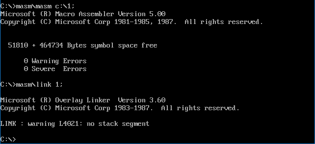

# 汇编语言

## 序章 前言

### 1.1 教学思想

​	学习线索应真正地遵循**循序渐进**的原则，盲目探索和不成系统的情况，最终学习到的也大都是相对零散的知识，并不能建立起一个系统的知识结构。

​	为了按循序渐进的原则构造学习线索，本书采用了一种全新的信息组织和加工艺术，我们称其为**知识屏蔽**。教学内容进行了最小化分割，力求使我们在学习过程中所接触到的每一个知识点都是当前唯一要去理解的东西。

### 1.2 本书的结构

​	本书由若干章构成，一章包含若干知识点，根据具体内容，还可能包含检测点、问题和分析、实验、附注等教学节点。书中的所有教学节点，除附注之外，都在一个全程的主线索之中。

​	由于本书具有很强的线索性，学习一定要按照教学的线索进行，有两点是必须要遵守的原则：①没有通过检测点不要向下学习；②没有完成当前的实验不要向下学习。下表详细说明了书中的各种教学节点和它们的组织情况。

<center style="color:#C0C0C0">表 教学节点详表</center>

| 教学节点 | 说明                                                         |
| -------- | ------------------------------------------------------------ |
| 知识点   | 学习者的主要知识来源。知识点以小节的形式出现，一个知识点为一个小节。每一个知识点都有一个相对独立的小主题。 |
| 附注     | 有些内容是对主要内容的拓展、加深和补充。这些内容如果放入正文中，会分散学习者对主体内容的注意力，同时也破坏了主体内容的系统性。我们把这些内容在附注中给出，供学习者选看。附注不在主线索之中，是主线索的引出内容。 |
| 检测点   | 检测点用来取得学习情况的反馈。只要通过了检测点，我们就得到了一个保证：已掌握了前面的内容。这是对学习成果的阶段性的肯定，有了这个肯定，可以信心十足地继续学习。如果没有通过检测点，需要回头再进行复习。有的检测点中也包含了一些具有教学功能的内容。 |
| 问题分析 | 引导学习者对知识进行深入的理解和灵活的应用。                 |
| 实验     | 在本书中，实验也是在学习线索中的。有的教学内容就包含在编程的依据材料中。每一实验个实验都是后续内容的基础，实验的任务必须**独立完成**。我们可以这样看待实验的重要性，如果你没有完成当前的实验，就应停止继续学习，直到你独立完成实验。 |

### 1.3 教学重心和内容特点

本书的教学重心是：通过**学习关键指令来深入理解机器工作的基本原理，培养底层编程意识和思想**。本着这个原则，本书的内容将和传统的教材有着很大的不同。

​	(1)不讲解每一条指令的功能

​	指令仅仅是学习机器基本原理和设计思想的一种实例。而逐条地讲解每一条指令的功能，不是本书的职责所在，它应该是一本指令手册的核心内容。

​	(2)编程的平台是硬件而不是操作系统

​	我们必须通过一定的编程实践，体验一个裸机的环境，在一个没有操作系统的环境中直接对硬件编程。这样的体会和经验非常重要，这样我们才能真正体会到汇编语言的作用，并且看到没有操作系统的计算机系统是怎样的。这为以后的操作系统的学习打下了一个重要的基础。

​	(3)着重讲解重要指令和关键概念

​	本书的所有内容都是围绕着“深入理解机器工作的基本原理”和“培养底层编程意识和思想”这两个核心目标来进行的。对所有和这两个目标关系并不密切的内容，都进行了舍弃。使学习者可以集中注意力真正理解和掌握那些具有普遍意义的指令和关键概念。

​	本书在深入到本质的层面上对重要指令和关键概念进行了讲解和讨论。这些指令和概念有：jmp、条件转移指令、call、ret、栈指令、int、iret、cmp、loop、分段、寻址方式等。 

### 1.4 读者定位

​	本书可用作大学计算机专业本科的汇编教材，和希望深入学习计算机科学的学习者的自学教材。本书的读者应具备以下基础：

​	①具有计算机的使用经验；

​	②具有二进制、十六进制等基础知识；

​	③具有一门高级语言（BASIC、Pascal、C...）的基本编程基础。

### 1.5 联系方法

​	《汇编语言-第四版》作者的 E-mail 地址为：fewstu@163.com。 

## 第 1 章 基础知识

​	汇编语言是直接在硬件之上工作的编程语言，我们首先要了解硬件系统的结构，才能有效地应用汇编语言对其编程。

​	在汇编课程中我们不对硬件系统进行全面和深入的研究，关于PC机及CPU物理结构和编程结构的全面研究，在《微机原理与接口》中进行；对于计算机一般的结构、功能、性能的研究在一门称为《组成原理》的理论层次更高的课程中进行。汇编课程的研究重点放在**如何利用硬件系统的编程结构和指令集有效灵活地控制系统进行工作**。

### 1.1 机器语言

​	机器语言是机器指令的集合。电子计算机的机器指令是一列**二进制数字**。计算机将之转变为一列高低电平，以使计算机的电子器件受到驱动，进行运算。

​	计算机的功能由一个芯片来完成，这个芯片就是我们常说的 **CPU(Central Processing Unit,中央处理单元)**，CPU 是一种微处理器。 以后我们提到的计算机是指由CPU和其他受CPU直接或间接控制的芯片、器件、设备组成的计算机系统，比如我们最常见的PC机。

​	每一种微处理器，由于硬件设计和内部结构的不同，就需要用不同的电平脉冲来控制，使它工作。所以每一种微处理器都有自己的**机器指令集**，也就是**机器语言**。

​	早期的机器语言是0、1编写成的代码在纸带上打孔，机器码具有**晦涩难懂和不易查错**的缺点。

### 1.2 汇编语言的产生

​	汇编语言的主体是**汇编指令**。汇编指令和机器指令的差别在于指令的表示方法上。汇编指令是机器指令便于记忆的书写格式。

​	例如：机器指令`1000100111011000`表示把寄存器`BX`的内容送到`AX`中。汇编指令则写成 `mov ax，bx`。这样的写法与人类语言接近，便于阅读和记忆。

（寄存器，简单地讲是CPU中可以存储数据的器件，一个CPU中有多个寄存器。AX是其中一个寄存器的代号，BX是另一个寄存器的代号。）

​	此后，程序员们就用汇编指令编写源程序。计算机能读懂的只有机器指令，就需要有一个能够将汇编指令转换成机器指令的翻译程序，这样的程序我们称其为**编译器**。程序员用汇编语言写出源程序，再用汇编编译器将其编译为机器码，由计算机最终执行，如下图。


### 1.3 汇编语言的组成

汇编语言发展至今，有以下3类指令组成。

​	①汇编指令：机器码的助记符，有对应的机器码。

​	②伪指令：没有对应的机器码，由编译器执行，计算机并不执行。

​	③其他符号：如`+、—、*、/`等，由编译器识别，没有对应的机器码。

汇编语言的核心是汇编指令，它决定了汇编语言的特性。

### 1.4 存储器

​	CPU 是计算机的核心部件，它控制整个计算机的运作并进行运算。要想让一个CPU工作，就必须向它提供指令和数据。指令和数据在**存储器**中存放，也就是我们平时所说的**内存**。在一台PC机中内存的作用仅次于CPU，离开了内存，性能再好的CPU也无法工作。磁盘不同于内存，磁盘上的数据或程序如果不读到内存中，就无法被CPU使用。要灵活地利用汇编语言编程，我们首先要了解 CPU 是如何从内存中读取信息，以及向内存中写入信息的。

### 1.5 指令和数据

​	指令和数据是应用上的概念。**在内存或磁盘上，指令和数据没有任何区别，都是二进制信息**。CPU在工作的时候把有的信息看作指令，有的信息看作数据，为同样的信息赋予了不同的意义。

​	例如，内存中的二进制信息`1000100111011000`，计算机可以把它看作大小为`89D8H`的数据来处理，也可以将其看作指令`mov ax，bx `来执行。

`1000100111011000—>89D8H（数据）`

`1000100111011000 -> mov ax,bx(程序) `

### 1.6 存储单元

​	存储器被划分成若干个存储单元，每个存储单元从 0 开始顺序编号，例如一个存储器有128个存储单元，编号从0～127，如图所示。这些编号可以看成存储单元在存储器中的地址

| 0    | 1    | 2    | 3    | 4    | ... ... | 124  | 125  | 126  | 127  |
| ---- | ---- | ---- | ---- | ---- | ------- | ---- | ---- | ---- | ---- |

​	那么一个存储单元能存储多少信息呢？电子计算机的最小信息单位是 bit（音译为比特），也就是一个二进制位。8 个 bit 组成一个 Byte，也就是通常讲的一个字节。微型机存储器的存储单元可以存储一个Byte，即 8 个二进制位。一个存储器有 128 个存储单元，它可以存储 128 个 Byte。

​	微机存储器的容量是以字节为最小单位来计算的。对于拥有 128 个存储单元的存储器，它的容量是128 个字节。

​	对于大容量的存储器一般还用以下单位来计量容量（以下用 B 来代表 Byte）：

​	1KB=1024B	1MB=1024KB	1GB=1024MB	1TB=1024GB

​	磁盘的容量单位同内存的一样，实际上以上单位是微机中常用的计量单位。

###  1.7 CPU对存储器的读写

​	CPU要从内存中读数据，首先要指定存储单元的地址。也就是说它要先确定它要读取哪一个存储单元中的数据。

​	另外，在一台微机中，不只有存储器这一种器件。CPU在读写数据时还要指明，它要对哪一个器件进行操作，进行哪种操作，是从中读出数据，还是向里面写入数据。

​	可见，CPU要想进行数据的读写，必须和外部器件（标准的说法是芯片）进行下面3类信息的交互。

* 存储单元的地址（地址信息）；

* 器件的选择，读或写的命令（控制信息）；
* 读或写的数据（数据信息）。

​	在计算机中专门有连接CPU和其他芯片的导线，通常称为**总线**。总线从物理上来讲，就是一根根导线的集合。根据传送信息的不同，总线从逻辑上又分为3类，**地址总线**、**控制总线**和**数据总线**。


<center style="color:#C0C0C0">图1.3 CPU从内存中3号单元读取数据的过程</center>

​	①CPU通过地址线将地址信息 3 发出。

​	②CPU通过控制线发出内存读命令，选中存储器芯片，并通知它，将要从中读取数据。

​	③存储器将3号单元中的数据 8 通过数据线送入CPU。

写操作与读操作的步骤相似。如向 3 号单元写入数据26。

​	①CPU通过地址线将地址信息 3 发出。

​	②CPU通过控制线发出内存写命令，选中存储器芯片，并通知它，要向其中写入数据。

​	③CPU通过数据线将数据 26 送入内存的 3 号单元中。

从上面我们知道了 CPU 是如何进行数据读写的。可是，如何命令计算机进行数据的读写呢？

​	要让一个计算机或微处理器工作，应向它输入能够驱动它进行工作的电平信息（机器码）。对于8086CPU，下面的机器码，能够完成从3号单元读数据。

​	机器码：`101000010000001100000000 `

​	对应的汇编指令：`MOV AX，[3]`

​	含义：从3号单元读取数据送入寄存器AX

CPU接收这条机器码后将完成我们上面所述的读写工作。

### 1.8 地址总线

​	CPU是通过地址总线来指定存储器单元的。可见地址总线上能传送多少个不同的信息，CPU就可以对多少个存储单元进行寻址。

​	现假设，一个CPU有10根地址总线，让我们来看一下它的寻址情况。我们知道，在电子计算机中，一根导线可以传送的稳定状态只有两种，高电平或是低电平。用二进制表示就是 1 或 0，10 根导线可以传送 10 位二进制数据。而 10 位二进制数可以表示多最小数为 0，最大数为$2^{10} $ = 1023。

​	下图展示了一个具有 10 根地址线的 CPU 向内存发出地址信息11时10根地址线上传送的二进制信息。考虑一下，访问地址为12、13、14等的内存单元时，地址总线上传送的内容是 **0011000000、1011000000、0111000000**。


<center style="color:#C0C0C0">图1.8 地址线上传送的二进制信息</center>

​	一个CPU有N根地址线，则可以说这个CPU的地址**总线的宽度为N**。这样的CPU最多可以寻找2的N次方个内存单元。

### 1.9 数据总线

​	CPU 与内存或其他器件之间的数据传送是通过**数据总线**来进行的。数据总线的宽度决定了CPU和外界的数据传送速度。8根数据总线一次可传送一个8位二进制数据（即一个字节）。16根数据总线一次可传送两个字节。

​	8088CPU的数据总线宽度为8，8086CPU的数据总线宽度为16。我们来分别看一下它们向内存中写入数据89D8H时，是如何通过数据总线传送数据的。图1.9.1展示了8088CPU数据总线上的数据传送情况；图1.9.2展示了8086CPU数据总线上的数据传送情况。


<center style="color:#C0C0C0">图1.9.1 8088CPU 8位数据总线上的数据传送情况</center>


<center style="color:#C0C0C0">图1.9.2 8086CPU 16位数据总线上的数据传送情况</center>

​	8086有16根数据线，可一次传送16位数据，所以可一次传送数据89D8H；而8088只有8根数据线，一次只能传8位数据，所以向内存写入数据89D8H时需要进行两次数据传送。

### 1.10 控制总线

​	CPU对外部器件的控制是通过**控制总线**来进行的。在这里控制总线是个总称，控制总线是一些不同控制线的集合。有多少根控制总线，就意味着CPU提供了对外部器件的多少种控制。所以，控制总线的宽度决定了CPU对外部器件的控制能力。

​	前面所讲的内存读或写命令是由几根控制线综合发出的，其中有一根称为“**读信号输出**”的控制线负责由CPU向外传送读信号，CPU向该控制线上输出低电平表示将要读取数据；有一根称为“**写信号输出**”的控制线则负责传送写信号。

### 1.a 检测点与小结

#### 小结

> (1)汇编指令是机器指令的助记符，同机器指令一一对应。 
>
> (2)每一种 CPU 都有自己的汇编指令集。
>
> (3)CPU可以直接使用的信息在存储器中存放。
>
> (4)在存储器中指令和数据没有任何区别，都是二进制信息。 
>
> (5)存储单元从零开始顺序编号。
>
> (6)一个存储单元可以存储 8 个bit，即 8 位二进制数。
>
> (7)1Byte = 8bit	1KB = 1024B	1MB = 1024KB	1GB = 1024MB。
>
> (8)每一个 CPU 芯片都有许多**管脚**，这些管脚和总线相连。也可以说，这些管脚引出总线。一个 CPU 可以引出3种总线的宽度标志了这个 CPU 的不同方面的性能：
>
> ​	地址总线的宽度决定了 CPU 的寻址能力；
>
> ​	数据总线的宽度决定了 CPU 与其他器件进行数据传送时的一次数据传送量： 
>
> ​	控制总线的宽度决定了 CPU 对系统中其他器件的控制能力。
>
> 在汇编课程中，我们从功能的角度介绍了 3 类总线，对实际的连接情况不做讨论。 

#### 检测点

(1)1个CPU的寻址能力为8KB，那么它的地址总线的宽度为`13`。

(2)1KB的存储器有`1024`个存储单元。存储单元的编号从`0`到`1023`

(3)1KB的存储器可以存储`8192`个 bit,`1024`个 Byte。

(4)1GB、1MB、1KB分别是`2^30、2^20、2^10`Byte.

(5)8080、8088、80286、80386的地址总线宽度分别为16根、20根、24根、32根，则它们的寻址能力分别为：

`64`(KB)、`1`(MB)、`16`(MB)、`4`(GB)。

(6)8080、8088、8086、80286、80386的数据总线宽度分别为8根、8根、16根、16根、32根。则它们一次可以传送的数据为：`1`（B）、`1`（B）、`2`（B）、`2`（B）、`4`（B）。

(7)从内存中读取1024字节的数据，8086至少要读`512`次，80386至少要读`256`次。

(8)在存储器中，数据和程序以`二进制`形式存放。 

### 1.11 内存地址空间（概述）

​	内存地址空间，举例来讲，一个 CPU 的地址总线宽度为 10，那么可以寻址 1024 个内存单元，这 **1024 个可寻到的内存单元**就构成这个 CPU 的**内存地址空间**。

### 1.12 主板

​	在每一台 PC 机中，都有一个主板，主板上有核心器件和一些主要器件，这些器件通过总线（地址总线、数据总线、控制总线）相连。这些器件有 CPU、存储器、外围芯片组、扩展插槽等。扩展插槽上一般插有 RAM 内存条和各类接口卡。

### 1.13 接口卡

​	计算机系统中，所有可用程序控制其工作的设备，必须受到 CPU 的控制。CPU 对外部设备都不能直接控制，如显示器、音箱、打印机等。直接控制这些设备进行工作的是插在扩展插槽上的接口卡。扩展插槽通过总线和 CPU 相连，所以接口卡也通过总线同 CPU 相连。CPU 可以**直接控制这些接口卡**，从而实现 CPU **对外设的间接控制**。简单地讲，就是CPU 通过总线向接口卡发送命令，接口卡根据 CPU 的命令控制外设进行工作。

### 1.14 各类存储器芯片

​	一台PC机中，装有多个存储器芯片，这些存储器芯片从物理连接上看是独立的、不同的器件。从读写属性上看分为两类：**随机存储器（RAM）**和**只读存储器（ROM）**。随机存储器**可读可写**，但必须**带电存储**，关机后存储的内容丢失；只读存储器**只能读取不能写入**，**关机后其中的内容不丢失**。这些存储器从功能和连接上又可分为以下几类。

* **随机存储器**

​	用于存放供CPU使用的绝大部分程序和数据，主随机存储器一般由两个位置上的RAM组成，装在主板上的RAM和插在扩展插槽上的RAM。

* **装有BIOS(Basic Input/Output System,基本输入/输出系统)的ROM**

​	BIOS是由主板和各类接口卡（如显卡、网卡等）厂商提供的软件系统，可以通过它利用该硬件设备进行最基本的输入输出。在主板和某些接口卡上插有存储相应BIOS的ROM。例如，主板上的ROM中存储着主板的BIOS（通常称为系统BIOS）；显卡上的ROM中存储着显卡的BIOS；如果网卡上装有ROM，那其中就可以存储网卡的BIOS。

* **接口卡上的RAM**

​	某些接口卡需要对大批量输入、输出数据进行暂时存储，在其上装有RAM。最典型的是显示卡上的RAM，一般称为显存。显示卡随时将显存中的数据向显示器上输出。换句话说，我们将需要显示的内容写入显存，就会出现在显示器上。


<center style="color:#C0C0C0">图1.14 PC系统中各类存储器的逻辑连接情况。</center>

### 1.15 内存地址空间

上述的那些存储器，在物理上是独立的器件，但是在以下两点上相同。

* 都和 CPU 的总线相连。

* CPU 对它们进行读或写的时候都通过控制线发出内存读写命令。

​	这也就是说，CPU在操控它们的时候，把它们都当作内存来对待，把它们总的看作一个由若干存储单元组成的逻辑存储器，这个逻辑存储器就是我们所说的**内存地址空间**。在汇编这门课中，我们所面对的是内存地址空间。


<center style="color:#C0C0C0">图1.15 CPU将系统中各类存储器看作一个逻辑存储器</center>

​	在上图中，所有的物理存储器被看作一个由若干存储单元组成的逻辑存储器，每个物理存储器在这个逻辑存储器中占有一个地址段，即**一段地址空间**。CPU在这段地址空间中读写数据，实际上就是在相对应的物理存储器中读写数据。

假设，图1.8中的内存地址空间的地址段分配如下。

​	地址 0～7FFFH 的 32KB 空间为主随机存储器的地址空间；

​	地址 8000H～9FFFH 的 8KB 空间为显存地址空间；

​	地址 A000H～FFFFH 的 24KB 空间为各个 ROM 的地址空间。

这样，CPU 向内存地址为 1000H 的内存单元中写入数据，这个数据就被写入主随机存储器中；CPU 向内存地址为 8000H 的内存单元中写入数据，这个数据就被写入显存中，然后会被显卡输出到显示器上；CPU 向内存地址为 C000H 的内存单元中写入数据的操作是没有结果的，C000H 单元中的内容不会被改变，C000H 单元实际上就是 ROM 存储器中的一个单元。

​	内存地址空间的大小受 CPU 地址总线宽度的限制。8086CPU 的地址总线宽度为 20，可以传送 $2^{20}$ 个不同的地址信息（大小从 0 至 $2^{20}-1$）。即可以定位 $2^{20}$ 个内存单元，则 8086PC 的内存地址空间大小为 1MB。同理，80386CPU 的地址总线宽度为 32，则内存地址空间最大为 4GB。

​	我们在基于一个计算机硬件系统编程的时候，必须知道这个系统中的**内存地址空间分配情况**。因为当我们想在某类存储器中读写数据的时候，必须知道它的第一个单元的地址和最后一个单元的地址，才能保证读写操作是在预期的存储器中进行。比如，我们希望向显示器输出一段信息，那么必须将这段信息写到显存中，显卡才能将它输出到显示器上。要向显存中写入数据，必须知道显存在内存地址空间中的地址。

​	不同的计算机系统的内存地址空间的分配情况是不同的，图1.15.1 展示了 8086PC 机内存地址空间分配的基本情况。


<center style="color:#C0C0C0">图1.15.1 8086PC机内存地址空间分配</center>

​	上图告诉我们，从地址 0～9FFFF 的内存单元中读取数据，实际上就是在读取主随机存储器中的数据；向地址 A0000～BFFFF 的内存单元中写数据，就是向显存中写入数据，这些数据会被显示卡输出到显示器上；我们向地址 C0000～FFFFF 的内存单元中写入数据的操作是无效的，因为这等于改写只读存储器中的内容。

#### 内存地址空间

​	最终运行程序的是CPU，我们用汇编语言编程的时候，必须要从CPU的角度考虑问题。对CPU来讲，系统中的所有存储器中的存储单元都处于一个统一的逻辑存储器中，它的容量受CPU寻址能力的限制。这个逻辑存储器即是我们所说的**内存地址空间**。

​	对于初学者，这个概念比较抽象，后续的课程中将通过一些编程实践，来增加感性认识。

## 第 2 章 寄存器

​	一个典型的 CPU 由运算器、控制器、寄存器等器件构成，这些器件靠内部总线相连。前一章所说的总线，相对于CPU内部来说是**外部总线**。**内部总线**实现**CPU内部各个器件之间的联系**，外部总线实现CPU和主板上其他器件的联系。简单地说，在CPU中：

* 运算器进行信息处理
* 寄存器进行信息存储

* 控制器控制各种器件进行工作

* 内部总线连接各种器件，在它们之间进行数据的传送

对于一个汇编程序员来说，CPU 中的主要部件是寄存器。寄存器是 CPU 中程序员可以用指令读写的部件。程序员通过改变各种寄存器中的内容来实现对 CPU 的控制。

​	不同的CPU，寄存器的个数、结构是不相同的。8086CPU有14个寄存器，每个寄存器有一个名称。这些寄存器是：AX、BX、CX、DX、SI、DI、SP、BP、IP、CS、SS、 DS、ES、PSW。

### 2.1 通用寄存器

​	8086CPU的所有寄存器都是16位的，可以存放两个字节。AX、BX、CX、DX这4个寄存器通常用来存放一般性的数据，被称为**通用寄存器**。

​	以AX为例，寄存器的逻辑结构如下图所示：


<center style="color:#C0C0C0">图2.1 16位寄存器的逻辑结构</center>

​	一个 16 位寄存器可以存储一个 16 位的数据，数据在寄存器中的存放情况如图 2.1.1 所示。一个 16 位寄存器所能存储的数据的最大值为 $2^{16}-1$。


<center style="color:#C0C0C0">图2.1.1 16位数据在寄存器中的存放情况</center>

​	8086CPU 的上一代 CPU 中的寄存器都是 8 位的，为了保证兼容，使原来基于上代 CPU 编写的程序稍加修改就可以运行在 8086 之上，8086CPU 的 AX、BX、CX、DX 这 4 个寄存器都**可分为两个可独立使用的 8 位寄存器**来用，AX 的高 8 位字节部分记为 AH，低 8 位字节部分记为 AL，其他三个寄存器类似。

​	以 AX 为例，8086CPU 的 16 位寄存器分为两个 8 位寄存器的情况如图 2.1.2 所示。


<center style="color:#C0C0C0">图2.1.2 16位寄存器分为两个8位寄存器</center>

​	AX 的低 8 位（0位～7位）构成了 AL 寄存器，高8位（8位～15位）构成了 AH 寄存器。AH 和 AL 寄存器是可以独立使用的 8 位寄存器。下图 2.1.3 展示了 16 位寄存器及它所分成的两个 8 位寄存器的数据存储的情况，一个 8 位寄存器所能存储的数据的最大值为 $2^8-1$。


<center style="color:#C0C0C0">图2.1.3 16位寄存器及所分成的两个8位寄存器的数据存储情况</center>

### 2.2 字在寄存器中的存储

出于对兼容性的考虑，8086CPU 可以一次性处理以下两种尺寸的数据。

* 字节：记为byte，一个字节由 8 个 bit 组成，可以存在 8 位寄存器中。

* 字：记为word，**一个字由两个字节组成**，这两个字节分别称为这个字的**高位字节**和**低位字节**，如图所示。

$$
字:\underset{高位字节}{\underbrace{01001110}}\underset{低位字节}{\underbrace{00100000}}
$$

​	一个字可以存在一个 16 位寄存器中，这个字的高位字节和低位字节自然就存在这个寄存器的高8位寄存器和低8位寄存器中。如图 2.1.3 所示，一个字型数据 20000，存在 AX 寄存器中，在 AH 中存储了它的高 8 位，在 AL 中存储了它的低 8 位。AH 和 AL 中的数据，既可以看成是一个字型数据的高 8 位和低 8 位，这个字型数据的大小是 20000，又可以看成是两个独立的字节型数据，它们的大小分别是 78 和 32。

#### 关于数制的讨论

> ​	任何数据，到了计算机中都是以二进制的形式存放的。为了描述不同的问题，又经常将它们用其他的进制来表示。比如图 2.1.3 中寄存器 AX 中的数据是 0100111000100000，这就是 AX 中的信息本身，可以用不同的逻辑意义来看待它。可以将它看作一个数值，大小是 20000。
>
> ​	当然，二进制数0100111000100000本身也可表示一个数值的大小，但人类习惯的是十进制，用十进制20000表示可以使我们直观地感受到这个数值的大小。
>
> ​	十六进制数的一位相当于二进制数的四位，如0100111000100000可表示成：4（0100）、E（1110）、2（0010）、0（0000）四位十六进制数。
>
> ​	一个内存单元可存放8位数据，CPU中的寄存器又可存放n个8位的数据。也就是说，计算机中的数据大多是由1～N个8位数据构成的。很多时候，需要直观地看出组成数据的各个字节数据的值，用十六进制来表示数据可以直观地看出这个数据是由哪些8位数据构成的。比如 20000 写成 4E20 就可以直观地看出，这个数据是由 4E 和 20 两个 8 位数据构成的，如果 AX 中存放 4E20，则 AH 里是 4E，AL 里是 20。这种表示方法便于许多问题的直观分析。在以后的课程中，我们多用十六进制来表示一个数据。
>
> ​	在以后的课程中，为了区分不同的进制，在十六进制表示的数据的后面加 H，在二进制表示的数据后面加 B，十进制表示的数据后面什么也不加。如：可用3种不同的进制表示图2.1.3中 AX 里的数据，十进制：20000，十六进制：4E20H，二进制：0100111000100000B。

### 2.3 几条汇编指令

通过汇编指令控制 CPU 进行工作，看一下表 2.1 中的几条指令。

<center style="color:#C0C0C0">表2.3.1 汇编指令举例</center>

| 汇编指令  | 控制CPU完成的操作                  | 用C语言的语法描述 |
| --------- | ---------------------------------- | ----------------- |
| mov ax,18 | 将18送入寄存器AX                   | AX = 18           |
| mov ah,78 | 将78送入寄存器AH                   | AH = 78           |
| add ax,8  | 将寄存器AX中的数值加上8            | AX = AX + 8       |
| mov ax,bx | 将寄存器BX中的数据送入寄存器AX     | AX = BX           |
| add ax,bx | 将AX和BX中的数值相加，结果存在AX中 | AX = AX + BX      |

​	注意，为了使具有高级语言基础的读者更好地理解指令的含义，有时会用文字描述和高级语言描述这两种方式来描述一条汇编指令的含义。在**写一条汇编指令或一个寄存器的名称时不区分大小写**。

​	接下来看一下 CPU 执行表 2.3.2 中所列的程序段中的每条指令后，对寄存器中的数据进行的改变。

<center style="color:#C0C0C0">表2.3.2 程序段中指令的执行情况之一(原AX中的值：0000H，原BX中的值：0000H)</center>

| 程序段中的指令 | 指令执行后AX中的数据 | 指令执行后BX中的数据 |
| -------------- | -------------------- | -------------------- |
| mov ax,4E20H   | 4E20H                | 0000H                |
| add ax,1406H   | 6226H                | 0000H                |
| mov bx,2000H   | 6226H                | 2000H                |
| add ax,bx      | 8226H                | 2000H                |
| mov bx,ax      | 8226H                | 8226H                |
| add ax,bx      | `/*Answer*/`         | 8226H                |

#### 问题 2.1

上表`add ax,bx`指令执行后 AX 中的数据为多少？

分析：

​	程序段中的最后一条指令 add ax，bx，在执行前 ax 和 bx 中的数据都为 8226H，相加后所得的值为： 1044CH，但是 ax 为 16 位寄存器，只能存放 4 位十六进制的数据，所以最高位的 1 不能在 ax 中保存，ax 中的数据为： 044CH

#### 问题 2.2

指令执行后 AX 中的数据为多少？

| 程序段中的指令 | 指令执行后AX中的数据 | 指令执行后BX中的数据 |
| -------------- | -------------------- | -------------------- |
| mov ax,001AH   | 001AH                | 0000H                |
| mov bx,0026H   | 001AH                | 0026H                |
| add al,bl      | 0040H                | 0026H                |
| add ah,bl      | 2640H                | 0026H                |
| add bh,al      | 2640H                | 4026H                |
| mov ah,0       | 0040H                | 4026H                |
| add al,85H     | 00C5H                | 4026H                |
| add al,93H     | `/*Answer*/`         | 4026H                |

分析：

​	程序段中的最后一条指令 `add al，93H`，在执行前，al 中的数据为 C5H，相加后所得的值为：158H，但是 al 为 8 位寄存器，只能存放两位十六进制的数据，所以最高位的 1 丢失， ax中的数据为： 0058H。 （这里的丢失，指的是进位值不能在 8 位寄存器中保存，但是CPU并不真的丢弃这个进位值，关于这个问题，我们将在后面的课程中讨论。）

​	注意，**此时 al 是作为一个独立的 8 位寄存器来使用的**，和 ah 没有关系，CPU 在执行这条指令时认为ah和al是两个不相关的寄存器。不要错误地认为，诸如add al，93H的指令产生的进位会存储在ah中，add al，93H进行的是8位运算。

​	如果执行add ax，93H，低8位的进位会存储在ah中，CPU在执行这条指令时认为只有一个16位寄存器ax，进行的是16位运算。指令add ax，93H执行后，ax中的值为：0158H。此时，使用的寄存器是16位寄存器ax，add ax，93H相当于将ax中的16位数据00C5H和另一个16位数据0093H相加，结果是16位的0158H。

​	在进行数据传送或运算时，要注意指令的两个操作对象的**位数应当是一致**的，例如：

```assembly
mov ax, bx
mov bx, cx 
mov ax, 18H
mov al, 18H
add ax, bx
add ax, 20000
```

等都是正确的指令，而：

```assembly
mov ax, bl   	/*在8位寄存器和16位寄存器之间传送数据*/
mov bh, ax		/*在16位寄存器和8位寄存器之间传送数据*/
mov al, 20000	/*8位寄存器最大可存放值为255的数据*/
add al, 100H		/*将一个高于8位的数据加到一个8位寄存器中*/
```

等都是错误的指令，错误的原因都是指令的两个操作对象的位数不一致。

### 2.a 检测点 

(1)写出每条汇编指令执行后相关寄存器中的值。 

| 汇编指令       | 寄存器中的值  |
| -------------- | ------------- |
| mov  ax, 62627 | AX = `F4A3H`  |
| mov ah, 31H    | AX =`31A3H` ★ |
| mov  al, 23H   | AX =`3123H`   |
| add  ax, ax    | AX =`6246H`   |
| mov  bx, 826CH | BX =`826CH`   |
| mov  cx, ax    | CX =`6246H`   |
| mov  ax, bx    | AX =`826CH`   |
| add  ax, bx    | AX =`04D8H`   |
| mov al,bh      | AX =`0482H`★  |
| mov ah,bl      | AX =`6C82H`★  |
| add ah,ah      | AX =`D882H`★  |
| add  al, 6     | AX =`D888H`   |
| add  al,al     | AX =`D810H`   |
| mov  ax,cx     | AX =`6246H`   |

(2)只能使用目前学过的汇编指令，最多使用4条指令，编程计算2的4次方。

```assembly
mov ax, 2
add ax, ax
add ax, ax
add ax, ax
```

### 2.4 物理地址

​	我们知道，CPU 访问内存单元时，要给出内存单元的地址。所有的内存单元构成的存储空间是一个一维的线性空间，每一个内存单元在这个空间中都有唯一的地址，我们将这个唯一的地址称为**物理地址**。

​	CPU 通过地址总线送入存储器的，必须是一个内存单元的物理地址。在CPU 向地址总线上发出物理地址之前，必须要在内部先形成这个物理地址。不同的 CPU 可以有不同的形成物理地址的方式。我们现在讨论 8086CPU 是如何在内部形成内存单元的物理地址的。

### 2.5 16位结构的CPU

​	我们说 8086CPU 的上一代 CPU(8080、8085)等是 8 位机，而 8086 是 16 位机，也可以说 8086 是 16 位结构的CPU。

​	16位结构的 CPU 概括地讲，16 位结构（**16位机、字长为 16 位等常见说法，与 16 位结构的含义相同**）描述了一个CPU具有下面几方面的结构特性。

* 运算器一次最多可以处理 16 位的数据
* 寄存器的最大宽度为 16 位
* 寄存器和运算器之间的通路为 16 位

​	8086 是 16 位结构的 CPU，这也就是说，在 8086 内部，能够**一次性处理、传输、暂时存储的信息的最大长度是 16 位**的。内存单元的地址在送上地址总线之前，必须在 CPU 中处理、传输、暂时存放，对于 16 位 CPU，能一次性处理、传输、暂时存储 16 位的地址。

### 2.6 8086CPU给出物理地址的方法

​	8086CPU 有 20 位地址总线，可以传送 20 位地址，达到 1MB 寻址能力。8086CPU 又是 16 位结构，在内部一次性处理、传输、暂时存储的地址为 16 位。从 8086CPU 的内部结构来看，如果将地址从内部简单地发出，那么它只能送出 16 位的地址，表现出的寻址能力只有 64KB。

​	8086CPU采用一种在内部用两个 16 位地址合成的方法来形成一个 20 位的物理地址。


 <center style="color:#C0C0C0">图2.6 8086CPU相关部件的逻辑结构</center>

​	8086CPU相关部件的逻辑结构如图2.6所示，当8086CPU要读写内存时：

​	①CPU中的相关部件提供两个16位的地址，一个称为**段地址**，另一个称为**偏移地址**

​	②段地址和偏移地址通过内部总线送入一个称为**地址加法器**的部件；

​	③地址加法器**将两个16位地址合成为一个20位的物理地址**；

​	④地址加法器通过内部总线将20位物理地址送入**输入输出控制电路**；

​	⑤输入输出控制电路将20位物理地址送上**地址总线**

​	⑥20位物理地址被地址总线传送到**存储器**。

​	地址加法器采用**物理地址 = 段地址×16 + 偏移地址**的方法用段地址和偏移地址合成物理地址。例如，8086CPU要访问地址为123C8H的内存单元，此时，地址加法器的工作过程如图2.6.1所示（图中数据皆为十六进制表示）。

 


 <center style="color:#C0C0C0">图2.6.1 地址加法器的工作过程</center>

#### 由“段地址×16”引发的讨论

​	“段地址×16”有一个更为常用的说法是**左移4位**。计算机中的所有信息都是以二进制的形式存的，段地址当然也不例外。机器只能处理二进制信息，“左移4位”中的位，指的是二进制位。

​	下面是个例子，一个数据为2H，二进制形式为10B，对其进行左移运算：

| 左移位数 | 二进制  | 十六进制 | 十进制 |
| -------- | ------- | -------- | ------ |
| 0        | 10B     | 2H       | 2      |
| 1        | 100B    | 4H       | 4      |
| 2        | 1000B   | 8H       | 8      |
| 3        | 10000B  | 10H      | 16     |
| 4        | 100000B | 20H      | 32     |

 观察上面移位次数和各种形式数据的关系，我们可以发现：

1. 一个数据的二进制形式左移1位，相当于该数据乘以2；

2. 一个数据的二进制形式左移N位，相当于该数据乘以2的N次方：

3. 地址加法器如何完成段地址×16的运算？就是将以二进制形式存放的段地址左移4位。

​	进一步思考，我们可看出：一个数据的十六进制形式左移1位，相当于乘以16；一个数据的十进制形式左移1位，相当于乘以10；一个X进制的数据左移1位，相当于乘以X。

### 2.7 “段地址×16 + 偏移地址 = 物理地址”的本质含义

​	“段地址×16+偏移地址=物理地址”的本质含义是：**CPU在访问内存时，用一个基础地址（段地址×16）和一个相对于基础地址的偏移地址相加，给出内存单元的物理地址。**

​	更一般地说，8086CPU的这种寻址功能是“**基础地址 + 偏移地址 = 物理地址**”寻址模式的一种**具体实现方案**。8086CPU中，段地址×16可看作是基础地址。

​	实际上有两种方法可以把地址告诉你

1. 直接说明地址

2. 给出基础地址和偏移地址

​	8086CPU是16位结构，没法一次性给出20位地址，所以给出**基础地址 + 偏移地址**，根据事先约定就可以获得最终地址了。

### 2.8 段的概念

​	我们注意到，“段地址”这个名称中包含着“段”的概念。这种说法可能对一些学习者产生了误导，使人误以为内存被划分成了一个一个的段，每一个段有一个段地址。如果我们在一开始形成了这种认识，将影响以后对汇编语言的深入理解和灵活应用。

​	其实，**内存并没有分段，段的划分来自于CPU**，由于8086CPU用“**基础地址（段地址×16）+偏移地址=物理地址**”的方式给出内存单元的物理地址，使得我们可以**用分段的方式来管理内存**。如图2.8所示，我们可以认为：地址10000H～100FFH的内存单元组成一个段，该段的起始地址（基础地址）为10000H，段地址为1000H，大小为100H；我们也可以认为地址10000H～1007FH、10080H～100FFH的内存单元组成两个段，它们的起始地址（基础地址）为：10000H和10080H，段地址为：1000H和1008H，大小都为80H。


 <center style="color:#C0C0C0">图2.8 分段</center>

​	以后，在编程时可以根据需要，**将若干地址连续的内存单元看作一个段**，用段地址×16定位段的起始地址（基础地址），用偏移地址定位段中的内存单元。有两点需要注意：段地址×16必然是16的倍数，所以一个段的起始地址也一定是16的倍数；偏移地址为16位，16位地址的寻址能力为64KB，所以**一个段的长度最大为64KB**。

#### 内存单元地址小结

> CPU访问内存单元时，必须向内存提供内存单元的物理地址。8086CPU在内部用段地址和偏移地址 移位相加的方法形成最终的物理地址。
>
> 思考下面的两个问题。
>
> (1)观察下面的地址，你有什么发现？ 
>
> | 物理地址 | 段地址 | 偏移地址 |
> | -------- | ------ | -------- |
> | 21F60H   | 2000H  | 1F60H    |
> |          | 2100H  | 0F60H    |
> |          | 21F0H  | 0060H    |
> |          | 21F6H  | 0000H    |
> |          | 1F00H  | 2F60H    |
>
> 结论★：**CPU可用不同的段地址和偏移地址形成同一个物理地址**
>
> ​	比如CPU要访问21F60H单元，则它给出的段地址SA和偏移地址EA满足SA×16+EA=21F60H即可。
>
> (2)如果给定一个段地址，仅通过变化偏移地址来进行寻址，最多可定位多少个内存单元？
>
> 结论：偏移地址16位，变化范围为0～FFFFH，仅用偏移地址来寻址最多可寻64KB个内存单元。
>
> 比如给定段地址1000H，用偏移地址寻址，CPU的寻址范围为：10000H～1FFFFH。
>
> 在8086PC机中，存储单元的地址用两个元素来描述，即**段地址和偏移地址。**
>
> “数据在21F60H内存单元中。”这句话对于8086PC机一般不这样讲，取而代之的是两种类似的说法：
>
> ​	①数据存在内存2000:1F60单元中
>
> ​	②数据存在内存的2000H段中的1F60H单元中。
>
> **可以根据需要，将地址连续、起始地址为16的倍数的一组内存单元定义为一个段。**

###  2.b 检测点

（1）给定段地址为0001H，仅通过变化偏移地址寻址，CPU的寻址范围为`00010H`到`1000FH`

解析：偏移地址变化范围为0～FFFFH，寻址范围为段地址×16 + 偏移地址

（2）有一数据存放在内存20000H单元中，现给定段地址为SA，若想用偏移地址寻到此单元。则SA应满足的条件是：最小为`1001H`，最大为`2000H`。

（提示，反过来思考一下，当段地址给定为多少，CPU无论怎么变化偏移地址都无法寻到20000H单元？）

解析：段地址的最大值，可以用物理地址减去偏移地址的最小值；同理，段地址的最小值，可以用物理地址减去偏移地址的最大值。

20000H - 0H / 16 = 2000H

20000H - FFFFH = 10001H不能被16整除，取10010H / 16 = 1001H

当SA<=1000H或SA>2000H时，CPU无论怎么变化偏移地址都无法寻到20000H单元。

### 2.9 段寄存器

​	我们前面讲到，8086CPU在访问内存时要由相关部件提供内存单元的段地址和偏移地址，送入地址加法器合成物理地址。这里，需要看一下，是什么部件提供段地址。段地址在8086CPU的**段寄存器**中存放。8086CPU有4个段寄存器：CS(Code Segment)、DS(Data Segment)、SS(Stack Segment)、ES(Extra Segment)。当8086CPU要访问内存时由这4个段寄存器提供内存单元的段地址。本章中只看一下CS。

### 2.10 CS和IP

​	CS和IP是8086CPU中两个最关键的寄存器，它们指示了CPU当前要读取指令的地址。**CS为代码段寄存器(Code Segment Register)**，**IP为指令指针寄存器(Instruction Pointer Register)**，从名称上我们可以看出它们和指令的关系。

在8086PC机中，任意时刻，设CS中的内容为M，IP中的内容为N，8086CPU将从内存M×16+N单元开始，读取一条指令并执行。

​	也可以这样表述：8086机中，任意时刻，**CPU 将 CS:IP 指向的内容当作指令执行**。

​	图2.10展示了8086CPU读取、执行指令的工作原理（图中只包括了和所要说明的问题密切相关的部件，图中数字都为十六进制）。


<center style="color:#C0C0C0">图2.10 8086PC读取和执行指令的相关部件</center>

图 2.10 说明如下。

​	①8086CPU当前状态：CS中的内容为2000H，IP 中的内容为 0000H

​	②内存 20000H～20009H 单元存放着可执行的机器码；

​	③内存 20000H～20009H 单元中存放的机器码对应的汇编指令如下。

​	地址： 20000H—20002H， 内容： B8 23 01，长度： 3Byte，对应汇编指令： mov ax，0123H

​	地址： 20003H—20005H， 内容： BB 03 00， 长度： 3Byte，对应汇编指令： mov bx，0003H

​	地址： 20006H—20007H，内容： 89 D8，长度： 2Byte，对应汇编指令： mov ax，bx

​	地址： 20008H—20009H，内容： 01 D8，长度： 2Byte，对应汇编指令： add ax，bx

下面的一组图（图1~图9），以图 2.10 描述的情况为初始状态，展示了 8086CPU读取、执行一条指令的过程。注意每幅图中发生的变化（下面对8086CPU的描述，是在逻辑结构、宏观过程的层面上进行的，目的是使读者对 CPU 工作原理有一个清晰、直观的认识，为汇编语言的学习打下基础。其中隐蔽了CPU的物理结构以及具体的工作细节）。


（读取一条指令后，**IP中的值自动增加，以使 CPU 可以读取下一条指令**。因当前读入的指令B82301长度为3个字节，所以IP中的值加3。此时，CS:IP指向内存单元2000:0003。）


下面的一组图（图10～图16），以图9的情况为初始状态，展示了8086CPU继续读取、执行3条指令的过程。注意IP的变化（下面的描述中，隐蔽了读取每条指令的细节）。


通过上面的过程展示，8086CPU 的工作过程可以简要描述如下：

1. 从CS:IP指向的内存单元读取指令，读取的指令进入指令缓冲器；

2. IP=IP+所读取指令的长度，从而指向下一条指令；

3. 执行指令。转到步骤（1），重复这个过程。

​	在8086CPU加电启动或复位后（即CPU刚开始工作时）CS和IP被设置为CS=FFFFH,IP=0000H,即在8086PC机刚启动时，CPU从内存FFFF0H单元中读取指令 执行，FFFF0H单元中的指令是8086PC机开机后执行的第一条指令。

​	现在，我们更清楚了CS和IP的重要性，它们的内容提供了CPU要执行指令的地址。

​	第1章中讲过，在内存中，指令和数据没有任何区别，都是二进制信息，CPU在工作的时候把有的信息看作指令，有的信息看作数据。现在，如果提出一个问题：<u>CPU根据什么将内存中的信息看作指令？如何回答？</u>我们可以说，**CPU将CS:IP指向的内存单元中的内容看作指令**，因为，在任何时候，**CPU将CS、IP中的内容当作指令的段地址和偏移地址，用它们合成指令的物理地址，到内存中读取指令码，执行**。如果说，内存中的一段信息曾被CPU执行过的话，那么，它所在的内存单元必然被CS:IP指向过。

### 2.11 修改CS、IP的指令

​	在CPU中，程序员能够用指令读写的部件只有寄存器，程序员可以通过改变寄存器中的内容实现对CPU的控制。CPU从何处执行指令是由CS、IP中的内容决定的，程序员可以通过改变CS、IP中的内容来控制CPU执行目标指令。

​	8086CPU大部分寄存器的值，都可以用mov指令来改变，**mov指令**被称为**传送指令**。可以用mov指令，如mov ax，123将ax中的值设为123，显然，我们也可以用同样的方法设置其他寄存器的值。

​	但是，**mov指令不能用于设置CS、IP的值**，原因很简单，因为8086CPU没有提供这样的功能。8086CPU为CS、IP提供了另外的指令来改变它们的值。能够改变CS、IP的内容的指令被统称为**转移指令**。我们现在介绍一个最简单的可以修改CS、IP的指令：**jmp指令**。

* 若想同时修改CS、IP的内容，可用形如“jmp段地址:偏移地址”的指令完成，如

​	`jmp 2AE3:3`，执行后：CS=2AE3H，IP=0003H，CPU将从2AE33H处读取指令。 

​	`jmp3:0B16`，执行后：CS=0003H，IP=0B16H，CPU将从00B46H处读取指令。

​	“jmp段地址：偏移地址”指令的功能为：**用指令中给出的段地址修改CS，偏移地址修改IP**。

* 若想仅修改IP的内容，可用形如“jmp某一合法寄存器”的指令完成，如

​	`jmp ax`，指令执行前：ax=1000H，CS=2000H，IP=0003H

​			    指令执行后：ax=1000H，CS=2000H.IP=1000H

​	`jmp bx`，指令执行前：bx=0B16H， CS=2000H， IP=0003H

​			     指令执行后：bx=0B16H， CS=2000H， IP=0B16H

“jmp 某一合法寄存器”指令的功能为：**用寄存器中的值修改IP**

`jmp ax`，在含义上好似： `mov IP，ax`（注意，此处只是用于解释，实际并没有这种汇编指令）

#### 问题 2.3

​	内存中存放的机器码和对应的汇编指令情况如图 2.11 所示，设 CPU 初始状态：CS=2000H，IP=0000H，请写出指令执行序列。思考后看分析。


<center style="color:#C0C0C0">图2.11 内存中存放的机器码和对应的汇编指令</center>

分析：

​	CPU对图2.11中的指令的执行过程如下：

​	①当前CS=2000H， IP=0000H，则CPU从内存 2000H×16+0=20000H 处读取指令，读入的指令是：B8 22 66（mov ax，6622H），读入后 IP=IP+3=0003H：

​	②指令执行后，CS=2000H， IP=0003H，则 CPU 从内存 2000H×16+0003H=20003H

处读取指令，读入的指令是：EA03000010（jmp1000：0003），读入后IP=IP+5=0008H：

​	③指令执行后，CS=1000H,IP=0003H,则CPU从内存1000H×16+0003H=10003H 处读取指令，读入的指令是：B8 00 00（mov ax，0000），读入后IP=IP+3=0006H：

​	④指令执行后，CS=1000H,IP=0006H,则CPU从内存1000H×16+0006H=10006H 处读取指令，读入的指令是：8BD8（mov bx，ax），读入后IP=IP+2=0008H；

​	⑤指令执行后，CS=1000H,IP=0008H,则CPU从内存1000H×16+0008H=10008H 处读取指令，读入的指令是：FFE3（jmp bx），读入后IP=IP+2=000AH：

​	⑥指令执行后，CS=1000H，IP=0000H，CPU从内存10000H处读取指令...

经分析后，可知指令执行序列为：

```assembly
mov ax,6622H
jmp 1000:3 
mov ax,0000
mov bx,ax
jmp bx 
mov ax,0123H
转到第3步执行
```

### 2.12 代码段

​	对于8086PC机，在编程时，**可以根据需要，将一组内存单元定义为一个段**。我们可以将长度为N（N≤64KB）的一组代码，存在一组地址连续、起始地址为16的倍数的内存单元中，我们可以认为，这段内存是用来存放代码的，从而定义了一个代码段。比如，将：

```assembly
mov ax,0000 (B8 00 00) 
add ax, 0123H (05 23 01)
mov bx, ax (8B D8)
jmp bx (FF E3)
```

​	这段长度为10个字节的指令，存放在123B0H～123B9H的一组内存单元中，我们就可以认为，123B0H～123B9H这段内存是用来存放代码的，是一个代码段，它的段地址为123BH，长度为10个字节。

​	如何使得代码段中的指令被执行呢？将一段内存当作代码段，仅仅是我们在编程时的一种安排，CPU并不会由于这种安排，就自动地将我们定义的代码段中的指令当作指令来执行。CPU只认被CS:IP指向的内存单元中的内容为指令。所以，要让CPU执行我们放在代码段中的指令，必须要将CS:IP指向所定义的代码段中的第一条指令的首地址。对于上面的例子，我们将一段代码存放在123B0H～123B9H内存单元中，将其定义为代码段，如果要让这段代码得到执行，可设CS=123BH、IP=0000H。

### 2.c 小结与检测点

#### 小结

1. 段地址在8086CPU的段寄存器中存放。当8086CPU要访问内存时，由段寄存器提供内存单元的段地址。8086CPU有4个段寄存器，其中CS用来存放指令的段地址。

2. CS存放指令的段地址，IP存放指令的偏移地址。8086机中，任意时刻，CPU将CS：IP指向的内容当作指令执行。
3. 8086CPU的工作过程：

​	①从CS：IP指向的内存单元读取指令，读取的指令进入指令缓冲器；

​	②IP指向下一条指令；

​	③执行指令。（转到步骤①，重复这个过程。）

4. 8086CPU提供转移指令修改CS、IP的内容。

#### 检测点

下面的3条指令执行后，CPU几次修改IP？都是在什么时候？最后IP中的值是多少？

```assembly
mov ax,bx
sub ax, ax
jmp ax
```

解析：

分析：一共修改了4次。

​	读取mov ax,bx 指令后，第一次修改IP
​	读取sub ax,ax指令后，第二次修改IP
​	读取jmp ax指令后，第三次修改IP
​	执行jmp ax指令时，第四次修改IP，最后IP = ax = 0

### 实验 1 查看CPU和内存，用机器指令和汇编指令编程

#### 1. 预备知识：Debug的使用

我们以后所有的实验中，都将用到Debug程序，首先学习一下它的主要用法。

**(1)什么是 Debug?**

​	Debug 是DOS、Windows 都提供的实模式（8086方式）程序的调试工具。使用它，可以查看CPU各种寄存器中的内容、内存的情况和在机器码级跟踪程序的运行。

**(2)我们用到的Debug 功能**

* 用 Debug 的 R 命令查看、改变CPU寄存器的内容
* 用 Debug 的 D 命令查看内存中的内容
* 用 Debug 的 E 命令改写内存中的内容
* 用 Debug 的 U 命令将内存中的机器指令翻译成汇编指令
* 用 Debug 的 T 命令执行一条机器指令
* 用 Debug 的 A 命令以汇编指令的格式在内存中写入一条机器指令。

**(3)进入Debug**

​	Debug是在 DOS方式下使用的程序。我们在进入Debug前，应先进入到DOS方式。

用以下方式可以进入 DOS。

​	①重新启动计算机，进入DOS方式，此时进入的是实模式的DOS.

​	②在 Windows 中进入 DOS 方式，此时进入的是虚拟 8086 模式的 DOS.

WIN10可以通过【开始菜单】→【运行】→【文本框输入cmd】→进入DOS→在指定目录下打开debug.exe

如果WIN10不自带Dubug.exe文件，也可以使用DOSBox进入Debug模式

​	①打开DOSBox

​	②可以看到默认DOSBox里默认磁盘为z盘

​	③输入`mount c: e:\DOSBox-0.74\`，这是用于挂载本地目录到虚拟C盘的一个命令。具体来说，这个命令的作用是将本地的e:\DOSBox-0.74\目录挂载到DOSBox中的虚拟C盘，使得在DOSBox环境中可以访问该目录。

​	④输入`c:`切换到虚拟C盘

​	⑤输入`debug`命令，进入debug模式

流程优化：

* 找到并选中DOSBox快捷方式，右键【属性】→【快捷方式】→【目标】后面加上`-noconsole`可以在打开DOSBox时不必自动打开Status Windows窗口。

* 自动命令：打开配置文件dosbox-0.74.conf，找到[autoexec]，输入：（这样每次打开会自动执行下面三步命令）

```assembly
mount C: E:\DOS\
c:
debug
```

* 调整窗口分辨率：打开配置文件dosbox-0.74.conf，修改`windowresolution=1280x1024`、`output=opengl`

**(4)用 R 命令查看、改变 CPU 寄存器的内容**

​	我们已经知道了 AX、 BX、CX、 DX. CS、IP 这 6 个寄存器，现在看一下它们之中的内容


<center style="color:#C0C0C0">图2.13.1 使用R命令查看CPU中各寄存器中的内容</center>

​	注意CS和IP的值，CS=073F，IP=0100，也就是说，内存073F：0100处的指令为CPU当前要读取、执行的指令。在所有寄存器的下方，Debug还列出了CS：IP所指向的内存单元处所存放的机器码，并将它翻译为汇编指令。可以看到，CS：IP所指向的内存单元为073F:0100，此处存放的机器码为0000，对应的汇编指令为`ADD [BX +SI],AL`（这条指令的含义我们还不知道，先不必深究）。

​	Debug输出的右下角还有一个信息：“DS:0000=CD”，我们以后会进行说明，这里同样不必深究。

* 用R命令来改变寄存器中的内容

​	若要修改一个寄存器中的值，比如AX中的值，可用R命令后加寄存器名来进行， 输入“`r ax`”后按Enter键，将出现“：”作为输入提示，在后面输入要写入的数据后按 Enter键，即完成了对AX中内容的修改。若想看一下修改的结果，可再用R命令查看， 如图2.13.2所示。


<center style="color:#C0C0C0">图2.13.2 用R命令修改寄存器AX中的内容</center>

​	除了可以修改通用寄存器AX中的内容外，同样的方法也可以修改CS和IP中的内容，这样可以查看不同位置的汇编代码。

**(5)用Debug的 D 命令查看内存中的内容**

​	用Debug的D命令，可以查看内存中的内容，D命令的格式较多，这里只介绍在本次实验中用到的格式。

​	如果我们想知道内存10000H处的内容，可以用“**d段地址:偏移地址**”的格式来查看，


<center style="color:#C0C0C0">图2.13.3 用Debug的D命令查看内存中的内容</center>

​	使用“d 段地址:偏移地址”的格式，Debug将列出从指定内存单元开始的 128 个内存单元的内容。图2.13.3中，在使用d 1000：0后，Debug列出了1000:0~1000:7F中的内容。

使用D命令，Debug将输出3部分内容（如图2.13.3所示）。

​	①中间是从指定地址开始的 128 个内存单元的内容，用十六进制的格式输出，每行的输出从16的整数倍的地址开始，最多输出16个单元的内容。从图中，我们可以知道，内存1000:0单元中的内容是00H，内存1000：0～1000:F中的内容都在第一行，内存1000：10～1000：1F中的内容都在第二行。

​	注意在每行的中间有一个“-”，它将每行的输出分为两部分，这样便于查看。比如，要想从图中找出1000：6B单元中内容，可以从1000：60找到行，“-”前面是1000:60～1000:67的8个单元，后面是1000：68～1000:6F的8个单元，这样我们就可以从1000：68单元向后数3个单元，找到1000：6B单元

​	②左边是每行的起始地址。

​	③右边是每个内存单元中的数据对应的**可显示的ASCH码字符**。它没有对应可示的ASCI字符，Debug就用“.”来代替。

​	注意，我们看到的内存中的内容，在不同的计算机中是不一样的，也可能每次用Debug 看到的内容都不相同，因为我们用Debug看到的都是原来就在内存中的内容，这些内容受随时都有可能变化的系统环境的影响。

​	我们使用`d 1000:9`查看1000:9处的内容，Debug输出如图2.13.4所示：


<center style="color:#C0C0C0">图2.13.4 查看1000:9处内容</center>

​	Debug从1000:9开始显示，一直到1000:88，一共是128个字节。第一行中的1000:0～1000:8单元中的内容不显示。

* 在一进入Debug后，用D命令`-d`直接查看，将列出 **Debug 预设的地址处的内容**。
* 在使用“d段地址：偏移地址”之后，接着使用D命令`-d`，可**列出后续的内容**

* 也可以指定D命令的查看范围，此时采用“`d 段地址:起始偏移地址 结尾偏移地址`”的格式。比如要看1000:0～1000:9中的内容，可以用“`d 1000:0 9`”实现

如果我们就想查看内存单元10000H中的内容，可以用下面的任何一种方法看到，因为三者都表示了10000H这一物理地址。

```assembly
-d 1000:0 0				/*法一*/
-d 0fff:10 10			/*法二*/
-d 0100:f000 f000		/*法三*/
```

**(6)用Debug的 E 命令改写内存中的内容**

​	可以使用E命令来改写内存中的内容，比如，要将内存1000：0～1000：9单元中的内容分别写为0、1、2、3、4、5、6、7、8、9，可以用“`e 起始地址 数据 数据 数据 ··· ···`”的格式来进行，如图2.13.5所示。

​	先用D命令查看1000:0～1000:f单元的内容，再用E命令修改从1000:0开始的10个单元的内容，最后用D命令查看1000:0～1000:f中内容的变化。


<center style="color:#C0C0C0">图2.13.5 用E命令修改从1000:0开始的10个单元的内容</center>

​	也可以采用提问的方式来一个一个地改写内存中的内容，如图2.13.6所示。


<center style="color:#C0C0C0">图2.13.6 用E命令以提问方式修改4个单元的内容</center>

​	①输入`e 1000:10`,按`Enter`键。

​	②Debug 显示起始地址1000:0010，和第一单元（即1000:0010单元）的原始内容：00，然后光标停在“.”的后面提示输入想要写入的数据，此时可以有两个选择：其一为输入数据（我们输入的是0），然后**按空格键**，即用输入的数据改写当前的内存单元；其二为不输入数据，直接**按空格键**，则不对当前内存单元进行改写。

​	③当前单元处理完成后（不论是改写或没有改写，只要**按了空格键，就表示处理完成**），Debug将接着显示下一个内存单元的原始内容，并提示进行修改，读者可以用同样的方法处理。

​	④所有希望改写的内存单元改写完毕后，按`Enter`键，E命令操作结束。

​	可以用E命令**向内存中写入字符**，比如，用E命令从内存1000:0开始写入数值1、字符“a”、数值2、字符“b”、数值3、字符“c”，可采用图 2.13.7 中所示的方法进行。


<center style="color:#C0C0C0">图2.13.7 用E命令输入字符</center>

​	从图 2.13.7 中可以看出，Debug对E命令的执行结果是，向1000:0、1000:2、1000:4单元中写入数值1、2、3，向1000：1、10003、1000：5单元中写入字符“a”、“b”、“c”的ASCI码值：61H、62H、63H。

**(7)用 E 命令向内存中写入机器码，用 U 命令查看内存中机器码的含义**

​	类似用 E 命令向内存中写入字符，E命令也可以向内存中写入字符串，比如，用E命令从内存1000:0开始写入:数值1、字符串“a+b”、数值2、字符串“c++”、字符3、字符串“IBM”，如图2.13.8 所示。

​	如何向内存中写入机器码呢？我们知道，机器码也是数据，当然可以用E命令将机器码写入内存。比如我们要从内存1000:0单元开始写入这样一段机器码：

| 机器码 | 对应的汇编指令 |
| ------ | -------------- |
| b80100 | mov ax,0001    |
| b90200 | mov cx,0002    |
| 01c8   | add ax,cx      |


<center style="color:#C0C0C0">图2.13.8 用E命令输入字符串和机器码</center>

​	可以用 U 命令将从 1000：0 开始的内存单元中的内容翻译为汇编指令，并显示出来，如图 2.13.9 所示。


<center style="color:#C0C0C0">图2.13.9 用U命令将内存单元中的内容翻译为汇编指令显示</center>

​	图2.13.8首先用 E 命令向从 1000:0 开始的内存单元中写入了 8 个字节的机器码，（接着用D命令从数据角度查看输入内存中的机器码也可以）然后图2.13.9用 U 命令查看从 1000:0 开始的内存单元中的机器指令和它们所对应的汇编指令。

​	U命令的显示输出分为 3 部分，每一条机器指令的地址、机器指令、机器指令所对应的汇编指令。我们可以看到：

​	1000:0处存放的是写入的机器码b8 01 00所组成的机器指令，对应的汇编指令是`mov ax,1`

​	1000:3处存放的是写入的机器码b9 02 00所组成的机器指令；对应的汇编指令是`mov cx,2`

​	1000:6处存放的是写入的机器码01 c8所组成的机器指令；对应的汇编指令是`add ax,cx`

​	1000:8处存放的是内存中的机器码03 49 42所组成的机器指令；对应的汇编指令是`add cx,[bx+di+42]`

​	由此，我们可以再一次看到**内存中的数据和代码没有任何区别，关键在于如何解释**。

**(8)用 T 命令执行内存中的机器码**

​	使用Debug的T命令可以执行一条或多条指令，简单地使用T命令，可以执行CS:IP指向的指令，如图2.13.10所示。


<center style="color:#C0C0C0">图2.13.10 使用T命令执行CS:IP指向的指令</center>

​	①首先用 E 命令向1000:0开始的内存单元中写入8个字节的机器码

​	②用 R 命令查看CPU中寄存器的状态，可以看到CS和IP的值为两个随机的数字，指向内存中的CS:IP，若要用 T 命令控制 CPU 执行我们写到 1000:0 的指令，必须先让 CS:IP 指向 1000:0

​	③用 R 命令 `-rcs`和`-rip`修改CS、IP中的内容，使 CS:IP 指向 1000:0。

​	完成上面的步骤后，就可以使用 T 命令来执行我们写入的指令了（此时，CS：IP指向我们的指令所在的内存单元）。执行 T 命令后，CPU执行CS:IP指向的指令，则1000:0处的指令b8 01 00（mov ax,0001）得到执行，指令执行后，Debug显示输出 CPU 中寄存器的状态。

​	注意，指令执行后，AX中的内容被改写为1，IP改变为IP+3（因为mov ax,0001的指令长度为3个字节），CS:IP指向下一条指令。我们可以继续使用T命令执行后面的指令，注意每条指令执行后，CPU相关寄存器内容的变化。

**(9)用Debug的A命令以汇编指令的形式在内存中写入机器指令**

​	前面我们使用E命令写入机器指令，这样做很不方便，最好能**直接以汇编指令的形式写入指令**。为此，Debug提供了A命令。A命令的使用方法如图2.13.11所示。


<center style="color:#C0C0C0">图2.13.11 用A命令向从目标地址或预设地址开始的内存单元中写入指令</center>

​	首先用A命令，以汇编语言向从1000:0开始的内存单元中写入了几条指令，然后用D命令查看A命令的执行结果。可以看到，在使用A命令写入指令时，我们输入的是汇编指令，Debug将这些汇编指令翻译为对应的机器指令，将它们的机器码写入内存。

​	使用A命令写入汇编指令时，在给出的起始地址后直接按Enter键表示操作结束。

​	接下来，可以继续简单地用A命令，从一个**预设的地址**开始输入指令。

> **本次实验中需要用到的命令**
>
> * 查看、修改CPU中寄存器的内容：R命令
>
> * 查看内存中的内容：D命令
> * 修改内存中的内容：E命令（可以写入数据、指令，在内存中，它们实际上没有区别）
> * 将内存中的内容解释为机器指令和对应的汇编指令：U命令
> * 执行CS：IP指向的内存单元处的指令：T命令
> * 以汇编指令的形式向内存中写入指令：A命令
>
> ​	在预备知识中，详细讲解了Debug的基本功能和用法。在汇编语言的学习中，Debug是一个经常用到的工具，在学习预备知识中，应该一边看书一边在机器上操作。

#### 2.实验任务

​	(1)使用Debug，将下面的程序段写入内存，逐条执行，观察每条指令执行后CPU中相关寄存器中内容的变化。

| 机器码   | 汇编指令      |
| -------- | ------------- |
| b8 20 4e | mov ax, 4E20H |
| 05 16 14 | add ax, 1416H |
| bb 00 20 | mov bx, 2000H |
| 01 d8    | add ax, bx    |
| 89 c3    | mov bx, ax    |
| 01 d8    | add ax, bx    |
| b8 1a 00 | mov ax, 001AH |
| bb 26 00 | mov bx, 0026H |
| 00 d8    | add al, bl    |
| 00 dc    | add ah, bl    |
| 00 c7    | add bh, al    |
| b4 00    | mov ah, 0     |
| 00 d8    | add al, bl    |
| 04 9c    | add al, 9CH   |

（提示，可用 E 命令和 A 命令以两种方式将指令写入内存。注意用 T 命令执行时， CS:IP的指向。）

执行流程.png)

<center style="color:#C0C0C0">图2.13.12 实验任务(1)执行流程</center>

(2)将下面 3 条指令写入从 2000:0 开始的内存单元中，利用这 3 条指令计算 2 的 8 次方。

```assembly
mov ax,1
add ax, ax
jmp 2000:0003
```

执行流程.png)

<center style="color:#C0C0C0">图2.13.13 实验任务(2)执行流程</center>

(3)查看内存中的内容

​	PC机主板上的ROM 中写有一个生产日期，在内存FFF00H~FFFFFH 的某几个单元中，请找到这个生产日期并试图改变它。

解析：无法修改PC机主板上的ROM中的生产日期，因为是只读存储器的内容


<center style="color:#C0C0C0">图2.13.14 查看内存中的内容并修改</center>

(4)向内存从B8100H开始的单元中填写数据，如：

`-е B810:0000 01 01 02 02 03 03 04 04`

请先填写不同的数据，观察产生的现象；再改变填写的地址，观察产生的现象。

解析：

​	从B8100H开始的单元中填写上述数据，屏幕某个位置会产生一个图形，改变填写地址，图形位置会变化，这是因为B8100H开始的单元为显存位置（A0000H~BFFFFH为**显存地址空间**），在该段地址中输入数据后会在显示器上输出相应的内容。


<center style="color:#C0C0C0">图2.13.15 向内存从B8100H开始的单元中填写数据</center>

## 第 3 章 寄存器(内存访问)

​	第2章中，我们主要从CPU**如何执行指令的角度**讲解了8086CPU的逻辑结构、形成物理地址的方法、相关的寄存器以及一些指令。这一章中，我们从**访问内存的角度**继续学习几个寄存器。

### 3.1 内存中字的存储

​	CPU中，用16位寄存器来存储一个字。**高8位存放高位字节，低8位存放低位字节**。在内存中存储时，由于内存单元是字节单元（一个单元存放一个字节），则一个字要用两个地址连续的内存单元来存放，这个字的低位字节存放在低地址单元中，高位字节存放在高地址单元中。比如我们从0地址开始存放20000(4E20H)，这种情况如图3.1所示。

| 内存单元 | 内容 |
| -------- | ---- |
| 0        | 20H  |
| 1        | 4EH  |
| 2        | 12H  |
| 3        | 00H  |
| 4        |      |
| 5        |      |

<center style="color:#C0C0C0">图3.1 内存中字的存储</center>

​	在图3.1中，我们用0、1两个内存单元存放数据20000（4E20H）。0、1两个内存单元用来存储一个字，这两个单

元可以看作一个起始地址为0的**字单元**（存放一个字的内存单元，由0、1两个字节单元组成）。对于这个字单元来说，0号单元是低地址单元，1号单元是高地址单元，则字型数据4E20H的低位字节存放在0号单元中，高位字节存放在1号单元中。同理，将2、3号单元看作一个字单元，它的起始地址为 2。在这个字单元中存放数据18（0012H），则在2号单元中存放低位字节12H，在3号单元中存放高位字节00H。

​	我们提出字单元的概念：**字单元**，即**存放一个字型数据（16 位）的内存单元**，由两个地址连续的内存单元组成。高地址内存单元中存放字型数据的高位字节，低地址内存单元中存放字型数据的低位字节。

​	在以后的课程中，我们将起始地址为N的字单元简称为N地址字单元。比如一个字单元由2、3两个内存单元组成，则这个字单元的起始地址为2，我们可以说这是2地址字单元。

#### 问题3.1

对于图3.1：

(1) 0 地址单元中存放的字节型数据是什么。`20H`

(2) 0 地址字单元中存放的字型数据是什么。`4E20H`

(3)2地址单元中存放的字节型数据是多少？`12H`

(4)2地址字单元中存放的字型数据是多少？`0012H`

(5)1地址字单元中存放的字型数据是多少？`124EH`

思考后看分析。

分析：

​	对于(5)，1地址字单元，即起始地址为1的字单元，它由1号单元和2号单元组成，用这两个单元存储一个字型数据，高位放在2号单元中，即12H，低位放在1号单元中，即4EH，它们组成字型数据是124EH，大小为：4686。

​	从上面的问题中我们看到，**任何两个地址连续的内存单元，N号单元和N+1号单元，可以将它们看成两个内存单元，也可看成一个地址为N的字单元中的高位字节单元和低位字节单元**。

### 3.2 DS 和[address]

​	CPU 要读写一个内存单元的时候，必须先给出这个内存单元的地址，在 8086PC 中，内存地址由段地址和偏移地址组成。8086CPU中有一个 DS 寄存器，通常用来**存放要访问数据的段地址**。比如我们要读取 10000H 单元的内容，可以用如下的程序段进行：

```assembly
mov bx,1000H
mov ds,bx
mov al,[0]
```

​	上面的 3 条指令将10000H(1000:0)中的数据读到 al 中。

下面详细说明指令的含义。

```assembly
mov al, [0]
```

​	前面我们使用 mov 指令，可完成两种传送：①将数据直接送入寄存器；②将一个寄存器中的内容送入另一个寄存器。

​	也可以使用 mov 指令将一个内存单元中的内容送入一个寄存器中。从哪一个内存单元送到哪一个寄存器中在指令中必须指明。寄存器用寄存器名来指明，内存单元则需用内存单元的地址来指明。显然，此时 mov 指令的格式应该是：`mov 寄存器名，内存单元地址`。

“[...]”表示一个内存单元， “[...]”中的0表示**内存单元的偏移地址**。指令执行时，8086CPU自动取ds中的数据为内存单元的段地址，和偏移地址两者共同定位一个内存单元。

​	我们先将段地址1000H放入ds，然后用`mov al,[0]`完成传送。mov指令中的`[]`说明操作对象是一个内存单元，`[]`中的0说明这个内存单元的偏移地址是0，它的段地址默认放在ds中，指令执行时，8086CPU会自动从ds中取出。

```assembly
mov bx,1000H 
mov ds,bx
```

​	若要用`mov al,[0]`完成数据从1000:0单元到 al 的传送，这条指令执行时，ds中的内容应为段地址1000H，所以在这条指令之前应该将1000H送入ds。

​	如何把一个数据送入寄存器呢？我们以前用类似“`mov ax,1`”这样的指令来完成，从理论上讲，我们可以用相似的方式：`mov ds,1000H`，来将1000H送入ds。可现实并非如此，**8086CPU不支持将数据直接送入段寄存器的操作**，ds是一个段寄存器，所以`mov ds,1000H`这条指令是非法的。只好先将1000H送入一个一般的寄存器作为中转，如bx，再将bx中的内容送入ds。（由于8086CPU硬件设计的问题，8086CPU不支持将数据直接送入段寄存器）

#### 问题3.2

​	写几条指令，将 al 中的数据送入内存单元10000H中，思考后看分析。

分析：

​	怎样将数据从寄存器送入内存单元？从内存单元到寄存器的格式是：“`mov 寄存器名,内存单元地址`”，从寄存器到内存单元则是：“`mov 内存单元地址,寄存器名`”。10000H可表示为1000:0，用ds存放段地址1000H，偏移地址是0，则`mov [0],al`，可完成从al到10000H的数据传送。完整的几条指令如下：

```assembly
mov bx, 1000H
mov ds, bx;
mov [0], al;
```

### 3.3 字的传送

​	前面我们用mov指令在寄存器和内存之间进行字节型数据的传送。因为8086CPU是16位结构，有16根数据线，所以，可以一次性传送16位的数据，也就是说可以一次性传送一个字。只要在mov指令中给出16位的寄存器就可以进行16位数据的传送了。比如：

```assembly
mov bx,1000H
mov ds,bx 
mov ax,[0]	;1000:0处的字型数据送入ax
mov [0],cx	;cx中的16位数据送到1000：0处
```

#### 问题3.3

内存中的情况如图3.3.1所示，写出下面的 7 条指令执行后寄存器ax, bx, cx 中的值。思考后看分析。

```assembly
mov ax,1000H
mov ds,ax
mov ax,[0]
mov bx,[2]
mov cx,[1]
add bx,[1]
add cx,[2]
```

| 地址   | 值   |
| ------ | ---- |
| 10000H | 23   |
| 10001H | 11   |
| 10002H | 22   |
| 10003H | 66   |

<center style="color:#C0C0C0">图3.3.1 内存情况示意(1)</center>

分析：

<center style="color:#C0C0C0">表3.3.1 指令执行与寄存器中的内容(1)</center>

| 指令         | 执行后相关寄存器中的内容 | 说明                                                         |
| ------------ | ------------------------ | ------------------------------------------------------------ |
| mov ax,1000H | ax=1000H                 | -                                                            |
| mov ds,ax    | ds=1000H                 | 前两条指令的目的是将 ds 设为 1000H                           |
| mov ax,[0]   | ax=1123H                 | 1000:0 处存放的字型数据送入 ax 1000;<br />1000:1 单元存放字型数据的高8位：11H, <br />1000:0 单元存放字型数据的低 8 位：23H, <br />所以 1000:0 处存放的**字型数据**为 1123H。<br />指令执行时，字型数据的高 8 位送入 ah,字型数据的低 8 位送入 al,则 ax 中的数据为 1123H |
| mov bx,[2]   | bx=6622H                 | 原理同上                                                     |
| mov cx,[1]   | cx=2211H                 | 原理同上                                                     |
| add bx,[1]   | bx=8833H                 | 原理同上                                                     |
| add cx,[2]   | cx=8833H                 | 原理同上                                                     |

#### 问题3.4

​	内存中的情况如图3.3.2所示，写出下面的指令执行后内存中的值，思考后看分析。

```assembly
mov ax,1000H
mov ds,ax
mov ax,11316
mov [0],ax
mov bx,[0]
sub bx,[2]
mov [2],bx
```

| 地址   | 值   |
| ------ | ---- |
| 10000H | 23   |
| 10001H | 11   |
| 10002H | 22   |
| 10003H | 11   |

<center style="color:#C0C0C0">图3.3.2 内存情况示意(2)</center>

分析：

​	进行单步跟踪，看一下每条指令执行后相关寄存器或内存单元中的值，见表3.3.2。

<center style="color:#C0C0C0">表3.3.2 指令执行与寄存器中的内容(2)</center>

| 指令         | 执行后相关寄存器中的内容                                     | 说明                                                         |
| ------------ | ------------------------------------------------------------ | ------------------------------------------------------------ |
| mov ax,1000H | ax=1000H                                                     | -                                                            |
| mov ds,ax    | ds=1000H                                                     | 前两条指令的目的是将 ds 设为 1000H                           |
| mov ax,11316 | ax=2C34H                                                     | 十进制11316，二进制10 1100 0011 0100，十六进制2C34H          |
| mov [0],ax   | 10000H 34<br />10001H 2C<br />10002H 22<br />10003H 11<br /> | ax 中的字型数据送到 1000:0 处<br />ax 中的字型数据是 2C34H,<br />高8位：2CH,在ah中<br />低8位：34H,在al中<br />指令执行时，高 8 位送入高地址 1000:1 单元，低 8 位送入低地址 1000:0 单元 |
| mov bx,[0]   | bx=2C34H                                                     | 10000H开始的字单元中的数据送入bx                             |
| sub bx,[2]   | bx=1B12H                                                     | bx=“bx中的字型数据-1000:2 处的字型数据=2C34H-1122H=1B12H”    |
| mov [2],bx   | 10000H 34<br />10001H 2C<br />10002H 12<br />10003H 1B<br /> | bx中的字型数据送到 1000:2 处                                 |

### 3.4 mov、add、sub指令

前面我们用到了mov、add、sub指令，它们都带有两个操作对象。

到现在，我们知道，mov指令可以有以下几种形式。

| 指令 | 形式              | 例子         |
| ---- | ----------------- | ------------ |
| mov  | `寄存器,数据`     | `mov ax,8`   |
| mov  | `寄存器,寄存器`   | `mov ax,bx`  |
| mov  | `寄存器,内存单元` | `mov ax,[0]` |
| mov  | `内存单元,寄存器` | `mov [0],ax` |
| mov  | `段寄存器,寄存器` | `mov ds,ax`  |

​	我们可以根据这些已知指令进行下面的推测。

①既然有“`mov 段寄存器,寄存器`”，从寄存器向段寄存器传送数据，那么也应该有“mov寄存器，段寄存器”，从段寄存器向寄存器传送数据。一个合理的设想是： **8086CPU内部有寄存器到段寄存器的通路，那么也应该有相反的通路**。

​	图3.4.1中，用A命令在一个预设的地址073F:0100处，用汇编的形式`mov ax,ds`写入指令，再用 T 命令执行，可以看到执行的结果，段寄存器 ds 中的值送到了寄存器 ax 中。通过验证我们知道，“`mov 寄存器,段寄存器`”是正确的指令。


<center style="color:#C0C0C0">图3.4.1 试验mov ax,ds</center>

②既然有“`mov 内存单元,寄存器`”，从寄存器向内存单元传送数据，那么也应该有“`mov 内存单元,段寄存器`”，从段寄存器向内存单元传送数据。比如我们可以将段寄存器 cs 中的内容送入内存 10000H 处，指令如下。

```assembly
mov ax,1000H
mov ds,ax
mov [0],cs
```

在Debug中进行试验，如图 3.4.2 所示。

![3.4.2 试验mov [0],cs](文档插图/3.4.2 试验mov [0],cs.png)

<center style="color:#C0C0C0">图3.4.2 试验mov [0],cs</center>

​	图3.4.2中，当CS:IP指向073F:0105的时候，Debug显示当前的指令`mov [0000],cs`，因为这是一条访问内存的指令，Debug还显示出指令要访问的内存单元中的内容。由于指令中的**CS是一个16位寄存器，所以要访问（写入)的内存单元是一个字单元**，它的偏移地址为0，段地址在ds中，Debug在屏幕右边显示出“DS:0000=0000”，我们可以知道这个字单元中的内容为0。

​	`mov [0000],cs` 执行后，CS 中的数据(073FH)被写入1000:0处，1000:1单元存放07H，1000:0单元存放3FH。

​	最后，用D命令从1000:0开始查看指令执行后内存中的情况，注意1000:0、1000:1两个单元的内容。

③“`mov 段寄存器,内存单元`”也应该可行，比如我们可以用10000H处存放的字型数据设置ds(即将10000H处存放的字型数据送入ds)，指令如下：

```assembly
mov ax,1000H
mov ds,ax
mov ds,[0]
```

![3.4.3 试验mov ds,[0]](文档插图/3.4.3 试验mov ds,[0].png)

<center style="color:#C0C0C0">图3.4.3 试验mov ds,[0]</center>

add和sub指令同mov一样，都有两个操作对象。它们也可以有以下几种形式：

| 指令 | 格式              | 例子         |
| ---- | ----------------- | ------------ |
| add  | `寄存器,数据`     | `add ax,8`   |
| add  | `寄存器,寄存器`   | `add ax,bx`  |
| add  | `寄存器,内存单元` | `add ax,[0]` |
| add  | `内存单元,寄存器` | `add [0],ax` |
| sub  | `寄存器,数据`     | `sub ax,9`   |
| sub  | `寄存器,寄存器`   | `sub ax,bx`  |
| sub  | `寄存器,内存单元` | `sub ax,[0]` |
| sub  | `内存单元,寄存器` | `sub [0],ax` |

* **add和sub指令不能对段寄存器进行操作**‌。这是由于硬件限制，段寄存器不能参与运算‌。

### 3.5 数据段

​	2.8节讲过，对于8086PC机，在编程时，可以根据需要，将一组内存单元定义为一个段。我们可以将一组长度为N(N≤64KB) 、地址连续、起始地址为16的倍数的内存单元当作专门存储数据的内存空间，从而定义了一个数据段。比如用123B0H～123B9H这段内存空间来存放数据，我们就可以认为，123B0H～123B9H这段内存是一个数据段，它的段地址为123BH，长度为10个字节。

如何访问数据段中的数据呢？将一段内存当作数据段，是我们在编程时的一种安排，可以在具体操作的时候，用ds存放数据段的段地址，再根据需要，用相关指令访问数据段中的具体单元。

​	比如，将123B0H~123B9H的内存单元定义为数据段。现在要累加这个数据段中的前3个单元中的数据，代码如下。

```assembly
mov ax,123BH
mov ds,ax		;将123BH送入ds中，作为数据段的段地址
mov al,0		;用al存放累加结果
add al,[0]		;将数据段第一个单元（偏移地址为0）中的数值加到al中
add al,[1]		;将数据段第二个单元（偏移地址为1）中的数值加到al中
add al,[2]		;将数据段第三个单元（偏移地址为2）中的数值加到a1中
```

#### 问题 3.5

​	写几条指令，累加数据段中的前3个**字型数据**，思考后看分析。

​	分析：

```assembly
mov ax,123BH
mov ds,ax		;将123BH送入ds中，作为数据段的段地址
mov ax,0		;用ax存放累加结果
add ax,[0]		;将数据段第一个字（偏移地址为0）加到ax 
add ax,[2]		;将数据段第二个字（偏移地址为2）加到ax中
add ax,[4]		;将数据段第三个字（偏移地址为4）加到ax中
```

​	注意，一个字型数据占两个单元，所以偏移地址是0、2、4。

#### 小结 3.1～3.5

> ①字在内存中存储时，要用两个地址连续的内存单元来存放，字的低位字节存放在低地址单元中高位字节存放在高地址单元中。
>
> ②用mov指令访问内存单元，可以在mov指令中**只给出单元的偏移地址**，此时，**段地址默认在DS寄存器中**。
>
> ③[address]表示一个偏移地址为address的内存单元。
>
> ④在内存和寄存器之间传送字型数据时，高地址单元和高8位寄存器、低地址单元和低8位寄存器相对应。
>
> ⑤mov、add、sub是具有两个操作对象的指令。jmp是具有一个操作对象的指令。
>
> ⑥可以根据自己的推测，在Debug中实验指令的新格式。

### 3.a 检测点

(1)在Debug中，用“d 0:0 lf”查看内存，结果如下。

```assembly
0000:0000 70 80 F0 30 EF 60 30 E2-00 80 80 12 66 20 22 60
0000:0010 62 26 E6 D6 CC 2E 3C 3B-AB BA 00 00 26 06 66 88
```

下面的程序执行前，AX=0，BX=0，写出每条汇编指令执行完后相关寄存器中的值。

| 指令          | 寄存器的值 | 解析                                                         |
| ------------- | ---------- | ------------------------------------------------------------ |
| mov ax,1      | AX=0001H   | 注意ds的设置。                                               |
| mov ds,ax     | DS=0001H   | 注意ds的设置。                                               |
| mov ax,[0000] | AX=`2662H` | 1H×16+0000H=00010H正好对应第二行第一个单元，把该地址起始的字型数据放入AX |
| mov bx,[0001] | BX=`E626H` | 把00011H起始的字传入BX                                       |
| mov ax,bx     | AX=`E626H` | 把BX中的字传入AX                                             |
| mov ax,[0000] | AX=`2662H` | -                                                            |
| mov bx,[0002] | BX=`D6E6H` | 把00012H开始的字传入BX                                       |
| add ax,bx     | AX=`FD48H` | AX=AX+BX                                                     |
| add ax,[0004] | AX=`2C14H` | AX=AX+2ECCH                                                  |
| mov ax,0      | AX=`0000H` | -                                                            |
| mov al,[0002] | AX=`00E6H` | 00012H的低8位传入al                                          |
| mov bx,0      | BX=`0000H` | -                                                            |
| mov bl,[000C] | BX=`0026H` | 0001CH的低八位传入bl，即0626H的低位                          |
| add al,bl     | AX=`000CH` | 注意，低8位寄存器和高8位寄存器都是**独立**的，低位8进位舍去，不会传入高8位 |

(2) 内存中的情况如图3.5所示。
各寄存器的初始值：CS=2000H，IP=0，DS=1000H，AX=0，BX=0；
① 写出CPU执行的指令序列(用汇编指令写出)。 
② 写出CPU执行每条指令后，CS、IP和相关寄存器中的数值。 
③ 再次体会：数据和程序有区别吗？如何确定内存中的信息哪些是数据，哪些是程序？

<table><thead>
  <tr>
    <th>10000H</th>
    <th>10001H</th>
    <th>10002H</th>
    <th>10003H</th>
    <th>10004H</th>
    <th>10005H</th>
    <th>10006H</th>
    <th>10007H</th>
    <th>10008H</th>
    <th>10009H</th>
    <th>1000AH</th>
    <th>... ...</th>
  </tr></thead>
<tbody>
  <tr>
    <td>B8</td>
    <td>00</td>
    <td>20</td>
    <td>8E</td>
    <td>D8</td>
    <td>A1</td>
    <td>08</td>
    <td>00</td>
    <td>A1</td>
    <td>02</td>
    <td>00</td>
    <td>... ...</td>
  </tr>
  <tr>
    <td colspan="3">mov ax,2000H</td>
    <td colspan="2">mov ds,ax</td>
    <td colspan="3">mov ax,[0008]</td>
    <td colspan="3">mov ax,[0002]</td>
    <td>... ...</td>
  </tr>
  <tr>
    <td>20000H</td>
    <td>20001H</td>
    <td>20002H</td>
    <td>20003H</td>
    <td>20004H</td>
    <td>20005H</td>
    <td>20006H</td>
    <td>20007H</td>
    <td>20008H</td>
    <td>20009H</td>
    <td>... ...</td>
    <td>... ...</td>
  </tr>
  <tr>
    <td>B8</td>
    <td>22</td>
    <td>66</td>
    <td>EA</td>
    <td>00</td>
    <td>01</td>
    <td>F0</td>
    <td>0F</td>
    <td>89</td>
    <td>C3</td>
    <td>... ...</td>
    <td>... ...</td>
  </tr>
  <tr>
    <td colspan="3">mov ax,6622H</td>
    <td colspan="5">jmp 0ff0:0100</td>
    <td colspan="2">mov bx,ax</td>
    <td>... ...</td>
    <td>... ...</td>
  </tr>
</tbody></table>

<center style="color:#C0C0C0">图3.5 内存中的情况</center>

解析：

| 指令序列      | CS    | IP    | DS    | AX    | BX    | 说明                                      |
| ------------- | ----- | ----- | ----- | ----- | ----- | ----------------------------------------- |
| 初始状态      | 2000H | 0000H | 1000H | 0000H | 0000H | 初始值                                    |
| mov ax,6622H  | -     | 0003H | -     | 6622H | -     | DS:IP=2000:0000，从20000H读代码，AX=6622H |
| jmp 0ff0:0100 | -     | 0008H | -     | -     | -     | 无条件跳转指令                            |
|               | 0FF0H | 0100H | -     | -     | -     | jmp指令执行完毕后改变CS:IP                |
| mov ax,2000H  | -     | 0103H | -     | 2000H | -     | 0FF0H×16+0100H=10000H，AX=2000H           |
| mov ds,ax     | -     | 0105H | 2000H | -     | -     | DS=2000H                                  |
| mov ax,[0008] | -     | 0108H | -     | C389H | -     | 20008H处的字放入AX                        |
| mov ax,[0002] | -     | 010BH | -     | EA66H | -     | 20002H处的字放入AX                        |
| 结束状态      | 0FF0H | 010BH | 2000H | EA66H | 0000H |                                           |

* 数据和程序在计算机中都以二进制代码存放，没有区别，**CS:IP指向的就当成指令，DS:[addr]指向的就当成数据**。

### 3.6 栈

​	栈是一种具有特殊的访问方式(**LIFO(Last In, First Out)后进先出**)的存储空间。

​	从程序化的角度来讲，有一个标记一直指示着栈顶。

​	栈有两个基本的操作：**入栈和出栈**。入栈就是将一个新的元素放到栈顶，出栈就是从栈顶取出一个元素。栈顶的元素总是最后入栈，需要出栈时，又最先被从栈中取出。

### 3.7 CPU提供的栈机制

​	现今的CPU中都有栈的设计，8086CPU也不例外。8086CPU提供相关的指令来以栈的方式访问内存空间。这意味着，在基于8086CPU编程的时候，**可以将一段内存当作栈来使用**。

​	8086CPU 提供入栈和出栈指令，最基本的两个是 PUSH（入栈）和 POP（出栈）。比如，push ax 表示将寄存器 ax 中的数据送入栈中，pop ax 表示从栈顶取出数据送入 ax。8086CPU的**入栈和出栈操作**都是**以字为单位进行**的。

​	下面举例说明，我们可以将10000H～1000FH这段内存当作栈来使用。下图描述了下面一段指令的执行过程。


<center style="color:#C0C0C0">图3.7 8086CPU的栈操作</center>

```assembly
mov ax,0123H
push ax
mov bx,2266H
push bx
mov cx,1122H
push cx
pop ax
pop bx
pop cx
```

* 字型数据用两个单元存放，高地址单元存放高8位，低地址单元存放低8位。

然而，上述过程会存在两个问题：

1. CPU如何知道10000H～1000FH这段空间被当作栈来使用？
2. push、pop在执行的时候，必须知道哪个单元是栈顶单元，可是，如何知道呢？

​	类比CS、IP中存放着当前指令的段地址和偏移地址。显然，也应该有相应的寄存器来存放栈顶的地址，8086CPU中，有两个寄存器，**栈段寄存器 SS **和**堆栈指针寄存器 SP**，栈顶的段地址存放在SS中，偏移地址存放在SP中。任意时刻，SS:SP指向栈顶元素。push指令和 pop 指令执行时，CPU从SS和SP中得到栈顶的地址。

​	现在，我们可以完整地描述 push 和 pop 指令的功能了，例如push ax。push ax 的执行，由以下两步完成。

1. SP=SP-2，SS:SP指向当前栈顶前面的单元，以当前栈顶前面的单元为新的栈顶；
2. 将ax中的内容送入SS:SP指向的内存单元处，SS:SP此时指向新栈顶。

下图描述了8086CPU对push指令的执行过程：


<center style="color:#C0C0C0">图3.7.1 push指令的执行过程</center>

​	从图中我们可以看出，8086CPU中，入栈时，**栈顶从高地址向低地址方向增长**。

#### 问题 3.6

如果将10000H～1000FH这段空间当作栈，初始状态栈是空的，此时，SS=1000H，SP=？思考后看分析。

分析：

SP=0010H，如图3.7.2所示：


<center style="color:#C0C0C0">图3.7.2 栈空的状态</center>

​	将10000H~1000FH这段空间当作栈段， SS=1000H，栈空间大小为16字节，**栈最底部的字单元地址为1000：000E**。任意时刻， SS:SP指向栈顶，当栈中只有一个元素的时候， SS=1000H， SP=000EH。栈为空，就相当于栈中唯一的元素出栈， 出栈后，SP=SP+2， SP原来为000EH，加2后SP=10H，所以，当栈为空的时候， SS=1000H，SP=10H。

​	换一个角度看，任意时刻，SS:SP 指向栈顶元素，当栈为空的时候，栈中没有元素，也就**不存在栈顶元素，所以SS:SP只能指向栈的最底部单元下面的单元**，该单元的偏移地素址为栈最底部的字单元的偏移地址+2，栈最底部字单元的地址为1000：000E，所以栈空时，SP=0010H。

​	接下来，我们描述pop指令的功能，例如pop ax

​	pop ax 的执行过程和 push ax 刚好相反，由以下两步完成。

1. 将 SS:SP 指向的内存单元处的数据送入 ax 中；
2. SP=SP+2， SS:SP指向当前栈顶下面的单元，以当前栈顶下面的单元为新的栈顶。

​	下图描述了8086CPU对pop指令的执行过程。


<center style="color:#C0C0C0">图3.7.3 pop指令的执行过程</center>

​	注意，图 3.7.3 中，出栈后，SS:SP 指向新的栈顶 1000EH，pop 操作前的栈顶元素，**1000CH处的2266H依然存在，但是，它已不在栈中**。当再次执行push等入栈指令后，SS：SP 移至 1000CH，并在里面写入新的数据，它将被覆盖。

### 3.8 栈顶超界的问题

​	8086CPU用SS和SP指示栈顶的地址，并提供push和pop指令实现入栈和出栈。

​	但是，还有一个问题需要讨论，就是SS和SP只是记录了栈顶的地址，依靠SS和SP可以保证在入栈和出栈时找到栈顶。可是，如何能够保证在入栈、出栈时，栈顶不会超出栈空间？

​	图3.8描述了在执行push指令后，栈顶超出栈空间的情况。

​	图3.8中，将10010H～1001FH当作栈空间，该栈空间容量为16字节（8字），初始状态为空，SS=1000H、SP=0020H,SS:SP指向10020H;

​	在执行8次push ax后，向栈中压入8个字，栈满，SS:SP指向10010H；

​	再次执行 push ax: sp=sp-2，SS:SP 指向 1000EH，栈顶超出了栈空间，ax中的数据送入1000EH单元处，将栈空间外的数据覆盖。

​	图3.8描述了在执行pop指令后，栈顶超出栈空间的情况。

​	图3.8中，将10010H～1001FH当作栈空间，该栈空间容量为16字节（8字），当前状态为满，SS=1000H、SP=0010H,SS:SP指向10010H;


<center style="color:#C0C0C0">图3.8 执行push或pop后栈顶超出栈空间</center>

​	在执行8次pop ax后，从栈中弹出8个字，栈空，SS：SP指向10020H；

​	再次执行 pop ax: sp=sp+2，SS:SP指向10022H，栈顶超出了栈空间。此后，如果再执行push指令，10020H、10021H中的数据将被覆盖。

​	上面描述了执行 push、pop 指令时，发生的栈顶超界问题。可以看到，当**栈满的时候再使用push指令入栈，或栈空的时候再使用pop指令出栈，都将发生栈顶超界问题**。

​	栈顶超界是危险的，因为我们既然将一段空间安排为栈，那么在栈空间之外的空间里很可能存放了具有其他用途的数据、代码等，这些数据、代码可能是我们自己程序中的，也可能是别的程序中的（毕竟一个计算机系统中并不是只有我们自己的程序在运行）。但是由于我们在入栈出栈时的不小心，而将这些数据、代码意外地改写，将会引发一连串的错误。

​	我们当然希望CPU可以帮我们解决这个问题，比如说在CPU中有记录栈顶上限和栈底的寄存器，我们可以通过填写这些寄存器来指定栈空间的范围，然后，CPU在执行push指令的时候靠检测栈顶上限寄存器、在执行pop指令的时候靠检测栈底寄存器保证不会超界。

​	不过，对于8086CPU，这只是我们的一个设想（我们当然可以这样设想，如果CPU是我们设计的话，这也就不仅仅是一个设想）。实际的情况是，8086CPU中并没有这样的寄存器。

​	**8086CPU不保证我们对栈的操作不会超界**。这也就是说，8086CPU只知道栈顶在何处（由SS:SP指示），而不知道我们安排的栈空间有多大。这点就好像CPU只知道当前要执行的指令在何处（由CS:IP指示），而不知道要执行的指令有多少。从这两点上我们可以看出8086CPU的工作机理，它只考虑当前的情况：当前的栈顶在何处、当前要执行的指令是哪一条。

​	我们在编程的时候要自己操心栈顶超界的问题，要根据可能用到的最大栈空间，来安排栈的大小，防止入栈的数据太多而导致的超界；执行出栈操作的时候也要注意，以防栈空的时候继续出栈而导致的超界。

### 3.9 push、pop 指令

​	前面我们一直在使用 push ax 和 pop ax，显然push 和 pop 指令是可以在寄存器和内存（栈空间当然也是内存空间的一部分，它只是一段可以以一种特殊的方式进行访问的内存空间。）之间传送数据的。

​	push 和pop 指令的格式可以是如下形式：

```assembly
push register	;将一个寄存器中的数据入栈
pop register	;出栈，用一个寄存器接收出栈的数据
```

当然也可以是如下形式：

```assembly
push 段寄存器 	;将一个段寄存器中的数据入栈
pop 段寄存器 	;出栈，用一个段寄存器接收出栈的数据
```

push和pop也可以在内存单元和内存单元之间传送数据，我们可以：
```assembly
push 内存单元	;将一个内存字单元处的字入栈（注意：栈操作都是以字为单位）
pop 内存单元	;出栈，用一个内存字单元接收出栈的数据
```

比如：
```assembly
mov ax,1000H
mov ds,ax	;内存单元的段地址要放在ds中
push [0]	;将1000:0处的字压入栈中
pop [2]		;出栈，出栈的数据送入1000:2处
```

指令执行时，CPU要知道内存单元的地址，可以在push、pop指令中只给出内存单元的偏移地址，段地址在指令执行时，CPU从 ds 中取得。

#### 问题3.7

​	编程，将10000H~1000FH这段空间当作栈，初始状态栈是空的，将AX、BX、DS
中的数据入栈。
分析：
代码如下。

```assembly
mov ax,1000H
mov ss,ax		;设置栈的段地址，SS=1000H，不能直接向段寄存器SS中送入数据，所以用ax中转。
mov sp,0010H	;设置栈顶的偏移地址，因栈为空，所以sp=0010H。（详见问题 3.6）
				;注意，不能直接设置ss的偏移地址，但是可以直接设置sp的偏移地址
				;上面的3条指令设置栈顶地址。编程中要自己注意栈的大小。
push ax
push bx
push ds
```

#### 问题3.8

编程：
	①将10000H~1000FH这段空间当作栈，初始状态栈是空的；
	②设置AX=001AH，BX=001BH；
	③将AX、BX中的数据入栈；

​	④然后将AX、BX清零；

​	⑤从栈中恢复AX、BX原来的内容。

解析：

```assembly
mov ax, 1000H
mov ss, ax
mov sp, 0010H	;初始化栈顶，栈的情况如图3.9(a) 所示

mov ax, 001AH
mov bx, 001BH	;ax、bx入栈，栈的情况如图3.9(b) 所示

push ax
push bx

sub ax, ax		;将ax清零，也可以用mov ax，0，
				;sub ax，ax的机器码为2个字节，
				;mov ax，0的机器码为3个字节。
sub bx, bx

pop bx			;从栈中恢复ax、bx原来的数据，当前栈顶的内容是bx中原来的内容：001BH，
				;ax中原来的内容001AH在栈顶的下面，所以要先pop bx，然后再pop ax。
pop ax
```


<center style="color:#C0C0C0">图3.9 栈的情况示意</center>

​	从上面的程序我们看到，用栈来暂存以后需要恢复的寄存器中的内容时，出栈的顺序要和入栈的顺序相反，因为最后入栈的寄存器的内容在栈顶，所以在恢复时，要最先出栈。

#### 问题3.9

编程：

​	①将10000H～1000FH这段空间当作栈，初始状态栈是空的；

​	②设置AX=001AH，BX=001BH;

​	③利用栈，交换AX和BX中的数据。

分析：

```assembly
mov ax, 1000H
mov ss, ax
mov sp, 0010H	;初始化栈顶，栈的情况如图3.9.1(a)所示

mov ax, 001AH
mov bx, 001BH	

push ax
push bx			;ax、bx入栈，栈的情况如图3.9.1(b)所示

pop ax			;当前栈顶的数据是bx中原来的数据：001BH，所以先pop ax,ax=001BH
pop bx			;执行pop ax后，栈顶的数据为ax原来的数据，所以再pop bx,bx=001AH
```


<center style="color:#C0C0C0">图3.9.1 栈的情况示意</center>

#### 问题3.10

​	如果要在10000H处写入字型数据2266H，可以用以下的代码完成：

```assembly
mov ax,1000H
mov ds,ax 
mov ax, 2266H 
mov [0], ax
```

​	补全下面的代码，使它能够完成同样的功能：在10000H处写入字型数据2266H。

要求：不能使用“`mov 内存单元，寄存器`”这类指令，思考后看分析。

```assembly
______________
______________
______________
mov ax, 2266H 
push ax  
```

分析：

​	我们来看需补全代码的最后两条指令，将 ax 中的 2266H 压入栈中，也就是说，最终应由push ax 将2266H写入10000H处。问题的关键就在于：如何使push ax访问的内存单元是10000H。

​	push ax 是入栈指令，它将在栈顶之上压入新的数据。一定要注意：它的执行过程是，先将记录栈顶偏移地址的SP寄存器中的内容减2，使得SS：SP指向新的栈顶单元，然后再将寄存器中的数据送入SS：SP指向的新的栈顶单元。

​	所以，要在执行 push ax之前，将SS：SP指向 10002H（可以设SS=1000H，SP=0002H),这样，在执行 push ax 的时候，CPU 先将 SP=SP-2,使得 SS:SP 指向 10000H，再将ax中的数据送入SS：SP指向的内存单元处，即10000H处。

​	所以完成的程序如下：

```assembly
mov ax, 1000H
mov ss, ax
mov sp, 0002H
mov ax, 2266H 
push ax  
```

​	从问题3.10的分析中可以看出，push、pop实质上就是一种**内存传送指令**，**可以在寄存器和内存之间传送数据**，与mov指令不同的是，**push和pop 指令访问的内存单元的地址**不是在指令中给出的，而**是由SS:SP指出的**。同时，**push和pop指令还要改变SP中的内容**。

​	我们要十分清楚的是，push和pop指令同 mov 指令不同，CPU执行mov指令只需一步操作，就是传送，而执行 push、pop指令却需要两步操作。

* 执行 **push** 时，CPU的两步操作是：**先改变SP，后向SS:SP处传送**。
* 执行 **pop** 时，CPU的两步操作是：**先读取SS:SP处的数据，后改变SP**。

​	注意，push，pop 等栈操作指令，修改的只是SP。也就是说，栈顶的变化范围最大为：0~FFFFH。

​	提供：SS、SP指示栈顶；改变SP后写内存的入栈指令；读内存后改变SP的出栈指令。这就是8086CPU提供的栈操作机制。

#### 栈的综述 

栈是一种非常重要的机制，一定要深入理解，灵活掌握：

> (1)8086CPU提供了栈操作机制，方案如下。
>
> ​	在SS、SP中存放栈顶的段地址和偏移地址；
>
> ​	提供入栈和出栈指令，它们根据SS:SP指示的地址，按照栈的方式访问内存单元。
>
> (2)push指令的执行步骤：①SP=SP - 2；②向SS:SP指向的字单元中送入数据。
>
> (3)pop指令的执行步骤：①从SS:SP指向的字单元中读取数据；②SP=SP + 2。
>
> (4)任意时刻，SS:SP指向栈顶元素。
>
> (5)8086CPU只记录栈顶，栈空间的大小我们要自己管理。
>
> (6)用栈来暂存以后需要恢复的寄存器的内容时，寄存器出栈的顺序要和入栈的顺序相反。
>
> (7)push、pop实质上是一种内存传送指令，注意它们的灵活应用。

### 3.10 栈段

​	2.8节讲过，对于8086PC机，在编程时，可以根据需要，将一组内存单元定义为一个段。我们可以将长度为 N（N≤64KB）的一组地址连续、起始地址为 16 的倍数的内存单元，当作栈空间来用，从而定义了一个**栈段**。比如，我们将 10010H~1001FH这段长度为 16 字节的内存空间当作栈来用，以栈的方式进行访问。这段空间就可以称为一个栈段，段地址为 1001H，大小为 16 字节。

​	将一段内存当作栈段，仅仅是我们在编程时的一种安排，CPU 并不会由于这种安排自动地将我们定义的栈段当作栈空间来访问，要在执行 push、pop 等栈操作指令时通过 SS:SP 指向我们定义的栈段。

#### 问题3.11

​	如果将 10000H~1FFFFH 这段空间当作栈段，初始状态栈是空的，此时，SS=1000H， SP=？

解析：

​	如果将 10000H~1FFFFH 这段空间当作栈段，SS=1000H，栈空间为 64KB，栈最底部的字单元地址为 1000:FFFE。任意时刻，SS:SP 指向栈顶单元，当栈中只有一个元素的时候， SS=1000H， SP=FFFEH。栈为空，就相当于栈中唯一的元素出栈，出栈后，SP=SP+2。

​	SP 原来为 FFFEH，加 2 后 SP=0，所以，当栈为空的时候，SS=1000H，SP=0。

​	换一个角度看，任意时刻，SS:SP 指向栈顶元素，当栈为空的时候，栈中没有元素，也就不存在栈顶元素，所以SS:SP只能指向栈的最底部单元下面的单元，该单元的地址为栈最底部的字单元的地址+2。栈最底部字单元的地址为1000:FFFE，所以栈空时，SP=0000H

#### 问题3.12

​	一个栈段最大可以设为多少？为什么？思考后看分析。

分析：

​	这个问题显而易见，提出来只是为了提示我们将相关的知识融会起来。首先从栈操作指令所完成的功能的角度上来看，push、pop 等指令在执行的时候只修改SP，所以栈顶的变化范围是0～FFFFH，从栈空时候的SP=0，一直压栈，直到栈满时SP=0；如果再次压栈，栈顶将环绕，覆盖了原来栈中的内容。所以一个栈段的容量最大为64KB。

#### 段的综述

> ​	我们可以将一段内存定义为一个段，用一个段地址指示段，用偏移地址访问段内的单元。这完全是我们自己的安排。
>
> ​	我们可以用一个段存放数据，将它定义为“数据段”
>
> ​	我们可以用一个段存放代码，将它定义为“代码段”
>
> ​	我们可以用一个段当作栈，将它定义为“栈段”
>
> 我们可以这样安排，但若要让CPU按照我们的安排来访问这些段，就要：
>
> ​	对于数据段，将它的段地址放在 DS 中，用mov、add、sub等访问内存单元的指令时，CPU就将我们定义的数据段中的内容当作数据来访问
>
> ​	对于代码段，将它的段地址放在 CS 中，将段中第一条指令的偏移地址放在IP中，这样CPU就将执行我们定义的代码段中的指令；
>
> ​	对于栈段，将它的段地址放在SS中，将栈顶单元的偏移地址放在SP中，这样CPU在需要进行栈操作的时候，比如执行push、pop指令等，就将我们定义的栈段当作栈空间来用。
>
> ​	可见，不管我们如何安排，CPU将内存中的某段内容当作代码，是因CS:IP指向了那里；CPU将某段内存当作栈，是因为SS:SP指向了那里。我们一定要清楚，什么是我们的安排，以及如何让CPU按我们的安排行事。要非常清楚CPU的工作机理，才能在控制CPU按照我们的安排运行的时候做到游刃有余。
>
> ​	比如我们将10000H～1001FH安排为代码段，并在里面存储如下代码：
>
> ```assembly
> mov ax, 1000H
> mov ss, ax mov 
> sp, 0020H		;初始化栈顶 mov ax, cs
> mov ds, ax		;设置数据段段地址 
> mov ax, [0]
> add ax, [2]
> mov bx, [4]
> add bx, [6]
> push ax
> push bx
> pop ax
> pop bx
> 
> ```
>
> ​	设置CS=1000H，IP=0，这段代码将得到执行。可以看到，在这段代码中，我们又将10000H～1001FH安排为栈段和数据段。10000H～1001FH这段内存，既是代码段，又是栈段和数据段。
>
> ​	一段内存，可以既是代码的存储空间，又是数据的存储空间，还可以是栈空间，也可以什么也不是。关键在于CPU中寄存器的设置，即CS、IP，SS、SP，DS的指向。

### 3.b 检测点 

(1)补全下面的程序，使其可以将 10000H～1000FH 中的8个字，逆序复制到20000H～2000FH中。逆序复制的含义如图3.10所示（图中内存里的数据均为假设）。


<center style="color:#C0C0C0">图3.10 逆序复制示意图</center>

```assembly
mov ax, 1000H
mov ds, ax 
_____________
_____________
_____________
push [0]
push [2]
push [4]
push [6]
push [8]
push [A]
push [C]
push [E] 
```

解析：

```assembly
mov ax, 2000H
mov ss, ax;
mov sp, 0010H
```

​	10000H～1000FH内存空间当**数据**来访问，20000H～2000FH内存空间当**栈**来使用。栈空时，栈顶指针应该指向20010H，入栈时，先SP=SP-2=000EH，再入栈，正好是逆序复制目标位置第一个字的地址。

​	（注：`push [0]`指的是把`ds:0`内存单元的数据压入栈）

(2)补全下面的程序，使其可以将10000H～1000FH中的8个字，逆序复制到20000H~2000FH中

```assembly
mov ax, 2000H
mov ds, ax 
_____________
_____________
_____________
pop [E] 
pop [C] 
pop [A] 
pop [8] 
pop [6] 
pop [4] 
pop [2] 
pop [0] 
```

解答：

```assembly
	mov ax, 1000H
	mov ss, ax
	mov sp, 0
```

​	第二小题和第一小题正好相反，将左侧10000H～1000FH当作栈区，右侧当作数据区。

​	栈满时，栈顶指针应指向10000H，出栈时先出栈，再SP=SP + 2，实现逆序复制。

​	（注：`pop [E]`指的是把`ds:E`内存单元的数据弹出栈）

### 实验 2 用机器指令和汇编指令编程

#### 1.预备知识：Debug的使用

前面实验中，讲了Debug一些主要命令的用法，这里，再补充一些关于Debug的知识。

**(1)关于D命令**

​	从上次实验中，我们知道，D 命令是查看内存单元的命令，可以用“`d 段地址:偏移地址`”的格式查看指定的内存单元的内容，上次实验中，D命令后面的段地址和偏移地址都是直接给出的。

​	现在，我们知道段地址是放在段寄存器中的，在D命令后面直接给出段地址，是Debug 提供的一种直观的操作方式。D命令是由 Debug 执行的，Debug 在执行“d 1000:0”这样的命令时，也会先将段地址1000H送入段寄存器中。

​	Debug 是利用 CPU 运行一段程序来执行 D 命令的，CPU在访问内存单元的时候从**段寄存器**得到内存单元的段地址。

​	所以，Debug在其处理D命令的程序段中，必须有将段地址送入段寄存器的代码。段寄存器有4个：CS、DS、SS、ES，将段地址送入哪个段寄存器呢？

​	首先不能是CS，因为CS:IP必须指向Debug处理D命令的代码，也不能是SS，因为SS:SP 要指向栈顶。这样只剩下了DS和ES可以选择，放在哪里呢？我们知道，访问内存的指令如“mov ax，[0]”等一般都默认段地址在ds中，所以Debug在执行如“`d 段地址:偏移地址`”这种 **D 命令时，将段地址送入 ds 中比较方便**。

​	D 命令也提供了一种符合CPU机理的格式：“`d 段寄存器:偏移地址`”，以段寄存器中的数据为段地址 SA，列出从SA:偏移地址开始的内存区间中的数据。以下是几个例子。

```assembly
①-r ds
  :1000 
  -d ds:0		 ;查看从1000:0开始的内存区间中的内容
②-r ds
  :1000 
  -d ds:10 18	 ;查看1000:10～1000:18中的内容
③-d cs:0		;查看当前代码段中的指令代码
④-d ss:0		;查看当前栈段中的内容
```

**(2)在E、 A、 U命令中使用段寄存器**

在E、A、U这些可以带有内存单元地址的命令中，也可以同D命令一样，用段寄存

器表示内存单元的段地址，以下是几个例子。

```assembly
① -r ds
  :1000
  -e ds:0 11 22 33 44 55 66 ;在从1000：0开始的内存区间中写入数据
② -u cs:0		;以汇编指令的形式，显示当前代码段中的代码，0代码的偏移地址
③ -r ds
   :1000
   -a ds:0		;以汇编指令的形式，向从1000：0开始的内存单元中写入指令
```

**(3)下一条指令执行了吗？**

在Debug中，用A命令写一段程序：

```assembly
mov ax, 2000
mov ss, ax
mov sp,10	;安排2000:0000～2000:000F为栈空间，初始化栈顶

mov ax, 3123
push ax
mov ax, 3366
push ax		;在栈中压入两个数据
```

​	注意图3.10.1中单步执行的结果：


<center style="color:#C0C0C0">图3.10.1 mov sp,10哪去了</center>

​	在用T命令单步执行`mov ax,2000`后，显示出当前CPU各个寄存器的状态和下一步要执行的指令：`mov ss,ax`

​	在用T命令单步执行`mov ss,ax`后，显示出当前CPU各个寄存器的状态和下一步要执行的指令···，在这里我们发现了一个问题：`mov ss,ax`的下一条指令应该是`mov sp,10`，怎么变成了 `mov ax,3123`？

​	`mov sp,10`到哪里去了？它被执行了吗？

​	我们再仔细观察，发现：

​	在程序执行前，ax=0000，ss=073f，sp=00fd

​	在用T命令单步执行`mov ax,2000`后，ax=2000；ss=073f；sp=00fd

​	在用T命令单步执行`mov ss,ax`后，ax=2000；ss=2000；sp=0010

​	注意，在用T命令单步执行`mov ss,ax`前，ss=073f，sp=00fd,而执行后 ss=2000, sp=0010。ss 变为2000是正常的，这正是mov ss，ax的执行结果。而在这期间，能够将 sp 设为0010的只有指令`mov sp,10`，看来，`mov sp,10`一定是得到了执行。显然，在用T命令执行`mov ss,ax`的时候，它的下一条指令`mov sp,10`也紧接着执行了。

​	整理一下我们分析的结果：在用T命令执行 `mov ss,ax`的时候，它的下一条指令`mov sp,10`也紧接着执行了。一般情况下，用 T 命令执行一条指令后，会停止继续执行，显示出当前CPU各个寄存器的状态和下一步要执行的指令，但 T 命令执行`mov ss,ax`的时候，没有做到这一点。

​	不单是`mov ss,ax`，对于如`mov ss,bx`，`mov ss,[0]`，` pop ss` 等指令都会发生上面的情况，它们的共性是：**都是修改栈段寄存器SS的指令**。

​	这涉及我们在以后的课程中要深入研究的内容：**中断机制**，它是我们后半部分课程中的一个主题。现在我们只要知道这一点就可以了：**Debug 的 T命令在执行修改寄存器 SS 的指令时，下一条指令也紧接着被执行**。

#### 2.实验任务

(1)使用Debug，将下面的程序段写入内存，逐条执行，根据指令执行后的实际运行情况填空。

```assembly
mov ax,ffff
mov ds,ax 

mov ax,2200
mov ss,ax

mov sp,0100 

mov ax,[0] 	;ax=__C0EAH__
add ax,[2] 	;ax=__C0FCH__
mov bx,[4] 	;bx=__30F0H__
add bx,[6] 	;bx=__6021H__

push ax		;sp=__00FEH__;修改的内存单元的地址是__220FEH__内容为__C0FCH__
push bx		;sp=__00FCH__;修改的内存单元的地址是__220FCH__内容为__6021H__
pop ax		;sp=__00FEH__;ax=__6021H__
pop bx		;sp=__0100H__;bx=__C0FCH__

push [4]	;sp=__00FEH__;修改的内存单元的地址是__220FEH__内容为__30F0H__
push [6]	;sp=__00FCH__;修改的内存单元的地址是__220FCH__内容为__2F31H__
```


<center style="color:#C0C0C0">图3.10.2 指令运行情况</center>

(2)仔细观察图3.10.3中的实验过程，然后分析：为什么2000:0～2000:f中的内容会发生改变？

​	可能要再做些实验才能发现其中的规律。如果你在这里就正确回答了这个问题，那么要恭喜你，因为你有很好的悟性。大多数的学习者对这个问题还是比较迷惑的，不过不要紧，因为随着课程的进行，这个问题的答案将逐渐变得显而易见。


<center style="color:#C0C0C0">图3.10.3 用Debug进行的实验</center>

分析：

​	观察3.10.3图，我们在2000H内存段创建了一个16 Byte的栈结构，栈空，ss:sp 指向了栈顶2000:10H，给ax赋值后压栈。

​	 初始没有执行这段代码时，我们使用d命令观察2000:00内存，都是00，怎么创建栈结构指向这段内存时，我们发现有些数据了。这些数据是什么？

​	我们发现这里面有CS值-073F、IP值-0108、AX值-2000，还有BP值-0000，还有标志寄存器FLAG值-01A3H。

​	为什么，在讲内中断这章时，你就明白了。T命令实际是引发了单步中断（“跳过”了 `mov sp,10`），执行中断例程时，CPU会将一些**中断例程使用的的寄存器变量自动压栈到栈中，此例中就包括了上述的寄存器变量的值**。（下面②④⑤步骤）

> **中断过程**
> 8086CPU在收到中断信息后，所引发的中断过程。
> ①(从中断信息中)取得中断类型码；
> ②标志寄存器的值入栈(因为在中断过程中要改变标志寄存器的值，所以先将其保存在栈中)；
> ③设置标志寄存器的第8位TF和第9位IF的值为0(这一步的目的后面将介绍)；
> ④CS的内容入栈；
> ⑤IP的内容入栈；
> ⑥从内存地址为中断类型码4和中断类型码4+2的两个字单元中读取中断处理程序的入口地址设置IP和CS。

## 第 4 章 第一个程序

​	终于可以编写第1个完整的程序了，我们以前都是在Debug中写一些指令，在Debug中执行。现在我们将开始编写完整的汇编语言程序，用编译和连接程序将它们编译连接成为可执行文件（如*.exe文件），在操作系统中运行。

​	为了能够透彻地理解一个完整的程序（尽管它看上去十分简单），我们将经历一个漫长的过程。

### 4.1 一个源程序从写出到执行的过程

​	图4.1描述了一个汇编语言程序从写出到最终执行的简要过程。具体说明如下。

第一步：**编写汇编源程序**

​	使用文本编辑器（如Edit、记事本等），用汇编语言编写汇编源程序。

​	这一步工作的结果是产生了一个**存储源程序的文本文件**。

第二步：**对源程序进行编译连接**

​	使用汇编语言编译程序对源程序文件中的源程序进行编译，产生目标文件；再用连接程序对目标文件进行连接，生成可在操作系统中直接运行的可执行文件。

​	可执行文件包含两部分内容。

* 程序（从源程序中的汇编指令翻译过来的机器码）和数据（源程序中定义的数据)

* 相关的描述信息（比如，程序有多大、要占用多少内存空间等）

​	这一步工作的结果：产生了一个可在操作系统中运行的可执行文件。

第三步：**执行可执行文件中的程序**

​	在操作系统中，执行可执行文件中的程序。

​	操作系统依照可执行文件中的描述信息，将可执行文件中的机器码和数据加载入内存，并进行相关的初始化（比如设置CS:IP指向第一条要执行的指令），然后由CPU执行程序。


<center style="color:#C0C0C0">图4.1 一个汇编语言程序从写出到执行的过程</center>

### 4.2 源程序

下面就是一段简单的汇编语言源程序：

```assembly
;程序 4.1
assume cs: codesg
codesa seament
        mov ax,0123H 
        mov bx,0456H
        add ax,bx
        add ax,ax

        mov ax, 4c00H
        int 21H 
codesg ends

end
```

下面对程序进行说明。

1. **伪指令**

​	在汇编语言源程序中，包含两种指令，一种是汇编指令，一种是伪指令。汇编指令是有对应的机器码的指令，可以被编译为机器指令，最终为CPU所执行。而伪指令没有对应的机器指令，最终不被CPU所执行。**伪指令是由编译器来执行**的指令，编译器根据伪指令来进行相关的编译工作。

程序4.1中出现了3种伪指令。

**(1) 一对 segment 和 ends 伪指令**

```assembly
XXX segment
...
...
...
XXX ends
```

​	segment 和 ends 是一对成对使用的伪指令，这是在写可被编译器编译的汇编程序时，必须要用到的一对伪指令。segment 和ends的功能是定义一个段，segment 说明一个段开始，ends说明一个段结束。一个段必须有一个名称来标识，使用格式为：

```assembly
段名 segment
    .
    .
    .
段名 ends
```

比如，程序4.1中的：

```assembly
codesa seament		;定义一个段，段的名称为“codesg”，这个段从此开始
    .
    .
    .
codesg ends			;名称为“codesg”的段到此结束
```

​	一个汇编程序是由多个段组成的，这些段被用来存放代码、数据或当作栈空间来使用。我们在前面的课程中所讲解的段的概念，在汇编源程序中得到了应用与体现，一个源程序中所有将被计算机所处理的信息：指令、数据、栈，被划分到了不同的段中

​	一个有意义的汇编程序中至少要有一个段，这个段用来存放代码。

​	程序4.1中，在codesg segment和codesg ends之间写的汇编指令是这个段中存放的内容，这是一个代码段（其中还有我们不认识的指令，后面会进行讲解）。

**(2) end伪指令**

​	end是一个汇编程序的结束标记，编译器在编译汇编程序的过程中，如果碰到了伪指令end，就结束对源程序的编译。所以，在我们写程序的时候，如果程序写完了，要在结尾处加上伪指令end。否则，编译器在编译程序时，无法知道程序在何处结束。

​	注意，**不要搞混了end和ends**，ends是和segment 成对使用的，标记一个段的结束，ends的含义可理解为“end segment”。我们这里讲的 **end 的作用是标记整个程序的结束**。

**(3) assume伪指令**

​	这条伪指令的含义为“假设”。它假设某一段寄存器和程序中的某一个用segment..ends 定义的段相关联。通过assume说明这种关联，在需要的情况下，编译程序可以将段寄存器和某一个具体的段相联系。assume并不是一条非要深入理解不可的伪指令，以后我们编程时，记着用assume将有特定用途的段和相关的段寄存器关联起来即可。

​	比如，在程序4.1中，我们用`codesg segment ... codesg ends`定义了一个名为 codseg 的段，在这个段中存放代码，所以这个段是一个代码段。在程序的开头，用`assumecs:codesg`将用作代码段的段 codesg 和CPU中的段寄存器 cs 联系起来。

2. **源程序中的“程序”**

​	用汇编语言写的源程序，包括伪指令和汇编指令，我们编程的最终目的是让计算机完成一定的任务。源程序中的汇编指令组成了最终由计算机执行的程序，而源程序中的伪指令是由编译器来处理的，它们并不实现我们编程的最终目的。这里所说的程序就是指源程序中最终由计算机执行、处理的指令或数据。

​	注意，以后可以将源程序文件中的所有内容称为源程序，将源程序中最终由计算机执行、处理的指令或数据，称为程序。程序最先以汇编指令的形式存在源程序中，经编译、连接后转变为机器码，存储在可执行文件中。这个过程如图 4.1.1 所示。


<center style="color:#C0C0C0">图4.1.1 程序经编译连接后变为机器码</center>

3. **标号**

​	汇编源程序中，除了汇编指令和伪指令外，还有一些标号，比如“codesg”。一个标号指代了一个地址。比如codesg 在 segment 的前面，作为一个段的名称，这个段的名称最终将被编译、连接程序**处理为一个段的段地址**。

4. **程序的结构**

​	我们现在讨论一下汇编程序的结构。在前3章中，我们都是通过直接在Debug中写入汇编指令来写汇编程序，对于十分简短的程序这样做的确方便。可对于大一些的程序，就不能如此了。我们需要写出能让编译器进行编译的源程序，这样的源程序应该具备起码的结构。

​	源程序是由一些段构成的。我们可以在这些段中存放代码、数据，或将某个段当作栈空间。我们现在来一步步地完成一个小程序，从这个过程中体会一下汇编程序中的基本要素和汇编程序的简单框架。

#### 任务：编程运算2^3

(1)我们要定义一个段，名称为abc。

```assembly
abc segment
... ...
abc ends
```

(2)在这个段中写入汇编指令，来实现我们的任务。

```assembly
abc seament
	mov ax,2 
	add ax,ax 
	add ax,ax 
abc ends
```

(3)然后，要指出程序在何处结束

```assembly
abc seament

    mov ax,2
    add ax,ax
    add ax,ax
    
abc ends 

end
```

(4) abc 被当作代码段来用，所以，应该将 abc 和 cs 联系起来。（当然，对于这个程序，也不是非这样做不可。）

```assembly
assume cs:abc 

abc segment 

    mov ax,2
    add ax,ax
    add ax,ax
    
abc ends

end
```

最终写成的程序如程序4.2所示。

```assembly
;程序4.2

assume cs:abc 

abc seament
    mov ax,2
    add ax,ax
    add ax,ax

abc ends

end
```

5. **程序返回**

​	我们的程序最先以汇编指令的形式存在源程序中，经编译、连接后转变为机器，存储在可执行文件中，那么，它怎样得到运行呢？

​	下面，我们在DOS（一个单任务操作系统）的基础上，简单地讨论一下这个问题

​	一个程序 P2 在可执行文件中，则必须有一个正在运行的程序 P1，将 P2 从可执行文件中加载入内存后，将 CPU 的控制权交给 P2，P2 才能得以运行。P2 开始运行后，P1 暂停运行。

​	而当P2运行完毕后，应该将CPU的控制权交还给使它得以运行的程序 P1，此后，P1 继续运行。

​	现在，我们知道，一个程序结束后，将CPU的控制权交还给使它得以运行的程序，我们称这个过程为：**程序返回**。那么，如何返回呢？应该在程序的末尾添加返回的程序段。

我们回过头来，看一下程序4.1中的两条指令：

```assembly
mov ax, 4c0OH
int 21H
```

​	这两条指令所实现的**功能就是程序返回**。

​	在目前阶段，我们不必去理解`int 21H`指令的含义，和为什么要在这条指令的前面加上指令mov ax，4c00H。我们只要知道，在程序的末尾使用这两条指令就可以实现程序返回。

​	到目前为止，我们好像已经遇到了几个和结束相关的内容：段结束、程序结束、程序返回。下表展示了它们的区别。

<center style="color:#C0C0C0">表4.2 与结束相关的概念目的 </center>

| 目的                 | 相关指令                | 指令性质 | 指令执行者           |
| -------------------- | ----------------------- | -------- | -------------------- |
| 通知编译器一个段结束 | 段名 ends               | 伪指令   | 编译时，由编译器执行 |
| 通知编译器程序结束   | end                     | 伪指令   | 编译时，由编译器执行 |
| 程序返回             | mov ax,4c00H    int 21H | 汇编指令 | 执行时，由CPU执行    |

6. **语法错误和逻辑错误**

​	可见，程序4.2在运行时会引发一些问题，因为程序没有返回。当然，这个错误在编译的时候是不能表现出来的，也就是说，程序4.2对于编译器来说是正确的程序。

​	一般说来，程序在编译时被编译器发现的错误是**语法错误**，比如将程序将 assume 误打成 aume，编译器不能识别aume，而且编译器在编译的过程中也无法知道 abc 段到何处结束。

​	在源程序编译后，在运行时发生的错误是**逻辑错误**。语法错误容易发现，也容易解决。而逻辑错误通常不容易被发现。 

### 4.3 编辑源程序

可以用任意的文本编辑器来编辑源程序，只要最终将其存储为纯文本文件即可。在我们的课程中，使用DOS下的Edit。以程序4.1为例，说明工作过程。

(1)进入DOS方式，运行Edit，如图4.3所示。

(2)在Edit中编辑程序，如图4.3所示。


<center style="color:#C0C0C0">图4.3 运行Edit并在Edit中编写程序 </center>

(3)将程序保存为文件c：\1.asm后，退出Edit，结束对源程序的编辑。

### 4.4 编译

​	在4.3节中，完成对源程序的编辑后，得到一个源程序文件c:\1.asm。可以对其进行编译，生成**包含机器代码的目标文件**。

​	在编译一个源程序之前首先要找到一个相应的编译器。在我们的课程中，采用微软的masm5.0汇编编译器，文件名为masm.exe。假设汇编编译器在c:\masm目录下。可以按照下面的过程来进行源程序的编译，以c:\1.asm为例。

​	(1)进入DOS方式，进入c:\masm目录，运行masm.exe,如图4.4所示。

​	运行masm后，首先显示出一些版本信息，然后提示输入将要被编译的源程序文件的名称。注意，“[.ASM]”提示我们，默认的文件扩展名是 asm，比如，要编译的源程序文件名是“p1.asm”，只要在这里输入“p1”即可。可**如果源程序文件不是以asm为扩展名的话，就要输入它的全名**。比如源程序文件名为“p1.txt”，就要输入全名。

​	在输入源程序文件名的时候一定要指明它所在的路径。如果文件就在当前路径下，**只输入文件名就可以**，可如果文件在其他的目录中，则要输入路径，比如，要编译的文件p1.txt在“c:\windows\desktop”下，则要输入“c:\windows\desktop\p1.txt”。

​	这里，我们要编译的文件是C盘根目录下的1.asm，所以此处输入“1”。

(2)输入要编译的源程序文件名后，按Enter键，屏幕显示如图4.4所示。

​	图4.4中，在输入源程序文件名后，程序继续提示我们输入要编译出的目标文件的名称，目标文件是我们对一个源程序进行编译要得到的最终结果。注意屏幕上的显示：“[1.OBJ]”，因为我们已经输入了源程序文件名为1.asm，则编译程序默认要输出的目标文件名为1.obj，所以可以不必再另行指定文件名。直接按Enter键，编译程序将在当前的目录下，生成1.obj文件。

​	这里，也可以指定生成的目标文件所在的目录，比如，想让编译程序在“c:\windows\desktop”下生成目标文件 1.obj,则可输入“c:\windows desktop\1”。

​	我们直接按Enter键，使用编译程序设定的目标文件名。

(3)确定了目标文件的名称后，屏幕显示如图4.4所示。

​	编译程序提示输入列表文件的名称`[NUL.LST]`，这个文件是编译器将源程序编译为目标文件的过程中产生的中间结果。可以让编译器不生成这个文件，直接按Enter键即可。

(4)忽略了列表文件的生成后，屏幕显示如图4.4所示。

​	编译程序提示输入交叉引用文件的名称，这个文件同列表文件一样，是编译器将源程序编译为目标文件过程中产生的中间结果。可以让编译器不生成这个文件，直接按Enter 键即可。

(5)忽略了交叉引用文件的生成后，屏幕显示如图4.4所示。

​	图4.4中，对源程序的编译结束，编译器输出的最后两行告诉我们这个源程序没有警告错误和必须要改正的错误。

​	上面我们通过对C盘根目录下的1.asm进行编译的过程，展示了使用汇编编译器对源程序进行编译的方法。按照上面的过程进行了编译之后，在编译器masm.exe运行的目录c：\masm下（即当前路径下），将出现一个新的文件：1.obj，这是对源程序1.asm进行编译所得到的结果。当然，如果编译的过程中出现错误，那么将得不到目标文件。一般来说，有两类错误使我们得不到所期望的目标文件：

​	(1)程序中有“Severe Errors”

​	(2)找不到所给出的源程序文件

注意，在编译的过程中，我们提供了一个输入，即源程序文件。**最多可以得到3个输出**：目标文件（.obj）、列表文件（.lst）、交叉引用文件（.crf），这3个输出文件中，**目标文件是我们最终要得到的结果**，而另外两个只是**中间结果**，可以让编译器忽略对它们的生成。在汇编课程中，我们不讨论这两类文件。


<center style="color:#C0C0C0">图4.4 源程序编译全过程 </center>

### 4.5 连接

​	在对源程序进行编译得到目标文件后，我们需要对目标文件进行连接，从而得到可执行文件。接续上一节的过程，我们已经对c:\1.asm进行编译得到c:\masm\1.obj，现在再将c:\masm\1.obj连接为c:\masm1.exe。

​	我们使用微软的Overlay Linker3.60连接器，文件名为 link.exe，假设连接器在c：\masm目录下。可以按照下面的过程来进行程序的连接，以c:\masm\1.obj为例。

​	(1)进入DOS方式，进入c:\masm目录，运行link.exe,如图4.5所示。

​	运行link后，首先显示出一些版本信息，然后提示输入将要被连接的目标文件的名称。注意，“[.OBJ]”提示我们，默认的文件扩展名是obj，比如要连接的目标文件名是“p1.obj”，只要在这里输入“p1”即可。可如果文件不是以 obj为扩展名，就要输入它的全名。比如目标文件名为“p1.bin”，就要输入全名。

​	在输入目标文件名的时候，要注意指明它所在的路径。这里，要连接的文件是当前目

录下的1.obj，所以此处输入“1”。

​	(2)输入要连接的目标文件名后，按Enter键，屏幕显示如图4.5所示。

​	在输入目标文件名后，程序继续提示我们输入要生成的可执行文件的名称，可执行文件是我们对一个程序进行连接要得到的最终结果。注意屏幕上的显示：“[1.EXE]”，因为已经确定了目标文件名为1.obj，则程序默认要输出的可执行文件名为1.EXE，所以可以不必再另行指定文件名。直接按 Enter键，编译程序将在当前的目录下，生成1.EXE文件。

​	这里，也可以指定生成的可执行文件所在的目录，比如，想让连接程序在“c:\windows\desktop”下生成可执行文件 1.EXE,则可输入“c:\windows\desktop\1”。

​	我们直接按Enter键，使用连接程序设定的可执行文件名。

​	(3)确定了可执行文件的名称后，屏幕显示如图4.5所示。

​	图4.5中，连接程序提示输入映像文件的名称，这个文件是连接程序将目标文件连接为可执行文件过程中产生的中间结果，可以让连接程序不生成这个文件，直接按Enter键即可。

​	(4)忽略了映像文件的生成后，屏幕显示如图4.5所示。

​	连接程序提示输入库文件的名称。库文件里面包含了一些可以调用的子程序，如果程序中调用了某一个库文件中的子程序，就需要在连接的时候，将这个库文件和目标文件连接到一起，生成可执行文件。但是，这个程序中没有调用任何子程序，所以，这里忽略库文件名的输入，直接按Enter 键即可。

​	(5)忽略了库文件的连接后，屏幕显示如图4.5所示。

​	对目标文件的连接结束，连接程序输出的最后一行告诉我们，这个程序中有一个警告错误：“没有栈段”，这里我们不理会这个错误。


<center style="color:#C0C0C0">图4.5 目标文件连接全过程 </center>

​	上面我们通过对当前路径下的1.obj进行连接的过程，展示了使用连接器对目标文件进行连接的方法。按照上面的过程进行了连接之后，在连接器link.exe运行的目录c:\masm下（即当前路径下），将出现一个新的文件：1.exe，这是对目标文件1.obj进行连接所得到的结果。当然，如果连接过程中出现错误，那么将得不到可执行文件。

​	连接的作用简单来讲有以下几个：

​	①当源程序很大时，可以将它分为多个源程序文件来编译，每个源程序编译成为目标文件后，再用连接程序将它们连接到一起，生成一个可执行文件；

​	②程序中调用了某个库文件中的子程序，需要将这个库文件和该程序生成的目标文件连接到一起，生成一个可执行文件；

​	③一个源程序编译后，得到了存有机器码的目标文件，目标文件中的有些内容还不能直接用来生成可执行文件，连接程序将这些内容处理为最终的可执行信息。所以，在只有一个源程序文件，而又不需要调用某个库中的子程序的情况下，也必须用连接程序对目标文件进行处理，生成可执行文件。

​	注意，对于连接的过程，**可执行文件**是我们要得到的最终结果。

### 4.6 以简化的方式进行编译和连接

​	在前面介绍了如何使用 masm 和 link 进行编译和连接。可以看出，我们**编译、连接的最终目的是用源程序文件生成可执行文件**。在这个过程中所产生的中间文件都可以忽略。我们可以用一种较为简捷的方式进行编译、连接。简捷的编译过程如图4.6所示。

​	注意图4.6中的命令行“`masm c:\1;`”，在masm后面加上被编译的源程序文件的路径、文件名，**在命令行的结尾再加上分号**，按Enter键后，编译器就对 c:\1.asm 进行编译，在当前路径下生成目标文件1.obj，并在编译的过程中自动忽略中间文件的生成。

​	注意图4.6中的命令行“`link 1;`”，在link后面加上被连接的目标文件的路径、文件名，在命令行的结尾再加上分号，按Enter键后，连接程序就对当前路径下的 1.obj 进行处理，在当前路径下生成可执行文件1.exe，并在过程中自动忽略中间文件的生成。



<center style="color:#C0C0C0">图4.6 以简化方式编译和连接 </center>

### 4.7 1.exe的执行

​	现在，终于将我们的第一个汇编程序加工成了一个可在操作系统下执行的程序文件，我们现在执行一下：

```assembly
c:\>masm>1
c:\>
```

​	程序运行后，竟然没有任何结果，就和没有运行一样。那么，程序到底运行了吗？

​	程序当然是运行了，只是从屏幕上不可能看到任何运行结果，因为，我们的程序根本没有向显示器输出任何信息。程序只是做了一些将数据送入寄存器和加法的操作，而这些事情，我们不可能从显示屏上看出来。程序执行完成后，返回，屏幕上再次出现操作系统的提示符（上面代码块的第2行）。

​	随着课程的进行，我们将会向显示器上输出信息。

### 4.8 谁将可执行文件中的程序装载进入内存并使它运行？

​	我们在前面讲过，在 DOS 中，可执行文件中的程序 P1 若要运行，必须有一个正在运行的程序 P2，将 P1 从可执行文件中加载入内存，将 CPU 的控制权交给它，P1才能得以运行；当 P1 运行完毕后，应该将CPU的控制权交还给使它得以运行的程序 P2。

​	按照上面的原理，再来看一下4.7节中1.exe的执行过程（思考相关的问题）。

​	①在提示符“c:\masm”后面输入可执行文件的名字“1”，按 Enter 键。这时，请思考问题4.1。

​	②1.exe中的程序运行。

​	③运行结束，返回，再次显示提示符“c:\masm”。请思考问题4.2。

#### 问题 4.1

​	此时，有一个正在运行的程序将 1.exe 中的程序加载入内存，这个正在运行的程序是什么？它将程序加载入内存后，如何使程序得以运行？

#### 问题 4.2

​	程序运行结束后，返回到哪里？

#### 操作系统的Shell

> ​	操作系统是由多个功能模块组成的庞大、复杂的软件系统。任何通用的操作系统，都要提供一个称为**shell（外壳）**的程序，用户（操作人员）使用这个程序来操作计算机系统进行工作。
>
> ​	DOS中有一个程序command.com，这个程序在DOS中称为**命令解释器**，也就是**DOS系统的shell**。
>
> ​	DOS启动时，先完成其他重要的初始化工作，然后运行command.com，command.com运行后，执行完其他的相关任务后，在屏幕上显示出由当前盘符和当前路径组成的提示符，比如：“c:\”或“c:\windows”等，然后等待用户的输入。
>
> ​	用户可以输入所要执行的命令，比如，cd、dir、type等，这些命令由command执行，command执行完这些命令后，再次显示由当前盘符和当前路径组成的提示符，等待用户的输入。
>
> ​	如果用户要执行一个程序，则输入该程序的可执行文件的名称，command首先根据文件名找到可执行文件，然后将这个可执行文件中的程序加载入内存，设置CS:IP指向程序的入口。此后，command暂停运行，CPU运行程序。程序运行结束后，返回到command中，command再次显示由当前盘符和当前路径组成的提示符，等待用户的输入。
>
> ​	在DOS中，command处理各种输入：命令或要执行的程序的文件名。我们就是通过 command 来进行工作的。

现在回答问题4.1和4.2中所提出的问题：

​	①在DOS中直接执行1.exe时，是正在运行的command，将1.exe中的程序加载入内存；

​	② command 设置CPU的CS:IP指向程序的第一条指令（即程序的入口），从而使程序得以运行：

​	③程序运行结束后，返回到 command 中，CPU继续运行command。

**汇编程序从写出到执行的过程**：


### 4.9 程序执行过程的跟踪

​	可以用Debug来跟踪一个程序的运行过程，这通常是必须要做的工作。我们写的程序在逻辑上不一定总是正确，对于简单的错误，仔细检查一下源程序就可以发现；而对于隐藏较深的错误，就必须对程序的执行过程进行跟踪分析才容易发现。

​	下面以在前面的内容中生成的可执行文件 1.exe 为例，讲解如何用Debug对程序的执行过程进行跟踪。

​	现在我们知道，在 DOS 中运行一个程序的时候，是由 command 将程序从可执行文件中加载入内存，并使其得以执行。但是，这样我们不能逐条指令地看到程序的执行过程，因为 command 的程序加载，设置 CS:IP 指向程序的入口的操作是连续完成的，而当 CS:IP 一指向程序的入口，command 就放弃了 CPU 的控制权，CPU 立即开始运行程序，直至程序结束。

​	为了观察程序的运行过程，可以使用 Debug。Debug 可以将程序加载入内存，设置CS:IP 指向程序的入口，但 Debug 并不放弃对CPU的控制，这样，我们就可以使用Debug的相关命令来单步执行程序，查看每一条指令的执行结果，具体方法如下：

```assembly
c:\>debug 1.exe
```

在提示符后输入“debug 1.exe”,按Enter键，Debug将程序从1.exe中加载入内存， 进行相关的初始化后设置CS：IP指向程序的入口。

接下来可以用R命令看一下各个寄存器的设置情况，如图4.9所示：


<center style="color:#C0C0C0">图4.9 查看寄存器及程序的内容 </center>

​	可以看到，Debug 将程序从可执行文件加载入内存后，cx中存放的是程序的长度。1.exe中程序的机器码共有15个字节。则1.exe加载后，cx中的内容为000FH。

​	现在程序已从1.exe中装入内存，接下来查看一下它的内容，可是我们查看哪里的内容呢？程序被装入内存的什么地方？我们如何得知？

​	这里，需要讲解一下在DOS系统中.EXE文件中的程序的加载过程。图4.9.1针对我们的问题，简要地展示了这个过程：


<center style="color:#C0C0C0">图4.9.1 EXE文件中程序的加载过程 </center>

​	注意，有一步称为**重定位**的工作在图4.9.1中没有讲解，因为这个问题和操作系统的关系较大，我们不作讨论。

​	那么，我们的程序被装入内存的什么地方？我们如何得知？从图4.9.1中我们知道以下的信息。

​	①程序加载后，ds中存放着程序所在内存区的段地址，这个内存区的偏移地址为0，则程序所在的内存区的地址为 ds:0；

​	②这个内存区的前 256 个字节中存放的是 PSP，DOS 用来和程序进行通信。从 256 字节处向后的空间存放的是程序。

​	所以，从 ds 中可以得到PSP的段地址 SA，PSP的偏移地址为0，则物理地址为SA×16 + 0.

​	因为 PSP 占 256(100H)字节，所以程序的物理地址是：SA×16+0+256= SA×16+16×16+0=(SA+16)×16+0

​	可用段地址和偏移地址表示为：SA+10H:0。

​	现在，我们看一下图4.9中DS的值，DS=075A，则PSP的地址为075A:0，程序的地址为076A:0（即075A+10：0）。

​	图4.9中，CS=076A，IP=0000，CS:IP指向程序的第一条指令。注意，源程序中的指令是 mov ax,0123H,在Debug中记为mov ax,0123,这是因为Debug默认所有数据都用 十六进制表示。可以用U命令看一下其他指令，如图4.9所示。


​	可以看到，从076A:0000～076A:000E都是程序的机器码。

​	现在，我们可以开始跟踪了，用 T 命令单步执行程序中的每一条指令，并观察每条指令的执行结果，到了`int 21`，我们要用 P 命令执行，如图4.9.2所示。


<center style="color:#C0C0C0">图4.9.2 程序返回</center>

​	图4.9.2中，int 21 执行后，显示出“Program terminated normally”,返回到 Debug 中。表示程序正常结束。注意，要使用 P 命令执行int21。这里不必考虑是为什么，只要记住这一点就可以了。

​	需要注意的是，在 DOS 中运行程序时，是 command 将程序加载入内存，所以程序运行结束后返回到command 中，而在这里是Debug 将程序加载入内存，所以程序运行结束后要返回到Debug 中。

​	使用Q命令退出 Debug,将返回到 command 中，因为 Debug 是由 command 加载运行的。在DOS中用“debug 1.exe”运行Debug对 1.exe 进行跟踪时，程序加载的顺序是：**command 加载 Debug，Debug 加载 1.exe**。返回的顺序是：**从 1.exe 中的程序返回到 Debug，从 Debug 返回到 command**。

### 实验 3 编程、编译、连接、跟踪

(1)将下面的程序保存为t1.asm文件，将其生成可执行文件tl.exe.

```assembly
assume cs:codesg

codesg segment

	mov ax,2000H
	mov ss,ax
	mov sp,0
	add sp,10
	pop ax
	pop bx
	push ax
	push bx
	pop ax
	pop bx

	mov ax,4c00H
	int 21H

codesg ends

end
```

(2)用Debug跟踪 t1.exe的执行过程，写出每一步执行后，相关寄存器中的内容和栈顶的内容。


<center style="color:#C0C0C0">图4.9.3 t1.exe每一步执行后相关寄存器中的内容和栈顶的内容</center>

| 指令序列    | AX   | BX   | IP   | SS   | SP   |
| ----------- | ---- | ---- | ---- | ---- | ---- |
| 初始状态    | FFFF | 0000 | 0000 | 0769 | 0000 |
| mov ax,2000 | 2000 | -    | 0003 | -    | -    |
| mov ss, ax  | -    | -    | 0008 | 2000 | -    |
| add sp, 10  | -    | -    | 000B | -    | 000A |
| pop ax      | 0    | -    | 000C | -    | 000C |
| pop bx      | -    | -    | 000D | -    | 000E |
| push ax     | -    | -    | 000E | -    | 000C |
| push bx     | -    | -    | 000F | -    | 000A |
| pop ax      | -    | -    | 0010 | -    | 000C |
| pop bx      | -    | -    | 0011 | -    | 000E |
| mov ax,4c00 | 4C00 | -    | 0014 | -    | 000E |

注意：CS = DS+10H仍然是满足的

(3)PSP的头两个字节是CD 20，用Debug加载tl.exe，查看PSP的内容。


<center style="color:#C0C0C0">图4.9.4 查看PSP内容</center>

## 第 5 章 [BX] 和 loop 指令

1. **[bx]和内存单元的描述**

​	[bx]是什么呢？和[0]有些类似， [0]表示内存单元，它的偏移地址是0。比如在下面的]指令中（在 Debug 中使用）：

```assembly
mov ax, [0]
```

​	将一个内存单元的内容送入 ax，这个内存单元的长度为 2 字节（字单元），存放一个字，偏移地址为 0，段地址在 ds 中。

```assembly
mov al, [0]
```

​	将一个内存单元的内容送入 al，这个内存单元的长度为 1 字节（字节单元），存放一个字节，偏移地址为 0，段地址在 ds中。

​	要完整地描述一个内存单元，需要两种信息：①内存单元的地址：②内存单元的长度（类型）。

​	用[0]表示一个内存单元时，0 表示单元的偏移地址，段地址默认在 ds 中，**单元的长度（类型）**可以由**具体指令中的其他操作对象（比如说寄存器）指出**。

​	[bx]同样也表示一个内存单元，它的偏移地址在bx中，比如下面的指令：mov ax, [bx]

将一个内存单元的内容送入 ax，这个内存单元的长度为 2 字节（字单元），存放一个字，偏移地址在 bx 中，段地址在 ds中。

```assembly
mov al, [bx]
```

​	将一个内存单元的内容送入al，这个内存单元的长度为1字节（字节单元），存放一个字节，偏移地址在 bx 中，段地址在ds中。

2. **loop**

英文单词“loop”有循环的含义，显然这个指令和循环有关。

我们在这一章，讲解[bx]和 loop 指令的应用、意义和相关的内容。

3. **我们定义的描述性的符号：“（）”**

​	为了描述上的简洁，在以后的课程中，我们将使用一个描述性的符号“（）”来**表示一个寄存器或一个内存单元中的内容**。比如：

​	(ax)表示 ax 中的内容、(al) 表示 al 中的内容；

​	(20000H)表示内存20000H单元的内容(()中的内存单元的地址为**物理地址**）；

​	(ds)*16+(bx)表示：

​	ds中的内容为ADR1，bx中的内容为ADR2，内存ADR1×16+ADR2单元的内容。

​	也可以理解为：ds中的ADR1作为段地址，bx中的ADR2作为偏移地址，内存ADR1:ADR2单元的内容。

注意，“（）”中的元素可以有3种类型：①寄存器名；②段寄存器名；③内存单元的物理地址（一个20位数据）。比如：

​	(ax)、(ds)、(al)、(cx)、(20000H)、(ds)*16+(bx)等是正确的用法；(2000:0)、((ds):1000H)等是不正确的用法。

我们看一下(X)的应用，比如，

(1) ax 中的内容为 0010H，可以这样来描述：(ax)=0010H；

(2) 2000:1000处的内容为0010H，可以这样来描述：（21000H)= 0010H；

(3) 对于mov ax,[2]的功能，可以这样来描述：(ax)=((ds) * 16 + 2)；

(4) 对于mov[2],ax的功能，可以这样来描述：((ds)*16+2) = (ax)；

(5) 对于add ax,2的功能，可以这样来描述：(ax) = (ax)+2；

(6)对于add ax,bx的功能，可以这样来描述：(ax)=(ax)+(bx); 

(7)对于push ax的功能，可以这样来描述：

```assembly
(sp)=(sp)-2
((ss)*16+(sp))=(ax)
```

(8)对于pop ax的功能，可以这样来描述：

```assembly
(ax)=(ss)*16+(sp)
(sp)=(sp)+2
```

​	“（X)”所表示的数据有两种类型：①字节；②字。是哪种类型由寄存器名或具体的运算决定，比如：

​	(al)、(bl)、(cl)等得到的数据为**字节型**；(ds)、(ax)、(bx)等得到的数据为**字型**。

​	(al)=(20000H)，则(20000H)得到的数据为字节型；(ax)=(20000H)，则(20000H)得到的数据为字型。

4. **约定符号 idata 表示常量**

​	我们在Debug 中写过类似的指令：mov ax,[0]，表示将ds:0处的数据送入ax中。指令中，在“[...]”里用一个常量 0 表示内存单元的偏移地址。以后，我们用 idata 表示常量。比如：

```assembly
mov ax,[idata]		;就代表 mov ax,[1]、mov ax,[2]、mov ax,[3]等
mov bx,idata		;就代表 mov bx,1、mov bx,2、mov bx,3等
mov ds,idata		;就代表 mov ds,1、mov ds,2等，它们都是非法指令
```


### 5.1 [BX]

​	看一看下面指令的功能

```assembly
mov ax, [bx]
```

​	功能：bx 中存放的数据作为一个偏移地址 EA，段地址 SA 默认在 ds 中，将SA:EA处的数据送入ax中。即：(ax)=(ds)* 16 +(bx)。

```assembly
mov [bx],ax
```

​	功能：bx 中存放的数据作为一个偏移地址 EA，段地址 SA 默认在 ds 中，将 ax 中的数据送入内存SA:EA处。即：((ds)*16+(bx))=(ax)。

#### 问题 5.1

​	程序和内存中的情况如图 5.1 所示，写出程序执行后，21000H～21007H单元中的内容。


<center style="color:#C0C0C0">图5.1 程序和内存中的情况</center>

​	注意，inc bx的含义是 bx 中的内容加1，比如下面两条指令：

```assembly
mov bx, 1
inc bx 
```

执行后，bx=2。 

解析：

| 指令序列     | AX    | BX    | DS    | 内存单元变化               | 内容 | 内存地址 |
| ------------ | ----- | ----- | ----- | -------------------------- | ---- | -------- |
| mov ax,2000H | 2000H | -     | -     | -                          | BE   | 21000H   |
| mov ds,ax    | -     | -     | 2000H | -                          | 00   | 21001H   |
| mov bx,1000H |       | 1000H | -     | -                          | `BE` | 21002H   |
| mov ax,[bx]  | 00BEH | -     | -     | -                          | `00` | 21003H   |
| inc bx       | -     | 1001H | -     | -                          | `BE` | 21004H   |
| inc bx       | -     | 1002H | -     | -                          | `BE` | 21005H   |
| mov [bx],ax  | -     | -     | -     | 21002H变为BE，21003H变为00 | `BE` | 21006H   |
| inc bx       | -     | 1003H | -     | -                          | `BE` | 21007H   |
| inc bx       | -     | 1004H | -     | -                          |      |          |
| mov [bx],ax  | -     | -     | -     | 21004H变为BE，21005H变为00 |      |          |
| inc bx       | -     | 1005H | -     | -                          |      |          |
| mov [bx],al  | -     | -     | -     | 21005H变为BE               |      |          |
| inc bx       | -     | 1006H | -     | -                          |      |          |
| mov [bx],al  | -     | -     | -     | 21006H变为BE               |      |          |

### 5.2 Loop 指令

​	loop 指令的格式是：`loop 标号`，CPU 执行 loop 指令的时候，要进行两步操作：

​	①(cx)=(cx)-1;

​	②判断 cx 中的值

​	不为零则转至标号处执行程序，如果为零则向下执行。

​	从上面的描述中，可以看到，cx 中的值影响着 loop 指令的执行结果。通常(注意,我们说的是通常)我们用 loop 指令来实现循环功能，cx 中存放循环次数。

​	下面我们通过一个程序来看一下 loop 指令的具体应用。

​	任务 1：编程计算 2^2,结果存在 ax 中。

​	分析：设(ax)=2,可计算`(ax)=(ax)*2`,最后(ax)中为 2^2 的值。`N*2`可用 N+N 实现,程序如下。

```assembly
assume cs:code
code segment
    mov ax,2
    add ax,ax
    mov ax,4c00h
    int 21h
code ends
end
```

任务2：编程计算2^3。

分析：`2^3=2*2*2`，若设`(ax)=2`，可计算`(ax)=(ax)*2*2`，最后(ax)中为2^3的值。`N*2`可用N+N实现，程序如下。

```assembly
assume cs:code
code seqment 
    mov ax,2
    add ax,ax
    add ax,ax

    mov ax, 4c00h
    int 21h
code ends
end
```

任务3：编程计算2^12。

分析：`2^12=2*2*2*2*2*2*2*2*2*2*2*2`，若设`(ax)=2`，可计算`(ax)(ax)*2*2*2*2*2*2*2*2*2*2*2`，最后（ax）中为2^12的值。`N*2`可用 N+N 实现，程序如下。

```assembly
assume cs:code
code segment
    mov ax,2
    ;做11次add ax,ax
    mov ax,4c00h
    int 21h 
code ends 
end
```

​	可见，按照我们的算法，计算 2^12 需要 11 条重复的指令 add ax,ax。这里，可用 loop 来简化我们的程序。

**程序 5.1**

```assembly
assume cs:code
code segment
    mov ax,2
    mov cx,11 
s:  add ax,ax 
    loop s 
    mov ax,4c00h
    int 21h
code ends
end 
```

下面分析一下程序5.1。

(1)**标号**

​	在汇编语言中，标号代表一个地址，程序 5.1 中有一个标号 s。它实际上标识了一个地址，这个地址处有一条指令：`add ax,ax`。

(2)**loop s**

​	CPU 执行 loops 的时候，要进行两步操作：

​	①(cx)=(cx)-1;

​	②判断 cx 中的值，不为 0 则转至标号 s 所标识的地址处执行（这里的指令是`add ax,ax`），如果为 0 则执行下一条指令（下一条指令是mov ax,4c00h）。

(3)以下3条指令：

```assembly
	mov cx,11
s:  add ax, ax
	loop s
```

​	执行 loop s 时，首先要将(cx)减 1，然后若(cx)不为 0，则向前转至 s 处执行`add ax,ax`。所以，可以利用 cx 来控制 add ax,ax 的执行次数。

​	下面我们详细分析一下这段程序的执行过程，从中体会如何用cx和loops相配合实现循环功能。

(1)执行mov cx,11,设置(cx)=11; 

(2)执行add ax,ax(第1次)；

(3)执行loops将(cx)减1，(cx)=10,(cx)不为0，所以转至s处； 

(4)执行add ax,ax(第2次)；

(5)执行loops将(cx)减1，(cx)=9,(cx)不为0，所以转至s处； 

(6)执行add ax,ax(第3次)；

... ... ... ...

(21)执行loops将(cx)减1，(cx)=1,(cx)不为0，所以转至s处； 

(22)执行 add ax,ax(第11次)；

(23)执行loops将(cx)减1，(cx)= 0，(cx)为0，所以向下执行。（结束循环）

从上面的过程中，我们可以总结出用 cx 和 loop 指令相配合实现循环功能的 3 个要点：

* ①在 cx 中存放循环次数；

* ②loop 指令中的标号所标识地址要在前面；

* ③要循环执行的程序段，要写在标号和 loop 指令的中间。

用 cx 和 loop 指令相配合实现循环功能的程序框架如下。

```assembly
	mov cx,循环次数 
S:  循环执行的程序段
	loop s
```

####  问题5.2

​	编程，用加法计算123*236，结果存在 ax 中。

分析：

可用循环完成，将 123 加 236 次。

程序5.2

```assembly
assume cs:code
code segment
    mov ax, 0
    mov cx, 256
    s: add ax, 123
	loop s
	mov ax,4c00h
	int 21h
	
code ends
end
```

#### 问题 5.3

​	改进5.2程序，提高`123*256`的计算速度。

分析：

​	可以将 236 加 123 次。

### 5.3 在Debug中跟踪用 loop 指令实现的循环程序

考虑这样一个问题，计算 ffff:0006 单元中的数乘以 3，结果存储在 dx 中。

我们分析一下。

(1)运算后的结果是否会超出 dx 所能存储的范围？

​	ffff:0006单元中的数是一个字节型的数据，范围在0～255之间，则用它和3相乘结果不会大于65535，可以在 dx 中存放下。

(2)用循环累加来实现乘法，用哪个寄存器进行累加？

​	将ffff:0006单元中的数赋值给 ax，用 dx 进行累加。先设(dx) = 0，然后做3次(dx)=(dx)+(ax).

(3)ffff:6单元是一个字节单元，ax是一个16位寄存器，数据的长度不一样，如何赋值？

​	即令它们的值相等，要考虑8位数据01H和16位数据0001H的数据长度不一样

​	那么我们如何赋值？设 ffff:0006 单元中的数据是XXH，若要 ax 中的值和ffff:0006单元中的相等，ax 中的数据应为00XXH。所以，若实现 ffff:0006 单元向 ax 赋值，应该令(ah)=0, (al)=(ffff6H).

​	想清楚以上的 3 个问题之后，编写程序如下。

**程序 5.3**

```assembly
assume cs:code
code segment
    mov ax,0ffffh
    mov ds,ax
    mov bx,6	;以上，设置ds:bx指向ffff:6
    
    mov al,[bx]
    mov ah,0	;以上，设置(al)=((ds*16)+(bx),(ah)=0
    
    mov dx,0	;累加寄存器清0
    
    mov cx,3	;循环3次 
 s: add dx,ax
    loop s		;以上累加计算（ax）*3
	
	mov ax,4c00h
	int 21h		;程序返回

code ends
end
```

​	注意程序中的第一条指令 mov ax,0ffffh。在汇编源程序中，数据可以以数字开头，但**数据不能以字母开头**，所以**要在前面加 0**。

​	下面我们对程序的执行过程进行跟踪。首先，将它编辑为源程序文件，文件名定为p3.asm；对其进行编译连接后生成p3.exe；然后再用 Debug 对 p3.exe 中的程序进行跟踪。

​	用 Debug 加载 p3.exe 后，用 r 命令查看寄存器中的内容，如图 5.3 所示。


<center style="color:#C0C0C0">图5.3 用r命令查看寄存器</center>

​	图5.3中(ds)=075AH，所以，程序在076A:0处。我们看一下，(cs)=076AH，(IP)=0，CS:IP正指向程序的第一条指令。再用 u 命令看一下被Debug加载入内存的程序，如图5.3.1所示。


<center style="color:#C0C0C0">图5.3.1 用 u 命令查看被 Debug 加载入内存的程序</center>

​	可以看到，从076A:0000～076A:001A是我们的程序，076A:0014处是源程序中的指令 loop s，只是此处 loop s 中的标号 s 已经变为一个地址 0012h。如果在执行“`loop 0012`”时，cx减 1 后不为 0，“loop 0012”就把 IP 设置为 0012h，从而使 CS:IP 指向 076A:0012 处的 add dx,ax，实现转跳。

​	我们开始单步跟踪：


<center style="color:#C0C0C0">图5.3.2 程序5.3单步跟踪过程</center>

​	前三条指令执行后，ds:bx指向 ffff:6单元，Debug 将要访问的内存单元中的内容也显示出来，可以看到“ds:0006=31”，由此，我们知道(ffff6H)=31h

​	后两条指令执行后，(dx)=0，完成对累加寄存器的初始化；(cx)=3，完成对循环计数寄存器的初始化。

​	CPU 执行 076A:0012 处的指令后，(IP)=0014H，CPU执行“loop 0012”，第一步(cx)=(cx)-1，第二步判断(cx)≠0，将IP设为0012h，执行后(cx)=2，也就是说“loop 0012”还可以循环两次。继续重复直到(cx)=0为止。

​	最终结果储存在 dx 中，为 093h。

​	我们现在将题目改一下，ffff:0006单元中的数乘以 123，结果存在 dx 中，程序 5.4 如下：

**程序 5.4**

```assembly
assume cs:code
code segment
    mov ax,0ffffh
    mov ds,ax
    mov bx,6	;以上，设置ds:bx指向ffff:6
    
    mov al,[bx]
    mov ah,0	;以上，设置(al)=((ds*16)+(bx),(ah)=0
    
    mov dx,0	;累加寄存器清0
    
    mov cx,123	;循环 123 次 
 s: add dx,ax
    loop s		;以上累加计算（ax）*3
	
	mov ax,4c00h
	int 21h		;程序返回

code ends
end
```

​	我们用 Debug 对这个程序的循环程序段进行跟踪，现在有这样一个问题：标号 s 前的指令，已经确定在逻辑上完全正确，我们不想再一步步地跟踪了，只想跟踪循环的过程。所以**希望可以一次执行完标号 s 前的指令**。可以用一个我们以前没用过 Debug命令 g 来达到目的。

​	下面来实际操作一下，我们用程序5.4生成最终的可执行文件“c:\masm\p4.exe”，用Debug加载p4.exe，然后看一下程序在内存中的情况，如图 5.3.3 所示。


<center style="color:#C0C0C0">图5.3.3 程序在内存中的情况</center>

​	图 5.3.3 中，循环程序段从CS:0012开始，CS:0012前面的指令，我们不想再一步步地跟踪，希望能够一次执行完，然后从CS:0012处开始跟踪。可以这样来使用  g 命令，“g 0012”，它表示执行程序到当前代码段（段地址在CS中）的 0012h 处。也就是说“g 0012”将使Debug从当前的CS:IP指向的指令执行，一直到(IP)= 0012h为止。具体的情况如图5.3.4所示。


<center style="color:#C0C0C0">图5.3.4 CS:0012前的程序段被执行</center>

​	图5.3.4中，Debug执行“g 0012”后，CS:0012前的程序段被执行，从各个相关的寄存器中的值，我们可以看出执行的结果。

​	可以跟踪几次循环的过程，如果可以确定循环程序段在逻辑上是正确的，不想再继续一步步地观察循环的过程了，继续像从前那样使用 t 命令显然是不可行的，因为还要进行121((cx)=79h)次循环，如果像前两次那样使用 t 命令，我们得使用121*2=242 次 t 命令才能从循环中出来。

​	可以使用 p 命令将循环一次执行完。再次遇到 loop 指令时，使用 p 命令来执行，Debug 就会自动重复执行循环中的指令，直到 (cx)=0 为止。具体情况如图 5.3.5 所示。

​	图 5.3.5 中，在遇到“loop 0012”时，用 p 命令执行，Debug 自动重复执行“loop 0012”和“add dx,ax”两条指令，直到(cx)=0。最后一次执行“loop 0012”后，(cx)=0, (IP)=0016h,当前指令为 CS:0016 处的“mov ax,4c00”。

​	当然，也可以用 g 命令来达到目的，可以用“g 0016”直接执行到 CS:0016 处。具体情况如图 5.3.5 所示。


<center style="color:#C0C0C0">图5.3.5 用p命令和g命令执行</center>

### 5.4 Debug 和汇编编译器 masm 对指令的不同处理

​	我们在 Debug 中写过类似的指令：`mov ax,[0]`，表示将 ds:0 处的数据送入 ax 中。

​	但是在汇编源程序中，指令“mov ax,[0]”被编译器当作指令“mov ax,0”处理。

​	下面通过具体的例子来看一下 Debug 和汇编编译器 masm 对形如“mov ax,[0]”这类指令的不同处理。

​	任务：将内存 2000:0～2000:3 单元中的数据送入 al、bl、cl、dl中

(1) 在 Debug 中编程实现：

```assembly
mov ax,2000
mov ds,ax
mov al,[0]
mov bl,[1]
mov cl,[2]
mov dl,[3]
```

(2) 汇编源程序实现：

```assembly
assume cs:code
code segment
    mov ax,2000h
    mov al,[0]
    mov bl,[1]
    mov cl,[2]
    mov dl,[3]

    mov ax,4c00h
    int 21h
code ends
end
```

(1) Debug的情况如下图：

![5.4 Debug对mov ax,[0]的解释](文档插图/5.4 Debug对mov ax,[0]的解释.png)

<center style="color:#C0C0C0">图5.4 Debug 对"mov ax,[0]的解释"</center>

(2) 将汇编源程序存储为 compare.asm，用 masm、link 生成 compare.exe，用 Debug 加载 compare.exe 如下图所示：

![5.4.1 masm对mov ax,[0]的解释](文档插图/5.4.1 masm对mov ax,[0]的解释.png)

<center style="color:#C0C0C0">图5.4.1 masm对"mov ax,[0]"的解释</center>

​	从图 5.4 和图 5.4.1 可以看出来，Debug 将 “[idata]”解释为一个**内存单元**，“idata”是**内存单元的偏移地址**；而编译器将“[idata]”解释为“**idata**”。

​	可以通过将偏移地址送入 bx 寄存器中，用[bx]的方式来访问内存单元。比如：

```assembly
mov ax,2000h
mov ds,ax		;段地址 2000h 送入 ds
mov bx,0		;偏移地址 0 送入 bx
mov al,[bx]		;ds:bx单元中的数据送入 al
```

​	但是这样用 bx 来间接地给出内存单元的偏移地址比较麻烦。我们还是希望能够像在 Debug 中那样，在“[ ]”中直接给出内存单元的偏移地址。在汇编源程序中“[ ]”的前面显式地给出段地址所在的段寄存器即可。比如也可以这样访问 2000:0 单元：

```assembly
mov ax, 2000h
mov ds,ax
mov alds:[0]
```

比较一下汇编源程序中以下指令的含义：

①“mov al,[0]”， 含义：(al)=0，将常量 0 送入 al 中（与 mov al,0 含义相同）；

②“mov al,ds:[0]”， 含义：(al)=((ds)*16+0），将内存单元中的数据送入 al 中；

③“mov al,[bx]”，含义：(al)=((ds)*16+(bx))，将内存单元中的数据送入 al 中；

④“mov al,ds:[bx]”，含义：与“mov al,[bx]”相同

​	从上面的比较中可以看出：

(1) 在汇编源程序中，如果用指令访问一个内存单元，则在指令中必须用“[...]”来表示内存单元，如果“[...]”里面用一个常量 idata 直接给出内存单元的偏移地址，就要在“[...]”前面显式地给出段地址所在的段寄存器。比如：

```assembly
mov al,ds:[0]
```

​	如果没有在“[...]”前面显式地给出段地址所在的段寄存器，比如

```assembly
mov al,[0]
```

​	那么，编译器 masm 将把指令中的“[idata]”解释为“idata”

(2) 如果在“[...]”里**用寄存器间接给出内存单元的偏移地址，则段地址默认在 ds 中**。当然，也可以显式地给出段地址所在的段寄存器。

### 5.5 loop 和[bx]的联合应用

​	考虑问题：计算 ffff:0～ffff:b 单元中的数据的和，结果存储在 dx 中。

​	几个应该首先分析的点：

​	(1) 运算后的**结果是否会超出 dx 所能存储的范围**？

​	ffff:0～ffff:b 内存单元中的数据是字节型数据，范围在 0～255之间，12个这样的数据相加，结果不会大于 65535，可以在 dx 中存放下。

​	(2) 我们**能否将这几个单元的数据直接累加到 dx 中**？

​	是不行的，因为其中的数据是8位，不能直接加到 16 位寄存器 dx 中。

​	(3) 我们能否将 ffff:0～ffff:b 中的数据累加到 dl 中，并设计(dh)=0，从而实现累加到 dx 中？

​	这也是不行的，因为 dl 是 8 位寄存器，向 dl 中累加 12 个 8 位数据，很有可能造成进位丢失。

​	(4) 综上所述两种将 ffff:0～ffff:b 中的数据，累加到 16 位寄存器 dx 中存在两个问题：

* (dx) = (dx) + 内存中的 8 位数据；→【面临运算对象类型不匹配的问题】
* (dl) = (dl) + 内存中的 8 位数据；→【面临运算结果可能超界的问题】

​	目前的方法（后续有别的方法）就是用一个 16 位寄存器来做中介。将内存单元中的 8 位数据赋值到一个 16 位寄存器 ax 中，再将 ax 中的数据加到 dx 上，从而使两个运算对象的类型匹配并且结果不会超界。

**程序5.5**

```assembly
assume cs:code
code segment

	mov ax,0ffffh
	mov ds,ax			;设置(ds)=ffffh
	
	mov dx,0			;初始化累加寄存器，(dx)=0
	
	mov al,ds:[0]
	mov ah,0			;(ax)=((ds)*16+0)=(ffff0h)
	add dx,ax			;向 dx 中加上 ffff:0 单元的数值
	
	mov al,ds:[1]
	mov ah,0			
	add dx,ax			
	... ...
	... ...
	mov al,ds:[0bh]		
	mov ah,0			;(ax)=((ds)*16+0bh)=(ffffbh)
	add dx,ax			;向 dx 中加上 ffff:b 单元的数值
	
	mov ax,4c00h		;程序返回
	int 21h
	
code ends

end
```

​	这个程序累加 ffff:0～ffff:b 中的 12 个数据，没必要写这么长，应该利用 loop 指令改进

#### 问题 5.4

​	改进程序5.5使之行数减少

分析：

```assembly
assume cs:code
code segment

	mov ax,0ffffh
	mov ds,ax			;设置(ds)=ffffh
	mov bx,0			;初始化 ds:bx 指向 ffff:0
	
	mov dx,0			;初始化累加寄存器dx，(dx)=0
	
	mov cx,12			;初始化循环计数器cx，(cx)=12
	
s:  mov al,ds:[bxx]
	mov ah,0			
	add dx,ax			;间接向 dx 中加上((ds)*16+(bx))单元的数值
	inc bx				;ds:bx 指向下一个单元
	loop s
	
	mov ax,4c00h		;程序返回
	int 21h
	
code ends

end
```

​	实际编程中时常会遇到，用同一种方法处理地址连续的内存单元中的数据的问题，应用变量“`mov al,[bx]`”中的 bx 就可以看作代表内存单元地址的变量，我们可以不写新的指令，仅通过循环以及 bx 中的数字，改变指令访问的内存单元。

### 5.6 段前缀

​	指令“mov ax,[bx]”中，内存单元的偏移地址由 bx 给出，而段地址默认在 ds 中。我们可以在访问内存单元的指令中**显式地给出内存单元的段地址所在的段寄存器**。比如：

(1) mov ax,ds:[bx]

​	将一个内存单元的内容送入 ax，这个内存单元的长度为 2 字节（子单元），存放一个字，偏移地址在 bx 中，段地址在 ds 中。

(2) mov ax,cs:[bx]

​	将一个内存单元的内容送入 ax，这个内存单元的长度为 2 字节（子单元），存放一个字，偏移地址在 bx 中，段地址在 cs 中。

(3) mov ax,ss:[bx]

​	将一个内存单元的内容送入 ax，这个内存单元的长度为 2 字节（子单元），存放一个字，偏移地址在 bx 中，段地址在 ss 中。

(4) mov ax,es:[bx]

​	将一个内存单元的内容送入 ax，这个内存单元的长度为 2 字节（子单元），存放一个字，偏移地址在 bx 中，段地址在 es 中。

(5) mov ax,ss:[0]

​	将一个内存单元的内容送入 ax，这个内存单元的长度为 2 字节（子单元），存放一个字，偏移地址为 0 中，段地址在 ss 中。

(5) mov ax,cs:[0]

​	将一个内存单元的内容送入 ax，这个内存单元的长度为 2 字节（子单元），存放一个字，偏移地址为 0 中，段地址在 scs 中。

​	这些出现在访问内存单元的指令中，用于显式地指明内存单元的段地址的“ds:”“cs:”“ss:”“es:”，再汇编语言中称为**段前缀**。

### 5.7 一段安全的空间

​	在 8086 模式中，随意向一段内存空间写入内容是很危险的，因为这段空间中可能存放着重要的系统数据或代码。比如下面的指令：

```assembly
mov ax,1000h
mov ds,ax
mov al,0
mov ds:[0],al
```

​	之前为了讲解代码，我们写过类似指令，但这种做法是不合理的，因为之前我们并没有论证过 1000:0 中是否存放着重要的系统数据或代码。如果 1000:0 中存放着重要的系统数据或代码，“`mov ds:[0],al`”将其改写，将引发错误。

​	比如下面的**程序 5.7**：

```assembly
assume cs:code
code segment

    mov ax,0
    mov ds,ax
    mov ds:[26h],ax

    mov ax,4c00h
    int 21h

code ends
end
```

​	将源程序编辑为 p7.asm，编译、连接后生成 p7.exe，用 Debug 加载，跟踪它的运行，如下图：


<center style="color:#C0C0C0">图5.7 用 Debug 加载程序5.7</center>

​	图 5.7 中我们可以看到“mov ds:[26h],ax”被 masm 翻译为机器码“a3 26 00”，而 Debug 将这个机器码解释为“mov [0026],ax”。可见，汇编源程序中的汇编指令“mov ds:[26h],ax”和 Debug 中的汇编指令“mov [0026],ax”同义。

![5.7.1 改写[0026]处存放的重要系统数据](文档插图/5.7.1 改写[0026]处存放的重要系统数据.png) 

<center style="color:#C0C0C0">图5.7.1 改写 0:0026 处存放的重要系统数据</center>

​	图 5.7.1 中，是在 windows 2000 的 DOS 方式中，在 Debug 里执行“mov [0026],ax”的结果。如果是在实模式（即纯 DOS 方式）下执行 p7.exe，将会引起死机。产生这种结果的原因是 0:0026 处存放着重要的系统数据，而“mov [0026],ax”将其改写。

​	可见，不确定一段内存空间中是否存放重要数据或代码的时候，不能随意向其中写入内容。

​	我们是在 OS 的环境中工作，OS 管理所有的资源，也包括内存。如果我们需要向内存空间写入数据的话，要使用 OS 给我们分配的空间而不应该直接用地址任意指定内存单元，向里面写入。只是我们正在学习汇编语言，所以尽量直接对硬件编程，而不去理会 OS。

​	注意，我们在纯 DOS 方式（实模式）下，可以不理会 DOS，直接用汇编语言去操作真实的硬件，因为运行在 CPU 实模式下的 DOS，没有能力对硬件系统进行全面、严格的管理。但是在 WIN 2000、Unix 等运行于 CPU 保护模式下的 OS 中，由于硬件已经被 OS 利用 CPU 保护模式所提供的功能全面严格的管理了，所以用汇编语言操作真实的硬件是根本不可能的。

​	为了向内存写入内容，又不希望系统崩溃，需要找一段安全空间供我们使用。在一般PC机中，DOS方式下，DOS和其他合法程序一般都不会使用 0:200～0:2ff(00200h～002fffh)的 256 个字节的空间。所以，我们使用这段空间是安全的。为了谨慎起见，进入 DOS 后，可以利用 Debug 查看一下这里，如果单元内容全为 0 ，则证明 DOS 和其他合法的程序没有使用这里。（为什么不用将在后面章节讨论）

#### 总结

1. 我们需要直接向一段内存中写入内容；
2. 这段内存空间不应存放系统或其他程序的数据或代码，否则写入可能引发错误；
3. DOS 方式下，一般 0:200～0:2ff 空间中是安全的；
4. 需要直接向一段内存写入内容时，可以使用 0:200～0:2ff 这段空间。

### 5.8 段前缀的使用

​	考虑问题：将内存 ffff:0～ffff:b 单元中的数据复制到 0:200～0:20b 单元中。

分析如下：

​	(1) 0:200～0:20b 单元等同于 0020:0～0020:b 单元，它们描述的是同一段内存空间。

​	(2) 复制过程用循环实现。

​	(3) 循环中，注意利用**变量**表示偏移地址。

​	(4) 将 0:200～0:20b  用 0020:0～0020:b 描述，就是为了使目标单元的偏移地址和源始单元的偏移地址从同一数值 0 开始。

**程序 5.8**

```assembly
assume cs:code

code segment

	mov bx,0		;(bx)=0，偏移地址从0开始
	mov cx,12		;(cx)=12，循环12次
	
s:  mov ax,0ffffh
	mov ds,ax		;(ds)=0ffffh
	mov dl,[bx]		;(dl)=((ds)*16+(bx))，将ffff:bx中的数据送入dl
	
	mov ax,0020h
	mov ds,ax		;(ds)=0020h
	mov [bx],dl		;((ds)*16+(bx))=(dl)，将中dl的数据送入0020:bx
	
	inc bx			;(bx)=(bx)+1
	loop s
	
	mov ax,4c00h
	int 21h
	
code ends

end
```

​	因源始单元 ffff:X 和目标单元 0020:X 相距大于 64KB，在不同的 64KB 段里，程序 5.8 中，每次循环要设置两次 ds。这样做正确但效率不高，我们可以**使用两个段寄存器 ds 和 es 分别存放源始单元 ffff:X 和目标单元 0020:X 的段地址**，这样就**可以省略循环中重复 12 次的设置 ds 的程序段**。改进程序如下：

**程序 5.9**

```assembly
assume cs:code

code segment
	
	mov ax,0ffffh
	mov es,ax		;(ds)=0ffffh
	
	mov bx,0		;(bx)=0，此时ds:bx指向ffff:0，es:bx指向0020:0
	
	mov cx,12		
	
s:  mov dl,[bx]		;(dl)=((ds)*16 + (bx))，将ffff:bx中的数据送入dl
	mov es:[bx],dl	;((es)*16+(bx))=(dl)，将dl中的数据送入0020:bx
	inc bx			;(bx)=(bx)+1
	
	mov ax,4c00h
	int 21h
	
code ends

end
```

### 实验4 [bx]和 loop 的使用 

​	(1) 编程，向内存 0:200～0:23F 依次传送数据 0～63(3FH)。

​	(2) 编程，向内存0:200～0:23F依次传送数据0～63(3FH)，程序中只能使用9条指令，9条指令中包括“mov ax,4c00h”和“int 21h”。

​	(3) 下面的程序的功能是将“mov ax，4c00h”之前的指令复制到内存 0:200 处，补全程序。上机调试，跟踪运行结果。

```assembly
assume cs:code
code segment
    mov ax,____
    mov ds,ax
    mov ax,0020h
    mov es, ax 
    mov bx,0
    mov cx,____
s:  mov al,[bx]
    mov es:[bx],al 
    inc bx 
    loop s 
    mov ax,4c00h 
    int 21h 
code ends 
end 
```

第(3)题提示：

​	①复制的是什么？从哪里到哪里？

​	②复制的是什么？有多少个字节？你如何知道要复制的字节的数量？

---

解析：

(1)(2)编译-连接以下代码，debug加载程序后，可以用 t 命令运行，g 命令跳过 loop，结果如图5.7.2，正好也满足指令在 为 9 条。

```assembly
assume cs:code
code segment
	mov ax,0020h
	mov ds,ax		;通过ax中介修改段地址寄存器ds
	mov bx,0		;偏移地址记录
	mov cx,64		;循环次数计数
	
s:  mov ds:[bx],bx	;传送数据
	inc bx
	loop s
	
	mov ax,4c00h
	int 21h
code ends
end
```


<center style="color:#C0C0C0">图5.7.2 Debug加载程序运行结果</center>

(3)复制的是“mov ax,4c00h”之前的指令，从 cs:ip 开始复制到 0020:0 开始的内存单元中，可以先把 cx 调大一点，然后调试观察“mov ax,4c00h”指令的位置，从而确定 cx 具体的值。

```assembly
assume cs:code
code segment
    mov ax,cs
    mov ds,ax
    mov ax,0020h
    mov es,ax 
    mov bx,0
    mov cx,23
s:  mov al,[bx]
    mov es:[bx],al 
    inc bx 
    loop s 
    mov ax,4c00h 
    int 21h 
code ends 
end 
```


<center style="color:#C0C0C0">图5.7.3 Debug加载程序运行结果</center>

